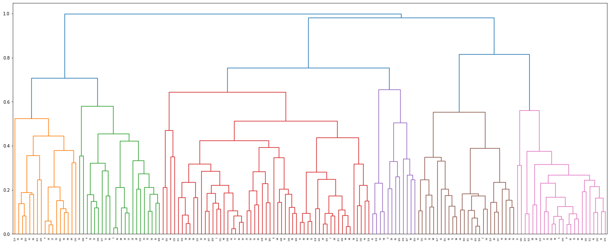

# 챔피언 군집화

이번 강의에선 각 챔피언을 군집화하여 특정 챔피언을 선호하는 사람에게 다른 챔피언을 추천할 수 있게 분석을 하였다.

챔피언 군집화 기준으론 챔피언별 구입한로 아이템을 사용한다.

정확하게 이번 강의는 출력할 형태를 알려주고 직접 코드를 작성하는 방식으로 7,8일차 동안 진행하였다.


```python
# 패키지 로드
import os
import numpy as np
import pandas as pd
# import pymysql
import requests
import math
from matplotlib import pyplot as plt
from scipy.cluster.hierarchy import dendrogram, linkage, fcluster
```


```python
# 라이엇 개발자 페이지에서 게임 상수 최신 버전 정보 가져오기
constant_patch = requests.get("https://ddragon.leagueoflegends.com/api/versions.json").json()[0]

# constant_patch == '11.16.1'

# 라이엇 개발자 페이지에서 최신 버전 한국 서버 아이템 정보 가져오기
item_info = requests.get(f"http://ddragon.leagueoflegends.com/cdn/{constant_patch}/data/ko_KR/item.json").json()

# 라이엇 개발자 페이지에서 최신 버전 한국 서버 챔피언 정보 가져오기
champion_info = requests.get(f"http://ddragon.leagueoflegends.com/cdn/{constant_patch}/data/ko_KR/champion.json").json()

# item_info, champion_info는 json형태
```

- 항상 최신 버전을 불러오기 위해 버전 정보를 변수로 사용하여 아이템, 챔피언 정보를 불러왔다.


```python
# 챔피언 정보 => DataFrame으로 변환
champion_df = pd.DataFrame(champion_info['data']).T[['key','name']]
champion_df = champion_df.reset_index(drop=True)
# champion_df는 'key'로 id값, 'name'으로 챔피언 한국어 이름을 가지는 156rows짜리 DataFrame

# champion_df의 'key' column string => numeric 변환
champion_df['key'] = pd.to_numeric(champion_df['key'])
```

## 1. 아이템 가격 데이터

우선 각 아이템의 가격 데이터를 만들 것이다.

아이템은 하위템이 존재하고 여기서 작업하는 바는 특정 템의 하위템과 조합비용 등을 출력하는 것이다.

자세한 것은 조금 후에 알 수 있다.

### 1.1 방법1 (보완필요)

우선 이 방법은 처음 가이드라인으로 준 방식이 아닌 완전 새롭게 해보려고 직접 작성한 코드이다.

뒤의 결과로 나타나지만 약간의 보완은 필요하지만 괜찮은 방법인 것 같다.

방법2가 가이드라인이고 자세한 설명이 적혀있다.


```python
# consumed가 null인 경우만
item = pd.DataFrame(item_info['data']).T[['name','gold','tags','from','consumed']]
item2 = item[item["consumed"].isnull()].drop(columns="consumed", axis=1)
item2
```


<div>
<style scoped>
    .dataframe tbody tr th:only-of-type {
        vertical-align: middle;
    }

    .dataframe tbody tr th {
        vertical-align: top;
    }

    .dataframe thead th {
        text-align: right;
    }
</style>
<table border="1" class="dataframe">
  <thead>
    <tr style="text-align: right;">
      <th></th>
      <th>name</th>
      <th>gold</th>
      <th>tags</th>
      <th>from</th>
    </tr>
  </thead>
  <tbody>
    <tr>
      <th>1001</th>
      <td>장화</td>
      <td>{'base': 300, 'purchasable': True, 'total': 30...</td>
      <td>[Boots]</td>
      <td>NaN</td>
    </tr>
    <tr>
      <th>1004</th>
      <td>요정의 부적</td>
      <td>{'base': 250, 'purchasable': True, 'total': 25...</td>
      <td>[ManaRegen]</td>
      <td>NaN</td>
    </tr>
    <tr>
      <th>1006</th>
      <td>원기 회복의 구슬</td>
      <td>{'base': 150, 'purchasable': True, 'total': 15...</td>
      <td>[HealthRegen]</td>
      <td>NaN</td>
    </tr>
    <tr>
      <th>1011</th>
      <td>거인의 허리띠</td>
      <td>{'base': 500, 'purchasable': True, 'total': 90...</td>
      <td>[Health]</td>
      <td>[1028]</td>
    </tr>
    <tr>
      <th>1018</th>
      <td>민첩성의 망토</td>
      <td>{'base': 600, 'purchasable': True, 'total': 60...</td>
      <td>[CriticalStrike]</td>
      <td>NaN</td>
    </tr>
    <tr>
      <th>...</th>
      <td>...</td>
      <td>...</td>
      <td>...</td>
      <td>...</td>
    </tr>
    <tr>
      <th>6692</th>
      <td>월식</td>
      <td>{'base': 850, 'purchasable': True, 'total': 32...</td>
      <td>[Damage, LifeSteal, SpellVamp, NonbootsMovemen...</td>
      <td>[3134, 1036, 1053]</td>
    </tr>
    <tr>
      <th>6693</th>
      <td>자객의 발톱</td>
      <td>{'base': 1000, 'purchasable': True, 'total': 3...</td>
      <td>[Damage, Active, CooldownReduction, NonbootsMo...</td>
      <td>[3134, 3133]</td>
    </tr>
    <tr>
      <th>6694</th>
      <td>세릴다의 원한</td>
      <td>{'base': 650, 'purchasable': True, 'total': 32...</td>
      <td>[Damage, CooldownReduction, ArmorPenetration, ...</td>
      <td>[3133, 3035]</td>
    </tr>
    <tr>
      <th>6695</th>
      <td>독사의 송곳니</td>
      <td>{'base': 625, 'purchasable': True, 'total': 26...</td>
      <td>[Damage, ArmorPenetration]</td>
      <td>[3134, 1037]</td>
    </tr>
    <tr>
      <th>8001</th>
      <td>증오의 사슬</td>
      <td>{'base': 800, 'purchasable': True, 'total': 25...</td>
      <td>[Health, Active, CooldownReduction, AbilityHaste]</td>
      <td>[3067, 1011]</td>
    </tr>
  </tbody>
</table>
<p>188 rows × 4 columns</p>
</div>


- 우선 json 파일에 consumed라는 키가 존재하면 제거하였다(소모품).


- `pd.json_normalize()`를 사용하지 않았고 여기서 gold, tags, from 컬럼의 값은 문자가 아닌 dictionary, list이다.


- gold에서 base는 조합비용, total은 전체 구입비용이다.


- 자세한 것은 본인이 직접 뜯어보고 이해하여야 한다.


```python
# tags에 Consumable이 있으면 제외
item3 = item2[item2["tags"].apply(lambda x: False if "Consumable" in x else True)]
item3
```


<div>
<style scoped>
    .dataframe tbody tr th:only-of-type {
        vertical-align: middle;
    }

    .dataframe tbody tr th {
        vertical-align: top;
    }

    .dataframe thead th {
        text-align: right;
    }
</style>
<table border="1" class="dataframe">
  <thead>
    <tr style="text-align: right;">
      <th></th>
      <th>name</th>
      <th>gold</th>
      <th>tags</th>
      <th>from</th>
    </tr>
  </thead>
  <tbody>
    <tr>
      <th>1001</th>
      <td>장화</td>
      <td>{'base': 300, 'purchasable': True, 'total': 30...</td>
      <td>[Boots]</td>
      <td>NaN</td>
    </tr>
    <tr>
      <th>1004</th>
      <td>요정의 부적</td>
      <td>{'base': 250, 'purchasable': True, 'total': 25...</td>
      <td>[ManaRegen]</td>
      <td>NaN</td>
    </tr>
    <tr>
      <th>1006</th>
      <td>원기 회복의 구슬</td>
      <td>{'base': 150, 'purchasable': True, 'total': 15...</td>
      <td>[HealthRegen]</td>
      <td>NaN</td>
    </tr>
    <tr>
      <th>1011</th>
      <td>거인의 허리띠</td>
      <td>{'base': 500, 'purchasable': True, 'total': 90...</td>
      <td>[Health]</td>
      <td>[1028]</td>
    </tr>
    <tr>
      <th>1018</th>
      <td>민첩성의 망토</td>
      <td>{'base': 600, 'purchasable': True, 'total': 60...</td>
      <td>[CriticalStrike]</td>
      <td>NaN</td>
    </tr>
    <tr>
      <th>...</th>
      <td>...</td>
      <td>...</td>
      <td>...</td>
      <td>...</td>
    </tr>
    <tr>
      <th>6692</th>
      <td>월식</td>
      <td>{'base': 850, 'purchasable': True, 'total': 32...</td>
      <td>[Damage, LifeSteal, SpellVamp, NonbootsMovemen...</td>
      <td>[3134, 1036, 1053]</td>
    </tr>
    <tr>
      <th>6693</th>
      <td>자객의 발톱</td>
      <td>{'base': 1000, 'purchasable': True, 'total': 3...</td>
      <td>[Damage, Active, CooldownReduction, NonbootsMo...</td>
      <td>[3134, 3133]</td>
    </tr>
    <tr>
      <th>6694</th>
      <td>세릴다의 원한</td>
      <td>{'base': 650, 'purchasable': True, 'total': 32...</td>
      <td>[Damage, CooldownReduction, ArmorPenetration, ...</td>
      <td>[3133, 3035]</td>
    </tr>
    <tr>
      <th>6695</th>
      <td>독사의 송곳니</td>
      <td>{'base': 625, 'purchasable': True, 'total': 26...</td>
      <td>[Damage, ArmorPenetration]</td>
      <td>[3134, 1037]</td>
    </tr>
    <tr>
      <th>8001</th>
      <td>증오의 사슬</td>
      <td>{'base': 800, 'purchasable': True, 'total': 25...</td>
      <td>[Health, Active, CooldownReduction, AbilityHaste]</td>
      <td>[3067, 1011]</td>
    </tr>
  </tbody>
</table>
<p>184 rows × 4 columns</p>
</div>


- tags는 아이템에 대한 태그 설명으로 Consumable이 존재하면 삭제하여 4건을 더 지웠다.


```python
# item_df 완성
item_df = item3.copy()
item_df["base_gold"] = item3["gold"].apply(lambda x: x['base'])
item_df["total_gold"] = item3["gold"].apply(lambda x: x['total'])

item_df.drop(columns=["gold","tags"], inplace=True)
item_df
```


<div>
<style scoped>
    .dataframe tbody tr th:only-of-type {
        vertical-align: middle;
    }

    .dataframe tbody tr th {
        vertical-align: top;
    }

    .dataframe thead th {
        text-align: right;
    }
</style>
<table border="1" class="dataframe">
  <thead>
    <tr style="text-align: right;">
      <th></th>
      <th>name</th>
      <th>from</th>
      <th>base_gold</th>
      <th>total_gold</th>
    </tr>
  </thead>
  <tbody>
    <tr>
      <th>1001</th>
      <td>장화</td>
      <td>NaN</td>
      <td>300</td>
      <td>300</td>
    </tr>
    <tr>
      <th>1004</th>
      <td>요정의 부적</td>
      <td>NaN</td>
      <td>250</td>
      <td>250</td>
    </tr>
    <tr>
      <th>1006</th>
      <td>원기 회복의 구슬</td>
      <td>NaN</td>
      <td>150</td>
      <td>150</td>
    </tr>
    <tr>
      <th>1011</th>
      <td>거인의 허리띠</td>
      <td>[1028]</td>
      <td>500</td>
      <td>900</td>
    </tr>
    <tr>
      <th>1018</th>
      <td>민첩성의 망토</td>
      <td>NaN</td>
      <td>600</td>
      <td>600</td>
    </tr>
    <tr>
      <th>...</th>
      <td>...</td>
      <td>...</td>
      <td>...</td>
      <td>...</td>
    </tr>
    <tr>
      <th>6692</th>
      <td>월식</td>
      <td>[3134, 1036, 1053]</td>
      <td>850</td>
      <td>3200</td>
    </tr>
    <tr>
      <th>6693</th>
      <td>자객의 발톱</td>
      <td>[3134, 3133]</td>
      <td>1000</td>
      <td>3200</td>
    </tr>
    <tr>
      <th>6694</th>
      <td>세릴다의 원한</td>
      <td>[3133, 3035]</td>
      <td>650</td>
      <td>3200</td>
    </tr>
    <tr>
      <th>6695</th>
      <td>독사의 송곳니</td>
      <td>[3134, 1037]</td>
      <td>625</td>
      <td>2600</td>
    </tr>
    <tr>
      <th>8001</th>
      <td>증오의 사슬</td>
      <td>[3067, 1011]</td>
      <td>800</td>
      <td>2500</td>
    </tr>
  </tbody>
</table>
<p>184 rows × 4 columns</p>
</div>


- 각 아이템의 기본 정보 item_df를 만들었다.


```python
# item_tree 완성
item_tree = pd.DataFrame(item_df["from"].apply(lambda x: pd.Series(x)).stack()).reset_index(level=1, drop=True)
item_tree = item_tree.reset_index()
item_tree.rename(columns={"index":"id", 0:"id_from"}, inplace=True)
item_tree
```


<div>
<style scoped>
    .dataframe tbody tr th:only-of-type {
        vertical-align: middle;
    }

    .dataframe tbody tr th {
        vertical-align: top;
    }

    .dataframe thead th {
        text-align: right;
    }
</style>
<table border="1" class="dataframe">
  <thead>
    <tr style="text-align: right;">
      <th></th>
      <th>id</th>
      <th>id_from</th>
    </tr>
  </thead>
  <tbody>
    <tr>
      <th>0</th>
      <td>1011</td>
      <td>1028</td>
    </tr>
    <tr>
      <th>1</th>
      <td>1031</td>
      <td>1029</td>
    </tr>
    <tr>
      <th>2</th>
      <td>1043</td>
      <td>1042</td>
    </tr>
    <tr>
      <th>3</th>
      <td>1043</td>
      <td>1042</td>
    </tr>
    <tr>
      <th>4</th>
      <td>1053</td>
      <td>1036</td>
    </tr>
    <tr>
      <th>...</th>
      <td>...</td>
      <td>...</td>
    </tr>
    <tr>
      <th>295</th>
      <td>6694</td>
      <td>3035</td>
    </tr>
    <tr>
      <th>296</th>
      <td>6695</td>
      <td>3134</td>
    </tr>
    <tr>
      <th>297</th>
      <td>6695</td>
      <td>1037</td>
    </tr>
    <tr>
      <th>298</th>
      <td>8001</td>
      <td>3067</td>
    </tr>
    <tr>
      <th>299</th>
      <td>8001</td>
      <td>1011</td>
    </tr>
  </tbody>
</table>
<p>300 rows × 2 columns</p>
</div>


- item_tree는 각 아이템의 하위 템을 id_from으로 가지는 데이터 프레임이다.


- stack된 형태로 생성하였으며 하위 템이 없는 아이템은 id에 포함되지 않는다.


```python
# index 컬럼으로 바꿔주기
item_df = item_df.reset_index()
item_df.rename(columns={'index':"id"}, inplace=True)
item_df
```


<div>
<style scoped>
    .dataframe tbody tr th:only-of-type {
        vertical-align: middle;
    }

    .dataframe tbody tr th {
        vertical-align: top;
    }

    .dataframe thead th {
        text-align: right;
    }
</style>
<table border="1" class="dataframe">
  <thead>
    <tr style="text-align: right;">
      <th></th>
      <th>id</th>
      <th>name</th>
      <th>from</th>
      <th>base_gold</th>
      <th>total_gold</th>
    </tr>
  </thead>
  <tbody>
    <tr>
      <th>0</th>
      <td>1001</td>
      <td>장화</td>
      <td>NaN</td>
      <td>300</td>
      <td>300</td>
    </tr>
    <tr>
      <th>1</th>
      <td>1004</td>
      <td>요정의 부적</td>
      <td>NaN</td>
      <td>250</td>
      <td>250</td>
    </tr>
    <tr>
      <th>2</th>
      <td>1006</td>
      <td>원기 회복의 구슬</td>
      <td>NaN</td>
      <td>150</td>
      <td>150</td>
    </tr>
    <tr>
      <th>3</th>
      <td>1011</td>
      <td>거인의 허리띠</td>
      <td>[1028]</td>
      <td>500</td>
      <td>900</td>
    </tr>
    <tr>
      <th>4</th>
      <td>1018</td>
      <td>민첩성의 망토</td>
      <td>NaN</td>
      <td>600</td>
      <td>600</td>
    </tr>
    <tr>
      <th>...</th>
      <td>...</td>
      <td>...</td>
      <td>...</td>
      <td>...</td>
      <td>...</td>
    </tr>
    <tr>
      <th>179</th>
      <td>6692</td>
      <td>월식</td>
      <td>[3134, 1036, 1053]</td>
      <td>850</td>
      <td>3200</td>
    </tr>
    <tr>
      <th>180</th>
      <td>6693</td>
      <td>자객의 발톱</td>
      <td>[3134, 3133]</td>
      <td>1000</td>
      <td>3200</td>
    </tr>
    <tr>
      <th>181</th>
      <td>6694</td>
      <td>세릴다의 원한</td>
      <td>[3133, 3035]</td>
      <td>650</td>
      <td>3200</td>
    </tr>
    <tr>
      <th>182</th>
      <td>6695</td>
      <td>독사의 송곳니</td>
      <td>[3134, 1037]</td>
      <td>625</td>
      <td>2600</td>
    </tr>
    <tr>
      <th>183</th>
      <td>8001</td>
      <td>증오의 사슬</td>
      <td>[3067, 1011]</td>
      <td>800</td>
      <td>2500</td>
    </tr>
  </tbody>
</table>
<p>184 rows × 5 columns</p>
</div>


- 아이템 id를 컬럼으로 바꿔주었다.


```python
#item_df[item_df["id"]=="4643"]
```


```python
# left join으로 하위템에 아이템을 붙혔을 때 하위템이 있는 경우만 남기기
# 즉, 추가한 id_from이 NaN이 아닌 경우
item_tree_full = item_tree
item_tree_new = item_tree

# 하위템에 하위템이 있는 경우를 고려해서 while문으로 작성
while True:
    temp = pd.merge(item_tree_new, item_tree_full, left_on="id_from", right_on="id", how="left")
    temp2 = temp[["id_x","id_from_y"]]

    if temp2["id_from_y"].notnull().sum() == 0:
        break

    item_tree_new = temp2[temp2["id_from_y"].notnull()]
    item_tree_new.rename(columns={"id_x":"id","id_from_y":"id_from"}, inplace=True)

# 기존 item_tree에 row를 추가
item_tree_full = pd.concat([item_tree_full, item_tree_new], axis=0)
item_tree_full
```

    C:\Users\ekzm3\anaconda3\lib\site-packages\pandas\core\frame.py:4296: SettingWithCopyWarning: 
    A value is trying to be set on a copy of a slice from a DataFrame
    
    See the caveats in the documentation: https://pandas.pydata.org/pandas-docs/stable/user_guide/indexing.html#returning-a-view-versus-a-copy
      return super().rename(
    


<div>
<style scoped>
    .dataframe tbody tr th:only-of-type {
        vertical-align: middle;
    }

    .dataframe tbody tr th {
        vertical-align: top;
    }

    .dataframe thead th {
        text-align: right;
    }
</style>
<table border="1" class="dataframe">
  <thead>
    <tr style="text-align: right;">
      <th></th>
      <th>id</th>
      <th>id_from</th>
    </tr>
  </thead>
  <tbody>
    <tr>
      <th>0</th>
      <td>1011</td>
      <td>1028</td>
    </tr>
    <tr>
      <th>1</th>
      <td>1031</td>
      <td>1029</td>
    </tr>
    <tr>
      <th>2</th>
      <td>1043</td>
      <td>1042</td>
    </tr>
    <tr>
      <th>3</th>
      <td>1043</td>
      <td>1042</td>
    </tr>
    <tr>
      <th>4</th>
      <td>1053</td>
      <td>1036</td>
    </tr>
    <tr>
      <th>...</th>
      <td>...</td>
      <td>...</td>
    </tr>
    <tr>
      <th>369</th>
      <td>6694</td>
      <td>1036</td>
    </tr>
    <tr>
      <th>370</th>
      <td>6695</td>
      <td>1036</td>
    </tr>
    <tr>
      <th>371</th>
      <td>6695</td>
      <td>1036</td>
    </tr>
    <tr>
      <th>373</th>
      <td>8001</td>
      <td>1028</td>
    </tr>
    <tr>
      <th>374</th>
      <td>8001</td>
      <td>1028</td>
    </tr>
  </tbody>
</table>
<p>507 rows × 2 columns</p>
</div>


- 위 과정은 item_tree에서 하위템의 하위템이 존재하니 이를 merge를 통해 최종 하위템을 붙혀준다.


- while을 사용한 이유는 하위템의 하위템의 하위템... 등 때문이나 여기선 한번만 작동한다.


- 현재 라이엇 아이템은 최종 - 하위 - 하위 구조로 이루어져 있기 때문이다.


- 기존 300개의 item_tree에서 207개의 row가 추가되었다.


```python
# 자기 자신 추가해주기
id_self = pd.DataFrame([item_tree_full["id"].unique(), item_tree_full["id"].unique()]).T
id_self.columns = item_tree_full.columns
item_tree_full = pd.concat([item_tree_full, id_self], axis=0)
item_tree_full = item_tree_full.sort_values(by="id")
item_tree_full
```


<div>
<style scoped>
    .dataframe tbody tr th:only-of-type {
        vertical-align: middle;
    }

    .dataframe tbody tr th {
        vertical-align: top;
    }

    .dataframe thead th {
        text-align: right;
    }
</style>
<table border="1" class="dataframe">
  <thead>
    <tr style="text-align: right;">
      <th></th>
      <th>id</th>
      <th>id_from</th>
    </tr>
  </thead>
  <tbody>
    <tr>
      <th>0</th>
      <td>1011</td>
      <td>1028</td>
    </tr>
    <tr>
      <th>0</th>
      <td>1011</td>
      <td>1011</td>
    </tr>
    <tr>
      <th>1</th>
      <td>1031</td>
      <td>1029</td>
    </tr>
    <tr>
      <th>1</th>
      <td>1031</td>
      <td>1031</td>
    </tr>
    <tr>
      <th>2</th>
      <td>1043</td>
      <td>1042</td>
    </tr>
    <tr>
      <th>...</th>
      <td>...</td>
      <td>...</td>
    </tr>
    <tr>
      <th>373</th>
      <td>8001</td>
      <td>1028</td>
    </tr>
    <tr>
      <th>374</th>
      <td>8001</td>
      <td>1028</td>
    </tr>
    <tr>
      <th>299</th>
      <td>8001</td>
      <td>1011</td>
    </tr>
    <tr>
      <th>298</th>
      <td>8001</td>
      <td>3067</td>
    </tr>
    <tr>
      <th>131</th>
      <td>8001</td>
      <td>8001</td>
    </tr>
  </tbody>
</table>
<p>639 rows × 2 columns</p>
</div>


- 자기 자신을 추가하였다.


- 예를 들면 유령무희 - 유령무희를 추가해두었다.


- 이런 형태를 만든 이유는 조합비용 컬럼을 사용하기 위함이다.


```python
# 아이템별 골드 추가해주기
#pd.merge(item_tree_full)
item_tree_full2 = pd.merge(item_tree_full, item_df, left_on="id_from", right_on="id")
item_tree_full2
```


<div>
<style scoped>
    .dataframe tbody tr th:only-of-type {
        vertical-align: middle;
    }

    .dataframe tbody tr th {
        vertical-align: top;
    }

    .dataframe thead th {
        text-align: right;
    }
</style>
<table border="1" class="dataframe">
  <thead>
    <tr style="text-align: right;">
      <th></th>
      <th>id_x</th>
      <th>id_from</th>
      <th>id_y</th>
      <th>name</th>
      <th>from</th>
      <th>base_gold</th>
      <th>total_gold</th>
    </tr>
  </thead>
  <tbody>
    <tr>
      <th>0</th>
      <td>1011</td>
      <td>1028</td>
      <td>1028</td>
      <td>루비 수정</td>
      <td>NaN</td>
      <td>400</td>
      <td>400</td>
    </tr>
    <tr>
      <th>1</th>
      <td>2065</td>
      <td>1028</td>
      <td>1028</td>
      <td>루비 수정</td>
      <td>NaN</td>
      <td>400</td>
      <td>400</td>
    </tr>
    <tr>
      <th>2</th>
      <td>3001</td>
      <td>1028</td>
      <td>1028</td>
      <td>루비 수정</td>
      <td>NaN</td>
      <td>400</td>
      <td>400</td>
    </tr>
    <tr>
      <th>3</th>
      <td>3044</td>
      <td>1028</td>
      <td>1028</td>
      <td>루비 수정</td>
      <td>NaN</td>
      <td>400</td>
      <td>400</td>
    </tr>
    <tr>
      <th>4</th>
      <td>3050</td>
      <td>1028</td>
      <td>1028</td>
      <td>루비 수정</td>
      <td>NaN</td>
      <td>400</td>
      <td>400</td>
    </tr>
    <tr>
      <th>...</th>
      <td>...</td>
      <td>...</td>
      <td>...</td>
      <td>...</td>
      <td>...</td>
      <td>...</td>
      <td>...</td>
    </tr>
    <tr>
      <th>633</th>
      <td>6692</td>
      <td>6692</td>
      <td>6692</td>
      <td>월식</td>
      <td>[3134, 1036, 1053]</td>
      <td>850</td>
      <td>3200</td>
    </tr>
    <tr>
      <th>634</th>
      <td>6693</td>
      <td>6693</td>
      <td>6693</td>
      <td>자객의 발톱</td>
      <td>[3134, 3133]</td>
      <td>1000</td>
      <td>3200</td>
    </tr>
    <tr>
      <th>635</th>
      <td>6694</td>
      <td>6694</td>
      <td>6694</td>
      <td>세릴다의 원한</td>
      <td>[3133, 3035]</td>
      <td>650</td>
      <td>3200</td>
    </tr>
    <tr>
      <th>636</th>
      <td>6695</td>
      <td>6695</td>
      <td>6695</td>
      <td>독사의 송곳니</td>
      <td>[3134, 1037]</td>
      <td>625</td>
      <td>2600</td>
    </tr>
    <tr>
      <th>637</th>
      <td>8001</td>
      <td>8001</td>
      <td>8001</td>
      <td>증오의 사슬</td>
      <td>[3067, 1011]</td>
      <td>800</td>
      <td>2500</td>
    </tr>
  </tbody>
</table>
<p>638 rows × 7 columns</p>
</div>


```python
item_tree_full3 = item_tree_full2.groupby(["id_x", "id_from"]).sum().reset_index()
item_tree_full3 = item_tree_full3[["id_x","id_from","base_gold"]]
item_tree_full3.rename(columns={"id_x":"id"}, inplace=True)
#temp[temp["id"]=="3046"]
item_tree_full3
```


<div>
<style scoped>
    .dataframe tbody tr th:only-of-type {
        vertical-align: middle;
    }

    .dataframe tbody tr th {
        vertical-align: top;
    }

    .dataframe thead th {
        text-align: right;
    }
</style>
<table border="1" class="dataframe">
  <thead>
    <tr style="text-align: right;">
      <th></th>
      <th>id</th>
      <th>id_from</th>
      <th>base_gold</th>
    </tr>
  </thead>
  <tbody>
    <tr>
      <th>0</th>
      <td>1011</td>
      <td>1011</td>
      <td>500</td>
    </tr>
    <tr>
      <th>1</th>
      <td>1011</td>
      <td>1028</td>
      <td>400</td>
    </tr>
    <tr>
      <th>2</th>
      <td>1031</td>
      <td>1029</td>
      <td>300</td>
    </tr>
    <tr>
      <th>3</th>
      <td>1031</td>
      <td>1031</td>
      <td>500</td>
    </tr>
    <tr>
      <th>4</th>
      <td>1043</td>
      <td>1042</td>
      <td>600</td>
    </tr>
    <tr>
      <th>...</th>
      <td>...</td>
      <td>...</td>
      <td>...</td>
    </tr>
    <tr>
      <th>537</th>
      <td>6695</td>
      <td>6695</td>
      <td>625</td>
    </tr>
    <tr>
      <th>538</th>
      <td>8001</td>
      <td>1011</td>
      <td>500</td>
    </tr>
    <tr>
      <th>539</th>
      <td>8001</td>
      <td>1028</td>
      <td>800</td>
    </tr>
    <tr>
      <th>540</th>
      <td>8001</td>
      <td>3067</td>
      <td>400</td>
    </tr>
    <tr>
      <th>541</th>
      <td>8001</td>
      <td>8001</td>
      <td>800</td>
    </tr>
  </tbody>
</table>
<p>542 rows × 3 columns</p>
</div>


- 각 아이템, 하위템별로 골드 합계를 구하였다.


- 예를 들어 유령무희는 하위템으로 단검이 2개 필요하기에 이를 반영한 것이다.


- 여기서 id별로 합계를 구하면 해당 아이템의 전체 비용을 구할 수 있을 것이다.

### 1.2 방법2


```python
# pd.json_normalize(item_info['data']['1011'], record_path=["tags"])
```


```python
# 아이템 정보 => DataFrame으로 변환
item_df = pd.DataFrame(columns=['id','name','gold'])

# item_df는 아이템의 숫자 id, 한국어 이름(name) 및 조합비(직전 하위템 전부 갖고 있을 때 완성템을 조합할 때 드는 비용)를 가지는 DataFrame

item_tree = pd.DataFrame(columns=['id','id_from'])

# item_tree는 아이템의 숫자 id, 직전 하위템 리스트(id_from)를 가지는 DataFrame
# 예시: 유령 무희(2600G) = 롱소드(350G) + 열정의 검(1050G) + 롱소드(350G) + 850G이므로 유령 무희에 대한 rows가 3개 나옴

for item_id in item_info['data']:
    # Consumable한 아이템(체력 물약 등) 제외
    # 'tags'에 'Consumable' 정보가 없는 아이템에 대해서만 수행
    if item_info['data'][item_id]['tags'].count("Consumable") == 0:
        try:
            # 'consumed' 필드가 있는 아이템(비스킷)은 하단 코드가 실행되지 않고 continue로 바로 다음 item_id로 넘어감
            item_info['data'][item_id]['consumed']
            #작성#
            continue
        except:
            pass
        
        # 아이템명 및 조합비
        # id, name, gold 3개 필드를 가지게끔 json parsing
        name = item_info['data'][item_id]['name']
        base_gold = item_info['data'][item_id]['gold']["base"]
        
        item_row = pd.DataFrame([item_id, name, base_gold]).T
        item_row.columns = item_df.columns
        
        item_df = pd.concat([item_df,item_row])

        # 직전 하위템
        try:
            # 'from' 필드에 있는 항목을 각각 하나의 row로 가지는 item_row_tree DataFrame 생성
            item_row_tree = pd.DataFrame()
            item_row_tree["id_from"] = item_info['data'][item_id]['from']
            item_row_tree["id"] = item_id
            item_row_tree = item_row_tree[["id","id_from"]]
            # 작성
            ###
            item_tree = pd.concat([item_tree, item_row_tree])
        # 하위템이 없는 경우 생략
        except Exception:
            pass
```

- 이 부분은 가이드라인을 보고 내가 생각한대로 작성한 코드이다.


```python
# 아이템 정보 => DataFrame으로 변환
item_df = pd.DataFrame(columns=['id','name','gold'])

# item_df는 아이템의 숫자 id, 한국어 이름(name) 및 조합비(직전 하위템 전부 갖고 있을 때 완성템을 조합할 때 드는 비용)를 가지는 DataFrame

item_tree = pd.DataFrame(columns=['id','id_from'])

# item_tree는 아이템의 숫자 id, 직전 하위템 리스트(id_from)를 가지는 DataFrame
# 예시: 유령 무희(2600G) = 롱소드(350G) + 열정의 검(1050G) + 롱소드(350G) + 850G이므로 유령 무희에 대한 rows가 3개 나옴

for item_id in item_info['data']:
    # Consumable한 아이템(체력 물약 등) 제외
    # 'tags'에 'Consumable' 정보가 없는 아이템에 대해서만 수행
    if "Consumable" not in pd.json_normalize(item_info['data'][item_id],record_path=['tags']).values:
        try:
            # 'consumed' 필드가 있는 아이템(비스킷)은 하단 코드가 실행되지 않고 continue로 바로 다음 item_id로 넘어감
            pd.json_normalize(item_info['data'][item_id]).consumed
            #작성#
            continue
        except:
            pass
        
        # 아이템명 및 조합비
        # id, name, gold 3개 필드를 가지게끔 json parsing
        item_row = pd.json_normalize(item_info['data'][item_id])[['name','gold.base']]
        item_row["id"] = item_id
        item_row.rename(columns={"gold.base":"gold"},inplace=True)
        
        
        item_df = pd.concat([item_df,item_row])

        # 직전 하위템
        try:
            # 'from' 필드에 있는 항목을 각각 하나의 row로 가지는 item_row_tree DataFrame 생성
            item_row_tree = pd.json_normalize(item_info['data'][item_id], record_path=["from"])
            item_row_tree.rename(columns={0:"id_from"},inplace=True)
            item_row_tree["id"] = item_id
            
            # 작성
            ###
            item_tree = pd.concat([item_tree, item_row_tree])
        # 하위템이 없는 경우 생략
        except Exception:
            pass
```

    <ipython-input-16-1135ef07f429>:14: FutureWarning: elementwise comparison failed; returning scalar instead, but in the future will perform elementwise comparison
      if "Consumable" not in pd.json_normalize(item_info['data'][item_id],record_path=['tags']).values:
    

- 이건 강사님께서 시간을 주신 후 설명해주신 방법대로 작성한 코드이다.


- `pd.json_normalize()`를 사용한 방식이 다르다.


- 강사님이 적어주신 주석을 통해 출력할 데이터 프레임 형태를 만들었다.


- 앞서 방법1은 이를 알고 새로 작성한 것이기에 설명이 부족했을 수 있겠다.


```python
item_df
```


<div>
<style scoped>
    .dataframe tbody tr th:only-of-type {
        vertical-align: middle;
    }

    .dataframe tbody tr th {
        vertical-align: top;
    }

    .dataframe thead th {
        text-align: right;
    }
</style>
<table border="1" class="dataframe">
  <thead>
    <tr style="text-align: right;">
      <th></th>
      <th>id</th>
      <th>name</th>
      <th>gold</th>
    </tr>
  </thead>
  <tbody>
    <tr>
      <th>0</th>
      <td>1001</td>
      <td>장화</td>
      <td>300</td>
    </tr>
    <tr>
      <th>0</th>
      <td>1004</td>
      <td>요정의 부적</td>
      <td>250</td>
    </tr>
    <tr>
      <th>0</th>
      <td>1006</td>
      <td>원기 회복의 구슬</td>
      <td>150</td>
    </tr>
    <tr>
      <th>0</th>
      <td>1011</td>
      <td>거인의 허리띠</td>
      <td>500</td>
    </tr>
    <tr>
      <th>0</th>
      <td>1018</td>
      <td>민첩성의 망토</td>
      <td>600</td>
    </tr>
    <tr>
      <th>...</th>
      <td>...</td>
      <td>...</td>
      <td>...</td>
    </tr>
    <tr>
      <th>0</th>
      <td>6692</td>
      <td>월식</td>
      <td>850</td>
    </tr>
    <tr>
      <th>0</th>
      <td>6693</td>
      <td>자객의 발톱</td>
      <td>1000</td>
    </tr>
    <tr>
      <th>0</th>
      <td>6694</td>
      <td>세릴다의 원한</td>
      <td>650</td>
    </tr>
    <tr>
      <th>0</th>
      <td>6695</td>
      <td>독사의 송곳니</td>
      <td>625</td>
    </tr>
    <tr>
      <th>0</th>
      <td>8001</td>
      <td>증오의 사슬</td>
      <td>800</td>
    </tr>
  </tbody>
</table>
<p>184 rows × 3 columns</p>
</div>


```python
item_tree
```


<div>
<style scoped>
    .dataframe tbody tr th:only-of-type {
        vertical-align: middle;
    }

    .dataframe tbody tr th {
        vertical-align: top;
    }

    .dataframe thead th {
        text-align: right;
    }
</style>
<table border="1" class="dataframe">
  <thead>
    <tr style="text-align: right;">
      <th></th>
      <th>id</th>
      <th>id_from</th>
    </tr>
  </thead>
  <tbody>
    <tr>
      <th>0</th>
      <td>1011</td>
      <td>1028</td>
    </tr>
    <tr>
      <th>0</th>
      <td>1031</td>
      <td>1029</td>
    </tr>
    <tr>
      <th>0</th>
      <td>1043</td>
      <td>1042</td>
    </tr>
    <tr>
      <th>1</th>
      <td>1043</td>
      <td>1042</td>
    </tr>
    <tr>
      <th>0</th>
      <td>1053</td>
      <td>1036</td>
    </tr>
    <tr>
      <th>...</th>
      <td>...</td>
      <td>...</td>
    </tr>
    <tr>
      <th>1</th>
      <td>6694</td>
      <td>3035</td>
    </tr>
    <tr>
      <th>0</th>
      <td>6695</td>
      <td>3134</td>
    </tr>
    <tr>
      <th>1</th>
      <td>6695</td>
      <td>1037</td>
    </tr>
    <tr>
      <th>0</th>
      <td>8001</td>
      <td>3067</td>
    </tr>
    <tr>
      <th>1</th>
      <td>8001</td>
      <td>1011</td>
    </tr>
  </tbody>
</table>
<p>300 rows × 2 columns</p>
</div>


```python
item_tree_full = item_tree
item_tree_new = item_tree

# 가장 하위 아이템까지 full 아이템트리 및 각 재료 아이템에 소모되는 골드를 item_tree_full DataFrame에 저장
# 예시로 이 셀 최종 시점에 유령 무희에 대해서는 다음과 같은 rows가 나옴
# id            | id_from          | gold
# 3046(유령 무희) | 3046(유령 무희)    | 850
# 3046(유령 무희) | 3086(열정의 검)    | 150
# 3046(유령 무희) | 1036(롱소드)       | 700
# 3046(유령 무희) | 1018(민첩성의 망토) | 600
# 3046(유령 무희) | 1042(단검)        | 300

while True:
    # item_tree_new에 item_tree를 merge해서 방금 추가한 하위템보다 한 depth 아래의 하위템 리스트 추출
    item_tree_new = item_tree_new.merge(item_tree, left_on="id_from",right_on="id")[["id_x","id_from_y"]].rename(columns={"id_x":"id","id_from_y":"id_from"})
    
    # 모두 재료템만 남았으면 종료
    if len(item_tree_new) == 0:
        break
    item_tree_full = pd.concat([item_tree_full, item_tree_new])

# 자기자신을 리스트에 추가
item_tree_new['id']=item_df['id']
item_tree_new['id_from']=item_df['id']
item_tree_full = pd.concat([item_tree_full, item_tree_new])

# 각 아이템의 조합비를 merge
item_tree_full = item_tree_full.merge(item_df, left_on="id_from",right_on="id")[["id_x","id_from","gold"]].rename(columns={"id_x":"id"})

# 중복되는 row가 발생할 시 gold 수치를 합쳐서 중복되는 row 제거
item_tree_full = item_tree_full.groupby(["id","id_from"], as_index=False).sum("gold")

# 유령 무희 | 롱소드 | 350
# 유령 무희 | 롱소드 | 350
# -->
# 유령 무희 | 롱소드 | 700
```


```python
item_tree_full
```


<div>
<style scoped>
    .dataframe tbody tr th:only-of-type {
        vertical-align: middle;
    }

    .dataframe tbody tr th {
        vertical-align: top;
    }

    .dataframe thead th {
        text-align: right;
    }
</style>
<table border="1" class="dataframe">
  <thead>
    <tr style="text-align: right;">
      <th></th>
      <th>id</th>
      <th>id_from</th>
      <th>gold</th>
    </tr>
  </thead>
  <tbody>
    <tr>
      <th>0</th>
      <td>1001</td>
      <td>1001</td>
      <td>300</td>
    </tr>
    <tr>
      <th>1</th>
      <td>1004</td>
      <td>1004</td>
      <td>250</td>
    </tr>
    <tr>
      <th>2</th>
      <td>1006</td>
      <td>1006</td>
      <td>150</td>
    </tr>
    <tr>
      <th>3</th>
      <td>1011</td>
      <td>1011</td>
      <td>500</td>
    </tr>
    <tr>
      <th>4</th>
      <td>1011</td>
      <td>1028</td>
      <td>400</td>
    </tr>
    <tr>
      <th>...</th>
      <td>...</td>
      <td>...</td>
      <td>...</td>
    </tr>
    <tr>
      <th>589</th>
      <td>6695</td>
      <td>6695</td>
      <td>625</td>
    </tr>
    <tr>
      <th>590</th>
      <td>8001</td>
      <td>1011</td>
      <td>500</td>
    </tr>
    <tr>
      <th>591</th>
      <td>8001</td>
      <td>1028</td>
      <td>800</td>
    </tr>
    <tr>
      <th>592</th>
      <td>8001</td>
      <td>3067</td>
      <td>400</td>
    </tr>
    <tr>
      <th>593</th>
      <td>8001</td>
      <td>8001</td>
      <td>800</td>
    </tr>
  </tbody>
</table>
<p>594 rows × 3 columns</p>
</div>


- 여기까지 최종적으로 아이템 가격 데이터를 만들었다.


- 그런데 방법1과는 다르게 row가 594개이다.


- 이는 item_tree의 경우 하위템이 없으면 id가 없는데 강사님은 이런 경우도 추가한 것이다.


- 나의 경우 row가 더 작은데 나는 하위템이 없는 경우는 추가하지 않았기 때문이다.


- 뒤에 작업시 강사님 형태로 만드는 것이 편하기에 방법1은 약간의 보완이 필요한 것이다.


```python
# string => numeric 형변환
item_df['id'] = pd.to_numeric(item_df['id'])
item_tree_full['id'] = pd.to_numeric(item_tree_full['id'])
item_tree_full['id_from'] = pd.to_numeric(item_tree_full['id_from'])
```


```python
# 메모리 확보를 위해 사용하지 않을 변수 삭제
del constant_patch
del champion_info
del item_id
del item_info
del item_row
del item_row_tree
del item_tree
del item_tree_new
```


```python
# # OPGG Database에 connection 생성
# con = pymysql.connect(
#     user = os.environ['LOL_KR_ID'],
#     passwd = os.environ['LOL_KR_PW'],
#     host = os.environ['LOL_KR_HOST'],
#     db = 'lol',
#     charset = 'utf8'
# )
# cursor = con.cursor(pymysql.cursors.DictCursor)
```


```python
# # 패치 날짜 데이터 불러오기
# cursor.execute('''
# SELECT version, date
# FROM lolVersionHistory
# ''')
# patchDate = cursor.fetchall()

# patchDate = pd.DataFrame(patchDate)

# # version => season, patch로 가공, 세부 버전(핫픽스, 밸런싱 X 패치 등) 제거
# patchDate['season'] = pd.to_numeric(patchDate['version'].str.split('.').str[0])
# patchDate['patch'] = pd.to_numeric(patchDate['version'].str.split('.').str[1])
# patchDate = patchDate.groupby(['season','patch'],as_index=False).min('date').drop('version', axis = 1).sort_values(['season','patch'])
```


```python
# # 현재 패치 칼바람 챔피언&아이템 데이터 불러오기
# cursor.execute('''
# SELECT STRAIGHT_JOIN championId, item0, item1, item2, item3, item4, item5
# FROM opGame o FORCE INDEX (ix_createDate),
# p_opGameStats p FORCE INDEX (`PRIMARY`)
# WHERE o.gameId = p.gameId
# AND o.createDate >= '{lastpatch}'
# AND p.createDate >= '{lastpatch}'
# AND subType = 450
# '''.format(lastpatch=pd.to_datetime(patchDate['date'].tail(1).values[0])))
# gamestats = cursor.fetchall()

# gamestats = pd.DataFrame(gamestats)

# # # csv로 저장
# # gamestats.to_csv("gamestats.csv", mode='w')
```

## 2. 플레이 정보

OPGG 데이터베이스에 있는 데이터를 이용해 챔피언별로 어떤 아이템을 샀는지 확인할 것이다.


```python
# csv 파일에서 가져오기
gamestats = pd.read_csv('Day07_01_gamestats.csv').drop('Unnamed: 0',axis=1)
gamestats.head()
```


<div>
<style scoped>
    .dataframe tbody tr th:only-of-type {
        vertical-align: middle;
    }

    .dataframe tbody tr th {
        vertical-align: top;
    }

    .dataframe thead th {
        text-align: right;
    }
</style>
<table border="1" class="dataframe">
  <thead>
    <tr style="text-align: right;">
      <th></th>
      <th>championId</th>
      <th>item0</th>
      <th>item1</th>
      <th>item2</th>
      <th>item3</th>
      <th>item4</th>
      <th>item5</th>
    </tr>
  </thead>
  <tbody>
    <tr>
      <th>0</th>
      <td>43</td>
      <td>6653</td>
      <td>3089</td>
      <td>0</td>
      <td>0</td>
      <td>2422</td>
      <td>0</td>
    </tr>
    <tr>
      <th>1</th>
      <td>517</td>
      <td>2420</td>
      <td>0</td>
      <td>6656</td>
      <td>1052</td>
      <td>3191</td>
      <td>3111</td>
    </tr>
    <tr>
      <th>2</th>
      <td>122</td>
      <td>6630</td>
      <td>3111</td>
      <td>3044</td>
      <td>1037</td>
      <td>1028</td>
      <td>0</td>
    </tr>
    <tr>
      <th>3</th>
      <td>80</td>
      <td>2031</td>
      <td>3111</td>
      <td>3134</td>
      <td>6692</td>
      <td>3123</td>
      <td>0</td>
    </tr>
    <tr>
      <th>4</th>
      <td>7</td>
      <td>1026</td>
      <td>2031</td>
      <td>0</td>
      <td>3020</td>
      <td>4628</td>
      <td>3802</td>
    </tr>
  </tbody>
</table>
</div>


```python
gamestats.shape
```


    (12700160, 7)


- 약 1,270만 데이터로 각 챔피언이 게임별로 어떤 아이템을 샀는지 확인 가능하다.


```python
# 아이템 컬럼 하나로 모으기
# 'pandas.melt'라는 함수를 적용
# gamestats에 item0 ~ item5로 나와있는 컬럼을 item 컬럼으로 합쳐서 한 소환사당 1*6 형태로 된 DataFrame을 6*1로 변환
# gamestats.set_index("championId").stack().reset_index().drop("level_1", axis=1)
itemstats = pd.melt(gamestats, id_vars=['championId'], value_name='item').drop("variable", axis=1)

# itemstats에는 챔피언id가 'championId'로, 구매한 아이템이 'item' column으로 들어감

# 빈 값(0) 지우기
itemstats = itemstats[itemstats.item != 0]
```


```python
itemstats.head()
```


<div>
<style scoped>
    .dataframe tbody tr th:only-of-type {
        vertical-align: middle;
    }

    .dataframe tbody tr th {
        vertical-align: top;
    }

    .dataframe thead th {
        text-align: right;
    }
</style>
<table border="1" class="dataframe">
  <thead>
    <tr style="text-align: right;">
      <th></th>
      <th>championId</th>
      <th>item</th>
    </tr>
  </thead>
  <tbody>
    <tr>
      <th>0</th>
      <td>43</td>
      <td>6653</td>
    </tr>
    <tr>
      <th>1</th>
      <td>517</td>
      <td>2420</td>
    </tr>
    <tr>
      <th>2</th>
      <td>122</td>
      <td>6630</td>
    </tr>
    <tr>
      <th>3</th>
      <td>80</td>
      <td>2031</td>
    </tr>
    <tr>
      <th>4</th>
      <td>7</td>
      <td>1026</td>
    </tr>
  </tbody>
</table>
</div>


```python
del gamestats
```


```python
# 약간 신비한 신발 => 신발 치환
itemstats.item[itemstats.item == 2422] = 1001

# 초시계 시리즈 => 초시계 치환
itemstats.item[itemstats.item.isin([2419, 2421, 2423, 2424])] = 2420

# 무라마나 => 마나무네 치환
# 대천사의 포옹 => 대천사의 지팡이 치환
itemstats.item[itemstats.item == 3042] = 3004
itemstats.item[itemstats.item == 3040] = 3003

# 오른의 걸작 치환
itemstats.item[itemstats.item == 7000] = 6693
itemstats.item[itemstats.item == 7001] = 6692
itemstats.item[itemstats.item == 7002] = 6691
itemstats.item[itemstats.item == 7003] = 6664
itemstats.item[itemstats.item == 7004] = 3068
itemstats.item[itemstats.item == 7005] = 6662
itemstats.item[itemstats.item == 7006] = 6671
itemstats.item[itemstats.item == 7007] = 6672
itemstats.item[itemstats.item == 7008] = 6673
itemstats.item[itemstats.item == 7009] = 4633
itemstats.item[itemstats.item == 7010] = 4636
itemstats.item[itemstats.item == 7011] = 3152
itemstats.item[itemstats.item == 7012] = 6653
itemstats.item[itemstats.item == 7013] = 6655
itemstats.item[itemstats.item == 7014] = 6656
itemstats.item[itemstats.item == 7015] = 6630
itemstats.item[itemstats.item == 7016] = 6631
itemstats.item[itemstats.item == 7017] = 6632
itemstats.item[itemstats.item == 7018] = 3078
itemstats.item[itemstats.item == 7019] = 3190
itemstats.item[itemstats.item == 7020] = 2065
itemstats.item[itemstats.item == 7021] = 6617
itemstats.item[itemstats.item == 7022] = 4005
```

- 사실상 똑같은 아이템의 id를 바꿔주었다.


```python
itemstats.groupby(["championId","item"], as_index=False).size()
```


<div>
<style scoped>
    .dataframe tbody tr th:only-of-type {
        vertical-align: middle;
    }

    .dataframe tbody tr th {
        vertical-align: top;
    }

    .dataframe thead th {
        text-align: right;
    }
</style>
<table border="1" class="dataframe">
  <thead>
    <tr style="text-align: right;">
      <th></th>
      <th>championId</th>
      <th>item</th>
      <th>size</th>
    </tr>
  </thead>
  <tbody>
    <tr>
      <th>0</th>
      <td>1</td>
      <td>1001</td>
      <td>1857</td>
    </tr>
    <tr>
      <th>1</th>
      <td>1</td>
      <td>1004</td>
      <td>79</td>
    </tr>
    <tr>
      <th>2</th>
      <td>1</td>
      <td>1006</td>
      <td>137</td>
    </tr>
    <tr>
      <th>3</th>
      <td>1</td>
      <td>1011</td>
      <td>1732</td>
    </tr>
    <tr>
      <th>4</th>
      <td>1</td>
      <td>1018</td>
      <td>66</td>
    </tr>
    <tr>
      <th>...</th>
      <td>...</td>
      <td>...</td>
      <td>...</td>
    </tr>
    <tr>
      <th>23671</th>
      <td>887</td>
      <td>6692</td>
      <td>3</td>
    </tr>
    <tr>
      <th>23672</th>
      <td>887</td>
      <td>6693</td>
      <td>2</td>
    </tr>
    <tr>
      <th>23673</th>
      <td>887</td>
      <td>6694</td>
      <td>2</td>
    </tr>
    <tr>
      <th>23674</th>
      <td>887</td>
      <td>6695</td>
      <td>10</td>
    </tr>
    <tr>
      <th>23675</th>
      <td>887</td>
      <td>8001</td>
      <td>81</td>
    </tr>
  </tbody>
</table>
<p>23676 rows × 3 columns</p>
</div>


```python
# 챔피언별로 각 아이템에 투자한 골드 총량 계산

# championId, item를 기준으로 grouping하여 row 수를 'size' column을 만들어 저장
# itemstats = itemstats.groupby(["championId","item"]).size().reset_index()
# itemstats.rename(columns={0:"size"}, inplace=True)
itemstats = itemstats.groupby(["championId","item"], as_index=False).size()

# item_tree_full과 merge하여 각 아이템에 맵핑되는 조합비(gold) column 추가
itemstats = pd.merge(itemstats, item_tree_full, left_on="item", right_on="id", how="left").sort_values(by="championId")

# 해당 아이템의 조합비가 적혀 있는 'gold' column에 해당 아이템을 사는데 소모한 총 골드(gold * size) 덮어쓰기
itemstats['gold'] = itemstats["size"] * itemstats["gold"]

# 이후 계산 알아보기 쉽도록 scaling
# Consine similarity를 쓰기 때문에 value scaling은 영향 없음
itemstats['gold'] = itemstats['gold'] / 1e5

# size column 제거
itemstats = itemstats.drop('size',axis=1)

# item_tree_full과 merge할 때 생긴 중복 row 합치기
# itemstats = itemstats.groupby(['championId','id_from'], as_index=False).apply(lambda x: pd.Series({'gold':sum(x.gold)}))
itemstats = itemstats.groupby(['championId','id_from']).sum()["gold"].reset_index()
```


```python
itemstats.head()
```


<div>
<style scoped>
    .dataframe tbody tr th:only-of-type {
        vertical-align: middle;
    }

    .dataframe tbody tr th {
        vertical-align: top;
    }

    .dataframe thead th {
        text-align: right;
    }
</style>
<table border="1" class="dataframe">
  <thead>
    <tr style="text-align: right;">
      <th></th>
      <th>championId</th>
      <th>id_from</th>
      <th>gold</th>
    </tr>
  </thead>
  <tbody>
    <tr>
      <th>0</th>
      <td>1</td>
      <td>1001.0</td>
      <td>218.1090</td>
    </tr>
    <tr>
      <th>1</th>
      <td>1</td>
      <td>1004.0</td>
      <td>3.8825</td>
    </tr>
    <tr>
      <th>2</th>
      <td>1</td>
      <td>1006.0</td>
      <td>1.3665</td>
    </tr>
    <tr>
      <th>3</th>
      <td>1</td>
      <td>1011.0</td>
      <td>54.4700</td>
    </tr>
    <tr>
      <th>4</th>
      <td>1</td>
      <td>1018.0</td>
      <td>6.7380</td>
    </tr>
  </tbody>
</table>
</div>


```python
# 챔피언 골드 비례 상수 계산
# 각 벡터의 norm을 계산하는 것
championstats = itemstats.groupby('championId',as_index=False).apply(lambda x: pd.Series({'length':
                                                                                         math.sqrt(sum(x.gold**2))}))
```


```python
championstats.head()
```


<div>
<style scoped>
    .dataframe tbody tr th:only-of-type {
        vertical-align: middle;
    }

    .dataframe tbody tr th {
        vertical-align: top;
    }

    .dataframe thead th {
        text-align: right;
    }
</style>
<table border="1" class="dataframe">
  <thead>
    <tr style="text-align: right;">
      <th></th>
      <th>championId</th>
      <th>length</th>
    </tr>
  </thead>
  <tbody>
    <tr>
      <th>0</th>
      <td>1</td>
      <td>2441.439769</td>
    </tr>
    <tr>
      <th>1</th>
      <td>2</td>
      <td>596.649753</td>
    </tr>
    <tr>
      <th>2</th>
      <td>3</td>
      <td>1493.691225</td>
    </tr>
    <tr>
      <th>3</th>
      <td>4</td>
      <td>3376.113961</td>
    </tr>
    <tr>
      <th>4</th>
      <td>5</td>
      <td>1000.377577</td>
    </tr>
  </tbody>
</table>
</div>


```python
# 각 챔피언 간 유사도 계산을 위한 내적(inner product) 계산 수행

# itemstats 자기자신을 아이템 기준으로 merge하여 champion X와 champion Y가 해당 아이템을 사는데 소모한 골드를 한 row에 저장
itemstats = pd.merge(itemstats,itemstats, on="id_from")[["championId_x","championId_y","gold_x","gold_y"]]
# itemstats == [championId_x | championId_y | gold_x | gold_y]

# championId_x > championId_y인 row만 남기기
# itemstats = itemstats[itemstats.apply(lambda x: True if x["championId_x"] > x["championId_y"] else False, axis=1)]
itemstats = itemstats[itemstats["championId_x"] > itemstats["championId_y"]]

# 각 row에 대해 gold_x와 gold_y를 곱해서 gold_prod 컬럼에 저장
itemstats['gold_prod'] = itemstats["gold_x"] * itemstats["gold_y"]

# 다 사용한 gold columns 제거
itemstats = itemstats.drop(['gold_x','gold_y'],axis=1)

# championId_x, championId_y를 기준으로 grouping하여 gold_prod 합 계산
itemstats = itemstats.groupby(["championId_x","championId_y"]).sum("gold_prod").reset_index()
# itemstats == [championId_x | championId_y | gold_prod]
```


```python
# 156 x 155 / 2 
itemstats
```


<div>
<style scoped>
    .dataframe tbody tr th:only-of-type {
        vertical-align: middle;
    }

    .dataframe tbody tr th {
        vertical-align: top;
    }

    .dataframe thead th {
        text-align: right;
    }
</style>
<table border="1" class="dataframe">
  <thead>
    <tr style="text-align: right;">
      <th></th>
      <th>championId_x</th>
      <th>championId_y</th>
      <th>gold_prod</th>
    </tr>
  </thead>
  <tbody>
    <tr>
      <th>0</th>
      <td>2</td>
      <td>1</td>
      <td>1.556730e+05</td>
    </tr>
    <tr>
      <th>1</th>
      <td>3</td>
      <td>1</td>
      <td>1.550968e+06</td>
    </tr>
    <tr>
      <th>2</th>
      <td>3</td>
      <td>2</td>
      <td>5.182713e+05</td>
    </tr>
    <tr>
      <th>3</th>
      <td>4</td>
      <td>1</td>
      <td>7.096273e+06</td>
    </tr>
    <tr>
      <th>4</th>
      <td>4</td>
      <td>2</td>
      <td>3.250152e+05</td>
    </tr>
    <tr>
      <th>...</th>
      <td>...</td>
      <td>...</td>
      <td>...</td>
    </tr>
    <tr>
      <th>12085</th>
      <td>887</td>
      <td>526</td>
      <td>2.063231e+05</td>
    </tr>
    <tr>
      <th>12086</th>
      <td>887</td>
      <td>555</td>
      <td>3.964452e+05</td>
    </tr>
    <tr>
      <th>12087</th>
      <td>887</td>
      <td>777</td>
      <td>2.452904e+05</td>
    </tr>
    <tr>
      <th>12088</th>
      <td>887</td>
      <td>875</td>
      <td>1.136604e+06</td>
    </tr>
    <tr>
      <th>12089</th>
      <td>887</td>
      <td>876</td>
      <td>2.232326e+06</td>
    </tr>
  </tbody>
</table>
<p>12090 rows × 3 columns</p>
</div>


```python
# 챔피언 유사도 및 거리 계산

# itemstats에 championstats를 merge해서 length_x, length_y 컬럼 추가
itemstats = pd.merge(itemstats, championstats, left_on="championId_x",right_on="championId", how="left").rename(columns={"length":"length_x"})
itemstats.drop("championId", axis=1, inplace=True)
itemstats = pd.merge(itemstats, championstats, left_on="championId_y",right_on="championId", how="left").rename(columns={"length":"length_y"})
itemstats.drop("championId", axis=1, inplace=True)
# itemstats == [championId_x | championId_y | gold_prod | length_x | length_y]

# similarity = gold_prod / (length_x * length_y) column 추가
itemstats['similarity'] = itemstats["gold_prod"] / (itemstats["length_x"] * itemstats["length_y"])

# distance = arccos(similarity)/(pi/2) column 추가
itemstats['distance'] = np.arccos(itemstats['similarity']) / (np.pi/2)

# 필요한 column(챔피언간 거리)만 추출
itemstats = itemstats[['championId_x','championId_y','distance']]
```


```python
itemstats
```


<div>
<style scoped>
    .dataframe tbody tr th:only-of-type {
        vertical-align: middle;
    }

    .dataframe tbody tr th {
        vertical-align: top;
    }

    .dataframe thead th {
        text-align: right;
    }
</style>
<table border="1" class="dataframe">
  <thead>
    <tr style="text-align: right;">
      <th></th>
      <th>championId_x</th>
      <th>championId_y</th>
      <th>distance</th>
    </tr>
  </thead>
  <tbody>
    <tr>
      <th>0</th>
      <td>2</td>
      <td>1</td>
      <td>0.931836</td>
    </tr>
    <tr>
      <th>1</th>
      <td>3</td>
      <td>1</td>
      <td>0.720337</td>
    </tr>
    <tr>
      <th>2</th>
      <td>3</td>
      <td>2</td>
      <td>0.604904</td>
    </tr>
    <tr>
      <th>3</th>
      <td>4</td>
      <td>1</td>
      <td>0.339766</td>
    </tr>
    <tr>
      <th>4</th>
      <td>4</td>
      <td>2</td>
      <td>0.896831</td>
    </tr>
    <tr>
      <th>...</th>
      <td>...</td>
      <td>...</td>
      <td>...</td>
    </tr>
    <tr>
      <th>12085</th>
      <td>887</td>
      <td>526</td>
      <td>0.788218</td>
    </tr>
    <tr>
      <th>12086</th>
      <td>887</td>
      <td>555</td>
      <td>0.974986</td>
    </tr>
    <tr>
      <th>12087</th>
      <td>887</td>
      <td>777</td>
      <td>0.956487</td>
    </tr>
    <tr>
      <th>12088</th>
      <td>887</td>
      <td>875</td>
      <td>0.822705</td>
    </tr>
    <tr>
      <th>12089</th>
      <td>887</td>
      <td>876</td>
      <td>0.417589</td>
    </tr>
  </tbody>
</table>
<p>12090 rows × 3 columns</p>
</div>


```python
# distance array 형태로 변환
# index에 주의

# itemstats를 championId_x, championId_y 내림차순으로 정렬하여 'distance' column만 남겨두기
distance_array = itemstats.sort_values(['championId_x','championId_y'], ascending=[False,False])['distance']
```


```python
distance_array
```


    12089    0.417589
    12088    0.822705
    12087    0.956487
    12086    0.974986
    12085    0.788218
               ...   
    4        0.896831
    3        0.339766
    2        0.604904
    1        0.720337
    0        0.931836
    Name: distance, Length: 12090, dtype: float64


```python
# 'complete' 메소드로 h-clustering 수행
Z = linkage(distance_array, 'complete')
```


```python
# 시각화
fig = plt.figure(figsize=(25, 10))
dn = dendrogram(Z)
```


    



```python
# 적당한 개수의 클러스터로 구분
cluster = pd.DataFrame(fcluster(Z,0.6,criterion='distance'))
cluster.columns=['cluster']
```


```python
# 결과 DataFrame 구성

# key column 기준 내림차순으로 된 champion_df.name를 cluster 오른쪽에 concat
result = pd.concat([cluster, champion_df.sort_values(by="key", ascending=False)["name"].reset_index(drop=True)], axis=1)
# result == [cluster | name]
```


```python
# 출력
pd.set_option('display.max_rows', None)
result
```


<div>
<style scoped>
    .dataframe tbody tr th:only-of-type {
        vertical-align: middle;
    }

    .dataframe tbody tr th {
        vertical-align: top;
    }

    .dataframe thead th {
        text-align: right;
    }
</style>
<table border="1" class="dataframe">
  <thead>
    <tr style="text-align: right;">
      <th></th>
      <th>cluster</th>
      <th>name</th>
    </tr>
  </thead>
  <tbody>
    <tr>
      <th>0</th>
      <td>6</td>
      <td>그웬</td>
    </tr>
    <tr>
      <th>1</th>
      <td>4</td>
      <td>릴리아</td>
    </tr>
    <tr>
      <th>2</th>
      <td>7</td>
      <td>세트</td>
    </tr>
    <tr>
      <th>3</th>
      <td>2</td>
      <td>요네</td>
    </tr>
    <tr>
      <th>4</th>
      <td>1</td>
      <td>파이크</td>
    </tr>
    <tr>
      <th>5</th>
      <td>8</td>
      <td>렐</td>
    </tr>
    <tr>
      <th>6</th>
      <td>2</td>
      <td>아펠리오스</td>
    </tr>
    <tr>
      <th>7</th>
      <td>4</td>
      <td>니코</td>
    </tr>
    <tr>
      <th>8</th>
      <td>4</td>
      <td>사일러스</td>
    </tr>
    <tr>
      <th>9</th>
      <td>8</td>
      <td>오른</td>
    </tr>
    <tr>
      <th>10</th>
      <td>2</td>
      <td>자야</td>
    </tr>
    <tr>
      <th>11</th>
      <td>8</td>
      <td>라칸</td>
    </tr>
    <tr>
      <th>12</th>
      <td>3</td>
      <td>바드</td>
    </tr>
    <tr>
      <th>13</th>
      <td>2</td>
      <td>칼리스타</td>
    </tr>
    <tr>
      <th>14</th>
      <td>5</td>
      <td>아이번</td>
    </tr>
    <tr>
      <th>15</th>
      <td>7</td>
      <td>렉사이</td>
    </tr>
    <tr>
      <th>16</th>
      <td>7</td>
      <td>일라오이</td>
    </tr>
    <tr>
      <th>17</th>
      <td>8</td>
      <td>쓰레쉬</td>
    </tr>
    <tr>
      <th>18</th>
      <td>2</td>
      <td>사미라</td>
    </tr>
    <tr>
      <th>19</th>
      <td>4</td>
      <td>유미</td>
    </tr>
    <tr>
      <th>20</th>
      <td>4</td>
      <td>아지르</td>
    </tr>
    <tr>
      <th>21</th>
      <td>5</td>
      <td>나미</td>
    </tr>
    <tr>
      <th>22</th>
      <td>7</td>
      <td>아트록스</td>
    </tr>
    <tr>
      <th>23</th>
      <td>7</td>
      <td>바이</td>
    </tr>
    <tr>
      <th>24</th>
      <td>1</td>
      <td>키아나</td>
    </tr>
    <tr>
      <th>25</th>
      <td>4</td>
      <td>에코</td>
    </tr>
    <tr>
      <th>26</th>
      <td>7</td>
      <td>클레드</td>
    </tr>
    <tr>
      <th>27</th>
      <td>1</td>
      <td>제드</td>
    </tr>
    <tr>
      <th>28</th>
      <td>2</td>
      <td>루시안</td>
    </tr>
    <tr>
      <th>29</th>
      <td>2</td>
      <td>세나</td>
    </tr>
    <tr>
      <th>30</th>
      <td>7</td>
      <td>비에고</td>
    </tr>
    <tr>
      <th>31</th>
      <td>8</td>
      <td>탐 켄치</td>
    </tr>
    <tr>
      <th>32</th>
      <td>2</td>
      <td>징크스</td>
    </tr>
    <tr>
      <th>33</th>
      <td>2</td>
      <td>킨드레드</td>
    </tr>
    <tr>
      <th>34</th>
      <td>2</td>
      <td>진</td>
    </tr>
    <tr>
      <th>35</th>
      <td>8</td>
      <td>브라움</td>
    </tr>
    <tr>
      <th>36</th>
      <td>2</td>
      <td>아크샨</td>
    </tr>
    <tr>
      <th>37</th>
      <td>7</td>
      <td>카밀</td>
    </tr>
    <tr>
      <th>38</th>
      <td>4</td>
      <td>탈리야</td>
    </tr>
    <tr>
      <th>39</th>
      <td>4</td>
      <td>벨코즈</td>
    </tr>
    <tr>
      <th>40</th>
      <td>2</td>
      <td>야스오</td>
    </tr>
    <tr>
      <th>41</th>
      <td>8</td>
      <td>자크</td>
    </tr>
    <tr>
      <th>42</th>
      <td>7</td>
      <td>나르</td>
    </tr>
    <tr>
      <th>43</th>
      <td>4</td>
      <td>세라핀</td>
    </tr>
    <tr>
      <th>44</th>
      <td>3</td>
      <td>카이사</td>
    </tr>
    <tr>
      <th>45</th>
      <td>4</td>
      <td>자이라</td>
    </tr>
    <tr>
      <th>46</th>
      <td>4</td>
      <td>조이</td>
    </tr>
    <tr>
      <th>47</th>
      <td>1</td>
      <td>케인</td>
    </tr>
    <tr>
      <th>48</th>
      <td>4</td>
      <td>아우렐리온 솔</td>
    </tr>
    <tr>
      <th>49</th>
      <td>4</td>
      <td>신드라</td>
    </tr>
    <tr>
      <th>50</th>
      <td>2</td>
      <td>퀸</td>
    </tr>
    <tr>
      <th>51</th>
      <td>4</td>
      <td>다이애나</td>
    </tr>
    <tr>
      <th>52</th>
      <td>4</td>
      <td>리산드라</td>
    </tr>
    <tr>
      <th>53</th>
      <td>1</td>
      <td>제이스</td>
    </tr>
    <tr>
      <th>54</th>
      <td>7</td>
      <td>다리우스</td>
    </tr>
    <tr>
      <th>55</th>
      <td>1</td>
      <td>카직스</td>
    </tr>
    <tr>
      <th>56</th>
      <td>7</td>
      <td>헤카림</td>
    </tr>
    <tr>
      <th>57</th>
      <td>2</td>
      <td>드레이븐</td>
    </tr>
    <tr>
      <th>58</th>
      <td>5</td>
      <td>룰루</td>
    </tr>
    <tr>
      <th>59</th>
      <td>4</td>
      <td>직스</td>
    </tr>
    <tr>
      <th>60</th>
      <td>7</td>
      <td>피오라</td>
    </tr>
    <tr>
      <th>61</th>
      <td>8</td>
      <td>세주아니</td>
    </tr>
    <tr>
      <th>62</th>
      <td>4</td>
      <td>빅토르</td>
    </tr>
    <tr>
      <th>63</th>
      <td>8</td>
      <td>노틸러스</td>
    </tr>
    <tr>
      <th>64</th>
      <td>1</td>
      <td>바루스</td>
    </tr>
    <tr>
      <th>65</th>
      <td>1</td>
      <td>렝가</td>
    </tr>
    <tr>
      <th>66</th>
      <td>8</td>
      <td>볼리베어</td>
    </tr>
    <tr>
      <th>67</th>
      <td>4</td>
      <td>피즈</td>
    </tr>
    <tr>
      <th>68</th>
      <td>2</td>
      <td>그레이브즈</td>
    </tr>
    <tr>
      <th>69</th>
      <td>4</td>
      <td>아리</td>
    </tr>
    <tr>
      <th>70</th>
      <td>4</td>
      <td>쉬바나</td>
    </tr>
    <tr>
      <th>71</th>
      <td>4</td>
      <td>제라스</td>
    </tr>
    <tr>
      <th>72</th>
      <td>4</td>
      <td>럭스</td>
    </tr>
    <tr>
      <th>73</th>
      <td>8</td>
      <td>쉔</td>
    </tr>
    <tr>
      <th>74</th>
      <td>2</td>
      <td>코그모</td>
    </tr>
    <tr>
      <th>75</th>
      <td>7</td>
      <td>리븐</td>
    </tr>
    <tr>
      <th>76</th>
      <td>1</td>
      <td>탈론</td>
    </tr>
    <tr>
      <th>77</th>
      <td>4</td>
      <td>말자하</td>
    </tr>
    <tr>
      <th>78</th>
      <td>8</td>
      <td>레오나</td>
    </tr>
    <tr>
      <th>79</th>
      <td>7</td>
      <td>가렌</td>
    </tr>
    <tr>
      <th>80</th>
      <td>4</td>
      <td>케넨</td>
    </tr>
    <tr>
      <th>81</th>
      <td>6</td>
      <td>아칼리</td>
    </tr>
    <tr>
      <th>82</th>
      <td>7</td>
      <td>요릭</td>
    </tr>
    <tr>
      <th>83</th>
      <td>6</td>
      <td>모데카이저</td>
    </tr>
    <tr>
      <th>84</th>
      <td>1</td>
      <td>이즈리얼</td>
    </tr>
    <tr>
      <th>85</th>
      <td>1</td>
      <td>판테온</td>
    </tr>
    <tr>
      <th>86</th>
      <td>4</td>
      <td>그라가스</td>
    </tr>
    <tr>
      <th>87</th>
      <td>8</td>
      <td>뽀삐</td>
    </tr>
    <tr>
      <th>88</th>
      <td>8</td>
      <td>우디르</td>
    </tr>
    <tr>
      <th>89</th>
      <td>4</td>
      <td>니달리</td>
    </tr>
    <tr>
      <th>90</th>
      <td>6</td>
      <td>나서스</td>
    </tr>
    <tr>
      <th>91</th>
      <td>4</td>
      <td>하이머딩거</td>
    </tr>
    <tr>
      <th>92</th>
      <td>8</td>
      <td>스카너</td>
    </tr>
    <tr>
      <th>93</th>
      <td>4</td>
      <td>카시오페아</td>
    </tr>
    <tr>
      <th>94</th>
      <td>4</td>
      <td>럼블</td>
    </tr>
    <tr>
      <th>95</th>
      <td>2</td>
      <td>베인</td>
    </tr>
    <tr>
      <th>96</th>
      <td>7</td>
      <td>리 신</td>
    </tr>
    <tr>
      <th>97</th>
      <td>4</td>
      <td>브랜드</td>
    </tr>
    <tr>
      <th>98</th>
      <td>7</td>
      <td>오공</td>
    </tr>
    <tr>
      <th>99</th>
      <td>4</td>
      <td>오리아나</td>
    </tr>
    <tr>
      <th>100</th>
      <td>4</td>
      <td>엘리스</td>
    </tr>
    <tr>
      <th>101</th>
      <td>7</td>
      <td>자르반 4세</td>
    </tr>
    <tr>
      <th>102</th>
      <td>7</td>
      <td>레넥톤</td>
    </tr>
    <tr>
      <th>103</th>
      <td>6</td>
      <td>마오카이</td>
    </tr>
    <tr>
      <th>104</th>
      <td>1</td>
      <td>녹턴</td>
    </tr>
    <tr>
      <th>105</th>
      <td>6</td>
      <td>카타리나</td>
    </tr>
    <tr>
      <th>106</th>
      <td>4</td>
      <td>말파이트</td>
    </tr>
    <tr>
      <th>107</th>
      <td>6</td>
      <td>블리츠크랭크</td>
    </tr>
    <tr>
      <th>108</th>
      <td>2</td>
      <td>케이틀린</td>
    </tr>
    <tr>
      <th>109</th>
      <td>4</td>
      <td>스웨인</td>
    </tr>
    <tr>
      <th>110</th>
      <td>7</td>
      <td>트런들</td>
    </tr>
    <tr>
      <th>111</th>
      <td>4</td>
      <td>베이가</td>
    </tr>
    <tr>
      <th>112</th>
      <td>8</td>
      <td>타릭</td>
    </tr>
    <tr>
      <th>113</th>
      <td>4</td>
      <td>카르마</td>
    </tr>
    <tr>
      <th>114</th>
      <td>1</td>
      <td>코르키</td>
    </tr>
    <tr>
      <th>115</th>
      <td>1</td>
      <td>갱플랭크</td>
    </tr>
    <tr>
      <th>116</th>
      <td>4</td>
      <td>잔나</td>
    </tr>
    <tr>
      <th>117</th>
      <td>7</td>
      <td>이렐리아</td>
    </tr>
    <tr>
      <th>118</th>
      <td>4</td>
      <td>카사딘</td>
    </tr>
    <tr>
      <th>119</th>
      <td>5</td>
      <td>소나</td>
    </tr>
    <tr>
      <th>120</th>
      <td>8</td>
      <td>문도 박사</td>
    </tr>
    <tr>
      <th>121</th>
      <td>4</td>
      <td>샤코</td>
    </tr>
    <tr>
      <th>122</th>
      <td>4</td>
      <td>애니비아</td>
    </tr>
    <tr>
      <th>123</th>
      <td>8</td>
      <td>람머스</td>
    </tr>
    <tr>
      <th>124</th>
      <td>8</td>
      <td>아무무</td>
    </tr>
    <tr>
      <th>125</th>
      <td>8</td>
      <td>초가스</td>
    </tr>
    <tr>
      <th>126</th>
      <td>4</td>
      <td>카서스</td>
    </tr>
    <tr>
      <th>127</th>
      <td>2</td>
      <td>트위치</td>
    </tr>
    <tr>
      <th>128</th>
      <td>4</td>
      <td>이블린</td>
    </tr>
    <tr>
      <th>129</th>
      <td>6</td>
      <td>신지드</td>
    </tr>
    <tr>
      <th>130</th>
      <td>4</td>
      <td>질리언</td>
    </tr>
    <tr>
      <th>131</th>
      <td>4</td>
      <td>모르가나</td>
    </tr>
    <tr>
      <th>132</th>
      <td>7</td>
      <td>잭스</td>
    </tr>
    <tr>
      <th>133</th>
      <td>2</td>
      <td>트린다미어</td>
    </tr>
    <tr>
      <th>134</th>
      <td>1</td>
      <td>애쉬</td>
    </tr>
    <tr>
      <th>135</th>
      <td>3</td>
      <td>미스 포츈</td>
    </tr>
    <tr>
      <th>136</th>
      <td>4</td>
      <td>누누와 윌럼프</td>
    </tr>
    <tr>
      <th>137</th>
      <td>7</td>
      <td>워윅</td>
    </tr>
    <tr>
      <th>138</th>
      <td>2</td>
      <td>트리스타나</td>
    </tr>
    <tr>
      <th>139</th>
      <td>4</td>
      <td>티모</td>
    </tr>
    <tr>
      <th>140</th>
      <td>8</td>
      <td>소라카</td>
    </tr>
    <tr>
      <th>141</th>
      <td>1</td>
      <td>시비르</td>
    </tr>
    <tr>
      <th>142</th>
      <td>8</td>
      <td>사이온</td>
    </tr>
    <tr>
      <th>143</th>
      <td>4</td>
      <td>라이즈</td>
    </tr>
    <tr>
      <th>144</th>
      <td>8</td>
      <td>알리스타</td>
    </tr>
    <tr>
      <th>145</th>
      <td>1</td>
      <td>마스터 이</td>
    </tr>
    <tr>
      <th>146</th>
      <td>2</td>
      <td>케일</td>
    </tr>
    <tr>
      <th>147</th>
      <td>4</td>
      <td>피들스틱</td>
    </tr>
    <tr>
      <th>148</th>
      <td>4</td>
      <td>블라디미르</td>
    </tr>
    <tr>
      <th>149</th>
      <td>4</td>
      <td>르블랑</td>
    </tr>
    <tr>
      <th>150</th>
      <td>7</td>
      <td>우르곳</td>
    </tr>
    <tr>
      <th>151</th>
      <td>7</td>
      <td>신 짜오</td>
    </tr>
    <tr>
      <th>152</th>
      <td>3</td>
      <td>트위스티드 페이트</td>
    </tr>
    <tr>
      <th>153</th>
      <td>8</td>
      <td>갈리오</td>
    </tr>
    <tr>
      <th>154</th>
      <td>7</td>
      <td>올라프</td>
    </tr>
    <tr>
      <th>155</th>
      <td>4</td>
      <td>애니</td>
    </tr>
  </tbody>
</table>
</div>


