# 1. 시각화


```python
import numpy as np
import pandas as pd
import matplotlib.pyplot as plt
import seaborn as sns
import matplotlib as mpl

import requests

import warnings
warnings.filterwarnings("ignore")
```


```python
%matplotlib inline
%config InlineBackend.figure_format = 'retina'

mpl.rc('font', family='NanumGothic') # 폰트 설정
mpl.rc('axes', unicode_minus=False) # 유니코드에서 음수 부호 설정

# 차트 스타일 설정
sns.set(font="NanumGothic", rc={"axes.unicode_minus":False}, style='darkgrid')
plt.rc("figure", figsize=(10,8))
```


```python
plt.plot([1, 2, 3, 5 ,8])
plt.ylabel("numbers")
plt.show()
```


    
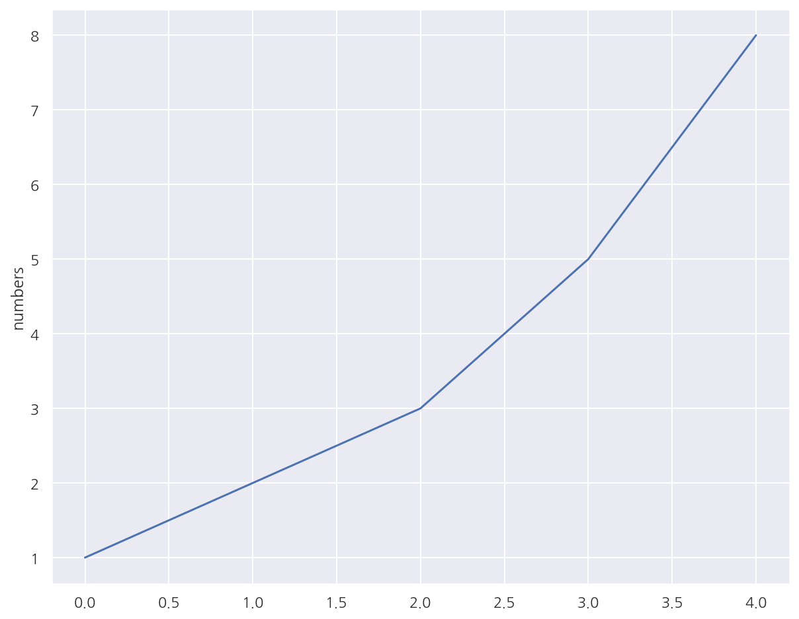
    


```python
# subplot
alphabet = ["a", "b", "c"]
values = [1, 50, 100]

plt.figure(figsize=(12,4))

plt.subplot(131)
plt.bar(alphabet, values)

plt.subplot(1,3,2)
plt.scatter(alphabet, values)

plt.subplot(1,3,3)
plt.plot(alphabet, values)

plt.suptitle("Categorical Plotting")
plt.show()
```


    
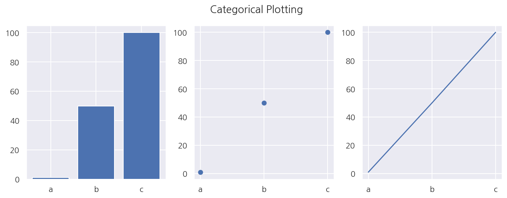


```python
data = pd.read_csv("Day09_01_BIPA_data.csv", index_col=0)
```


```python
# 일부 챔피언에 대한 평균값 정보 (10개가 아닌 9개의 챔피언 id 0은 없음)
data1_10 = data[data['championId'].isin(range(0,10))]
group1_10 = data1_10.groupby("championId", as_index=False).mean()
```


```python
# 챔피언별 총 딜량
fig, ax = plt.subplots(figsize=(7,4))

ax.barh(group1_10['championId'], group1_10['totalDamageDealtToChampions'])
fig.show()
```


    
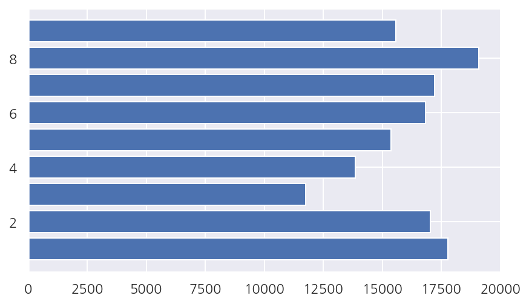
    


```python
# 각 버전 (챔피언, 룬, 아이템 등..)
champ_ver = requests.get('https://ddragon.leagueoflegends.com/realms/na.json').json()['n']['champion']
championJsonURL = 'http://ddragon.leagueoflegends.com/cdn/' + champ_ver + '/data/en_US/champion.json'

# 챔피언 정보 url
request = requests.get(championJsonURL)
champion_data = request.json()
champion_data.keys()
```


    dict_keys(['type', 'format', 'version', 'data'])


```python
# 챔피언 id, name 데이터 프레임
champion_dict = {}

for c_name in champion_data['data'].keys() :
    champion_dict[int(champion_data['data'][c_name]['key'])]=c_name
    
champion = pd.DataFrame.from_dict(champion_dict, orient = 'index', columns = ['champion'])
```


```python
# merge, 챔피언 이름 추가
group1_10 = pd.merge(group1_10, champion, left_on="championId", right_index=True)
```


```python
# 챔피언 이름으로 y축 변경
fig, ax = plt.subplots(figsize=(7,4))

ax.barh(group1_10['champion'], group1_10['totalDamageDealtToChampions'])
fig.show()
```


    
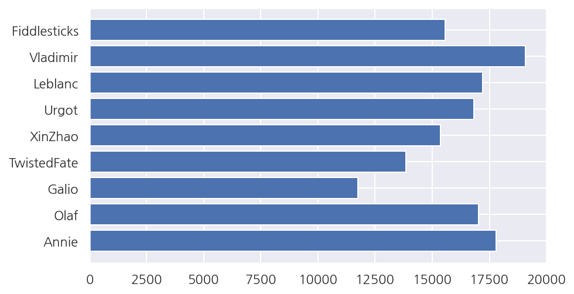
    


```python
# pandas에서 plot
group1_10['totalDamageDealtToChampions'].plot(kind='barh')
plt.show()
```


    
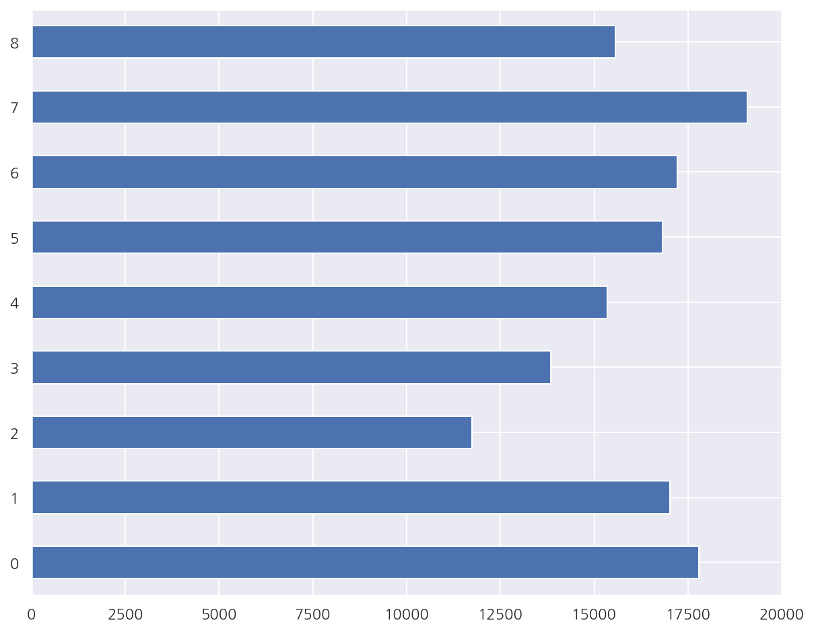
    


```python
# index 변경
group1_10.index = group1_10.champion
group1_10['totalDamageDealtToChampions'].plot(kind='barh')
plt.show()
```


    
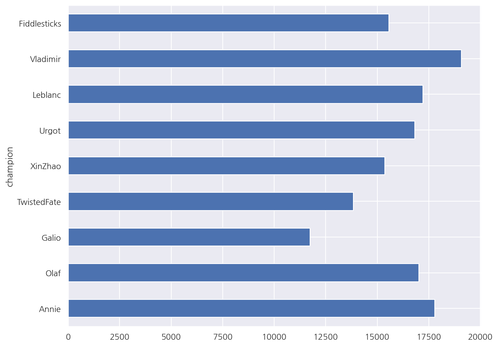
    


```python
# color 스타일 변경 (영구)
sns.set_palette('bright')

fig, ax = plt.subplots(figsize=(7,4))

ax.barh(group1_10['champion'], group1_10['totalDamageDealtToChampions'])
fig.show()
```


    

    


```python
# color 변경
sns.set_palette('bright')

fig, ax = plt.subplots(figsize=(7,4))

ax.barh(group1_10['champion'], group1_10['totalDamageDealtToChampions'], color="red")
fig.show()
```


    
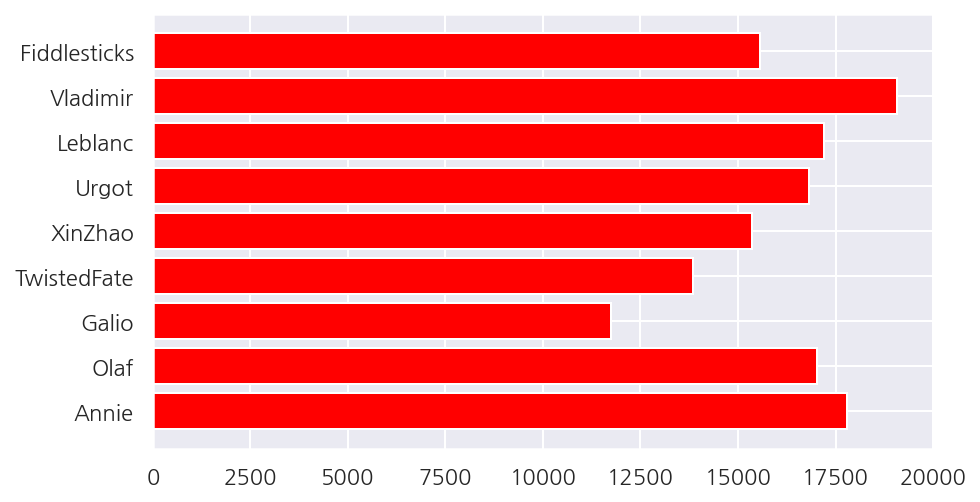
    


```python
# seaborn
fig, ax = plt.subplots(figsize=(7,4))

sns.barplot(data=group1_10, x='totalDamageDealtToChampions', y='champion')
plt.show()
```


    
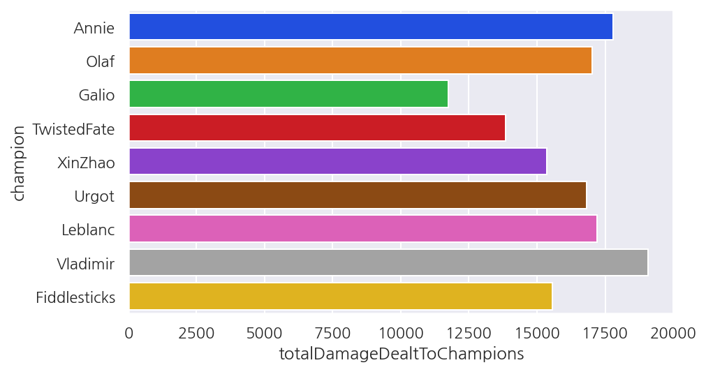
    


```python
# xlabel, ylabel, title
fig, ax = plt.subplots(figsize=(7,4))

sns.barplot(data=group1_10, x='totalDamageDealtToChampions', y='champion')

ax.set_xlabel("Avg_damage")
ax.set_ylabel("Champion Name")
ax.set_title("Avg Champion Damage")

plt.show()
```


    
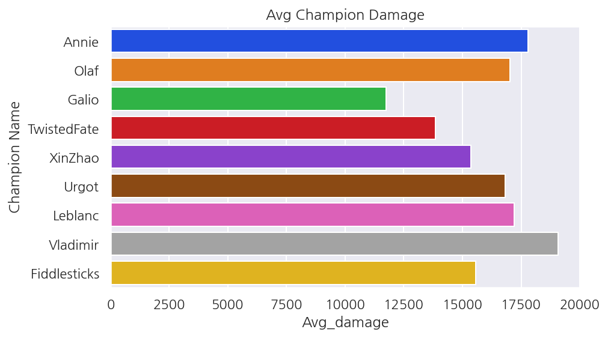
    


```python
# font style
font_label = {
    'color': 'blue',
    'weight': 'bold'
}

font_title = {
    'family': 'serif',
    'size': 20,
    'backgroundcolor': 'y',
    'weight': 'bold',
    'verticalalignment': 'baseline',
    'horizontalalignment': 'center'
}

fig, ax = plt.subplots(figsize=(7,4))

sns.barplot(data=group1_10, x='totalDamageDealtToChampions', y='champion')

# pad 옵션은 축과의 거리 옵션
ax.set_xlabel("Avg_damage", fontdict=font_label, labelpad=20)
ax.set_ylabel("Champion Name", color='blue', labelpad=100)
ax.set_title("Avg Champion Damage", fontdict=font_title, pad=12)

plt.show()
```


    
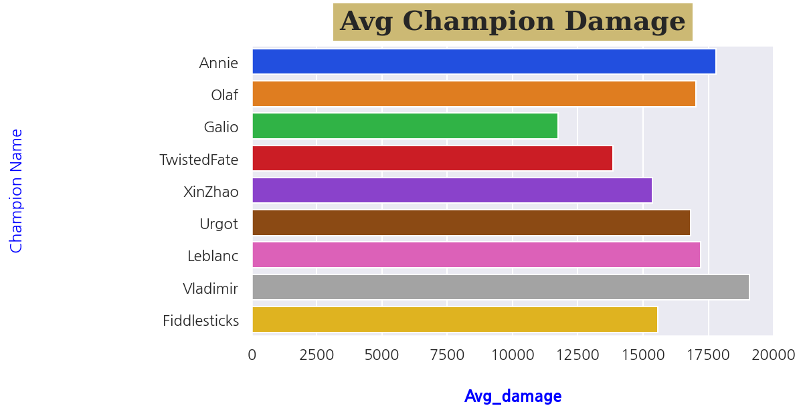
    


```python
# font style
font_label = {
    'color': 'blue',
    'weight': 'bold'
}

font_title = {
    'family': 'serif',
    'size': 20,
    'backgroundcolor': 'y',
    'weight': 'bold',
    'verticalalignment': 'baseline',
    'horizontalalignment': 'center'
}

fig, ax = plt.subplots(figsize=(7,4))

sns.barplot(data=group1_10, x='totalDamageDealtToChampions', y='champion')

# pad 옵션은 축과의 거리 옵션
ax.set_xlabel("Avg_damage", fontdict=font_label, labelpad=20)
ax.set_ylabel("Champion Name", color='blue', labelpad=100)
ax.set_title("Avg Champion Damage", fontdict=font_title, pad=12)

# x축 범위 설정
ax.set_xlim(10000, 20000)

plt.show()
```


    
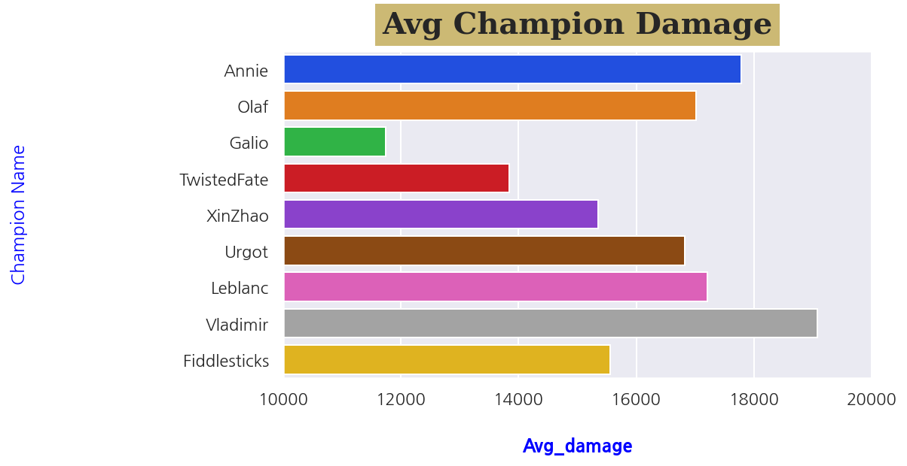
    


```python
# font style
font_label = {
    'color': 'blue',
    'weight': 'bold'
}

font_title = {
    'family': 'serif',
    'size': 20,
    'backgroundcolor': 'y',
    'weight': 'bold',
    'verticalalignment': 'baseline',
    'horizontalalignment': 'center'
}

fig, ax = plt.subplots(figsize=(7,4))

sns.barplot(data=group1_10, x='totalDamageDealtToChampions', y='champion')

# pad 옵션은 축과의 거리 옵션
ax.set_xlabel("Avg_damage", fontdict=font_label, labelpad=20)
ax.set_ylabel("Champion Name", color='blue', labelpad=100)
ax.set_title("Avg Champion Damage", fontdict=font_title, pad=12)

# x축 범위 설정
ax.set_xlim(10000, 20000)
ax.axvline(damage_mean, ls='--', lw=1, color='green')
# 평균값 선 추가해주기
damage_mean = group1_10['totalDamageDealtToChampions'].mean()
ax.axvline(damage_mean, ls='--', lw=1, color='green')

# 화살표 추가
arrowprops = {
    'arrowstyle': '->'
}
ax.annotate("average", (damage_mean, 2.5), xytext=(17000,2.5), color='green',
            fontfamily='serif', fontstyle='italic', fontsize=15, arrowprops = arrowprops)

plt.show()
```


    
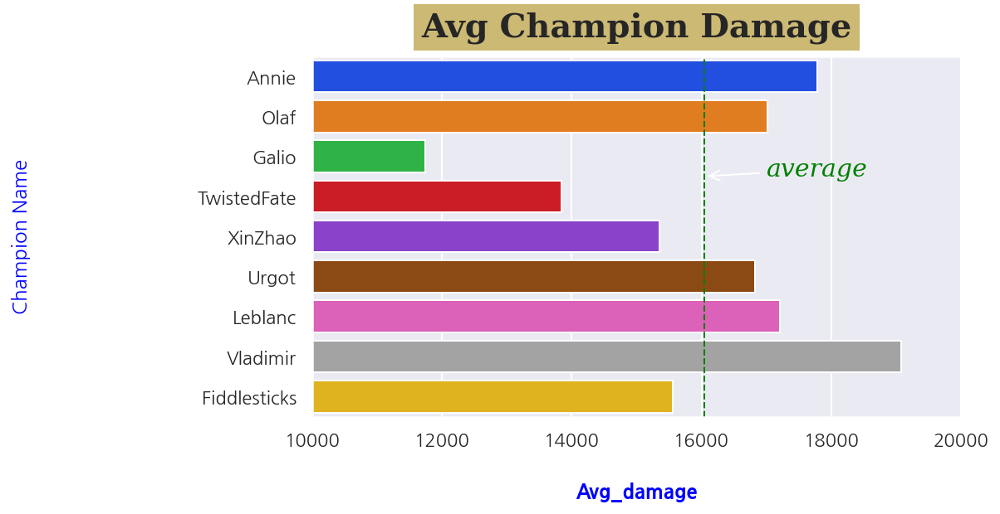
    


```python
# boxplot
sns.boxplot(y = data['totalDamageDealtToChampions'], x = data['position'])
plt.show()
```


    
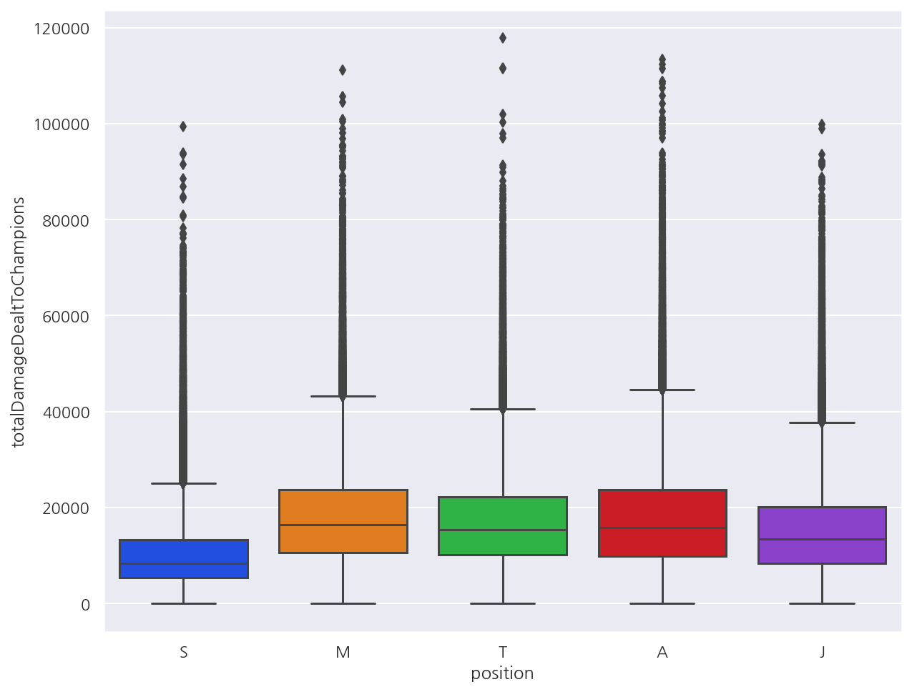
    


```python
# boxplot
sns.violinplot(y = data['totalDamageDealtToChampions'], x = data['position'])
plt.show()
```


    
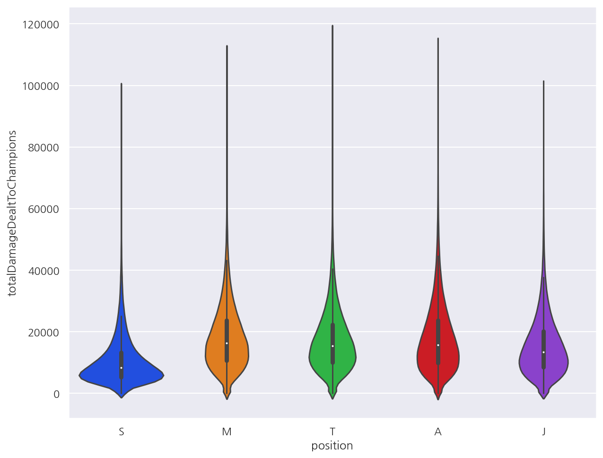
    


```python
# distplot
sns.distplot(data['totalDamageDealtToChampions'])
plt.show()
```


    
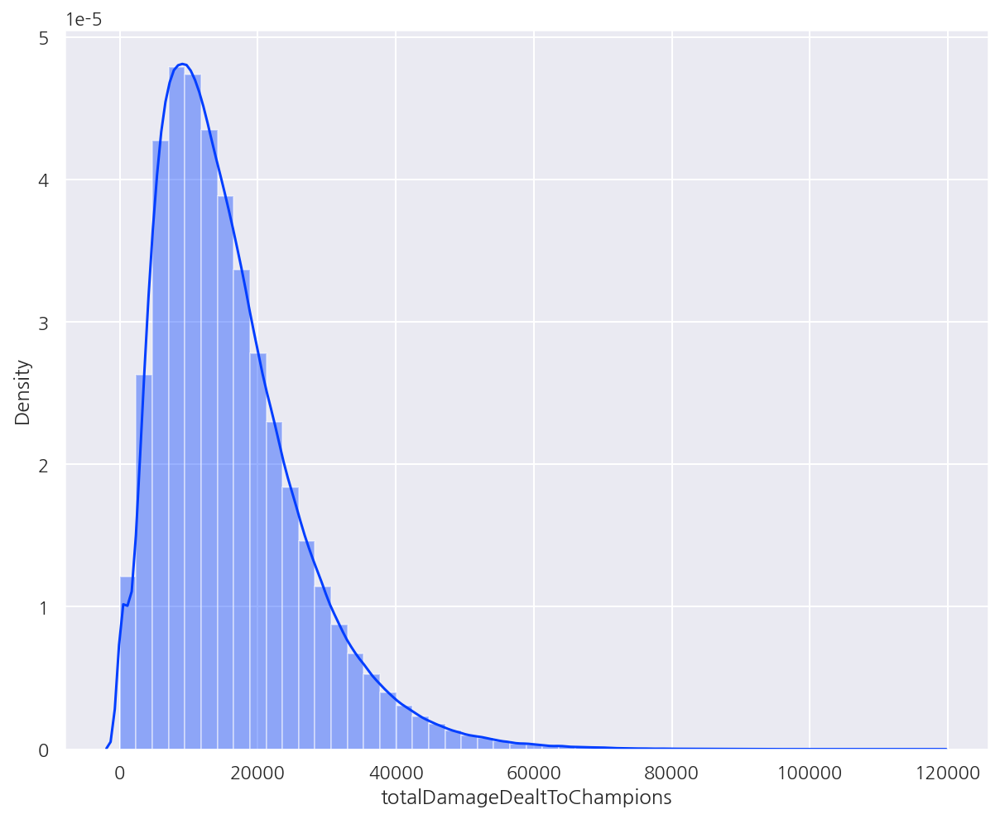
    


```python
# distplot
group_data = data[data['gameLength']>200].groupby(['position','championId'], as_index=False).mean()
# sns.distplot(group_data, x='totalDamageDealtToChampions', hue='position')
sns.distplot(group_data['totalDamageDealtToChampions'])
plt.show()
```


    
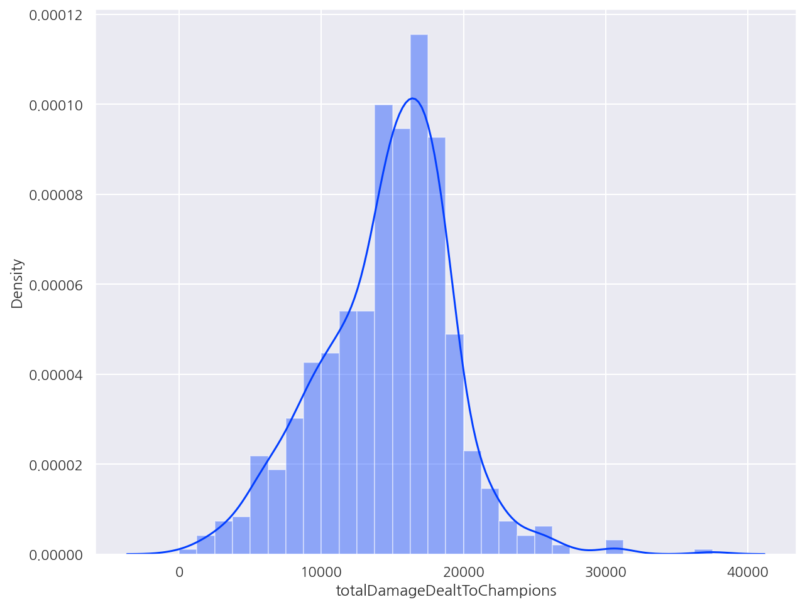
    


```python
# displot
# distplot은 figure size가 안먹혀서 displot으로 heigt, aspect로 설정가능
sns.displot(group_data['totalDamageDealtToChampions'], height=4, aspect=2)
plt.show()
```


    
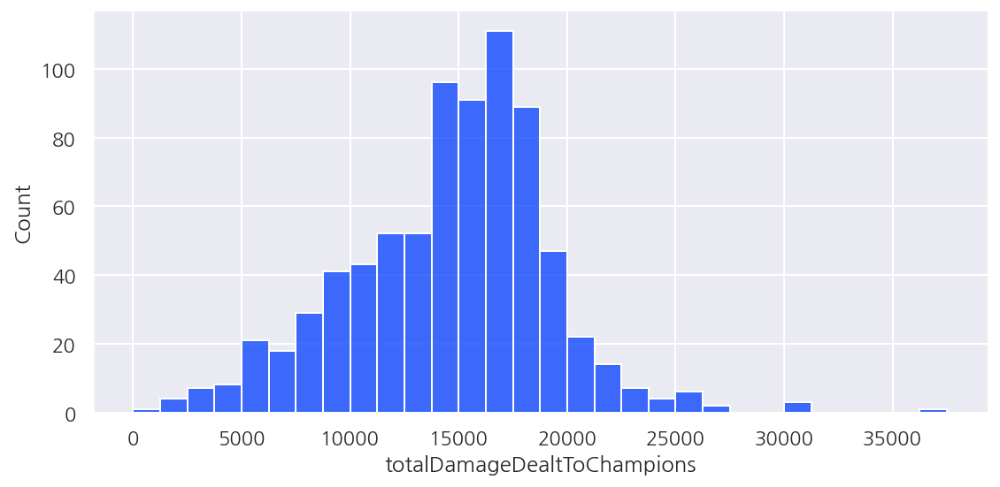
    


```python
# displot
sns.displot(group_data[group_data['position'].isin(['A','S'])], 
            x = 'totalDamageDealtToChampions', hue='position', multiple='dodge', height=4, aspect=2)
plt.show()
```


    
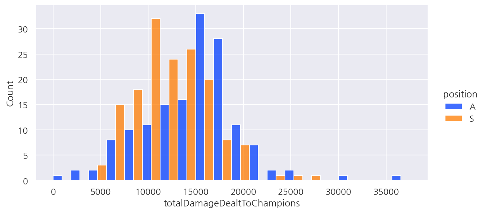
    


```python
# 챔피언별 level당 stat 정보 등
champ_stats = pd.read_csv('Day09_01_champ_stats.csv')
```


```python
champ_stats
```


<div>
<style scoped>
    .dataframe tbody tr th:only-of-type {
        vertical-align: middle;
    }

    .dataframe tbody tr th {
        vertical-align: top;
    }

    .dataframe thead th {
        text-align: right;
    }
</style>
<table border="1" class="dataframe">
  <thead>
    <tr style="text-align: right;">
      <th></th>
      <th>championId</th>
      <th>championName</th>
      <th>versionIndex</th>
      <th>version</th>
      <th>hp</th>
      <th>hpperlevel</th>
      <th>mp</th>
      <th>mpperlevel</th>
      <th>movespeed</th>
      <th>armor</th>
      <th>...</th>
      <th>attackspeed</th>
      <th>hp_18</th>
      <th>mp_18</th>
      <th>armor_18</th>
      <th>spellblock_18</th>
      <th>hpregen_18</th>
      <th>mpregen_18</th>
      <th>crit_18</th>
      <th>attackdamage_18</th>
      <th>attackspeed_18</th>
    </tr>
  </thead>
  <tbody>
    <tr>
      <th>0</th>
      <td>1</td>
      <td>Annie</td>
      <td>11.17</td>
      <td>11.17.394.4489</td>
      <td>524.0</td>
      <td>88</td>
      <td>418.0</td>
      <td>25.0</td>
      <td>335</td>
      <td>19</td>
      <td>...</td>
      <td>0.579</td>
      <td>2020.0</td>
      <td>843.0</td>
      <td>87.00</td>
      <td>38.50</td>
      <td>14.85</td>
      <td>21.60</td>
      <td>0</td>
      <td>94.71</td>
      <td>0.7129</td>
    </tr>
    <tr>
      <th>1</th>
      <td>2</td>
      <td>Olaf</td>
      <td>11.17</td>
      <td>11.17.394.4489</td>
      <td>575.0</td>
      <td>100</td>
      <td>316.0</td>
      <td>42.0</td>
      <td>350</td>
      <td>35</td>
      <td>...</td>
      <td>0.694</td>
      <td>2275.0</td>
      <td>1030.0</td>
      <td>86.00</td>
      <td>53.25</td>
      <td>23.80</td>
      <td>17.70</td>
      <td>0</td>
      <td>127.50</td>
      <td>1.0125</td>
    </tr>
    <tr>
      <th>2</th>
      <td>3</td>
      <td>Galio</td>
      <td>11.17</td>
      <td>11.17.394.4489</td>
      <td>562.0</td>
      <td>112</td>
      <td>500.0</td>
      <td>40.0</td>
      <td>335</td>
      <td>24</td>
      <td>...</td>
      <td>0.625</td>
      <td>2466.0</td>
      <td>1180.0</td>
      <td>83.50</td>
      <td>53.25</td>
      <td>21.60</td>
      <td>21.40</td>
      <td>0</td>
      <td>118.50</td>
      <td>0.7844</td>
    </tr>
    <tr>
      <th>3</th>
      <td>4</td>
      <td>TwistedFate</td>
      <td>11.17</td>
      <td>11.17.394.4489</td>
      <td>534.0</td>
      <td>94</td>
      <td>333.0</td>
      <td>39.0</td>
      <td>330</td>
      <td>21</td>
      <td>...</td>
      <td>0.651</td>
      <td>2132.0</td>
      <td>996.0</td>
      <td>74.55</td>
      <td>38.50</td>
      <td>15.70</td>
      <td>21.60</td>
      <td>0</td>
      <td>108.10</td>
      <td>1.0074</td>
    </tr>
    <tr>
      <th>4</th>
      <td>5</td>
      <td>XinZhao</td>
      <td>11.17</td>
      <td>11.17.394.4489</td>
      <td>570.0</td>
      <td>92</td>
      <td>274.0</td>
      <td>55.0</td>
      <td>345</td>
      <td>35</td>
      <td>...</td>
      <td>0.645</td>
      <td>2134.0</td>
      <td>1209.0</td>
      <td>94.50</td>
      <td>53.25</td>
      <td>19.90</td>
      <td>14.91</td>
      <td>0</td>
      <td>114.00</td>
      <td>1.0288</td>
    </tr>
    <tr>
      <th>...</th>
      <td>...</td>
      <td>...</td>
      <td>...</td>
      <td>...</td>
      <td>...</td>
      <td>...</td>
      <td>...</td>
      <td>...</td>
      <td>...</td>
      <td>...</td>
      <td>...</td>
      <td>...</td>
      <td>...</td>
      <td>...</td>
      <td>...</td>
      <td>...</td>
      <td>...</td>
      <td>...</td>
      <td>...</td>
      <td>...</td>
      <td>...</td>
    </tr>
    <tr>
      <th>151</th>
      <td>555</td>
      <td>Pyke</td>
      <td>11.17</td>
      <td>11.17.394.4489</td>
      <td>600.0</td>
      <td>90</td>
      <td>415.0</td>
      <td>50.0</td>
      <td>330</td>
      <td>45</td>
      <td>...</td>
      <td>0.667</td>
      <td>2130.0</td>
      <td>1265.0</td>
      <td>104.50</td>
      <td>53.25</td>
      <td>15.50</td>
      <td>25.00</td>
      <td>0</td>
      <td>96.00</td>
      <td>0.9505</td>
    </tr>
    <tr>
      <th>152</th>
      <td>777</td>
      <td>Yone</td>
      <td>11.17</td>
      <td>11.17.394.4489</td>
      <td>550.0</td>
      <td>85</td>
      <td>500.0</td>
      <td>0.0</td>
      <td>345</td>
      <td>28</td>
      <td>...</td>
      <td>0.625</td>
      <td>1995.0</td>
      <td>500.0</td>
      <td>85.80</td>
      <td>53.25</td>
      <td>20.25</td>
      <td>0.00</td>
      <td>0</td>
      <td>94.00</td>
      <td>0.9969</td>
    </tr>
    <tr>
      <th>153</th>
      <td>875</td>
      <td>Sett</td>
      <td>11.17</td>
      <td>11.17.394.4489</td>
      <td>600.0</td>
      <td>93</td>
      <td>0.0</td>
      <td>0.0</td>
      <td>340</td>
      <td>33</td>
      <td>...</td>
      <td>0.625</td>
      <td>2181.0</td>
      <td>0.0</td>
      <td>101.00</td>
      <td>53.25</td>
      <td>15.50</td>
      <td>0.00</td>
      <td>0</td>
      <td>128.00</td>
      <td>0.8109</td>
    </tr>
    <tr>
      <th>154</th>
      <td>876</td>
      <td>Lillia</td>
      <td>11.17</td>
      <td>11.17.394.4489</td>
      <td>580.0</td>
      <td>90</td>
      <td>410.0</td>
      <td>50.0</td>
      <td>330</td>
      <td>22</td>
      <td>...</td>
      <td>0.625</td>
      <td>2110.0</td>
      <td>1260.0</td>
      <td>90.00</td>
      <td>44.75</td>
      <td>20.25</td>
      <td>27.65</td>
      <td>0</td>
      <td>113.70</td>
      <td>0.9119</td>
    </tr>
    <tr>
      <th>155</th>
      <td>887</td>
      <td>Gwen</td>
      <td>11.17</td>
      <td>11.17.394.4489</td>
      <td>550.0</td>
      <td>90</td>
      <td>330.0</td>
      <td>40.0</td>
      <td>340</td>
      <td>39</td>
      <td>...</td>
      <td>0.690</td>
      <td>2080.0</td>
      <td>1010.0</td>
      <td>107.00</td>
      <td>53.25</td>
      <td>16.35</td>
      <td>19.40</td>
      <td>0</td>
      <td>114.00</td>
      <td>0.9539</td>
    </tr>
  </tbody>
</table>
<p>156 rows × 33 columns</p>
</div>


```python
# scatterplot
sns.scatterplot(data=champ_stats, x='hp', y='hp_18')
plt.show()
```


    
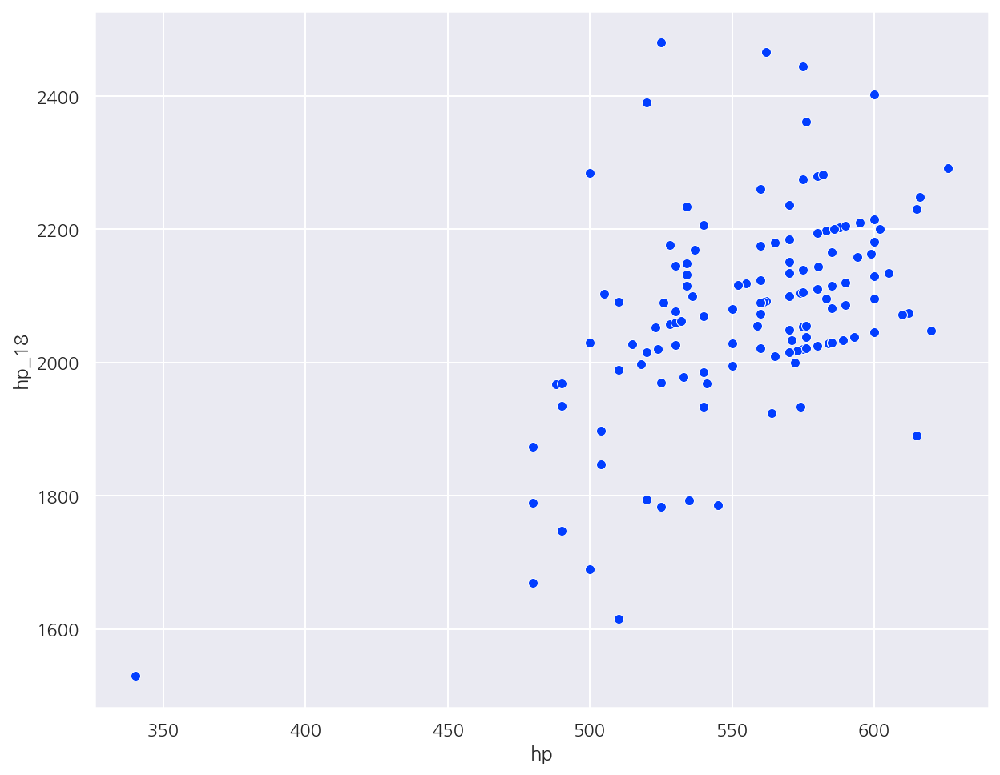
    


```python
champ_stats.columns
```


    Index(['championId', 'championName', 'versionIndex', 'version', 'hp',
           'hpperlevel', 'mp', 'mpperlevel', 'movespeed', 'armor', 'armorperlevel',
           'spellblock', 'spellblockperlevel', 'attackrange', 'hpregen',
           'hpregenperlevel', 'mpregen', 'mpregenperlevel', 'crit', 'critperlevel',
           'attackdamage', 'attackdamageperlevel', 'attackspeedperlevel',
           'attackspeed', 'hp_18', 'mp_18', 'armor_18', 'spellblock_18',
           'hpregen_18', 'mpregen_18', 'crit_18', 'attackdamage_18',
           'attackspeed_18'],
          dtype='object')


```python
# text 삽입
sns.scatterplot(data=champ_stats, x='hp', y='hp_18')

plt.text(x = champ_stats[champ_stats['championName'] == 'Kled']['hp'] + 3,
         y = champ_stats[champ_stats['championName'] == 'Kled']['hp_18'] + 3,
         s = 'Kled')

plt.show()
```


    

    


```python
# 모든 챔피언 이름 넣기
sns.scatterplot(data=champ_stats, x='hp', y='hp_18')

for name in champ_stats['championName'].values:
    plt.text(x = champ_stats[champ_stats['championName'] == name]['hp'] + 3,
             y = champ_stats[champ_stats['championName'] == name]['hp_18'] + 3,
             s = name)

plt.show()
```


    
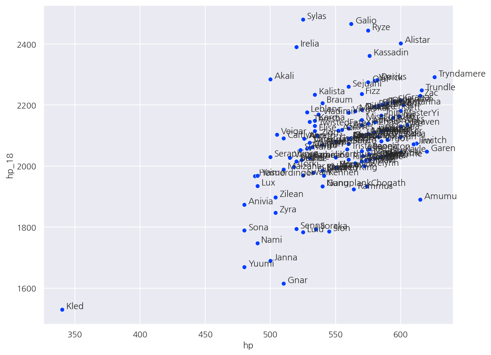
    


```python
# 공격력과 공격속도
sns.scatterplot(data=champ_stats, x='attackdamage', y='attackspeed')

for name in champ_stats['championName'].values:
    plt.text(x = champ_stats[champ_stats['championName'] == name]['attackdamage'] + 0.5,
             y = champ_stats[champ_stats['championName'] == name]['attackspeed'] + 0.01,
             s = name)

plt.show()
```


    
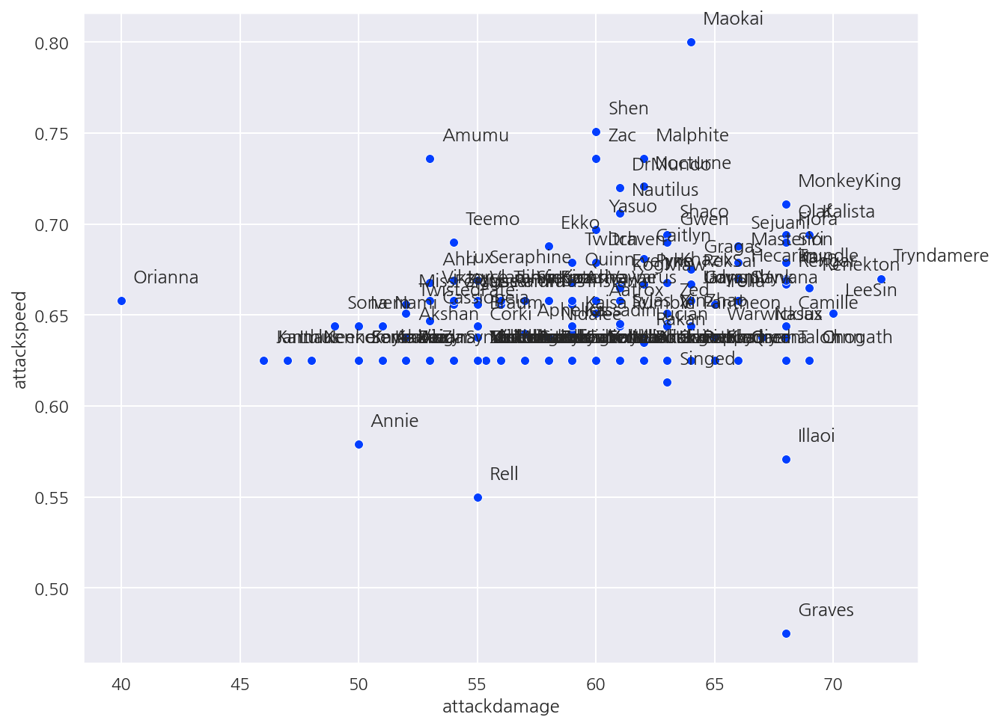
    


# 2. 함수 정의 및 apply


```python
# sample data
data = pd.DataFrame([[1,2,3,4], [5,6,7,8], [9,8,7,6]],
                    index = ['a', 'b', 'c'], columns = ["A", "B", "C", "D"])
```


```python
data
```


<div>
<style scoped>
    .dataframe tbody tr th:only-of-type {
        vertical-align: middle;
    }

    .dataframe tbody tr th {
        vertical-align: top;
    }

    .dataframe thead th {
        text-align: right;
    }
</style>
<table border="1" class="dataframe">
  <thead>
    <tr style="text-align: right;">
      <th></th>
      <th>A</th>
      <th>B</th>
      <th>C</th>
      <th>D</th>
    </tr>
  </thead>
  <tbody>
    <tr>
      <th>a</th>
      <td>1</td>
      <td>2</td>
      <td>3</td>
      <td>4</td>
    </tr>
    <tr>
      <th>b</th>
      <td>5</td>
      <td>6</td>
      <td>7</td>
      <td>8</td>
    </tr>
    <tr>
      <th>c</th>
      <td>9</td>
      <td>8</td>
      <td>7</td>
      <td>6</td>
    </tr>
  </tbody>
</table>
</div>


```python
# 열 단위
data.apply(np.mean, axis=0)
```


    A    5.000000
    B    5.333333
    C    5.666667
    D    6.000000
    dtype: float64


```python
# 행 단위
data.apply(np.mean, axis=1)
```


    a    2.5
    b    6.5
    c    7.5
    dtype: float64


```python
# exponential
data.apply(np.exp)
```


<div>
<style scoped>
    .dataframe tbody tr th:only-of-type {
        vertical-align: middle;
    }

    .dataframe tbody tr th {
        vertical-align: top;
    }

    .dataframe thead th {
        text-align: right;
    }
</style>
<table border="1" class="dataframe">
  <thead>
    <tr style="text-align: right;">
      <th></th>
      <th>A</th>
      <th>B</th>
      <th>C</th>
      <th>D</th>
    </tr>
  </thead>
  <tbody>
    <tr>
      <th>a</th>
      <td>2.718282</td>
      <td>7.389056</td>
      <td>20.085537</td>
      <td>54.598150</td>
    </tr>
    <tr>
      <th>b</th>
      <td>148.413159</td>
      <td>403.428793</td>
      <td>1096.633158</td>
      <td>2980.957987</td>
    </tr>
    <tr>
      <th>c</th>
      <td>8103.083928</td>
      <td>2980.957987</td>
      <td>1096.633158</td>
      <td>403.428793</td>
    </tr>
  </tbody>
</table>
</div>


```python
data.apply(lambda x: x["A"] + x["B"], axis=1)
```


    a     3
    b    11
    c    17
    dtype: int64


```python
data.apply(lambda x: x["a"] + x["c"], axis=0)
```


    A    10
    B    10
    C    10
    D    10
    dtype: int64


```python
# 함수 이용
def multiply_2(x):
    return x*2

data.apply(lambda x: multiply_2(x))
```


<div>
<style scoped>
    .dataframe tbody tr th:only-of-type {
        vertical-align: middle;
    }

    .dataframe tbody tr th {
        vertical-align: top;
    }

    .dataframe thead th {
        text-align: right;
    }
</style>
<table border="1" class="dataframe">
  <thead>
    <tr style="text-align: right;">
      <th></th>
      <th>A</th>
      <th>B</th>
      <th>C</th>
      <th>D</th>
    </tr>
  </thead>
  <tbody>
    <tr>
      <th>a</th>
      <td>2</td>
      <td>4</td>
      <td>6</td>
      <td>8</td>
    </tr>
    <tr>
      <th>b</th>
      <td>10</td>
      <td>12</td>
      <td>14</td>
      <td>16</td>
    </tr>
    <tr>
      <th>c</th>
      <td>18</td>
      <td>16</td>
      <td>14</td>
      <td>12</td>
    </tr>
  </tbody>
</table>
</div>


```python
# 함수 이용2
def hello(x):
    return 'hello my name is ' + x

hello("Me")
```


    'hello my name is Me'


```python
data = pd.read_csv("Day09_01_BIPA_data.csv", index_col=0)
```


```python
data
```


<div>
<style scoped>
    .dataframe tbody tr th:only-of-type {
        vertical-align: middle;
    }

    .dataframe tbody tr th {
        vertical-align: top;
    }

    .dataframe thead th {
        text-align: right;
    }
</style>
<table border="1" class="dataframe">
  <thead>
    <tr style="text-align: right;">
      <th></th>
      <th>gameId</th>
      <th>createDate</th>
      <th>tierRank</th>
      <th>position</th>
      <th>teamId</th>
      <th>summonerId</th>
      <th>championId</th>
      <th>result</th>
      <th>level</th>
      <th>championsKilled</th>
      <th>...</th>
      <th>totalDamageTaken</th>
      <th>neutralMinionsKilledEnemyJungle</th>
      <th>neutralMinionsKilledTeamJungle</th>
      <th>visionScore</th>
      <th>damageSelfMitigated</th>
      <th>damageDealtToObjectives</th>
      <th>damageDealtToTurrets</th>
      <th>lane</th>
      <th>gameLength</th>
      <th>version</th>
    </tr>
  </thead>
  <tbody>
    <tr>
      <th>0</th>
      <td>5383880006</td>
      <td>2021-08-11 06:59:31</td>
      <td>P318</td>
      <td>S</td>
      <td>200</td>
      <td>3210877</td>
      <td>99</td>
      <td>WIN</td>
      <td>10</td>
      <td>4</td>
      <td>...</td>
      <td>3602</td>
      <td>0</td>
      <td>0</td>
      <td>11</td>
      <td>2830</td>
      <td>2181</td>
      <td>2181</td>
      <td>NONE</td>
      <td>972</td>
      <td>11.16.390.1945</td>
    </tr>
    <tr>
      <th>1</th>
      <td>5383880006</td>
      <td>2021-08-11 06:59:31</td>
      <td>P466</td>
      <td>S</td>
      <td>100</td>
      <td>7550211</td>
      <td>35</td>
      <td>LOSE</td>
      <td>8</td>
      <td>1</td>
      <td>...</td>
      <td>5077</td>
      <td>0</td>
      <td>2</td>
      <td>24</td>
      <td>2013</td>
      <td>0</td>
      <td>0</td>
      <td>NONE</td>
      <td>972</td>
      <td>11.16.390.1945</td>
    </tr>
    <tr>
      <th>2</th>
      <td>5383880006</td>
      <td>2021-08-11 06:59:31</td>
      <td>P329</td>
      <td>M</td>
      <td>200</td>
      <td>9306696</td>
      <td>266</td>
      <td>WIN</td>
      <td>11</td>
      <td>5</td>
      <td>...</td>
      <td>11029</td>
      <td>0</td>
      <td>0</td>
      <td>15</td>
      <td>6158</td>
      <td>585</td>
      <td>585</td>
      <td>NONE</td>
      <td>972</td>
      <td>11.16.390.1945</td>
    </tr>
    <tr>
      <th>3</th>
      <td>5383880006</td>
      <td>2021-08-11 06:59:31</td>
      <td>P461</td>
      <td>T</td>
      <td>200</td>
      <td>20281103</td>
      <td>92</td>
      <td>WIN</td>
      <td>11</td>
      <td>8</td>
      <td>...</td>
      <td>9944</td>
      <td>0</td>
      <td>0</td>
      <td>10</td>
      <td>7615</td>
      <td>2318</td>
      <td>2318</td>
      <td>NONE</td>
      <td>972</td>
      <td>11.16.390.1945</td>
    </tr>
    <tr>
      <th>4</th>
      <td>5383880006</td>
      <td>2021-08-11 06:59:31</td>
      <td>P30</td>
      <td>A</td>
      <td>200</td>
      <td>26082075</td>
      <td>22</td>
      <td>WIN</td>
      <td>10</td>
      <td>3</td>
      <td>...</td>
      <td>6387</td>
      <td>0</td>
      <td>0</td>
      <td>13</td>
      <td>3218</td>
      <td>2370</td>
      <td>2370</td>
      <td>NONE</td>
      <td>972</td>
      <td>11.16.390.1945</td>
    </tr>
    <tr>
      <th>...</th>
      <td>...</td>
      <td>...</td>
      <td>...</td>
      <td>...</td>
      <td>...</td>
      <td>...</td>
      <td>...</td>
      <td>...</td>
      <td>...</td>
      <td>...</td>
      <td>...</td>
      <td>...</td>
      <td>...</td>
      <td>...</td>
      <td>...</td>
      <td>...</td>
      <td>...</td>
      <td>...</td>
      <td>...</td>
      <td>...</td>
      <td>...</td>
    </tr>
    <tr>
      <th>999995</th>
      <td>5384659633</td>
      <td>2021-08-11 17:20:44</td>
      <td>S146</td>
      <td>S</td>
      <td>100</td>
      <td>21560397</td>
      <td>53</td>
      <td>WIN</td>
      <td>15</td>
      <td>1</td>
      <td>...</td>
      <td>32961</td>
      <td>0</td>
      <td>0</td>
      <td>63</td>
      <td>34725</td>
      <td>1978</td>
      <td>126</td>
      <td>BOTTOM</td>
      <td>2379</td>
      <td>11.16.390.1945</td>
    </tr>
    <tr>
      <th>999996</th>
      <td>5384659633</td>
      <td>2021-08-11 17:20:44</td>
      <td>G442</td>
      <td>M</td>
      <td>100</td>
      <td>46320531</td>
      <td>166</td>
      <td>WIN</td>
      <td>18</td>
      <td>10</td>
      <td>...</td>
      <td>24674</td>
      <td>1</td>
      <td>16</td>
      <td>16</td>
      <td>21371</td>
      <td>8406</td>
      <td>7042</td>
      <td>MIDDLE</td>
      <td>2379</td>
      <td>11.16.390.1945</td>
    </tr>
    <tr>
      <th>999997</th>
      <td>5384659633</td>
      <td>2021-08-11 17:20:44</td>
      <td>G418</td>
      <td>J</td>
      <td>200</td>
      <td>64820251</td>
      <td>64</td>
      <td>LOSE</td>
      <td>17</td>
      <td>5</td>
      <td>...</td>
      <td>45911</td>
      <td>6</td>
      <td>68</td>
      <td>22</td>
      <td>62426</td>
      <td>20292</td>
      <td>454</td>
      <td>JUNGLE</td>
      <td>2379</td>
      <td>11.16.390.1945</td>
    </tr>
    <tr>
      <th>999998</th>
      <td>5384659633</td>
      <td>2021-08-11 17:20:44</td>
      <td>S178</td>
      <td>A</td>
      <td>100</td>
      <td>72310857</td>
      <td>81</td>
      <td>WIN</td>
      <td>17</td>
      <td>6</td>
      <td>...</td>
      <td>28187</td>
      <td>8</td>
      <td>9</td>
      <td>17</td>
      <td>19664</td>
      <td>11090</td>
      <td>1062</td>
      <td>BOTTOM</td>
      <td>2379</td>
      <td>11.16.390.1945</td>
    </tr>
    <tr>
      <th>999999</th>
      <td>5384659633</td>
      <td>2021-08-11 17:20:44</td>
      <td>G456</td>
      <td>T</td>
      <td>100</td>
      <td>72520226</td>
      <td>875</td>
      <td>WIN</td>
      <td>18</td>
      <td>3</td>
      <td>...</td>
      <td>54999</td>
      <td>0</td>
      <td>9</td>
      <td>30</td>
      <td>64441</td>
      <td>13682</td>
      <td>9331</td>
      <td>TOP</td>
      <td>2379</td>
      <td>11.16.390.1945</td>
    </tr>
  </tbody>
</table>
<p>1000000 rows × 37 columns</p>
</div>


```python
# 첫 글자 가져오기
data["tierRank"].str[:1]
```


    0         P
    1         P
    2         P
    3         P
    4         P
             ..
    999995    S
    999996    G
    999997    G
    999998    S
    999999    G
    Name: tierRank, Length: 1000000, dtype: object


```python
# 첫 글자 가져오기 apply
# data["tierRank"].apply(lambda x: x[0])
```

- 실행시 결측 값이 존재해서 float형태로 입력되어 있기에 인덱싱이 안됨(문자열 x)


```python
sns.heatmap(data.isnull(), cbar=False)
plt.show()
```


    
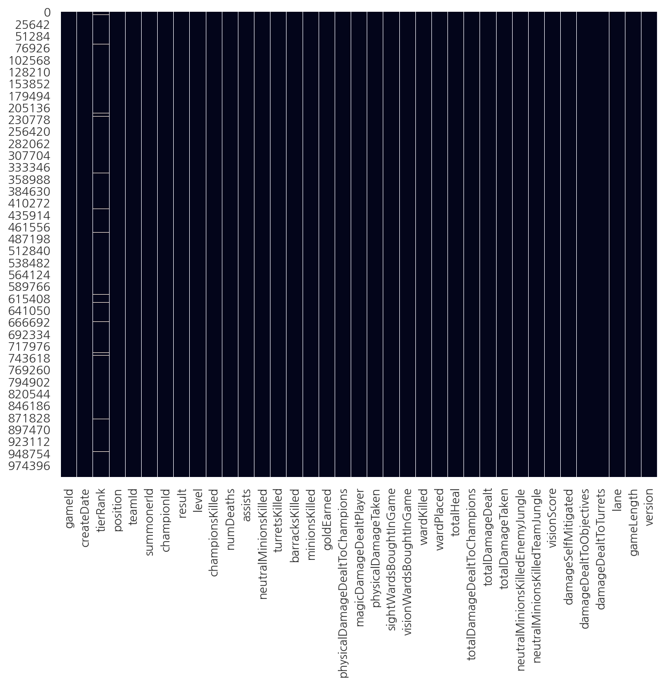
    


```python
# missingno 패키지 사용
import missingno as msno

msno.bar(data)
```


    <AxesSubplot:>


    
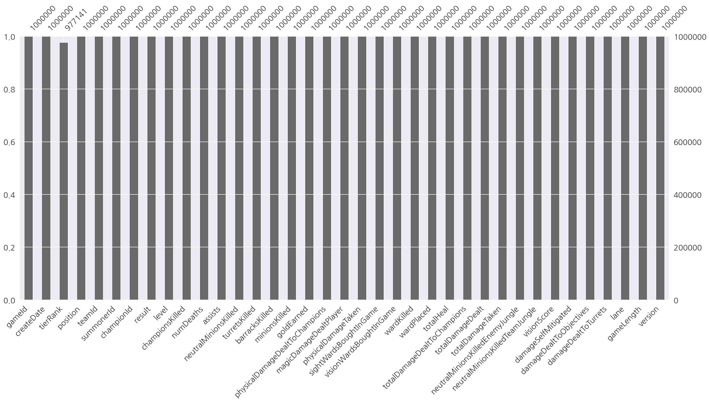
    


- tierRank에 결측값 존재하는 것 확인 가능


```python
# 결측값 제거
data1 = data[data["tierRank"].notnull()].copy()
```


```python
# 첫 글자 가져오기 apply
data1["tier"] = data1["tierRank"].apply(lambda x: x[0])
```

- 이제 float형태가 아니므로 잘 적용된다.


```python
# 특정 문자가 있는지
data1[data1["tierRank"].str.contains("C")]
```


<div>
<style scoped>
    .dataframe tbody tr th:only-of-type {
        vertical-align: middle;
    }

    .dataframe tbody tr th {
        vertical-align: top;
    }

    .dataframe thead th {
        text-align: right;
    }
</style>
<table border="1" class="dataframe">
  <thead>
    <tr style="text-align: right;">
      <th></th>
      <th>gameId</th>
      <th>createDate</th>
      <th>tierRank</th>
      <th>position</th>
      <th>teamId</th>
      <th>summonerId</th>
      <th>championId</th>
      <th>result</th>
      <th>level</th>
      <th>championsKilled</th>
      <th>...</th>
      <th>neutralMinionsKilledEnemyJungle</th>
      <th>neutralMinionsKilledTeamJungle</th>
      <th>visionScore</th>
      <th>damageSelfMitigated</th>
      <th>damageDealtToObjectives</th>
      <th>damageDealtToTurrets</th>
      <th>lane</th>
      <th>gameLength</th>
      <th>version</th>
      <th>tier</th>
    </tr>
  </thead>
  <tbody>
    <tr>
      <th>36518</th>
      <td>5383988789</td>
      <td>2021-08-11 11:21:27</td>
      <td>C1907</td>
      <td>T</td>
      <td>200</td>
      <td>86094085</td>
      <td>39</td>
      <td>WIN</td>
      <td>16</td>
      <td>6</td>
      <td>...</td>
      <td>1</td>
      <td>1</td>
      <td>26</td>
      <td>21058</td>
      <td>13819</td>
      <td>10387</td>
      <td>TOP</td>
      <td>1592</td>
      <td>11.16.390.1945</td>
      <td>C</td>
    </tr>
    <tr>
      <th>205196</th>
      <td>5384285152</td>
      <td>2021-08-11 12:34:20</td>
      <td>C1819</td>
      <td>J</td>
      <td>100</td>
      <td>87214832</td>
      <td>234</td>
      <td>LOSE</td>
      <td>12</td>
      <td>2</td>
      <td>...</td>
      <td>1</td>
      <td>101</td>
      <td>34</td>
      <td>16263</td>
      <td>4647</td>
      <td>0</td>
      <td>JUNGLE</td>
      <td>1531</td>
      <td>11.16.390.1945</td>
      <td>C</td>
    </tr>
    <tr>
      <th>206972</th>
      <td>5384286004</td>
      <td>2021-08-11 12:43:57</td>
      <td>C1868</td>
      <td>J</td>
      <td>100</td>
      <td>41780873</td>
      <td>68</td>
      <td>WIN</td>
      <td>15</td>
      <td>12</td>
      <td>...</td>
      <td>20</td>
      <td>100</td>
      <td>37</td>
      <td>17796</td>
      <td>32194</td>
      <td>1021</td>
      <td>JUNGLE</td>
      <td>1612</td>
      <td>11.16.390.1945</td>
      <td>C</td>
    </tr>
    <tr>
      <th>210966</th>
      <td>5384288138</td>
      <td>2021-08-11 13:09:53</td>
      <td>C1906</td>
      <td>M</td>
      <td>100</td>
      <td>86094085</td>
      <td>13</td>
      <td>WIN</td>
      <td>18</td>
      <td>8</td>
      <td>...</td>
      <td>12</td>
      <td>15</td>
      <td>31</td>
      <td>11095</td>
      <td>26446</td>
      <td>8164</td>
      <td>TOP</td>
      <td>1859</td>
      <td>11.16.390.1945</td>
      <td>C</td>
    </tr>
    <tr>
      <th>210969</th>
      <td>5384288138</td>
      <td>2021-08-11 13:09:53</td>
      <td>C1843</td>
      <td>T</td>
      <td>200</td>
      <td>87299019</td>
      <td>150</td>
      <td>LOSE</td>
      <td>17</td>
      <td>5</td>
      <td>...</td>
      <td>0</td>
      <td>3</td>
      <td>26</td>
      <td>27323</td>
      <td>5388</td>
      <td>0</td>
      <td>TOP</td>
      <td>1859</td>
      <td>11.16.390.1945</td>
      <td>C</td>
    </tr>
    <tr>
      <th>...</th>
      <td>...</td>
      <td>...</td>
      <td>...</td>
      <td>...</td>
      <td>...</td>
      <td>...</td>
      <td>...</td>
      <td>...</td>
      <td>...</td>
      <td>...</td>
      <td>...</td>
      <td>...</td>
      <td>...</td>
      <td>...</td>
      <td>...</td>
      <td>...</td>
      <td>...</td>
      <td>...</td>
      <td>...</td>
      <td>...</td>
      <td>...</td>
    </tr>
    <tr>
      <th>944443</th>
      <td>5384634868</td>
      <td>2021-08-11 16:27:29</td>
      <td>C1836</td>
      <td>J</td>
      <td>200</td>
      <td>84679870</td>
      <td>234</td>
      <td>LOSE</td>
      <td>10</td>
      <td>2</td>
      <td>...</td>
      <td>17</td>
      <td>58</td>
      <td>20</td>
      <td>8843</td>
      <td>12620</td>
      <td>0</td>
      <td>NONE</td>
      <td>1148</td>
      <td>11.16.390.1945</td>
      <td>C</td>
    </tr>
    <tr>
      <th>950550</th>
      <td>5384637692</td>
      <td>2021-08-11 16:57:07</td>
      <td>C1918</td>
      <td>J</td>
      <td>100</td>
      <td>6300872</td>
      <td>131</td>
      <td>WIN</td>
      <td>16</td>
      <td>5</td>
      <td>...</td>
      <td>20</td>
      <td>100</td>
      <td>20</td>
      <td>19966</td>
      <td>43562</td>
      <td>2366</td>
      <td>JUNGLE</td>
      <td>1774</td>
      <td>11.16.390.1945</td>
      <td>C</td>
    </tr>
    <tr>
      <th>950551</th>
      <td>5384637692</td>
      <td>2021-08-11 16:57:07</td>
      <td>C1857</td>
      <td>S</td>
      <td>200</td>
      <td>13583512</td>
      <td>48</td>
      <td>LOSE</td>
      <td>13</td>
      <td>2</td>
      <td>...</td>
      <td>0</td>
      <td>0</td>
      <td>70</td>
      <td>20091</td>
      <td>2733</td>
      <td>1103</td>
      <td>BOTTOM</td>
      <td>1774</td>
      <td>11.16.390.1945</td>
      <td>C</td>
    </tr>
    <tr>
      <th>950554</th>
      <td>5384637692</td>
      <td>2021-08-11 16:57:07</td>
      <td>C1864</td>
      <td>M</td>
      <td>200</td>
      <td>79280308</td>
      <td>7</td>
      <td>LOSE</td>
      <td>17</td>
      <td>19</td>
      <td>...</td>
      <td>0</td>
      <td>16</td>
      <td>32</td>
      <td>13141</td>
      <td>10980</td>
      <td>8699</td>
      <td>MIDDLE</td>
      <td>1774</td>
      <td>11.16.390.1945</td>
      <td>C</td>
    </tr>
    <tr>
      <th>950557</th>
      <td>5384637692</td>
      <td>2021-08-11 16:57:07</td>
      <td>C1806</td>
      <td>T</td>
      <td>200</td>
      <td>87299019</td>
      <td>223</td>
      <td>LOSE</td>
      <td>14</td>
      <td>3</td>
      <td>...</td>
      <td>0</td>
      <td>0</td>
      <td>16</td>
      <td>55072</td>
      <td>4999</td>
      <td>2161</td>
      <td>TOP</td>
      <td>1774</td>
      <td>11.16.390.1945</td>
      <td>C</td>
    </tr>
  </tbody>
</table>
<p>211 rows × 38 columns</p>
</div>


```python
data1["tier"].value_counts()
```


    S    350067
    G    332395
    B    127999
    P    125914
    D     26826
    I     10052
    M      2965
    R       712
    C       211
    Name: tier, dtype: int64


```python
# 티어별 카테고리 생성
data1["tier_category"] = data1['tier'].apply(lambda x: 1 if x=="I"
                                             else 2 if x=="B"
                                             else 3 if x=="S"
                                             else 4 if x=="G"
                                             else 5 if x=="P"
                                             else 6 if x=="D"
                                             else 7 if x=="M"
                                             else 8 if x=="R"
                                             else 9 if x=="C"
                                             else 0)
```


```python
data1[["tier", "tier_category"]]
```


<div>
<style scoped>
    .dataframe tbody tr th:only-of-type {
        vertical-align: middle;
    }

    .dataframe tbody tr th {
        vertical-align: top;
    }

    .dataframe thead th {
        text-align: right;
    }
</style>
<table border="1" class="dataframe">
  <thead>
    <tr style="text-align: right;">
      <th></th>
      <th>tier</th>
      <th>tier_category</th>
    </tr>
  </thead>
  <tbody>
    <tr>
      <th>0</th>
      <td>P</td>
      <td>5</td>
    </tr>
    <tr>
      <th>1</th>
      <td>P</td>
      <td>5</td>
    </tr>
    <tr>
      <th>2</th>
      <td>P</td>
      <td>5</td>
    </tr>
    <tr>
      <th>3</th>
      <td>P</td>
      <td>5</td>
    </tr>
    <tr>
      <th>4</th>
      <td>P</td>
      <td>5</td>
    </tr>
    <tr>
      <th>...</th>
      <td>...</td>
      <td>...</td>
    </tr>
    <tr>
      <th>999995</th>
      <td>S</td>
      <td>3</td>
    </tr>
    <tr>
      <th>999996</th>
      <td>G</td>
      <td>4</td>
    </tr>
    <tr>
      <th>999997</th>
      <td>G</td>
      <td>4</td>
    </tr>
    <tr>
      <th>999998</th>
      <td>S</td>
      <td>3</td>
    </tr>
    <tr>
      <th>999999</th>
      <td>G</td>
      <td>4</td>
    </tr>
  </tbody>
</table>
<p>977141 rows × 2 columns</p>
</div>


```python
# 티어별 카테고리 생성 2
def tier_category_function(x):
    if x=="I":
        return 1
    if x=="B":
        return 2
    if x=="S":
        return 3
    if x=="G":
        return 4
    if x=="P":
        return 5
    if x=="D":
        return 6
    if x=="M":
        return 7
    if x=="R":
        return 8
    if x=="C":
        return 9
```


```python
data1["tier_category2"] = data1['tier'].apply(lambda x: tier_category_function(x))
```


```python
len(data1["tier_category"] == data1["tier_category2"])
```


    977141


```python
# 내가 만든 함수 불러오기
from Day09_01_module import champion_load
champion_load()
```


<div>
<style scoped>
    .dataframe tbody tr th:only-of-type {
        vertical-align: middle;
    }

    .dataframe tbody tr th {
        vertical-align: top;
    }

    .dataframe thead th {
        text-align: right;
    }
</style>
<table border="1" class="dataframe">
  <thead>
    <tr style="text-align: right;">
      <th></th>
      <th>champion</th>
    </tr>
  </thead>
  <tbody>
    <tr>
      <th>266</th>
      <td>Aatrox</td>
    </tr>
    <tr>
      <th>103</th>
      <td>Ahri</td>
    </tr>
    <tr>
      <th>84</th>
      <td>Akali</td>
    </tr>
    <tr>
      <th>166</th>
      <td>Akshan</td>
    </tr>
    <tr>
      <th>12</th>
      <td>Alistar</td>
    </tr>
    <tr>
      <th>...</th>
      <td>...</td>
    </tr>
    <tr>
      <th>238</th>
      <td>Zed</td>
    </tr>
    <tr>
      <th>115</th>
      <td>Ziggs</td>
    </tr>
    <tr>
      <th>26</th>
      <td>Zilean</td>
    </tr>
    <tr>
      <th>142</th>
      <td>Zoe</td>
    </tr>
    <tr>
      <th>143</th>
      <td>Zyra</td>
    </tr>
  </tbody>
</table>
<p>156 rows × 1 columns</p>
</div>


- 미리 만들어둔 Day09_01_module 파일에 champion_load 함수를 불러와 사용하였다.

# 3. 와드와 승률의 상관관계


```python
# 승리여부 1,0으로 변환
data_me = data[["wardPlaced", "result"]]
data_me["result"] = data_me["result"].apply(lambda x: 1 if x=="WIN" else 0)
```


```python
# 승률 계산
def count_sum(x):
    win_rate = x['result'].sum() / x['result'].count()
    
    return pd.Series(win_rate, index=["win_rate"])

temp = data_me.groupby("wardPlaced", as_index=False).apply(count_sum)
```


```python
# 와드수 40개 이하만
temp_ward40 = temp[temp["wardPlaced"] <= 40]

# bar chart
fig, axs = plt.subplots(1,1, figsize=(15,6))

sns.barplot(data = temp_ward40, x = "wardPlaced", y = "win_rate", ci = None, ax= axs)
axs.axhline(0.5, ls='--', lw=1, color='black')
axs.set_ylim(0,0.8)

plt.show()
```


    
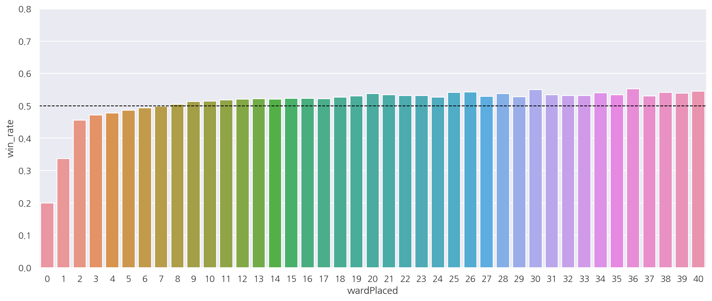
    


```python

```
