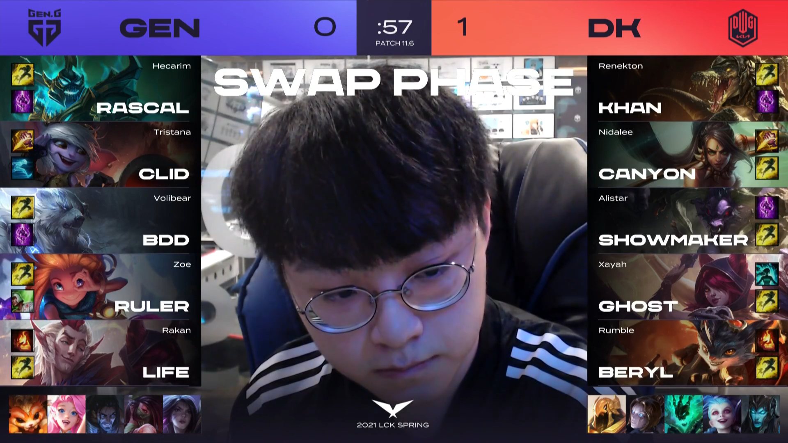
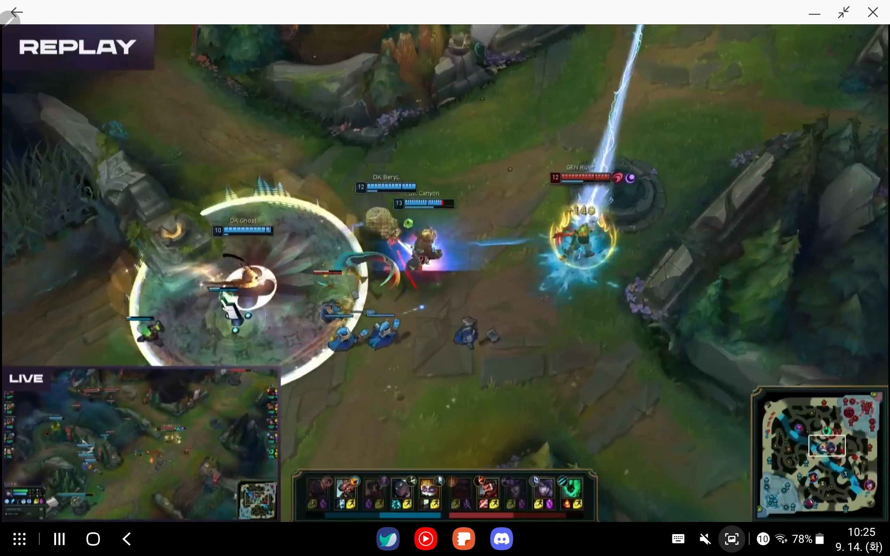

# 세나를 밴 해야할까?


2021 스프링 LCK 결승전 젠지 vs 담원에서 젠지는 상대 시그니처 캐릭터인 세나를 밴하지 않았다.

결과는 3:0으로 담원이 승리하였으며 이 당시 세나를 밴했어야 한다 아니다로 얘기가 많았다.

젠지의 데이터 분석가 입장에서 결승전에 담원을 상대로 세나를 밴을 해야했을까?

이에 대해 첫 번째 경기 시작 전 지표와 첫 경기 인게임 등 여러 관점에서 파악해보자.

## 1. 첫 경기 시작 전

**[데이터 수집]**


```python
import numpy as np
import pandas as pd

import requests
from bs4 import BeautifulSoup
from selenium import webdriver
from selenium.webdriver.common.keys import Keys

import time

import plotly.graph_objects as go
import plotly.figure_factory as ff
```


```python
def league_data(want_team, want_season):
    # 리그 데이터 쿼리 사이트
    url = "https://lol.fandom.com/wiki/Special:RunQuery/MatchHistoryGame"

    # 크롬 드라이버 옵션
    options = webdriver.ChromeOptions()
    options.add_argument('headless')
    options.add_argument('window-size=1920x1080')

    # 크롬 드라이버 실행
    browser = webdriver.Chrome("./chromedriver.exe", options= options)
    browser.get(url)

    # 검색 조건 설정: 팀
    elem = browser.find_element_by_id("input_1")
    elem.send_keys("Team")

    # 리그 지정: 2021 스프링 정규시즌
    elem = browser.find_element_by_id("input_2")
    elem.send_keys(want_season)

    # 팀 지정: 담원 기아
    elem = browser.find_element_by_id("input_3")
    elem.send_keys(want_team)

    # 쿼리 실행 클릭
    elem = browser.find_element_by_id("wpRunQuery")
    elem.click()
    time.sleep(2)
    
    # 실행된 쿼리 url 저장
    soup = BeautifulSoup(browser.page_source, "lxml")
    browser.quit()
    
    # 테이블의 모든 row 태그
    dwg_kia = soup.find("tbody").find_all("tr")

    # 데이터 프레임
    data = pd.DataFrame()

    # 원하는 정보 stack       
    for i in range(0, len(dwg_kia)):
        # 경기 날짜
        date = dwg_kia[i].find_all("td")[0].get_text()
        # 리그
        league = dwg_kia[i].find_all("td")[1].get_text()
        # 버전 정보
        version = dwg_kia[i].find_all("td")[2].get_text()
        # 승리여부
        result = dwg_kia[i].find_all("td")[3].get_text()
        # 진영
        side = dwg_kia[i].find_all("td")[4].get_text()
        # 상대 팀
        vs_team = dwg_kia[i].find_all("td")[5].find("a")["title"]
        # 담원 벤
        dwg_ban = []
        for j in range(0,5):
            dwg_ban.append(dwg_kia[i].find_all("td")[6].find_all("span")[j]["title"])

        # 담원 상대 벤
        vs_ban = []
        for j in range(0,5):
            vs_ban.append(dwg_kia[i].find_all("td")[7].find_all("span")[j]["title"])

        # 담원 픽
        dwg_pick = []
        for j in range(0,5):
            dwg_pick.append(dwg_kia[i].find_all("td")[8].find_all("span")[j]["title"])

        # 담원 상대 픽
        vs_pick = []
        for j in range(0,5):
            vs_pick.append(dwg_kia[i].find_all("td")[9].find_all("span")[j]["title"])
        
        temp = pd.DataFrame([dwg_ban, vs_ban, dwg_pick, vs_pick]).T
        temp["game_id"] = f"{want_team}_{i}"
        temp["date"] = date
        temp["league"] = league
        temp["version"] = version
        temp["result"] = result
        temp["side"] = side
        temp["vs_team"] = vs_team
        temp["team"] = want_team

        data = pd.concat([data, temp], axis=0)

        # temp 삭제
        del temp

    # 컬럼명 및 순서 수정
    data.rename(columns={0:"team_ban", 1:"vs_ban", 2:"team_pick", 3:"vs_pick"}, inplace=True)
    data = data[["game_id","date","league","version","team","vs_team","side",
                 "result","team_ban","vs_ban","team_pick","vs_pick"]]
    
    # 포지션 추가
    data["position"] = ["1T","2J","3M","4A","5S"] * int(len(data) / 5)
    
    return data
```

- 셀레니움 이용 리그 데이터 수집


- 각 팀별 밴픽과 승리 여부 등을 확인하여 수집하였다.


```python
# 원하는 팀명과 시즌을 입력

# 2021 스프링 lck 전체팀
total_team = ['DWG KIA','KT Rolster', 'DRX', 'Gen.G', 'Nongshim RedForce', 
              'Fredit BRION', 'Afreeca Freecs', 'T1', 'Liiv SANDBOX', 'Hanwha Life Esports']

# 시즌 예시: "LCK 2021 Spring", "LCK 2021 Spring Playoffs"
season = "LCK 2021 Spring"

team_lst = []
for team in total_team:
    team2 = team.replace(" ", "_").replace(".", "_")
    team_lst.append(team2)
    data = league_data(team, season)
    print(team2)
    exec(f"{team2}=data")
```

    DWG_KIA
    KT_Rolster
    DRX
    Gen_G
    Nongshim_RedForce
    Fredit_BRION
    Afreeca_Freecs
    T1
    Liiv_SANDBOX
    Hanwha_Life_Esports
    

- 모든 팀별 리그 데이터 저장


```python
# 리그 전체 데이터
lck = pd.DataFrame()

for team in team_lst:
    temp = eval(team)
    lck = pd.concat([lck, temp], axis=0)
    del temp
```

- 리그 전체 데이터 합치기


- 서로 상대한 경기는 겹치기 때문에 이후 원하는 정보에 따라 전처리에 유의


```python
lck.head()
```


<div>
<style scoped>
    .dataframe tbody tr th:only-of-type {
        vertical-align: middle;
    }

    .dataframe tbody tr th {
        vertical-align: top;
    }

    .dataframe thead th {
        text-align: right;
    }
</style>
<table border="1" class="dataframe">
  <thead>
    <tr style="text-align: right;">
      <th></th>
      <th>game_id</th>
      <th>date</th>
      <th>league</th>
      <th>version</th>
      <th>team</th>
      <th>vs_team</th>
      <th>side</th>
      <th>result</th>
      <th>team_ban</th>
      <th>vs_ban</th>
      <th>team_pick</th>
      <th>vs_pick</th>
      <th>position</th>
    </tr>
  </thead>
  <tbody>
    <tr>
      <th>0</th>
      <td>DWG KIA_0</td>
      <td>2021-03-27</td>
      <td>KR LCK 2021 Spring</td>
      <td>11.5</td>
      <td>DWG KIA</td>
      <td>KT Rolster</td>
      <td>Blue</td>
      <td>Win</td>
      <td>Thresh</td>
      <td>Seraphine</td>
      <td>Gangplank</td>
      <td>Renekton</td>
      <td>1T</td>
    </tr>
    <tr>
      <th>1</th>
      <td>DWG KIA_0</td>
      <td>2021-03-27</td>
      <td>KR LCK 2021 Spring</td>
      <td>11.5</td>
      <td>DWG KIA</td>
      <td>KT Rolster</td>
      <td>Blue</td>
      <td>Win</td>
      <td>Ezreal</td>
      <td>Hecarim</td>
      <td>Nidalee</td>
      <td>Lillia</td>
      <td>2J</td>
    </tr>
    <tr>
      <th>2</th>
      <td>DWG KIA_0</td>
      <td>2021-03-27</td>
      <td>KR LCK 2021 Spring</td>
      <td>11.5</td>
      <td>DWG KIA</td>
      <td>KT Rolster</td>
      <td>Blue</td>
      <td>Win</td>
      <td>Rell</td>
      <td>Udyr</td>
      <td>Azir</td>
      <td>Ryze</td>
      <td>3M</td>
    </tr>
    <tr>
      <th>3</th>
      <td>DWG KIA_0</td>
      <td>2021-03-27</td>
      <td>KR LCK 2021 Spring</td>
      <td>11.5</td>
      <td>DWG KIA</td>
      <td>KT Rolster</td>
      <td>Blue</td>
      <td>Win</td>
      <td>Gnar</td>
      <td>Sion</td>
      <td>Senna</td>
      <td>Tristana</td>
      <td>4A</td>
    </tr>
    <tr>
      <th>4</th>
      <td>DWG KIA_0</td>
      <td>2021-03-27</td>
      <td>KR LCK 2021 Spring</td>
      <td>11.5</td>
      <td>DWG KIA</td>
      <td>KT Rolster</td>
      <td>Blue</td>
      <td>Win</td>
      <td>Yone</td>
      <td>Zoe</td>
      <td>Tahm Kench</td>
      <td>Alistar</td>
      <td>5S</td>
    </tr>
  </tbody>
</table>
</div>


**[필요 함수]**


```python
# 시각화 코드
def visualization(data, x1, y1, x2, y2, title1, bar=False):
    fig = ff.create_table(data, height_constant=60)
    
    if bar == False:
        trace1 = go.Scatter(x=data[x1], y=data[y1],
                            marker=dict(color='#0099ff'),
                            xaxis='x2', yaxis='y2',
                            name = y1)

        if x2 != 1:
            trace2 = go.Scatter(x=data[x2], y=data[y2],
                                marker=dict(color='#404040'),
                                xaxis='x2', yaxis='y2', 
                                name = y2)
            fig.add_traces([trace1, trace2])
        else:
            fig.add_traces([trace1])
            
    if bar == True:
        trace1 = go.Bar(x=data[x1], y=data[y1],
                            marker=dict(color='#0099ff'),
                            xaxis='x2', yaxis='y2', 
                            name = y1)

        if x2 != 1:
            trace2 = go.Bar(x=data[x2], y=data[y2],
                                marker=dict(color='#404040'),
                                xaxis='x2', yaxis='y2', 
                                name = y2)
            fig.add_traces([trace1, trace2])
        else:
            fig.add_traces([trace1])

    # initialize xaxis2 and yaxis2
    fig['layout']['xaxis2'] = {}
    fig['layout']['yaxis2'] = {}

    # Edit layout for subplots
    fig.layout.xaxis.update({'domain': [0, .5]})
    fig.layout.xaxis2.update({'domain': [0.6, 1.]})

    # The graph's yaxis MUST BE anchored to the graph's xaxis
    fig.layout.yaxis2.update({'anchor': 'x2'})
    fig.layout.yaxis2.update({'title': ''})

    # Update the margins to add a title and see graph x-labels.
    fig.layout.margin.update({'t':50, 'b':100})
    fig.layout.update({'title': f'{title1}'})

    return fig.show()
```


```python
# 데이터 프레임 색상 칠하기
def draw_color_cell(x, color):
    color = f'background-color:{color}'
    return color
```


```python
# 승률 함수
def WR(x):
    data = []
    
    total = sum(x['result']=="Win") + sum(x['result']=="Loss")
    win = sum(x['result']=="Win")
    lose = sum(x['result']=="Loss")
    win_rate = win / total
    
    data.append(total),
    data.append(win),
    data.append(lose)
    data.append(win_rate)

    return pd.Series(data, index=['total','win_count', 'lose_count', "win_rate"])
```

- 시각화 등 이후 필요한 함수들을 정의 해두었다.

### 세나의 특징


1. 세나는 대부분 단식 세나이며 단식임에도 페시브를 이용해 원딜의 역할을 수행 가능하다.


2. 단식을 통해 서폿이 cs를 먹으면서 라이너가 한 명 추가되는 효과를 볼 수 있다.


3. **서폿이 cs를 먹기 때문에 일반적인 서폿보다 자유도가 높다.**


4. DPM이 높은 캐릭터는 아니나 페시브의 사거리 증가로 인해 선공이 가능하다.


5. 라인전 압박이 가능하다면 페시브를 보다 빨리 쌓을 가능성이 높다.


6. 이로 인해 초중반에 강점을 보이며 극후반에는 일반적인 원딜보다 캐리력이 낮다.


```python
# 원딜 세나가 나온 경기의 게임id
senna_gameid = lck[(lck["team_pick"]=="Senna")&(lck["position"]=="4A")]["game_id"].values

# 원딜 세나의 서포터 (정규시즌)
senna_support = lck[(lck["game_id"].isin(senna_gameid))&(lck["position"]=="5S")]["team_pick"]
senna_support = pd.DataFrame(senna_support.value_counts()).reset_index().rename(columns={"index":"champion"})
```


```python
visualization(senna_support, "champion", "team_pick", 1, 1, "Senna's Supporter", bar=True)
```



- 세나는 주로 탐켄치와 합을 이루며 비슷한 소위 말하는 덩치 챔피언과 자주 나타난다.


- 하지만 하이머딩거와 같은 일반적으로 서폿으로 나오지 않는 챔피언도 사용 가능하다.


```python
# 담원 기아 세나 원딜 사용 시 서폿
dwg_senna = lck[(lck["game_id"].isin(senna_gameid))&(lck["team"]=="DWG KIA")&(lck["position"]=="5S")].reset_index()
dwg_senna
# dwg_senna.style.applymap(draw_color_cell,color='#ff9090',subset=pd.IndexSlice[3,['team_pick']])
```


<div>
<style scoped>
    .dataframe tbody tr th:only-of-type {
        vertical-align: middle;
    }

    .dataframe tbody tr th {
        vertical-align: top;
    }

    .dataframe thead th {
        text-align: right;
    }
</style>
<table border="1" class="dataframe">
  <thead>
    <tr style="text-align: right;">
      <th></th>
      <th>index</th>
      <th>game_id</th>
      <th>date</th>
      <th>league</th>
      <th>version</th>
      <th>team</th>
      <th>vs_team</th>
      <th>side</th>
      <th>result</th>
      <th>team_ban</th>
      <th>vs_ban</th>
      <th>team_pick</th>
      <th>vs_pick</th>
      <th>position</th>
    </tr>
  </thead>
  <tbody>
    <tr>
      <th>0</th>
      <td>4</td>
      <td>DWG KIA_0</td>
      <td>2021-03-27</td>
      <td>KR LCK 2021 Spring</td>
      <td>11.5</td>
      <td>DWG KIA</td>
      <td>KT Rolster</td>
      <td>Blue</td>
      <td>Win</td>
      <td>Yone</td>
      <td>Zoe</td>
      <td>Tahm Kench</td>
      <td>Alistar</td>
      <td>5S</td>
    </tr>
    <tr>
      <th>1</th>
      <td>4</td>
      <td>DWG KIA_12</td>
      <td>2021-03-06</td>
      <td>KR LCK 2021 Spring</td>
      <td>11.4</td>
      <td>DWG KIA</td>
      <td>Afreeca Freecs</td>
      <td>Red</td>
      <td>Win</td>
      <td>Gnar</td>
      <td>Azir</td>
      <td>Tahm Kench</td>
      <td>Nautilus</td>
      <td>5S</td>
    </tr>
    <tr>
      <th>2</th>
      <td>4</td>
      <td>DWG KIA_16</td>
      <td>2021-02-27</td>
      <td>KR LCK 2021 Spring</td>
      <td>11.3</td>
      <td>DWG KIA</td>
      <td>T1</td>
      <td>Red</td>
      <td>Win</td>
      <td>Ezreal</td>
      <td>Nautilus</td>
      <td>Maokai</td>
      <td>Yuumi</td>
      <td>5S</td>
    </tr>
    <tr>
      <th>3</th>
      <td>4</td>
      <td>DWG KIA_19</td>
      <td>2021-02-20</td>
      <td>KR LCK 2021 Spring</td>
      <td>11.3</td>
      <td>DWG KIA</td>
      <td>Hanwha Life Esports</td>
      <td>Red</td>
      <td>Win</td>
      <td>Yone</td>
      <td>Syndra</td>
      <td>Heimerdinger</td>
      <td>Nautilus</td>
      <td>5S</td>
    </tr>
  </tbody>
</table>
</div>


- 담원 역시 대부분 탱커와 합을 이루었지만 앞서 확인한 하이머딩거를 담원이 사용했다는게 중요하다.


```python
# 담원 기아 플레이오프 세나 서폿 (결승전 전)
DWG_KIA_PO = league_data("DWG KIA", "LCK 2021 Spring Playoffs")
temp = DWG_KIA_PO[DWG_KIA_PO["vs_team"] != "Gen.G"]
temp_gameid = temp[temp["team_pick"]=="Senna"]["game_id"].values[0]
temp2 = temp[(temp["game_id"]==temp_gameid) & (temp["position"]=="5S")]
temp2
# temp2.style.applymap(draw_color_cell,color='#ff9090',subset=pd.IndexSlice[4,['team_pick']])
```


<div>
<style scoped>
    .dataframe tbody tr th:only-of-type {
        vertical-align: middle;
    }

    .dataframe tbody tr th {
        vertical-align: top;
    }

    .dataframe thead th {
        text-align: right;
    }
</style>
<table border="1" class="dataframe">
  <thead>
    <tr style="text-align: right;">
      <th></th>
      <th>game_id</th>
      <th>date</th>
      <th>league</th>
      <th>version</th>
      <th>team</th>
      <th>vs_team</th>
      <th>side</th>
      <th>result</th>
      <th>team_ban</th>
      <th>vs_ban</th>
      <th>team_pick</th>
      <th>vs_pick</th>
      <th>position</th>
    </tr>
  </thead>
  <tbody>
    <tr>
      <th>4</th>
      <td>DWG KIA_3</td>
      <td>2021-04-03</td>
      <td>KR LCK 2021 Spring Playoffs</td>
      <td>11.6</td>
      <td>DWG KIA</td>
      <td>Hanwha Life Esports</td>
      <td>Blue</td>
      <td>Win</td>
      <td>Kalista</td>
      <td>Tahm Kench</td>
      <td>Cho'Gath</td>
      <td>Leona</td>
      <td>5S</td>
    </tr>
  </tbody>
</table>
</div>


- 담원은 플레이오프에서 세나의 서폿으로 초가스라는 조커 픽을 사용하였다.

**[정리]**

- 세나는 단식 세나를 사용하여 서폿을 라이너로 키우면서 동시에 원딜 역할 수행이 가능하다.


- 주로 탱커와 합을 이루지만 일반적으로 사용하기 힘든 서폿을 조커픽으로 활용 가능하다.

### 관점 1: 세나는 사기?

세나는 밴해야할 만큼 사기 픽인가?


```python
# 세나 정규시즌 승률
temp = lck.groupby(["position","team_pick"]).apply(WR).reset_index()
temp = temp.sort_values(by=["position","total"], ascending=[True,False])
temp[temp["team_pick"]=="Senna"]
```


<div>
<style scoped>
    .dataframe tbody tr th:only-of-type {
        vertical-align: middle;
    }

    .dataframe tbody tr th {
        vertical-align: top;
    }

    .dataframe thead th {
        text-align: right;
    }
</style>
<table border="1" class="dataframe">
  <thead>
    <tr style="text-align: right;">
      <th></th>
      <th>position</th>
      <th>team_pick</th>
      <th>total</th>
      <th>win_count</th>
      <th>lose_count</th>
      <th>win_rate</th>
    </tr>
  </thead>
  <tbody>
    <tr>
      <th>93</th>
      <td>4A</td>
      <td>Senna</td>
      <td>17.0</td>
      <td>13.0</td>
      <td>4.0</td>
      <td>0.764706</td>
    </tr>
    <tr>
      <th>118</th>
      <td>5S</td>
      <td>Senna</td>
      <td>2.0</td>
      <td>0.0</td>
      <td>2.0</td>
      <td>0.000000</td>
    </tr>
  </tbody>
</table>
</div>


- 정규 시즌 전체 19판 중 13승 6패로 세나 승률은 68%


- 원딜 세나 승률은 13승 4패로 76%


```python
# 15판 이상 활용된 원딜 승률
temp2 = temp[(temp["total"]>15)&(temp["position"]=="4A")].sort_values(by=["position","win_rate"], ascending=[True,False])
temp2["win_rate"] = np.round(temp2["win_rate"],2)
visualization(temp2, "team_pick", "win_rate", 1, 1, "LCK 2021 Spring AD Win Rate", bar=True)
```



- 세나는 15판 이상 픽된 원딜 중 가장 높은 승률


- 다만 픽 수가 17판으로 많지 않다.


```python
# 팀별 세나 전적(원딜만)
temp = lck[(lck["team_pick"]=="Senna")&(lck["position"]=="4A")].groupby(["team","team_pick"], as_index=False).apply(WR)
temp2 = temp.drop("team_pick", axis=1)
temp2["team"] = temp2["team"].apply(lambda x: x.split()[0])
temp2["win_rate"] = np.round(temp2["win_rate"],2)
visualization(temp2, "team", "win_rate", 1, 1, "Senna detail", bar=True)
```




- 세나 원딜로 승리한 팀은 대부분 강팀으로 분류된 팀(KT를 제외하고 1~4등)


```python
# lck 전체 밴픽률 구하기
pick =lck.groupby(["team_pick"],as_index=False).size().rename(columns={"size":"pick"})
ban = lck.groupby(["team_ban"],as_index=False).size().rename(columns={"size":"ban"})

ban_pick = pd.merge(pick, ban, left_on="team_pick", right_on="team_ban", how="outer").fillna(0)
ban_pick["team_pick"] = ban_pick.apply(lambda x: x["team_pick"] if x["team_pick"] !=0 else x["team_ban"], axis=1)
ban_pick.drop("team_ban", axis=1, inplace=True)
ban_pick["banpick"] = ban_pick["pick"] + ban_pick["ban"]

# lck 전체 매치 수
cnt = 0
lst = total_team.copy()
for i, team in enumerate(total_team):
    team2 = team.replace(" ", "_").replace(".", "_")
    data = eval(team2)
    
    lst.pop(lst.index(team))
    cnt += len(data[data["vs_team"].isin(lst)]) / 5
    
# 매치 수 추가 밴픽률 추가
ban_pick["total"] = cnt
ban_pick["banpick_rate"] = ban_pick["banpick"] / ban_pick["total"]
ban_pick = ban_pick.sort_values("banpick_rate", ascending=False)

# 밴픽률 top 10
ban_pick_top10 = ban_pick.head(10)
ban_pick_top10["banpick_rate"] = np.round(ban_pick_top10["banpick_rate"],2)
ban_pick_top10.rename(columns={"team_pick":"champion", "banpick_rate":"BPR"}, inplace=True)

# 시각화
visualization(ban_pick_top10, "champion", "ban", "champion", "pick", "Banpick Rate TOP 10", bar=False)
```



- LCK 전체 경기는 215경기이며 벤픽률이 가장 높은 상위 10개 확인하였다.


- 우선 세나는 밴픽률 상위 10위에 포함 되어있지 않음.


```python
# 리그 전체 세나 밴픽률
ban_pick[ban_pick["team_pick"]=="Senna"]
```


<div>
<style scoped>
    .dataframe tbody tr th:only-of-type {
        vertical-align: middle;
    }

    .dataframe tbody tr th {
        vertical-align: top;
    }

    .dataframe thead th {
        text-align: right;
    }
</style>
<table border="1" class="dataframe">
  <thead>
    <tr style="text-align: right;">
      <th></th>
      <th>team_pick</th>
      <th>pick</th>
      <th>ban</th>
      <th>banpick</th>
      <th>total</th>
      <th>banpick_rate</th>
    </tr>
  </thead>
  <tbody>
    <tr>
      <th>67</th>
      <td>Senna</td>
      <td>19.0</td>
      <td>25.0</td>
      <td>44.0</td>
      <td>215.0</td>
      <td>0.204651</td>
    </tr>
  </tbody>
</table>
</div>


- 실제 세나의 밴픽률은 20% 정도로 높은 편은 아님

**[정리]**

- 세나가 좋은 픽은 맞지만 높은 승률은 상위권 팀의 영향이 크다.


- 스프링 시즌에서 세나의 밴픽률은 낮아 무난한 픽은 아니며 시즌에서 심각한 OP라고 하기엔 무리가 있어 보인다.


단순히 세나가 사기냐? 라는 관점에선 세나를 밴할 필요가 없어보인다.

### 관점 2: 담원의 세나는?

담원의 세나는 다를까?


```python
# 담원 기아 정규 시즌 세나 승률
DWG_KIA[DWG_KIA["team_pick"]=="Senna"].groupby("team_pick", as_index=False).apply(WR)
```


<div>
<style scoped>
    .dataframe tbody tr th:only-of-type {
        vertical-align: middle;
    }

    .dataframe tbody tr th {
        vertical-align: top;
    }

    .dataframe thead th {
        text-align: right;
    }
</style>
<table border="1" class="dataframe">
  <thead>
    <tr style="text-align: right;">
      <th></th>
      <th>team_pick</th>
      <th>total</th>
      <th>win_count</th>
      <th>lose_count</th>
      <th>win_rate</th>
    </tr>
  </thead>
  <tbody>
    <tr>
      <th>0</th>
      <td>Senna</td>
      <td>4.0</td>
      <td>4.0</td>
      <td>0.0</td>
      <td>1.0</td>
    </tr>
  </tbody>
</table>
</div>


- 고스트의 정규시즌 세나 승률은 4승 0패로 100%


```python
# 담원 기아 결승전 전의 세나 승률
temp = DWG_KIA_PO[DWG_KIA_PO["vs_team"] != "Gen.G"]
temp[temp["team_pick"]=="Senna"].groupby("team_pick", as_index=False).apply(WR)
```


<div>
<style scoped>
    .dataframe tbody tr th:only-of-type {
        vertical-align: middle;
    }

    .dataframe tbody tr th {
        vertical-align: top;
    }

    .dataframe thead th {
        text-align: right;
    }
</style>
<table border="1" class="dataframe">
  <thead>
    <tr style="text-align: right;">
      <th></th>
      <th>team_pick</th>
      <th>total</th>
      <th>win_count</th>
      <th>lose_count</th>
      <th>win_rate</th>
    </tr>
  </thead>
  <tbody>
    <tr>
      <th>0</th>
      <td>Senna</td>
      <td>1.0</td>
      <td>1.0</td>
      <td>0.0</td>
      <td>1.0</td>
    </tr>
  </tbody>
</table>
</div>


- 고스트의 플레이오프 결승전 전의 승률은 1승 0패로 100%


```python
# 담원 2020 섬머 세나 전적
DWG_KIA_2020 = league_data("DWG", "LCK 2020 Summer")
DWG_KIA_2020[DWG_KIA_2020["team_pick"]=="Senna"].groupby("team_pick", as_index=False).apply(WR)
```


<div>
<style scoped>
    .dataframe tbody tr th:only-of-type {
        vertical-align: middle;
    }

    .dataframe tbody tr th {
        vertical-align: top;
    }

    .dataframe thead th {
        text-align: right;
    }
</style>
<table border="1" class="dataframe">
  <thead>
    <tr style="text-align: right;">
      <th></th>
      <th>team_pick</th>
      <th>total</th>
      <th>win_count</th>
      <th>lose_count</th>
      <th>win_rate</th>
    </tr>
  </thead>
  <tbody>
    <tr>
      <th>0</th>
      <td>Senna</td>
      <td>10.0</td>
      <td>8.0</td>
      <td>2.0</td>
      <td>0.8</td>
    </tr>
  </tbody>
</table>
</div>


- 2020 섬머에서도 고스트는 세나 승률이 80%


```python
# 세나를 밴 당한 팀
temp = lck[lck["vs_ban"]=="Senna"].groupby("team").count()[["vs_ban"]].reset_index()
temp["ban_rate"] = temp["vs_ban"] / sum(temp["vs_ban"])

# 시각화
visualization(temp, "team", "vs_ban", 1, 1, "Senna Banned", bar=True)
```



- 앞서 확인하였듯이 세나는 전체 25번 밴을 당하였는데 그 중 14번이 담원을 상대로 한 밴이었다.


```python
# 담원을 상대로 한 밴 횟수를 내림차순으로 정렬
# 담원 기아 밴픽률
pick =DWG_KIA.groupby(["team_pick"],as_index=False).size().rename(columns={"size":"pick"})
ban = DWG_KIA.groupby(["vs_ban"],as_index=False).size().rename(columns={"size":"ban"})

DWG_ban_pick = pd.merge(pick, ban, left_on="team_pick", right_on="vs_ban", how="outer").fillna(0)
DWG_ban_pick["team_pick"] = DWG_ban_pick.apply(lambda x: x["team_pick"] if x["team_pick"] !=0 else x["vs_ban"], axis=1)
DWG_ban_pick.drop("vs_ban", axis=1, inplace=True)
DWG_ban_pick["banpick"] = DWG_ban_pick["pick"] + DWG_ban_pick["ban"]

cnt = DWG_KIA.shape[0] / 5

# 매치 수 추가 밴픽률 추가
DWG_ban_pick["total"] = cnt
DWG_ban_pick["banpick_rate"] = DWG_ban_pick["banpick"] / DWG_ban_pick["total"]
DWG_ban_pick = DWG_ban_pick.sort_values("ban", ascending=False)
temp = DWG_ban_pick.head(10)
temp["pick"] = temp["pick"].astype(int)
temp["ban"] = temp["ban"].astype(int)
temp["banpick"] = temp["banpick"].astype(int)
temp["total"] = temp["total"].astype(int)

temp
# temp.style.applymap(draw_color_cell,color='#ff9090',subset=pd.IndexSlice[36,'team_pick':"banpick_rate"])
```


<div>
<style scoped>
    .dataframe tbody tr th:only-of-type {
        vertical-align: middle;
    }

    .dataframe tbody tr th {
        vertical-align: top;
    }

    .dataframe thead th {
        text-align: right;
    }
</style>
<table border="1" class="dataframe">
  <thead>
    <tr style="text-align: right;">
      <th></th>
      <th>team_pick</th>
      <th>pick</th>
      <th>ban</th>
      <th>banpick</th>
      <th>total</th>
      <th>banpick_rate</th>
    </tr>
  </thead>
  <tbody>
    <tr>
      <th>10</th>
      <td>Graves</td>
      <td>9</td>
      <td>16</td>
      <td>25</td>
      <td>43</td>
      <td>0.581395</td>
    </tr>
    <tr>
      <th>40</th>
      <td>Syndra</td>
      <td>12</td>
      <td>14</td>
      <td>26</td>
      <td>43</td>
      <td>0.604651</td>
    </tr>
    <tr>
      <th>36</th>
      <td>Senna</td>
      <td>4</td>
      <td>14</td>
      <td>18</td>
      <td>43</td>
      <td>0.418605</td>
    </tr>
    <tr>
      <th>54</th>
      <td>Zoe</td>
      <td>8</td>
      <td>12</td>
      <td>20</td>
      <td>43</td>
      <td>0.465116</td>
    </tr>
    <tr>
      <th>42</th>
      <td>Taliyah</td>
      <td>1</td>
      <td>12</td>
      <td>13</td>
      <td>43</td>
      <td>0.302326</td>
    </tr>
    <tr>
      <th>37</th>
      <td>Seraphine</td>
      <td>6</td>
      <td>12</td>
      <td>18</td>
      <td>43</td>
      <td>0.418605</td>
    </tr>
    <tr>
      <th>31</th>
      <td>Rell</td>
      <td>7</td>
      <td>10</td>
      <td>17</td>
      <td>43</td>
      <td>0.395349</td>
    </tr>
    <tr>
      <th>28</th>
      <td>Pantheon</td>
      <td>2</td>
      <td>9</td>
      <td>11</td>
      <td>43</td>
      <td>0.255814</td>
    </tr>
    <tr>
      <th>8</th>
      <td>Gnar</td>
      <td>7</td>
      <td>9</td>
      <td>16</td>
      <td>43</td>
      <td>0.372093</td>
    </tr>
    <tr>
      <th>46</th>
      <td>Udyr</td>
      <td>5</td>
      <td>9</td>
      <td>14</td>
      <td>43</td>
      <td>0.325581</td>
    </tr>
  </tbody>
</table>
</div>


- 실제로 담원을 상대로 사용한 밴 카드 중 그레이브즈가 16번으로 가장 많다.


- 바로 다음이 신드라와 세나가 14번으로 가장 많을 정도로 리그의 세나는 밴픽률이 낮은데 비하여 고스트 세나는 집중 견제 받은 모습


```python
# 담원 기아 세나 원딜 사용 시 서폿
dwg_senna = lck[(lck["game_id"].isin(senna_gameid))&(lck["team"]=="DWG KIA")&(lck["position"]=="5S")].reset_index()
dwg_senna
#dwg_senna.style.applymap(draw_color_cell,color='#ff9090',subset=pd.IndexSlice[3,['team_pick']])
```


<div>
<style scoped>
    .dataframe tbody tr th:only-of-type {
        vertical-align: middle;
    }

    .dataframe tbody tr th {
        vertical-align: top;
    }

    .dataframe thead th {
        text-align: right;
    }
</style>
<table border="1" class="dataframe">
  <thead>
    <tr style="text-align: right;">
      <th></th>
      <th>index</th>
      <th>game_id</th>
      <th>date</th>
      <th>league</th>
      <th>version</th>
      <th>team</th>
      <th>vs_team</th>
      <th>side</th>
      <th>result</th>
      <th>team_ban</th>
      <th>vs_ban</th>
      <th>team_pick</th>
      <th>vs_pick</th>
      <th>position</th>
    </tr>
  </thead>
  <tbody>
    <tr>
      <th>0</th>
      <td>4</td>
      <td>DWG KIA_0</td>
      <td>2021-03-27</td>
      <td>KR LCK 2021 Spring</td>
      <td>11.5</td>
      <td>DWG KIA</td>
      <td>KT Rolster</td>
      <td>Blue</td>
      <td>Win</td>
      <td>Yone</td>
      <td>Zoe</td>
      <td>Tahm Kench</td>
      <td>Alistar</td>
      <td>5S</td>
    </tr>
    <tr>
      <th>1</th>
      <td>4</td>
      <td>DWG KIA_12</td>
      <td>2021-03-06</td>
      <td>KR LCK 2021 Spring</td>
      <td>11.4</td>
      <td>DWG KIA</td>
      <td>Afreeca Freecs</td>
      <td>Red</td>
      <td>Win</td>
      <td>Gnar</td>
      <td>Azir</td>
      <td>Tahm Kench</td>
      <td>Nautilus</td>
      <td>5S</td>
    </tr>
    <tr>
      <th>2</th>
      <td>4</td>
      <td>DWG KIA_16</td>
      <td>2021-02-27</td>
      <td>KR LCK 2021 Spring</td>
      <td>11.3</td>
      <td>DWG KIA</td>
      <td>T1</td>
      <td>Red</td>
      <td>Win</td>
      <td>Ezreal</td>
      <td>Nautilus</td>
      <td>Maokai</td>
      <td>Yuumi</td>
      <td>5S</td>
    </tr>
    <tr>
      <th>3</th>
      <td>4</td>
      <td>DWG KIA_19</td>
      <td>2021-02-20</td>
      <td>KR LCK 2021 Spring</td>
      <td>11.3</td>
      <td>DWG KIA</td>
      <td>Hanwha Life Esports</td>
      <td>Red</td>
      <td>Win</td>
      <td>Yone</td>
      <td>Syndra</td>
      <td>Heimerdinger</td>
      <td>Nautilus</td>
      <td>5S</td>
    </tr>
  </tbody>
</table>
</div>


```python
# 담원 기아 플레이오프 세나 서폿 (결승전 전)
DWG_KIA_PO = league_data("DWG KIA", "LCK 2021 Spring Playoffs")
temp = DWG_KIA_PO[DWG_KIA_PO["vs_team"] != "Gen.G"]
temp_gameid = temp[temp["team_pick"]=="Senna"]["game_id"].values[0]
temp2 = temp[(temp["game_id"]==temp_gameid) & (temp["position"]=="5S")]
temp2
# temp2.style.applymap(draw_color_cell,color='#ff9090',subset=pd.IndexSlice[4,['team_pick']])
```


<div>
<style scoped>
    .dataframe tbody tr th:only-of-type {
        vertical-align: middle;
    }

    .dataframe tbody tr th {
        vertical-align: top;
    }

    .dataframe thead th {
        text-align: right;
    }
</style>
<table border="1" class="dataframe">
  <thead>
    <tr style="text-align: right;">
      <th></th>
      <th>game_id</th>
      <th>date</th>
      <th>league</th>
      <th>version</th>
      <th>team</th>
      <th>vs_team</th>
      <th>side</th>
      <th>result</th>
      <th>team_ban</th>
      <th>vs_ban</th>
      <th>team_pick</th>
      <th>vs_pick</th>
      <th>position</th>
    </tr>
  </thead>
  <tbody>
    <tr>
      <th>4</th>
      <td>DWG KIA_3</td>
      <td>2021-04-03</td>
      <td>KR LCK 2021 Spring Playoffs</td>
      <td>11.6</td>
      <td>DWG KIA</td>
      <td>Hanwha Life Esports</td>
      <td>Blue</td>
      <td>Win</td>
      <td>Kalista</td>
      <td>Tahm Kench</td>
      <td>Cho'Gath</td>
      <td>Leona</td>
      <td>5S</td>
    </tr>
  </tbody>
</table>
</div>


- 앞서 확인하였듯이 담원은 세나의 서폿으로 하이머딩거, 초가스 조커픽을 활용한 경험이 있다.

**[정리]**

- 앞서 세나는 사기일까?에서 세나는 심각한 op라고 하긴 힘들었다.


- 담원의 세나는 이전 시즌부터 고승률의 시그니처 픽으로 스프링에서도 100% 승률과 집중 견제를 받은 모습을 확인했다.


- 또한 세나의 특징 중 하나인 서포터의 자유도가 높은 점을 잘 이용한 것이 담원이며 그로 인한 변수가 많은 픽임을 알 수 있다.

이러한 점을 고려하면 담원의 세나는 견제 할 필요가 있고 밴을 할 필요성이 있다.

### 관점 3: 젠지의 카운터 준비

젠지 입장에서 세나가 무서울까?, 혹은 카운터를 준비한 건 아닐까?


```python
Gen_G[(Gen_G["vs_team"]=="DWG KIA")&(Gen_G["position"]=="4A")]
```


<div>
<style scoped>
    .dataframe tbody tr th:only-of-type {
        vertical-align: middle;
    }

    .dataframe tbody tr th {
        vertical-align: top;
    }

    .dataframe thead th {
        text-align: right;
    }
</style>
<table border="1" class="dataframe">
  <thead>
    <tr style="text-align: right;">
      <th></th>
      <th>game_id</th>
      <th>date</th>
      <th>league</th>
      <th>version</th>
      <th>team</th>
      <th>vs_team</th>
      <th>side</th>
      <th>result</th>
      <th>team_ban</th>
      <th>vs_ban</th>
      <th>team_pick</th>
      <th>vs_pick</th>
      <th>position</th>
    </tr>
  </thead>
  <tbody>
    <tr>
      <th>3</th>
      <td>Gen.G_5</td>
      <td>2021-03-18</td>
      <td>KR LCK 2021 Spring</td>
      <td>11.5</td>
      <td>Gen.G</td>
      <td>DWG KIA</td>
      <td>Blue</td>
      <td>Win</td>
      <td>Yone</td>
      <td>Orianna</td>
      <td>Jinx</td>
      <td>Kai'Sa</td>
      <td>4A</td>
    </tr>
    <tr>
      <th>3</th>
      <td>Gen.G_6</td>
      <td>2021-03-18</td>
      <td>KR LCK 2021 Spring</td>
      <td>11.5</td>
      <td>Gen.G</td>
      <td>DWG KIA</td>
      <td>Red</td>
      <td>Loss</td>
      <td>Zoe</td>
      <td>Irelia</td>
      <td>Kai'Sa</td>
      <td>Tristana</td>
      <td>4A</td>
    </tr>
    <tr>
      <th>3</th>
      <td>Gen.G_7</td>
      <td>2021-03-18</td>
      <td>KR LCK 2021 Spring</td>
      <td>11.5</td>
      <td>Gen.G</td>
      <td>DWG KIA</td>
      <td>Blue</td>
      <td>Win</td>
      <td>Yone</td>
      <td>Irelia</td>
      <td>Jinx</td>
      <td>Kai'Sa</td>
      <td>4A</td>
    </tr>
    <tr>
      <th>3</th>
      <td>Gen.G_31</td>
      <td>2021-01-27</td>
      <td>KR LCK 2021 Spring</td>
      <td>11.2</td>
      <td>Gen.G</td>
      <td>DWG KIA</td>
      <td>Red</td>
      <td>Loss</td>
      <td>Gnar</td>
      <td>Azir</td>
      <td>Xayah</td>
      <td>Kai'Sa</td>
      <td>4A</td>
    </tr>
    <tr>
      <th>3</th>
      <td>Gen.G_32</td>
      <td>2021-01-27</td>
      <td>KR LCK 2021 Spring</td>
      <td>11.2</td>
      <td>Gen.G</td>
      <td>DWG KIA</td>
      <td>Blue</td>
      <td>Loss</td>
      <td>Syndra</td>
      <td>Irelia</td>
      <td>Kai'Sa</td>
      <td>Xayah</td>
      <td>4A</td>
    </tr>
    <tr>
      <th>3</th>
      <td>Gen.G_33</td>
      <td>2021-01-27</td>
      <td>KR LCK 2021 Spring</td>
      <td>11.2</td>
      <td>Gen.G</td>
      <td>DWG KIA</td>
      <td>Red</td>
      <td>Win</td>
      <td>Yone</td>
      <td>Azir</td>
      <td>Xayah</td>
      <td>Kai'Sa</td>
      <td>4A</td>
    </tr>
  </tbody>
</table>
</div>


- 정규 시즌 담원vs젠지는 세트 스코어 3대3으로 동률이며 이 때 젠지는 담원의 세나를 만난 경험이 없다.


```python
Gen_G[Gen_G["team_pick"]=="Senna"].groupby("team_pick").apply(WR)
```


<div>
<style scoped>
    .dataframe tbody tr th:only-of-type {
        vertical-align: middle;
    }

    .dataframe tbody tr th {
        vertical-align: top;
    }

    .dataframe thead th {
        text-align: right;
    }
</style>
<table border="1" class="dataframe">
  <thead>
    <tr style="text-align: right;">
      <th></th>
      <th>total</th>
      <th>win_count</th>
      <th>lose_count</th>
      <th>win_rate</th>
    </tr>
    <tr>
      <th>team_pick</th>
      <th></th>
      <th></th>
      <th></th>
      <th></th>
    </tr>
  </thead>
  <tbody>
    <tr>
      <th>Senna</th>
      <td>1.0</td>
      <td>1.0</td>
      <td>0.0</td>
      <td>1.0</td>
    </tr>
  </tbody>
</table>
</div>


- 젠지는 정규시즌에서 세나를 1번 플레이해서 승리한 경험이 있다.


```python
# 젠지의 정규시즌 마지막 경기
Gen_G[Gen_G["game_id"]=="Gen.G_0"]
```


<div>
<style scoped>
    .dataframe tbody tr th:only-of-type {
        vertical-align: middle;
    }

    .dataframe tbody tr th {
        vertical-align: top;
    }

    .dataframe thead th {
        text-align: right;
    }
</style>
<table border="1" class="dataframe">
  <thead>
    <tr style="text-align: right;">
      <th></th>
      <th>game_id</th>
      <th>date</th>
      <th>league</th>
      <th>version</th>
      <th>team</th>
      <th>vs_team</th>
      <th>side</th>
      <th>result</th>
      <th>team_ban</th>
      <th>vs_ban</th>
      <th>team_pick</th>
      <th>vs_pick</th>
      <th>position</th>
    </tr>
  </thead>
  <tbody>
    <tr>
      <th>0</th>
      <td>Gen.G_0</td>
      <td>2021-03-26</td>
      <td>KR LCK 2021 Spring</td>
      <td>11.5</td>
      <td>Gen.G</td>
      <td>DRX</td>
      <td>Blue</td>
      <td>Win</td>
      <td>Gnar</td>
      <td>Kalista</td>
      <td>Volibear</td>
      <td>Renekton</td>
      <td>1T</td>
    </tr>
    <tr>
      <th>1</th>
      <td>Gen.G_0</td>
      <td>2021-03-26</td>
      <td>KR LCK 2021 Spring</td>
      <td>11.5</td>
      <td>Gen.G</td>
      <td>DRX</td>
      <td>Blue</td>
      <td>Win</td>
      <td>Seraphine</td>
      <td>Thresh</td>
      <td>Udyr</td>
      <td>Nidalee</td>
      <td>2J</td>
    </tr>
    <tr>
      <th>2</th>
      <td>Gen.G_0</td>
      <td>2021-03-26</td>
      <td>KR LCK 2021 Spring</td>
      <td>11.5</td>
      <td>Gen.G</td>
      <td>DRX</td>
      <td>Blue</td>
      <td>Win</td>
      <td>Lillia</td>
      <td>Hecarim</td>
      <td>Zoe</td>
      <td>Viktor</td>
      <td>3M</td>
    </tr>
    <tr>
      <th>3</th>
      <td>Gen.G_0</td>
      <td>2021-03-26</td>
      <td>KR LCK 2021 Spring</td>
      <td>11.5</td>
      <td>Gen.G</td>
      <td>DRX</td>
      <td>Blue</td>
      <td>Win</td>
      <td>Rell</td>
      <td>Tahm Kench</td>
      <td>Senna</td>
      <td>Tristana</td>
      <td>4A</td>
    </tr>
    <tr>
      <th>4</th>
      <td>Gen.G_0</td>
      <td>2021-03-26</td>
      <td>KR LCK 2021 Spring</td>
      <td>11.5</td>
      <td>Gen.G</td>
      <td>DRX</td>
      <td>Blue</td>
      <td>Win</td>
      <td>Orianna</td>
      <td>Azir</td>
      <td>Karma</td>
      <td>Nautilus</td>
      <td>5S</td>
    </tr>
  </tbody>
</table>
</div>


- 세나를 플레이한 경기는 젠지의 정규 시즌 마지막 경기이다.


```python
# 젠지 플레이오프
Gen_G_PO = league_data("Gen.G", "LCK 2021 Spring Playoffs")
Gen_G_PO[(Gen_G_PO["vs_pick"] == "Senna")&(Gen_G_PO["vs_team"]=="T1")]
```


<div>
<style scoped>
    .dataframe tbody tr th:only-of-type {
        vertical-align: middle;
    }

    .dataframe tbody tr th {
        vertical-align: top;
    }

    .dataframe thead th {
        text-align: right;
    }
</style>
<table border="1" class="dataframe">
  <thead>
    <tr style="text-align: right;">
      <th></th>
      <th>game_id</th>
      <th>date</th>
      <th>league</th>
      <th>version</th>
      <th>team</th>
      <th>vs_team</th>
      <th>side</th>
      <th>result</th>
      <th>team_ban</th>
      <th>vs_ban</th>
      <th>team_pick</th>
      <th>vs_pick</th>
      <th>position</th>
    </tr>
  </thead>
  <tbody>
    <tr>
      <th>3</th>
      <td>Gen.G_4</td>
      <td>2021-04-04</td>
      <td>KR LCK 2021 Spring Playoffs</td>
      <td>11.6</td>
      <td>Gen.G</td>
      <td>T1</td>
      <td>Blue</td>
      <td>Win</td>
      <td>Camille</td>
      <td>Sylas</td>
      <td>Kalista</td>
      <td>Senna</td>
      <td>4A</td>
    </tr>
  </tbody>
</table>
</div>


- 정규 시즌 이후 젠지는 플레이오프에서 T1을 만나 세나를 상대로 승리하였다.

**[정리]**

위를 토대로 시간 순으로 정리해보자.

1. 젠지는 결승전 전까지 스프링 시즌에서 담원의 세나를 상대한 경험이 없다.


2. 젠지는 시즌 마지막 경기에서 세나를 사용할 줄 안다는 것을 보여주었다.


3. 이후 플레이오프에서 세나를 상대로 승리한 경험이 있다.

이런 점을 고려한다면 젠지는 필수적으로 세나를 밴 해야할 이유는 없을 것으로 보인다.

### 관점 4: 젠지의 한계

또 다른 관점으로 세나를 인정하지만 더 우선 순위의 밴이 있진 않았을까?

**[플레이오프 밴픽 1set]**


**[플레이오프 밴픽 2set]**


**[플레이오프 밴픽 3set]**


**[결승전 밴픽 1set]**


**[결승전 밴픽 2set]**



**[결승전 밴픽 3set]**


- 젠지는 플레이오프부터 결승전까지 6세트 동안 모두 나르, 세라핀을 고정 밴하였다.


- 젠지는 왜 나르, 세라핀을 밴 할 수 밖에 없었을까?


```python
# 정규시즌 밴픽율
temp = ban_pick.sort_values("ban", ascending=False).head()
temp["pick"] = temp["pick"].astype(int)
temp["ban"] = temp["ban"].astype(int)
temp["banpick"] = temp["banpick"].astype(int)
temp["total"] = temp["total"].astype(int)

temp
# temp.style.applymap(draw_color_cell,color='#ff9090',subset=pd.IndexSlice[17:68,'team_pick':"banpick_rate"])
```


<div>
<style scoped>
    .dataframe tbody tr th:only-of-type {
        vertical-align: middle;
    }

    .dataframe tbody tr th {
        vertical-align: top;
    }

    .dataframe thead th {
        text-align: right;
    }
</style>
<table border="1" class="dataframe">
  <thead>
    <tr style="text-align: right;">
      <th></th>
      <th>team_pick</th>
      <th>pick</th>
      <th>ban</th>
      <th>banpick</th>
      <th>total</th>
      <th>banpick_rate</th>
    </tr>
  </thead>
  <tbody>
    <tr>
      <th>63</th>
      <td>Renekton</td>
      <td>56</td>
      <td>121</td>
      <td>177</td>
      <td>215</td>
      <td>0.820000</td>
    </tr>
    <tr>
      <th>17</th>
      <td>Gnar</td>
      <td>81</td>
      <td>112</td>
      <td>193</td>
      <td>215</td>
      <td>0.900000</td>
    </tr>
    <tr>
      <th>68</th>
      <td>Seraphine</td>
      <td>29</td>
      <td>107</td>
      <td>136</td>
      <td>215</td>
      <td>0.630000</td>
    </tr>
    <tr>
      <th>62</th>
      <td>Rell</td>
      <td>82</td>
      <td>90</td>
      <td>172</td>
      <td>215</td>
      <td>0.800000</td>
    </tr>
    <tr>
      <th>78</th>
      <td>Thresh</td>
      <td>44</td>
      <td>86</td>
      <td>130</td>
      <td>215</td>
      <td>0.604651</td>
    </tr>
  </tbody>
</table>
</div>


- 정규시즌에서 세라핀은 무려 107번 밴 당하였고 밴픽율이 63%에 달한다.


- 또한 세라핀은 미드와 서폿 스왑이 가능하다는 장점이 있다.


- 나르 역시 밴픽율 90%라는 수치로 시즌 내내 밴, 픽이 많이 되었다.


```python
# 담원 기아 결승전 전까지 세라핀 활용도
temp = DWG_KIA_PO[DWG_KIA_PO["vs_team"] != "Gen.G"]
DWG_KIA_all = pd.concat([DWG_KIA, temp], axis=0)
temp2 = DWG_KIA_all.groupby(["position","team_pick"]).apply(WR).reset_index("team_pick")
temp2[temp2["team_pick"]=="Seraphine"]
```


<div>
<style scoped>
    .dataframe tbody tr th:only-of-type {
        vertical-align: middle;
    }

    .dataframe tbody tr th {
        vertical-align: top;
    }

    .dataframe thead th {
        text-align: right;
    }
</style>
<table border="1" class="dataframe">
  <thead>
    <tr style="text-align: right;">
      <th></th>
      <th>team_pick</th>
      <th>total</th>
      <th>win_count</th>
      <th>lose_count</th>
      <th>win_rate</th>
    </tr>
    <tr>
      <th>position</th>
      <th></th>
      <th></th>
      <th></th>
      <th></th>
      <th></th>
    </tr>
  </thead>
  <tbody>
    <tr>
      <th>3M</th>
      <td>Seraphine</td>
      <td>3.0</td>
      <td>3.0</td>
      <td>0.0</td>
      <td>1.00</td>
    </tr>
    <tr>
      <th>5S</th>
      <td>Seraphine</td>
      <td>4.0</td>
      <td>3.0</td>
      <td>1.0</td>
      <td>0.75</td>
    </tr>
  </tbody>
</table>
</div>


- 담원은 세라핀을 미드에서 3번, 서폿으로 4번 총 7번 활용해 6승 1패의 성적을 거두었다.


```python
# 젠지 결승전 전까지 스프링 미드 챔프폭
temp = Gen_G_PO[Gen_G_PO["vs_team"] != "Gen.G"]
Gen_G_all = pd.concat([Gen_G, temp], axis=0)
temp2 = Gen_G_all.groupby(["position","team_pick"]).apply(WR).reset_index()

temp2[temp2["position"]=="3M"]
```


<div>
<style scoped>
    .dataframe tbody tr th:only-of-type {
        vertical-align: middle;
    }

    .dataframe tbody tr th {
        vertical-align: top;
    }

    .dataframe thead th {
        text-align: right;
    }
</style>
<table border="1" class="dataframe">
  <thead>
    <tr style="text-align: right;">
      <th></th>
      <th>position</th>
      <th>team_pick</th>
      <th>total</th>
      <th>win_count</th>
      <th>lose_count</th>
      <th>win_rate</th>
    </tr>
  </thead>
  <tbody>
    <tr>
      <th>21</th>
      <td>3M</td>
      <td>Azir</td>
      <td>15.0</td>
      <td>10.0</td>
      <td>5.0</td>
      <td>0.666667</td>
    </tr>
    <tr>
      <th>22</th>
      <td>3M</td>
      <td>Orianna</td>
      <td>11.0</td>
      <td>7.0</td>
      <td>4.0</td>
      <td>0.636364</td>
    </tr>
    <tr>
      <th>23</th>
      <td>3M</td>
      <td>Syndra</td>
      <td>19.0</td>
      <td>12.0</td>
      <td>7.0</td>
      <td>0.631579</td>
    </tr>
    <tr>
      <th>24</th>
      <td>3M</td>
      <td>Yone</td>
      <td>1.0</td>
      <td>1.0</td>
      <td>0.0</td>
      <td>1.000000</td>
    </tr>
    <tr>
      <th>25</th>
      <td>3M</td>
      <td>Zoe</td>
      <td>4.0</td>
      <td>2.0</td>
      <td>2.0</td>
      <td>0.500000</td>
    </tr>
  </tbody>
</table>
</div>


- 비디디는 정규시즌 내에 5개의 챔피언만 플레이하였고 이는 5경기 이상한 미드라이너 중 가장 적은 챔프 폭이다.


- 5개의 챔피언 중 요네는 1판 플레이해서 사실상 4개의 챔피언 폭으로 매우 적다.


- 리그에서 밴픽률이 매우 높은 세라핀 역시 플레이하지 않았다.


- 라이프 역시 서포터 정보를 보면 세라핀을 플레이한 경험이 없다.


- 자주 사용한 서포터 역시 대부분 이니시형 탱커로 유틸 서폿을 선호하지 않는 모습이다.


- 본인들은 활용을 못하지만 미드, 서폿 스왑이 가능한 밴픽율 높은 챔피언을 밴하는 것이 편했을 것이다.


- 라스칼은 나르를 총 4번 플레이해서 2승 2패를 한 경험이 있다.


```python
# 나르 상대 승이 많은 챔피언
temp = lck[lck["vs_pick"]=="Gnar"].groupby("team_pick").apply(WR).sort_values("win_count",ascending=False).head(5)
temp["total"] = temp["total"].astype(int)
temp["win_count"] = temp["win_count"].astype(int)
temp["lose_count"] = temp["lose_count"].astype(int)

temp
# temp.style.applymap(draw_color_cell,color='#ff9090',subset=pd.IndexSlice["Jayce",'total':"win_rate"])
```


<div>
<style scoped>
    .dataframe tbody tr th:only-of-type {
        vertical-align: middle;
    }

    .dataframe tbody tr th {
        vertical-align: top;
    }

    .dataframe thead th {
        text-align: right;
    }
</style>
<table border="1" class="dataframe">
  <thead>
    <tr style="text-align: right;">
      <th></th>
      <th>total</th>
      <th>win_count</th>
      <th>lose_count</th>
      <th>win_rate</th>
    </tr>
    <tr>
      <th>team_pick</th>
      <th></th>
      <th></th>
      <th></th>
      <th></th>
    </tr>
  </thead>
  <tbody>
    <tr>
      <th>Jayce</th>
      <td>13</td>
      <td>8</td>
      <td>5</td>
      <td>0.615385</td>
    </tr>
    <tr>
      <th>Camille</th>
      <td>13</td>
      <td>7</td>
      <td>6</td>
      <td>0.538462</td>
    </tr>
    <tr>
      <th>Irelia</th>
      <td>7</td>
      <td>6</td>
      <td>1</td>
      <td>0.857143</td>
    </tr>
    <tr>
      <th>Sion</th>
      <td>8</td>
      <td>6</td>
      <td>2</td>
      <td>0.750000</td>
    </tr>
    <tr>
      <th>Renekton</th>
      <td>9</td>
      <td>4</td>
      <td>5</td>
      <td>0.444444</td>
    </tr>
  </tbody>
</table>
</div>


- 시즌 중에 나르를 상대로 가장 많이 승리한 챔피언은 제이스이며 다음으로 카밀이다.


- 라스칼은 제이스를 한번도 플레이 한적이 없으나 카밀은 모스트픽이다.


```python
# 나르 상대 라스칼 챔피언
Gen_G[Gen_G["vs_pick"]=="Gnar"].groupby("team_pick").apply(WR)
```


<div>
<style scoped>
    .dataframe tbody tr th:only-of-type {
        vertical-align: middle;
    }

    .dataframe tbody tr th {
        vertical-align: top;
    }

    .dataframe thead th {
        text-align: right;
    }
</style>
<table border="1" class="dataframe">
  <thead>
    <tr style="text-align: right;">
      <th></th>
      <th>total</th>
      <th>win_count</th>
      <th>lose_count</th>
      <th>win_rate</th>
    </tr>
    <tr>
      <th>team_pick</th>
      <th></th>
      <th></th>
      <th></th>
      <th></th>
    </tr>
  </thead>
  <tbody>
    <tr>
      <th>Camille</th>
      <td>5.0</td>
      <td>3.0</td>
      <td>2.0</td>
      <td>0.6</td>
    </tr>
    <tr>
      <th>Irelia</th>
      <td>1.0</td>
      <td>1.0</td>
      <td>0.0</td>
      <td>1.0</td>
    </tr>
    <tr>
      <th>Neeko</th>
      <td>1.0</td>
      <td>0.0</td>
      <td>1.0</td>
      <td>0.0</td>
    </tr>
    <tr>
      <th>Pantheon</th>
      <td>1.0</td>
      <td>1.0</td>
      <td>0.0</td>
      <td>1.0</td>
    </tr>
    <tr>
      <th>Quinn</th>
      <td>1.0</td>
      <td>1.0</td>
      <td>0.0</td>
      <td>1.0</td>
    </tr>
    <tr>
      <th>Renekton</th>
      <td>2.0</td>
      <td>2.0</td>
      <td>0.0</td>
      <td>1.0</td>
    </tr>
    <tr>
      <th>Sion</th>
      <td>1.0</td>
      <td>0.0</td>
      <td>1.0</td>
      <td>0.0</td>
    </tr>
  </tbody>
</table>
</div>


- 라스칼은 나르를 상대로 카밀을 제일 많이 사용하였으며 3승 2패의 전적이 있다.


- 여기서 확인할 점은 앞서 라스칼이 시즌 중 1번 플레이한 챔피언이 5개 있었는데 그 중 4개가 나르를 상대로 나왔다.


- 카밀은 잘 다루지만 제이스는 사용하지 않고 나르를 상대로 여러 픽을 실험해본 모습이 눈에 띈다.


```python
# 라스칼의 정규 시즌 마지막 10경기 최근 순
temp = Gen_G[Gen_G["position"]=="1T"].head(10).reset_index()
temp
# temp.style.applymap(draw_color_cell,color='#ff9090',subset=pd.IndexSlice[0:9,'team_pick'])
```


<div>
<style scoped>
    .dataframe tbody tr th:only-of-type {
        vertical-align: middle;
    }

    .dataframe tbody tr th {
        vertical-align: top;
    }

    .dataframe thead th {
        text-align: right;
    }
</style>
<table border="1" class="dataframe">
  <thead>
    <tr style="text-align: right;">
      <th></th>
      <th>index</th>
      <th>game_id</th>
      <th>date</th>
      <th>league</th>
      <th>version</th>
      <th>team</th>
      <th>vs_team</th>
      <th>side</th>
      <th>result</th>
      <th>team_ban</th>
      <th>vs_ban</th>
      <th>team_pick</th>
      <th>vs_pick</th>
      <th>position</th>
    </tr>
  </thead>
  <tbody>
    <tr>
      <th>0</th>
      <td>0</td>
      <td>Gen.G_0</td>
      <td>2021-03-26</td>
      <td>KR LCK 2021 Spring</td>
      <td>11.5</td>
      <td>Gen.G</td>
      <td>DRX</td>
      <td>Blue</td>
      <td>Win</td>
      <td>Gnar</td>
      <td>Kalista</td>
      <td>Volibear</td>
      <td>Renekton</td>
      <td>1T</td>
    </tr>
    <tr>
      <th>1</th>
      <td>0</td>
      <td>Gen.G_1</td>
      <td>2021-03-26</td>
      <td>KR LCK 2021 Spring</td>
      <td>11.5</td>
      <td>Gen.G</td>
      <td>DRX</td>
      <td>Red</td>
      <td>Win</td>
      <td>Gnar</td>
      <td>Kalista</td>
      <td>Cho'Gath</td>
      <td>Sion</td>
      <td>1T</td>
    </tr>
    <tr>
      <th>2</th>
      <td>0</td>
      <td>Gen.G_2</td>
      <td>2021-03-20</td>
      <td>KR LCK 2021 Spring</td>
      <td>11.5</td>
      <td>Gen.G</td>
      <td>KT Rolster</td>
      <td>Red</td>
      <td>Win</td>
      <td>Lillia</td>
      <td>Kalista</td>
      <td>Ornn</td>
      <td>Sion</td>
      <td>1T</td>
    </tr>
    <tr>
      <th>3</th>
      <td>0</td>
      <td>Gen.G_3</td>
      <td>2021-03-20</td>
      <td>KR LCK 2021 Spring</td>
      <td>11.5</td>
      <td>Gen.G</td>
      <td>KT Rolster</td>
      <td>Blue</td>
      <td>Win</td>
      <td>Lillia</td>
      <td>Kalista</td>
      <td>Ornn</td>
      <td>Gragas</td>
      <td>1T</td>
    </tr>
    <tr>
      <th>4</th>
      <td>0</td>
      <td>Gen.G_4</td>
      <td>2021-03-20</td>
      <td>KR LCK 2021 Spring</td>
      <td>11.5</td>
      <td>Gen.G</td>
      <td>KT Rolster</td>
      <td>Red</td>
      <td>Loss</td>
      <td>Lillia</td>
      <td>Kalista</td>
      <td>Neeko</td>
      <td>Gnar</td>
      <td>1T</td>
    </tr>
    <tr>
      <th>5</th>
      <td>0</td>
      <td>Gen.G_5</td>
      <td>2021-03-18</td>
      <td>KR LCK 2021 Spring</td>
      <td>11.5</td>
      <td>Gen.G</td>
      <td>DWG KIA</td>
      <td>Blue</td>
      <td>Win</td>
      <td>Senna</td>
      <td>Kalista</td>
      <td>Cho'Gath</td>
      <td>Sion</td>
      <td>1T</td>
    </tr>
    <tr>
      <th>6</th>
      <td>0</td>
      <td>Gen.G_6</td>
      <td>2021-03-18</td>
      <td>KR LCK 2021 Spring</td>
      <td>11.5</td>
      <td>Gen.G</td>
      <td>DWG KIA</td>
      <td>Red</td>
      <td>Loss</td>
      <td>Senna</td>
      <td>Kalista</td>
      <td>Cho'Gath</td>
      <td>Sion</td>
      <td>1T</td>
    </tr>
    <tr>
      <th>7</th>
      <td>0</td>
      <td>Gen.G_7</td>
      <td>2021-03-18</td>
      <td>KR LCK 2021 Spring</td>
      <td>11.5</td>
      <td>Gen.G</td>
      <td>DWG KIA</td>
      <td>Blue</td>
      <td>Win</td>
      <td>Senna</td>
      <td>Kalista</td>
      <td>Cho'Gath</td>
      <td>Sion</td>
      <td>1T</td>
    </tr>
    <tr>
      <th>8</th>
      <td>0</td>
      <td>Gen.G_8</td>
      <td>2021-03-13</td>
      <td>KR LCK 2021 Spring</td>
      <td>11.4</td>
      <td>Gen.G</td>
      <td>T1</td>
      <td>Red</td>
      <td>Loss</td>
      <td>Thresh</td>
      <td>Renekton</td>
      <td>Camille</td>
      <td>Gnar</td>
      <td>1T</td>
    </tr>
    <tr>
      <th>9</th>
      <td>0</td>
      <td>Gen.G_9</td>
      <td>2021-03-13</td>
      <td>KR LCK 2021 Spring</td>
      <td>11.4</td>
      <td>Gen.G</td>
      <td>T1</td>
      <td>Blue</td>
      <td>Loss</td>
      <td>Thresh</td>
      <td>Renekton</td>
      <td>Camille</td>
      <td>Gragas</td>
      <td>1T</td>
    </tr>
  </tbody>
</table>
</div>


- 라스칼의 정규시즌 마지막 10경기를 최근 순으로 확인하였다.


- 라스칼은 3월 13일 경기 이후로 대부분 탱커 소위 국밥 챔피언을 선호하는 모습을 보였다.


- 또한 앞서 확인한 플레이오프, 결승전 밴픽에서도 오른, 사이온, 볼리베어 모두 탱커만 사용하였다.


- 시즌 후반부터 결승전까지 쭉 탱커만 선호하던 젠지 입장에서 탱커를 괴롭히는 나르가 불편할 수 밖에 없다.


- 나르가 리그에서 밴픽률도 높은데 제이스는 하지 않으며 후반부터 탱커를 선호하다 보니 귀찮은 존재였다.

**[정리]**

젠지 입장에서 나르, 세라핀을 밴 할 수밖에 없는 이유가 있어 밴카드가 부족했다.

세나 외에도 당시 담원이 압도적인 시즌으로 너무 강하여 밴카드가 부족할 수 밖에 없었다.

### 관점 5: 2라운드 담원vs젠지


```python
# 2라운드 젠지 vs 담원
temp = Gen_G[(Gen_G["vs_team"]=="DWG KIA") & (Gen_G["date"]=="2021-03-18")].reset_index()
temp2 = temp.iloc[:5]
temp2
# temp2.style.applymap(draw_color_cell,color='#ff9090',subset=pd.IndexSlice[0,'team_ban':"vs_pick"])
```


<div>
<style scoped>
    .dataframe tbody tr th:only-of-type {
        vertical-align: middle;
    }

    .dataframe tbody tr th {
        vertical-align: top;
    }

    .dataframe thead th {
        text-align: right;
    }
</style>
<table border="1" class="dataframe">
  <thead>
    <tr style="text-align: right;">
      <th></th>
      <th>index</th>
      <th>game_id</th>
      <th>date</th>
      <th>league</th>
      <th>version</th>
      <th>team</th>
      <th>vs_team</th>
      <th>side</th>
      <th>result</th>
      <th>team_ban</th>
      <th>vs_ban</th>
      <th>team_pick</th>
      <th>vs_pick</th>
      <th>position</th>
    </tr>
  </thead>
  <tbody>
    <tr>
      <th>0</th>
      <td>0</td>
      <td>Gen.G_5</td>
      <td>2021-03-18</td>
      <td>KR LCK 2021 Spring</td>
      <td>11.5</td>
      <td>Gen.G</td>
      <td>DWG KIA</td>
      <td>Blue</td>
      <td>Win</td>
      <td>Senna</td>
      <td>Kalista</td>
      <td>Cho'Gath</td>
      <td>Sion</td>
      <td>1T</td>
    </tr>
    <tr>
      <th>1</th>
      <td>1</td>
      <td>Gen.G_5</td>
      <td>2021-03-18</td>
      <td>KR LCK 2021 Spring</td>
      <td>11.5</td>
      <td>Gen.G</td>
      <td>DWG KIA</td>
      <td>Blue</td>
      <td>Win</td>
      <td>Seraphine</td>
      <td>Renekton</td>
      <td>Udyr</td>
      <td>Lillia</td>
      <td>2J</td>
    </tr>
    <tr>
      <th>2</th>
      <td>2</td>
      <td>Gen.G_5</td>
      <td>2021-03-18</td>
      <td>KR LCK 2021 Spring</td>
      <td>11.5</td>
      <td>Gen.G</td>
      <td>DWG KIA</td>
      <td>Blue</td>
      <td>Win</td>
      <td>Graves</td>
      <td>Hecarim</td>
      <td>Azir</td>
      <td>Viktor</td>
      <td>3M</td>
    </tr>
    <tr>
      <th>3</th>
      <td>3</td>
      <td>Gen.G_5</td>
      <td>2021-03-18</td>
      <td>KR LCK 2021 Spring</td>
      <td>11.5</td>
      <td>Gen.G</td>
      <td>DWG KIA</td>
      <td>Blue</td>
      <td>Win</td>
      <td>Yone</td>
      <td>Orianna</td>
      <td>Jinx</td>
      <td>Kai'Sa</td>
      <td>4A</td>
    </tr>
    <tr>
      <th>4</th>
      <td>4</td>
      <td>Gen.G_5</td>
      <td>2021-03-18</td>
      <td>KR LCK 2021 Spring</td>
      <td>11.5</td>
      <td>Gen.G</td>
      <td>DWG KIA</td>
      <td>Blue</td>
      <td>Win</td>
      <td>Gnar</td>
      <td>Camille</td>
      <td>Thresh</td>
      <td>Gragas</td>
      <td>5S</td>
    </tr>
  </tbody>
</table>
</div>


```python
temp2 = temp.iloc[5:10]
temp2
# temp2.style.applymap(draw_color_cell,color='#ff9090',subset=pd.IndexSlice[5,'team_ban':"vs_pick"])
```


<div>
<style scoped>
    .dataframe tbody tr th:only-of-type {
        vertical-align: middle;
    }

    .dataframe tbody tr th {
        vertical-align: top;
    }

    .dataframe thead th {
        text-align: right;
    }
</style>
<table border="1" class="dataframe">
  <thead>
    <tr style="text-align: right;">
      <th></th>
      <th>index</th>
      <th>game_id</th>
      <th>date</th>
      <th>league</th>
      <th>version</th>
      <th>team</th>
      <th>vs_team</th>
      <th>side</th>
      <th>result</th>
      <th>team_ban</th>
      <th>vs_ban</th>
      <th>team_pick</th>
      <th>vs_pick</th>
      <th>position</th>
    </tr>
  </thead>
  <tbody>
    <tr>
      <th>5</th>
      <td>0</td>
      <td>Gen.G_6</td>
      <td>2021-03-18</td>
      <td>KR LCK 2021 Spring</td>
      <td>11.5</td>
      <td>Gen.G</td>
      <td>DWG KIA</td>
      <td>Red</td>
      <td>Loss</td>
      <td>Senna</td>
      <td>Kalista</td>
      <td>Cho'Gath</td>
      <td>Sion</td>
      <td>1T</td>
    </tr>
    <tr>
      <th>6</th>
      <td>1</td>
      <td>Gen.G_6</td>
      <td>2021-03-18</td>
      <td>KR LCK 2021 Spring</td>
      <td>11.5</td>
      <td>Gen.G</td>
      <td>DWG KIA</td>
      <td>Red</td>
      <td>Loss</td>
      <td>Seraphine</td>
      <td>Renekton</td>
      <td>Udyr</td>
      <td>Hecarim</td>
      <td>2J</td>
    </tr>
    <tr>
      <th>7</th>
      <td>2</td>
      <td>Gen.G_6</td>
      <td>2021-03-18</td>
      <td>KR LCK 2021 Spring</td>
      <td>11.5</td>
      <td>Gen.G</td>
      <td>DWG KIA</td>
      <td>Red</td>
      <td>Loss</td>
      <td>Graves</td>
      <td>Thresh</td>
      <td>Syndra</td>
      <td>Viktor</td>
      <td>3M</td>
    </tr>
    <tr>
      <th>8</th>
      <td>3</td>
      <td>Gen.G_6</td>
      <td>2021-03-18</td>
      <td>KR LCK 2021 Spring</td>
      <td>11.5</td>
      <td>Gen.G</td>
      <td>DWG KIA</td>
      <td>Red</td>
      <td>Loss</td>
      <td>Zoe</td>
      <td>Irelia</td>
      <td>Kai'Sa</td>
      <td>Tristana</td>
      <td>4A</td>
    </tr>
    <tr>
      <th>9</th>
      <td>4</td>
      <td>Gen.G_6</td>
      <td>2021-03-18</td>
      <td>KR LCK 2021 Spring</td>
      <td>11.5</td>
      <td>Gen.G</td>
      <td>DWG KIA</td>
      <td>Red</td>
      <td>Loss</td>
      <td>Gnar</td>
      <td>Gragas</td>
      <td>Sett</td>
      <td>Rell</td>
      <td>5S</td>
    </tr>
  </tbody>
</table>
</div>


```python
temp2 = temp.iloc[10:]
temp2
# temp2.style.applymap(draw_color_cell,color='#ff9090',subset=pd.IndexSlice[10,'team_ban':"vs_pick"])
```


<div>
<style scoped>
    .dataframe tbody tr th:only-of-type {
        vertical-align: middle;
    }

    .dataframe tbody tr th {
        vertical-align: top;
    }

    .dataframe thead th {
        text-align: right;
    }
</style>
<table border="1" class="dataframe">
  <thead>
    <tr style="text-align: right;">
      <th></th>
      <th>index</th>
      <th>game_id</th>
      <th>date</th>
      <th>league</th>
      <th>version</th>
      <th>team</th>
      <th>vs_team</th>
      <th>side</th>
      <th>result</th>
      <th>team_ban</th>
      <th>vs_ban</th>
      <th>team_pick</th>
      <th>vs_pick</th>
      <th>position</th>
    </tr>
  </thead>
  <tbody>
    <tr>
      <th>10</th>
      <td>0</td>
      <td>Gen.G_7</td>
      <td>2021-03-18</td>
      <td>KR LCK 2021 Spring</td>
      <td>11.5</td>
      <td>Gen.G</td>
      <td>DWG KIA</td>
      <td>Blue</td>
      <td>Win</td>
      <td>Senna</td>
      <td>Kalista</td>
      <td>Cho'Gath</td>
      <td>Sion</td>
      <td>1T</td>
    </tr>
    <tr>
      <th>11</th>
      <td>1</td>
      <td>Gen.G_7</td>
      <td>2021-03-18</td>
      <td>KR LCK 2021 Spring</td>
      <td>11.5</td>
      <td>Gen.G</td>
      <td>DWG KIA</td>
      <td>Blue</td>
      <td>Win</td>
      <td>Seraphine</td>
      <td>Renekton</td>
      <td>Udyr</td>
      <td>Lillia</td>
      <td>2J</td>
    </tr>
    <tr>
      <th>12</th>
      <td>2</td>
      <td>Gen.G_7</td>
      <td>2021-03-18</td>
      <td>KR LCK 2021 Spring</td>
      <td>11.5</td>
      <td>Gen.G</td>
      <td>DWG KIA</td>
      <td>Blue</td>
      <td>Win</td>
      <td>Graves</td>
      <td>Hecarim</td>
      <td>Orianna</td>
      <td>Zoe</td>
      <td>3M</td>
    </tr>
    <tr>
      <th>13</th>
      <td>3</td>
      <td>Gen.G_7</td>
      <td>2021-03-18</td>
      <td>KR LCK 2021 Spring</td>
      <td>11.5</td>
      <td>Gen.G</td>
      <td>DWG KIA</td>
      <td>Blue</td>
      <td>Win</td>
      <td>Yone</td>
      <td>Irelia</td>
      <td>Jinx</td>
      <td>Kai'Sa</td>
      <td>4A</td>
    </tr>
    <tr>
      <th>14</th>
      <td>4</td>
      <td>Gen.G_7</td>
      <td>2021-03-18</td>
      <td>KR LCK 2021 Spring</td>
      <td>11.5</td>
      <td>Gen.G</td>
      <td>DWG KIA</td>
      <td>Blue</td>
      <td>Win</td>
      <td>Lucian</td>
      <td>Syndra</td>
      <td>Thresh</td>
      <td>Leona</td>
      <td>5S</td>
    </tr>
  </tbody>
</table>
</div>


- 2라운드에서 젠지는 담원을 상대로 3연 세나밴을 진행하여 2승 1패로 승리하였다.


- 더군다나 칸의 사이온을 초가스로 잘 대체하였던 경험이 있다.

**[정리]**

결승전 이전에 가장 최근 담원을 상대로 한 경기에서 세나를 모두 밴해서 승리한 경험이 있다.

이런 경험이 있었기에 결승전에서는 세나를 밴하는 것이 좋아보인다.

### 요약

- 관점1: 세나는 좋은 픽이지만 사기는 아니다.


- 관점2: 담원의 세나는 충분히 견제해야하는 픽이다.


- 관점3: 젠지는 결승전 전까지 본인들 나름의 세나 대처법이 준비가 되어있었다.


- 관점4: 세나의 강약 유무를 떠나서 밴 카드가 부족하여 밴을 할 수 없다.


- 관점5: 이미 담원을 상대로 세나를 밴하여 승리한 경험이 있기에 결승전에서도 밴 했어야한다.

여러 관점을 고려하였을 때 1세트 경기의 밴픽에선 세나를 무조건 밴해야 한다고는 할 수 없으나 밴 하는 것이 좋다.

## 2. 첫 경기 인게임

**[결승전 밴픽 1set]**


- 1세트에서 젠지는 나르, 세라핀은 고정 밴하고 헤카림을 추가로 밴하여 우디르, 세나를 살렸다.


- 담원이 우디르를 가져가면서 세나 선택권이 있었지만 세나를 상대하는 쪽으로 아펠, 쓰레쉬를 선택


- 바텀 듀오가 모두 나온 상황에서 담원은 세나, 하이머딩거를 가져갔고 젠지 입장에서 하이머딩거는 예상하기 힘들었을 것


- 우디르를 내어주고 헤카림, 올라프가 밴당한 시점에서 정글링은 상대적으로 느리지만 후반 기대치가 높은 그레이브즈를 선택


- 예상되는 흐름은 세나, 하이머딩거가 빠른 푸쉬로 바텀 주도권을 가질 것으로 보인다.

**[게임 시작 직후 리쉬]**


- 게임 시작 직후 모습을 보면 아펠이 텔레포트를 들었고 젠지는 바텀 리쉬를 하는 것이 보인다.


- 이는 젠지 역시 바텀 상성이 안 좋다고 생각하였다는 것에 대한 증거

**[바위게 획득 장면]**


- 게임 초반 리쉬를 받았음에도 우디르의 cs가 더 높은 것을 확인 할 수 있다.


- 이는 우디르의 정글링 속도가 빠른 특징도 있지만 바텀 주도권을 통해 아래 바위게를 먹은 것을 알 수 있다.


- 바텀 주도권이 매우 확실해 이상적인 동선으로 위에서부터 아래 캠프를 모두 먹은 후 바위게를 먹은 담원


- 젠지도 상체 주도권을 가진 타이밍에 바위게를 먹었지만 원래 반반 구도이기에 해당 타이밍에 먹기 위해 돌거북을 스킵하여 동선이 길어질 수 밖에 없음

**[퍼스트 블러드]**


- 미니맵의 신드라의 움직임을 주목


- 이미 칼날부리에 젠지의 와드가 박혀있었고 꺼지는 타이밍에 맞춰 미드라인을 푸시한 후 다시 와드를 설치한다. 


- 이 과정에서 젠지는 이전의 상황과 더불어 우디르의 위치를 짐작할 수 있었다. 


- 하지만 이후 과정에서 신드라는 우디르의 갱킹에 의해 죽는다.

**[퍼블 이후 선취용]**


- 퍼블 이후 우디르가 용을 먹고 있는 장면이다.


- 자연스러운 동선이기도 하지만 젠지의 바텀 주도권이 아예 없기에 가능한 플레이였다.

**[탑 바텀 스왑 장면]**


- 용이 이미 나갔고 8분에 등장할 전령싸움을 대비하는 움직임으로도 볼 수 있다.


- 하지만 스왑의 가장 큰 근거는 세나, 하이머딩거의 라인 압박의 영향이 컸음으로 보인다.


- 이 장면을 통해서 담원 바텀의 강점이 인게임에서 그대로 드러났음을 알 수 있다.

**[용 대치구도]**


- 오브젝트 대치구도에서 하이머딩거의 지역 장악력과 세나의 유지력이 돋보이는 장면


- 상대적으로 젠지는 유지력이 좋은 챔피언이 없기에 대치구도에서 오른의 체력이 부족해진 모습


- 젠지 입장에선 무리하게 이니쉬를 할 수도 없고 지속적으로 체력이 닳아 불편해지는 모습으로 담원 바텀의 강점이 드러난 장면

**[세나 활용도]**



- 세나의 은신 스킬을 이용해서 미드에서 아펠리오스를 잘라 먹는 장면


- 단순히 고스트가 세나를 잘하냐 이상으로 세나에 대한 이해도가 팀적으로 두드러진 장면

**[세나 활용도2]**


- 역시나 세나의 스킬을 이용해서 우디르와 함께 신드라를 잘라 먹는 장면

### 요약

- 게임 시작 전부터 세나의 서폿 자유도라는 특징이 잘 드러 났다.


- 실제로 인게임에서도 세나, 하이머딩거의 강점만 나타났으며 단점은 부각되지 않았다.


- 당시 정글 메타도 그렇고 젠지의 그레이브즈 픽도 결국 성장형 정글러이기에 갱킹이 어려웠다.


- 또한 그레이브즈 평타 및 쓰레쉬 그랩은 하이머딩거 포탑에 막히는 점으로 인해 갱킹이 더욱더 리스크가 높다.


- 갱킹에 성공해도 바텀 구도가 역전되진 않는다.


여러모로 인게임에서 세나의 장점이 잘 드러났고 젠지가 준비한 픽으로 대처하기도 쉽지 않았다.

## 3. 최종 정리

- 1세트: 어느 관점을 중요하게 생각하냐에 따라 다르며 굳이 밴은 안해도 되지만 밴을 하는 것이 편해보인다.


- 2,3세트: 1세트에서 세나와 함께 조커픽을 맞았고 인게임에서도 세나의 강점이 두드러지게 잘 나타났기에 무조건 밴해야한다.


## 4. 후기

이번 프로젝트는 총 5명이서 1주일간 준비했었다.

프로젝트를 준비하고 발표하면서 좋았던 점과 아쉬운 점을 적어보자 한다.


**좋았던 점**

회의하면서 각자 초기 생각, 근거 등을 공유하면서 다각적인 관점으로 볼 수 있었다.

사실 이 부분이 제일 좋았던 것 같다.

이건 답이 정해진 문제가 아니기 때문에 여러 관점으로 어떤 관점을 중요하게 생각하는지에 따라 답이 달라질 것이다.

그리고 데이터 분석에서 숫자에만 집착하는 것은 결코 좋은 결과를 얻을 수 없다.

인게임 분석에서 정말 상세하게 토론하고 의견 공유해주어 좋은 자료 만들었다.


**아쉬운 점**

팀에서 솔랭 데이터를 분석해서 참고 지표로 활용하려 했는데 최종 자료에는 넣지 못했다.

전처리까지는 근거에 맞춰 진행했으나 지표 활용에서 미숙했던 것 같다.

또 강사님이 얘기해주신 부분 중에 세나의 페시브 가치를 골드로 환산한다는 점.

이 부분도 참 매력있는 지표였을 텐데 생각을 못해 아쉽다.

(후에 찾아보니 OPGG 토크에 관련 내용을 올리셨었던 것 같다.)

그리고 젠지가 세나로 승리한 경기 내용을 몰랐는데 사실상 비디디 캐리였다.

이 점을 알았다면 준비한 자료와 같이 말할 수 없었을 것이다.

앞서 좋았던 점으로 인게임 분석을 뽑았는데 팀 전체가 1세트 전후를 중요하게 생각해서 1세트에 너무 집중했던 것 같다.