## 1. 포지션 예측

1. 와드 (구매횟수, 파괴횟수, 설치횟수) - 분 단위 혹은 다른 방식으로 변환


2. CS (전체, 중립CS <- 확인 필요)


3. 스펠 (강타, 힐 등)


4. 골드 획득 (분 단위로 변환)


5. 가한 피해량, 받은 피해량, 오브젝트에 가한 피해량 등 넣어보기


6. 다시하기의 경우 숫자가 부족하기 때문에 전체적인 변환 필요

현재 탑, 미드 구분이 명확한 변수가 안보임 <- 질문

현재 티어는 분리하고 살펴봤는데 포함해서 보면 더 정확하게 될 것 같음

다시하기도 포지션이 분류되어있었기에 제외 x - 분 단위 지표로 변환, 다만 다시하기는 과다, 과소 될 수도?

현재 방향은 이미 있는 포지션 변수를 이용해서 지도학습 방향으로 설정

실제론 군집화?

추후 각 row별로 예측했을때 한게임에 포지션이 중복되게 나온다면 이를 변형해도 될까?

각 row별 5개의 예측확률을 게임 id, 팀 id별로 비교해서 가장 큰 값 포지션 결정 나머지는 그 포지션 제외 확률 비교 등?

[추가]

우선 처음 생각한 버전의 전처리 끝(이상값 등 처리는 보류)

모델은 현재 고민없이 그냥 실행만 해놓은 상태 (변환 예정)

**[패키지 설정]**


```python
import numpy as np
import pandas as pd
import requests
from pandas.api.types import CategoricalDtype

import missingno as msno

import matplotlib as mpl
import matplotlib.pyplot as plt
import seaborn as sns
# import plotly
# import plotly.express as px
# import plotly.graph_objects as go
# import plotly.figure_factory as ff

from sklearn.model_selection import train_test_split
from sklearn.preprocessing import LabelEncoder

import tensorflow as tf
from tensorflow.keras.models import Sequential
from tensorflow.keras.layers import Dense

import warnings
```


```python
%matplotlib inline
%config InlineBackend.figure_format = 'retina'

mpl.rc('font', family='NanumGothic') # 폰트 설정
mpl.rc('axes', unicode_minus=False) # 유니코드에서 음수 부호 설정

# 차트 스타일 설정
sns.set(font="NanumGothic", rc={"axes.unicode_minus":False}, style='darkgrid')
plt.rc("figure", figsize=(10,8))

warnings.filterwarnings("ignore")
```

**[필요 함수]**


```python
# train, test 분포 확인
def visualization(df1, df2, col):
    fig, axs = plt.subplots(2, 2, figsize=(15,10))

    # histplot
    sns.histplot(eval(df1)[col], ax=axs[0,0])
    sns.histplot(eval(df2)[col], ax=axs[0,1])

    # title
    axs[0,0].set(title=f"{df1} {col} 분포")
    axs[0,1].set(title=f"{df2} {col} 분포")

    # x축 범위 통일
    l1 = axs[0,0].get_xlim()
    l2 = axs[0,1].get_xlim()

    min_l = min(l1[0],l2[0])
    max_l = max(l1[1],l2[1])

    axs[0,0].set_xlim([min_l, max_l])
    axs[0,1].set_xlim([min_l, max_l])

    # box plot
    sns.boxplot(data = eval(df1), x = col , y = "position", palette = "pastel", ax=axs[1,0])
    sns.boxplot(data = eval(df2), x = col , y = "position", palette = "pastel", ax=axs[1,1])

    return plt.show()
```


```python
# 챔피언 정보, 스펠, 아이템 정보 불러오기
def load_riot_info(lan="ko_KR"):
    champ_ver = requests.get('https://ddragon.leagueoflegends.com/realms/na.json').json()['n']['champion']

    championJsonURL = f'http://ddragon.leagueoflegends.com/cdn/{champ_ver}/data/{lan}/champion.json'
    spellJsonURL = f'http://ddragon.leagueoflegends.com/cdn/{champ_ver}/data/{lan}/summoner.json'
    itemURL = f'http://ddragon.leagueoflegends.com/cdn/{champ_ver}/data/{lan}/item.json'

    # 데이터 프레임으로 만들기
    request1 = requests.get(championJsonURL)
    request2 = requests.get(spellJsonURL)
    request3 = requests.get(itemURL)

    champion_data = request1.json()
    champion_df = pd.DataFrame(champion_data['data']).T[["key","name"]]

    spell_data = request2.json()
    spell_df = pd.DataFrame(spell_data['data']).T[["key","name"]].reset_index(drop=True)

    item_data = request3.json()
    item_df = pd.DataFrame(item_data['data']).T[["name"]].reset_index()
    item_df.rename(columns={"index":"key"}, inplace=True)

    # key type 변경
    champion_df["key"] = champion_df["key"].astype(int)
    spell_df["key"] = spell_df["key"].astype(int)
    item_df["key"] = item_df["key"].astype(int)
    
    return champion_df, spell_df, item_df
```


```python
# id값들 이름 붙이기 (임시)
def merge_name(df):
    # 챔피언 붙이기
    df = pd.merge(df, champion_df, left_on="championId", right_on="key", how="left").drop("key", axis=1)
    df.rename(columns={"name":"champion"}, inplace=True)

    # 스펠 붙이기
    df = pd.merge(df, spell_df, left_on="spell1", right_on="key", how="left").drop("key", axis=1)
    df = pd.merge(df, spell_df, left_on="spell2", right_on="key", how="left").drop("key", axis=1)
    df.rename(columns={"name_x":"spell01", "name_y":"spell02"}, inplace=True)

    # 아이템 붙이기
    df = pd.merge(df, item_df, left_on="item0", right_on="key", how="left").drop("key", axis=1)
    df.rename(columns={"name":"item00"}, inplace=True)
    df = pd.merge(df, item_df, left_on="item1", right_on="key", how="left").drop("key", axis=1)
    df.rename(columns={"name":"item01"}, inplace=True)
    df = pd.merge(df, item_df, left_on="item2", right_on="key", how="left").drop("key", axis=1)
    df.rename(columns={"name":"item02"}, inplace=True)
    df = pd.merge(df, item_df, left_on="item3", right_on="key", how="left").drop("key", axis=1)
    df.rename(columns={"name":"item03"}, inplace=True)
    df = pd.merge(df, item_df, left_on="item4", right_on="key", how="left").drop("key", axis=1)
    df.rename(columns={"name":"item04"}, inplace=True)
    df = pd.merge(df, item_df, left_on="item5", right_on="key", how="left").drop("key", axis=1)
    df.rename(columns={"name":"item05"}, inplace=True)
    df = pd.merge(df, item_df, left_on="item6", right_on="key", how="left").drop("key", axis=1)
    df.rename(columns={"name":"item06"}, inplace=True)
    
    return df
```

### 1.1 데이터 불러오기


```python
# index_col 오류 고려 drop 진행
# 데이터 게임 시간 추가
# df = pd.read_csv('ver1118_500.csv')
# df.drop('Unnamed: 0', inplace=True, axis=1)

# test_gameLength = pd.read_csv('gameLength.csv', index_col=0)
# test = pd.merge(df, test_gameLength, on="gameId")

# # 데이터 자르기 3백만 (gameId 기준 sort이므로 로우 순서로 잘랐음)
# temp = test.iloc[0:3000000]
# temp.to_csv("data.csv")
```


```python
champion_df, spell_df, item_df = load_riot_info(lan="ko_KR")
```


```python
# index_col 오류 고려 drop 진행
data = pd.read_csv('data.csv')
data.drop('Unnamed: 0', inplace=True, axis=1)
```


```python
# 포지션 카테고리 타입으로 변경
cat_size_order = CategoricalDtype(['T', 'J', 'M', 'A', 'S'], ordered=True)
data['position'] = data['position'].astype(cat_size_order)
```


```python
# train test 우선은 gameid 기준 자르기 위해 로우 순서로 분리
train = data.iloc[0:2000000]
test = data.iloc[2000000:]
```


```python
# 데이터 크기 확인
train.shape, test.shape
```


    ((2000000, 60), (1000000, 60))


- train: 2,000,000 x 60


- test: 1,000,000 x 60


```python
# 데이터별 게임 수
train["gameId"].nunique(), test["gameId"].nunique()
```


    (200000, 100000)


- train 20만, test 10만 게임


```python
train.info()
```

    <class 'pandas.core.frame.DataFrame'>
    RangeIndex: 2000000 entries, 0 to 1999999
    Data columns (total 60 columns):
     #   Column                           Dtype   
    ---  ------                           -----   
     0   gameId                           int64   
     1   createDate                       object  
     2   teamId                           int64   
     3   summonerId                       int64   
     4   participantId                    int64   
     5   championId                       int64   
     6   result                           object  
     7   spell1                           int64   
     8   spell2                           int64   
     9   item0                            int64   
     10  item1                            int64   
     11  item2                            int64   
     12  item3                            int64   
     13  item4                            int64   
     14  item5                            int64   
     15  item6                            int64   
     16  level                            int64   
     17  championsKilled                  int64   
     18  numDeaths                        int64   
     19  assists                          int64   
     20  neutralMinionsKilled             int64   
     21  turretsKilled                    int64   
     22  barracksKilled                   int64   
     23  minionsKilled                    int64   
     24  largestMultiKill                 int64   
     25  largestCriticalStrike            int64   
     26  largestKillingSpree              int64   
     27  goldEarned                       int64   
     28  physicalDamageDealtToChampions   int64   
     29  magicDamageDealtPlayer           int64   
     30  physicalDamageTaken              int64   
     31  sightWardsBoughtInGame           int64   
     32  visionWardsBoughtInGame          int64   
     33  wardKilled                       int64   
     34  wardPlaced                       int64   
     35  totalHeal                        int64   
     36  totalDamageDealtToChampions      int64   
     37  totalDamageDealt                 int64   
     38  totalDamageTaken                 int64   
     39  neutralMinionsKilledEnemyJungle  int64   
     40  neutralMinionsKilledTeamJungle   int64   
     41  visionScore                      int64   
     42  timeCCingOthers                  int64   
     43  damageSelfMitigated              int64   
     44  damageDealtToObjectives          int64   
     45  damageDealtToTurrets             int64   
     46  lane                             object  
     47  role                             object  
     48  keystoneMasteryId                int64   
     49  tierRank                         object  
     50  position                         category
     51  version                          object  
     52  perkPrimaryStyle                 int64   
     53  perkSubStyle                     int64   
     54  opScore                          float64 
     55  opScoreRank                      int64   
     56  isOPScoreMaxInTeam               int64   
     57  gameType                         object  
     58  subType                          int64   
     59  gameLength                       int64   
    dtypes: category(1), float64(1), int64(51), object(7)
    memory usage: 902.2+ MB
    


```python
test.info()
```

    <class 'pandas.core.frame.DataFrame'>
    RangeIndex: 1000000 entries, 2000000 to 2999999
    Data columns (total 60 columns):
     #   Column                           Non-Null Count    Dtype   
    ---  ------                           --------------    -----   
     0   gameId                           1000000 non-null  int64   
     1   createDate                       1000000 non-null  object  
     2   teamId                           1000000 non-null  int64   
     3   summonerId                       1000000 non-null  int64   
     4   participantId                    1000000 non-null  int64   
     5   championId                       1000000 non-null  int64   
     6   result                           1000000 non-null  object  
     7   spell1                           1000000 non-null  int64   
     8   spell2                           1000000 non-null  int64   
     9   item0                            1000000 non-null  int64   
     10  item1                            1000000 non-null  int64   
     11  item2                            1000000 non-null  int64   
     12  item3                            1000000 non-null  int64   
     13  item4                            1000000 non-null  int64   
     14  item5                            1000000 non-null  int64   
     15  item6                            1000000 non-null  int64   
     16  level                            1000000 non-null  int64   
     17  championsKilled                  1000000 non-null  int64   
     18  numDeaths                        1000000 non-null  int64   
     19  assists                          1000000 non-null  int64   
     20  neutralMinionsKilled             1000000 non-null  int64   
     21  turretsKilled                    1000000 non-null  int64   
     22  barracksKilled                   1000000 non-null  int64   
     23  minionsKilled                    1000000 non-null  int64   
     24  largestMultiKill                 1000000 non-null  int64   
     25  largestCriticalStrike            1000000 non-null  int64   
     26  largestKillingSpree              1000000 non-null  int64   
     27  goldEarned                       1000000 non-null  int64   
     28  physicalDamageDealtToChampions   1000000 non-null  int64   
     29  magicDamageDealtPlayer           1000000 non-null  int64   
     30  physicalDamageTaken              1000000 non-null  int64   
     31  sightWardsBoughtInGame           1000000 non-null  int64   
     32  visionWardsBoughtInGame          1000000 non-null  int64   
     33  wardKilled                       1000000 non-null  int64   
     34  wardPlaced                       1000000 non-null  int64   
     35  totalHeal                        1000000 non-null  int64   
     36  totalDamageDealtToChampions      1000000 non-null  int64   
     37  totalDamageDealt                 1000000 non-null  int64   
     38  totalDamageTaken                 1000000 non-null  int64   
     39  neutralMinionsKilledEnemyJungle  1000000 non-null  int64   
     40  neutralMinionsKilledTeamJungle   1000000 non-null  int64   
     41  visionScore                      1000000 non-null  int64   
     42  timeCCingOthers                  1000000 non-null  int64   
     43  damageSelfMitigated              1000000 non-null  int64   
     44  damageDealtToObjectives          1000000 non-null  int64   
     45  damageDealtToTurrets             1000000 non-null  int64   
     46  lane                             1000000 non-null  object  
     47  role                             1000000 non-null  object  
     48  keystoneMasteryId                1000000 non-null  int64   
     49  tierRank                         982364 non-null   object  
     50  position                         1000000 non-null  category
     51  version                          1000000 non-null  object  
     52  perkPrimaryStyle                 1000000 non-null  int64   
     53  perkSubStyle                     1000000 non-null  int64   
     54  opScore                          1000000 non-null  float64 
     55  opScoreRank                      1000000 non-null  int64   
     56  isOPScoreMaxInTeam               1000000 non-null  int64   
     57  gameType                         1000000 non-null  object  
     58  subType                          1000000 non-null  int64   
     59  gameLength                       1000000 non-null  int64   
    dtypes: category(1), float64(1), int64(51), object(7)
    memory usage: 451.1+ MB
    

### 1.2 결측 확인


```python
missing_train = train.isnull().sum()
missing_train[missing_train > 0]
```


    tierRank    38266
    dtype: int64


```python
missing_test = test.isnull().sum()
missing_test[missing_test > 0]
```


    tierRank    17636
    dtype: int64


```python
# 티어 유형 확인
# train["tierRank"].str[:1].unique()
test["tierRank"].str[:1].unique()
```


    array(['G', 'P', 'B', 'S', 'D', nan, 'I', 'M', 'R', 'C'], dtype=object)


```python
train["tierRank"].fillna("U", inplace = True)
test["tierRank"].fillna("U", inplace = True)
```

- 결측 존재하는 tierRank U(Unranked)로 대체


```python
print("train 결측 수:", train.isna().sum().sum())
print("test 결측 수:", test.isna().sum().sum())
```

    train 결측 수: 0
    test 결측 수: 0
    


```python
# tier 변수 추가
train["tier"] = train["tierRank"].str[:1]
test["tier"] = test["tierRank"].str[:1]
```

### 1.3 지표 추가


```python
temp = train["neutralMinionsKilled"] == train["neutralMinionsKilledEnemyJungle"] + train["neutralMinionsKilledTeamJungle"]
temp.sum()
```


    977939


- 정글 처치 수 = 적 정글 처치 수 + 아군 정글 처치 수가 성립이 안되는 경우가 너무 많음 (test도 같음)


- 인게임에서 지표 확인시 적,아군 정글 처치 수는 다 0으로 떠서 정글 처치 수 만 사용


```python
# KDA 추가하기
def cal_KDA(df):
    # perfect KDA는 death에 1을 추가
    if df["numDeaths"] == 0:
        adjust = 1
    else:
        adjust = 0
        
    KDA = (df["championsKilled"] + df["assists"]) / (df["numDeaths"] + adjust)
    
    return KDA
    
train["KDA"] = train.apply(lambda x: cal_KDA(x), axis=1)
test["KDA"] = test.apply(lambda x: cal_KDA(x), axis=1)
```


```python
# 각종 지표 추가
for df in [train, test]:
    df['GPM'] = df['goldEarned'] / df['gameLength'] * 60
    df['DPM'] = df['totalDamageDealt'] / df['gameLength'] * 60
    df['DTPM'] = df['totalDamageTaken'] / df['gameLength'] * 60
    df['CSPM'] = df['minionsKilled'] / df['gameLength'] * 60
    df['WKPM'] = df['wardKilled'] / df['gameLength'] * 60
    df['WPPM'] = df['wardPlaced'] / df['gameLength'] * 60
    df['JCSPM'] = df['neutralMinionsKilled'] / df['gameLength'] * 60
    df['WBPM'] = df['visionWardsBoughtInGame'] / df['gameLength'] * 60
    df['DOPM'] = df['damageDealtToObjectives'] / df['gameLength'] * 60
```

### 1.4 시각화로 살펴보기


```python
fig, axs = plt.subplots(1, 2, figsize=(20,10))

# histplot
sns.histplot(train["gameLength"], ax=axs[0])
sns.histplot(test["gameLength"], ax=axs[1])
plt.show()
```


    
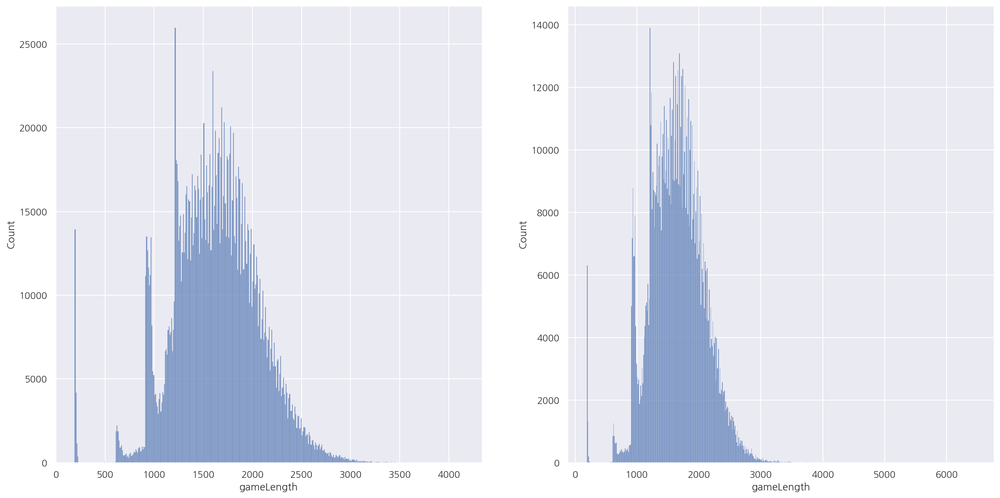

```


    

    


```python
visualization("train", "test", "JCSPM")
```


    
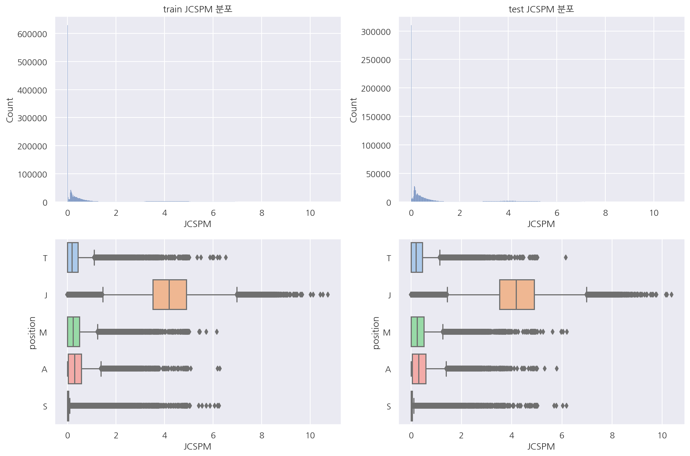
    


```python
temp = train[train["JCSPM"]==0].position.value_counts().reset_index()
temp["rate"] = temp["position"] / temp["position"].sum()

print(temp["position"].sum())
temp
```

    629567
    


<div>
<style scoped>
    .dataframe tbody tr th:only-of-type {
        vertical-align: middle;
    }

    .dataframe tbody tr th {
        vertical-align: top;
    }

    .dataframe thead th {
        text-align: right;
    }
</style>
<table border="1" class="dataframe">
  <thead>
    <tr style="text-align: right;">
      <th></th>
      <th>index</th>
      <th>position</th>
      <th>rate</th>
    </tr>
  </thead>
  <tbody>
    <tr>
      <th>0</th>
      <td>S</td>
      <td>294796</td>
      <td>0.468252</td>
    </tr>
    <tr>
      <th>1</th>
      <td>T</td>
      <td>121825</td>
      <td>0.193506</td>
    </tr>
    <tr>
      <th>2</th>
      <td>M</td>
      <td>111905</td>
      <td>0.177749</td>
    </tr>
    <tr>
      <th>3</th>
      <td>A</td>
      <td>99318</td>
      <td>0.157756</td>
    </tr>
    <tr>
      <th>4</th>
      <td>J</td>
      <td>1723</td>
      <td>0.002737</td>
    </tr>
  </tbody>
</table>
</div>


- 전체 200만 건 중 62만건이 0


```python
temp = test[test["JCSPM"]==0].position.value_counts().reset_index()
temp["rate"] = temp["position"] / temp["position"].sum()

print(temp["position"].sum())
temp
```

    310325
    


<div>
<style scoped>
    .dataframe tbody tr th:only-of-type {
        vertical-align: middle;
    }

    .dataframe tbody tr th {
        vertical-align: top;
    }

    .dataframe thead th {
        text-align: right;
    }
</style>
<table border="1" class="dataframe">
  <thead>
    <tr style="text-align: right;">
      <th></th>
      <th>index</th>
      <th>position</th>
      <th>rate</th>
    </tr>
  </thead>
  <tbody>
    <tr>
      <th>0</th>
      <td>S</td>
      <td>146758</td>
      <td>0.472917</td>
    </tr>
    <tr>
      <th>1</th>
      <td>T</td>
      <td>59082</td>
      <td>0.190387</td>
    </tr>
    <tr>
      <th>2</th>
      <td>M</td>
      <td>54809</td>
      <td>0.176618</td>
    </tr>
    <tr>
      <th>3</th>
      <td>A</td>
      <td>48900</td>
      <td>0.157577</td>
    </tr>
    <tr>
      <th>4</th>
      <td>J</td>
      <td>776</td>
      <td>0.002501</td>
    </tr>
  </tbody>
</table>
</div>


- 전체 100만 건 중 31만건이 0


- train, test 모두 분당 정글 CS가 0인 경우의 비율이 포지션별로 비슷하다.


```python
temp = train[train["JCSPM"]!=0]
temp2 = test[test["JCSPM"]!=0]
visualization("temp", "temp2", "JCSPM")
```


    
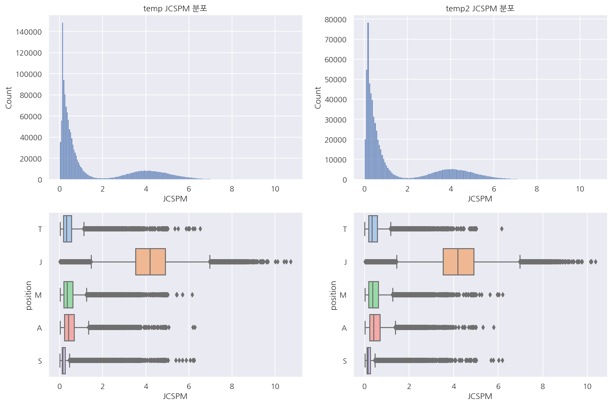
    


#### 1.4.2 와드


```python
visualization("train", "test", "WPPM")
```


    
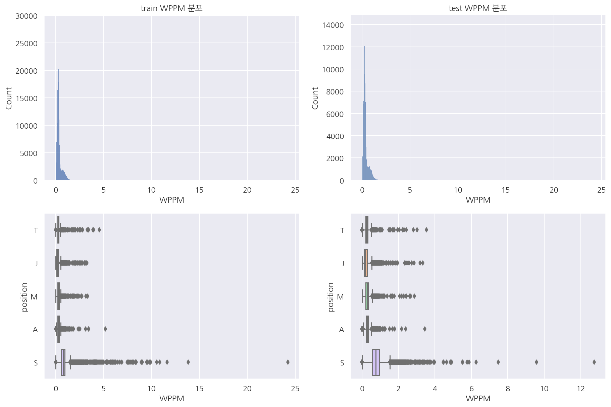
    


- 와드 설치의 경우 서폿이 많은 것이 보인다.


- 시야 아이템이 없다면 제어와드는 최대 2개 소지 가능할텐데 이 때 분당 5개가 넘는다면 좀 이상함(제어:2,기본:2)


- 서폿의 경우 시야 아이템 + 제어와드 + (경계의 와드석) 고려하면 6개는 가능하겠지만 템이 나오는 시간 고려


- 템이 나왔더라도 1분마다 설치 귀환 설치 귀환으로 하지 않는다면 무리가 있어보임


- 기본 와드 쿨타임도 고려하면 분당 3~4개가 일반적으로 많이 설치한 게 아닐까 싶기도..(상황 별로 너무 다름)


```python
temp = train[train["WPPM"] <= 3]
temp2 = test[test["WPPM"] <= 3]
visualization("temp", "temp2", "WPPM")
```


    
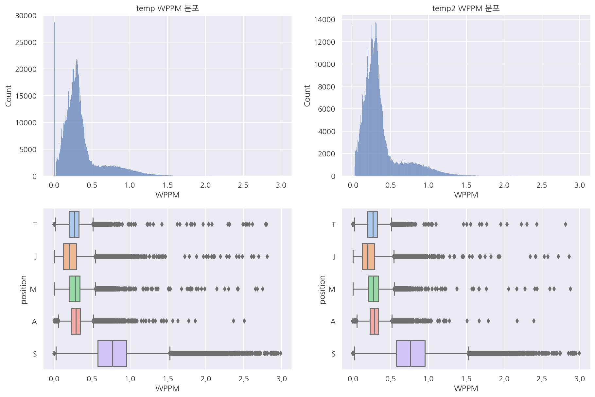
    


- 3개보다 크면 3으로 변환할까?


```python
visualization("train", "test", "WKPM")
```


    
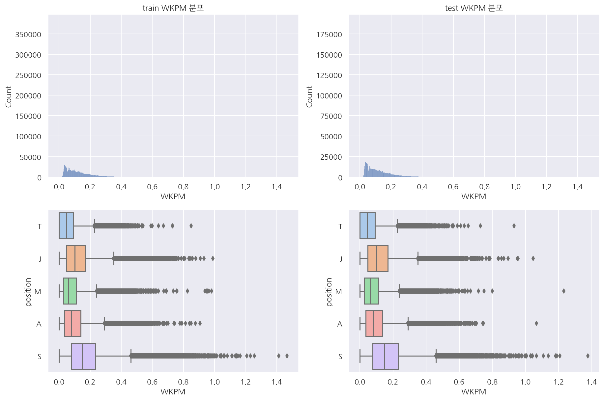
    


- 와드 제거 횟수도 서폿이 많긴 한데 확 구분되는 느낌은 아님


- 렌즈 돌렸을때 제거하는 사람이 누구냐에 따라 이 횟수가 추가 되는 것이 아닐까?


```python
# visualization("train", "test", "visionWardsBoughtInGame")
visualization("train", "test", "WBPM")
```


    
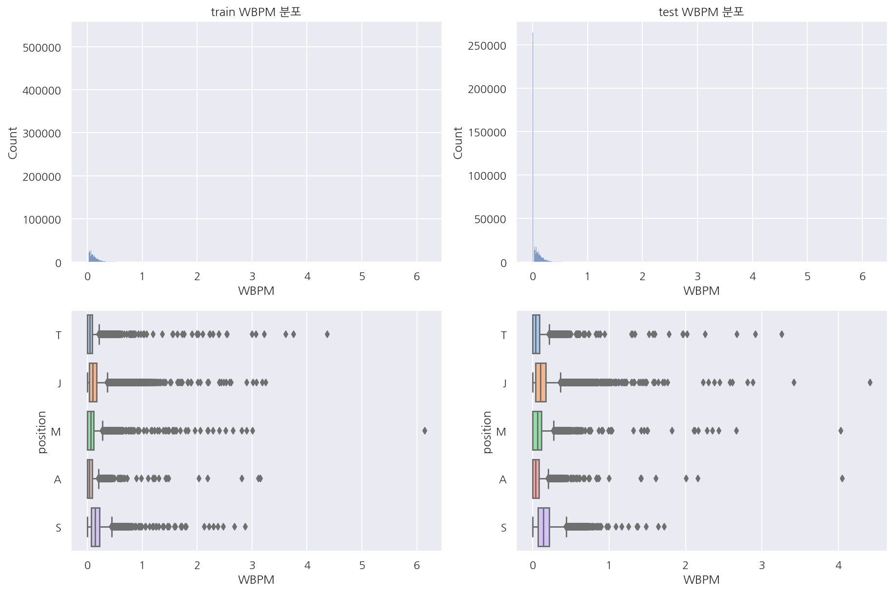
    


- 제어와드 구매 횟수를 분당으로 나타낸 것 흠...


- 이런거 보면 티어별로 구분을 할 필요도 있을 것 같은데..


```python
temp = train[train["WBPM"] <= 1.5]
temp2 = test[test["WBPM"] <= 1.5]
visualization("temp", "temp2", "WBPM")
```


    
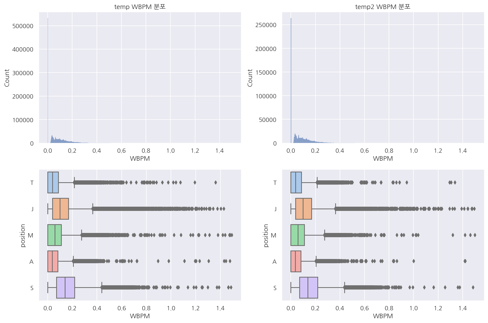
    


```python
visualization("train", "test", "visionScore")
```


    
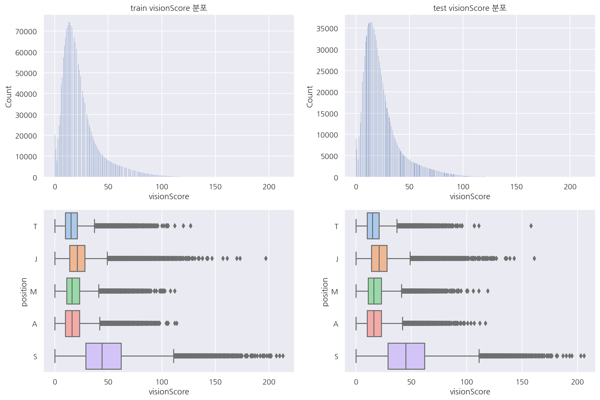
    


- 시야 점수도 분 단위로 보는게 맞을까?


- 분 단위로 안하기엔 게임시간에 영향을 받긴 함 (다만 어처피 위 요소들이랑 비슷하긴 할듯)

#### 1.4.3 KDA


```python
visualization("train", "test", "KDA")
```


    
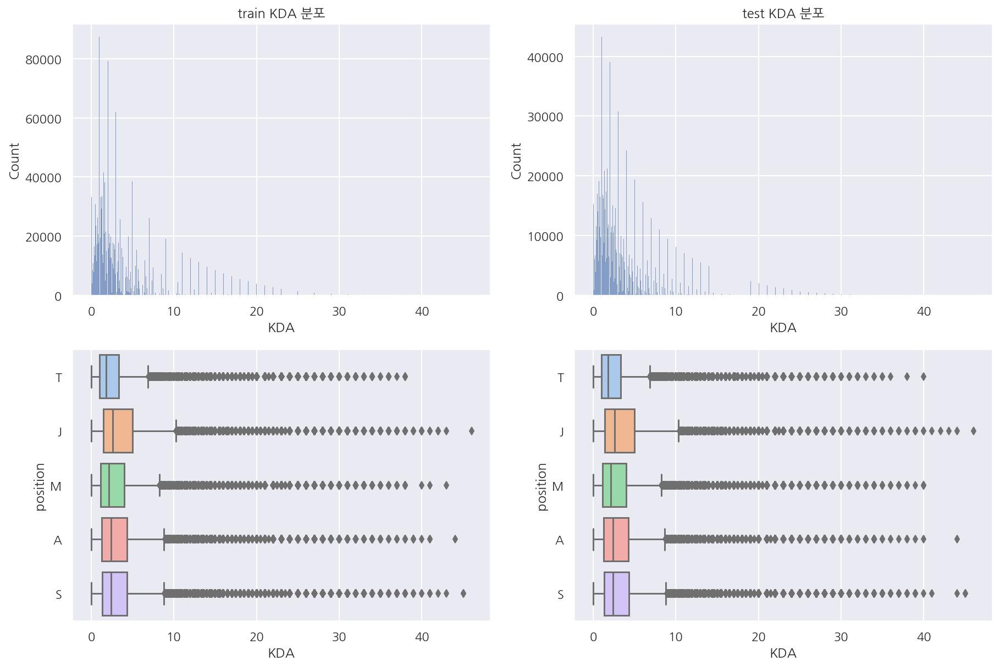
    


- 예상한대로 KDA는 딱히 포지션 구분이 되는 변수는 아닌 듯 하다.

#### 1.4.4 스펠


```python
# train 스펠
temp = train[["position","spell1","spell2"]]
temp = pd.merge(temp, spell_df, left_on="spell1", right_on="key", how="left").drop("key", axis=1)
temp = pd.merge(temp, spell_df, left_on="spell2", right_on="key", how="left").drop("key", axis=1)
temp2 = temp.groupby(["position","name_x"]).size().unstack("name_x")
temp3 = temp.groupby(["position","name_y"]).size().unstack("name_y")
temp4 = temp2 + temp3

fig, axs = plt.subplots(1,1, figsize=(10,10))
sns.heatmap(temp4.T, fmt="d", cmap=sns.color_palette("YlGn", 40),linewidths=0.5, annot=True)
plt.show()
```


    
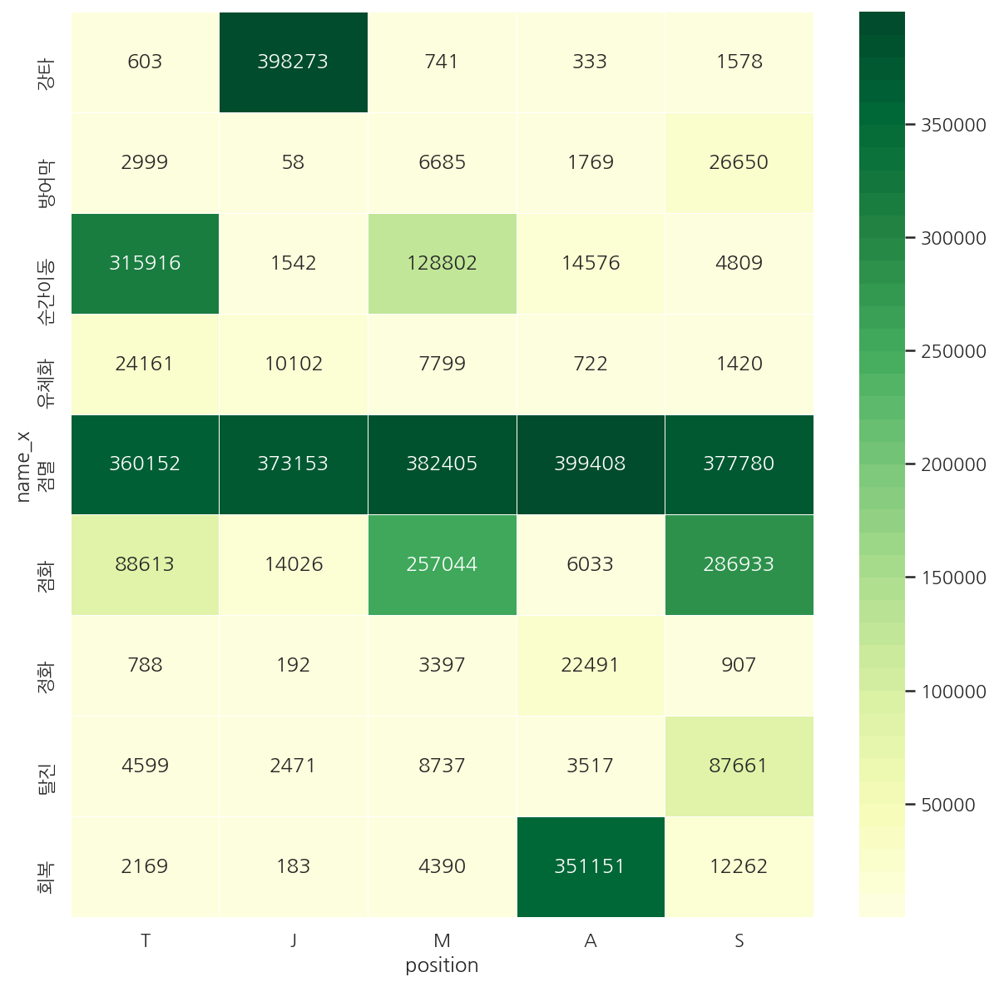
    


```python
# test 스펠
temp = test[["position","spell1","spell2"]]
temp = pd.merge(temp, spell_df, left_on="spell1", right_on="key", how="left").drop("key", axis=1)
temp = pd.merge(temp, spell_df, left_on="spell2", right_on="key", how="left").drop("key", axis=1)
temp2 = temp.groupby(["position","name_x"]).size().unstack("name_x")
temp3 = temp.groupby(["position","name_y"]).size().unstack("name_y")
temp4 = temp2 + temp3

fig, axs = plt.subplots(1,1, figsize=(10,10))
sns.heatmap(temp4.T, fmt="d", cmap=sns.color_palette("YlGn", 40),linewidths=0.5, annot=True)
plt.show()
```


    
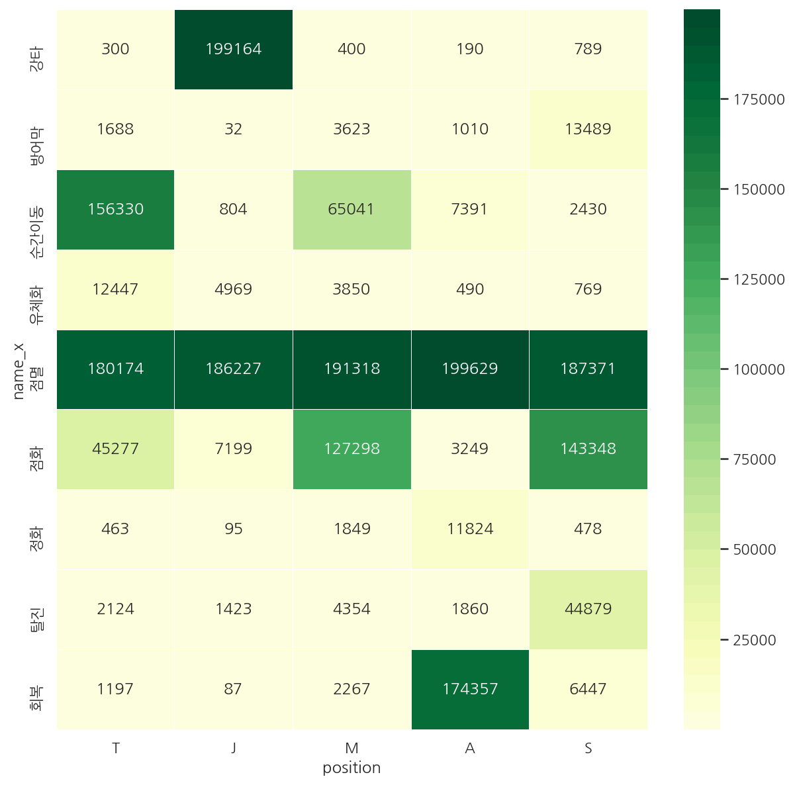
    


```python
# 스펠 순서 함수 (점멸/점화, 점화/점멸 똑같으므로)
def spell_order(x):
    if x["spell1"] < x["spell2"]:
        result = x["name_x"] + "/" + x["name_y"]
    else:
        result = x["name_y"] + "/" + x["name_x"]
    
    return result

def spell_heatmap(df, rate=False):
    # 스펠 조합 만들기 (순서는 key값이 작은게 앞으로)
    temp = df[["position","spell1","spell2"]]
    temp = pd.merge(temp, spell_df, left_on="spell1", right_on="key", how="left").drop("key", axis=1)
    temp = pd.merge(temp, spell_df, left_on="spell2", right_on="key", how="left").drop("key", axis=1)
    temp["comb"] = temp.apply(lambda x: spell_order(x), axis=1)

    # 포지션(row), 스펠 조합(col) 별 카운트 집계
    temp2 = temp.groupby(["position","comb"]).size().unstack("comb").T
           
    # 히트맵 그리기
    fig, axs = plt.subplots(1,1, figsize=(20,20))
    
    # 비율 혹은 카운트로 확인
    if rate == True:
        for col in temp2.columns:
            temp2[col] = np.round(temp2[col] / temp2[col].sum(), 2)
        sns.heatmap(temp2, fmt='.2f', linewidths=0.5, cmap=sns.color_palette("YlGn", 10), annot=True)
    else:
        sns.heatmap(temp2, fmt="d", linewidths=0.5, cmap=sns.color_palette("YlGn", 40), annot=True)
    
    return plt.show()
```


```python
spell_heatmap(train, rate=True)
```


    
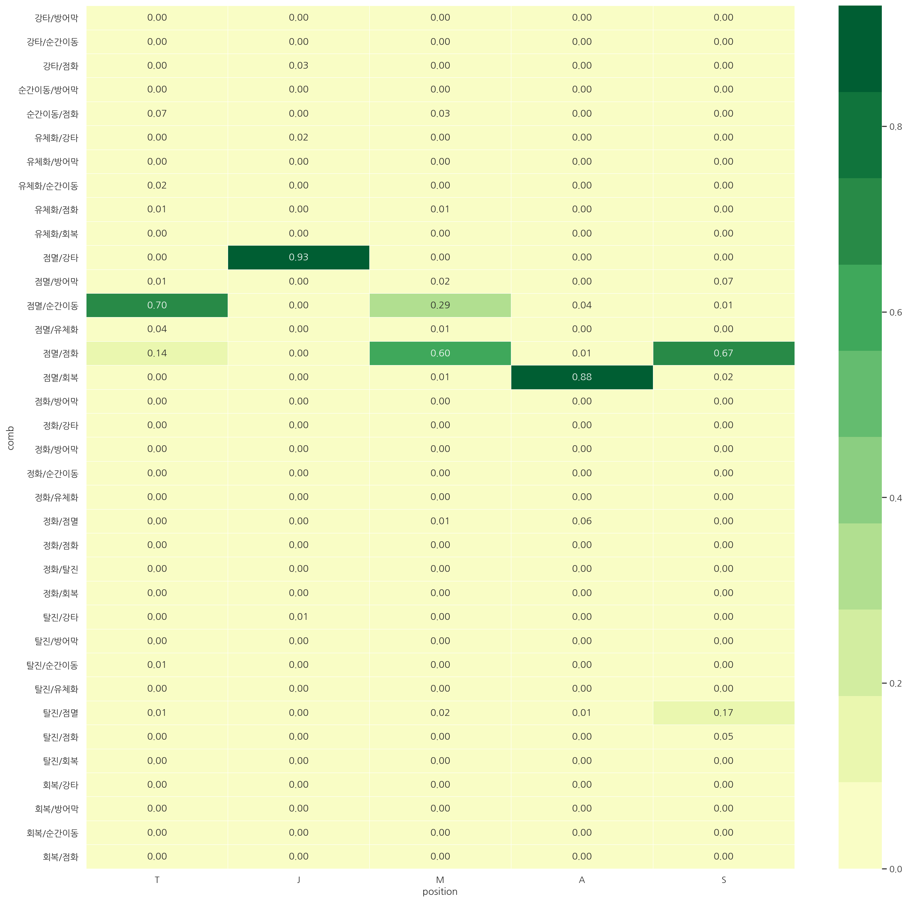
    


```python
spell_heatmap(test, rate=True)
```


    
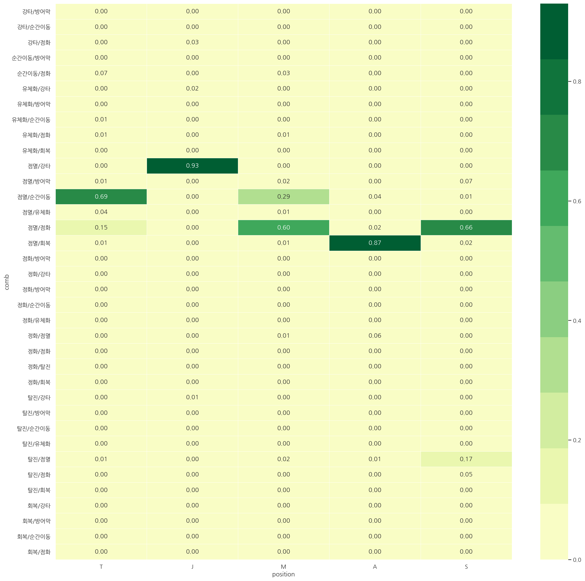
    


- train, test 전반적으로 비율은 비슷하고 원딜은 힐을 많이 드는 것이 보임(정화도)

#### 1.4.5 골드 획득


```python
visualization("train", "test", "GPM")
```


    
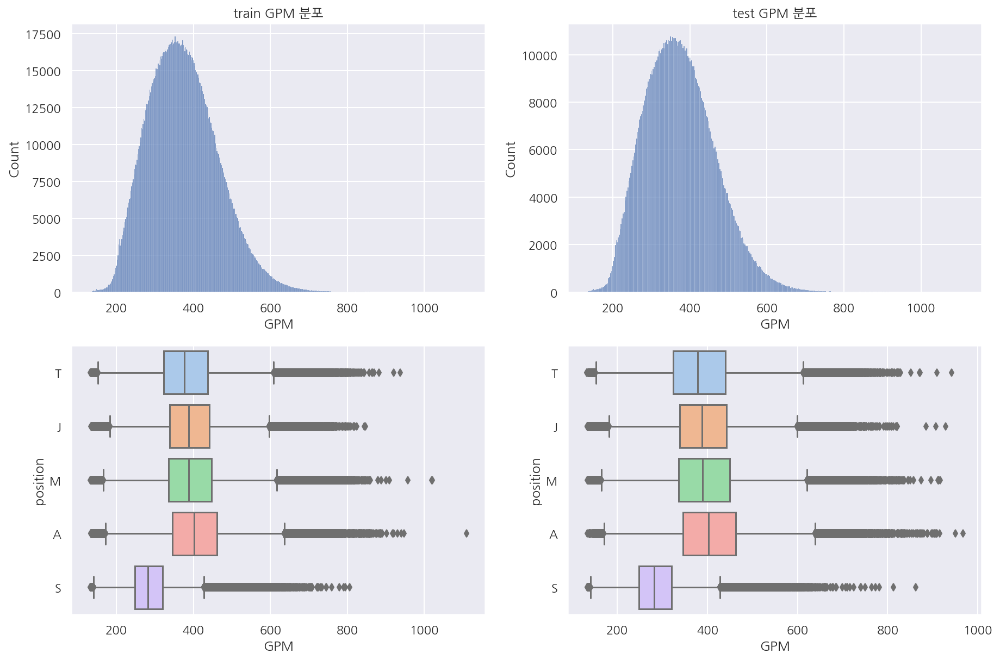
    


#### 1.4.6 데미지


```python
visualization("train", "test", "DPM")
```


    
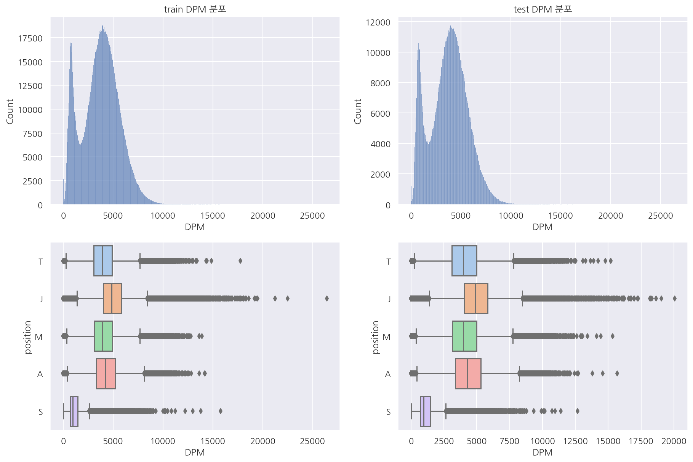
    


```python
visualization("train", "test", "DTPM")
```


    
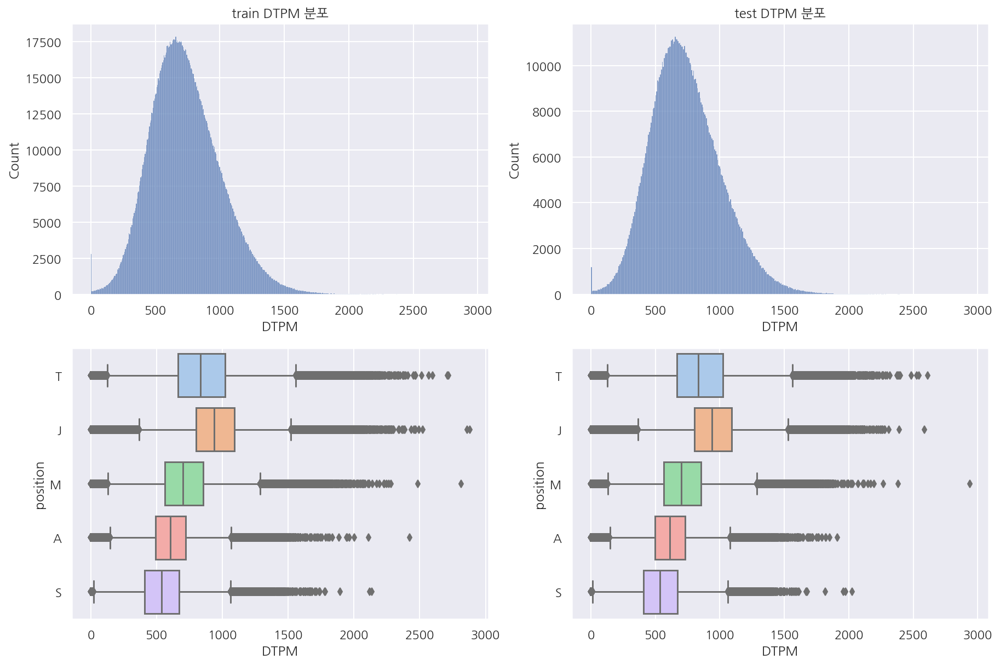
    


```python
visualization("train", "test", "DOPM")
```


    
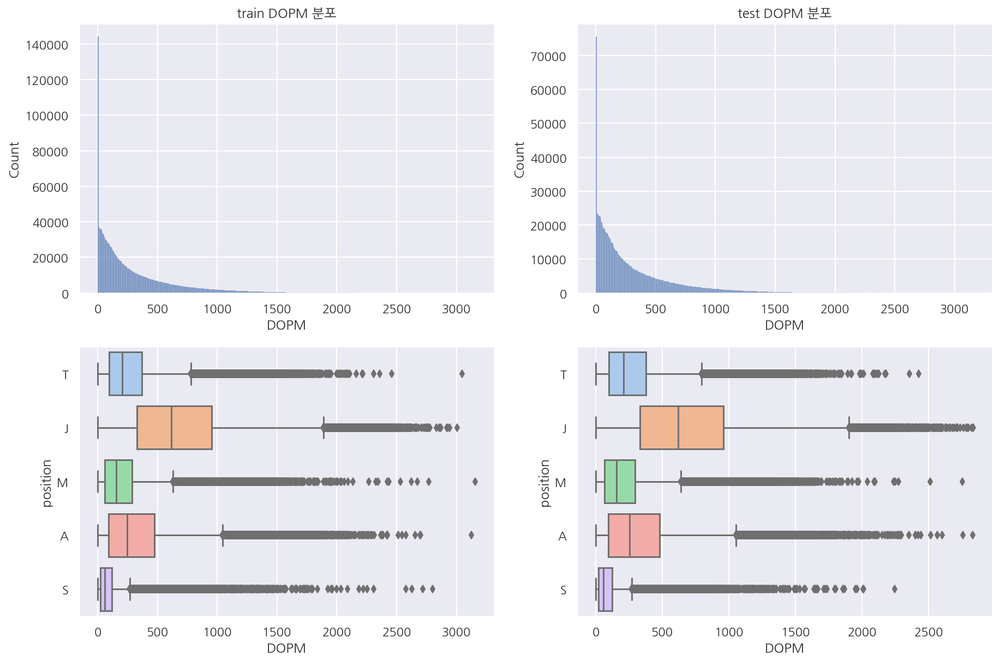
    


#### 1.4.7 아이템


```python
# train, test 데이터 상의 아이템 key 중 item_df에 없는 것들 확인
item_col_lst = ['item0', 'item1', 'item2', 'item3', 'item4', 'item5', 'item6']
item_lst = []

# train item key
for col in item_col_lst:
    for v in train[col].unique():
        item_lst.append(v)

# test item key
for col in item_col_lst:
    for v in test[col].unique():
        item_lst.append(v)
        
item_lst_fin = sorted(list(set(item_lst)))
```


```python
# item_df에는 없고 train, test에는 있는 아이템
item_df_fin = pd.DataFrame(item_lst_fin, columns=["key"])
temp = pd.merge(item_df_fin, item_df, how="left")
temp[temp["name"].isnull()].key.values
```


    array([   0, 7000, 7001, 7002, 7003, 7004, 7005, 7006, 7007, 7008, 7009,
           7010, 7011, 7012, 7013, 7014, 7015, 7016, 7017, 7018, 7019, 7020,
           7021, 7022], dtype=int64)


- 아이템 0은 템칸 비어 있는 것


```python
# train, test 아이템 변환
df_lst = [train, test]
item_col_lst = ['item0', 'item1', 'item2', 'item3', 'item4', 'item5', 'item6']

for df in df_lst:
    for col in item_col_lst:
        # 약간 신비한 신발 => 신발 치환
        df[col][df[col] == 2422] = 1001

        # 초시계 시리즈 => 초시계 치환
        df[col][df[col].isin([2419, 2421, 2423, 2424])] = 2420

        # 무라마나 => 마나무네 치환
        # 대천사의 포옹 => 대천사의 지팡이 치환
        df[col][df[col] == 3042] = 3004
        df[col][df[col] == 3040] = 3003

        # 오른의 걸작 치환
        df[col][df[col] == 7000] = 6693
        df[col][df[col] == 7001] = 6692
        df[col][df[col] == 7002] = 6691
        df[col][df[col] == 7003] = 6664
        df[col][df[col] == 7004] = 3068
        df[col][df[col] == 7005] = 6662
        df[col][df[col] == 7006] = 6671
        df[col][df[col] == 7007] = 6672
        df[col][df[col] == 7008] = 6673
        df[col][df[col] == 7009] = 4633
        df[col][df[col] == 7010] = 4636
        df[col][df[col] == 7011] = 3152
        df[col][df[col] == 7012] = 6653
        df[col][df[col] == 7013] = 6655
        df[col][df[col] == 7014] = 6656
        df[col][df[col] == 7015] = 6630
        df[col][df[col] == 7016] = 6631
        df[col][df[col] == 7017] = 6632
        df[col][df[col] == 7018] = 3078
        df[col][df[col] == 7019] = 3190
        df[col][df[col] == 7020] = 2065
        df[col][df[col] == 7021] = 6617
        df[col][df[col] == 7022] = 4005

        # 서폿 아이템 (초기 아이템으로 변환)
        df[col][df[col].isin([3851, 3853])] = 3850
        df[col][df[col].isin([3855, 3857])] = 3854
        df[col][df[col].isin([3859, 3860])] = 3858
        df[col][df[col].isin([3863, 3864])] = 3862
```

- 동일 계열 아이템 같은템으로 변환


- 와드 쪽에서 피들스틱 허수아비, 전령의 눈은 처리해야할까?

#### 1.4.8 챔피언

요즘은 다양하지만 그래도 포지션 따로 분리해서 시각화

여러 요소가 같이 들어가면 어느 정도 분리 될 것 같은데 탑, 미드가 걱정

#### 1.4.9 게임시간


```python
# 게임 시간 5분 단위로 (ex 15분이상 20분 미만)
length = ((train["gameLength"]/60) //5*5)

# 게임 시간 상한 설정 (60분 넘으면 변경)
length[length > 60] = 60

len1 = (length).astype(int).astype(str).str.zfill(2)
len2 = (length + 5).astype(int).astype(str).str.zfill(2)

train["length_dummy"] = len1 + "_" + len2 + "min"

# test 동일 과정
length = ((test["gameLength"]/60) //5*5)

length[length > 60] = 60

len1 = (length).astype(int).astype(str).str.zfill(2)
len2 = (length + 5).astype(int).astype(str).str.zfill(2)

test["length_dummy"] = len1 + "_" + len2 + "min"
```


```python
train["length_dummy"].unique()
```


    array(['25_30min', '20_25min', '30_35min', '15_20min', '35_40min',
           '10_15min', '40_45min', '00_05min', '45_50min', '50_55min',
           '05_10min', '55_60min', '60_65min'], dtype=object)


```python
test["length_dummy"].unique()
```


    array(['25_30min', '10_15min', '15_20min', '30_35min', '40_45min',
           '35_40min', '20_25min', '00_05min', '45_50min', '50_55min',
           '05_10min', '60_65min', '55_60min'], dtype=object)


```python
train["length_dummy"].value_counts().sort_index()
```


    00_05min     19630
    05_10min       110
    10_15min     25390
    15_20min    223320
    20_25min    497650
    25_30min    547310
    30_35min    420430
    35_40min    189320
    40_45min     59810
    45_50min     14090
    50_55min      2500
    55_60min       380
    60_65min        60
    Name: length_dummy, dtype: int64


```python
test["length_dummy"].value_counts().sort_index()
```


    00_05min      7880
    05_10min        70
    10_15min     12390
    15_20min    110990
    20_25min    246880
    25_30min    270900
    30_35min    210610
    35_40min     99080
    40_45min     32230
    45_50min      7320
    50_55min      1310
    55_60min       230
    60_65min       110
    Name: length_dummy, dtype: int64


```python
# 게임 시간 구간별 지표
fig = plt.figure(figsize = (20,5))

p1 = sns.barplot(data = train,
                 x = "length_dummy", y = "CSPM",
                 order = np.sort(train["length_dummy"].unique()),
                 ci = None)

p1.set_xticklabels(labels = p1.get_xticklabels(), 
                   rotation = 0)

plt.show()
```


    
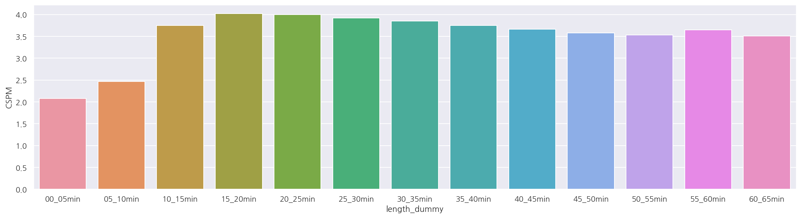
    


- 0_5분, 5_10분은 CSPM이 상대적으로 낮게 나타남 다만 빈도 자체가 많지는 않음


```python
# 게임 시간 구간별 지표
fig = plt.figure(figsize = (20,5))

p1 = sns.barplot(data = test,
                 x = "length_dummy", y = "CSPM",
                 order = np.sort(train["length_dummy"].unique()),
                 ci = None)

p1.set_xticklabels(labels = p1.get_xticklabels(), 
                   rotation = 0)

plt.show()
```


    
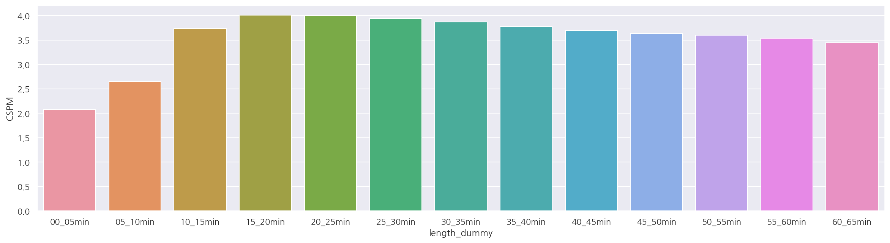
    


- test도 비슷 우선은 그냥 분 단위 지표들 사용해볼까?


- 0인 지표들은 어떻게 할까?


- 챔피언, 스펠이 가장 구분 좋아보이긴함

### 1.5 전처리


```python
# 영어로 불러오기
champion_df, spell_df, item_df = load_riot_info(lan="en_US")
```


```python
# 챔피언, 스펠, 아이템 이름 붙이기
train = merge_name(train)
test = merge_name(test)
```


```python
# item 결측값 0으로 대체 (원-핫 인코딩 후 0 컬럼 삭제)
item_col = ['item00', 'item01', 'item02', 'item03', 'item04', 'item05', 'item06']

for col in item_col:
    train[col].fillna(0, inplace = True)
    test[col].fillna(0, inplace = True)
```

#### 1.5.1 원핫 인코딩


```python
# 티어
tier_oh_train = pd.get_dummies(train["tier"])
tier_oh_test = pd.get_dummies(test["tier"])
```


```python
# 챔피언
champ_oh_train = pd.get_dummies(train["champion"])
champ_oh_test = pd.get_dummies(test["champion"])
```


```python
# 스펠
spell_oh_train = pd.get_dummies(train["spell01"]) + pd.get_dummies(train["spell02"])
spell_oh_test = pd.get_dummies(test["spell01"]) + pd.get_dummies(test["spell02"])
```

- 티어, 챔피언, 스펠 등 현재 train, test 모두 동일 범주이므로 같은 기준 일치된다.


- 스펠은 데이터가 작다면 위와 같은 방식은 좋지 않다.


```python
# 아이템
item_col = ['item00', 'item01', 'item02', 'item03', 'item04', 'item05', 'item06']
temp = pd.concat([train[col] for col in item_col], axis=0)

temp2 = pd.get_dummies(temp)

# 기존 데이터 행수 
interval = int(temp2.shape[0] / len(item_col))

item_oh_train = temp2.iloc[0:interval,:]

for i in range(0, temp2.shape[0], interval):
    if i != 0:
        item_oh_train = item_oh_train + temp2.iloc[i:i + interval,:]
```


```python
# 아이템
item_col = ['item00', 'item01', 'item02', 'item03', 'item04', 'item05', 'item06']
temp = pd.concat([test[col] for col in item_col], axis=0)

temp2 = pd.get_dummies(temp)

# 기존 데이터 행수 
interval = int(temp2.shape[0] / len(item_col))

item_oh_test = temp2.iloc[0:interval,:]

for i in range(0, temp2.shape[0], interval):
    if i != 0:
        item_oh_test = item_oh_test + temp2.iloc[i:i + interval,:]
```


```python
# train, test 컬럼 동일
set(item_oh_train.columns) == set(item_oh_test.columns)
```


    True


- 아이템을 안산 경우의 컬럼 어떻게 할까?


- 제거하는게 나을 것 같음


```python
# 0 컬럼(비어있는 아이템 칸) 제거
item_oh_train.drop(columns=0, axis=1, inplace=True)
item_oh_test.drop(columns=0, axis=1, inplace=True)
```


```python
# 결측값 0으로 대체 / 중복값 1로 수정(루비수정 6개 -> 그냥 루비수정 1)
item_oh_train_fin = item_oh_train / item_oh_train
item_oh_train_fin.fillna(0, inplace=True)

item_oh_test_fin = item_oh_test / item_oh_test
item_oh_test_fin.fillna(0, inplace=True)
```


```python
# 원핫 인코딩 결과 합치기
oh_train = pd.concat([tier_oh_train, champ_oh_train ,spell_oh_train, item_oh_train_fin], axis=1)
oh_test = pd.concat([tier_oh_test, champ_oh_test ,spell_oh_test, item_oh_test_fin], axis=1)
```

#### 1.5.2 임시 최종 데이터


```python
temp1 = train[['DPM', 'CSPM', 'WPPM', 'JCSPM']]
temp2 = test[['DPM', 'CSPM', 'WPPM', 'JCSPM']]

train_fin = pd.concat([temp1, oh_train], axis=1)
test_fin = pd.concat([temp2, oh_test], axis=1)
```


```python
# 레이블 인코딩
encoder = LabelEncoder()
encoder.fit(train["position"])
Y_train = encoder.transform(train["position"])
Y_test = encoder.transform(test["position"])

Y_train
```


    array([4, 1, 3, ..., 4, 1, 0])


```python
# tensorflow의 원-핫 인코딩
Y_encoded = tf.keras.utils.to_categorical(Y_train)
Y_encoded[:5,:]
```


    array([[0., 0., 0., 0., 1.],
           [0., 1., 0., 0., 0.],
           [0., 0., 0., 1., 0.],
           [1., 0., 0., 0., 0.],
           [0., 0., 1., 0., 0.]], dtype=float32)


```python
X_train = train_fin.values.astype(float)
```


```python
X_test = test_fin.values.astype(float)
Y_test = tf.keras.utils.to_categorical(Y_test)
```

### 1.6 모델 실행


```python
# 모델 설정
model = Sequential()
model.add(Dense(10, input_dim=356, activation="relu"))
model.add(Dense(5, activation="softmax"))

# 모델 컴파일
model.compile(loss="categorical_crossentropy", 
              optimizer="adam", 
              metrics=["accuracy"])

# 모델 실행
model.fit(X_train, Y_encoded, epochs=50, batch_size=10000)

# 결과 출력
print("-"*100)
print(f"Accuracy: {model.evaluate(X_test, Y_test, verbose=0)[1]: .4f}")
```

    Train on 2000000 samples
    Epoch 1/50
    2000000/2000000 [==============================] - 7s 3us/sample - loss: 23.0242 - accuracy: 0.4280
    Epoch 2/50
    2000000/2000000 [==============================] - 5s 2us/sample - loss: 0.8927 - accuracy: 0.7309
    Epoch 3/50
    2000000/2000000 [==============================] - 5s 3us/sample - loss: 0.7374 - accuracy: 0.7870
    Epoch 4/50
    2000000/2000000 [==============================] - 5s 2us/sample - loss: 0.6453 - accuracy: 0.8334
    Epoch 5/50
    2000000/2000000 [==============================] - 5s 2us/sample - loss: 0.5863 - accuracy: 0.8627
    Epoch 6/50
    2000000/2000000 [==============================] - 5s 2us/sample - loss: 0.5410 - accuracy: 0.8820
    Epoch 7/50
    2000000/2000000 [==============================] - 4s 2us/sample - loss: 0.5029 - accuracy: 0.8933
    Epoch 8/50
    2000000/2000000 [==============================] - 4s 2us/sample - loss: 0.4685 - accuracy: 0.8998
    Epoch 9/50
    2000000/2000000 [==============================] - 5s 2us/sample - loss: 0.4367 - accuracy: 0.9037
    Epoch 10/50
    2000000/2000000 [==============================] - 5s 2us/sample - loss: 0.4074 - accuracy: 0.9061
    Epoch 11/50
    2000000/2000000 [==============================] - 4s 2us/sample - loss: 0.3812 - accuracy: 0.9077
    Epoch 12/50
    2000000/2000000 [==============================] - 4s 2us/sample - loss: 0.3585 - accuracy: 0.9091
    Epoch 13/50
    2000000/2000000 [==============================] - 4s 2us/sample - loss: 0.3389 - accuracy: 0.9107
    Epoch 14/50
    2000000/2000000 [==============================] - 5s 2us/sample - loss: 0.3224 - accuracy: 0.9120
    Epoch 15/50
    2000000/2000000 [==============================] - 4s 2us/sample - loss: 0.3091 - accuracy: 0.9133
    Epoch 16/50
    2000000/2000000 [==============================] - 4s 2us/sample - loss: 0.2983 - accuracy: 0.9144
    Epoch 17/50
    2000000/2000000 [==============================] - 5s 2us/sample - loss: 0.2882 - accuracy: 0.9161
    Epoch 18/50
    2000000/2000000 [==============================] - 4s 2us/sample - loss: 0.2808 - accuracy: 0.9171
    Epoch 19/50
    2000000/2000000 [==============================] - 5s 2us/sample - loss: 0.2739 - accuracy: 0.91850s - loss: 0.2738 - accuracy: 0.91
    Epoch 20/50
    2000000/2000000 [==============================] - 5s 2us/sample - loss: 0.2685 - accuracy: 0.9194
    Epoch 21/50
    2000000/2000000 [==============================] - 5s 2us/sample - loss: 0.2628 - accuracy: 0.9207
    Epoch 22/50
    2000000/2000000 [==============================] - 5s 2us/sample - loss: 0.2598 - accuracy: 0.9211
    Epoch 23/50
    2000000/2000000 [==============================] - 5s 2us/sample - loss: 0.2541 - accuracy: 0.9226
    Epoch 24/50
    2000000/2000000 [==============================] - 5s 2us/sample - loss: 0.2516 - accuracy: 0.9232
    Epoch 25/50
    2000000/2000000 [==============================] - 5s 2us/sample - loss: 0.2480 - accuracy: 0.9241
    Epoch 26/50
    2000000/2000000 [==============================] - 5s 2us/sample - loss: 0.2449 - accuracy: 0.9250
    Epoch 27/50
    2000000/2000000 [==============================] - 5s 2us/sample - loss: 0.2427 - accuracy: 0.9255
    Epoch 28/50
    2000000/2000000 [==============================] - 5s 2us/sample - loss: 0.2400 - accuracy: 0.9263
    Epoch 29/50
    2000000/2000000 [==============================] - 5s 2us/sample - loss: 0.2380 - accuracy: 0.9268
    Epoch 30/50
    2000000/2000000 [==============================] - 5s 2us/sample - loss: 0.2352 - accuracy: 0.9275
    Epoch 31/50
    2000000/2000000 [==============================] - 5s 2us/sample - loss: 0.2348 - accuracy: 0.9275
    Epoch 32/50
    2000000/2000000 [==============================] - 5s 2us/sample - loss: 0.2333 - accuracy: 0.9280
    Epoch 33/50
    2000000/2000000 [==============================] - 5s 2us/sample - loss: 0.2308 - accuracy: 0.9287
    Epoch 34/50
    2000000/2000000 [==============================] - 5s 2us/sample - loss: 0.2297 - accuracy: 0.9290
    Epoch 35/50
    2000000/2000000 [==============================] - 5s 2us/sample - loss: 0.2282 - accuracy: 0.9294
    Epoch 36/50
    2000000/2000000 [==============================] - 5s 2us/sample - loss: 0.2278 - accuracy: 0.9294
    Epoch 37/50
    2000000/2000000 [==============================] - 5s 3us/sample - loss: 0.2263 - accuracy: 0.9298
    Epoch 38/50
    2000000/2000000 [==============================] - 5s 2us/sample - loss: 0.2261 - accuracy: 0.9297
    Epoch 39/50
    2000000/2000000 [==============================] - 5s 2us/sample - loss: 0.2249 - accuracy: 0.9301
    Epoch 40/50
    2000000/2000000 [==============================] - 5s 2us/sample - loss: 0.2260 - accuracy: 0.9295
    Epoch 41/50
    2000000/2000000 [==============================] - 5s 2us/sample - loss: 0.2220 - accuracy: 0.9311
    Epoch 42/50
    2000000/2000000 [==============================] - 5s 2us/sample - loss: 0.2221 - accuracy: 0.9308
    Epoch 43/50
    2000000/2000000 [==============================] - 5s 2us/sample - loss: 0.2219 - accuracy: 0.9308
    Epoch 44/50
    2000000/2000000 [==============================] - 5s 2us/sample - loss: 0.2207 - accuracy: 0.9312
    Epoch 45/50
    2000000/2000000 [==============================] - 5s 2us/sample - loss: 0.2223 - accuracy: 0.9305
    Epoch 46/50
    2000000/2000000 [==============================] - 4s 2us/sample - loss: 0.2216 - accuracy: 0.9305
    Epoch 47/50
    2000000/2000000 [==============================] - 5s 3us/sample - loss: 0.2193 - accuracy: 0.9314
    Epoch 48/50
    2000000/2000000 [==============================] - 5s 3us/sample - loss: 0.2192 - accuracy: 0.9314
    Epoch 49/50
    2000000/2000000 [==============================] - 5s 2us/sample - loss: 0.2191 - accuracy: 0.9314
    Epoch 50/50
    2000000/2000000 [==============================] - 5s 2us/sample - loss: 0.2177 - accuracy: 0.9319
    ----------------------------------------------------------------------------------------------------
    Accuracy:  0.9296
    
