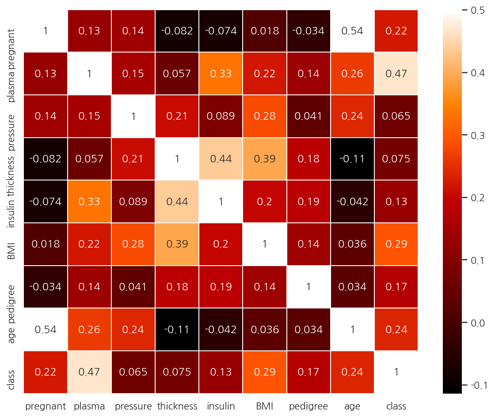
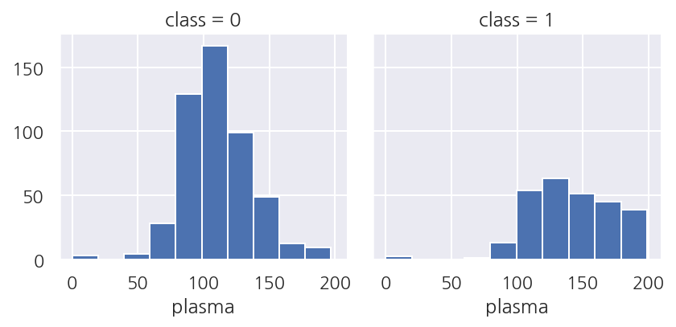

**모두의 딥러닝** 교재를 토대로 공부한 내용입니다.

실습과정에서 필요에 따라 코드나 이론에 대한 추가, 수정사항이 있습니다.

---

**기본 세팅**


```python
import numpy as np
import pandas as pd

import matplotlib as mpl
import matplotlib.pyplot as plt
import seaborn as sns

import warnings
```


```python
%matplotlib inline
%config InlineBackend.figure_format = 'retina'

mpl.rc('font', family='NanumGothic') # 폰트 설정
mpl.rc('axes', unicode_minus=False) # 유니코드에서 음수 부호 설정

# 차트 스타일 설정
sns.set(font="NanumGothic", rc={"axes.unicode_minus":False}, style='darkgrid')
plt.rc("figure", figsize=(10,8))

warnings.filterwarnings("ignore")
```

---

# 11. 데이터 다루기

이번 챕터에서는 피마 인디언 데이터를 이용해서 딥러닝 모델을 실행해볼 것이다.

참고로 [머신러닝 완벽가이드](https://romg2.github.io/mlguide/02_%EB%A8%B8%EC%8B%A0%EB%9F%AC%EB%8B%9D-%EC%99%84%EB%B2%BD%EA%B0%80%EC%9D%B4%EB%93%9C-03.-%ED%8F%89%EA%B0%80/)에서 피마 인디언 데이터로 로지스틱 회귀 성능 평가를 했었다.

## 11.1 데이터 조사

먼저 사용할 데이터의 구조는 다음과 같다.

- pregnant: 과거 임신 횟수


- plasma: 포도당 부하 검사 2시간 후 공복 혈당 농도


- pressure: 확장기 혈압


- thickness: 삼두근 피부 주름 두께


- insulin: 혈청 인슐린


- BMI: 체질량 지수


- pedigree: 당뇨병 가족력


- age: 나이


- class: 당뇨 여부 (타겟)


```python
# 데이터 불러오기
df = pd.read_csv("deeplearning/dataset/pima-indians-diabetes.csv",
                names = ["pregnant", "plasma", "pressure", "thickness", 
                         "insulin", "BMI", "pedigree", "age", "class"])
df.head()
```


<div>
<style scoped>
    .dataframe tbody tr th:only-of-type {
        vertical-align: middle;
    }

    .dataframe tbody tr th {
        vertical-align: top;
    }

    .dataframe thead th {
        text-align: right;
    }
</style>
<table border="1" class="dataframe">
  <thead>
    <tr style="text-align: right;">
      <th></th>
      <th>pregnant</th>
      <th>plasma</th>
      <th>pressure</th>
      <th>thickness</th>
      <th>insulin</th>
      <th>BMI</th>
      <th>pedigree</th>
      <th>age</th>
      <th>class</th>
    </tr>
  </thead>
  <tbody>
    <tr>
      <th>0</th>
      <td>6</td>
      <td>148</td>
      <td>72</td>
      <td>35</td>
      <td>0</td>
      <td>33.6</td>
      <td>0.627</td>
      <td>50</td>
      <td>1</td>
    </tr>
    <tr>
      <th>1</th>
      <td>1</td>
      <td>85</td>
      <td>66</td>
      <td>29</td>
      <td>0</td>
      <td>26.6</td>
      <td>0.351</td>
      <td>31</td>
      <td>0</td>
    </tr>
    <tr>
      <th>2</th>
      <td>8</td>
      <td>183</td>
      <td>64</td>
      <td>0</td>
      <td>0</td>
      <td>23.3</td>
      <td>0.672</td>
      <td>32</td>
      <td>1</td>
    </tr>
    <tr>
      <th>3</th>
      <td>1</td>
      <td>89</td>
      <td>66</td>
      <td>23</td>
      <td>94</td>
      <td>28.1</td>
      <td>0.167</td>
      <td>21</td>
      <td>0</td>
    </tr>
    <tr>
      <th>4</th>
      <td>0</td>
      <td>137</td>
      <td>40</td>
      <td>35</td>
      <td>168</td>
      <td>43.1</td>
      <td>2.288</td>
      <td>33</td>
      <td>1</td>
    </tr>
  </tbody>
</table>
</div>


- 데이터를 불러왔으며 csv 파일에 헤더 정보가 없어 `names`로 직접 지정하였다.


```python
df.shape
```


    (768, 9)


- 총 768개의 샘플로 8개의 피처, 타겟으로 구성되어 있다.


```python
df.info()
```

    <class 'pandas.core.frame.DataFrame'>
    RangeIndex: 768 entries, 0 to 767
    Data columns (total 9 columns):
     #   Column     Non-Null Count  Dtype  
    ---  ------     --------------  -----  
     0   pregnant   768 non-null    int64  
     1   plasma     768 non-null    int64  
     2   pressure   768 non-null    int64  
     3   thickness  768 non-null    int64  
     4   insulin    768 non-null    int64  
     5   BMI        768 non-null    float64
     6   pedigree   768 non-null    float64
     7   age        768 non-null    int64  
     8   class      768 non-null    int64  
    dtypes: float64(2), int64(7)
    memory usage: 54.1 KB
    

- 결측값은 없다.


```python
df[["pregnant", "class"]].groupby(["pregnant"], as_index=False).mean().sort_values(by="pregnant", ascending=True)
```


<div>
<style scoped>
    .dataframe tbody tr th:only-of-type {
        vertical-align: middle;
    }

    .dataframe tbody tr th {
        vertical-align: top;
    }

    .dataframe thead th {
        text-align: right;
    }
</style>
<table border="1" class="dataframe">
  <thead>
    <tr style="text-align: right;">
      <th></th>
      <th>pregnant</th>
      <th>class</th>
    </tr>
  </thead>
  <tbody>
    <tr>
      <th>0</th>
      <td>0</td>
      <td>0.342342</td>
    </tr>
    <tr>
      <th>1</th>
      <td>1</td>
      <td>0.214815</td>
    </tr>
    <tr>
      <th>2</th>
      <td>2</td>
      <td>0.184466</td>
    </tr>
    <tr>
      <th>3</th>
      <td>3</td>
      <td>0.360000</td>
    </tr>
    <tr>
      <th>4</th>
      <td>4</td>
      <td>0.338235</td>
    </tr>
    <tr>
      <th>5</th>
      <td>5</td>
      <td>0.368421</td>
    </tr>
    <tr>
      <th>6</th>
      <td>6</td>
      <td>0.320000</td>
    </tr>
    <tr>
      <th>7</th>
      <td>7</td>
      <td>0.555556</td>
    </tr>
    <tr>
      <th>8</th>
      <td>8</td>
      <td>0.578947</td>
    </tr>
    <tr>
      <th>9</th>
      <td>9</td>
      <td>0.642857</td>
    </tr>
    <tr>
      <th>10</th>
      <td>10</td>
      <td>0.416667</td>
    </tr>
    <tr>
      <th>11</th>
      <td>11</td>
      <td>0.636364</td>
    </tr>
    <tr>
      <th>12</th>
      <td>12</td>
      <td>0.444444</td>
    </tr>
    <tr>
      <th>13</th>
      <td>13</td>
      <td>0.500000</td>
    </tr>
    <tr>
      <th>14</th>
      <td>14</td>
      <td>1.000000</td>
    </tr>
    <tr>
      <th>15</th>
      <td>15</td>
      <td>1.000000</td>
    </tr>
    <tr>
      <th>16</th>
      <td>17</td>
      <td>1.000000</td>
    </tr>
  </tbody>
</table>
</div>


- 간단하게 임신 횟수와 당뇨병 발병 확률에 대해 살펴봤다.


- `groupby()`에 `as_index`를 False로 설정하여서 바로 컬럼으로 사용 가능하다.

## 11.2 데이터 시각화


```python
corr_M = df.corr()

#
sns.heatmap(corr_M,
            linewidths=0.1, 
            vmax = 0.5, # 색상의 밝기 조절
            cmap = plt.cm.gist_heat, 
            annot=True)

plt.show()
```


    



- class와 가장 높은 상관관계를 가지는 피처는 plasma로 나타난다.


- 두 관계를 좀 더 자세히 살펴보자.


```python
grid = sns.FacetGrid(df, col="class")
grid.map(plt.hist, "plasma", bins=10)

plt.show()
```


    

    


- class가 1인 경우는 plasma가 높은 값이 많았으며 특히 150인 이상인 경우가 많다.


- plasma가 class를 구분하는데 중요한 피처임을 알 수 있다.


- 참고로 머신러닝의 경우는 중요한 피처를 뽑는 과정도 데이터 전처리 과정에 포함하는 반면,


- 딥러닝은 중요한 피처를 내부적으로 뽑아주므로 이 과정이 필요 없다고 한다.


- 머신러닝에서도 feature_importance를 사용한 경험이 있는데 좀 더 딥러닝을 봐야 차이를 알 것 같다.

## 11.3 예측


```python
import tensorflow as tf

# 시드 설정
np.random.seed(3)
tf.random.set_seed(3)

# 데이터 불러오기
dataset = np.loadtxt("deeplearning/dataset/pima-indians-diabetes.csv", delimiter = ",")
X = dataset[:,:8]
Y = dataset[:,8]
```

- 사실 시드 설정은 모델 실행이랑 같은 셀에 넣어두어야 하는데 따로 보려고 분리해두었다.


```python
from tensorflow.keras.models import Sequential
from tensorflow.keras.layers import Dense

# 모델 설정
model = Sequential()
model.add(Dense(12, input_dim=8, activation="relu"))
model.add(Dense(8, activation="relu"))
model.add(Dense(1, activation="sigmoid"))
```

- 모델은 입력층에 모든 피처를 사용하며 2개의 은닉층을 거쳐 1개의 값을 출력하게 설정하였다.


```python
# 모델 컴파일
model.compile(loss="binary_crossentropy",
              optimizer="adam", 
              metrics=["accuracy"])
```

- 오차 함수는 이진 분류 문제이므로 binary_crossentropy를 사용하였다.


- 최적화 함수로는 adam을 사용하며 평가 지표는 accuracy를 사용한다.


```python
# 모델 실행
model.fit(X, Y, epochs=10, batch_size=768)

# 결과 출력
print(f"Accuracy: {model.evaluate(X,Y, verbose=0)[1]: .4f}")
```

- 모델을 실행하고 평가한다.


- `evaluate()`는 loss와 metrics 2개의 값을 가지고 있다.


- 왜인지는 모르겠지만 `evaluate()`에서 `verbose`를 설정하지 않으면 등호가 엄청나게 출력된다.


- 개인 설정 문제인 듯 하다.


```python
import tensorflow as tf
from tensorflow.keras.models import Sequential
from tensorflow.keras.layers import Dense

# 시드 설정
np.random.seed(3)
tf.random.set_seed(3)

# 데이터 불러오기
dataset = np.loadtxt("deeplearning/dataset/pima-indians-diabetes.csv", delimiter = ",")
X = dataset[:,:8]
Y = dataset[:,8]

# 모델 설정
model = Sequential()
model.add(Dense(12, input_dim=8, activation="relu"))
model.add(Dense(8, activation="relu"))
model.add(Dense(1, activation="sigmoid"))

# 모델 컴파일
model.compile(loss="binary_crossentropy",
              optimizer="adam", 
              metrics=["accuracy"])

# 모델 실행
model.fit(X, Y, epochs=200, batch_size=10)

# 결과 출력
print("-"*100)
print(f"Accuracy: {model.evaluate(X,Y, verbose=0)[1]: .4f}")
```

    Train on 768 samples
    Epoch 1/200
    768/768 [==============================] - 1s 880us/sample - loss: 11.4155 - accuracy: 0.6198
    Epoch 2/200
    768/768 [==============================] - 0s 141us/sample - loss: 6.4242 - accuracy: 0.6159
    Epoch 3/200
    768/768 [==============================] - 0s 123us/sample - loss: 3.6949 - accuracy: 0.5221
    Epoch 4/200
    768/768 [==============================] - 0s 134us/sample - loss: 2.2150 - accuracy: 0.5169
    Epoch 5/200
    768/768 [==============================] - 0s 144us/sample - loss: 1.3725 - accuracy: 0.5182
    Epoch 6/200
    768/768 [==============================] - 0s 224us/sample - loss: 0.9083 - accuracy: 0.5586
    Epoch 7/200
    768/768 [==============================] - 0s 160us/sample - loss: 0.7783 - accuracy: 0.5547
    Epoch 8/200
    768/768 [==============================] - 0s 153us/sample - loss: 0.7476 - accuracy: 0.6172 - loss: 0.7556 - accuracy: 0.61
    Epoch 9/200
    768/768 [==============================] - 0s 260us/sample - loss: 0.7330 - accuracy: 0.6615
    Epoch 10/200
    768/768 [==============================] - 0s 243us/sample - loss: 0.7014 - accuracy: 0.6602
    ...
    Epoch 191/200
    768/768 [==============================] - 0s 268us/sample - loss: 0.4975 - accuracy: 0.7266
    Epoch 192/200
    768/768 [==============================] - 0s 266us/sample - loss: 0.5037 - accuracy: 0.7240
    Epoch 193/200
    768/768 [==============================] - 0s 246us/sample - loss: 0.5086 - accuracy: 0.7240
    Epoch 194/200
    768/768 [==============================] - 0s 246us/sample - loss: 0.4965 - accuracy: 0.7266
    Epoch 195/200
    768/768 [==============================] - 0s 237us/sample - loss: 0.5009 - accuracy: 0.7201
    Epoch 196/200
    768/768 [==============================] - 0s 228us/sample - loss: 0.4923 - accuracy: 0.7344
    Epoch 197/200
    768/768 [==============================] - 0s 232us/sample - loss: 0.4904 - accuracy: 0.7253
    Epoch 198/200
    768/768 [==============================] - 0s 243us/sample - loss: 0.4944 - accuracy: 0.7240
    Epoch 199/200
    768/768 [==============================] - 0s 237us/sample - loss: 0.4935 - accuracy: 0.7214
    Epoch 200/200
    768/768 [==============================] - 0s 246us/sample - loss: 0.4979 - accuracy: 0.7357
    ----------------------------------------------------------------------------------------------------
    Accuracy:  0.7253
    

- 약 72.53%의 정확도로 나타난다.
