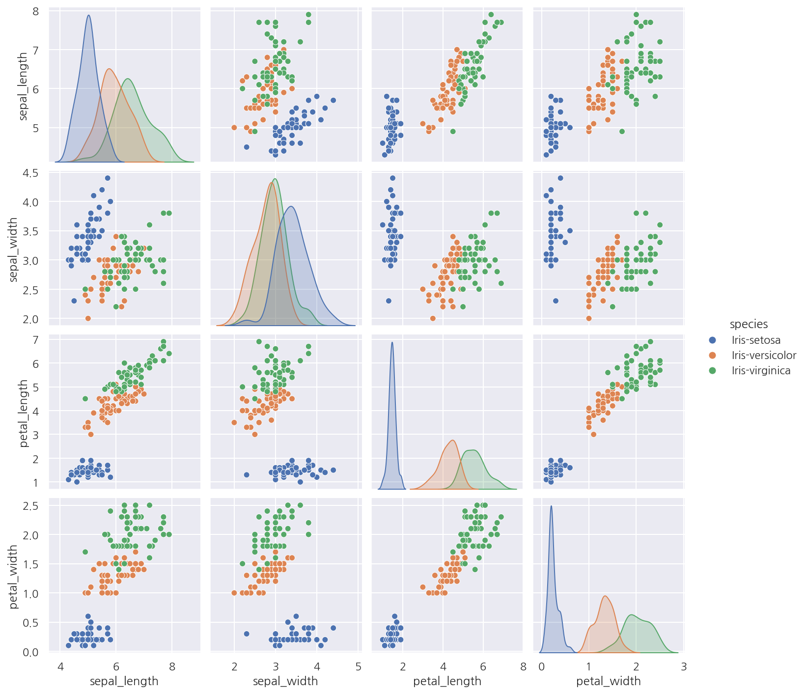

**모두의 딥러닝** 교재를 토대로 공부한 내용입니다.

실습과정에서 필요에 따라 코드나 이론에 대한 추가, 수정사항이 있습니다.

---

**기본 세팅**


```python
import numpy as np
import pandas as pd

import matplotlib as mpl
import matplotlib.pyplot as plt
import seaborn as sns

import warnings
```


```python
%matplotlib inline
%config InlineBackend.figure_format = 'retina'

mpl.rc('font', family='NanumGothic') # 폰트 설정
mpl.rc('axes', unicode_minus=False) # 유니코드에서 음수 부호 설정

# 차트 스타일 설정
sns.set(font="NanumGothic", rc={"axes.unicode_minus":False}, style='darkgrid')
plt.rc("figure", figsize=(10,8))

warnings.filterwarnings("ignore")
```

---

# 12. 다중 분류

이번 챕터에서는 iris 데이터를 이용해서 다중 분류를 진행해본다.

## 12.1 데이터 불러오기

먼저 사용할 데이터의 구조는 다음과 같다.

- sepal_length: 꽃받침 길이


- sepal_width: 꽃받침 너비


- petal_length: 꽃잎 길이


- petal_width: 꽃잎 너비


- species: 붓꽃 품종 (타겟)


```python
# 데이터 불러오기
df = pd.read_csv("deeplearning/dataset/iris.csv",
                names = ["sepal_length", "sepal_width", "petal_length", "petal_width", "species"])
df.head()
```


<div>
<style scoped>
    .dataframe tbody tr th:only-of-type {
        vertical-align: middle;
    }

    .dataframe tbody tr th {
        vertical-align: top;
    }

    .dataframe thead th {
        text-align: right;
    }
</style>
<table border="1" class="dataframe">
  <thead>
    <tr style="text-align: right;">
      <th></th>
      <th>sepal_length</th>
      <th>sepal_width</th>
      <th>petal_length</th>
      <th>petal_width</th>
      <th>species</th>
    </tr>
  </thead>
  <tbody>
    <tr>
      <th>0</th>
      <td>5.1</td>
      <td>3.5</td>
      <td>1.4</td>
      <td>0.2</td>
      <td>Iris-setosa</td>
    </tr>
    <tr>
      <th>1</th>
      <td>4.9</td>
      <td>3.0</td>
      <td>1.4</td>
      <td>0.2</td>
      <td>Iris-setosa</td>
    </tr>
    <tr>
      <th>2</th>
      <td>4.7</td>
      <td>3.2</td>
      <td>1.3</td>
      <td>0.2</td>
      <td>Iris-setosa</td>
    </tr>
    <tr>
      <th>3</th>
      <td>4.6</td>
      <td>3.1</td>
      <td>1.5</td>
      <td>0.2</td>
      <td>Iris-setosa</td>
    </tr>
    <tr>
      <th>4</th>
      <td>5.0</td>
      <td>3.6</td>
      <td>1.4</td>
      <td>0.2</td>
      <td>Iris-setosa</td>
    </tr>
  </tbody>
</table>
</div>


```python
df.shape
```


    (150, 5)


```python
df.species.unique()
```


    array(['Iris-setosa', 'Iris-versicolor', 'Iris-virginica'], dtype=object)


- 총 150개의 샘플로 4개의 피처, 타겟으로 구성되어 있다.


- 타겟은 species로 setosa, versicolor, virginica로 3가지 종류를 가지고 있다.

## 12.2 데이터 시각화


```python
sns.pairplot(df, hue="species")

plt.show()
```


    



## 12.3 원-핫 인코딩


```python
# 데이터 분리
dataset = df.values
X = dataset[:,:4].astype(float)
Y_obj = dataset[:,4]
```

- `values` 속성을 이용해서 데이터를 Numpy 배열 형태로 분리하였다.


```python
# 레이블 인코딩
from sklearn.preprocessing import LabelEncoder

encoder = LabelEncoder()
encoder.fit(Y_obj)
Y = encoder.transform(Y_obj)

Y
```


    array([0, 0, 0, 0, 0, 0, 0, 0, 0, 0, 0, 0, 0, 0, 0, 0, 0, 0, 0, 0, 0, 0,
           0, 0, 0, 0, 0, 0, 0, 0, 0, 0, 0, 0, 0, 0, 0, 0, 0, 0, 0, 0, 0, 0,
           0, 0, 0, 0, 0, 0, 1, 1, 1, 1, 1, 1, 1, 1, 1, 1, 1, 1, 1, 1, 1, 1,
           1, 1, 1, 1, 1, 1, 1, 1, 1, 1, 1, 1, 1, 1, 1, 1, 1, 1, 1, 1, 1, 1,
           1, 1, 1, 1, 1, 1, 1, 1, 1, 1, 1, 1, 2, 2, 2, 2, 2, 2, 2, 2, 2, 2,
           2, 2, 2, 2, 2, 2, 2, 2, 2, 2, 2, 2, 2, 2, 2, 2, 2, 2, 2, 2, 2, 2,
           2, 2, 2, 2, 2, 2, 2, 2, 2, 2, 2, 2, 2, 2, 2, 2, 2, 2])


- 문자열로 된 타겟을 레이블 인코딩으로 숫자형으로 바꿔주었다.


```python
import tensorflow as tf

# tensorflow의 원-핫 인코딩
Y_encoded = tf.keras.utils.to_categorical(Y)
Y_encoded[:5,:]
```


    array([[1., 0., 0.],
           [1., 0., 0.],
           [1., 0., 0.],
           [1., 0., 0.],
           [1., 0., 0.]], dtype=float32)


- `tf.keras.utils.to_categorical()`을 이용해서 원-핫 인코딩을 실행 가능하다.

## 12.4 모델 설정


```python
from tensorflow.keras.models import Sequential
from tensorflow.keras.layers import Dense

# 모델 설정
model = Sequential()
model.add(Dense(16, input_dim=4, activation="relu"))
model.add(Dense(3, activation="softmax"))
```

- 이번엔 출력층에서 적용할 활성화 함수를 softmax를 사용하였다.

## 12.5 softmax

softmax는 다음 그림과 같이 항상 총합이 1인 형태로 바꿔주며 수식은 다음과 같은 형태이다.

$$p_{i} = \dfrac{e^{x_{i}}}{\sum_{i} e^{x_{i}}}$$

총합이 항상 1이기에 확률의 개념으로 생각하여 가장 높은 확률인 경우를 1, 나머지는 0으로 변환하는 것이다.


출처: <https://thebook.io/080228/part04/ch12/04/>

## 12.6 예측


```python
# 시드 설정
np.random.seed(3)
tf.random.set_seed(3)

# 데이터 분리
dataset = df.values
X = dataset[:,:4].astype(float)
Y_obj = dataset[:,4]

# 레이블 인코딩
encoder = LabelEncoder()
encoder.fit(Y_obj)
Y = encoder.transform(Y_obj)

# tensorflow의 원-핫 인코딩
Y_encoded = tf.keras.utils.to_categorical(Y)

# 모델 설정
model = Sequential()
model.add(Dense(16, input_dim=4, activation="relu"))
model.add(Dense(3, activation="softmax"))

# 모델 컴파일
model.compile(loss="categorical_crossentropy", 
              optimizer="adam", 
              metrics=["accuracy"])

# 모델 실행
model.fit(X, Y_encoded, epochs=50, batch_size=1)

# 결과 출력
print("-"*100)
print(f"Accuracy: {model.evaluate(X, Y_encoded, verbose=0)[1]: .4f}")
```

    Train on 150 samples
    Epoch 1/50
    150/150 [==============================] - 1s 4ms/sample - loss: 1.3262 - accuracy: 0.3333
    Epoch 2/50
    150/150 [==============================] - 0s 780us/sample - loss: 0.8467 - accuracy: 0.5933
    Epoch 3/50
    150/150 [==============================] - 0s 791us/sample - loss: 0.7125 - accuracy: 0.6800
    Epoch 4/50
    150/150 [==============================] - 0s 799us/sample - loss: 0.6236 - accuracy: 0.7867
    Epoch 5/50
    150/150 [==============================] - 0s 817us/sample - loss: 0.5535 - accuracy: 0.8533
    ...
    Epoch 45/50
    150/150 [==============================] - 0s 820us/sample - loss: 0.1222 - accuracy: 0.9600
    Epoch 46/50
    150/150 [==============================] - 0s 758us/sample - loss: 0.1138 - accuracy: 0.9733
    Epoch 47/50
    150/150 [==============================] - 0s 734us/sample - loss: 0.1098 - accuracy: 0.9733
    Epoch 48/50
    150/150 [==============================] - 0s 756us/sample - loss: 0.1080 - accuracy: 0.9600
    Epoch 49/50
    150/150 [==============================] - 0s 757us/sample - loss: 0.1075 - accuracy: 0.9667
    Epoch 50/50
    150/150 [==============================] - 0s 798us/sample - loss: 0.1050 - accuracy: 0.9667
    ----------------------------------------------------------------------------------------------------
    Accuracy:  0.9733
    

- 타겟이 다중 분류이므로 오차 함수는 categorical_crossentropy를 사용하였다.


- 같은 이유로 활성화 함수를 softmax를 사용하였다.


- 예측 정확도는 약 97.33%로 나타났다.


- 결과창이 길어 직접 일부 삭제 해두었다.