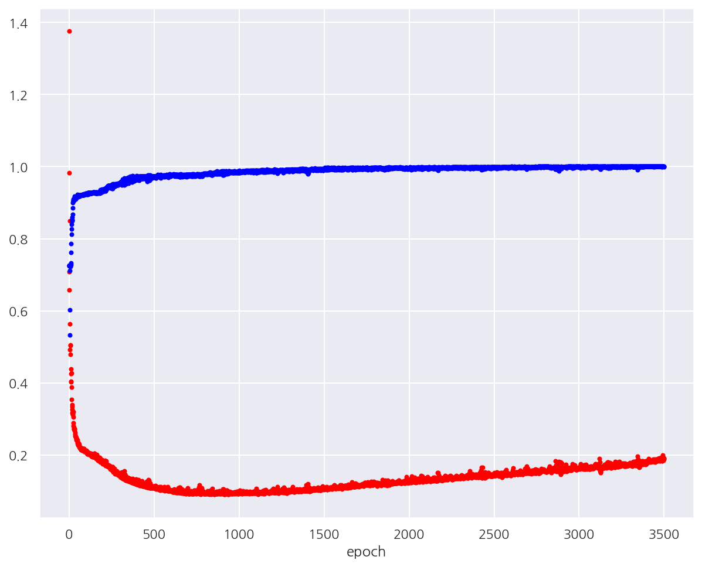

**모두의 딥러닝** 교재를 토대로 공부한 내용입니다.

실습과정에서 필요에 따라 코드나 이론에 대한 추가, 수정사항이 있습니다.

---

**기본 세팅**


```python
import numpy as np
import pandas as pd

import matplotlib as mpl
import matplotlib.pyplot as plt
import seaborn as sns

import warnings
```


```python
%matplotlib inline
%config InlineBackend.figure_format = 'retina'

mpl.rc('font', family='NanumGothic') # 폰트 설정
mpl.rc('axes', unicode_minus=False) # 유니코드에서 음수 부호 설정

# 차트 스타일 설정
sns.set(font="NanumGothic", rc={"axes.unicode_minus":False}, style='darkgrid')
plt.rc("figure", figsize=(10,8))

warnings.filterwarnings("ignore")
```

---

# 14. 베스트 모델 만들기

이번 챕터에서는 베스트 모델을 만들어 보도록 한다.

## 14.1 기본

실습에 사용할 데이터는 UCI 저장소에 있는 레드와인 샘플과 화이트와인 샘플을 사용한다.

원래는 두 데이터가 각각 분리된 데이터인데, 하나로 합쳐서 레드와인과 화이트와인을 구분하도록 한다.

데이터의 구조는 다음과 같다.

- 0: 주석산 농도


- 1: 아세트산 농도


- 2: 구연산 농도


- 3: 잔류 당분 농도


- 4: 염화나트륨 농도


- 5: 유리 아황산 농도


- 6: 총 아황산 농도


- 7: 밀도


- 8: pH


- 9: 황산칼륨 농도


- 10: 알코올 도수


- 11: 와인의 맛(0~10등급)


- 12: class (1: 레드와인, 0: 화이트와인)


```python
df_all = pd.read_csv("deeplearning/dataset/wine.csv", header=None)
df = df_all.sample(frac=1)
df.head()
```


<div>
<style scoped>
    .dataframe tbody tr th:only-of-type {
        vertical-align: middle;
    }

    .dataframe tbody tr th {
        vertical-align: top;
    }

    .dataframe thead th {
        text-align: right;
    }
</style>
<table border="1" class="dataframe">
  <thead>
    <tr style="text-align: right;">
      <th></th>
      <th>0</th>
      <th>1</th>
      <th>2</th>
      <th>3</th>
      <th>4</th>
      <th>5</th>
      <th>6</th>
      <th>7</th>
      <th>8</th>
      <th>9</th>
      <th>10</th>
      <th>11</th>
      <th>12</th>
    </tr>
  </thead>
  <tbody>
    <tr>
      <th>2052</th>
      <td>6.0</td>
      <td>0.27</td>
      <td>0.27</td>
      <td>1.60</td>
      <td>0.046</td>
      <td>32.0</td>
      <td>113.0</td>
      <td>0.99240</td>
      <td>3.41</td>
      <td>0.51</td>
      <td>10.5</td>
      <td>7</td>
      <td>0</td>
    </tr>
    <tr>
      <th>6476</th>
      <td>5.9</td>
      <td>0.54</td>
      <td>0.00</td>
      <td>0.80</td>
      <td>0.032</td>
      <td>12.0</td>
      <td>82.0</td>
      <td>0.99286</td>
      <td>3.25</td>
      <td>0.36</td>
      <td>8.8</td>
      <td>5</td>
      <td>0</td>
    </tr>
    <tr>
      <th>5902</th>
      <td>6.9</td>
      <td>0.26</td>
      <td>0.29</td>
      <td>4.20</td>
      <td>0.043</td>
      <td>33.0</td>
      <td>114.0</td>
      <td>0.99020</td>
      <td>3.16</td>
      <td>0.31</td>
      <td>12.5</td>
      <td>6</td>
      <td>0</td>
    </tr>
    <tr>
      <th>992</th>
      <td>6.5</td>
      <td>0.40</td>
      <td>0.10</td>
      <td>2.00</td>
      <td>0.076</td>
      <td>30.0</td>
      <td>47.0</td>
      <td>0.99554</td>
      <td>3.36</td>
      <td>0.48</td>
      <td>9.4</td>
      <td>6</td>
      <td>1</td>
    </tr>
    <tr>
      <th>4247</th>
      <td>6.6</td>
      <td>0.23</td>
      <td>0.29</td>
      <td>14.45</td>
      <td>0.057</td>
      <td>29.0</td>
      <td>144.0</td>
      <td>0.99756</td>
      <td>3.33</td>
      <td>0.54</td>
      <td>10.2</td>
      <td>6</td>
      <td>0</td>
    </tr>
  </tbody>
</table>
</div>


- `sample()` 함수를 사용하면 원본 데이터에서 정해진 비율만큼 랜덤으로 샘플을 추출한다.


- `frac` 옵션을 1로 주면 100%를 불러오며 0.3으로 지정한다면 30%를 추출한다.


- 현재는 전체를 불러왔지만 index 순서가 랜덤한 것을 확인 가능하다.


```python
df.info()
```

    <class 'pandas.core.frame.DataFrame'>
    Int64Index: 6497 entries, 2052 to 4874
    Data columns (total 13 columns):
     #   Column  Non-Null Count  Dtype  
    ---  ------  --------------  -----  
     0   0       6497 non-null   float64
     1   1       6497 non-null   float64
     2   2       6497 non-null   float64
     3   3       6497 non-null   float64
     4   4       6497 non-null   float64
     5   5       6497 non-null   float64
     6   6       6497 non-null   float64
     7   7       6497 non-null   float64
     8   8       6497 non-null   float64
     9   9       6497 non-null   float64
     10  10      6497 non-null   float64
     11  11      6497 non-null   int64  
     12  12      6497 non-null   int64  
    dtypes: float64(11), int64(2)
    memory usage: 710.6 KB
    

- 데이터는 샘플 6,497개, 12개의 피처와 타겟으로 구성되어 있다.


- 위 데이터로 딥러닝 모델을 실행 해보자.


```python
import tensorflow as tf
from tensorflow.keras.models import Sequential
from tensorflow.keras.layers import Dense

# 시드 설정
np.random.seed(0)
tf.random.set_seed(3)

# 데이터 샘플 100%
df = df_all.sample(frac=1)

# 데이터 분리
dataset = df.values
X = dataset[:,:12]
Y = dataset[:,12]

# 모델 설정
model = Sequential()
model.add(Dense(30, input_dim=12, activation="relu"))
model.add(Dense(12, activation="relu"))
model.add(Dense(8, activation="relu"))
model.add(Dense(1, activation="sigmoid"))

# 모델 컴파일
model.compile(loss="binary_crossentropy", optimizer="adam", metrics=["accuracy"])

# 모델 실행
model.fit(X, Y, epochs=200, batch_size=200)

# 결과 출력
print("-"*100)
print(f"Accuracy: {model.evaluate(X, Y, verbose=0)[1]: .4f}")
```

    Train on 6497 samples
    Epoch 1/200
    6497/6497 [==============================] - 1s 94us/sample - loss: 0.6227 - accuracy: 0.7642
    Epoch 2/200
    6497/6497 [==============================] - 0s 7us/sample - loss: 0.2953 - accuracy: 0.9050
    ...
    Epoch 200/200
    6497/6497 [==============================] - 0s 6us/sample - loss: 0.0465 - accuracy: 0.9863
    ----------------------------------------------------------------------------------------------------
    Accuracy:  0.9868
    

- 교재는 여기서 `keras` 패키지를 사용하는데 나는 `tensorflow`의 keras를 사용하였다.


- 이유는 이전 포스팅 [과적합 피하기](https://romg2.github.io/dl_all/01-%EB%AA%A8%EB%91%90%EC%9D%98-%EB%94%A5%EB%9F%AC%EB%8B%9D-04.-%EB%94%A5%EB%9F%AC%EB%8B%9D-%EA%B8%B0%EB%B3%B8%EA%B8%B0-%EB%8B%A4%EC%A7%80%EA%B8%B0-(4)/)에 자세히 적어두었다.


- 예측 정확도는 약 98.68%로 나타났다.


- 결과창이 너무 길어 직접 삭제해두었다.

## 14.2 저장

이번엔 각 epoch별로 모델을 저장해보도록 하자.


```python
import os

model_dir = "./model"

# 해당 폴더가 존재하지 않으면 폴더 생성
if not os.path.exists(model_dir):
    os.mkdir(model_dir)
```

- 먼저 각 epoch별 모델을 저장할 디렉토리를 생성하였다.


```python
from tensorflow.keras.callbacks import ModelCheckpoint

# 모델 저장 경로 지정
modelpath = "./model/{epoch:04d}-{val_loss:.4f}.hdf5"

# 모델 저장 조건 설정
checkpointer = ModelCheckpoint(filepath=modelpath, monitor="val_loss", 
                               verbose=1, save_best_only=True)
```

- `ModelCheckpoint()`로 모델이 저장될 경로와 모니터할 값을 지정한다.


- test 오차는 "val_loss", test 정확도는 "val_accuracy", train 오차는 "loss"로 기록된다.


- `save_best_only` 옵션을 True로 설정하면 앞서 저장한 모델보다 나아졌을 때만 저장한다.


```python
import tensorflow as tf
from tensorflow.keras.models import Sequential
from tensorflow.keras.layers import Dense
from tensorflow.keras.callbacks import ModelCheckpoint

# 시드 설정
np.random.seed(3)
tf.random.set_seed(3)

# 데이터 샘플 100%
df = df_all.sample(frac=1)

# 데이터 분리
dataset = df.values
X = dataset[:,:12]
Y = dataset[:,12]

# 모델 설정
model = Sequential()
model.add(Dense(30, input_dim=12, activation="relu"))
model.add(Dense(12, activation="relu"))
model.add(Dense(8, activation="relu"))
model.add(Dense(1, activation="sigmoid"))

# 모델 컴파일
model.compile(loss="binary_crossentropy", optimizer="adam", metrics=["accuracy"])

# 모델 저장 조건 설정
checkpointer = ModelCheckpoint(filepath=modelpath, monitor="val_loss", 
                               verbose=1, save_best_only=True)

# 모델 실행 (결과 저장)
model.fit(X, Y, validation_split=0.2, 
          epochs=200, batch_size=200, 
          verbose = 0, 
          callbacks = [checkpointer])
```

    
    Epoch 00001: val_loss improved from inf to 0.40064, saving model to ./model/0001-0.4006.hdf5
    
    Epoch 00002: val_loss improved from 0.40064 to 0.29953, saving model to ./model/0002-0.2995.hdf5
    
    ...

    Epoch 00198: val_loss improved from 0.05374 to 0.05323, saving model to ./model/0198-0.0532.hdf5
    
    Epoch 00199: val_loss did not improve from 0.05323
    
    Epoch 00200: val_loss did not improve from 0.05323
    


    <tensorflow.python.keras.callbacks.History at 0x2b99a4b4888>


- `fit()` 함수에 `validation_split` 옵션을 0.2로 설정하여 데이터의 20%를 성능평가에 사용한다.


- `callbacks` 옵션에 앞서 생성한 `ModelCheckpoint()`를 지정한다.


- val_loss가 줄어들었을때만 모델을 저장한다.


- 결과창이 너무 길어 직접 삭제해두었다.

## 14.3 시각화

앞서 모델의 오차가 줄어드는 경우만 저장하여 epoch가 몇 일때 오차가 가장 작은지 확인하였다.

이를 시각화해서 살펴보자.


```python
import tensorflow as tf
from tensorflow.keras.models import Sequential
from tensorflow.keras.layers import Dense
from tensorflow.keras.callbacks import ModelCheckpoint

# 시드 설정
np.random.seed(3)
tf.random.set_seed(3)

# 데이터 샘플 15%
df = df_all.sample(frac=0.15)

# 데이터 분리
dataset = df.values
X = dataset[:,:12]
Y = dataset[:,12]

# 모델 설정
model = Sequential()
model.add(Dense(30, input_dim=12, activation="relu"))
model.add(Dense(12, activation="relu"))
model.add(Dense(8, activation="relu"))
model.add(Dense(1, activation="sigmoid"))

# 모델 컴파일
model.compile(loss="binary_crossentropy", optimizer="adam", metrics=["accuracy"])

# 모델 실행
history1 = model.fit(X, Y, validation_split=0.33, 
                     epochs=3500, batch_size=500, 
                     verbose = 0)
```

- 우선 시간을 고려해서 데이터는 전체 샘플의 15%만 사용하였다.


- `validation_split`은 0.33으로 설정하였고 epoch 수를 3500으로 증가시켰다.


- epoch별 결과를 history1에 저장하였다.


```python
history1.history.keys()
```


    dict_keys(['loss', 'accuracy', 'val_loss', 'val_accuracy'])


- `history` 속성에는 train과 test에 대한 오차, 정확도가 epoch별로 dictionary 형태로 저장되어 있다.


- 이를 이용해서 시각화를 진행해보자.


```python
# test 오차, train 정확도 시각화
y_vloss = history1.history["val_loss"]
y_acc = history1.history["accuracy"]
x_len = np.arange(len(y_acc))

plt.plot(x_len, y_vloss, "o", c="red", markersize=3) # test 오차
plt.plot(x_len, y_acc, "o", c="blue", markersize=3)  # train 정확도
plt.xlabel("epoch")
plt.show()
```


    



- epoch가 증가하면서 train 정확도는 계속 증가하여 100%가 된다.


- 반면, test 오차는 처음에는 감소하다가 점차 다시 증가하게 된다.


- 이는 과적합으로 인한 문제이다.

## 14.4 조기 중단

epoch가 증가할수록 과적합 문제가 발생하기 때문에 test에 대한 결과는 점점 나빠진다.


test 오차가 줄지 않으면 학습을 멈추게 조기 중단을 지정해보자.


```python
from tensorflow.keras.callbacks import EarlyStopping

# 조기 중단 설정
early_stopping_callback = EarlyStopping(monitor="val_loss", patience=100)
```

- `EarlyStopping()`으로 모니터할 값을 지정한다.


- `patience=100`은 100번의 epoch가 지나도록 모니터할 값이 나아지지 않으면 중단하도록 한다.


```python
import tensorflow as tf
from tensorflow.keras.models import Sequential
from tensorflow.keras.layers import Dense
from tensorflow.keras.callbacks import ModelCheckpoint
from tensorflow.keras.callbacks import EarlyStopping

# 시드 설정
np.random.seed(3)
tf.random.set_seed(3)

# 데이터 샘플 15%
df = df_all.sample(frac=0.15)

# 데이터 분리
dataset = df.values
X = dataset[:,:12]
Y = dataset[:,12]

# 모델 설정
model = Sequential()
model.add(Dense(30, input_dim=12, activation="relu"))
model.add(Dense(12, activation="relu"))
model.add(Dense(8, activation="relu"))
model.add(Dense(1, activation="sigmoid"))

# 모델 컴파일
model.compile(loss="binary_crossentropy", optimizer="adam", metrics=["accuracy"])

# 조기 중단 설정
early_stopping_callback = EarlyStopping(monitor="val_loss", patience=100)

# 모델 실행
model.fit(X, Y, validation_split=0.2, 
          epochs=2000, batch_size=500, 
          verbose = 1, 
          callbacks = [early_stopping_callback])
```

    Train on 780 samples, validate on 195 samples
    Epoch 1/2000
    780/780 [==============================] - 0s 536us/sample - loss: 2.0167 - accuracy: 0.7256 - val_loss: 1.2055 - val_accuracy: 0.7744
    ...
    Epoch 675/2000
    780/780 [==============================] - 0s 20us/sample - loss: 0.0739 - accuracy: 0.9782 - val_loss: 0.0658 - val_accuracy: 0.9795
    ...
    Epoch 773/2000
    780/780 [==============================] - 0s 28us/sample - loss: 0.0611 - accuracy: 0.9846 - val_loss: 0.0704 - val_accuracy: 0.9795
    Epoch 774/2000
    780/780 [==============================] - 0s 27us/sample - loss: 0.0611 - accuracy: 0.9859 - val_loss: 0.0682 - val_accuracy: 0.9846
    Epoch 775/2000
    780/780 [==============================] - 0s 27us/sample - loss: 0.0604 - accuracy: 0.9846 - val_loss: 0.0725 - val_accuracy: 0.9795
    


    <tensorflow.python.keras.callbacks.History at 0x2b99cf64708>


- epoch을 2,000으로 설정하였는데 결과를 보면 775번까지만 실행하였다.


- 이는 675번째 epoch에서의 val_loss 0.0658에서 100번의 epoch가 진행되도록 감소하지 않아서이다.


- 결과창이 너무 길어 직접 삭제해두었다.

## 14.5 저장 및 조기 중단

- 마지막으로 저장과 조기 중단 옵션을 같이 설정해보자.


```python
import tensorflow as tf
from tensorflow.keras.models import Sequential
from tensorflow.keras.layers import Dense
from tensorflow.keras.callbacks import ModelCheckpoint
from tensorflow.keras.callbacks import EarlyStopping

# 시드 설정
np.random.seed(3)
tf.random.set_seed(3)

# 데이터 샘플 15%
df = df_all.sample(frac=0.15)

# 데이터 분리
dataset = df.values
X = dataset[:,:12]
Y = dataset[:,12]

# 모델 설정
model = Sequential()
model.add(Dense(30, input_dim=12, activation="relu"))
model.add(Dense(12, activation="relu"))
model.add(Dense(8, activation="relu"))
model.add(Dense(1, activation="sigmoid"))

# 모델 컴파일
model.compile(loss="binary_crossentropy", optimizer="adam", metrics=["accuracy"])

# 모델 저장 조건 설정
checkpointer = ModelCheckpoint(filepath=modelpath, monitor="val_loss", 
                               verbose=1, save_best_only=True)

# 조기 중단 설정
early_stopping_callback = EarlyStopping(monitor="val_loss", patience=100)

# 모델 실행
model.fit(X, Y, validation_split=0.2, 
          epochs=2000, batch_size=500, 
          verbose = 0, 
          callbacks = [early_stopping_callback, checkpointer])
```

    
    Epoch 00001: val_loss improved from inf to 1.20551, saving model to ./model/0001-1.2055.hdf5
    
    ...
    
    Epoch 00775: val_loss did not improve from 0.06576
    


    <tensorflow.python.keras.callbacks.History at 0x2b99dd139c8>


- `callbacks` 옵션에 `ModelCheckpoint()`와 `EarlyStopping()`을 같이 입력해주면 된다.


- 결과는 동일하게 775번째에서 중단되었고 마지막으로 저장된 모델은 675번째이다.


- 결과창이 너무 길어 직접 삭제해두었다.