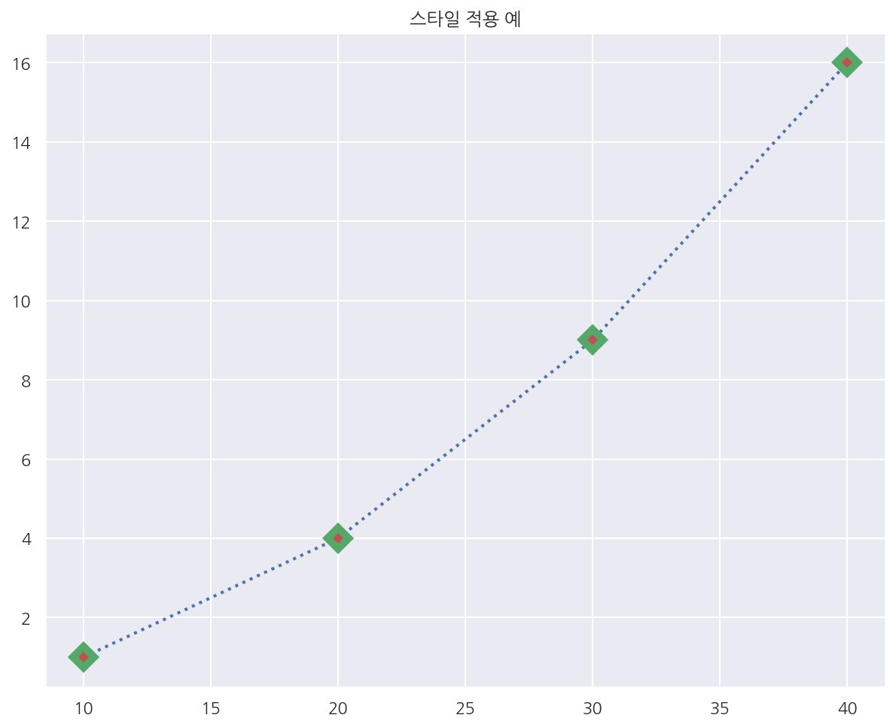
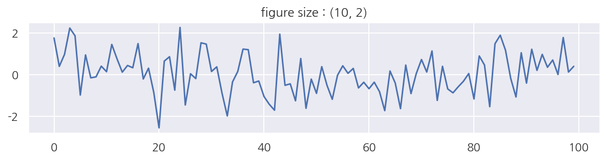

[데이터 사이언스 스쿨](https://datascienceschool.net/intro.html) 자료를 토대로 공부한 내용입니다.

실습과정에서 필요에 따라 내용의 누락 및 추가, 수정사항이 있습니다.

---


# 5.1 시각화 패키지 맷플롯리브 소개

## pyplot 서브패키지


```python
import numpy as np
import matplotlib as mpl
import matplotlib.pyplot as plt
```

`matplotlib` 패키지에는 `pyplot` 라는 서브패키지가 존재한다. 

간단한 시각화 프로그램을 만드는 경우에는 `pyplot` 서브패키지의 명령만으로도 충분하다.

일반적으로 `matplotlib`은 mpl, `pyplot`은 plt라는 별칭으로 사용한다.

이전에 `numpy`는 np, `pandas`는 pd로 사용한 것과 같은 맥락이다.


```python
%matplotlib inline
%config InlineBackend.figure_format = 'retina'

mpl.rc('font', family='NanumGothic') # 폰트 설정
mpl.rc('axes', unicode_minus=False) # 유니코드에서 음수 부호 설정
```

- %matplotlib inline은 시각화 그림을 주피터 노트북 내에 표시하는 명령어이다.


- %config InlineBackend.figure_format = 'retina'는 한글 폰트 사용시 글자를 선명하게 하는 명령어이다.


- 나머지는 한글 폰트 사용관련 명령어이다.


- 나는 폰트 다운, 설정 등을 챕터를 공부하면서 모두 설정해두었다.


- 사실 기본 설정이 더 중요한데 [데이터 사이언스 스쿨 5.1](https://datascienceschool.net/01%20python/05.01%20%EC%8B%9C%EA%B0%81%ED%99%94%20%ED%8C%A8%ED%82%A4%EC%A7%80%20%EB%A7%B7%ED%94%8C%EB%A1%AF%EB%A6%AC%EB%B8%8C%20%EC%86%8C%EA%B0%9C.html#id4)에 자세히 나와있으므로 굳이 따로 설명하지 않는다.


```python
import seaborn as sns
import warnings

%matplotlib inline
%config InlineBackend.figure_format = 'retina'

mpl.rc('font', family='NanumGothic') # 폰트 설정
mpl.rc('axes', unicode_minus=False) # 유니코드에서 음수 부호 설정

# 차트 스타일 설정
sns.set(font="NanumGothic", rc={"axes.unicode_minus":False}, style='darkgrid')
plt.rc("figure", figsize=(10,8))

warnings.filterwarnings("ignore") # 경고 무시
```

- `seaborn` 패키지는 후에 따로 챕터가 있는데 차트 스타일 설정을 위해 사용하였다.


- 여기선 시각화를 할때 개인적으로 선호하는 기본 설정을 세팅한 것이라 굳이 위 코드를 실행하지 않아도 밑에 코드를 실행하는데는 문제 없다.

## 라인 플롯


```python
plt.title("Plot")
plt.plot([1, 4, 9, 16])
plt.show()
```


    

    
    

- `plt.plot()`을 이용해서 선 그래프를 그릴 수 있다.


- y값이 1, 4, 9, 16으로 변화하는 선 그래프로 x값은 자동으로 0, 1, 2, 3이 설정된다.


```python
# x ticks 추가
plt.title("x ticks")
plt.plot([10, 20, 30, 40], [1, 4, 9, 16])
plt.show()
```


    

    


- 이번엔 xtick(x축의 자료 위치)를 직접 지정해서 그래프를 그렸다.

## 한글폰트 사용


```python
plt.title('한글 제목')
plt.plot([10, 20, 30, 40], [1, 4, 9, 16])
plt.xlabel("엑스축 라벨")
plt.ylabel("와이축 라벨")
plt.show()
```


    

    


- 한글 폰트를 사용하기 위한 기본 설정을 잘 끝냈다면 위 그래프와 같이 한글이 잘 출력될 것이다.


- 기본 설정이 되지 않는다면 에러가 발생한다.


```python
# 객체마다 다른 폰트 적용하기
font1 = {'family': 'NanumMyeongjo', 'size': 24, 
         'color':  'black'}
font2 = {'family': 'NanumBarunpen', 'size': 18, 'weight': 'bold',
         'color':  'darkred'}
font3 = {'family': 'NanumBarunGothic', 'size': 12, 'weight': 'light',
         'color':  'blue'}

plt.plot([10, 20, 30, 40], [1, 4, 9, 16])
plt.title('한글 제목', fontdict=font1)
plt.xlabel('엑스 축', fontdict=font2)
plt.ylabel('와이 축', fontdict=font3)
plt.show()
```


    

    


- 위 그래프는 x축, y축, 제목별로 다른 폰트 스타일을 적용한 예이다.


- 폰트 패밀리, 색상, 크기를 dictionary 형태로 지정하여 fontdict 인수에 기입해준다.

## 스타일 지정


```python
# plt.plot( xtick, ytick, style )
plt.title("'rs--' 스타일의 plot ") # red, square, dashline
plt.plot([10, 20, 30, 40], [1, 4, 9, 16], 'rs--')
plt.show()
```


    

    


- 위 그래프는 색깔은 빨간색, 마커모양은 사각형, 선 스타일은 점선으로 나타낸 그래프이다.


- 이처럼 그래프를 그릴 때 여러 스타일을 지정 가능하다.


- 스타일의 종류도 매우 다양한데 [데이터 사이언스 스쿨 5.1](https://datascienceschool.net/01%20python/05.01%20%EC%8B%9C%EA%B0%81%ED%99%94%20%ED%8C%A8%ED%82%A4%EC%A7%80%20%EB%A7%B7%ED%94%8C%EB%A1%AF%EB%A6%AC%EB%B8%8C%20%EC%86%8C%EA%B0%9C.html#id4)에 정리한 내용이 있다.


```python
# mec: 마커 색, mfc: 마커 내부 색
plt.plot([10, 20, 30, 40], [1, 4, 9, 16], c="b",
         lw=2, ls=":", marker="D", ms=10, mec="g", mew=5, mfc="r")
plt.title("스타일 적용 예")
plt.show()
```


    

    


## 그림 범위 지정


```python
plt.title("x축, y축의 범위 설정")
plt.plot([10, 20, 30, 40], [1, 4, 9, 16], c="b",
         lw=2, ls=":", marker="D", ms=10, mec="g", mew=5, mfc="r")
plt.xlim(0, 50)
plt.ylim(-10, 30)
plt.show()
```


    

    


- 그래프의 x축, y축의 범위를 조정하고 싶으면 `xlim()`, `ylim()`으로 원하는 범위를 지정한다.

## 틱 설정


```python
X = np.linspace(-np.pi, np.pi, 256)
C = np.cos(X)
plt.title("x축과 y축의 tick label 설정")
plt.plot(X, C)
plt.xticks([-np.pi, -np.pi / 2, 0, np.pi / 2, np.pi])
plt.yticks([-1, 0, 1])
plt.show()
```


    

    


- tick은 축상의 위치 표시 지점을 의미한다.


- tick에 써진 숫자 혹은 글자를 tick label이라고 한다.


- 만약 직접 tick 위치나 tick label을 조정하고 싶다면 `xticks()`, `yticks()`를 사용한다.


```python
X = np.linspace(-np.pi, np.pi, 256)
C = np.cos(X)
plt.title("LaTeX, 문자열로 tick label 정의")
plt.plot(X, C)
plt.xticks([-np.pi, -np.pi / 2, 0, np.pi / 2, np.pi],
           [r'$-\pi$', r'$-\pi/2$', r'$0$', r'$+\pi/2$', r'$+\pi$'])
plt.yticks([-1, 0, 1], ["Low", "Zero", "High"])
plt.show()
```


    

    


- 위 예시는 tick label을 LaTex 문자열로 표현한 예이다.


- LaTex 수학식은 $$ 사이에 LaTex 문법에 맞게 넣으면 된다.


- 여담으로 지금 이 글처럼 마크다운에서도 LaTex 문법을 사용 가능하다.


```python
X = np.linspace(-np.pi, np.pi, 256)
C = np.cos(X)
plt.title("Grid 제거")
plt.plot(X, C)
plt.xticks([-np.pi, -np.pi / 2, 0, np.pi / 2, np.pi],
           [r'$-\pi$', r'$-\pi/2$', r'$0$', r'$+\pi/2$', r'$+\pi$'])
plt.yticks([-1, 0, 1], ["Low", "Zero", "High"])
plt.grid(False)
plt.show()
```


    

    


- `grid(False)`를 사용하면 그래프에 그리드가 출력되지 않는다.

## 여러개의 선을 그리기


```python
# plt.plot( x1,y1,style1, x2,y2,style2, ...)
t = np.arange(0., 5., 0.2)
plt.title("라인 플롯에서 여러개의 선 그리기")
plt.plot(t, t, 'r--', t, 0.5 * t**2, 'bs:', t, 0.2 * t**3, 'g^-')
plt.show()
```


    

    


- `plt.plot()` 명령어에 x 데이터, y 데이터, 스타일 문자열을 반복하여 기입하면 여러 그래프를 동시에 그릴 수 있다.


- `plt.plot( x1, y1, style1, x2, y2, style2, ...)` 과 같은 형태로 입력해 준다.

## 겹쳐그리기


```python
plt.title("복수의 plot 명령을 한 그림에서 표현")
plt.plot([1, 4, 9, 16],
         c="b", lw=2, ls="--", marker="o", ms=3, mec="g", mew=5, mfc="r")

plt.plot([9, 16, 4, 1],
         c="k", lw=2, ls=":", marker="s", ms=3, mec="m", mew=5, mfc="c")

plt.show()
```


    

    


- 하나의 `plt.plot()` 명령어에 여러 그래프를 동시에 입력하지 않고 `plt.plot()` 명령어를 반복해서 사용하여도 동시에 그래프를 그릴 수 있다.

## 범례


```python
X = np.linspace(-np.pi, np.pi, 256)
C, S = np.cos(X), np.sin(X)
plt.title("legend를 표시한 플롯")
plt.plot(X, C, ls="--", label="cosine")
plt.plot(X, S, ls=":", label="sine")
plt.legend(loc=2)
plt.show()
```


    

    


- 여러 그래프를 동시에 그리면 각 선이 무슨 자료를 의미하는지 알아보기가 힘들다.


- `lenged()`를 사용하면 범례(legend)를 추가할 수 있다. 


- lenged의 위치는 자동으로 정해지지만 수동으로 설정하고 싶으면 loc 인수를 사용한다.


- loc 인수는 0 ~ 10까지 존재하는데 한번씩 직접 실행해봐야 이해가 잘 된다.


- 0 ~ 10의 의미는 역시.. [데이터 사이언스 스쿨 5.1](https://datascienceschool.net/01%20python/05.01%20%EC%8B%9C%EA%B0%81%ED%99%94%20%ED%8C%A8%ED%82%A4%EC%A7%80%20%EB%A7%B7%ED%94%8C%EB%A1%AF%EB%A6%AC%EB%B8%8C%20%EC%86%8C%EA%B0%9C.html#id4)을 참조하길 바랍니다.

## x축, y축 라벨, 타이틀


```python
X = np.linspace(-np.pi, np.pi, 256)
C, S = np.cos(X), np.sin(X)
plt.plot(X, C, label="cosine")
plt.xlabel("time")
plt.ylabel("amplitude")
plt.title("Cosine Plot")
plt.show()
```


    

    


- `xlabel()`, `ylabel()`, `title()`을 사용하여 x축, y축, 제목 라벨을 지정할 수 있다.

## 연습 문제 5.1.1

- 여러가지 함수를 사용하여 아래 조건에 맞는 그래프를 그린다.


- xlabel, ylabel, title을 모두 갖추고 있어야 한다.


- 하나의 Figure(일단, 그림이라고 이해한다. 아래에 자세한 설명이 있다.)에 3개 이상의 Plot을 그린다.


- 각 Plot은 다른 선, 마크, 색 스타일을 가진다.


- legend는 그래프와 겹치지 않는 곳에 위치 시키도록 한다.


```python
# font style
font1 = {'family': 'NanumBarunpen', 'size': 18, 'weight': 'bold',
         'color':  'red'}

# x, y
x1 = np.linspace(-10, 10, 20)
x2 = np.linspace(-10, 10, 1000)

y1 = x1**2
y2 = x1
y3 = np.exp(x2)

plt.plot(x1, y1, c="r", marker="s", ls="--", label = r"$y = x^{2}$", mew=3)
plt.plot(x1, y2, "bd:", label= r"$y = x$", mew=0.5)
plt.plot(x2, y3, c="k", label = r"$y = \exp \left( x \right)$")

# title, label
plt.title("3개의 plot", weight="bold")
plt.xlabel("x축")
plt.ylabel("y축", fontdict=font1)

# ylim, xticks
plt.ylim(-15,50)
plt.xticks(np.linspace(-10,10,5))

# legend, grid
plt.legend(loc=2)
plt.grid(True)

plt.show()
```


    

    


- 최대한 여러 옵션을 사용하려고 해보았는데 그래프가 이쁘지는 않다.


- 나의 경우 $y = x^{2}$, $y = x$, $y = \exp \left( x \right)$ 를 시각화 하였다.

## 그림의 구조

그림의 구조는 다음과 같이 Figure, Axes, Axis로 구성되어 있다


- Figure: 그림이 그려지는 종이
    
    
- Axes: 하나의 플롯
    
    
- Axis: 축

### Figure


```python
# figure size set
np.random.seed(0)
f1 = plt.figure(figsize=(10, 2))
plt.title("figure size : (10, 2)")
plt.plot(np.random.randn(100))
plt.show()
```


    

    


```python
# plt.gcf: 현재 사용하고 있는 Figure 객체를 얻고 싶을 때
f1 = plt.figure(1)
plt.title("현재의 Figure 객체")
plt.plot([1, 2, 3, 4], 'ro:')

f2 = plt.gcf()
print(f1, id(f1))
print(f2, id(f2))
plt.show()
```

    Figure(720x576) 1618498088768
    Figure(720x576) 1618498088768
    


    

    


### Axes


```python
# subplot
x1 = np.linspace(0.0, 5.0)
x2 = np.linspace(0.0, 2.0)
y1 = np.cos(2 * np.pi * x1) * np.exp(-x1)
y2 = np.cos(2 * np.pi * x2)

ax1 = plt.subplot(2, 1, 1)
plt.plot(x1, y1, 'yo-')
plt.title('A tale of 2 subplots')
plt.ylabel('Damped oscillation')

ax2 = plt.subplot(212)
plt.plot(x2, y2, 'r.-')
plt.xlabel('time (s)')
plt.ylabel('Undamped')

plt.tight_layout() #: plot간 간격을 자동으로 맞춤
plt.show()
```


    

    


- `subplot()`를 사용하여 하나의 Figure안에 여러 Axes를 보일 수 있다.


- 위 예시에서 `subplot(2,1,1)`은 2행 1열의 Figure에서 1행 Axes를 의미한다.


- 콤마 없이 사용 가능하며 `subplot(212)`는 2행 1열의 Figure에서 2행 Axes를 의미한다.


```python
# 2x2 subplot
np.random.seed(0)

plt.subplot(221)
plt.plot(np.random.rand(5))
plt.title("axes 1")

plt.subplot(222)
plt.plot(np.random.rand(5))
plt.title("axes 2")

plt.subplot(223)
plt.plot(np.random.rand(5))
plt.title("axes 3")

plt.subplot(224)
plt.plot(np.random.rand(5))
plt.title("axes 4")

plt.tight_layout()
plt.show()
```


    

    


- `subplot()`으로 2 x 2 그래프를 그렸다.


```python
# subplots
fig, axes = plt.subplots(2, 2)

np.random.seed(0)
axes[0, 0].plot(np.random.rand(5))
axes[0, 0].set_title("axes 1")

axes[0, 1].plot(np.random.rand(5))
axes[0, 1].set_title("axes 2")

axes[1, 0].plot(np.random.rand(5))
axes[1, 0].set_title("axes 3")

axes[1, 1].plot(np.random.rand(5))
axes[1, 1].set_title("axes 4")

plt.tight_layout()
plt.show()
```


    

    


- `subplots()`로 동시에 Axes 객체를 생성 할 수 있다.


- `subplots()`를 사용한 경우 axes[0, 0]과 같이 Axes 객체별로 `plot()`을 적용하고 기타 설정을 적용한다.

### Axis 객체와 축


```python
fig, ax0 = plt.subplots()

# twinx: x축을 공유하는 새로운 Axes객체 생성
ax1 = ax0.twinx()

ax0.set_title("2개의 y축 한 figure에서 사용하기")
ax0.plot([10, 5, 2, 9, 7], 'r--', label="y0")
ax0.set_ylabel("y0")
ax0.grid(False)

ax1.plot([100, 200, 220, 180, 120], 'g:', label="y1")
ax1.set_ylabel("y1")
ax1.grid(False)

ax0.set_xlabel("공유되는 x축")
plt.show()
```


    

    


- `twinx()`는 x축을 공유하는 새로운 Axes객체 생성한다.


- 위 그래프를 보면 x축을 서로 공유하면서 서로 다른 y축이 나타난다.

## 연습 문제 5.1.2

여러가지 함수를 사용하여 위와 같이 subplot들로 구성된 그림을 그려보자.

모든 subplot에 대해 xlabel, ylabel, title이 있어야 한다.


```python
fig, ax = plt.subplots(3,4, figsize=(15,10))

for row in range(3):
    for col in range(4):
        ax[row,col].plot(np.random.randn(10))
        ax[row,col].set_title(f"{row+1}행 {col+1}열")
        ax[row,col].set_xlabel(f"{row+1}행")
        ax[row,col].set_ylabel(f"{col+1}열", rotation=0)


fig.tight_layout()
plt.show()
```


    

    

