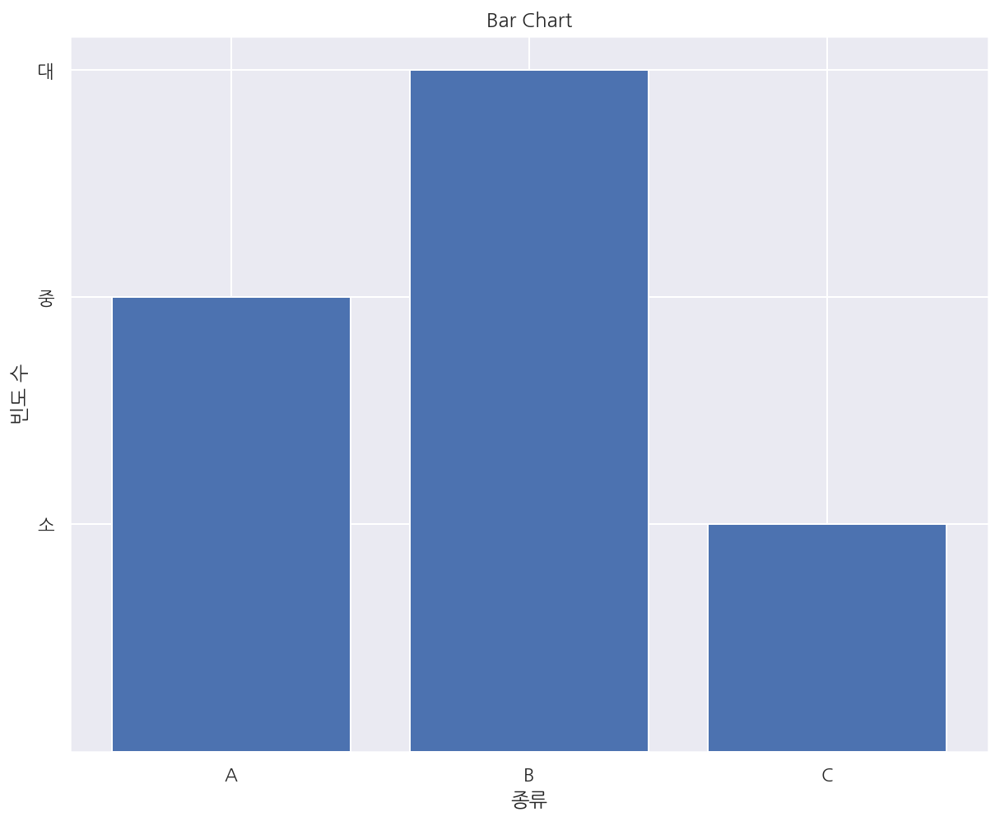
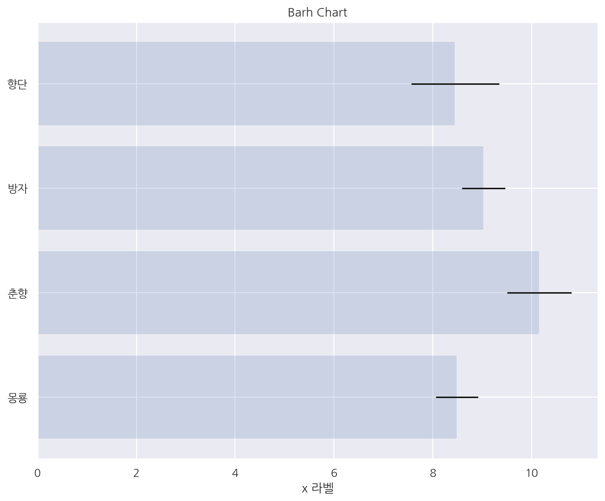
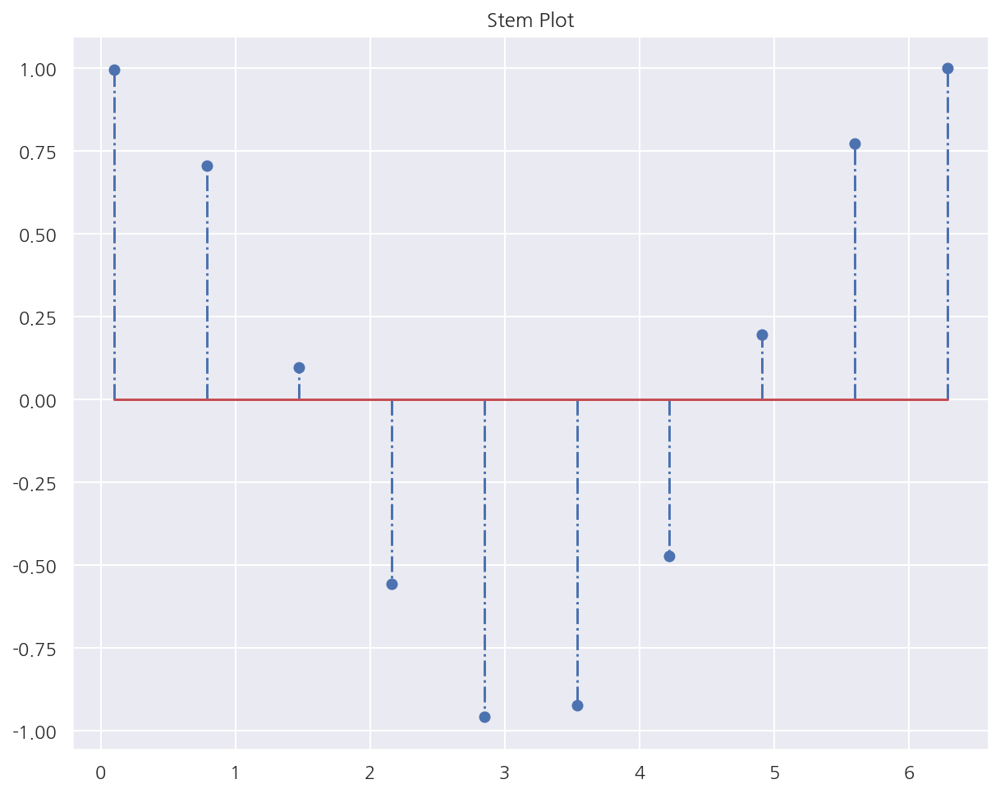
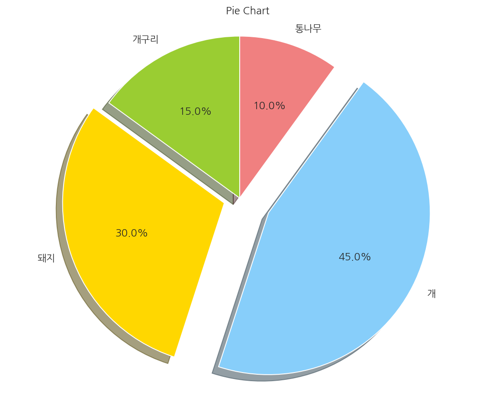
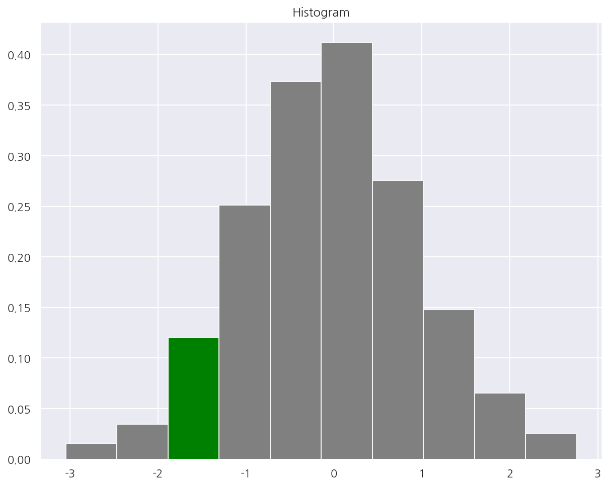
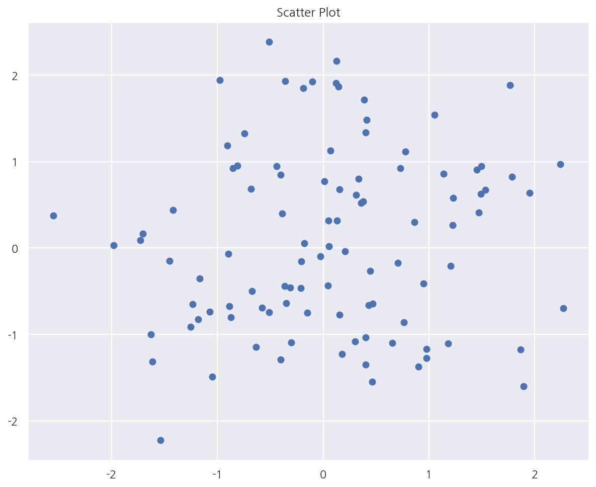
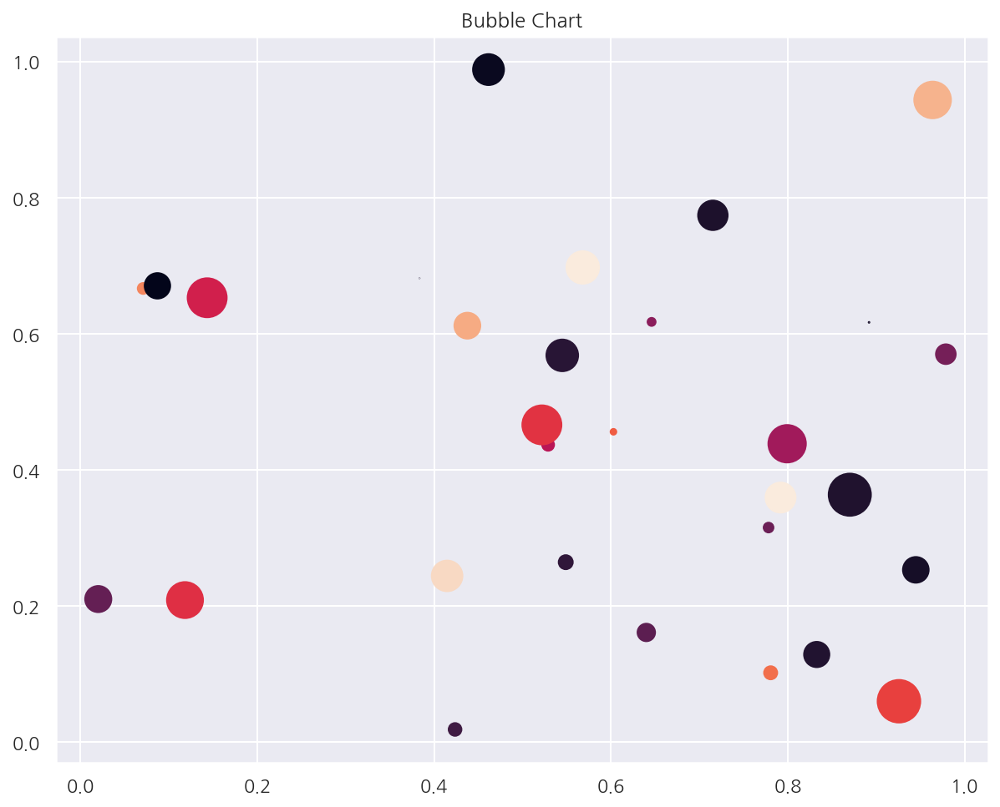
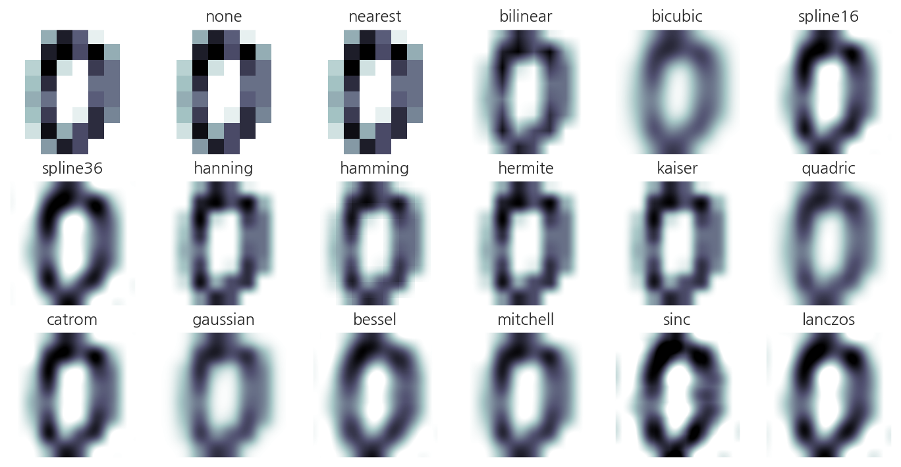
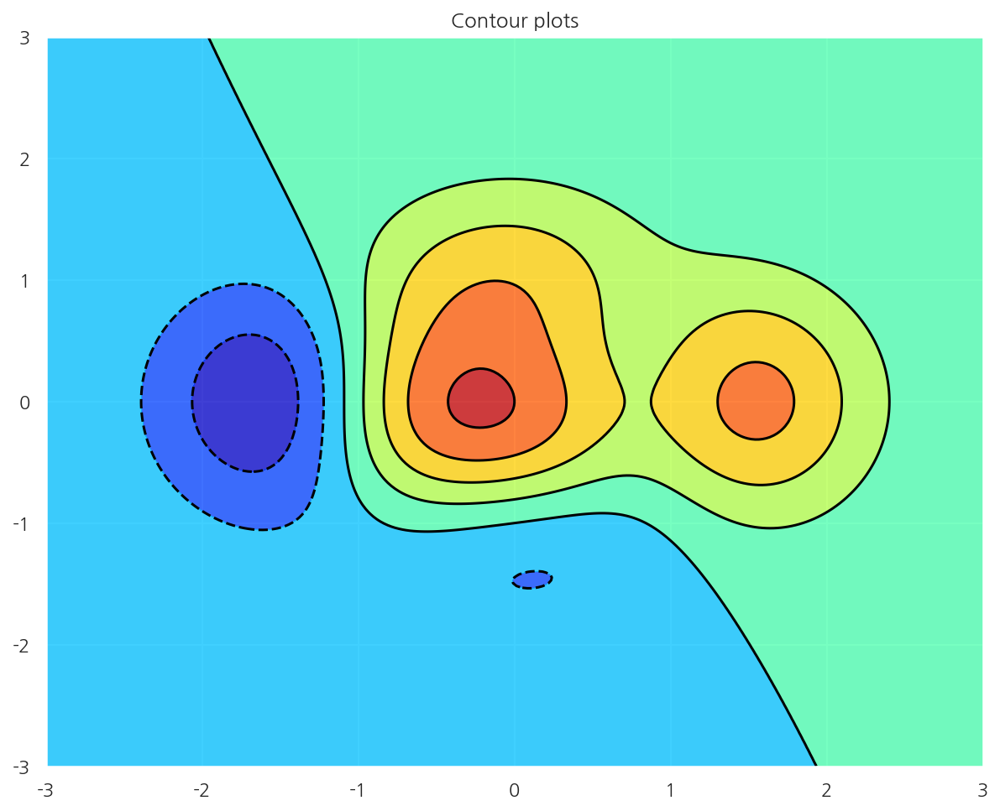
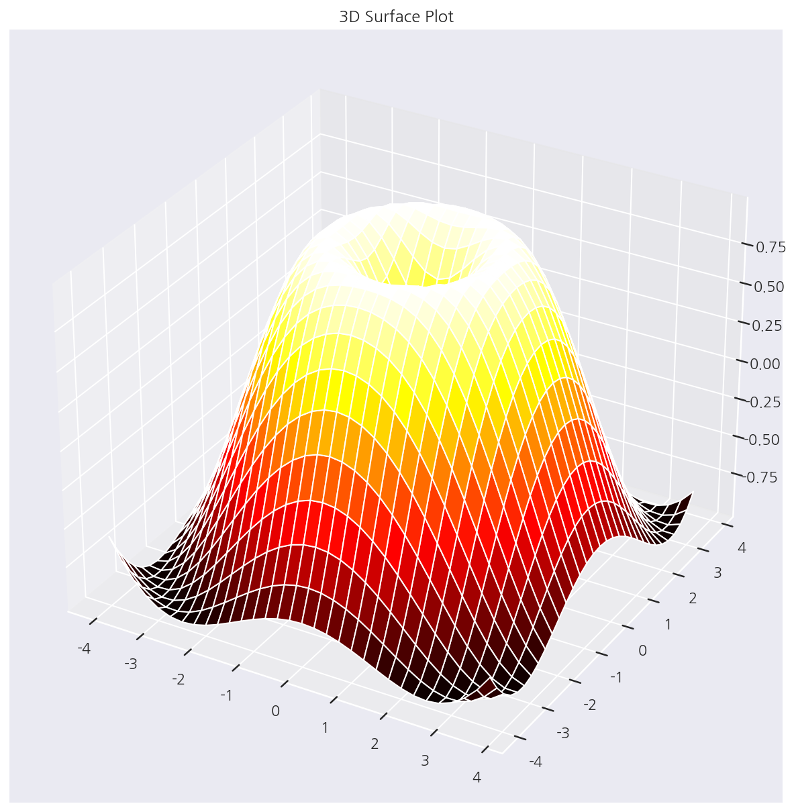

[데이터 사이언스 스쿨](https://datascienceschool.net/intro.html) 자료를 토대로 공부한 내용입니다.

실습과정에서 필요에 따라 내용의 누락 및 추가, 수정사항이 있습니다.

---


# Matplotlib의 여러가지 플롯

이 챕터에선 Matplotlib의 여러가지 플롯을 그려본다.

각 플롯마다 옵션이 매우 다양하므로 특별한 설명은 적지 않고 실행시켜서 잘 나오는지 위주로 확인하였다.


```python
import numpy as np
import matplotlib as mpl
import matplotlib.pyplot as plt
```


```python
import seaborn as sns
import warnings

%matplotlib inline
%config InlineBackend.figure_format = 'retina'

mpl.rc('font', family='NanumGothic') # 폰트 설정
mpl.rc('axes', unicode_minus=False) # 유니코드에서 음수 부호 설정

# 차트 스타일 설정
sns.set(font="NanumGothic", rc={"axes.unicode_minus":False}, style='darkgrid')
plt.rc("figure", figsize=(10,8))

warnings.filterwarnings("ignore") # 경고 무시
```

## 바 차트


```python
# x, y
y = [2, 3, 1]
x = np.arange(len(y))

# title
plt.title("Bar Chart")

# bar chart
plt.bar(x, y)

# ticks
xlabel = ['A', 'B', 'C']
plt.xticks(x, xlabel)
plt.yticks(sorted(y), ["소", "중", "대"])

# axis label
plt.xlabel("종류")
plt.ylabel("빈도 수")

plt.show()
```


    



```python
np.random.seed(0)

people = ['몽룡', '춘향', '방자', '향단']
y_pos = np.arange(len(people))
performance = 3 + 10 * np.random.rand(len(people)) # 빈도
error = np.random.rand(len(people)) # 오차

# title
plt.title("Barh Chart")

# barh chart
# alpha: 투명도, xerr/yerr: 오차막대
plt.barh(y_pos, performance, xerr=error, alpha=0.2)

# ticks
plt.yticks(y_pos, people)

# axis label
plt.xlabel('x 라벨')
plt.grid(True)

plt.show()
```


    

    


## 스템 플롯


```python
# stem plot
# bar chart와 비슷하지만 폭이 없음
x = np.linspace(0.1, 2 * np.pi, 10)
plt.title("Stem Plot")
plt.stem(x, np.cos(x), '-.')
plt.show()
```


    

    


## 파이 차트


```python
labels = ['개구리', '돼지', '개', '통나무']
sizes = [15, 30, 45, 10]
colors = ['yellowgreen', 'gold', 'lightskyblue', 'lightcoral']
explode = (0, 0.1, 0.2, 0)

# title
plt.title("Pie Chart")

# pie chart
plt.pie(sizes, explode=explode, labels=labels, colors=colors,
        autopct='%1.1f%%', shadow=True, startangle=90)

# pie chart 사용시 실행
plt.axis('equal')

plt.show()
```


    

    


## 히스토그램


```python
np.random.seed(0)
x = np.random.randn(1000)

plt.title("Histogram")

# 빈도(확률), 구간, n번째 막대
arrays, bins, patches = plt.hist(x, bins=10,
                                 color = "grey", # 막대 색상
                                 edgecolor = 'whitesmoke', # 막대사이 선
                                 density = True # 확률로 변경
                                )

# 3번째 막대 색상 수정
patches[2].set_facecolor('green')
plt.show()
```


    

    


## 스캐터 플롯


```python
# 산점도
np.random.seed(0)

X = np.random.normal(0, 1, 100)
Y = np.random.normal(0, 1, 100)

plt.title("Scatter Plot")
plt.scatter(X, Y)
plt.grid(True)
plt.show()
```


    

    


```python
# 버블 차트
N = 30
np.random.seed(0)

x = np.random.rand(N)
y1 = np.random.rand(N)
color_g = np.random.rand(N)
sizes = np.pi * (15 * np.random.rand(N))**2

plt.title("Bubble Chart")
plt.scatter(x, y1, c=color_g, s=sizes)
plt.show()
```


    

    


## Imshow


```python
# 2차원 데이터
from sklearn.datasets import load_digits
digits = load_digits()
X = digits.images[0]
X
```


    array([[ 0.,  0.,  5., 13.,  9.,  1.,  0.,  0.],
           [ 0.,  0., 13., 15., 10., 15.,  5.,  0.],
           [ 0.,  3., 15.,  2.,  0., 11.,  8.,  0.],
           [ 0.,  4., 12.,  0.,  0.,  8.,  8.,  0.],
           [ 0.,  5.,  8.,  0.,  0.,  9.,  8.,  0.],
           [ 0.,  4., 11.,  0.,  1., 12.,  7.,  0.],
           [ 0.,  2., 14.,  5., 10., 12.,  0.,  0.],
           [ 0.,  0.,  6., 13., 10.,  0.,  0.,  0.]])


```python
# 2차원 자료의 크기를 색깔로 표시
methods = [
    None, 'none', 'nearest', 'bilinear', 'bicubic', 'spline16',
    'spline36', 'hanning', 'hamming', 'hermite', 'kaiser', 'quadric',
    'catrom', 'gaussian', 'bessel', 'mitchell', 'sinc', 'lanczos'
]


fig, axes = plt.subplots(3, 6, figsize=(12, 6),
                         subplot_kw={'xticks': [], 'yticks': []})

for ax, interp_method in zip(axes.flat, methods):
    ax.imshow(X, cmap=plt.cm.bone_r, interpolation=interp_method)
    ax.set_title(interp_method)
plt.show()
```


    

    


## 컨투어 플롯


```python
# 등고선
# x,y에 따른 z 값
def f(x, y):
    return (1 - x / 2 + x ** 5 + y ** 3) * np.exp(-x ** 2 - y ** 2)

n = 256
x = np.linspace(-3, 3, n)
y = np.linspace(-3, 3, n)
XX, YY = np.meshgrid(x, y)
ZZ = f(XX, YY)

# 그리드 포인트 행렬로 넣어야 함
plt.title("Contour plots")
plt.contourf(XX, YY, ZZ, alpha=.75, cmap='jet')
plt.contour(XX, YY, ZZ, colors='black')
plt.show()
```


    

    


## 3D 서피스 플롯


```python
from mpl_toolkits.mplot3d import Axes3D
X = np.arange(-4, 4, 0.25)
Y = np.arange(-4, 4, 0.25)
XX, YY = np.meshgrid(X, Y)
RR = np.sqrt(XX**2 + YY**2)
ZZ = np.sin(RR)

fig = plt.figure()
ax = Axes3D(fig)
ax.set_title("3D Surface Plot")
ax.plot_surface(XX, YY, ZZ, rstride=1, cstride=1, cmap='hot')
plt.show()
```


    

    

