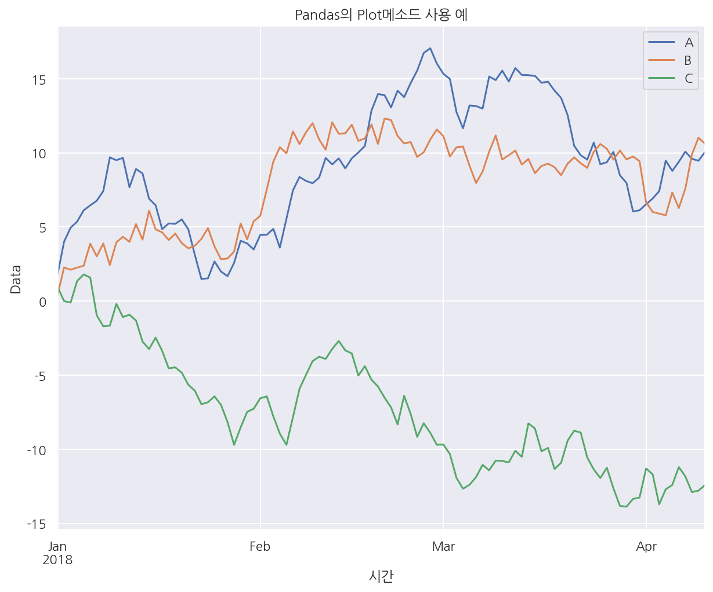
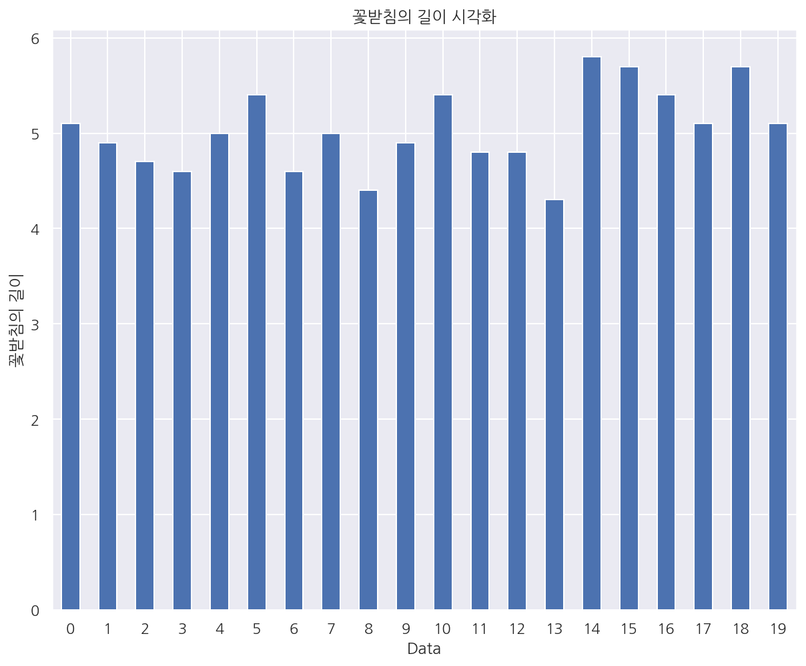
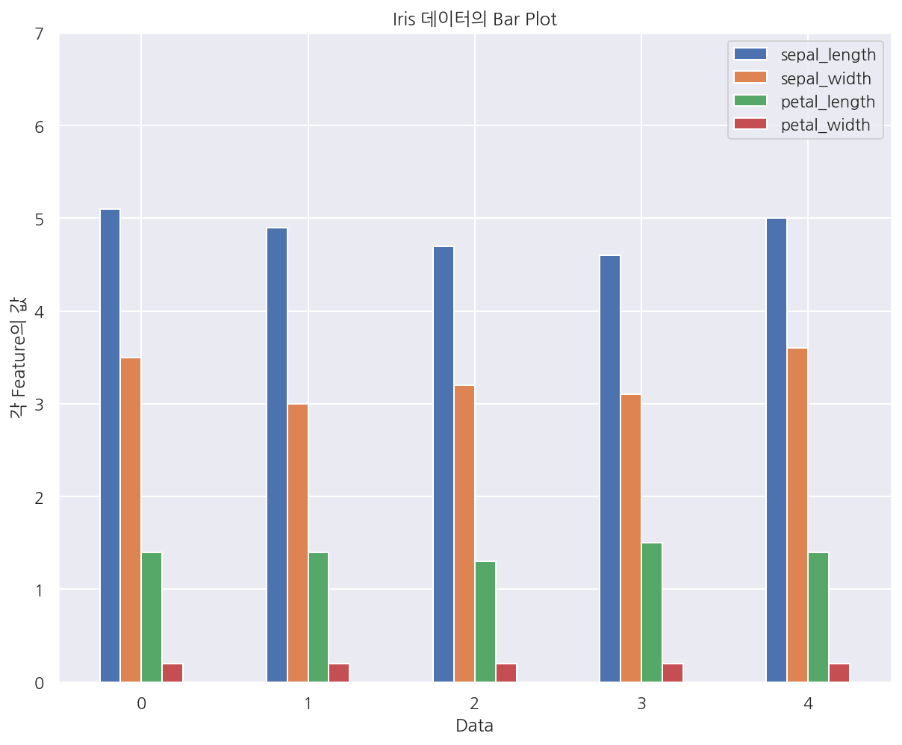
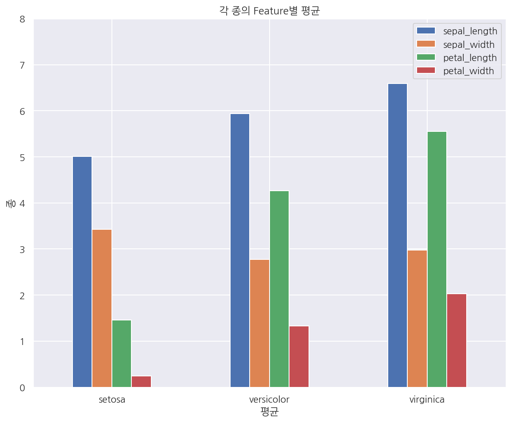
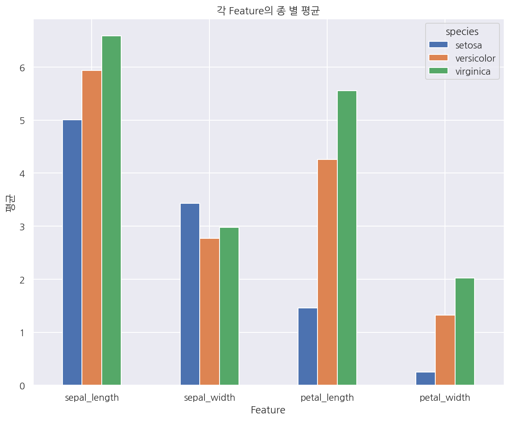
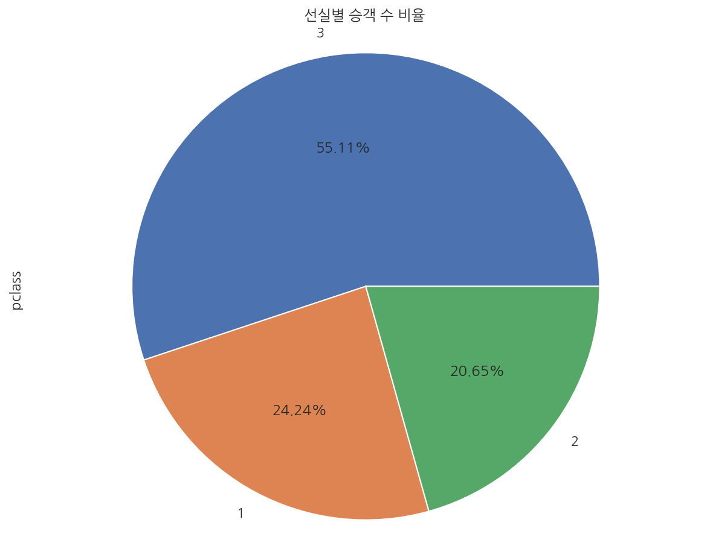
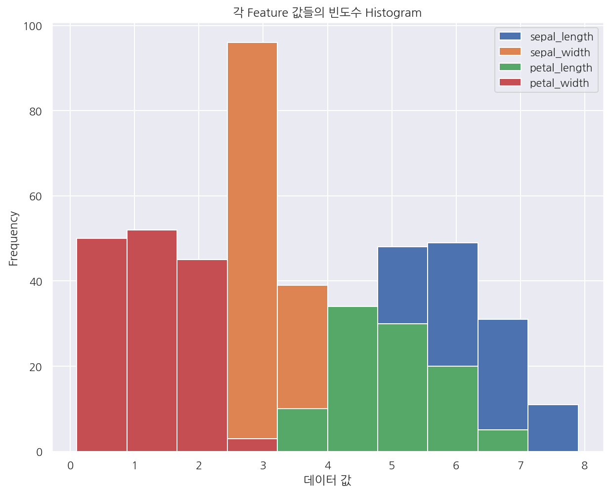
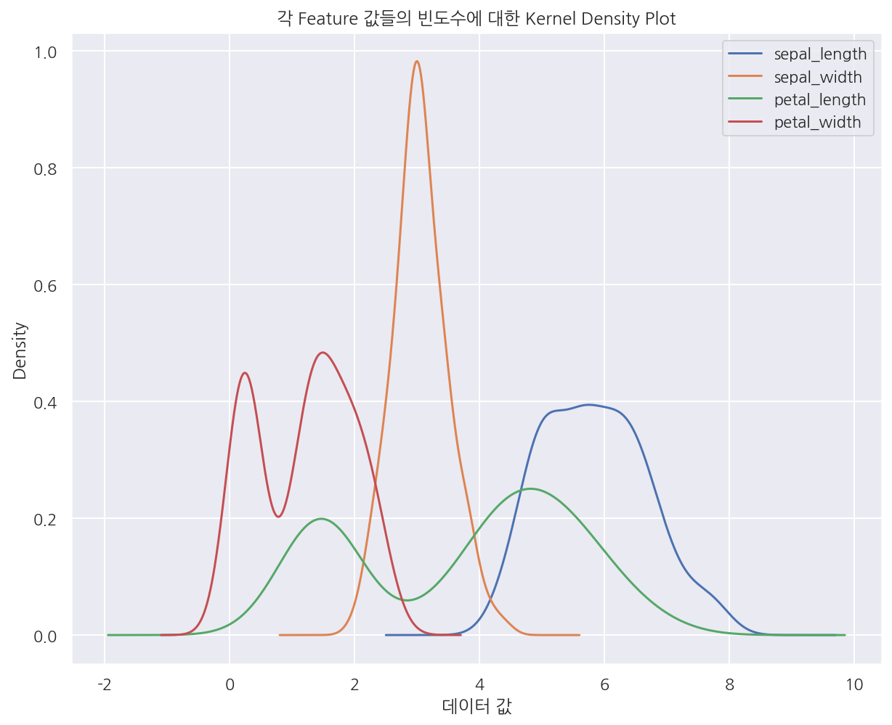
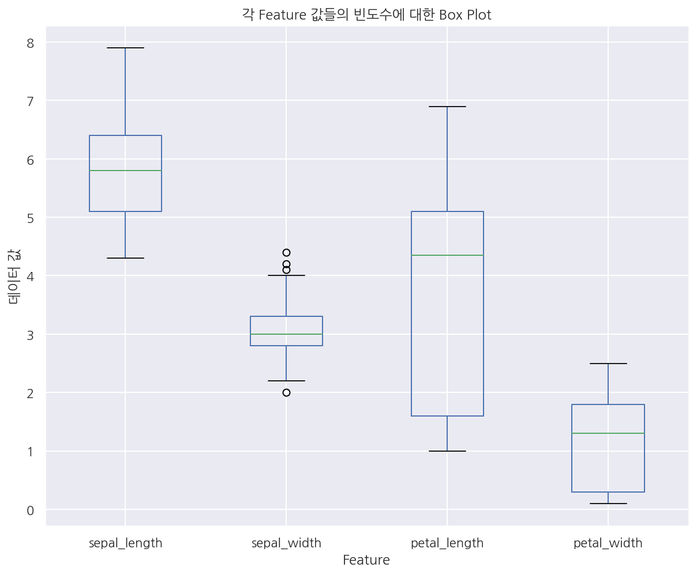
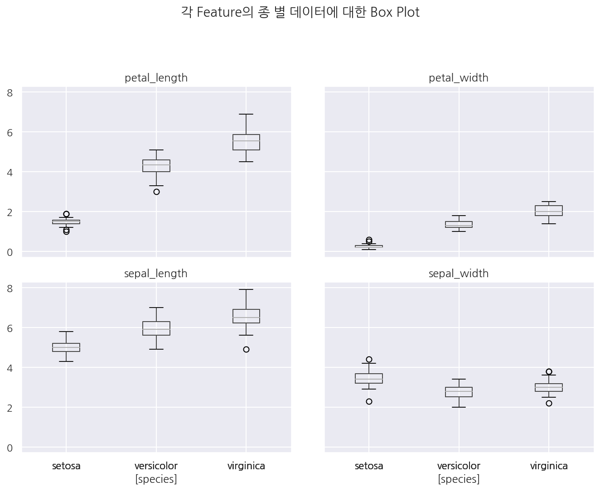

[데이터 사이언스 스쿨](https://datascienceschool.net/intro.html) 자료를 토대로 공부한 내용입니다.

실습과정에서 필요에 따라 내용의 누락 및 추가, 수정사항이 있습니다.

---


# Pandas의 시각화 기능

`pandas` 패키지는 자체적으로 그래프를 그릴 수 있는 함수(메소드)가 내장되어 있다.

이 챕터에선 `pandas` 패키지의 여러가지 그래프를 그려본다.


```python
import numpy as np
import pandas as pd
import matplotlib as mpl
import matplotlib.pyplot as plt
import seaborn as sns

import warnings
```


```python
%matplotlib inline
%config InlineBackend.figure_format = 'retina'

mpl.rc('font', family='NanumGothic') # 폰트 설정
mpl.rc('axes', unicode_minus=False) # 유니코드에서 음수 부호 설정

# 차트 스타일 설정
sns.set(font="NanumGothic", rc={"axes.unicode_minus":False}, style='darkgrid')
plt.rc("figure", figsize=(10,8))

warnings.filterwarnings("ignore")
```


```python
# 데이터 생성
np.random.seed(0)
df1 = pd.DataFrame(np.random.randn(100, 3),
                   index=pd.date_range('1/1/2018', periods=100),
                   columns=['A', 'B', 'C']).cumsum() # 누적합
df1.tail()
```


<div>
<style scoped>
    .dataframe tbody tr th:only-of-type {
        vertical-align: middle;
    }

    .dataframe tbody tr th {
        vertical-align: top;
    }

    .dataframe thead th {
        text-align: right;
    }
</style>
<table border="1" class="dataframe">
  <thead>
    <tr style="text-align: right;">
      <th></th>
      <th>A</th>
      <th>B</th>
      <th>C</th>
    </tr>
  </thead>
  <tbody>
    <tr>
      <th>2018-04-06</th>
      <td>9.396256</td>
      <td>6.282026</td>
      <td>-11.198087</td>
    </tr>
    <tr>
      <th>2018-04-07</th>
      <td>10.086074</td>
      <td>7.583872</td>
      <td>-11.826175</td>
    </tr>
    <tr>
      <th>2018-04-08</th>
      <td>9.605047</td>
      <td>9.887789</td>
      <td>-12.886190</td>
    </tr>
    <tr>
      <th>2018-04-09</th>
      <td>9.469097</td>
      <td>11.024680</td>
      <td>-12.788465</td>
    </tr>
    <tr>
      <th>2018-04-10</th>
      <td>10.052051</td>
      <td>10.625231</td>
      <td>-12.418409</td>
    </tr>
  </tbody>
</table>
</div>


```python
# pandas에 plot이 내장되어 있음
df1.plot()
plt.title("Pandas의 Plot메소드 사용 예")
plt.xlabel("시간")
plt.ylabel("Data")
plt.show()
```


    

    


```python
# 붓꽃 데이터
iris = sns.load_dataset("iris")

# 타이타닉호 데이터
titanic = sns.load_dataset("titanic")
```


```python
# pandas - barchart
s1 = iris.sepal_length[:20]
s1.plot(kind='bar', rot=0)

plt.title("꽃받침의 길이 시각화")
plt.xlabel("Data")
plt.ylabel("꽃받침의 길이")

plt.show()
```


    

    


```python
# kind 옵션이 아닌 속성으로 사용가능
df2 = iris[:5]
df2.plot.bar(rot=0)

plt.title("Iris 데이터의 Bar Plot")
plt.xlabel("Data")
plt.ylabel("각 Feature의 값")
plt.ylim(0, 7)
plt.show()
```


    

    


```python
df3 = iris.groupby(iris.species).mean()
df3
```


<div>
<style scoped>
    .dataframe tbody tr th:only-of-type {
        vertical-align: middle;
    }

    .dataframe tbody tr th {
        vertical-align: top;
    }

    .dataframe thead th {
        text-align: right;
    }
</style>
<table border="1" class="dataframe">
  <thead>
    <tr style="text-align: right;">
      <th></th>
      <th>sepal_length</th>
      <th>sepal_width</th>
      <th>petal_length</th>
      <th>petal_width</th>
    </tr>
    <tr>
      <th>species</th>
      <th></th>
      <th></th>
      <th></th>
      <th></th>
    </tr>
  </thead>
  <tbody>
    <tr>
      <th>setosa</th>
      <td>5.006</td>
      <td>3.428</td>
      <td>1.462</td>
      <td>0.246</td>
    </tr>
    <tr>
      <th>versicolor</th>
      <td>5.936</td>
      <td>2.770</td>
      <td>4.260</td>
      <td>1.326</td>
    </tr>
    <tr>
      <th>virginica</th>
      <td>6.588</td>
      <td>2.974</td>
      <td>5.552</td>
      <td>2.026</td>
    </tr>
  </tbody>
</table>
</div>


```python
# index를 기준으로 x축이 결정 되는 듯 하다.
df3.plot.bar(rot=0)
plt.title("각 종의 Feature별 평균")
plt.xlabel("평균")
plt.ylabel("종")
plt.ylim(0, 8)
plt.show()
```


    

    


```python
# 전치 연산
df3.T.plot.bar(rot=0)
plt.title("각 Feature의 종 별 평균")
plt.xlabel("Feature")
plt.ylabel("평균")
plt.show()
```


    

    


```python
# pie chart
df4 = titanic.pclass.value_counts()

df4.plot.pie(autopct='%.2f%%')

plt.title("선실별 승객 수 비율")
plt.axis('equal')

plt.show()
```


    

    


```python
# histogram
iris.plot.hist()

plt.title("각 Feature 값들의 빈도수 Histogram")
plt.xlabel("데이터 값")

plt.show()
```


    

    


```python
iris.plot.kde()
plt.title("각 Feature 값들의 빈도수에 대한 Kernel Density Plot")
plt.xlabel("데이터 값")
plt.show()
```


    

    


```python
# box
iris.plot.box()
plt.title("각 Feature 값들의 빈도수에 대한 Box Plot")
plt.xlabel("Feature")
plt.ylabel("데이터 값")
plt.show()
```


    

    


```python
# boxplot
iris.boxplot(by='species')
plt.tight_layout(pad=3, h_pad=1)
plt.suptitle("각 Feature의 종 별 데이터에 대한 Box Plot")
plt.show()
```


    

    

