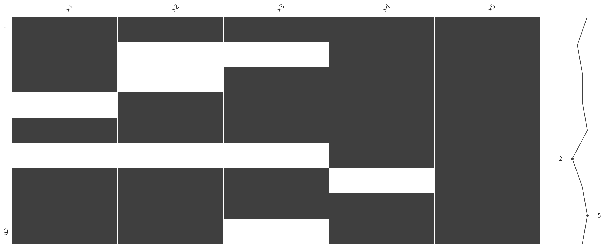
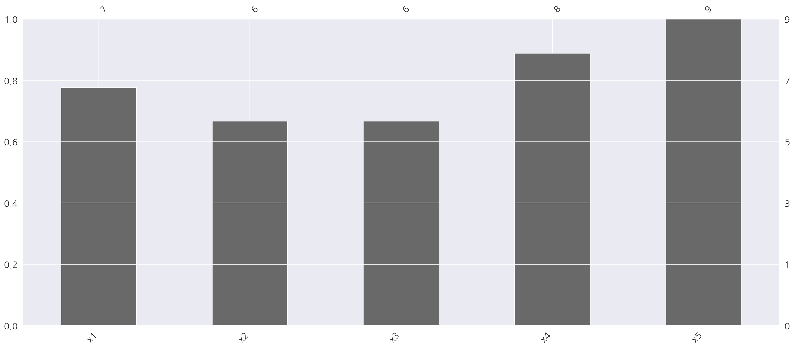
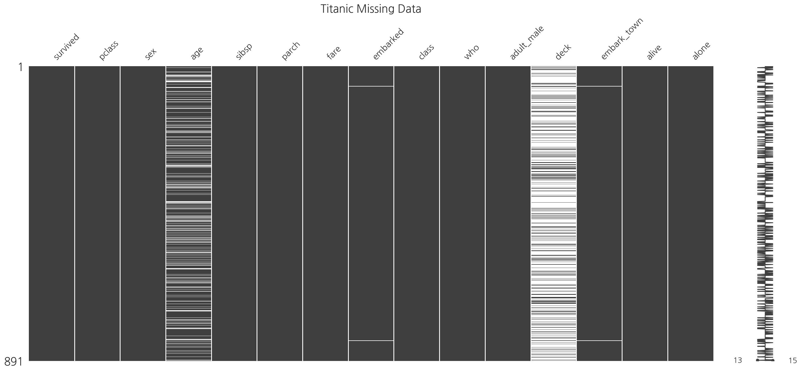
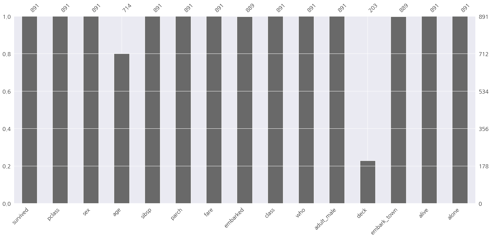
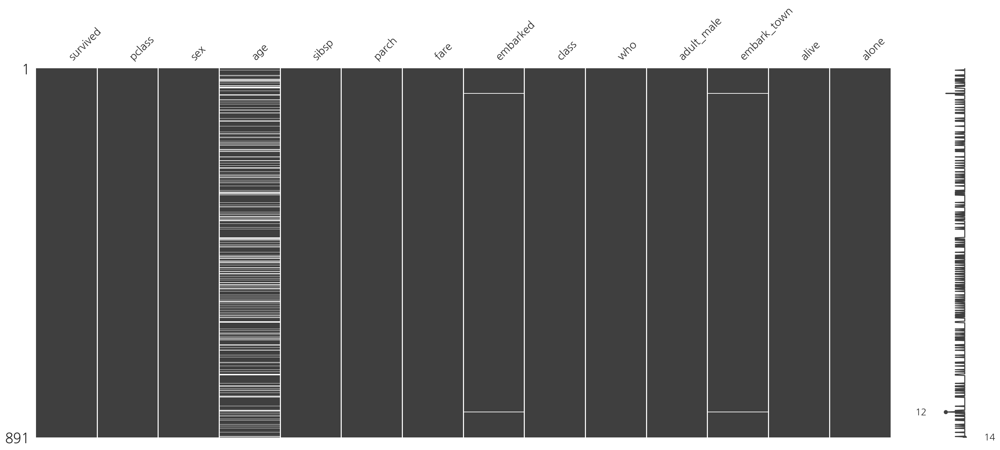
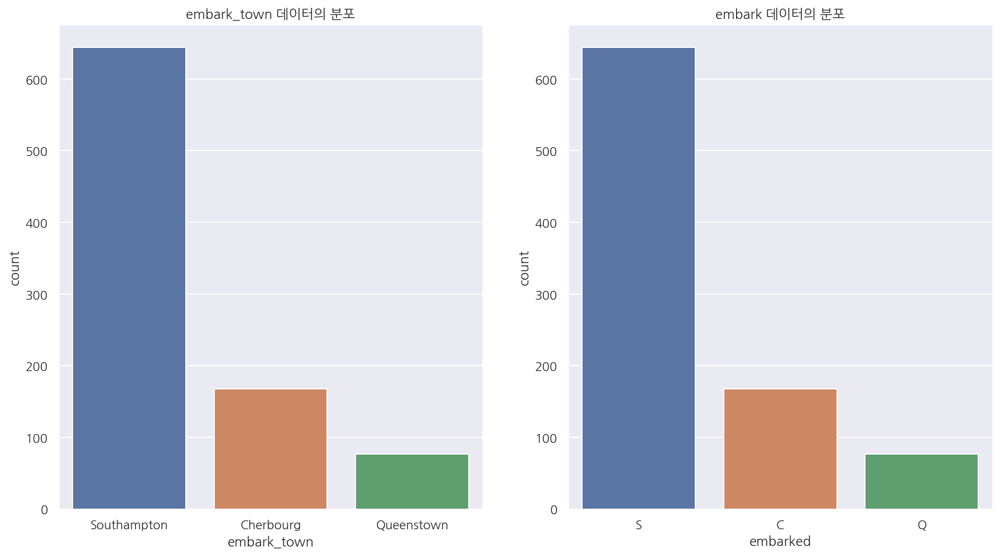
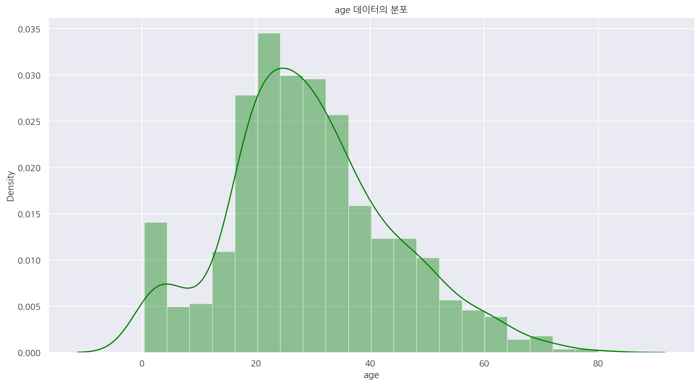
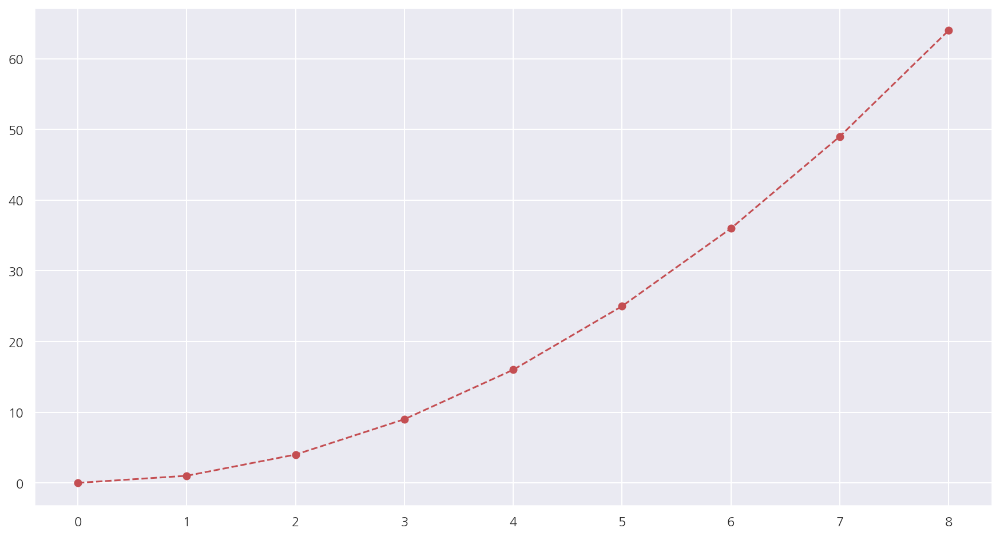

[데이터 사이언스 스쿨](https://datascienceschool.net/intro.html) 자료를 토대로 공부한 내용입니다.

실습과정에서 필요에 따라 내용의 누락 및 추가, 수정사항이 있습니다.

---


**기본 세팅**


```python
import numpy as np
import pandas as pd

import matplotlib as mpl
import matplotlib.pyplot as plt
import seaborn as sns

import warnings
```


```python
%matplotlib inline
%config InlineBackend.figure_format = 'retina'

mpl.rc('font', family='NanumGothic') # 폰트 설정
mpl.rc('axes', unicode_minus=False) # 유니코드에서 음수 부호 설정

# 차트 스타일 설정
sns.set(font="NanumGothic", rc={"axes.unicode_minus":False}, style='darkgrid')
plt.rc("figure", figsize=(10,8))

warnings.filterwarnings("ignore")
```

# 1. 데이터 전처리 기초

## 1.1 결측값 확인


```python
from io import StringIO

csv_data = StringIO("""
x1,x2,x3,x4,x5
1,0.1,"1",2019-01-01,A
2,,,2019-01-02,B
3,,"3",2019-01-03,C
,0.4,"4",2019-01-04,A
5,0.5,"5",2019-01-05,B
,,,2019-01-06,C
7,0.7,"7",,A
8,0.8,"8",2019-01-08,B
9,0.9,,2019-01-09,C
""")

df = pd.read_csv(csv_data, dtype={"x1": pd.Int64Dtype()}, parse_dates=[3])
df
```


<div>
<style scoped>
    .dataframe tbody tr th:only-of-type {
        vertical-align: middle;
    }

    .dataframe tbody tr th {
        vertical-align: top;
    }

    .dataframe thead th {
        text-align: right;
    }
</style>
<table border="1" class="dataframe">
  <thead>
    <tr style="text-align: right;">
      <th></th>
      <th>x1</th>
      <th>x2</th>
      <th>x3</th>
      <th>x4</th>
      <th>x5</th>
    </tr>
  </thead>
  <tbody>
    <tr>
      <th>0</th>
      <td>1</td>
      <td>0.1</td>
      <td>1.0</td>
      <td>2019-01-01</td>
      <td>A</td>
    </tr>
    <tr>
      <th>1</th>
      <td>2</td>
      <td>NaN</td>
      <td>NaN</td>
      <td>2019-01-02</td>
      <td>B</td>
    </tr>
    <tr>
      <th>2</th>
      <td>3</td>
      <td>NaN</td>
      <td>3.0</td>
      <td>2019-01-03</td>
      <td>C</td>
    </tr>
    <tr>
      <th>3</th>
      <td>&lt;NA&gt;</td>
      <td>0.4</td>
      <td>4.0</td>
      <td>2019-01-04</td>
      <td>A</td>
    </tr>
    <tr>
      <th>4</th>
      <td>5</td>
      <td>0.5</td>
      <td>5.0</td>
      <td>2019-01-05</td>
      <td>B</td>
    </tr>
    <tr>
      <th>5</th>
      <td>&lt;NA&gt;</td>
      <td>NaN</td>
      <td>NaN</td>
      <td>2019-01-06</td>
      <td>C</td>
    </tr>
    <tr>
      <th>6</th>
      <td>7</td>
      <td>0.7</td>
      <td>7.0</td>
      <td>NaT</td>
      <td>A</td>
    </tr>
    <tr>
      <th>7</th>
      <td>8</td>
      <td>0.8</td>
      <td>8.0</td>
      <td>2019-01-08</td>
      <td>B</td>
    </tr>
    <tr>
      <th>8</th>
      <td>9</td>
      <td>0.9</td>
      <td>NaN</td>
      <td>2019-01-09</td>
      <td>C</td>
    </tr>
  </tbody>
</table>
</div>


- 결측값이 있는 임시 데이터를 생성하였다.


- 실제 데이터를 불러올때도 정수형, 날짜형 등 자료형태를 명시하는 것이 중요하다.


- 날짜형은 자료형태를 지정하지 않으면 object로 불러와 dt 인자를 적용할 수 없다.


```python
df.info()
```

    <class 'pandas.core.frame.DataFrame'>
    RangeIndex: 9 entries, 0 to 8
    Data columns (total 5 columns):
     #   Column  Non-Null Count  Dtype         
    ---  ------  --------------  -----         
     0   x1      7 non-null      Int64         
     1   x2      6 non-null      float64       
     2   x3      6 non-null      float64       
     3   x4      8 non-null      datetime64[ns]
     4   x5      9 non-null      object        
    dtypes: Int64(1), datetime64[ns](1), float64(2), object(1)
    memory usage: 497.0+ bytes
    

- `info()`를 이용해서 데이터 프레임의 행, 열의 갯수, 결측값의 수, 자료형태 등을 확인 가능하다.


```python
# 참고용
df.select_dtypes(exclude=['datetime'])
```


<div>
<style scoped>
    .dataframe tbody tr th:only-of-type {
        vertical-align: middle;
    }

    .dataframe tbody tr th {
        vertical-align: top;
    }

    .dataframe thead th {
        text-align: right;
    }
</style>
<table border="1" class="dataframe">
  <thead>
    <tr style="text-align: right;">
      <th></th>
      <th>x1</th>
      <th>x2</th>
      <th>x3</th>
      <th>x5</th>
    </tr>
  </thead>
  <tbody>
    <tr>
      <th>0</th>
      <td>1</td>
      <td>0.1</td>
      <td>1.0</td>
      <td>A</td>
    </tr>
    <tr>
      <th>1</th>
      <td>2</td>
      <td>NaN</td>
      <td>NaN</td>
      <td>B</td>
    </tr>
    <tr>
      <th>2</th>
      <td>3</td>
      <td>NaN</td>
      <td>3.0</td>
      <td>C</td>
    </tr>
    <tr>
      <th>3</th>
      <td>&lt;NA&gt;</td>
      <td>0.4</td>
      <td>4.0</td>
      <td>A</td>
    </tr>
    <tr>
      <th>4</th>
      <td>5</td>
      <td>0.5</td>
      <td>5.0</td>
      <td>B</td>
    </tr>
    <tr>
      <th>5</th>
      <td>&lt;NA&gt;</td>
      <td>NaN</td>
      <td>NaN</td>
      <td>C</td>
    </tr>
    <tr>
      <th>6</th>
      <td>7</td>
      <td>0.7</td>
      <td>7.0</td>
      <td>A</td>
    </tr>
    <tr>
      <th>7</th>
      <td>8</td>
      <td>0.8</td>
      <td>8.0</td>
      <td>B</td>
    </tr>
    <tr>
      <th>8</th>
      <td>9</td>
      <td>0.9</td>
      <td>NaN</td>
      <td>C</td>
    </tr>
  </tbody>
</table>
</div>


- 위 코드는 참고용으로 적어두었다.


- `select_dtypes()`에 exclude 옵션에 특정 자료형을 넣으면 해당 자료형을 제외한 열을 추출한다.


- 반대로 exclude옵션 대신 include 옵션을 사용하면 지정한 자료형의 열만 추출한다.


```python
df.isnull().sum()
```


    x1    2
    x2    3
    x3    3
    x4    1
    x5    0
    dtype: int64


- `isnull().sum()` 을 이용해 각 열마다 결측값의 개수를 확인 가능하다.


```python
import missingno as msno

msno.matrix(df)
plt.show()
```


    

    


- `missingno` 데이터 프레임에서 결측 데이터를 찾는 기능을 제공한다. 


- 단, 이 패키지를 사용하려면 데이터프레임에 결측 데이터가 NaN으로 저장되어 있어야한다.


- `msno.matrix()` 를 이용해 결측 데이터 시각화가 가능하다.


- 결측 데이터는 흰색, 결측이 아니면 검은색으로 나타난다.


```python
msno.bar(df)
plt.show()
```


    

    


- `msno.bar()` 를 이용해 결측이 아닌 데이터의 갯수 시각화가 가능하다.

## 1.2 결측값 처리

### 1.2.1 결측값 삭제


```python
df.dropna()
```


<div>
<style scoped>
    .dataframe tbody tr th:only-of-type {
        vertical-align: middle;
    }

    .dataframe tbody tr th {
        vertical-align: top;
    }

    .dataframe thead th {
        text-align: right;
    }
</style>
<table border="1" class="dataframe">
  <thead>
    <tr style="text-align: right;">
      <th></th>
      <th>x1</th>
      <th>x2</th>
      <th>x3</th>
      <th>x4</th>
      <th>x5</th>
    </tr>
  </thead>
  <tbody>
    <tr>
      <th>0</th>
      <td>1</td>
      <td>0.1</td>
      <td>1.0</td>
      <td>2019-01-01</td>
      <td>A</td>
    </tr>
    <tr>
      <th>4</th>
      <td>5</td>
      <td>0.5</td>
      <td>5.0</td>
      <td>2019-01-05</td>
      <td>B</td>
    </tr>
    <tr>
      <th>7</th>
      <td>8</td>
      <td>0.8</td>
      <td>8.0</td>
      <td>2019-01-08</td>
      <td>B</td>
    </tr>
  </tbody>
</table>
</div>


- `dropna()` 를 이용해 결측값이 있는 행을 제거 가능하다.


```python
df.dropna(axis=1)
```


<div>
<style scoped>
    .dataframe tbody tr th:only-of-type {
        vertical-align: middle;
    }

    .dataframe tbody tr th {
        vertical-align: top;
    }

    .dataframe thead th {
        text-align: right;
    }
</style>
<table border="1" class="dataframe">
  <thead>
    <tr style="text-align: right;">
      <th></th>
      <th>x5</th>
    </tr>
  </thead>
  <tbody>
    <tr>
      <th>0</th>
      <td>A</td>
    </tr>
    <tr>
      <th>1</th>
      <td>B</td>
    </tr>
    <tr>
      <th>2</th>
      <td>C</td>
    </tr>
    <tr>
      <th>3</th>
      <td>A</td>
    </tr>
    <tr>
      <th>4</th>
      <td>B</td>
    </tr>
    <tr>
      <th>5</th>
      <td>C</td>
    </tr>
    <tr>
      <th>6</th>
      <td>A</td>
    </tr>
    <tr>
      <th>7</th>
      <td>B</td>
    </tr>
    <tr>
      <th>8</th>
      <td>C</td>
    </tr>
  </tbody>
</table>
</div>


- axis=1 옵션을 이용해 결측값이 있는 열을 제거 가능하다.


```python
df.dropna(thresh=7, axis=1)
```


<div>
<style scoped>
    .dataframe tbody tr th:only-of-type {
        vertical-align: middle;
    }

    .dataframe tbody tr th {
        vertical-align: top;
    }

    .dataframe thead th {
        text-align: right;
    }
</style>
<table border="1" class="dataframe">
  <thead>
    <tr style="text-align: right;">
      <th></th>
      <th>x1</th>
      <th>x4</th>
      <th>x5</th>
    </tr>
  </thead>
  <tbody>
    <tr>
      <th>0</th>
      <td>1</td>
      <td>2019-01-01</td>
      <td>A</td>
    </tr>
    <tr>
      <th>1</th>
      <td>2</td>
      <td>2019-01-02</td>
      <td>B</td>
    </tr>
    <tr>
      <th>2</th>
      <td>3</td>
      <td>2019-01-03</td>
      <td>C</td>
    </tr>
    <tr>
      <th>3</th>
      <td>&lt;NA&gt;</td>
      <td>2019-01-04</td>
      <td>A</td>
    </tr>
    <tr>
      <th>4</th>
      <td>5</td>
      <td>2019-01-05</td>
      <td>B</td>
    </tr>
    <tr>
      <th>5</th>
      <td>&lt;NA&gt;</td>
      <td>2019-01-06</td>
      <td>C</td>
    </tr>
    <tr>
      <th>6</th>
      <td>7</td>
      <td>NaT</td>
      <td>A</td>
    </tr>
    <tr>
      <th>7</th>
      <td>8</td>
      <td>2019-01-08</td>
      <td>B</td>
    </tr>
    <tr>
      <th>8</th>
      <td>9</td>
      <td>2019-01-09</td>
      <td>C</td>
    </tr>
  </tbody>
</table>
</div>


- thresh=n 과 axis 옵션을 이용해 n개 이상 비결측 데이터가 있는 행 또는 열만 남길수 있다.

### 1.2.2 결측값 대체


```python
# 평균값, 중앙값, 최빈값, 상수값으로 대체
df.fillna({"x1": df.x1.mean(), 
           "x2": df.x2.median(), 
           "x3": df.x3.value_counts().sort_values(ascending=False).index[0],
           "x4": pd.to_datetime("2019/01/07", format='%Y-%m-%d')}
         )


```


<div>
<style scoped>
    .dataframe tbody tr th:only-of-type {
        vertical-align: middle;
    }

    .dataframe tbody tr th {
        vertical-align: top;
    }

    .dataframe thead th {
        text-align: right;
    }
</style>
<table border="1" class="dataframe">
  <thead>
    <tr style="text-align: right;">
      <th></th>
      <th>x1</th>
      <th>x2</th>
      <th>x3</th>
      <th>x4</th>
      <th>x5</th>
    </tr>
  </thead>
  <tbody>
    <tr>
      <th>0</th>
      <td>1</td>
      <td>0.1</td>
      <td>1.0</td>
      <td>2019-01-01</td>
      <td>A</td>
    </tr>
    <tr>
      <th>1</th>
      <td>2</td>
      <td>0.6</td>
      <td>1.0</td>
      <td>2019-01-02</td>
      <td>B</td>
    </tr>
    <tr>
      <th>2</th>
      <td>3</td>
      <td>0.6</td>
      <td>3.0</td>
      <td>2019-01-03</td>
      <td>C</td>
    </tr>
    <tr>
      <th>3</th>
      <td>5</td>
      <td>0.4</td>
      <td>4.0</td>
      <td>2019-01-04</td>
      <td>A</td>
    </tr>
    <tr>
      <th>4</th>
      <td>5</td>
      <td>0.5</td>
      <td>5.0</td>
      <td>2019-01-05</td>
      <td>B</td>
    </tr>
    <tr>
      <th>5</th>
      <td>5</td>
      <td>0.6</td>
      <td>1.0</td>
      <td>2019-01-06</td>
      <td>C</td>
    </tr>
    <tr>
      <th>6</th>
      <td>7</td>
      <td>0.7</td>
      <td>7.0</td>
      <td>2019-01-07</td>
      <td>A</td>
    </tr>
    <tr>
      <th>7</th>
      <td>8</td>
      <td>0.8</td>
      <td>8.0</td>
      <td>2019-01-08</td>
      <td>B</td>
    </tr>
    <tr>
      <th>8</th>
      <td>9</td>
      <td>0.9</td>
      <td>1.0</td>
      <td>2019-01-09</td>
      <td>C</td>
    </tr>
  </tbody>
</table>
</div>


- `fillna()` 를 이용해서 각 변수별로 대체값을 지정 가능하다.


- 여기선 x1, x2, x3, x4를 각각 평균값, 중앙값, 최빈값, 상수값으로 대체하였다.


```python
from sklearn.impute import SimpleImputer

# 최빈값으로 수정
imp = SimpleImputer(missing_values = np.nan, strategy = "most_frequent")

col = ["x1","x2","x3"]
df[col] = imp.fit_transform(df[col])
df
```


<div>
<style scoped>
    .dataframe tbody tr th:only-of-type {
        vertical-align: middle;
    }

    .dataframe tbody tr th {
        vertical-align: top;
    }

    .dataframe thead th {
        text-align: right;
    }
</style>
<table border="1" class="dataframe">
  <thead>
    <tr style="text-align: right;">
      <th></th>
      <th>x1</th>
      <th>x2</th>
      <th>x3</th>
      <th>x4</th>
      <th>x5</th>
    </tr>
  </thead>
  <tbody>
    <tr>
      <th>0</th>
      <td>1.0</td>
      <td>0.1</td>
      <td>1.0</td>
      <td>2019-01-01</td>
      <td>A</td>
    </tr>
    <tr>
      <th>1</th>
      <td>2.0</td>
      <td>0.1</td>
      <td>1.0</td>
      <td>2019-01-02</td>
      <td>B</td>
    </tr>
    <tr>
      <th>2</th>
      <td>3.0</td>
      <td>0.1</td>
      <td>3.0</td>
      <td>2019-01-03</td>
      <td>C</td>
    </tr>
    <tr>
      <th>3</th>
      <td>1.0</td>
      <td>0.4</td>
      <td>4.0</td>
      <td>2019-01-04</td>
      <td>A</td>
    </tr>
    <tr>
      <th>4</th>
      <td>5.0</td>
      <td>0.5</td>
      <td>5.0</td>
      <td>2019-01-05</td>
      <td>B</td>
    </tr>
    <tr>
      <th>5</th>
      <td>1.0</td>
      <td>0.1</td>
      <td>1.0</td>
      <td>2019-01-06</td>
      <td>C</td>
    </tr>
    <tr>
      <th>6</th>
      <td>7.0</td>
      <td>0.7</td>
      <td>7.0</td>
      <td>NaT</td>
      <td>A</td>
    </tr>
    <tr>
      <th>7</th>
      <td>8.0</td>
      <td>0.8</td>
      <td>8.0</td>
      <td>2019-01-08</td>
      <td>B</td>
    </tr>
    <tr>
      <th>8</th>
      <td>9.0</td>
      <td>0.9</td>
      <td>1.0</td>
      <td>2019-01-09</td>
      <td>C</td>
    </tr>
  </tbody>
</table>
</div>


- `sklearn` 패키지의 `SimpleImputer()` 를 사용하여 결측값에 대체가 가능하다.


- strategy 옵션으로 평균, 중앙값, 최빈값, 상수값 등을 사용가능하다.


```python
SimpleImputer(strategy = 'mean')                   # 평균
SimpleImputer(strategy = 'median')                 # 중앙값
SimpleImputer(strategy = 'most_frequent')          # 최빈값
SimpleImputer(strategy = 'constant', fill_value=1) # 상수값
```


- 다만 날짜형에 대해서는 대체가 안되고 계속 에러가 발생했는데 검색을 해도 못찾겠어서 우선 비워두었다..

## 1.3 타이타닉 예제


```python
# titanic 데이터 불러오기
titanic = sns.load_dataset("titanic")
titanic.tail()
```


<div>
<style scoped>
    .dataframe tbody tr th:only-of-type {
        vertical-align: middle;
    }

    .dataframe tbody tr th {
        vertical-align: top;
    }

    .dataframe thead th {
        text-align: right;
    }
</style>
<table border="1" class="dataframe">
  <thead>
    <tr style="text-align: right;">
      <th></th>
      <th>survived</th>
      <th>pclass</th>
      <th>sex</th>
      <th>age</th>
      <th>sibsp</th>
      <th>parch</th>
      <th>fare</th>
      <th>embarked</th>
      <th>class</th>
      <th>who</th>
      <th>adult_male</th>
      <th>deck</th>
      <th>embark_town</th>
      <th>alive</th>
      <th>alone</th>
    </tr>
  </thead>
  <tbody>
    <tr>
      <th>886</th>
      <td>0</td>
      <td>2</td>
      <td>male</td>
      <td>27.0</td>
      <td>0</td>
      <td>0</td>
      <td>13.00</td>
      <td>S</td>
      <td>Second</td>
      <td>man</td>
      <td>True</td>
      <td>NaN</td>
      <td>Southampton</td>
      <td>no</td>
      <td>True</td>
    </tr>
    <tr>
      <th>887</th>
      <td>1</td>
      <td>1</td>
      <td>female</td>
      <td>19.0</td>
      <td>0</td>
      <td>0</td>
      <td>30.00</td>
      <td>S</td>
      <td>First</td>
      <td>woman</td>
      <td>False</td>
      <td>B</td>
      <td>Southampton</td>
      <td>yes</td>
      <td>True</td>
    </tr>
    <tr>
      <th>888</th>
      <td>0</td>
      <td>3</td>
      <td>female</td>
      <td>NaN</td>
      <td>1</td>
      <td>2</td>
      <td>23.45</td>
      <td>S</td>
      <td>Third</td>
      <td>woman</td>
      <td>False</td>
      <td>NaN</td>
      <td>Southampton</td>
      <td>no</td>
      <td>False</td>
    </tr>
    <tr>
      <th>889</th>
      <td>1</td>
      <td>1</td>
      <td>male</td>
      <td>26.0</td>
      <td>0</td>
      <td>0</td>
      <td>30.00</td>
      <td>C</td>
      <td>First</td>
      <td>man</td>
      <td>True</td>
      <td>C</td>
      <td>Cherbourg</td>
      <td>yes</td>
      <td>True</td>
    </tr>
    <tr>
      <th>890</th>
      <td>0</td>
      <td>3</td>
      <td>male</td>
      <td>32.0</td>
      <td>0</td>
      <td>0</td>
      <td>7.75</td>
      <td>Q</td>
      <td>Third</td>
      <td>man</td>
      <td>True</td>
      <td>NaN</td>
      <td>Queenstown</td>
      <td>no</td>
      <td>True</td>
    </tr>
  </tbody>
</table>
</div>


**결측값 확인**


```python
titanic.isnull().sum()
```


    survived         0
    pclass           0
    sex              0
    age            177
    sibsp            0
    parch            0
    fare             0
    embarked         2
    class            0
    who              0
    adult_male       0
    deck           688
    embark_town      2
    alive            0
    alone            0
    dtype: int64


```python
msno.matrix(titanic)
plt.title("Titanic Missing Data", fontsize = 20)
plt.show()
```


    

    


```python
msno.bar(titanic)
plt.show()
```


    

    


- titanic 데이터의 경우 age, embarked, deck, embarked_town에 결측값이 존재함을 알 수 있다.

**결측값 삭제**


```python
titanic = titanic.dropna(thresh=int(len(titanic) * 0.5), axis=1)
msno.matrix(titanic)
plt.show()
```


    

    


- titanic 데이터 각 열의 비 결측값이 절 반이상인 경우만 남겨 deck을 삭제하였다.

**결측값 대체**


```python
fig, axs = plt.subplots(1,2, figsize=(15,8))

sns.countplot(titanic.embark_town, ax = axs[0])
sns.countplot(titanic.embarked, ax = axs[1])

axs[0].set_title("embark_town 데이터의 분포")
axs[1].set_title("embark 데이터의 분포")

plt.show()
```


    

    


- embark_town, embark의 데이터 분포를 확인하였고 해당 데이터들의 최빈값으로 결측값을 대체 할 것이다.


```python
imp_mode = SimpleImputer(strategy="most_frequent")
titanic["embark_town"] = imp_mode.fit_transform(titanic[["embark_town"]])
titanic["embarked"] = imp_mode.fit_transform(titanic[["embarked"]])

msno.matrix(titanic)
plt.show()
```


    

    


- embark_town, embark의 결측값이 사라진 것을 확인 할 수 있다.


```python
plt.figure(figsize=(15,8))

sns.distplot(titanic.age, kde=True, color="green")
plt.title("age 데이터의 분포")
plt.show()
```


    

    


- age의 분포를 확인하였을 때 비대칭 형태로 나옴을 확인 할 수 있다.


- 따라서 평균값보다는 중앙값으로 결측을 수정한다.


```python
imp_median = SimpleImputer(strategy="median")
titanic["age"] = imp_median.fit_transform(titanic[["age"]])

msno.matrix(titanic)
plt.show()
```


    

    


- 모든 결측값이 사라진 것을 확인 할 수 있다.

# 2. 데이터 선택 및 스케일링

## 2.1 patsy 패키지

### 2.1.1 데이터 선택


```python
from patsy import demo_data

df = pd.DataFrame(demo_data("x1", "x2", "x3", "x4", "x5"))
df
```


<div>
<style scoped>
    .dataframe tbody tr th:only-of-type {
        vertical-align: middle;
    }

    .dataframe tbody tr th {
        vertical-align: top;
    }

    .dataframe thead th {
        text-align: right;
    }
</style>
<table border="1" class="dataframe">
  <thead>
    <tr style="text-align: right;">
      <th></th>
      <th>x1</th>
      <th>x2</th>
      <th>x3</th>
      <th>x4</th>
      <th>x5</th>
    </tr>
  </thead>
  <tbody>
    <tr>
      <th>0</th>
      <td>1.764052</td>
      <td>-0.977278</td>
      <td>0.144044</td>
      <td>0.333674</td>
      <td>-2.552990</td>
    </tr>
    <tr>
      <th>1</th>
      <td>0.400157</td>
      <td>0.950088</td>
      <td>1.454274</td>
      <td>1.494079</td>
      <td>0.653619</td>
    </tr>
    <tr>
      <th>2</th>
      <td>0.978738</td>
      <td>-0.151357</td>
      <td>0.761038</td>
      <td>-0.205158</td>
      <td>0.864436</td>
    </tr>
    <tr>
      <th>3</th>
      <td>2.240893</td>
      <td>-0.103219</td>
      <td>0.121675</td>
      <td>0.313068</td>
      <td>-0.742165</td>
    </tr>
    <tr>
      <th>4</th>
      <td>1.867558</td>
      <td>0.410599</td>
      <td>0.443863</td>
      <td>-0.854096</td>
      <td>2.269755</td>
    </tr>
  </tbody>
</table>
</div>


- `patsy` 패키지의 `demo_data()` 를 사용하여 임의의 실수 데이터를 생성가능하다.


```python
from patsy import dmatrix

dmatrix("x1 + x2 + x3 + 0", data = df)
```


    DesignMatrix with shape (5, 3)
           x1        x2       x3
      1.76405  -0.97728  0.14404
      0.40016   0.95009  1.45427
      0.97874  -0.15136  0.76104
      2.24089  -0.10322  0.12168
      1.86756   0.41060  0.44386
      Terms:
        'x1' (column 0)
        'x2' (column 1)
        'x3' (column 2)


- `patsy` 패키지의 `dmatrix(formula, data)` 를 이용하여 formula에서 지정한대로 data를 변환해서 출력할 수 있다.


- 전체 데이터에서 x1, x2, x3를 추출하였다.


```python
dmatrix("x1 + x2 + x3", data = df)
```


    DesignMatrix with shape (5, 4)
      Intercept       x1        x2       x3
              1  1.76405  -0.97728  0.14404
              1  0.40016   0.95009  1.45427
              1  0.97874  -0.15136  0.76104
              1  2.24089  -0.10322  0.12168
              1  1.86756   0.41060  0.44386
      Terms:
        'Intercept' (column 0)
        'x1' (column 1)
        'x2' (column 2)
        'x3' (column 3)


- +0 (혹은 -1) 옵션이 없으면 Intercept라는 상수열이 추가된다.


```python
# numpy 함수
# dmatrix("x1 + np.log(np.abs(x2))", data = df)

# 사용자 정의 함수
def ten_times(x):
    return 10 * x

dmatrix("ten_times(x1)", data = df)
```


    DesignMatrix with shape (5, 2)
      Intercept  ten_times(x1)
              1       17.64052
              1        4.00157
              1        9.78738
              1       22.40893
              1       18.67558
      Terms:
        'Intercept' (column 0)
        'ten_times(x1)' (column 1)


- 넘파이 함수나 사용자 정의 함수 등도 사용가능하다.


```python
# 상호작용항
# dmatrix("x1 + x2 + x1:x2 + 0", data = df)
dmatrix("x1 * x2 + 0", data = df)
```


    DesignMatrix with shape (5, 3)
           x1        x2     x1:x2
      1.76405  -0.97728  -1.72397
      0.40016   0.95009   0.38018
      0.97874  -0.15136  -0.14814
      2.24089  -0.10322  -0.23130
      1.86756   0.41060   0.76682
      Terms:
        'x1' (column 0)
        'x2' (column 1)
        'x1:x2' (column 2)


- `:` 또는 `*`을 사용하여 두 변수의 곱으로 나타나는 상호작용항을 출력할 수 있다.


```python
dmatrix("x1 + x2 + I(x1 + x2) + 0", data = df)
```


    DesignMatrix with shape (5, 3)
           x1        x2  I(x1 + x2)
      1.76405  -0.97728     0.78677
      0.40016   0.95009     1.35025
      0.97874  -0.15136     0.82738
      2.24089  -0.10322     2.13767
      1.86756   0.41060     2.27816
      Terms:
        'x1' (column 0)
        'x2' (column 1)
        'I(x1 + x2)' (column 2)


- 곱을 제외한 변수의 연산은 `I()` 안에 기입하여 출력 가능하다.

### 2.1.2 데이터 스케일링

데이터 스케일링은 모든 피처(변수)들의 단위(범위 혹은 분포)를 똑같이 만들어 주는 작업이다.

데이터 스케일링은 선형 회귀 분석에서 조건수를 낮추기 위한 방법 등으로 사용한다.


```python
dm = dmatrix("center(x1) + 0", data = df)
dm
```


    DesignMatrix with shape (5, 1)
      center(x1)
         0.31377
        -1.05012
        -0.47154
         0.79061
         0.41728
      Terms:
        'center(x1)' (column 0)


- `center()` 를 이용하여 평균을 0으로 스케일링 하였다.


- 이는 `df.x1 - np.mean(df.x1)`와 같다.


```python
dmatrix("standardize(x1) + 0", data = df)
```


    DesignMatrix with shape (5, 1)
      standardize(x1)
              0.47060
             -1.57500
             -0.70723
              1.18578
              0.62584
      Terms:
        'standardize(x1)' (column 0)


- `standardize()` 를 이용하여 평균을 0, 표준편차를 1로 스케일링 하였다.


- 이는 `(df.x1 - np.mean(df.x1)) / np.std(df.x1)`와 같다.


```python
dmatrix("scale(x1) + 0", data = df)
```


    DesignMatrix with shape (5, 1)
      scale(x1)
        0.47060
       -1.57500
       -0.70723
        1.18578
        0.62584
      Terms:
        'scale(x1)' (column 0)


- `scale()` 은 `standardize()` 와 같은 결과이다.

## 2.2 sklearn.preprocessing 패키지


```python
X = np.arange(7).reshape(-1, 1)
X
```


    array([[0],
           [1],
           [2],
           [3],
           [4],
           [5],
           [6]])


```python
from sklearn.preprocessing import StandardScaler

scaler = StandardScaler()
scaler.fit(X)
scaler.transform(X)
```


    array([[-1.5],
           [-1. ],
           [-0.5],
           [ 0. ],
           [ 0.5],
           [ 1. ],
           [ 1.5]])


- `sklearn`의 서브 패키지 `preprocessing` 의 `StandardScaler()` 를 이용하여 평균을 0, 표준편차를 1로 스케일링 하였다.


- `sklearn`의 스케일링 작업은 `fit()`, `trasnform()`의 과정으로 이루어진다.


- 이를 줄여서 `fit_transform()`으로 사용하여도 된다.


- 주의할 점은 입력하는 원본 데이터는 반드시 2차원 배열이어야한다.


```python
# Outlier 추가
X2 = np.vstack([X, [[1000]]])
X2
```


    array([[   0],
           [   1],
           [   2],
           [   3],
           [   4],
           [   5],
           [   6],
           [1000]])


```python
from sklearn.preprocessing import RobustScaler

scaler = RobustScaler()
scaler.fit_transform(X2)
```


    array([[-1.00000000e+00],
           [-7.14285714e-01],
           [-4.28571429e-01],
           [-1.42857143e-01],
           [ 1.42857143e-01],
           [ 4.28571429e-01],
           [ 7.14285714e-01],
           [ 2.84714286e+02]])


- `sklearn.preprocessing` 의 `RobustScaler()` 를 이용하여 중앙값을 0, IQR을 1로 스케일링 하였다.


- 이상값이 있는 경우 `RobustScaler()`를 사용한다.


```python
from sklearn.preprocessing import PolynomialFeatures

poly = PolynomialFeatures(degree = 2, include_bias = True)
poly.fit_transform(X)
```


    array([[ 1.,  0.,  0.],
           [ 1.,  1.,  1.],
           [ 1.,  2.,  4.],
           [ 1.,  3.,  9.],
           [ 1.,  4., 16.],
           [ 1.,  5., 25.],
           [ 1.,  6., 36.]])


- `sklearn.preprocessing` 의 `PolynomialFeatures()` 를 이용하면 다항식을 만들 수 있다.


$$
x_1 \rightarrow 1, \ x_1, \ x_1^2, \ x_1^3, \ ...
$$


- degree는 차수 ,include_bias는 상수항 생성 여부 옵션으로 디폴트는 각각 2, True이다.


```python
X = np.arange(9).reshape(-1, 1) 
X
```


    array([[0],
           [1],
           [2],
           [3],
           [4],
           [5],
           [6],
           [7],
           [8]])


```python
from sklearn.preprocessing import FunctionTransformer

def Square(X):
    x = X
    y = X**2
    X_new = np.hstack([x, y])
    return X_new

func_trans = FunctionTransformer(Square)
X2 = func_trans.fit_transform(X)
X2
```


    array([[ 0,  0],
           [ 1,  1],
           [ 2,  4],
           [ 3,  9],
           [ 4, 16],
           [ 5, 25],
           [ 6, 36],
           [ 7, 49],
           [ 8, 64]])


- `sklearn.preprocessing` 의 `FunctionTransformer()` 를 이용하면 함수식을 만들 수 있다.


$$
x_1 \rightarrow f_1(x), \ f_2(x), \ f_3(x), \ ...
$$


- 위 예시에선 $X$와 $X^2$ 값을 출력하였다.


```python
plt.figure(figsize=(15,8))
plt.plot(X2[:,0], X2[:,1], "ro--")

plt.show()
```


    

    


- 그림으로 잘 변환된 것을 확인 할 수 있다.

# 3. 범주형 데이터 처리

## 3.1 풀랭크(Full-Rank)


```python
df1 = pd.DataFrame(["A", "B", "AB", "O"], columns=["x"])
df1
```


<div>
<style scoped>
    .dataframe tbody tr th:only-of-type {
        vertical-align: middle;
    }

    .dataframe tbody tr th {
        vertical-align: top;
    }

    .dataframe thead th {
        text-align: right;
    }
</style>
<table border="1" class="dataframe">
  <thead>
    <tr style="text-align: right;">
      <th></th>
      <th>x</th>
    </tr>
  </thead>
  <tbody>
    <tr>
      <th>0</th>
      <td>A</td>
    </tr>
    <tr>
      <th>1</th>
      <td>B</td>
    </tr>
    <tr>
      <th>2</th>
      <td>AB</td>
    </tr>
    <tr>
      <th>3</th>
      <td>O</td>
    </tr>
  </tbody>
</table>
</div>


```python
dmatrix("x + 0", data = df1)
```


    DesignMatrix with shape (4, 4)
      x[A]  x[AB]  x[B]  x[O]
         1      0     0     0
         0      0     1     0
         0      1     0     0
         0      0     0     1
      Terms:
        'x' (columns 0:4)


- 혈액형 X가 A일 때 1,0,0,0
    
    혈액형 x가 B일 때 0,0,1,0 등으로 출력되는 것을 확인 할 수 있다.


```python
df3 = pd.DataFrame([1, 2, 3, 4], columns=["x"])
df3
```


<div>
<style scoped>
    .dataframe tbody tr th:only-of-type {
        vertical-align: middle;
    }

    .dataframe tbody tr th {
        vertical-align: top;
    }

    .dataframe thead th {
        text-align: right;
    }
</style>
<table border="1" class="dataframe">
  <thead>
    <tr style="text-align: right;">
      <th></th>
      <th>x</th>
    </tr>
  </thead>
  <tbody>
    <tr>
      <th>0</th>
      <td>1</td>
    </tr>
    <tr>
      <th>1</th>
      <td>2</td>
    </tr>
    <tr>
      <th>2</th>
      <td>3</td>
    </tr>
    <tr>
      <th>3</th>
      <td>4</td>
    </tr>
  </tbody>
</table>
</div>


```python
dmatrix("C(x) + 0", data = df3)
```


    DesignMatrix with shape (4, 4)
      C(x)[1]  C(x)[2]  C(x)[3]  C(x)[4]
            1        0        0        0
            0        1        0        0
            0        0        1        0
            0        0        0        1
      Terms:
        'C(x)' (columns 0:4)


- 정수로 된 범주형 데이터의 경우 `C()` 를 사용한다.


```python
dm = dmatrix("C(x, levels=['A', 'B', 'AB', 'O']) + 0", data = df1)
dm
```


    DesignMatrix with shape (4, 4)
      Columns:
        ["C(x, levels=['A', 'B', 'AB', 'O'])[A]",
         "C(x, levels=['A', 'B', 'AB', 'O'])[B]",
         "C(x, levels=['A', 'B', 'AB', 'O'])[AB]",
         "C(x, levels=['A', 'B', 'AB', 'O'])[O]"]
      Terms:
        "C(x, levels=['A', 'B', 'AB', 'O'])" (columns 0:4)
      (to view full data, use np.asarray(this_obj))


```python
np.asarray(dm)
```


    array([[1., 0., 0., 0.],
           [0., 1., 0., 0.],
           [0., 0., 1., 0.],
           [0., 0., 0., 1.]])


- `C()` 안에 levels 옵션을 사용하여 각 범주값이 대응하는 더미변수의 순서도 바꿀 수 있다.

## 3.2 축소랭크(reduce-rank)


```python
dmatrix("x", data = df1)
```


    DesignMatrix with shape (4, 4)
      Intercept  x[T.AB]  x[T.B]  x[T.O]
              1        0       0       0
              1        0       1       0
              1        1       0       0
              1        0       0       1
      Terms:
        'Intercept' (column 0)
        'x' (columns 1:4)


- 축소랭크 방식에선 특정한 하나의 범주값을 기준으로 하여 기준값에 대응하는 더미변수 값은 모두 1로서 Intercpet로 설정한다.


```python
dmatrix("C(x, Treatment('B'))", data = df1)
```


    DesignMatrix with shape (4, 4)
      Columns:
        ['Intercept',
         "C(x, Treatment('B'))[T.A]",
         "C(x, Treatment('B'))[T.AB]",
         "C(x, Treatment('B'))[T.O]"]
      Terms:
        'Intercept' (column 0), "C(x, Treatment('B'))" (columns 1:4)
      (to view full data, use np.asarray(this_obj))


- `C()` 안에 `Treatment()` 를 사용하여 기준이 대는 범주값을 바꿀 수 있다.

## 3.3 두 개의 범주형 변수

### 3.3.1 통합 축소형 방식


```python
df4 = pd.DataFrame([["A", "X"], ["B", "X"], ["A", "Y"], ["B", "Y"]], columns=["x1", "x2"])
df4
```


<div>
<style scoped>
    .dataframe tbody tr th:only-of-type {
        vertical-align: middle;
    }

    .dataframe tbody tr th {
        vertical-align: top;
    }

    .dataframe thead th {
        text-align: right;
    }
</style>
<table border="1" class="dataframe">
  <thead>
    <tr style="text-align: right;">
      <th></th>
      <th>x1</th>
      <th>x2</th>
    </tr>
  </thead>
  <tbody>
    <tr>
      <th>0</th>
      <td>A</td>
      <td>X</td>
    </tr>
    <tr>
      <th>1</th>
      <td>B</td>
      <td>X</td>
    </tr>
    <tr>
      <th>2</th>
      <td>A</td>
      <td>Y</td>
    </tr>
    <tr>
      <th>3</th>
      <td>B</td>
      <td>Y</td>
    </tr>
  </tbody>
</table>
</div>


```python
dmatrix("x1 + x2", data = df4)
```


    DesignMatrix with shape (4, 3)
      Intercept  x1[T.B]  x2[T.Y]
              1        0        0
              1        1        0
              1        0        1
              1        1        1
      Terms:
        'Intercept' (column 0)
        'x1' (column 1)
        'x2' (column 2)


- x1과 x2가 각각 축소된 것을 확인 할 수 있다.


```python
dmatrix("x1 + x2 + 0", data = df4)
```


    DesignMatrix with shape (4, 3)
      x1[A]  x1[B]  x2[T.Y]
          1      0        0
          0      1        0
          1      0        1
          0      1        1
      Terms:
        'x1' (columns 0:2)
        'x2' (column 2)


- x2만 축소된 것을 확인 할 수 있다.

### 3.3.2 상호작용 방식


```python
dmatrix("x1:x2 + 0", data = df4)
```


    DesignMatrix with shape (4, 4)
      x1[A]:x2[X]  x1[B]:x2[X]  x1[A]:x2[Y]  x1[B]:x2[Y]
                1            0            0            0
                0            1            0            0
                0            0            1            0
                0            0            0            1
      Terms:
        'x1:x2' (columns 0:4)


- 두 범주형 변수의 경우의 수를 갖는 새로운 범주형 변수의 풀랭크 방식으로 결과를 출력한다.
