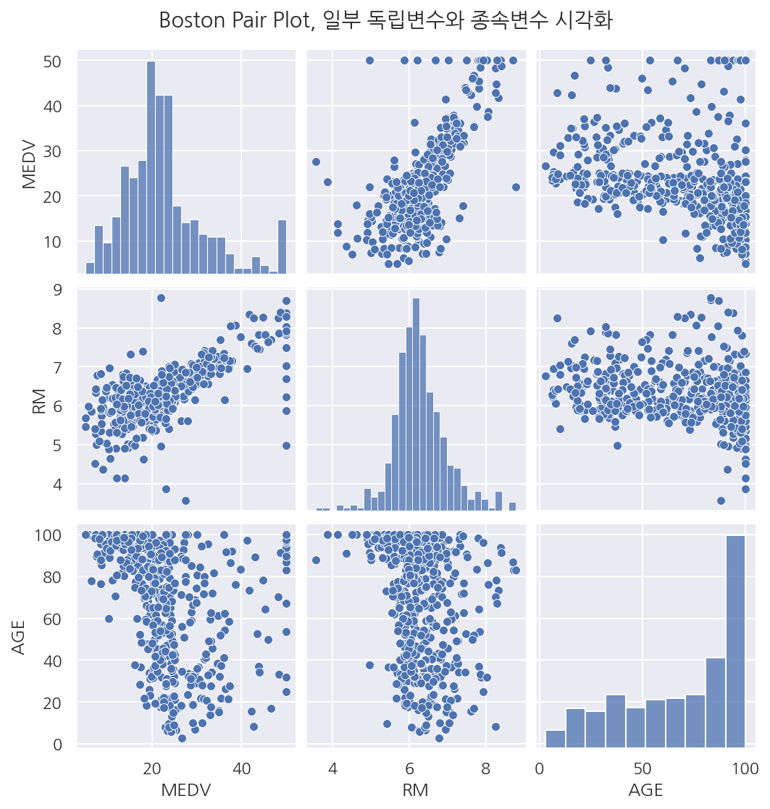
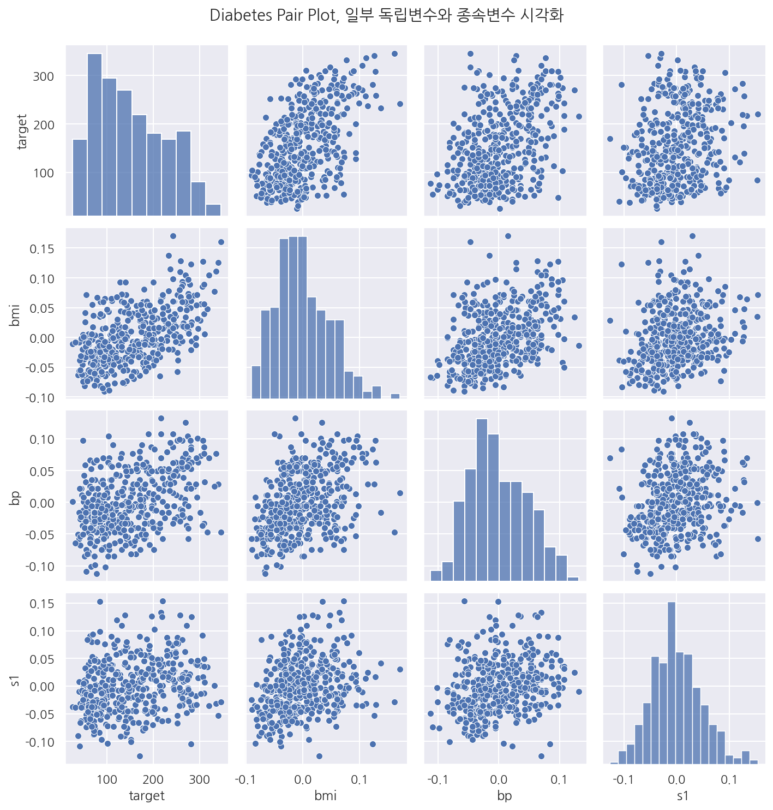
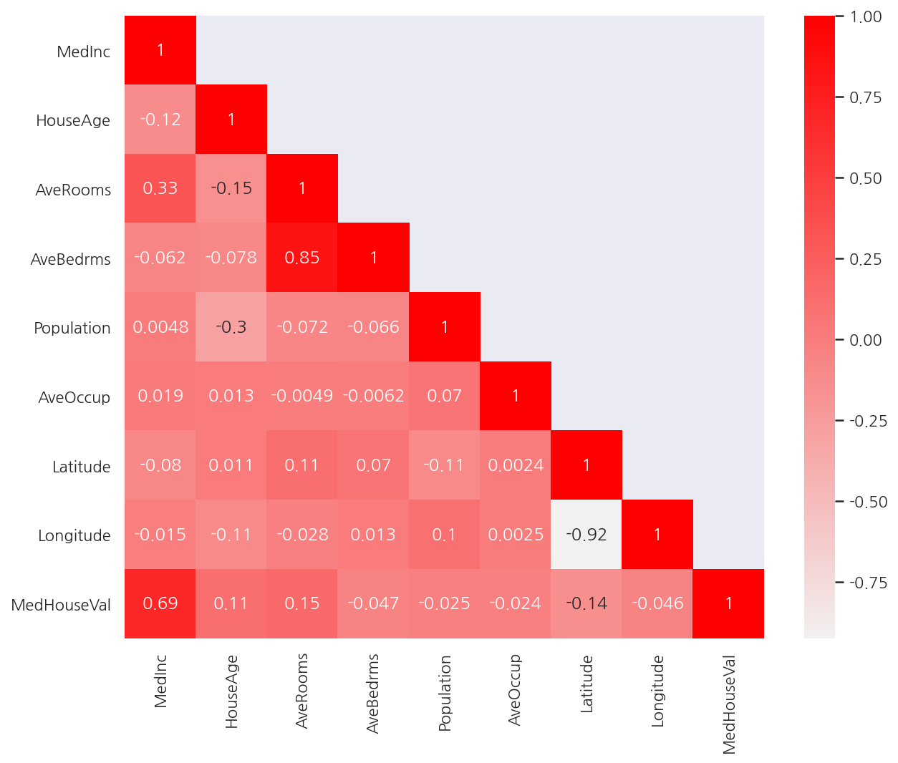
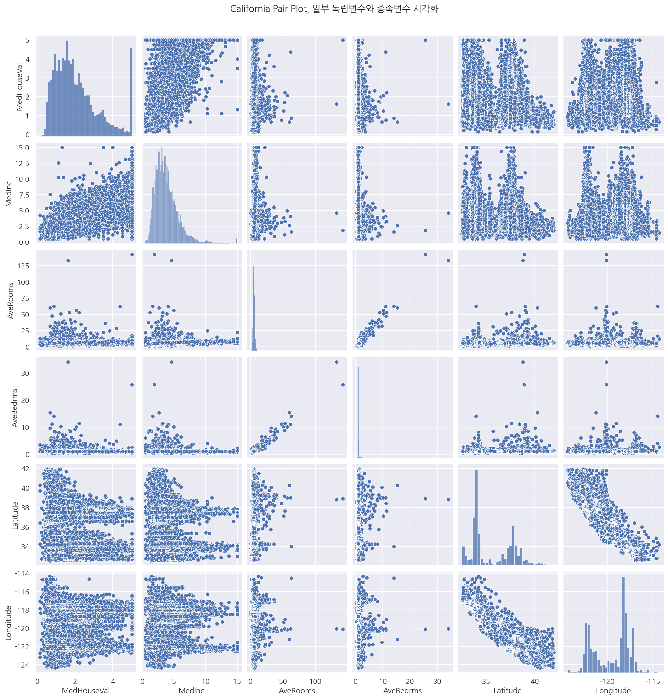
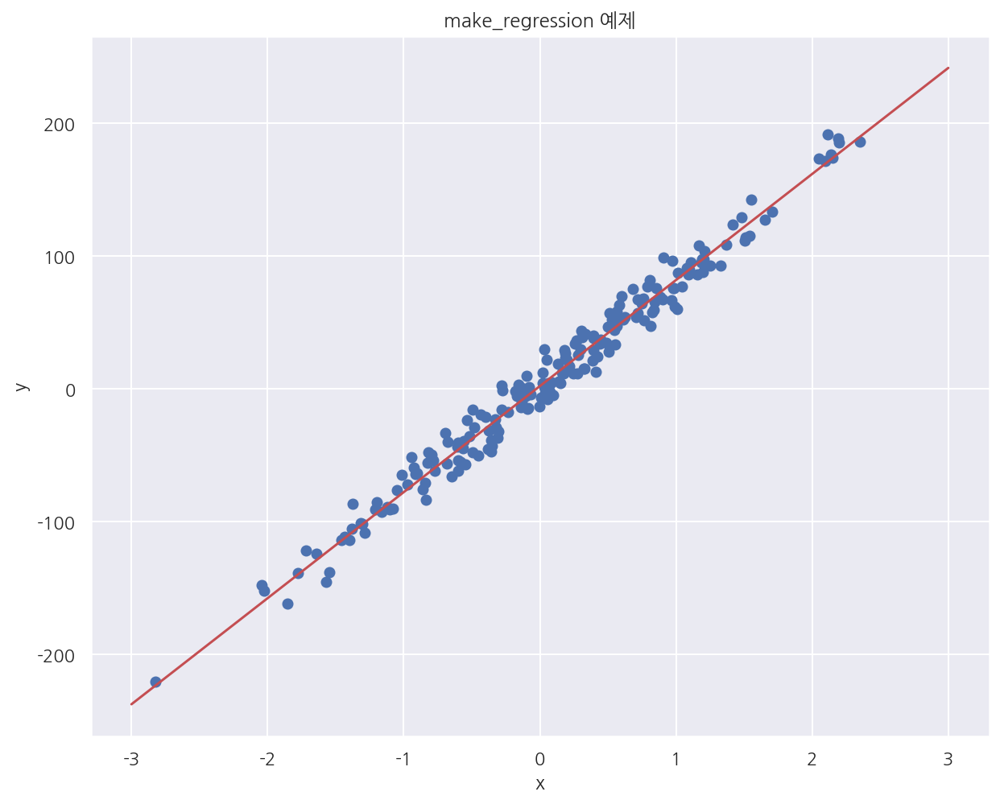
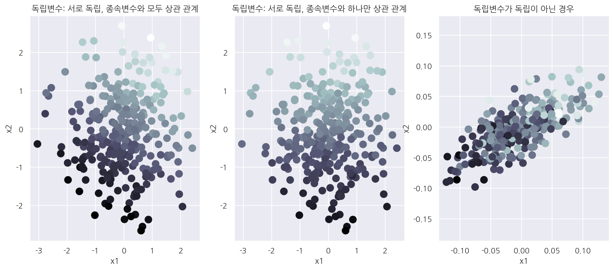

[데이터 사이언스 스쿨](https://datascienceschool.net/intro.html) 자료를 토대로 공부한 내용입니다.

실습과정에서 필요에 따라 내용의 누락 및 추가, 수정사항이 있습니다.

---


**기본 세팅**


```python
import numpy as np
import pandas as pd

import matplotlib as mpl
import matplotlib.pyplot as plt
import seaborn as sns

import warnings
```


```python
%matplotlib inline
%config InlineBackend.figure_format = 'retina'

mpl.rc('font', family='NanumGothic') # 폰트 설정
mpl.rc('axes', unicode_minus=False) # 유니코드에서 음수 부호 설정

# 차트 스타일 설정
sns.set(font="NanumGothic", rc={"axes.unicode_minus":False}, style='darkgrid')
plt.rc("figure", figsize=(10,8))

warnings.filterwarnings("ignore")
```

# 4.1 회귀분석 예제

## 4.1.1 보스턴 집값 예측

`sklearn` 패키지의 `datasets` 서브패키지는 회귀분석을 공부하기 위한 예제를 제공한다. 

그 중 `load_boston()` 명령으로 받을 수 있는 보스턴 주택 가격 데이터는 다음과 같은 데이터이다. 

보스턴의 506개 타운(town)의 13개 독립변수값로부터 해당 타운의 주택가격 중앙값을 예측하는 문제다. 

사용할 수 있는 특징 데이터는 다음과 같다.

| 변수 | 설명 |
|-|-|
|CRIM|범죄율
|INDUS|비소매상업지역 면적 비율
|NOX|일산화질소 농도 
|RM|주택당 방 수
|LSTAT|인구 중 하위 계층 비율
|B|인구 중 흑인 비율
|PTRATIO|학생/교사 비율
|ZN|25,000 평방피트를 초과 거주지역 비율
|CHAS|찰스강의 경계에 위치한 경우는 1, 아니면 0
|AGE|1940년 이전에 건축된 주택의 비율
|RAD|방사형 고속도로까지의 거리
|DIS|직업센터의 거리
|TAX|재산세율
|MEDV|보스턴 506개 타운의 1978년 주택 가격 중앙값 (단위 1,000 달러)

종속변수는 MEDV로 사실 원래 변수명이 따로 없이 저장되어 있는데 밑에 실습에서 MEDV로 지정할 것이다.

**Boston 데이터 불러오기**


```python
from sklearn.datasets import load_boston

temp = load_boston()
dir(temp)
```


    ['DESCR', 'data', 'feature_names', 'filename', 'target']


`load_boston()` 명령으로 받는 데이터 집합은 Bunch 라는 클래스 객체로 생성된다. 

이 클래스 객체는 다음과 같은 속성을 가진다.


 * `data`: 독립변수 ndarray 배열
 
 
 * `target`: 종속변수 ndarray 배열
 
 
 * `feature_names`: 독립변수 이름 리스트
 
 
 * `target_names`: (옵션) 종속변수 이름 리스트
 
 
 * `DESCR`: (옵션) 자료에 대한 설명 문자열


```python
x_data = pd.DataFrame(temp.data, columns = temp.feature_names)
y_data = pd.DataFrame(temp.target, columns = ["MEDV"])

boston = pd.concat([x_data, y_data], axis = 1)
boston.head()
```


<div>
<style scoped>
    .dataframe tbody tr th:only-of-type {
        vertical-align: middle;
    }

    .dataframe tbody tr th {
        vertical-align: top;
    }

    .dataframe thead th {
        text-align: right;
    }
</style>
<table border="1" class="dataframe">
  <thead>
    <tr style="text-align: right;">
      <th></th>
      <th>CRIM</th>
      <th>ZN</th>
      <th>INDUS</th>
      <th>CHAS</th>
      <th>NOX</th>
      <th>RM</th>
      <th>AGE</th>
      <th>DIS</th>
      <th>RAD</th>
      <th>TAX</th>
      <th>PTRATIO</th>
      <th>B</th>
      <th>LSTAT</th>
      <th>MEDV</th>
    </tr>
  </thead>
  <tbody>
    <tr>
      <th>0</th>
      <td>0.00632</td>
      <td>18.0</td>
      <td>2.31</td>
      <td>0.0</td>
      <td>0.538</td>
      <td>6.575</td>
      <td>65.2</td>
      <td>4.0900</td>
      <td>1.0</td>
      <td>296.0</td>
      <td>15.3</td>
      <td>396.90</td>
      <td>4.98</td>
      <td>24.0</td>
    </tr>
    <tr>
      <th>1</th>
      <td>0.02731</td>
      <td>0.0</td>
      <td>7.07</td>
      <td>0.0</td>
      <td>0.469</td>
      <td>6.421</td>
      <td>78.9</td>
      <td>4.9671</td>
      <td>2.0</td>
      <td>242.0</td>
      <td>17.8</td>
      <td>396.90</td>
      <td>9.14</td>
      <td>21.6</td>
    </tr>
    <tr>
      <th>2</th>
      <td>0.02729</td>
      <td>0.0</td>
      <td>7.07</td>
      <td>0.0</td>
      <td>0.469</td>
      <td>7.185</td>
      <td>61.1</td>
      <td>4.9671</td>
      <td>2.0</td>
      <td>242.0</td>
      <td>17.8</td>
      <td>392.83</td>
      <td>4.03</td>
      <td>34.7</td>
    </tr>
    <tr>
      <th>3</th>
      <td>0.03237</td>
      <td>0.0</td>
      <td>2.18</td>
      <td>0.0</td>
      <td>0.458</td>
      <td>6.998</td>
      <td>45.8</td>
      <td>6.0622</td>
      <td>3.0</td>
      <td>222.0</td>
      <td>18.7</td>
      <td>394.63</td>
      <td>2.94</td>
      <td>33.4</td>
    </tr>
    <tr>
      <th>4</th>
      <td>0.06905</td>
      <td>0.0</td>
      <td>2.18</td>
      <td>0.0</td>
      <td>0.458</td>
      <td>7.147</td>
      <td>54.2</td>
      <td>6.0622</td>
      <td>3.0</td>
      <td>222.0</td>
      <td>18.7</td>
      <td>396.90</td>
      <td>5.33</td>
      <td>36.2</td>
    </tr>
  </tbody>
</table>
</div>


- `load_boston()`의 여러 속성을 이용해서 boston 데이터 프레임을 생성하였다.


- 종속 변수는 MEDV로 이름을 지정하였다.

**일부 변수 시각화**


```python
sns.pairplot(boston[["MEDV", "RM", "AGE"]])
plt.suptitle("Boston Pair Plot, 일부 독립변수와 종속변수 시각화", y=1.03)
plt.show()
```


    

    


- 방 개수(RM)가 증가할 수록 집값(MEDV)은 증가하는 경향이 보인다.


- 노후화 정도(AGE)와 집값은 관계(MEDV)가 없어 보인다.

## 4.1.2 당뇨병 진행도 예측

scikit-learn 패키지가 제공하는 당뇨병 진행도 예측용 데이터는 442명의 당뇨병 환자를 대상으로한 검사 결과를 나타내는 데이터이다.

| 변수 | 설명 |
|-|-|
|age|나이|
|sex|성별|
|bmi|BMI(Body mass index)지수|
|bp|평균혈압|
|s1~s6|6종류의 혈액검사수치|
|종속변수|1년 뒤 측정한 당뇨병의 진행률|

**Diabetes 데이터 불러오기**


```python
from sklearn.datasets import load_diabetes

temp = load_diabetes()
diabetes = pd.DataFrame(temp.data, columns=temp.feature_names)
diabetes["target"] = temp.target
diabetes.tail()
```


<div>
<style scoped>
    .dataframe tbody tr th:only-of-type {
        vertical-align: middle;
    }

    .dataframe tbody tr th {
        vertical-align: top;
    }

    .dataframe thead th {
        text-align: right;
    }
</style>
<table border="1" class="dataframe">
  <thead>
    <tr style="text-align: right;">
      <th></th>
      <th>age</th>
      <th>sex</th>
      <th>bmi</th>
      <th>bp</th>
      <th>s1</th>
      <th>s2</th>
      <th>s3</th>
      <th>s4</th>
      <th>s5</th>
      <th>s6</th>
      <th>target</th>
    </tr>
  </thead>
  <tbody>
    <tr>
      <th>437</th>
      <td>0.041708</td>
      <td>0.050680</td>
      <td>0.019662</td>
      <td>0.059744</td>
      <td>-0.005697</td>
      <td>-0.002566</td>
      <td>-0.028674</td>
      <td>-0.002592</td>
      <td>0.031193</td>
      <td>0.007207</td>
      <td>178.0</td>
    </tr>
    <tr>
      <th>438</th>
      <td>-0.005515</td>
      <td>0.050680</td>
      <td>-0.015906</td>
      <td>-0.067642</td>
      <td>0.049341</td>
      <td>0.079165</td>
      <td>-0.028674</td>
      <td>0.034309</td>
      <td>-0.018118</td>
      <td>0.044485</td>
      <td>104.0</td>
    </tr>
    <tr>
      <th>439</th>
      <td>0.041708</td>
      <td>0.050680</td>
      <td>-0.015906</td>
      <td>0.017282</td>
      <td>-0.037344</td>
      <td>-0.013840</td>
      <td>-0.024993</td>
      <td>-0.011080</td>
      <td>-0.046879</td>
      <td>0.015491</td>
      <td>132.0</td>
    </tr>
    <tr>
      <th>440</th>
      <td>-0.045472</td>
      <td>-0.044642</td>
      <td>0.039062</td>
      <td>0.001215</td>
      <td>0.016318</td>
      <td>0.015283</td>
      <td>-0.028674</td>
      <td>0.026560</td>
      <td>0.044528</td>
      <td>-0.025930</td>
      <td>220.0</td>
    </tr>
    <tr>
      <th>441</th>
      <td>-0.045472</td>
      <td>-0.044642</td>
      <td>-0.073030</td>
      <td>-0.081414</td>
      <td>0.083740</td>
      <td>0.027809</td>
      <td>0.173816</td>
      <td>-0.039493</td>
      <td>-0.004220</td>
      <td>0.003064</td>
      <td>57.0</td>
    </tr>
  </tbody>
</table>
</div>


**일부 변수 시각화**


```python
sns.pairplot(diabetes[["target", "bmi", "bp", "s1"]])
plt.suptitle("Diabetes Pair Plot, 일부 독립변수와 종속변수 시각화", y=1.03)
plt.show()
```


    

    


- 독립변수 BMI지수와 평균혈압은 종속변수인 당뇨병 진행도와 양의 상관관계를 가지는 것을 볼 수 있다. 


- 독립변수 BMI지수와 평균혈압도 서로 양의 상관관계를 가져 다중공선성이 보인다.

## 4.1.3 연습문제

sklearn.datasets 패키지의 fetch_california_housing 명령은 캘리포니아 주택가격을 예측하기위한 데이터다. 

이 데이터의 독립변수를 조사하고 어떤 데이터들이 주택가격과 상관관계가 있는지를 조사한다. 

또한 서로 강한 상관관계를 가지는 독립변수도 알아보자.

**California 데이터 불러오기**


```python
from sklearn.datasets import fetch_california_housing

temp = fetch_california_housing()

california = pd.DataFrame(temp.data, columns=temp.feature_names)
california["MedHouseVal"] = temp.target
california.tail()
```


<div>
<style scoped>
    .dataframe tbody tr th:only-of-type {
        vertical-align: middle;
    }

    .dataframe tbody tr th {
        vertical-align: top;
    }

    .dataframe thead th {
        text-align: right;
    }
</style>
<table border="1" class="dataframe">
  <thead>
    <tr style="text-align: right;">
      <th></th>
      <th>MedInc</th>
      <th>HouseAge</th>
      <th>AveRooms</th>
      <th>AveBedrms</th>
      <th>Population</th>
      <th>AveOccup</th>
      <th>Latitude</th>
      <th>Longitude</th>
      <th>MedHouseVal</th>
    </tr>
  </thead>
  <tbody>
    <tr>
      <th>20635</th>
      <td>1.5603</td>
      <td>25.0</td>
      <td>5.045455</td>
      <td>1.133333</td>
      <td>845.0</td>
      <td>2.560606</td>
      <td>39.48</td>
      <td>-121.09</td>
      <td>0.781</td>
    </tr>
    <tr>
      <th>20636</th>
      <td>2.5568</td>
      <td>18.0</td>
      <td>6.114035</td>
      <td>1.315789</td>
      <td>356.0</td>
      <td>3.122807</td>
      <td>39.49</td>
      <td>-121.21</td>
      <td>0.771</td>
    </tr>
    <tr>
      <th>20637</th>
      <td>1.7000</td>
      <td>17.0</td>
      <td>5.205543</td>
      <td>1.120092</td>
      <td>1007.0</td>
      <td>2.325635</td>
      <td>39.43</td>
      <td>-121.22</td>
      <td>0.923</td>
    </tr>
    <tr>
      <th>20638</th>
      <td>1.8672</td>
      <td>18.0</td>
      <td>5.329513</td>
      <td>1.171920</td>
      <td>741.0</td>
      <td>2.123209</td>
      <td>39.43</td>
      <td>-121.32</td>
      <td>0.847</td>
    </tr>
    <tr>
      <th>20639</th>
      <td>2.3886</td>
      <td>16.0</td>
      <td>5.254717</td>
      <td>1.162264</td>
      <td>1387.0</td>
      <td>2.616981</td>
      <td>39.37</td>
      <td>-121.24</td>
      <td>0.894</td>
    </tr>
  </tbody>
</table>
</div>


**상관관계 확인**


```python
corr_M = california.corr()
mask = np.array(corr_M)
mask[np.tril_indices_from(mask)] = False

plt.figure(figsize= (10,8))

sns.heatmap(corr_M, 
            cmap = sns.light_palette("red", as_cmap=True),
            annot = True, 
            mask = mask)

plt.show()
```


    

    


- 종속변수 MedHouseVal와 상관관계가 높은 독립변수는 MedInc이다.


- 독립변수간에는 AveRooms와 AveBedrms, Latitude와 Longitude가 서로 강한 상관관계를 가지고 있다. 

**일부 변수 시각화**


```python
sns.pairplot(california[["MedHouseVal", "MedInc", "AveRooms", "AveBedrms", "Latitude", "Longitude"]])
plt.suptitle("California Pair Plot, 일부 독립변수와 종속변수 시각화", y=1.03)
plt.show()
```


    

    


- 상관계수로 확인 하였듯이 변수간 선형관계가 보인다.


- Latitude와 Longitude는 비선형 형태에 가까워 보인다.

## 4.1.4 가상 데이터 예측

**가상 데이터 만들기**

`datasets` 서브패키지에는 가상 회귀 분석 예제를 만들 수 있는 `make_regression()` 함수가 있다.

해당 함수에 대한 설명은 다음과 같다.

```
X, Y, B  = make_regression(
    n_samples, n_features, bias, noise, random_state, coef=True, n_informative, effective_rank, tail_strength)
```

| 옵션 | 입력 자료형 | 설명 |
|-|-|-|
| n_samples|정수(디폴트 100)| 표본 데이터의 갯수 n|
| n_features|정수(디폴트 100)| 독립변수의 수 p|
| bias|실수(디폴트 0)| Y 절편|
| noise|실수(디폴트 0)| 오차항의 표준편차 $\epsilon$의 표준편차
| random_state|정수(디폴트 None)| 난수 발생용 시드값 
| coef|불리언(디폴트 False)| True면 회귀 계수 출력
| n_informative|정수(디폴트 10)| 독립변수 중 종속변수와 상관 관계가 있는 독립변수의 수
| effective_rank|정수 또는 None(디폴트 None)| 독립변수 중 서로 독립인 독립변수의 수. 만약 None이면 모두 독립
| tail_strength|0~1사이의 실수(디폴트 0.5)| effective_rank가 None이 아닌 경우 독립변수간의 상관관계를 결정하는 변수. 0.5면 독립변수간의 상관관계가 없다.

출력은 다음과 같다.

- X: (n_samples, n_features) 형상의 2차원 배열로 독립변수의 표본 데이터 행렬 $X$, n x p
 
 
- Y: (n_samples) 형상의 1차원 배열로 종속변수의 표본 데이터 벡터 $Y$, n x 1
 
 
- B: (n_features) 형상의 1차원 배열로 선형 모형의 계수 벡터 $\beta$, p x 1 

      혹은 (n_features, n_targets) 형상의 2차원 배열 (옵션)

      입력 인수 coef가 True 인 경우에만 출력됨 - 절편 제외


```python
from sklearn.datasets import make_regression

X, Y, B = make_regression(
    n_samples=200, n_features=1, bias=2, noise=10, coef=True, random_state=1017
)
```


```python
x = np.linspace(-3, 3, 100)
y0 = B * x + 2

plt.figure(figsize= (10,8))

# 회귀식 - 오차항 고려없이 계수로 생성, 모수 beta를 이미 알고 있음
plt.plot(x, y0, "r-")

# 산점도
plt.scatter(X, Y)

plt.xlabel("x")
plt.ylabel("y")
plt.title("make_regression 예제")

plt.show()
```


    

    


- `make_regression()` 으로 만든 가상 데이터 산점도이다.


- 독립변수는 1개, 절편은 2, 오차항의 표준편차는 10으로 설정하였다.


- 오차항 고려 없이 만든 직선을 기준으로 데이터가 잘 퍼져있다.


```python
def make_regression2(n_informative, effective_rank, tail_strength, i):
    X, Y, B = make_regression(
        n_samples=300, n_features=2, noise=10, coef=True, random_state=0,
        n_informative = n_informative, effective_rank= effective_rank, tail_strength = tail_strength
    )
    
    axs[i].scatter(X[:, 0], X[:, 1], c=Y, s=100, cmap=mpl.cm.bone)

    axs[i].set_xlabel("x1")
    axs[i].set_ylabel("x2")

fig, axs = plt.subplots(1,3, figsize= (15,6))

make_regression2(2,None,0.5, 0)
make_regression2(1,None,0.5, 1)
make_regression2(2,1,0, 2)
    
plt.axis("equal")

axs[0].set_title("독립변수: 서로 독립, 종속변수와 모두 상관 관계")
axs[1].set_title("독립변수: 서로 독립, 종속변수와 하나만 상관 관계")
axs[2].set_title("독립변수가 독립이 아닌 경우")

plt.show()
```


    

    


- 종속변수 값은 점의 명암으로 표시하였으며 밝을수록 종속변수 값이 큰 것이고 점의 어두울수록 작은 값이다.


- 첫 번째 산점도에선 x1, x2 모두 증가할수록 종속변수 값이 커지는 것을 알 수 있다.


- 두 번째 산점도에선 x2가 증가할수록 종속변수 값이 증가하지만 x1에 따라선 큰 차이가 없다.


- 세 번쨰 산점도에선 x1, x2가 상관관계를 가지는 것을 확인 할 수 있다.
