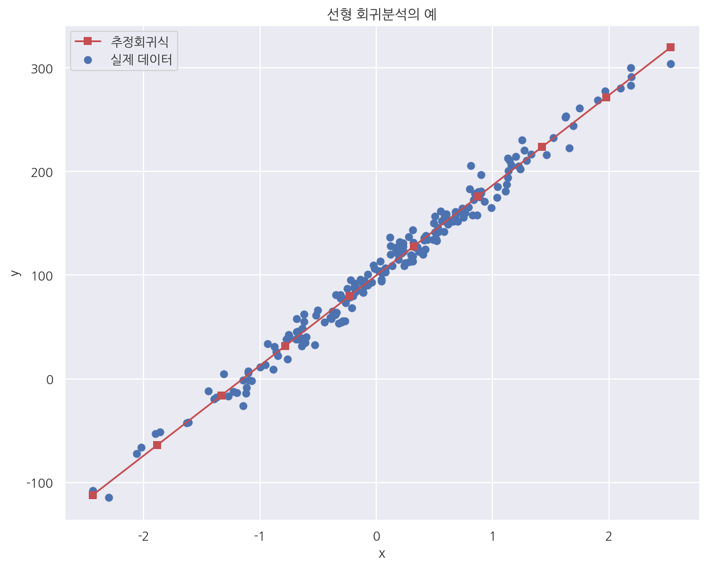

[데이터 사이언스 스쿨](https://datascienceschool.net/intro.html) 자료를 토대로 공부한 내용입니다.

실습과정에서 필요에 따라 내용의 누락 및 추가, 수정사항이 있습니다.

---


**기본 세팅**


```python
import numpy as np
import pandas as pd

import matplotlib as mpl
import matplotlib.pyplot as plt
import seaborn as sns

import warnings
```


```python
%matplotlib inline
%config InlineBackend.figure_format = 'retina'

mpl.rc('font', family='NanumGothic') # 폰트 설정
mpl.rc('axes', unicode_minus=False) # 유니코드에서 음수 부호 설정

# 차트 스타일 설정
sns.set(font="NanumGothic", rc={"axes.unicode_minus":False}, style='darkgrid')
plt.rc("figure", figsize=(10,8))

warnings.filterwarnings("ignore")
```

# 4.2 선형 회귀분석의 기초

$n$개의 관측값을 가지는 $i$번째 독립변수 $x_i$는 다음과 같이 벡터로 표현가능하다. [$n$ x $1$]

$$
x_i =
\begin{bmatrix}
x_{i1} \\ x_{i2} \\ \vdots \\ x_{in}
\end{bmatrix}
$$

$n$개의 관측값을 가지고 $k-1$개의 독립변수를 가지는 행렬 $X$는 다음과 같다. [절편 포함: $n$ x $k$] 

$$
X =
\begin{bmatrix}
1 & x_1 & x_2 & \cdots & x_p
\end{bmatrix}
\ = 
\begin{bmatrix}
1 & x_{11} & x_{21} & \cdots & x_{(k-1)1} \\
1 & x_{12} & x_{22} & \cdots & x_{(k-1)2} \\
\vdots & \vdots & \vdots & \vdots & \vdots \\
1 & x_{1n} & x_{2n} & \cdots & x_{(k-1)n} \\
\end{bmatrix}
$$

회귀계수 $\beta$ [$k$ x 1], 오차 $\epsilon$ [$n$ x 1], 종속변수 $Y$ [$n$ x 1]는 다음과 같다. 

$$
\beta =
\begin{bmatrix}
\beta_{0} \\ \beta_{1} \\ \vdots \\ \beta_{p}
\end{bmatrix}
, \quad 
\epsilon =
\begin{bmatrix}
\epsilon_{0} \\ \epsilon_{1} \\ \vdots \\ \epsilon_{n}
\end{bmatrix}
, \quad 
Y =
\begin{bmatrix}
y_{0} \\ y_{1} \\ \vdots \\ y_{n}
\end{bmatrix}
= X\beta + \epsilon
$$

- 만약 $X^{T}X$ 행렬의 역행렬이 존재한다면 추정회귀계수 $\hat{\beta}$ 은 다음과 같다.


- $\hat{\beta} = (X^{T}X)^{-1}X^{T}Y$


- $X^{T}X$ 행렬의 역행렬이 존재하기 위해선 각 독립변수가 서로 독립이어야 한다.

## 4.2.1 Numpy를 이용한 선형 회귀분석


```python
from sklearn.datasets import make_regression
import statsmodels.api as sm

# n=200, p=1, epsilon~N(0,10)
X0, Y, B = make_regression(
    n_samples=200, n_features=1, bias=100, noise=10, coef=True, random_state=1
)

X = sm.add_constant(X0) # 상수항 결합
Y = Y.reshape(len(Y), 1)

# 모회귀계수
print("회귀계수 베타0:", 100)
print("회귀계수 베타1:", B.round(3))
print("-" * 30)

# 추정회귀계수
B_hat = np.linalg.inv(X.T @ X) @ X.T @ Y

print("추정회귀계수 베타0:", B_hat[0,0].round(3))
print("추정회귀계수 베타1:", B_hat[1,0].round(3))
```

    회귀계수 베타0: 100
    회귀계수 베타1: 86.448
    ------------------------------
    추정회귀계수 베타0: 99.792
    추정회귀계수 베타1: 86.962
    

- 실제 회귀계수와 비슷한 값으로 추정한 것을 확인 할 수 있다.


```python
# 그래프로 확인하기
x_new = np.linspace(np.min(X), np.max(X), 10)
X_new = sm.add_constant(x_new)
y_pred = np.dot(X_new, B_hat) # 예측값

plt.figure(figsize= (10,8))

plt.scatter(X0, Y, label="실제 데이터")
plt.plot(x_new, y_pred, 'rs-', label="추정회귀식")

plt.xlabel("x")
plt.ylabel("y")
plt.title("선형 회귀분석의 예")
plt.legend()

plt.show()
```


    

    


## 4.2.2 scikit-learn 패키지를 사용한 선형 회귀분석


```python
from sklearn.linear_model import LinearRegression

model = LinearRegression(fit_intercept=True).fit(X0,Y)

print("추정회귀계수 베타0:", model.intercept_[0].round(3))
print("추정회귀계수 베타1:", model.coef_[0][0].round(3))
```

    추정회귀계수 베타0: 99.792
    추정회귀계수 베타1: 86.962
    

- `LinearRegression()` 을 이용해 넘파이에서 수기로 계산한 값과 같은 결과를 얻었다.


- 디폴트로 절편을 생성하고 절편계수, 회귀계수는 각각 intercept_, coef_ 속성으로 확인 가능하다.


```python
model.predict([[-2], [-1], [0], [1], [2]])
```


    array([[-74.13191534],
           [ 12.82979668],
           [ 99.79150869],
           [186.7532207 ],
           [273.71493272]])


- `predict()` 를 이용해 새로운 x값에 대해 추정값을 구할 수 있다.


- 이때 x는 2차원 배열로 기입해야한다.


- `sklearn`패캐지의 대부분의 모델은 `fit()`, `predict()`를 이용해서 학습하고 예측한다.

## 4.2.3 statsmodels 패키지를 사용한 선형 회귀분석


```python
data = pd.DataFrame({"x": X0[:, 0], "y": Y[:, 0]})
data
```


<div>
<style scoped>
    .dataframe tbody tr th:only-of-type {
        vertical-align: middle;
    }

    .dataframe tbody tr th {
        vertical-align: top;
    }

    .dataframe thead th {
        text-align: right;
    }
</style>
<table border="1" class="dataframe">
  <thead>
    <tr style="text-align: right;">
      <th></th>
      <th>x</th>
      <th>y</th>
    </tr>
  </thead>
  <tbody>
    <tr>
      <th>0</th>
      <td>0.232495</td>
      <td>127.879017</td>
    </tr>
    <tr>
      <th>1</th>
      <td>-0.038696</td>
      <td>93.032914</td>
    </tr>
    <tr>
      <th>2</th>
      <td>0.550537</td>
      <td>161.857508</td>
    </tr>
    <tr>
      <th>3</th>
      <td>0.503185</td>
      <td>141.692050</td>
    </tr>
    <tr>
      <th>4</th>
      <td>2.186980</td>
      <td>283.260119</td>
    </tr>
    <tr>
      <th>...</th>
      <td>...</td>
      <td>...</td>
    </tr>
    <tr>
      <th>195</th>
      <td>-0.172428</td>
      <td>87.874277</td>
    </tr>
    <tr>
      <th>196</th>
      <td>-1.199268</td>
      <td>-13.626664</td>
    </tr>
    <tr>
      <th>197</th>
      <td>1.462108</td>
      <td>216.106619</td>
    </tr>
    <tr>
      <th>198</th>
      <td>1.131629</td>
      <td>212.743149</td>
    </tr>
    <tr>
      <th>199</th>
      <td>0.495211</td>
      <td>150.017589</td>
    </tr>
  </tbody>
</table>
<p>200 rows × 2 columns</p>
</div>


**독립변수와 종속변수가 다른 데이터 프레임에 존재하는 경우**


```python
# x에 상수항을 수기로 추가해주어야 한다.
dfy = data[["y"]]
dfX = sm.add_constant(data[["x"]])

model = sm.OLS(dfy, dfX)
result = model.fit()
print(result.summary())
```

                                OLS Regression Results                            
    ==============================================================================
    Dep. Variable:                      y   R-squared:                       0.985
    Model:                            OLS   Adj. R-squared:                  0.985
    Method:                 Least Squares   F-statistic:                 1.278e+04
    Date:                Fri, 11 Jun 2021   Prob (F-statistic):          8.17e-182
    Time:                        18:26:42   Log-Likelihood:                -741.28
    No. Observations:                 200   AIC:                             1487.
    Df Residuals:                     198   BIC:                             1493.
    Df Model:                           1                                         
    Covariance Type:            nonrobust                                         
    ==============================================================================
                     coef    std err          t      P>|t|      [0.025      0.975]
    ------------------------------------------------------------------------------
    const         99.7915      0.705    141.592      0.000      98.402     101.181
    x             86.9617      0.769    113.058      0.000      85.445      88.479
    ==============================================================================
    Omnibus:                        1.418   Durbin-Watson:                   1.690
    Prob(Omnibus):                  0.492   Jarque-Bera (JB):                1.059
    Skew:                           0.121   Prob(JB):                        0.589
    Kurtosis:                       3.262   Cond. No.                         1.16
    ==============================================================================
    
    Notes:
    [1] Standard Errors assume that the covariance matrix of the errors is correctly specified.
    

- `OLS()`로 같은 회귀계수가 출력되었으며 `summary()`로 결정계수 등 다양한 정보를 확인 가능하다.

**독립변수와 종속변수가 같은 데이터 프레임에 존재하는 경우**


```python
model = sm.OLS.from_formula("y ~ x", data = data)
result = model.fit()
print(result.summary())
```

                                OLS Regression Results                            
    ==============================================================================
    Dep. Variable:                      y   R-squared:                       0.985
    Model:                            OLS   Adj. R-squared:                  0.985
    Method:                 Least Squares   F-statistic:                 1.278e+04
    Date:                Fri, 11 Jun 2021   Prob (F-statistic):          8.17e-182
    Time:                        18:26:42   Log-Likelihood:                -741.28
    No. Observations:                 200   AIC:                             1487.
    Df Residuals:                     198   BIC:                             1493.
    Df Model:                           1                                         
    Covariance Type:            nonrobust                                         
    ==============================================================================
                     coef    std err          t      P>|t|      [0.025      0.975]
    ------------------------------------------------------------------------------
    Intercept     99.7915      0.705    141.592      0.000      98.402     101.181
    x             86.9617      0.769    113.058      0.000      85.445      88.479
    ==============================================================================
    Omnibus:                        1.418   Durbin-Watson:                   1.690
    Prob(Omnibus):                  0.492   Jarque-Bera (JB):                1.059
    Skew:                           0.121   Prob(JB):                        0.589
    Kurtosis:                       3.262   Cond. No.                         1.16
    ==============================================================================
    
    Notes:
    [1] Standard Errors assume that the covariance matrix of the errors is correctly specified.
    

- 독립변수 종속변수가 같은 데이터 프레임에 존재하는 경우 `OLS.from_formula()`로 직접 식을 적어준다.


- 회귀계수는 같은 값으로 출력된 것을 확인 가능하다.


```python
result.predict({"x": [-2, -1, 0, 1, 2] })
```


    0    -74.131915
    1     12.829797
    2     99.791509
    3    186.753221
    4    273.714933
    dtype: float64


- `LinearRegression()`처럼 `predict()` 를 이용해 새로운 x값에 대한 추정값을 구할 수 있다.


- `predict()` 외의 `params`, `resid` 등 다양한 속성, 메소드가 내장되어 있다.
