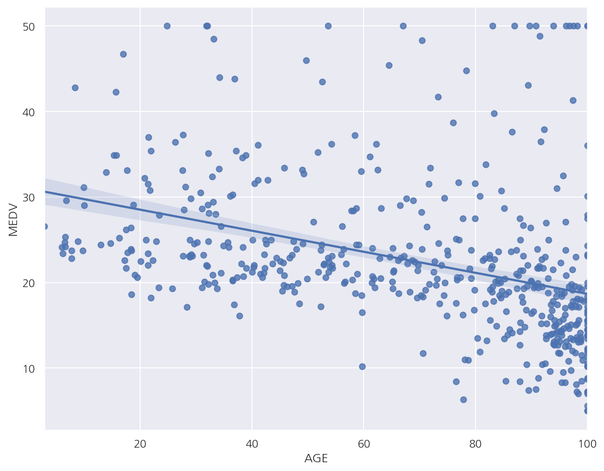
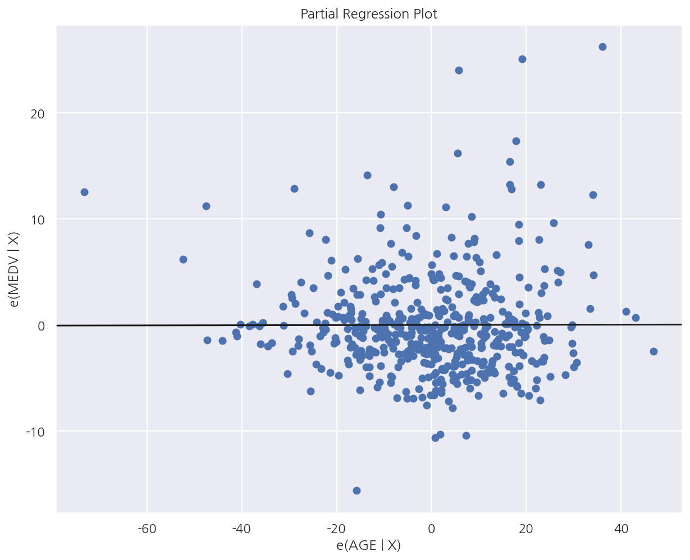
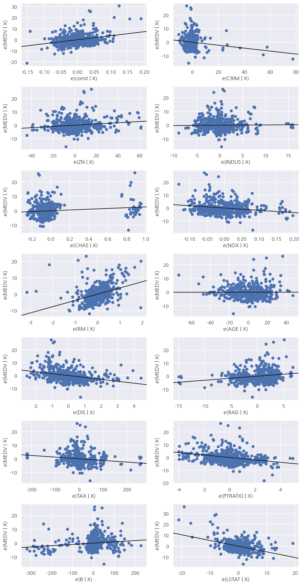
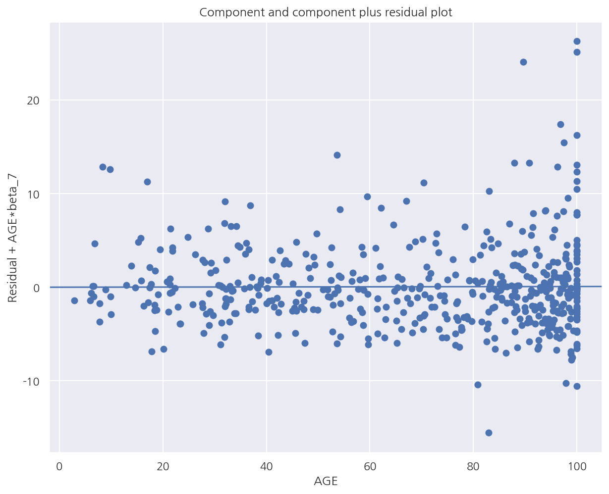
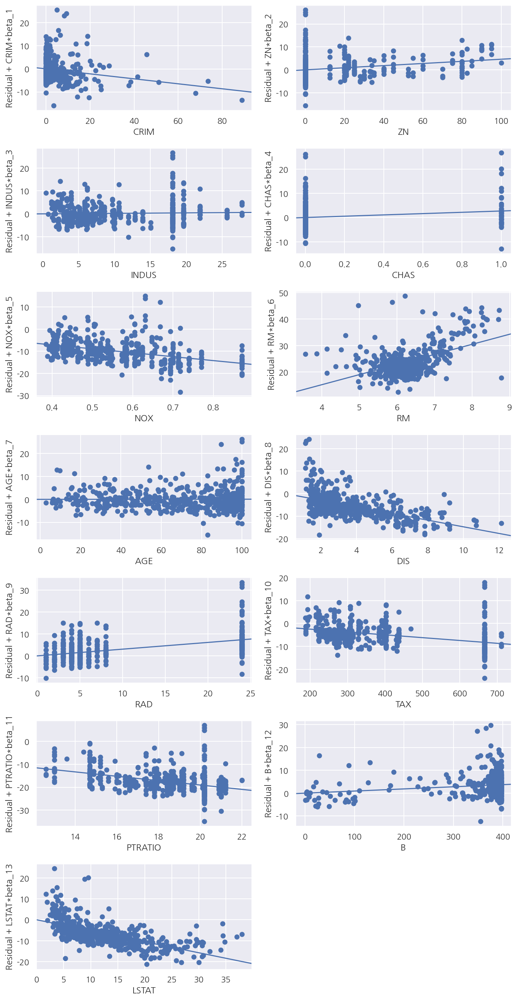
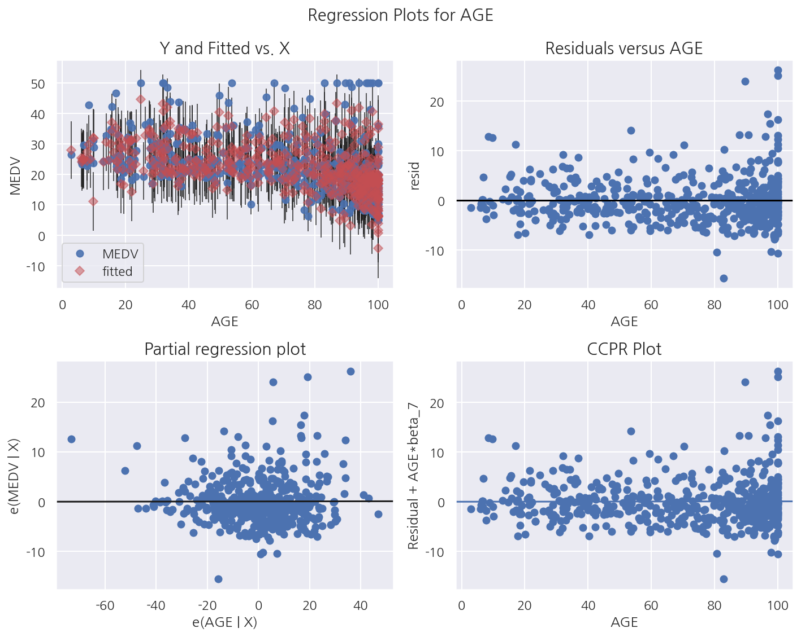

[데이터 사이언스 스쿨](https://datascienceschool.net/intro.html) 자료를 토대로 공부한 내용입니다.

실습과정에서 필요에 따라 내용의 누락 및 추가, 수정사항이 있습니다.

---


**기본 세팅**


```python
import numpy as np
import pandas as pd

import matplotlib as mpl
import matplotlib.pyplot as plt
import seaborn as sns

import warnings
```


```python
%matplotlib inline
%config InlineBackend.figure_format = 'retina'

mpl.rc('font', family='NanumGothic') # 폰트 설정
mpl.rc('axes', unicode_minus=False) # 유니코드에서 음수 부호 설정

# 차트 스타일 설정
sns.set(font="NanumGothic", rc={"axes.unicode_minus":False}, style='darkgrid')
plt.rc("figure", figsize=(10,8))

warnings.filterwarnings("ignore")
```

# 4.5 부분회귀

## 4.5.1 부분회귀 플롯

독립변수의 갯수가 많을 때 특정한 하나의 독립변수의 영향력을 시각화하는 방법으로 다음과 같은 과정으로 그린다.

- 특정 독립변수를 종속변수로 나머지 독립변수(원 종속변수 제외)로 회귀분석시의 잔차: $x_{e}$


- 원 종속변수를 특정 독립변수를 제외한 나머지 독립변수로 회귀분석시의 잔차: $y_{e}$


- $x_{e}$를 독립변수, $y_{e}$를 종속변수로 회귀분석한다.


- $x_{e}$와 $y_{e}$의 산점도와 회귀분석 결과를 시각화 한 것이 부분회귀 플롯이다.


- Notatin은 내가 보기 편한 방식으로 적어둔 것이라 신경쓰지 않아도 된다.


```python
from sklearn.datasets import load_boston
import statsmodels.api as sm

boston = load_boston()

dfX0 = pd.DataFrame(boston.data, columns=boston.feature_names)
dfX = sm.add_constant(dfX0) # 상수항 추가
dfy = pd.DataFrame(boston.target, columns=["MEDV"])
df = pd.concat([dfX, dfy], axis=1)

model_boston = sm.OLS(dfy, dfX)
result_boston = model_boston.fit()
```

**단순 시각화**


```python
sns.regplot(x="AGE", y="MEDV", data=df)

plt.show()
```


    

    


- AGE와 MEDV의 산점도를 보면 음의 상관관계가 있어 보인다.

**부분회귀 플롯**

`statsmodels.api` 패키지에 `graphics.plot_partregress()`로 부분회귀 플롯을 그릴 수 있다.

함수에 대한 설명은 다음과 같다.

`plot_partregress(endog, exog_i, exog_others, data=None, obs_labels=True, ret_coords=False)`

- endog: 종속변수 문자열


- exog_i: 분석 대상이 되는 독립변수 문자열


- exog_others: 나머지 독립변수 문자열의 리스트


- data: 모든 데이터가 있는 데이터프레임


- obs_labels: 데이터 라벨링 여부


- ret_coords: 잔차 데이터 반환 여부


```python
# 나머지 독립변수 (상수항 포함)
others = list(set(df.columns).difference(set(["MEDV", "AGE"])))

plot, resids = sm.graphics.plot_partregress(
    "MEDV", "AGE", others, data=df, obs_labels=False, ret_coords=True
)

plt.show()
```


    

    


- x축: AGE를 종속변수, 원래 종속변수인 MEDV를 제외한 나머지 변수를 독립변수로 하였을 때 잔차


- y축: MEDV를 종속변수, AGE를 제외한 나머지 변수를 독립변수로 하였을 때 잔차


- 부분회귀 플롯으로 보았을 때 AGE와 MEDV간의 상관관계가 없음을 알 수 있다.

**전체 부분회귀 플롯**

`graphics.plot_partregress_grid(result, fig)`를 이용하여 모든 독립변수에 대해 부분회귀 플롯을 그릴 수 있다.

- result: 회귀분석 결과 객체


- fig: plt.figure 객체


```python
fig = plt.figure(figsize=(10, 20))
sm.graphics.plot_partregress_grid(result_boston, fig=fig)
fig.suptitle("")
plt.show()
```


    

    


## 4.5.2 CCPR

**CCPR(Component-Component plus Residual)**

CCPR 역시 부분회귀 플롯처럼 특정한 하나의 변수의 영향을 확인하는 방법이다.

- x축은 특정한 독립변수: $x_{s}$로 사용한다.


- y축은 전체 독립변수를 사용한 회귀분석시 잔차에서 $\beta_{s}x_{s}$를 더해준 값을 사용한다.


- 즉, $x_{s}$와 $x_{s}$의 영향을 제외한 잔차의 산점도이다.

`statsmodels.api` 패키지에 `graphics.plot_ccpr()`로 CCPR을 그릴 수 있다.

함수에 대한 설명은 다음과 같다.

`graphics.plot_ccpr(result, exog_idx)`

- result: 회귀분석 결과 객체


- exog_idx: 분석 대상이 되는 독립변수 문자열


```python
sm.graphics.plot_ccpr(result_boston, "AGE")

plt.show()
```


    

    


- x축: AGE


- y축: 기존 회귀적합모형의 잔차 + $\hat{\beta}AGE$

**전체 CCPR**

`graphics.plot_ccpr_grid(result, fig)`

- result: 회귀분석 결과 객체


- fig: plt.figure 객체


```python
fig = plt.figure(figsize=(10, 20))

sm.graphics.plot_ccpr_grid(result_boston, fig=fig)
fig.suptitle("")

plt.show()
```


    

    


**부분회귀 플롯 + CCPR**

`graphics.plot_regress_exog(result, exog_idx)`

- result: 회귀분석 결과 객체


- exog_idx: 분석 대상이 되는 독립변수 문자열


```python
sm.graphics.plot_regress_exog(result_boston, "AGE")

plt.show()
```


    

    


- 부분회귀 플롯과 CCPR뿐 아니라 산점도(예측값 포함), 잔차도를 함께 그려준다.
