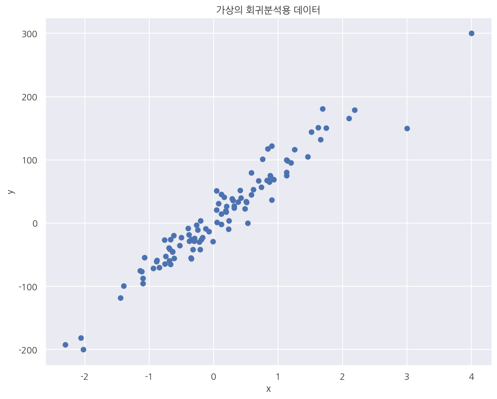
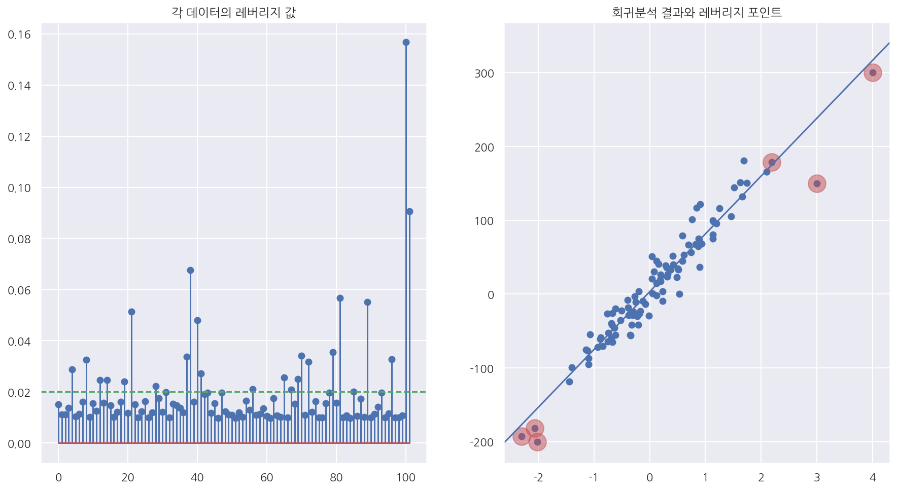
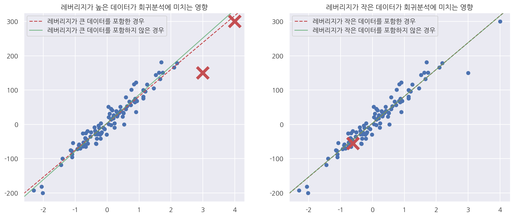
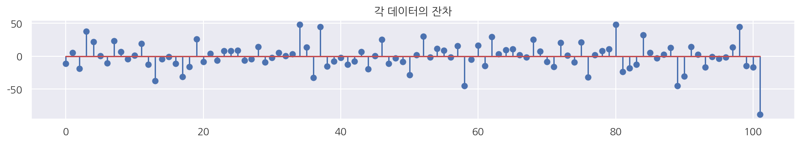
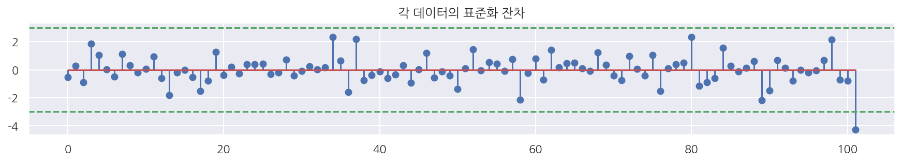
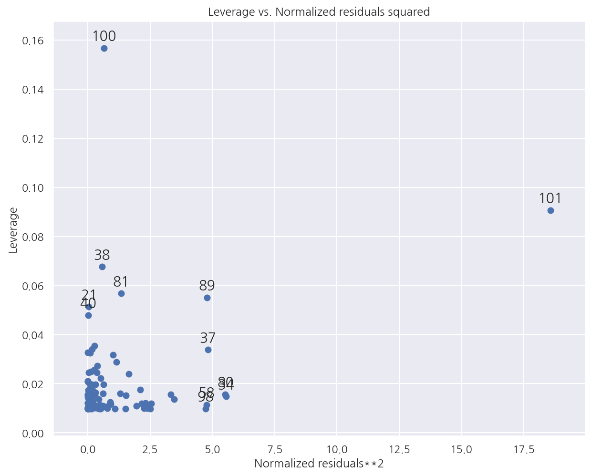
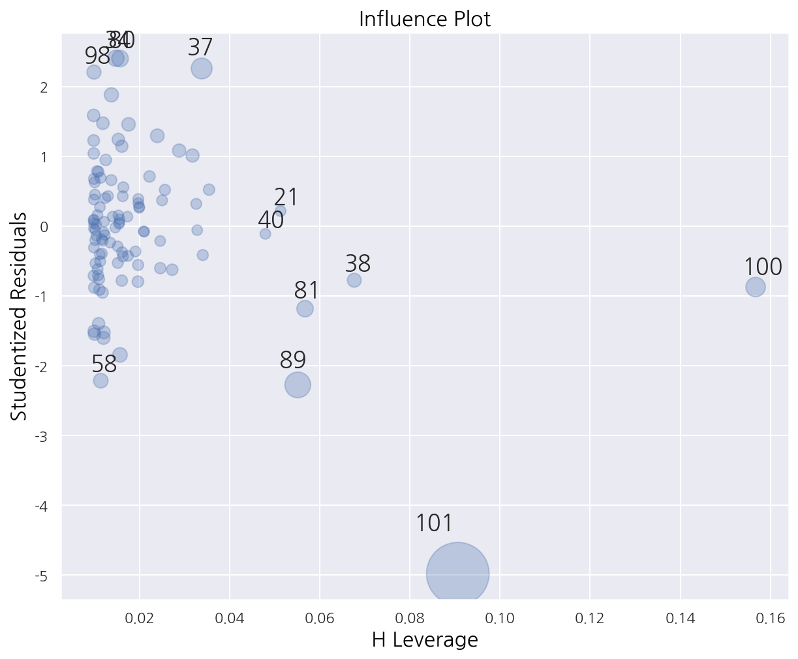
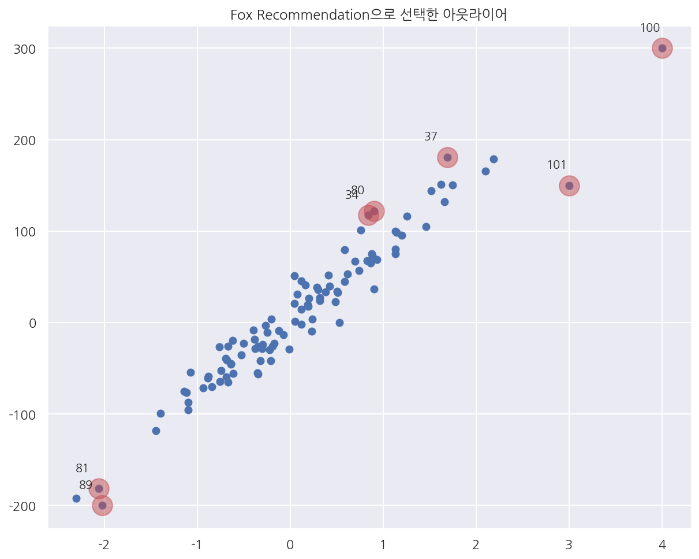
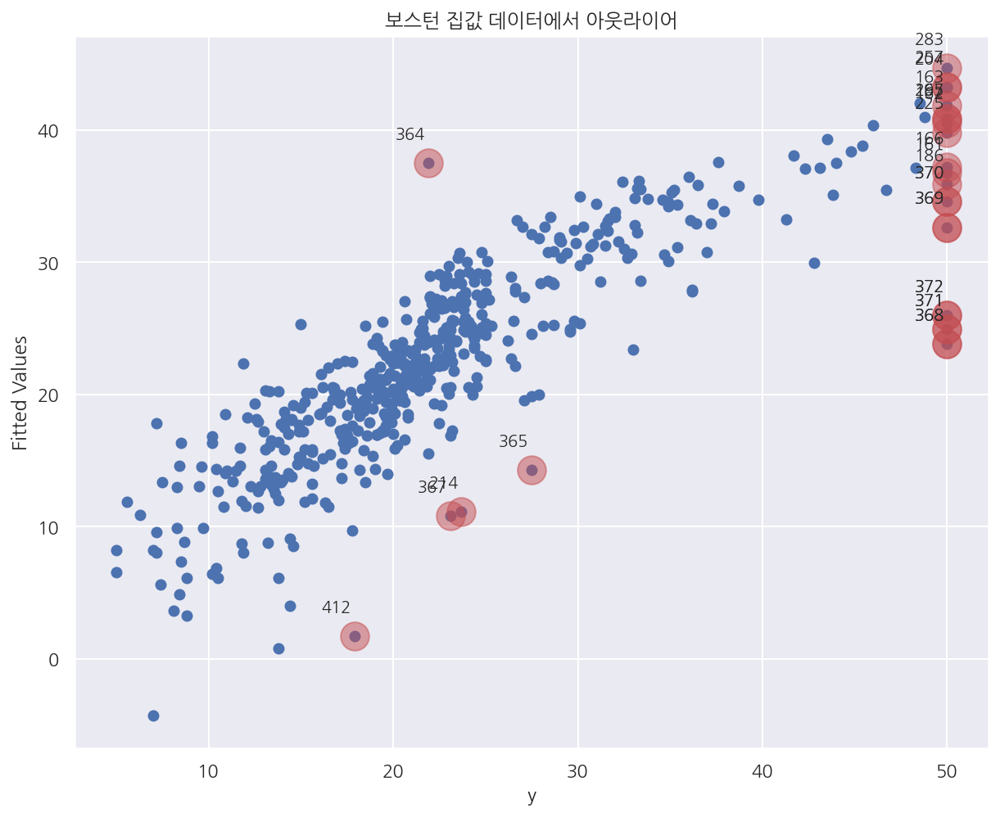

[데이터 사이언스 스쿨](https://datascienceschool.net/intro.html) 자료를 토대로 공부한 내용입니다.

실습과정에서 필요에 따라 내용의 누락 및 추가, 수정사항이 있습니다.

---


**기본 세팅**


```python
import numpy as np
import pandas as pd

import matplotlib as mpl
import matplotlib.pyplot as plt
import seaborn as sns

import warnings
```


```python
%matplotlib inline
%config InlineBackend.figure_format = 'retina'

mpl.rc('font', family='NanumGothic') # 폰트 설정
mpl.rc('axes', unicode_minus=False) # 유니코드에서 음수 부호 설정

# 차트 스타일 설정
sns.set(font="NanumGothic", rc={"axes.unicode_minus":False}, style='darkgrid')
plt.rc("figure", figsize=(10,8))

warnings.filterwarnings("ignore")
```

# 4.7 레버리지와 아웃라이어

## 4.7.1 레버리지

레버리지(leverage)란 실제 종속변수값 $y$가 예측치 $\hat{y}$ 에 미치는 영향을 나타낸 값을 의미한다.

$\hat{y}$ 은 다음과 같이 표현 가능하다. (여기서, $H =X(X^{T}X)^{-1}X^{T}$)

$$\hat{y} = X\hat{\beta} = X(X^{T}X)^{-1}X^{T}y = Hy$$

$i$번째 예측값 $\hat{y}_{i}$ 은 다음과 같이 표현 가능하다.

$$\hat{y}_{i} = \sum_{j=1}^n h_{ij}y_{j}$$

- 만약 H 행렬의 대각원소 $h_{ii} = 1$ 이고 나머지 성분이 모두 0이면 예측치는 종속변수값과 정확하게 일치한다.


- $0 \leq h_{ii} \leq 1$ 이며 $\sum_{i}h_{ii}=k$ 이다. 


- 일반적으로 모수의 갯수 $k$ 보다 표본의 크기 $n$이 더 크므로 모든 레버리지 값이 1이 될 수는 없다.


- $h_{ii}$의 평균은 $\dfrac{k}{n}$ 이며 일반적으로 이 값보다 2배이상 크면 레버리지가 크다고 한다.

## 4.7.2 statsmodels를 이용한 레버리지 계산


```python
from sklearn.datasets import make_regression
import statsmodels.api as sm

# 샘플 수: 100, 절편: 100, 독립변수 수: 1, 오차의 표준편차: 20
X0, y, coef = make_regression(n_samples=100, n_features=1, noise=20,
                              coef=True, random_state=1)

# 레버리지가 높은 가상의 데이터를 추가
data_100 = (4, 300)
data_101 = (3, 150)

X0 = np.vstack([X0, np.array([data_100[:1], data_101[:1]])])
y = np.hstack([y, [data_100[1], data_101[1]]])

# 상수항 결합
X = sm.add_constant(X0)

plt.scatter(X0, y)

plt.xlabel("x")
plt.ylabel("y")
plt.title("가상의 회귀분석용 데이터")

plt.show()
```


    

    


- 가상의 회귀분석용 데이터에 레버리지 값이 큰 2개의 값을 직접 추가하였다.


```python
# 모델 적합
model = sm.OLS(pd.DataFrame(y), pd.DataFrame(X))
result = model.fit()

# 레버리지 정보
influence = result.get_influence()
hat = influence.hat_matrix_diag

fig, axs = plt.subplots(1,2, figsize=(15, 8))
 
axs[0].stem(hat)
axs[0].axhline(0.02, c="g", ls="--") # 모수 갯수/표분 갯수: 2/102(대략 0.02)
axs[0].set_title("각 데이터의 레버리지 값")


axs[1].scatter(X0, y)
sm.graphics.abline_plot(model_results=result, ax=axs[1]) # 학습한 모델의 회귀선

idx = hat > 0.05
axs[1].scatter(X0[idx], y[idx], s=300, c="r", alpha=0.5) # 레버리지가 0.05보다 큰 경우
axs[1].set_title("회귀분석 결과와 레버리지 포인트")

plt.show()
```


    

    


- 회귀분석 결과에서 `get_influence()` 메소드에서 `hat_matrix_diag` 속성으로 레버리지 벡터의 값 얻을 수 있다.


- stem plot으로 레버리지 값을 확인하였고, scatter plot으로 레버리지가 0.05보다 큰 경우 빨간원으로 표시하였다.


```python
print("레버리지의 합:", round(hat.sum(),3))
print("레버리지의 평균:", round(hat.mean(),3))
```

    레버리지의 합: 2.0
    레버리지의 평균: 0.02
    

- 여기선 독립변수를 하나만 사용하므로 절편과 하나의 회귀계수로 모수가 2개이다. 


- 샘플은 처음 100개를 생성하고 직접 추가한 데이터까지 102개이다.


- 레버리지의 합은 모수의 갯수로 2, 평균은 모수의 갯수/ 표본의 갯수로 약 0.02로 잘 나타난다.

## 4.7.3 레버리지의 영향


```python
fig, axs = plt.subplots(1,2, figsize=(15, 6))

# 레버리지가 큰 값을 제거 후 적합
model2 = sm.OLS(y[:-2], X[:-2])
result2 = model2.fit()

axs[0].scatter(X0, y)

# 제거 전 회귀선
sm.graphics.abline_plot(model_results=result,
                        c="r", linestyle="--", ax=axs[0])

# 제거 후 회귀선
sm.graphics.abline_plot(model_results=result2,
                        c="g", alpha=0.7, ax=axs[0])

axs[0].plot(X0[-1], y[-1], marker='x', c="r", ms=20, mew=5) # 제거한 값 표시
axs[0].plot(X0[-2], y[-2], marker='x', c="r", ms=20, mew=5) # 제거한 값 표시

axs[0].legend(["레버리지가 큰 데이터를 포함한 경우", "레버리지가 큰 데이터를 포함하지 않은 경우"],
           loc="upper left")
axs[0].set_title("레버리지가 높은 데이터가 회귀분석에 미치는 영향")


# 레버리지가 작은 값을 제거 후 적합
model3 = sm.OLS(y[1:], X[1:])
result3 = model3.fit()

axs[1].scatter(X0, y)

# 제거 전 회귀선
sm.graphics.abline_plot(model_results=result,
                        c="r", linestyle="--", ax=axs[1])

# 제거 전 회귀선
sm.graphics.abline_plot(model_results=result3,
                        c="g", alpha=0.7, ax=axs[1])

axs[1].plot(X0[0], y[0], marker='x', c="r", ms=20, mew=5) # 제거한 값 표시

axs[1].legend(["레버리지가 작은 데이터를 포함한 경우", "레버리지가 작은 데이터를 포함하지 않은 경우"],
           loc="upper left")
axs[1].set_title("레버리지가 작은 데이터가 회귀분석에 미치는 영향")

plt.show()
```


    

    


- 레버리지가 높은 데이터를 제거한 경우 모형이 많이 바뀌었으나 작은 데이터를 제거한 경우 큰 차이가 없었다.


- 레버리지가 큰 데이터의 포함유무에 따라 모형이 달라지는 것을 확인 할 수 있다.

## 4.7.4 아웃라이어

모형에서 설명하고 있는 데이터와 동떨어진 값을 가지는 데이터, 즉 잔차가 큰 데이터를 아웃라이어(outlier)라고 한다. 


잔차의 크기는 독립 변수의 영향을 받으므로 아웃라이어를 찾으려면 이 영향을 제거한 표준화 잔차로 확인하여야 한다.

**표준화 잔차**

잔차는 다음과 같이 표현할 수 있다.

$$e = y - \hat{y} = y- Hy = X\beta + \epsilon - HX\beta - H\epsilon = (I-H)\epsilon$$

그리고 잔차의 분산은 다음과 같다.

$$Cov(e) = \sigma^{2}(I-H), \quad Var(e_{i}) = \sigma^{2}(1-h_{ii}) \ \approx \ MSE(1-h_{ii})$$

이를 이용하면 표준화 잔차는 다음과 같다.

$$r_{i} = \dfrac{e_{i}}{\sqrt{MSE(1-h_{ii})}}$$

## 4.7.5 statsmodels를 이용한 표준화 잔차 계산

**잔차**


```python
plt.figure(figsize=(15, 2))
plt.stem(result.resid)
plt.title("각 데이터의 잔차")
plt.show()
```


    

    


- 회귀분석 결과의 `resid` 속성을 이용해 잔차를 얻을 수 있다.

**표준화 잔차**


```python
plt.figure(figsize=(15, 2))
plt.stem(result.resid_pearson)
plt.axhline(3, c="g", ls="--")
plt.axhline(-3, c="g", ls="--")
plt.title("각 데이터의 표준화 잔차")
plt.show()
```


    

    


- 회귀분석 결과의 `resid_pearson` 속성을 이용해 표준화 잔차를 얻을 수 있다.


- 일반적으로 표준화 잔차가 2~4보다 크면 아웃라이어로 판단한다.


- 아마 2~4를 기준으로 하는 이유는 표준정규분포의 꼬리부분에 가까워서인 듯 하다.

## 4.7.6 Cook's Distance

잔차와 레버리지를 동시에 보기위한 기준으로 Cook’s Distance를 사용하며 다음과 같이 정의된다.

$$ D_i = \frac{e_i^2}{k\text{MSE}}\left[\frac{h_{ii}}{(1-h_{ii})^2}\right] = \frac{r_i^2}{k}\left[\frac{h_{ii}}{(1-h_{ii})}\right]$$

- $k$는 모수의 갯수(상수항 포함)


- 레버리지가 커지거나 잔차의 크기가 커지면 Cook’s Distance 값이 커진다.


- $D_i$에 대한 기준은 다양하지만 $D_i$가 $F(k, n-k)$ 분포를 따르므로 $D_i$가 $F_{0.5}(k, n-k)$ 보다 크면 아웃라이어로 판단한다.


- 혹은 n이 커질수록 $D_i$가 1에 가까워지므로 1보다 크면 아웃라이어로 판단하기도 한다.


- Fox’ Outlier Recommendation은 $D_i$가 $\dfrac{4}{n-k-1}$보다 클 때 아웃라이어로 판단한다.


```python
sm.graphics.plot_leverage_resid2(result)
plt.show()
```


    

    


- `graphics.plot_leverage_resid2()`에 회귀분석 결과를 입력하면 $r_i^2$과 $h_{ii}$를 표시할 수 있다.


- 라벨이 표시된 데이터들이 레버리지가 큰 아웃라이어이다.


- 직접 추가했었던 101, 102번째 값들 역시 확인 된다.


- 레버리지가 큰 데이터의 기준(여기선 약 0.02의 2배), 아웃라이어의 기준(2~4보다 큰 잔차)에서 벗어난 데이터가 잘 표현된다.


```python
sm.graphics.influence_plot(result, plot_alpha=0.3)
plt.show()
```


    

    


- `graphics.influence_plot()`을 이용하여 $h_{ii}$와 $r_i$를 표시할 수 있으며 $D_i$를 버블크기로 표시한다.


```python
from statsmodels.graphics import utils

# 레버리지 정보
influence = result.get_influence()

n = len(y) # 샘플 갯수
k = influence.k_vars # 모수 갯수
fox_cr = 4 / (n - k - 1) # criteria 설정

# 쿡의 거리 반환
cooks_d2, pvals = influence.cooks_distance

idx = np.where(cooks_d2 > fox_cr)[0] # criteria보다 큰 값들의 위치 (이상값의 위치)

ax = plt.subplot()

plt.scatter(X0, y)
plt.scatter(X0[idx], y[idx], s=300, c="r", alpha=0.5)

# 데이터 라벨
utils.annotate_axes(range(len(idx)), idx,
                    list(zip(X0[idx], y[idx])), [(-20, 15)] * len(idx), size="small", ax=ax)

plt.title("Fox Recommendation으로 선택한 아웃라이어")

plt.show()
```


    

    


- Fox Recommendation으로 선택한 아웃라이어를 시각화하여 나타냈다.

## 4.7.7 보스턴 집값 예측 예제


```python
from sklearn.datasets import load_boston
boston = load_boston()

# 데이터 불러오기
dfX0 = pd.DataFrame(boston.data, columns=boston.feature_names)
dfX = sm.add_constant(dfX0)
dfy = pd.DataFrame(boston.target, columns=["MEDV"])

# 회귀모형 적합
model_boston = sm.OLS(dfy, dfX)
result_boston = model_boston.fit()
pred = result_boston.predict(dfX) # 예측값

# 영향력 확인: 쿡의 거리
influence_boston = result_boston.get_influence()
cooks_d2, pvals = influence_boston.cooks_distance

n = len(y)
k = influence.k_vars # 모수의 수
fox_cr = 4 / (n - k - 1)
idx = np.where(cooks_d2 > fox_cr)[0] 
idx = np.hstack([idx, np.where(boston.target == 50)[0]]) # 이상값 위치에 MEDV가 50인 경우 추가

ax = plt.subplot()

plt.scatter(dfy, pred)
plt.scatter(dfy.iloc[idx], pred[idx], s=300, c="r", alpha=0.5)

utils.annotate_axes(range(len(idx)), idx,
                    list(zip(dfy.MEDV[idx], pred[idx])), [(-20, 15)] * len(idx), size="small", ax=ax)

plt.xlabel("y")
plt.ylabel("Fitted Values")
plt.title("보스턴 집값 데이터에서 아웃라이어")

plt.show()
```


    

    

