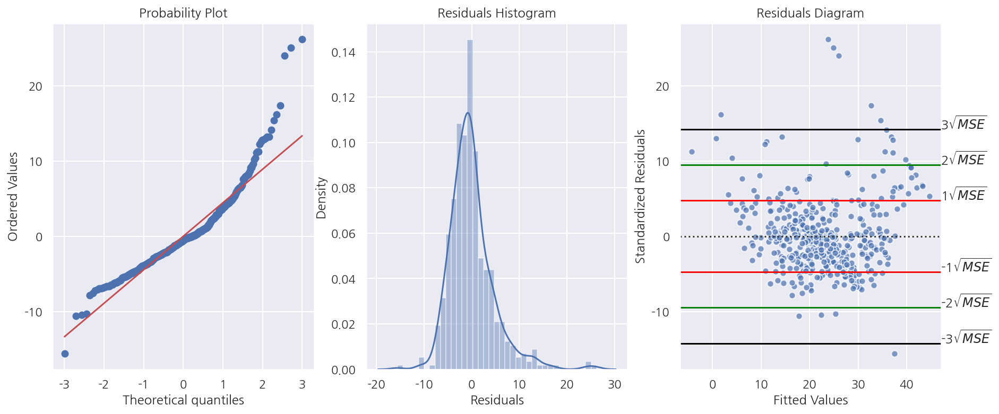
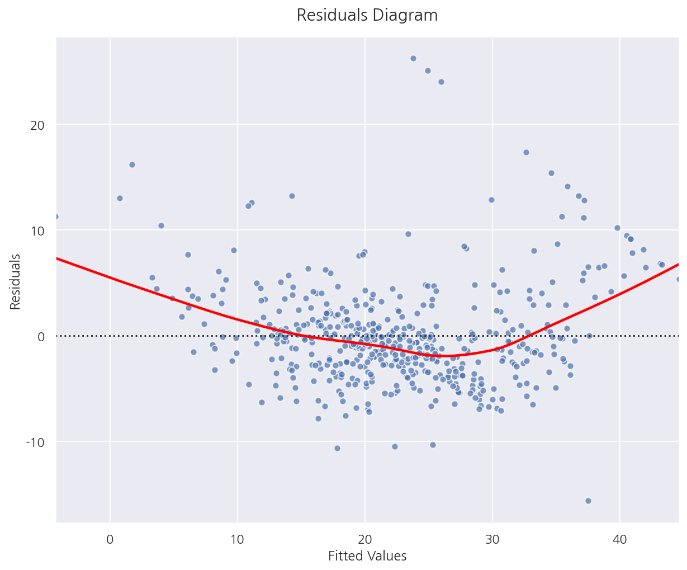
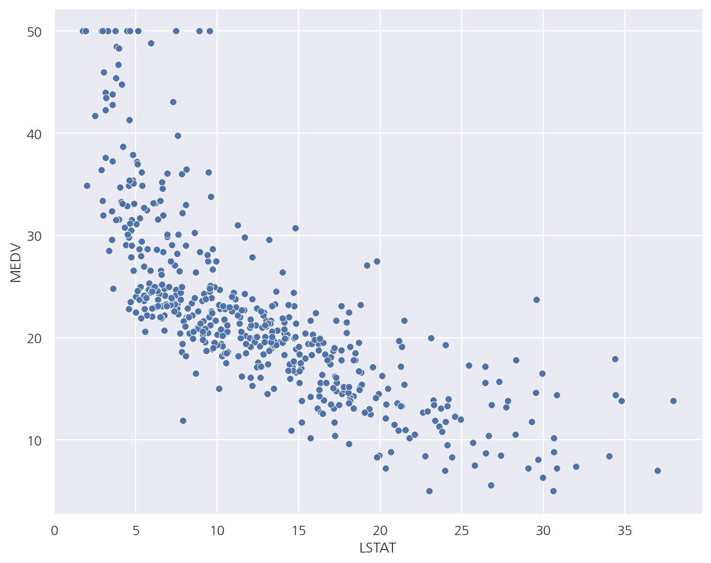
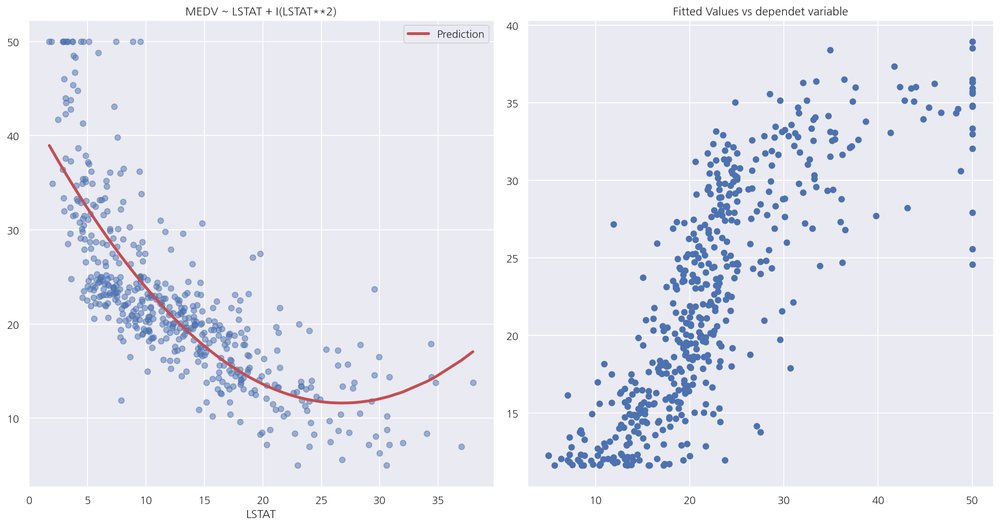
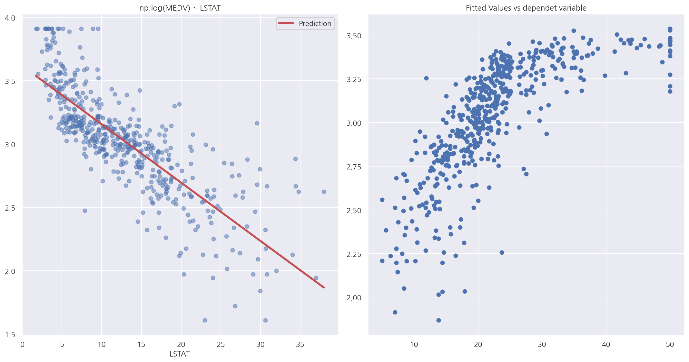

[데이터 사이언스 스쿨](https://datascienceschool.net/intro.html) 자료를 토대로 공부한 내용입니다.

실습과정에서 필요에 따라 내용의 누락 및 추가, 수정사항이 있습니다.

---


**기본 세팅**


```python
import numpy as np
import pandas as pd

import matplotlib as mpl
import matplotlib.pyplot as plt
import seaborn as sns

import warnings
```


```python
%matplotlib inline
%config InlineBackend.figure_format = 'retina'

mpl.rc('font', family='NanumGothic') # 폰트 설정
mpl.rc('axes', unicode_minus=False) # 유니코드에서 음수 부호 설정

# 차트 스타일 설정
sns.set(font="NanumGothic", rc={"axes.unicode_minus":False}, style='darkgrid')
plt.rc("figure", figsize=(10,8))

warnings.filterwarnings("ignore")
```

# 4.9 모형의 진단과 수정

**Boston 회귀결과**


```python
from sklearn.datasets import load_boston
import statsmodels.api as sm

boston = load_boston()

dfX0 = pd.DataFrame(boston.data, columns=boston.feature_names)
dfX = sm.add_constant(dfX0) # 상수항 추가
dfy = pd.DataFrame(boston.target, columns=["MEDV"])
df = pd.concat([dfX, dfy], axis=1)

model_boston = sm.OLS(dfy, dfX)
result_boston = model_boston.fit()
print(result_boston.summary())
```

                                OLS Regression Results                            
    ==============================================================================
    Dep. Variable:                   MEDV   R-squared:                       0.741
    Model:                            OLS   Adj. R-squared:                  0.734
    Method:                 Least Squares   F-statistic:                     108.1
    Date:                Sat, 12 Jun 2021   Prob (F-statistic):          6.72e-135
    Time:                        00:05:03   Log-Likelihood:                -1498.8
    No. Observations:                 506   AIC:                             3026.
    Df Residuals:                     492   BIC:                             3085.
    Df Model:                          13                                         
    Covariance Type:            nonrobust                                         
    ==============================================================================
                     coef    std err          t      P>|t|      [0.025      0.975]
    ------------------------------------------------------------------------------
    const         36.4595      5.103      7.144      0.000      26.432      46.487
    CRIM          -0.1080      0.033     -3.287      0.001      -0.173      -0.043
    ZN             0.0464      0.014      3.382      0.001       0.019       0.073
    INDUS          0.0206      0.061      0.334      0.738      -0.100       0.141
    CHAS           2.6867      0.862      3.118      0.002       0.994       4.380
    NOX          -17.7666      3.820     -4.651      0.000     -25.272     -10.262
    RM             3.8099      0.418      9.116      0.000       2.989       4.631
    AGE            0.0007      0.013      0.052      0.958      -0.025       0.027
    DIS           -1.4756      0.199     -7.398      0.000      -1.867      -1.084
    RAD            0.3060      0.066      4.613      0.000       0.176       0.436
    TAX           -0.0123      0.004     -3.280      0.001      -0.020      -0.005
    PTRATIO       -0.9527      0.131     -7.283      0.000      -1.210      -0.696
    B              0.0093      0.003      3.467      0.001       0.004       0.015
    LSTAT         -0.5248      0.051    -10.347      0.000      -0.624      -0.425
    ==============================================================================
    Omnibus:                      178.041   Durbin-Watson:                   1.078
    Prob(Omnibus):                  0.000   Jarque-Bera (JB):              783.126
    Skew:                           1.521   Prob(JB):                    8.84e-171
    Kurtosis:                       8.281   Cond. No.                     1.51e+04
    ==============================================================================
    
    Notes:
    [1] Standard Errors assume that the covariance matrix of the errors is correctly specified.
    [2] The condition number is large, 1.51e+04. This might indicate that there are
    strong multicollinearity or other numerical problems.
    

## 4.9.1 오차의 정규성


```python
import scipy as sp

figure, axs = plt.subplots(1,3, figsize = (15,6))

# 잔차 Q-Q  plot
# sm.ProbPlot(fit1.resid).qqplot(line="s",ax=axs[0])
sp.stats.probplot(result_boston.resid, dist='norm', fit=True, plot=axs[0])

# 잔차의 히스토그램
sns.distplot(x = result_boston.resid , ax = axs[1])
axs[1].set_xlabel("Residuals")
axs[1].set_title("Residuals Histogram")

# 잔차도
yhat = result_boston.fittedvalues
temp = pd.concat( [ yhat, dfy ], axis = 1)
temp.columns = [ "yhat", "MEDV" ]

sns.residplot(x = "yhat", y = "MEDV", 
              data = temp, 
              scatter_kws = {'edgecolor':"white", "alpha":0.7},
              line_kws = {"color":"red"},
              ax = axs[2])

MSE_sq = np.sqrt(result_boston.mse_resid)

# 잔차도 MSE line
for i, c in enumerate(["red", "green", "black"]):
    axs[2].axhline( (i+1) * MSE_sq, color = c)
    axs[2].axhline( -(i+1) * MSE_sq, color = c)
    
    axs[2].text(47, (i+1) * MSE_sq, f"{i+1}"r'${}\sqrt{MSE}$')
    axs[2].text(47, -(i+1) * MSE_sq, f"-{i+1}"r'${}\sqrt{MSE}$')

axs[2].set_xlabel("Fitted Values")
axs[2].set_ylabel("Standardized Residuals")
axs[2].set_title("Residuals Diagram")


plt.show()
```


    

    


- 잔차 Q-Q Plot을 보았을때 45도 선을 벗어나는 케이스가 많다.


- 잔차 히스토그램에선 잔차가 큰 값들이 다수 보여 오른쪽으로 꼬리가 생겨 정규분포로 보기 어렵다.


```python
r = result_boston.resid

r1 = r[ (r > -MSE_sq) & (r < MSE_sq)].count() / r.count() * 100
r2 = r[ (r > -2*MSE_sq) & (r < 2*MSE_sq)].count() / r.count() * 100
r3 = r[ (r > -3*MSE_sq) & (r < 3*MSE_sq)].count() / r.count() * 100

print(f"루트 1MSE 구간에 포함된 잔차 비율: {r1:1.2f}%")
print(f"루트 2MSE 구간에 포함된 잔차 비율: {r2:1.2f}%")
print(f"루트 3MSE 구간에 포함된 잔차 비율: {r3:1.2f}%")
```

    루트 1MSE 구간에 포함된 잔차 비율: 78.06%
    루트 2MSE 구간에 포함된 잔차 비율: 95.26%
    루트 3MSE 구간에 포함된 잔차 비율: 98.62%
    

- 잔차가 정규분포를 따른다면 대략적으로 

    $\pm\sqrt{MSE}$ 안에 전체 잔차의 68%,
    
    $\pm2\sqrt{MSE}$ 안에 전체 잔차의 95%,
    
    $\pm3\sqrt{MSE}$ 안에 전체 잔차의 99%가 포함된다.

    대부분 만족을 하지만 몇 개의 아웃라이어가 확인된다.


```python
omni_result = sm.stats.omni_normtest(result_boston.resid)

print('statistic: {0:.3f}'.format(omni_result.statistic))
print('p-value: {0:.3f}'.format(omni_result.pvalue))
```

    statistic: 178.041
    p-value: 0.000
    

- 정규성 검정에서도 잔차가 정규분포를 따르지 않는다.


- 이는 회귀분석 결과에서도 확인 가능하다.

## 4.9.2 오차의 등분산성

선형 회귀 모형에서는 종속 변수 값의 분산이 독립 변수의 값과 상관없이 고정된 값을 가져야한다. 

그러나 실제 데이터는 독립 변수 값의 크기가 커지면 종속 변수 값의 분산도 커지는 이분산성 문제가 발생한다. 

종속변수를 로그 변환한 트랜스로그 모형을 사용하면 이분산성 문제가 해결되는 경우도 있다.


```python
fig = plt.figure(figsize= (10,8))

p = sns.residplot(x = "yhat", y = "MEDV", 
                  data = temp, 
                  scatter_kws = {'edgecolor':"white", "alpha":0.7},
                  lowess = True,
                  line_kws = {"color":"red"})

p.set_title("Residuals Diagram", fontsize=15, y=1.02)
p.set(xlabel= "Fitted Values", ylabel = "Residuals")

plt.show()
```


    

    


- 등분산성이 만족된다면 Fitted Values(혹은 독립변수)의 값과 상관없이 같은 퍼짐 정도를 가져야한다. 

    즉, Fitted Values값에 상관없이 랜덤하게 분포되어 있어야 한다.
    

- 현재 잔차도로 확인하였을 때는 랜덤하게 분포되어 있는 것으로 보이며 등분산성을 만족하는 것으로 판단된다.

## 4.9.3 오차의 독립성

Durbin-Watson 검정통계량

- 0에 가까울수록 잔차들은 양의 자기상관을 가지며, 


- 2에 가까울수록 자기상관이 없어지며, 


- 2보다 크고 4에 가까워질수록 잔차들은 음의 자기상관을 갖는다. 


- 일반적으로 1.5 ~ 2.5사이 값이면 자기상관관계가 없어 독립이라고 판단한다.

자기상관관계가 있으면 MSE는 오차분산을 과소 추정하게 되어 t값, F값, 결정계수 값이 크게 나와 귀무가설을 기각하게 되어

실제로 유의미하지 않은 결과를 유의미한 결과로 왜곡하게 된다.


```python
from statsmodels.stats.stattools import durbin_watson

print(f"D-W 통계량: {round(durbin_watson(result_boston.resid),3)}")
```

    D-W 통계량: 1.078
    

- D-W 통계량이 0에 가까워 양의 자기상관관계가 있다고 판단된다.


- 이는 회귀분석 결과에서도 확인 가능하다.

## 4.9.4 비선형 변형

독립변수와 종속변수간의 관계가 비선형이라면 독립변수 혹은 종속변수를 비선형 변환 할 수 있다.

**독립변수 변환**


```python
from sklearn.datasets import load_boston

boston = load_boston()
dfX = pd.DataFrame(boston.data, columns=boston.feature_names)
dfy = pd.DataFrame(boston.target, columns=["MEDV"])
df_boston = pd.concat([dfX, dfy], axis=1)

sns.scatterplot(x="LSTAT", y="MEDV", data=df_boston)
plt.show()
```


    

    


- LSTAT과 MEDV의 산점도를 보았을 때 비선형관계를 확인 할 수 있다.


```python
model2 = sm.OLS.from_formula("MEDV ~ LSTAT + I(LSTAT**2)", data=df_boston)
result2 = model2.fit()
print(result2.summary())
```

                                OLS Regression Results                            
    ==============================================================================
    Dep. Variable:                   MEDV   R-squared:                       0.641
    Model:                            OLS   Adj. R-squared:                  0.639
    Method:                 Least Squares   F-statistic:                     448.5
    Date:                Sat, 12 Jun 2021   Prob (F-statistic):          1.56e-112
    Time:                        00:05:05   Log-Likelihood:                -1581.3
    No. Observations:                 506   AIC:                             3169.
    Df Residuals:                     503   BIC:                             3181.
    Df Model:                           2                                         
    Covariance Type:            nonrobust                                         
    =================================================================================
                        coef    std err          t      P>|t|      [0.025      0.975]
    ---------------------------------------------------------------------------------
    Intercept        42.8620      0.872     49.149      0.000      41.149      44.575
    LSTAT            -2.3328      0.124    -18.843      0.000      -2.576      -2.090
    I(LSTAT ** 2)     0.0435      0.004     11.628      0.000       0.036       0.051
    ==============================================================================
    Omnibus:                      107.006   Durbin-Watson:                   0.921
    Prob(Omnibus):                  0.000   Jarque-Bera (JB):              228.388
    Skew:                           1.128   Prob(JB):                     2.55e-50
    Kurtosis:                       5.397   Cond. No.                     1.13e+03
    ==============================================================================
    
    Notes:
    [1] Standard Errors assume that the covariance matrix of the errors is correctly specified.
    [2] The condition number is large, 1.13e+03. This might indicate that there are
    strong multicollinearity or other numerical problems.
    

- `I()` 연산자를 이용해 독립변수 LSTAT의 다항식을 포함하였다.


- 알아두어야할 점은 독립변수가 선형이 아니어도 위 회귀분석은 선형 회귀 모형이다.


- 선형 회귀 모형은 회귀계수를 기준으로 말하는 것임을 알아두자.


```python
y_hat2 = result2.predict(df_boston)
df2 = pd.concat([y_hat2, df_boston.LSTAT], axis=1).sort_values("LSTAT")
df2.columns = ["Prediction", "LSTAT"]

fig, axs = plt.subplots(1,2, figsize=(15,8))

# 독립변수와 종속변수 산점도 및 회귀식
axs[0].plot(df_boston.LSTAT, df_boston.MEDV, "bo", alpha=0.5)
df2.plot(x="LSTAT", y="Prediction", style="r-", lw=3, ax=axs[0])
axs[0].set_title("MEDV ~ LSTAT + I(LSTAT**2)")

# 종속변수와 예측치 산점도
axs[1].scatter(boston.target, y_hat2)
axs[1].set_title("Fitted Values vs dependet variable")

plt.tight_layout()
plt.show()
```


    

    


- 산점도를 보면 예측치가 어느정도 데이터의 분포에 맞게 잘 적합된 것으로 보인다.


- 종속변수와 예측치의 산점를 보면 어느정도 선형적인 모습이 나타난다.

**종속변수 변환**


```python
model3 = sm.OLS.from_formula("np.log(MEDV) ~ LSTAT", data=df_boston)
result3 = model3.fit()
print(result3.summary())
```

                                OLS Regression Results                            
    ==============================================================================
    Dep. Variable:           np.log(MEDV)   R-squared:                       0.648
    Model:                            OLS   Adj. R-squared:                  0.647
    Method:                 Least Squares   F-statistic:                     928.1
    Date:                Sat, 12 Jun 2021   Prob (F-statistic):          2.23e-116
    Time:                        00:05:05   Log-Likelihood:               -0.57634
    No. Observations:                 506   AIC:                             5.153
    Df Residuals:                     504   BIC:                             13.61
    Df Model:                           1                                         
    Covariance Type:            nonrobust                                         
    ==============================================================================
                     coef    std err          t      P>|t|      [0.025      0.975]
    ------------------------------------------------------------------------------
    Intercept      3.6176      0.022    164.654      0.000       3.574       3.661
    LSTAT         -0.0461      0.002    -30.465      0.000      -0.049      -0.043
    ==============================================================================
    Omnibus:                       27.562   Durbin-Watson:                   0.909
    Prob(Omnibus):                  0.000   Jarque-Bera (JB):               50.719
    Skew:                           0.351   Prob(JB):                     9.69e-12
    Kurtosis:                       4.383   Cond. No.                         29.7
    ==============================================================================
    
    Notes:
    [1] Standard Errors assume that the covariance matrix of the errors is correctly specified.
    

- 이번엔 독립변수 수정이 아닌 종속변수 MEDV를 로그 변환하였다.


```python
y_hat3 = result3.predict(df_boston)
df2 = pd.concat([y_hat3, df_boston.LSTAT], axis=1).sort_values("LSTAT")
df2.columns = ["Prediction", "LSTAT"]

fig, axs = plt.subplots(1,2, figsize=(15,8))

# 독립변수와 종속변수 산점도 및 회귀식
axs[0].plot(df_boston.LSTAT, np.log(df_boston.MEDV), "bo", alpha=0.5)
df2.plot(x="LSTAT", y="Prediction", style="r-", lw=3, ax=axs[0])
axs[0].set_title("np.log(MEDV) ~ LSTAT")

# 종속변수와 예측치 산점도
axs[1].scatter(boston.target, y_hat3)
axs[1].set_title("Fitted Values vs dependet variable")

plt.tight_layout()
plt.show()
```


    

    


- 산점도를 보면 예측치가 어느정도 데이터의 분포에 맞게 잘 적합된 것으로 보이며 종속변수의 변화로 인해 선형관계가 보인다.


- 종속변수와 예측치의 산점를 보면 비선형 관계도 보이지만 어느정도 선형적인 모습이 나타난다.
