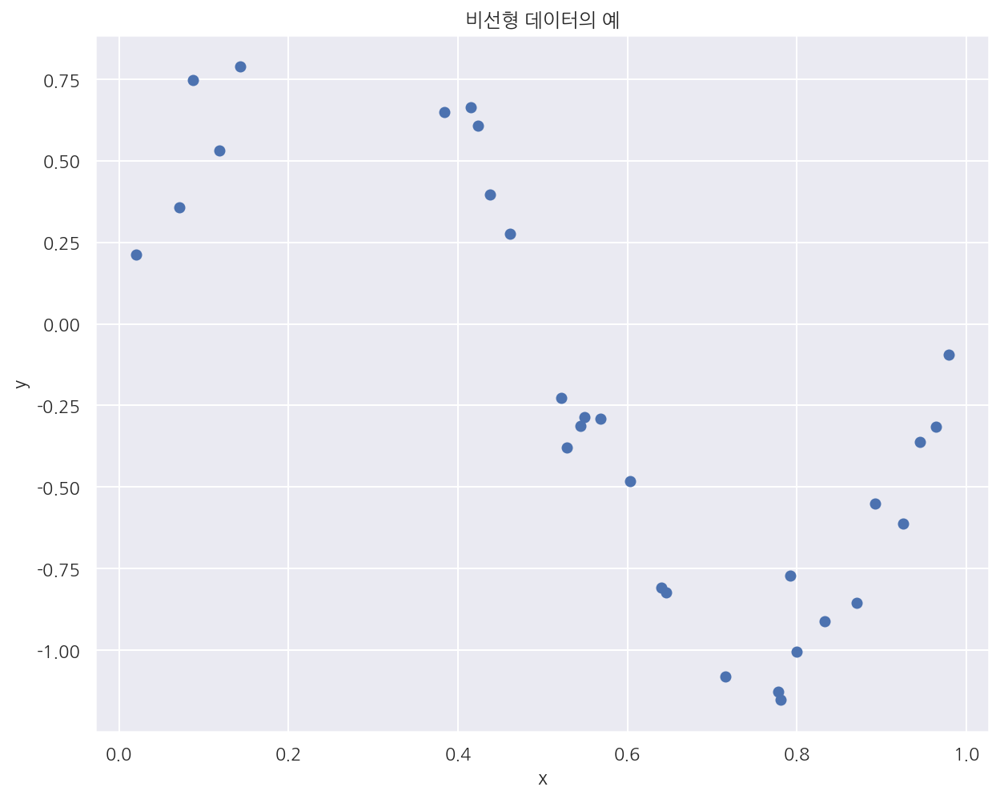
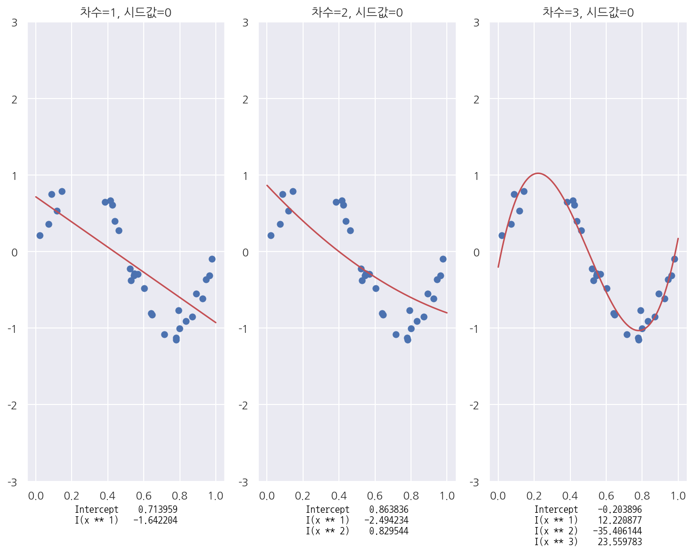
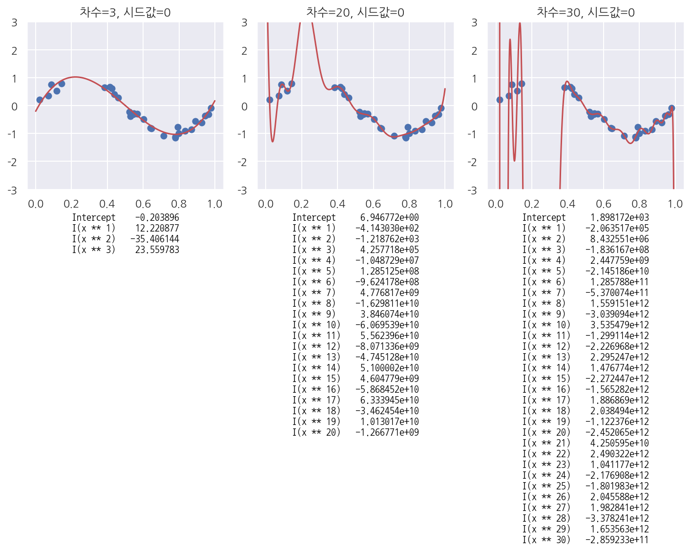
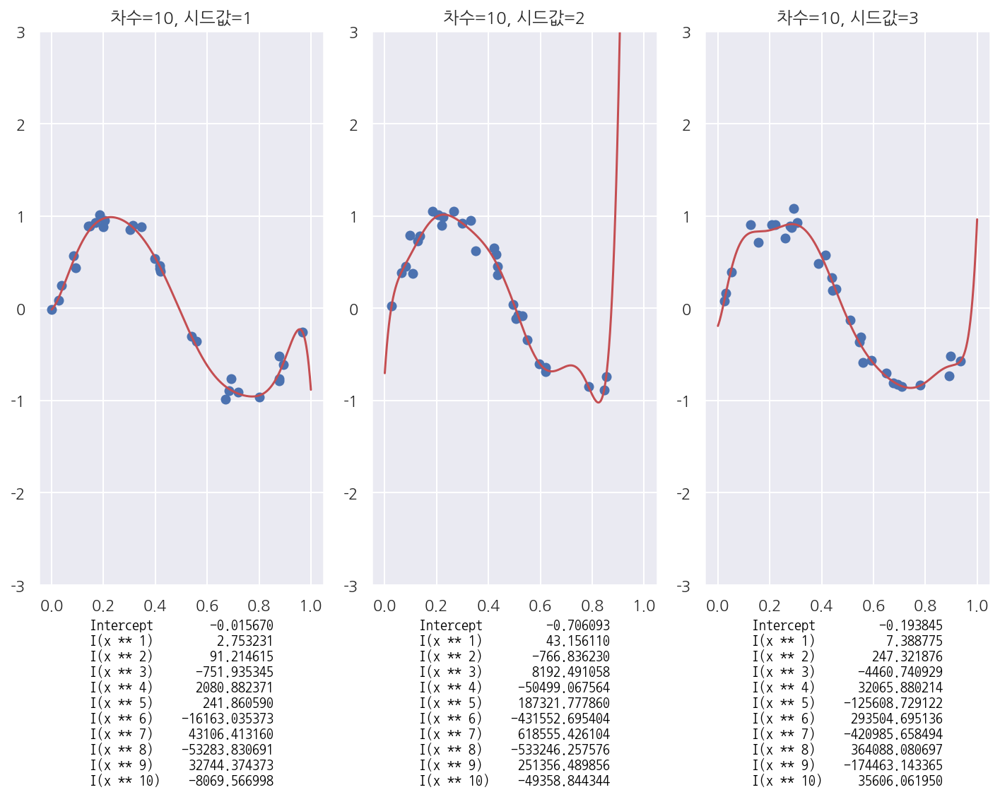

[데이터 사이언스 스쿨](https://datascienceschool.net/intro.html) 자료를 토대로 공부한 내용입니다.

실습과정에서 필요에 따라 내용의 누락 및 추가, 수정사항이 있습니다.

---


**기본 세팅**


```python
import numpy as np
import pandas as pd

import matplotlib as mpl
import matplotlib.pyplot as plt
import seaborn as sns

import warnings
```


```python
%matplotlib inline
%config InlineBackend.figure_format = 'retina'

mpl.rc('font', family='NanumGothic') # 폰트 설정
mpl.rc('axes', unicode_minus=False) # 유니코드에서 음수 부호 설정

# 차트 스타일 설정
sns.set(font="NanumGothic", rc={"axes.unicode_minus":False}, style='darkgrid')
plt.rc("figure", figsize=(10,8))

warnings.filterwarnings("ignore")
```

# 5.1 과최적화(Overfitting)

모형을 특정 샘플 데이터에 대해 과도하게 최적화하는 것을 과최적화(overfitting)라고 한다.

과최적화 발생조건:

- 독립 변수 데이터 갯수에 비해 모형 모수의 수가 과도하게 크거나


- 독립 변수 데이터가 서로 독립이 아닌 경우에 발생한다.


과최적화 문제점:

- 트레이닝 데이터에 사용되지 않은 새로운 독립 변수 값을 입력하면 오차가 커진다. (cross-validation 오차)


- 샘플이 조금만 변화해도 회귀계수의 값이 크게 달라진다. (추정의 부정확함)

**비선형 데이터 생성**


```python
def make_nonlinear(seed=0):
    np.random.seed(seed)
    n_samples = 30
    X = np.sort(np.random.rand(n_samples)) # uniform random sample
    y = np.sin(2 * np.pi * X) + np.random.randn(n_samples) * 0.1 # 2*sin(pi)*x + z random sample*0.1
    X = X[:, np.newaxis] # 2차원 배열
    return (X, y)

X, y = make_nonlinear()
plt.scatter(X, y)
plt.xlabel("x")
plt.ylabel("y")
plt.title("비선형 데이터의 예")
plt.show()
```


    

    


**다항회귀모형**


```python
import statsmodels.api as sm

def polyreg(degree, seed=0, ax=None):
    # 비선형 데이터 생성
    X, y = make_nonlinear(seed)

    dfX = pd.DataFrame(X, columns=["x"])
    dfX = sm.add_constant(dfX)
    dfy = pd.DataFrame(y, columns=["y"])
    df = pd.concat([dfX, dfy], axis=1)

    model_str = "y ~ "
    
    # 다항식 formula
    for i in range(degree):
        if i == 0:
            prefix = ""
        else:
            prefix = " + "
        model_str += prefix + "I(x**{})".format(i + 1)
        
    # 모형 적합
    model = sm.OLS.from_formula(model_str, data=df)
    result = model.fit()
    
    # 산점도 및 회귀식
    if ax:
        ax.scatter(X, y)
        
        xx = np.linspace(0, 1, 1000)
        dfX_new = pd.DataFrame(xx[:, np.newaxis], columns=["x"])
        
        ax.plot(xx, result.predict(dfX_new), "r-")
        
        ax.set_ylim(-3, 3)
        ax.set_title("차수={}, 시드값={}".format(degree, seed))
        xlabel = "\n".join(str(result.params).split("\n")[:-1])
        
        font = {'family': 'NanumGothicCoding', 'color':  'black', 'size': 10}
        ax.set_xlabel(xlabel, fontdict=font)

    return result
```


```python
ax1 = plt.subplot(131)
polyreg(1, ax=ax1)

ax2 = plt.subplot(132)
polyreg(2, ax=ax2)

ax3 = plt.subplot(133)
polyreg(3, ax=ax3)

plt.tight_layout()
plt.show()
```


    

    


- 실제 자료가 비선형 모형일 때 다항회귀모형이 더 잘 적합한 모형임을 알 수 있다.

**모수를 늘린 경우**


```python
ax1 = plt.subplot(131)
polyreg(3, ax=ax1)

ax2 = plt.subplot(132)
polyreg(20, ax=ax2)

ax3 = plt.subplot(133)
polyreg(30, ax=ax3)

plt.tight_layout()
plt.show()
```


    

    


- 모수의 수(다항식의 수 = 새로운 독립변수)를 늘림에 따라 예측 오차가 커짐을 알 수 있다.

**샘플이 바뀌는 경우**


```python
ax1 = plt.subplot(131)
polyreg(10, seed=1, ax=ax1)

ax2 = plt.subplot(132)
polyreg(10, seed=2,  ax=ax2)

ax3 = plt.subplot(133)
polyreg(10, seed=3,  ax=ax3)

plt.tight_layout()
plt.show()
```


    

    


- 같은 모형이지만 샘플이 바뀔 때 마다 회귀계수가 크게 달라짐을 확인 할 수 있다.
