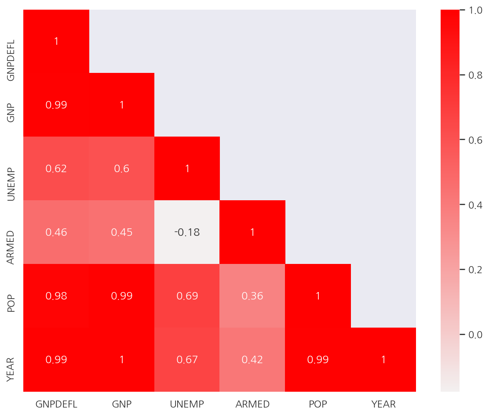
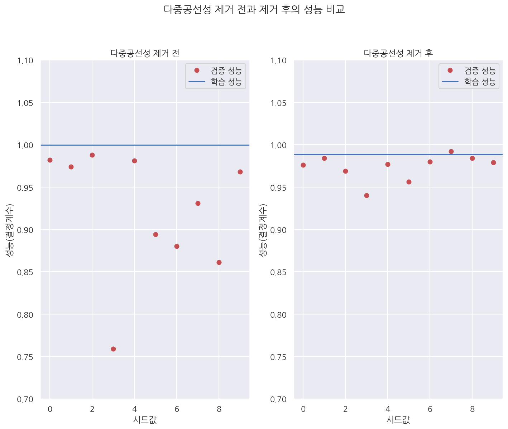

[데이터 사이언스 스쿨](https://datascienceschool.net/intro.html) 자료를 토대로 공부한 내용입니다.

실습과정에서 필요에 따라 내용의 누락 및 추가, 수정사항이 있습니다.

---


**기본 세팅**


```python
import numpy as np
import pandas as pd

import matplotlib as mpl
import matplotlib.pyplot as plt
import seaborn as sns

import warnings
```


```python
%matplotlib inline
%config InlineBackend.figure_format = 'retina'

mpl.rc('font', family='NanumGothic') # 폰트 설정
mpl.rc('axes', unicode_minus=False) # 유니코드에서 음수 부호 설정

# 차트 스타일 설정
sns.set(font="NanumGothic", rc={"axes.unicode_minus":False}, style='darkgrid')
plt.rc("figure", figsize=(10,8))

warnings.filterwarnings("ignore")
```

# 5.3 다중공선성과 변수선택

다중공선성: 독립 변수의 일부가 다른 독립 변수의 조합으로 표현될 수 있는 경우로서 **즉, 선형 독립이 아닌 경우이다.**

이는 독립 변수의 공분산 행렬이 full rank 이어야 한다는 조건을 침해한다.

**예제 데이터**


```python
from statsmodels.datasets.longley import load_pandas

dfy = load_pandas().endog # 종속변수 이름: TOTEMP
dfX = load_pandas().exog
df = pd.concat([dfy, dfX], axis=1)

corr_M = dfX.corr() # 독립변수 상관관계
mask = np.array(corr_M)
mask[np.tril_indices_from(mask)] = False

plt.figure(figsize= (10,8))

sns.heatmap(corr_M, 
            cmap = sns.light_palette("red", as_cmap=True),
            annot = True, 
            mask = mask)

plt.show()
```


    

    


- 독립변수간의 상관관계가 강한 경우가 많다. 즉, 다중공선성이 존재한다.

## 5.3.1 다중공선성 문제점: 조건수 증가


```python
from sklearn.model_selection import train_test_split
import statsmodels.api as sm

def get_model1(seed):
    df_train, df_test = train_test_split(df, test_size=0.5, random_state=seed)
    model = sm.OLS.from_formula("TOTEMP ~ GNPDEFL + POP + GNP + YEAR + ARMED + UNEMP", data=df_train)
    return df_train, df_test, model.fit()


df_train, df_test, result1 = get_model1(3)
print(result1.summary())
```

                                OLS Regression Results                            
    ==============================================================================
    Dep. Variable:                 TOTEMP   R-squared:                       1.000
    Model:                            OLS   Adj. R-squared:                  0.997
    Method:                 Least Squares   F-statistic:                     437.5
    Date:                Sat, 12 Jun 2021   Prob (F-statistic):             0.0366
    Time:                        01:03:49   Log-Likelihood:                -44.199
    No. Observations:                   8   AIC:                             102.4
    Df Residuals:                       1   BIC:                             103.0
    Df Model:                           6                                         
    Covariance Type:            nonrobust                                         
    ==============================================================================
                     coef    std err          t      P>|t|      [0.025      0.975]
    ------------------------------------------------------------------------------
    Intercept  -1.235e+07   2.97e+06     -4.165      0.150      -5e+07    2.53e+07
    GNPDEFL      106.2620     75.709      1.404      0.394    -855.708    1068.232
    POP            2.2959      0.725      3.167      0.195      -6.915      11.506
    GNP           -0.3997      0.120     -3.339      0.185      -1.920       1.121
    YEAR        6300.6231   1498.900      4.203      0.149   -1.27e+04    2.53e+04
    ARMED         -0.2450      0.402     -0.609      0.652      -5.354       4.864
    UNEMP         -6.3311      1.324     -4.782      0.131     -23.153      10.491
    ==============================================================================
    Omnibus:                        0.258   Durbin-Watson:                   1.713
    Prob(Omnibus):                  0.879   Jarque-Bera (JB):                0.304
    Skew:                           0.300   Prob(JB):                        0.859
    Kurtosis:                       2.258   Cond. No.                     2.01e+10
    ==============================================================================
    
    Notes:
    [1] Standard Errors assume that the covariance matrix of the errors is correctly specified.
    [2] The condition number is large, 2.01e+10. This might indicate that there are
    strong multicollinearity or other numerical problems.
    

- 위 회귀분석 결과에서 알 수 있듯이 다중공선성이 존재시 조건수도 많아지게 된다.


- 여기서 train으로 학습한 회귀모형의 결정계수가 1로서 100%로 나타났다.

## 5.3.2 다중공선성 문제점: 과최적화


```python
from sklearn.metrics import r2_score

test1 = []

for i in range(10):
    df_train, df_test, result = get_model1(i)
    
    pred_test = result.predict(df_test)
    rsquared = r2_score(df_test.TOTEMP, pred_test)
    test1.append(round(rsquared,3))

test1
```


    [0.982, 0.974, 0.988, 0.759, 0.981, 0.894, 0.88, 0.931, 0.861, 0.968]


- train에선 결정계수가 1이 었으나 test에선 모두 train보다 결정계수가 작게 나왔다.


- 원래 test에서의 예측 성능이 보통 train보다 낮긴 하지만 과최적화 문제가 있다면 성능이 더 크게 저하된다.

## 5.3.3 다중공선성 해결법

- 변수 선택법으로 의존적인 변수 삭제


- PCA(principal component analysis) 방법으로 의존적인 성분 삭제


- 정규화(regularized) 방법 사용 (여기선 정규화라고 칭했지만 보통 규제라고 표현한다.)

## 5.3.4 분산팽창계수(VIF)

다중 공선성을 없애는 가장 기본적인 방법은 다른 독립변수에 의존하는 변수를 없애는 것이다. 

가장 의존적인 독립변수를 선택하는 방법으로는 VIF(Variance Inflation Factor)를 사용할 수 있다. 

- VIF는 특정 독립변수를 나머지 독립변수로 적합했을 때 성능을 나타낸 것이다.


- 다른 변수에 의존할수록 VIF 값이 높다.

`statsmodels.stats.outliers_influence`의 `variance_inflation_factor()`를 이용하여 VIF를 계산할 수 있다.


```python
from statsmodels.stats.outliers_influence import variance_inflation_factor

vif = pd.DataFrame()

lst = []

# 독립변수의 갯수 만큼 반복
for i in range(dfX.shape[1]):
    v = variance_inflation_factor(dfX.values, i) # 컬럼을 정수로 지정한다.
    lst.append(v)
    
vif["VIF Factor"] = lst
vif["features"] = dfX.columns
vif
```


<div>
<style scoped>
    .dataframe tbody tr th:only-of-type {
        vertical-align: middle;
    }

    .dataframe tbody tr th {
        vertical-align: top;
    }

    .dataframe thead th {
        text-align: right;
    }
</style>
<table border="1" class="dataframe">
  <thead>
    <tr style="text-align: right;">
      <th></th>
      <th>VIF Factor</th>
      <th>features</th>
    </tr>
  </thead>
  <tbody>
    <tr>
      <th>0</th>
      <td>12425.514335</td>
      <td>GNPDEFL</td>
    </tr>
    <tr>
      <th>1</th>
      <td>10290.435437</td>
      <td>GNP</td>
    </tr>
    <tr>
      <th>2</th>
      <td>136.224354</td>
      <td>UNEMP</td>
    </tr>
    <tr>
      <th>3</th>
      <td>39.983386</td>
      <td>ARMED</td>
    </tr>
    <tr>
      <th>4</th>
      <td>101193.161993</td>
      <td>POP</td>
    </tr>
    <tr>
      <th>5</th>
      <td>84709.950443</td>
      <td>YEAR</td>
    </tr>
  </tbody>
</table>
</div>


- 각 독립변수의 VIF 계수를 확인하였다.


- 이 중에서 VIF 계수가 작은 순으로 3가지 독립변수 GNP, ARMED, UNEMP만 사용해보자.


```python
def get_model2(seed):
    df_train, df_test = train_test_split(df, test_size=0.5, random_state=seed)
    model = sm.OLS.from_formula("TOTEMP ~ GNP + ARMED + UNEMP", data=df_train)
    
    return df_train, df_test, model.fit()


df_train, df_test, result2 = get_model2(3)
print(result2.summary())
```

                                OLS Regression Results                            
    ==============================================================================
    Dep. Variable:                 TOTEMP   R-squared:                       0.989
    Model:                            OLS   Adj. R-squared:                  0.981
    Method:                 Least Squares   F-statistic:                     118.6
    Date:                Sat, 12 Jun 2021   Prob (F-statistic):           0.000231
    Time:                        01:03:49   Log-Likelihood:                -57.695
    No. Observations:                   8   AIC:                             123.4
    Df Residuals:                       4   BIC:                             123.7
    Df Model:                           3                                         
    Covariance Type:            nonrobust                                         
    ==============================================================================
                     coef    std err          t      P>|t|      [0.025      0.975]
    ------------------------------------------------------------------------------
    Intercept   5.399e+04   1013.271     53.281      0.000    5.12e+04    5.68e+04
    GNP            0.0500      0.005     10.669      0.000       0.037       0.063
    ARMED         -1.2804      0.497     -2.574      0.062      -2.662       0.101
    UNEMP         -1.4265      0.363     -3.931      0.017      -2.434      -0.419
    ==============================================================================
    Omnibus:                        0.628   Durbin-Watson:                   2.032
    Prob(Omnibus):                  0.731   Jarque-Bera (JB):                0.565
    Skew:                           0.390   Prob(JB):                        0.754
    Kurtosis:                       1.958   Cond. No.                     2.44e+06
    ==============================================================================
    
    Notes:
    [1] Standard Errors assume that the covariance matrix of the errors is correctly specified.
    [2] The condition number is large, 2.44e+06. This might indicate that there are
    strong multicollinearity or other numerical problems.
    

- VIF계수가 작은 GNP, ARMED, UNEMP만을 사용하였을 때 여전히 조건수가 많지만 이전보다 줄어든 것을 알 수 있다.


```python
df_train.std()
```


    TOTEMP      3325.272051
    GNPDEFL       10.975224
    GNP        92714.595875
    UNEMP       1028.961751
    ARMED        678.062523
    POP         6499.246792
    YEAR           4.566962
    dtype: float64


- 변수별 단위차가 있어 스케일링이 필요하다.


```python
def get_model3(seed):
    df_train, df_test = train_test_split(df, test_size=0.5, random_state=seed)
    model = sm.OLS.from_formula("TOTEMP ~ scale(GNP) + scale(ARMED) + scale(UNEMP)", data=df_train)
    return df_train, df_test, model.fit()


df_train, df_test, result3 = get_model3(3)
print(result3.summary())
```

                                OLS Regression Results                            
    ==============================================================================
    Dep. Variable:                 TOTEMP   R-squared:                       0.989
    Model:                            OLS   Adj. R-squared:                  0.981
    Method:                 Least Squares   F-statistic:                     118.6
    Date:                Sat, 12 Jun 2021   Prob (F-statistic):           0.000231
    Time:                        01:03:49   Log-Likelihood:                -57.695
    No. Observations:                   8   AIC:                             123.4
    Df Residuals:                       4   BIC:                             123.7
    Df Model:                           3                                         
    Covariance Type:            nonrobust                                         
    ================================================================================
                       coef    std err          t      P>|t|      [0.025      0.975]
    --------------------------------------------------------------------------------
    Intercept     6.538e+04    163.988    398.686      0.000    6.49e+04    6.58e+04
    scale(GNP)    4338.7051    406.683     10.669      0.000    3209.571    5467.839
    scale(ARMED)  -812.1407    315.538     -2.574      0.062   -1688.215      63.933
    scale(UNEMP) -1373.0426    349.316     -3.931      0.017   -2342.898    -403.187
    ==============================================================================
    Omnibus:                        0.628   Durbin-Watson:                   2.032
    Prob(Omnibus):                  0.731   Jarque-Bera (JB):                0.565
    Skew:                           0.390   Prob(JB):                        0.754
    Kurtosis:                       1.958   Cond. No.                         4.77
    ==============================================================================
    
    Notes:
    [1] Standard Errors assume that the covariance matrix of the errors is correctly specified.
    

- 스케일링으로 인해 조건수가 4.77로 크게 감소하였다.


- 여기서는 train으로 학습한 회귀모형의 결정계수가 0.989로 나타났다.


```python
from sklearn.metrics import r2_score

test2 = []

for i in range(10):
    df_train, df_test, result = get_model3(i)
    
    pred_test = result.predict(df_test)
    rsquared = r2_score(df_test.TOTEMP, pred_test)
    test2.append(round(rsquared,3))

test2
```


    [0.976, 0.984, 0.969, 0.94, 0.977, 0.956, 0.98, 0.992, 0.984, 0.979]


- train에서의 결정계수 0.989와 test 결정계수가 어느정도 비슷하게 나타나 이전보다 차이가 줄었다.


```python
plt.subplot(121)
plt.plot(test1, 'ro', label="검증 성능")
plt.axhline(result1.rsquared, label="학습 성능")
plt.legend()
plt.xlabel("시드값")
plt.ylabel("성능(결정계수)")
plt.title("다중공선성 제거 전")
plt.ylim(0.7, 1.1)

plt.subplot(122)
plt.plot(test2, 'ro', label="검증 성능")
plt.axhline(result2.rsquared, label="학습 성능")
plt.legend()
plt.xlabel("시드값")
plt.ylabel("성능(결정계수)")
plt.title("다중공선성 제거 후")
plt.ylim(0.7, 1.1)

plt.suptitle("다중공선성 제거 전과 제거 후의 성능 비교", y=1.04)
plt.tight_layout()
plt.show()
```


    

    


- 그래프로 확인하면 다중공선성 제거 전에는 검증/학습 성능의 차이가 크지만 제거 후 성능 차이가 감소한 것을 확인 할 수 있다.
