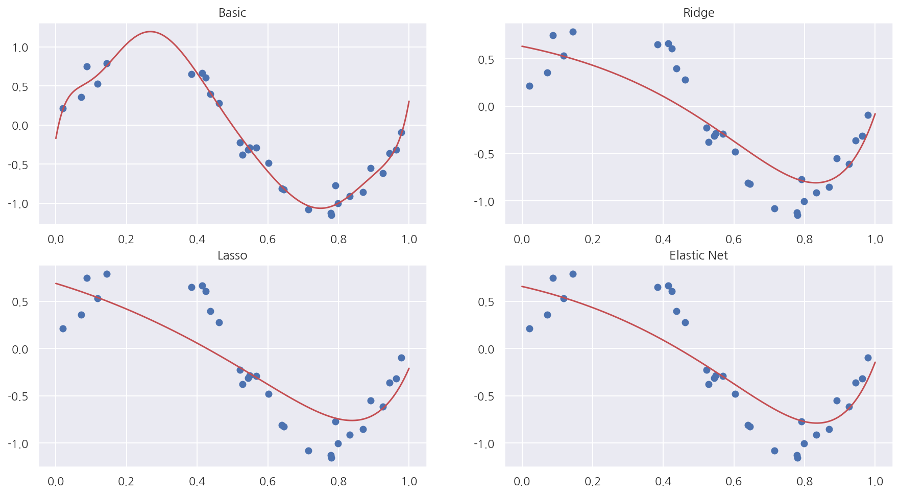
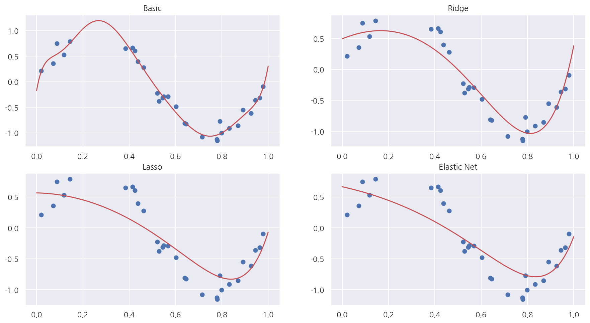
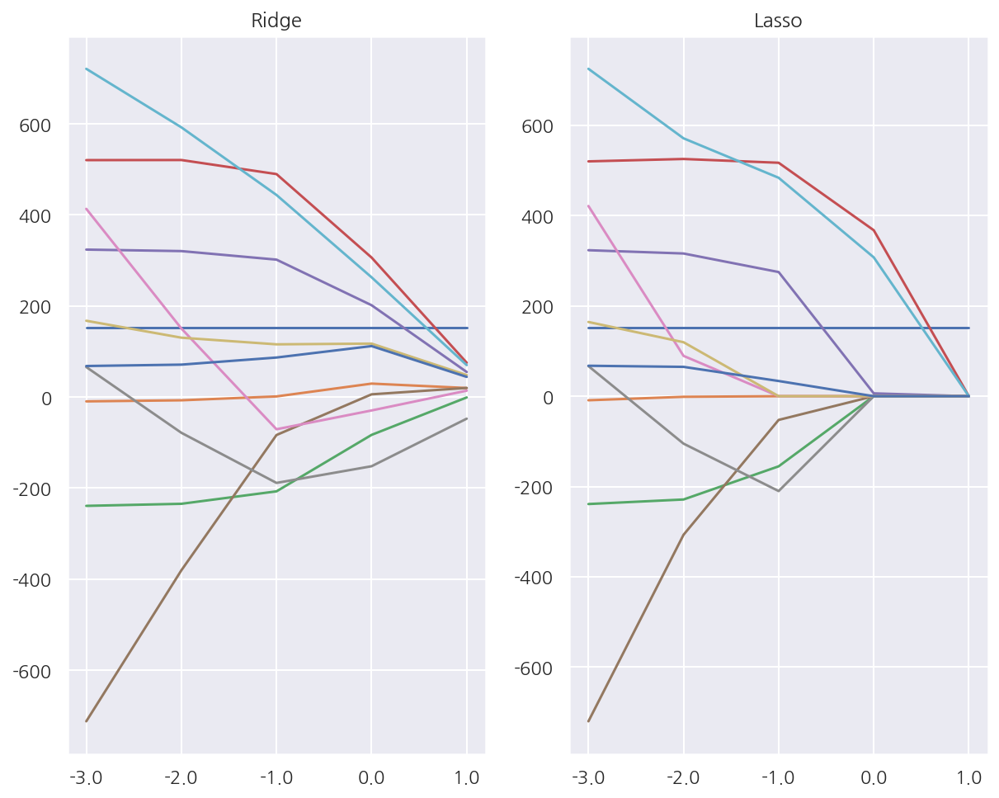
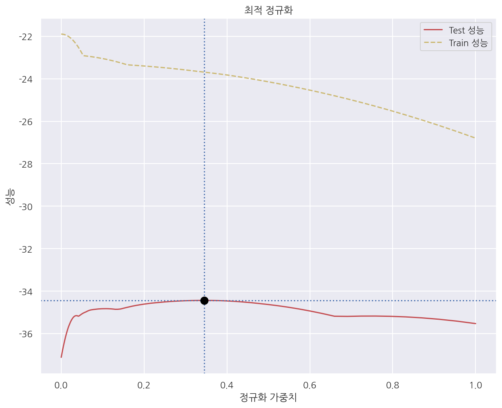
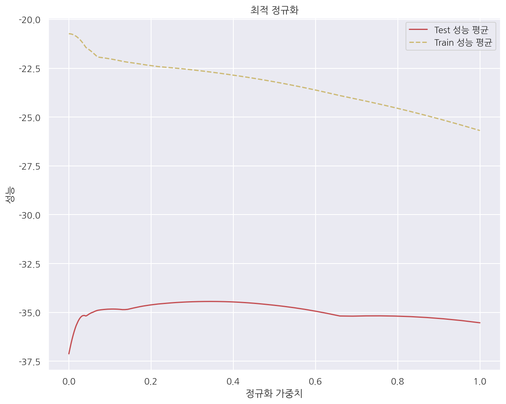
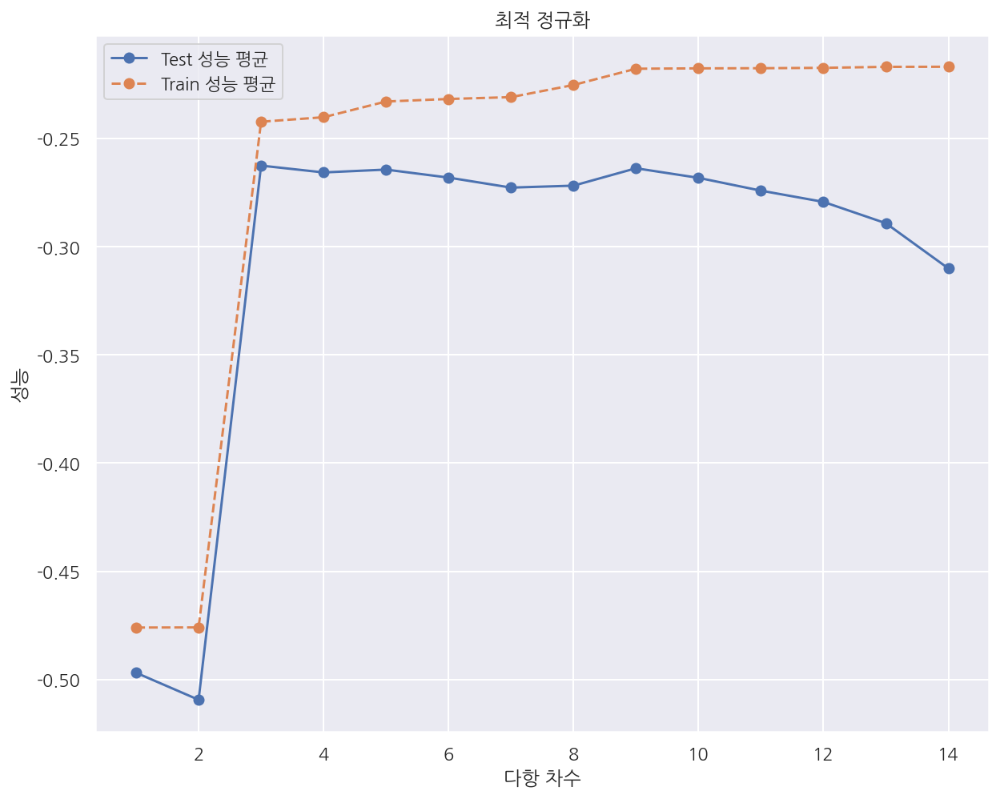

[데이터 사이언스 스쿨](https://datascienceschool.net/intro.html) 자료를 토대로 공부한 내용입니다.

실습과정에서 필요에 따라 내용의 누락 및 추가, 수정사항이 있습니다.

---


**기본 세팅**


```python
import numpy as np
import pandas as pd

import matplotlib as mpl
import matplotlib.pyplot as plt
import seaborn as sns

import warnings
```


```python
%matplotlib inline
%config InlineBackend.figure_format = 'retina'

mpl.rc('font', family='NanumGothic') # 폰트 설정
mpl.rc('axes', unicode_minus=False) # 유니코드에서 음수 부호 설정

# 차트 스타일 설정
sns.set(font="NanumGothic", rc={"axes.unicode_minus":False}, style='darkgrid')
plt.rc("figure", figsize=(10,8))

warnings.filterwarnings("ignore")
```

# 5.4 정규화 선형회귀

정규화 선형회귀 방법은 선형회귀 계수에 대한 제약 조건(패널티)을 추가함으로써 과최적화를 막는 방법이다.

모형이 과도하게 최적화되면 모형 계수의 크기도 과도하게 증가하는 경향이 나타난다. 

따라서 정규화 방법에서 추가하는 제약 조건은 일반적으로 계수의 크기를 제한하는 방법이다.

## 5.4.1 Ridge 회귀모형

Ridge 회귀모형에서는 가중치(회귀계수)들의 제곱합을 최소화하는 것을 추가적인 제약 조건으로 한다.

$$
\beta = \text{arg}\min_\beta \left( \sum_{i=1}^n e_i^2 + \lambda \sum_{j=1}^k \beta_j^2 \right)
$$

- $\lambda$는 기존의 잔차 제곱합과 추가적 제약 조건의 비중을 조절하기 위한 하이퍼 모수(hyper parameter)이다. 


- $\lambda$가 크면 정규화 정도가 커지고 가중치의 값들이 작아진다. 


- $\lambda$가 작아지면 정규화 정도가 작아지며 $\lambda$ 가 0이 되면 일반적인 선형 회귀모형이 된다.

## 5.4.2 Lasso 회귀모형

Lasso 회귀모형은 가중치(회귀계수)의 절대값의 합을 최소화하는 것을 추가적인 제약 조건으로 한다.

$$
\beta = \text{arg}\min_\beta \left( \sum_{i=1}^n e_i^2 + \lambda \sum_{j=1}^k | \beta_j | \right)
$$


## 5.4.3 Elastic Net 회귀모형

Elastic Net 회귀모형은 가중치(회귀계수)의 절대값의 합과 제곱합을 동시에 제약 조건으로 가지는 모형이다.

$$
\beta = \text{arg}\min_\beta \left( \sum_{i=1}^n e_i^2 + \lambda_1 \sum_{j=1}^k | \beta_j | + \lambda_2 \sum_{j=1}^k \beta_j^2 \right)
$$

$\lambda_1$, $\lambda_2$ 두 개의 하이퍼 모수를 가진다.

## 5.4.4 statsmodels의 정규화 회귀모형

회귀 모형의 `fit_regularized()` 메소드를 이용하여  Elastic Net 모형 계수를 구할 수 있다.

$$
0.5 \times \text{RSS}/n + \text{alpha} \times \big( 0.5 \times (1-\text{L1_wt})\sum \beta_i^2 + \text{L1_wt} \sum |\beta_i| \big)
$$

- statsmodels는 Ridge, Lasso 명령이 따로 없어 하이퍼모수 alpha와 L1_wt를 설정해서 Ridge, Lasso 모형을 만든다.

**비선형 데이터 생성**


```python
def make_nonlinear(seed=0):
    np.random.seed(seed)
    n_samples = 30
    X = np.sort(np.random.rand(n_samples))
    y = np.sin(2 * np.pi * X) + np.random.randn(n_samples) * 0.1
    X = X[:, np.newaxis]
    return (X, y)


X, y = make_nonlinear()

dfX = pd.DataFrame(X, columns=["x"])
dfy = pd.DataFrame(y, columns=["y"])

df = pd.concat([dfX, dfy], axis=1)
```

**Plot 함수 새성**


```python
def plot_statsmodels(result, i, j):
    axs[i,j].scatter(X, y)
    
    xx = np.linspace(0, 1, 1000)
    dfxx = pd.DataFrame(xx, columns=["x"])
    y_hat = result.predict(dfxx).values
    
    axs[i,j].plot(xx, y_hat, "r-")
```

**각 방법별 회귀계수**


```python
import statsmodels.api as sm

# 모형 설정
model = sm.OLS.from_formula(
    "y ~ x + I(x**2) + I(x**3) + I(x**4) + I(x**5) + I(x**6) + I(x**7) + I(x**8) + I(x**9)", data=df)

# 기본 다항회귀모형
result1 = model.fit()

# Ridge 회귀모형 L1_wt=0
result2 = model.fit_regularized(alpha=0.01, L1_wt=0)

# Lasso 회귀모형 L1_wt=1
result3 = model.fit_regularized(alpha=0.01, L1_wt=1)

# Elastic Net 회귀모형 L1_wt: 0~1 사이 값
result4 = model.fit_regularized(alpha=0.01, L1_wt=0.5)

coef = pd.DataFrame()

coef["Basic"] = result1.params
coef["Ridge"] = result2.params
coef["Lasso"] = result3.params
coef["Elastic Net"] = result4.params
coef
```


<div>
<style scoped>
    .dataframe tbody tr th:only-of-type {
        vertical-align: middle;
    }

    .dataframe tbody tr th {
        vertical-align: top;
    }

    .dataframe thead th {
        text-align: right;
    }
</style>
<table border="1" class="dataframe">
  <thead>
    <tr style="text-align: right;">
      <th></th>
      <th>Basic</th>
      <th>Ridge</th>
      <th>Lasso</th>
      <th>Elastic Net</th>
    </tr>
  </thead>
  <tbody>
    <tr>
      <th>Intercept</th>
      <td>-0.169863</td>
      <td>0.633087</td>
      <td>0.687949</td>
      <td>0.656203</td>
    </tr>
    <tr>
      <th>x</th>
      <td>25.735773</td>
      <td>-0.757059</td>
      <td>-1.129134</td>
      <td>-0.849745</td>
    </tr>
    <tr>
      <th>I(x ** 2)</th>
      <td>-428.141684</td>
      <td>-1.070566</td>
      <td>-1.124878</td>
      <td>-1.262902</td>
    </tr>
    <tr>
      <th>I(x ** 3)</th>
      <td>3866.723115</td>
      <td>-0.768351</td>
      <td>0.000000</td>
      <td>-0.425687</td>
    </tr>
    <tr>
      <th>I(x ** 4)</th>
      <td>-18340.939665</td>
      <td>-0.355304</td>
      <td>0.000000</td>
      <td>0.000000</td>
    </tr>
    <tr>
      <th>I(x ** 5)</th>
      <td>49326.072546</td>
      <td>0.012194</td>
      <td>0.000000</td>
      <td>0.000000</td>
    </tr>
    <tr>
      <th>I(x ** 6)</th>
      <td>-78884.743074</td>
      <td>0.299178</td>
      <td>0.000000</td>
      <td>0.000000</td>
    </tr>
    <tr>
      <th>I(x ** 7)</th>
      <td>74538.645153</td>
      <td>0.509692</td>
      <td>0.000000</td>
      <td>0.304049</td>
    </tr>
    <tr>
      <th>I(x ** 8)</th>
      <td>-38453.132190</td>
      <td>0.657937</td>
      <td>0.281484</td>
      <td>0.631908</td>
    </tr>
    <tr>
      <th>I(x ** 9)</th>
      <td>8350.254986</td>
      <td>0.758519</td>
      <td>1.075281</td>
      <td>0.801206</td>
    </tr>
  </tbody>
</table>
</div>


- 여러 기본 다항회귀모형부터 Ridge, Lasso, Elastic Net 모형의 회귀계수를 확인하였다.


- Lasso와 Elastic Net은 일부 회귀계수가 0으로 나타났다.

**각 방법별 회귀선**


```python
fig, axs = plt.subplots(2,2, figsize=(15,8))

plot_statsmodels(result1, 0, 0)
axs[0,0].set_title("Basic")

plot_statsmodels(result2, 0, 1)
axs[0,1].set_title("Ridge")

plot_statsmodels(result3, 1, 0)
axs[1,0].set_title("Lasso")

plot_statsmodels(result4, 1, 1)
axs[1,1].set_title("Elastic Net")

plt.show()
```


    

    


## 5.4.5 Scikit-Learn의 정규화 회귀모형

`sklearn` 패키지에서는 정규화 회귀모형을 위한 `Ridge()`, `Lasso()`, `ElasticNet()` 이라는 별도의 클래스를 제공한다. 

**Ridge 회귀모형**

$$\text{RSS} + \text{alpha} \sum \beta_i^2$$

**Lasso 회귀모형**

$$0.5 \times \text{RSS}/n + \text{alpha} \sum |\beta_i|$$

**Elastic Net 회귀모형**

$$0.5 \times \text{RSS}/n + \text{alpha} \times \big(0.5 \times  (1-\text{l1_ratio})\sum \beta_i^2 + \text{l1_ratio} \sum |\beta_i| \big)$$

**Plot 함수 새성**


```python
def plot_sklearn(model, i, j):
    axs[i,j].scatter(X, y)
    
    xx = np.linspace(0, 1, 1000)
    y_hat = model.predict(xx[:, np.newaxis])
    axs[i,j].plot(xx, y_hat, "r-")
```

**각 방법별 회귀계수**


```python
from sklearn.preprocessing import PolynomialFeatures
from sklearn.pipeline import make_pipeline
from sklearn.linear_model import LinearRegression, Ridge, Lasso, ElasticNet

# 기본 다항회귀모형
poly = PolynomialFeatures(9,include_bias = False) # 절편 생성 False 나머지에서 기본옵션으로 생성
model = make_pipeline(poly, LinearRegression()).fit(X, y)
i1 = model.steps[1][1].intercept_

# Ridge 회귀모형
model2 = make_pipeline(poly, Ridge(alpha=0.01)).fit(X, y)
i2 = model2.steps[1][1].intercept_

# Lasso 회귀모형
model3 = make_pipeline(poly, Lasso(alpha=0.01)).fit(X, y)
i3 = model3.steps[1][1].intercept_

# Elastic Net 회귀모형
model4 = make_pipeline(poly, ElasticNet(alpha=0.01, l1_ratio=0.5)).fit(X, y)
i4 = model4.steps[1][1].intercept_

coef2 = pd.DataFrame()

coef2["Basic"] = model.steps[1][1].coef_
coef2["Ridge"] = model2.steps[1][1].coef_
coef2["Lasso"] = model3.steps[1][1].coef_
coef2["Elastic Net"] = model4.steps[1][1].coef_
coef2.loc["Intercept"] = [i1,i2,i3,i4]

coef2
```


<div>
<style scoped>
    .dataframe tbody tr th:only-of-type {
        vertical-align: middle;
    }

    .dataframe tbody tr th {
        vertical-align: top;
    }

    .dataframe thead th {
        text-align: right;
    }
</style>
<table border="1" class="dataframe">
  <thead>
    <tr style="text-align: right;">
      <th></th>
      <th>Basic</th>
      <th>Ridge</th>
      <th>Lasso</th>
      <th>Elastic Net</th>
    </tr>
  </thead>
  <tbody>
    <tr>
      <th>0</th>
      <td>25.735773</td>
      <td>1.514304</td>
      <td>-0.076689</td>
      <td>-0.837680</td>
    </tr>
    <tr>
      <th>1</th>
      <td>-428.141684</td>
      <td>-3.901608</td>
      <td>-2.440963</td>
      <td>-1.239446</td>
    </tr>
    <tr>
      <th>2</th>
      <td>3866.723115</td>
      <td>-2.635986</td>
      <td>-0.000000</td>
      <td>-0.501667</td>
    </tr>
    <tr>
      <th>3</th>
      <td>-18340.939669</td>
      <td>-0.415268</td>
      <td>-0.000000</td>
      <td>-0.000000</td>
    </tr>
    <tr>
      <th>4</th>
      <td>49326.072558</td>
      <td>1.075302</td>
      <td>0.000000</td>
      <td>0.000000</td>
    </tr>
    <tr>
      <th>5</th>
      <td>-78884.743094</td>
      <td>1.649133</td>
      <td>0.000000</td>
      <td>0.000000</td>
    </tr>
    <tr>
      <th>6</th>
      <td>74538.645173</td>
      <td>1.520268</td>
      <td>0.000000</td>
      <td>0.303822</td>
    </tr>
    <tr>
      <th>7</th>
      <td>-38453.132201</td>
      <td>0.946514</td>
      <td>0.000000</td>
      <td>0.624592</td>
    </tr>
    <tr>
      <th>8</th>
      <td>8350.254988</td>
      <td>0.132996</td>
      <td>1.881887</td>
      <td>0.842629</td>
    </tr>
    <tr>
      <th>Intercept</th>
      <td>-0.169863</td>
      <td>0.494784</td>
      <td>0.565439</td>
      <td>0.665333</td>
    </tr>
  </tbody>
</table>
</div>


- `make_pipeline()`을 이용해서 연속된 변환을 순차적으로 처리할 수 있다.


- 참고로 위 코드는 절편, 회귀계수를 `model.steps[1][1].coef_` 등으로 추출하였다.


- pipiline으로 여러 사이킷런 함수를 적용한 경우 `model.named_steps` 옵션에 적용한 각 함수가 속성으로 있으니 확인해보자.


- 만약 Elastic Net의 회귀계수가 궁금하다면 `model4.named_steps.elasticnet`으로 추출 가능하다.

**각 방법별 회귀선**


```python
fig, axs = plt.subplots(2,2, figsize=(15,8))

plot_sklearn(model, 0, 0)
axs[0,0].set_title("Basic")

plot_sklearn(model2, 0, 1)
axs[0,1].set_title("Ridge")

plot_sklearn(model3, 1, 0)
axs[1,0].set_title("Lasso")

plot_sklearn(model4, 1, 1)
axs[1,1].set_title("Elastic Net")

plt.show()
```


    

    


## 5.4.5 Ridge 와 Lasso 모형의 차이

Ridge 모형은 회귀계수를 한꺼번에 축소시키는데 반해 Lasso 모형은 일부 가중치 계수가 먼저 0으로 수렴하는 특성이 있다.


```python
from sklearn.datasets import load_diabetes
diabetes = load_diabetes()
X = diabetes.data
y = diabetes.target
```

**$\alpha$ 변화에 따른 Ridge 회귀계수**


```python
alpha = np.logspace(-3, 1, 5)

df_ridge = pd.DataFrame()

for i, a in enumerate(alpha):
    ridge = Ridge(alpha=a).fit(X, y)
    df_ridge[f"{i}"] = np.hstack([ridge.intercept_, ridge.coef_])
    
df_ridge.columns = alpha
df_ridge
```


<div>
<style scoped>
    .dataframe tbody tr th:only-of-type {
        vertical-align: middle;
    }

    .dataframe tbody tr th {
        vertical-align: top;
    }

    .dataframe thead th {
        text-align: right;
    }
</style>
<table border="1" class="dataframe">
  <thead>
    <tr style="text-align: right;">
      <th></th>
      <th>0.001</th>
      <th>0.010</th>
      <th>0.100</th>
      <th>1.000</th>
      <th>10.000</th>
    </tr>
  </thead>
  <tbody>
    <tr>
      <th>0</th>
      <td>152.133484</td>
      <td>152.133484</td>
      <td>152.133484</td>
      <td>152.133484</td>
      <td>152.133484</td>
    </tr>
    <tr>
      <th>1</th>
      <td>-9.551414</td>
      <td>-7.199457</td>
      <td>1.307349</td>
      <td>29.465746</td>
      <td>19.812822</td>
    </tr>
    <tr>
      <th>2</th>
      <td>-239.090354</td>
      <td>-234.552930</td>
      <td>-207.194814</td>
      <td>-83.154885</td>
      <td>-0.918458</td>
    </tr>
    <tr>
      <th>3</th>
      <td>520.363367</td>
      <td>520.583136</td>
      <td>489.691080</td>
      <td>306.351627</td>
      <td>75.416167</td>
    </tr>
    <tr>
      <th>4</th>
      <td>323.828627</td>
      <td>320.523356</td>
      <td>301.769437</td>
      <td>201.629434</td>
      <td>55.025419</td>
    </tr>
    <tr>
      <th>5</th>
      <td>-712.328205</td>
      <td>-380.607066</td>
      <td>-83.466074</td>
      <td>5.909369</td>
      <td>19.924600</td>
    </tr>
    <tr>
      <th>6</th>
      <td>413.383794</td>
      <td>150.483752</td>
      <td>-70.828096</td>
      <td>-29.515927</td>
      <td>13.948686</td>
    </tr>
    <tr>
      <th>7</th>
      <td>65.811629</td>
      <td>-78.591232</td>
      <td>-188.680164</td>
      <td>-152.040465</td>
      <td>-47.553816</td>
    </tr>
    <tr>
      <th>8</th>
      <td>167.513774</td>
      <td>130.313059</td>
      <td>115.712703</td>
      <td>117.311715</td>
      <td>48.259420</td>
    </tr>
    <tr>
      <th>9</th>
      <td>720.944468</td>
      <td>592.349587</td>
      <td>443.814054</td>
      <td>262.944995</td>
      <td>70.144068</td>
    </tr>
    <tr>
      <th>10</th>
      <td>68.122100</td>
      <td>71.133768</td>
      <td>86.748539</td>
      <td>111.878718</td>
      <td>44.213876</td>
    </tr>
  </tbody>
</table>
</div>


**$\alpha$ 변화에 따른 Lasso 회귀계수**


```python
alpha = np.logspace(-3, 1, 5)

df_lasso = pd.DataFrame()

for i, a in enumerate(alpha):
    lasso = Lasso(alpha=a).fit(X, y)
    df_lasso[f"{i}"] = np.hstack([lasso.intercept_, lasso.coef_])

df_lasso.columns = alpha
df_lasso
```


<div>
<style scoped>
    .dataframe tbody tr th:only-of-type {
        vertical-align: middle;
    }

    .dataframe tbody tr th {
        vertical-align: top;
    }

    .dataframe thead th {
        text-align: right;
    }
</style>
<table border="1" class="dataframe">
  <thead>
    <tr style="text-align: right;">
      <th></th>
      <th>0.001</th>
      <th>0.010</th>
      <th>0.100</th>
      <th>1.000</th>
      <th>10.000</th>
    </tr>
  </thead>
  <tbody>
    <tr>
      <th>0</th>
      <td>152.133484</td>
      <td>152.133484</td>
      <td>152.133484</td>
      <td>152.133484</td>
      <td>152.133484</td>
    </tr>
    <tr>
      <th>1</th>
      <td>-8.998449</td>
      <td>-1.306575</td>
      <td>-0.000000</td>
      <td>0.000000</td>
      <td>0.000000</td>
    </tr>
    <tr>
      <th>2</th>
      <td>-238.899740</td>
      <td>-228.822331</td>
      <td>-155.362882</td>
      <td>-0.000000</td>
      <td>0.000000</td>
    </tr>
    <tr>
      <th>3</th>
      <td>520.261362</td>
      <td>525.560658</td>
      <td>517.182017</td>
      <td>367.701852</td>
      <td>0.000000</td>
    </tr>
    <tr>
      <th>4</th>
      <td>323.429484</td>
      <td>316.175320</td>
      <td>275.082351</td>
      <td>6.301904</td>
      <td>0.000000</td>
    </tr>
    <tr>
      <th>5</th>
      <td>-720.251734</td>
      <td>-307.013677</td>
      <td>-52.540269</td>
      <td>0.000000</td>
      <td>0.000000</td>
    </tr>
    <tr>
      <th>6</th>
      <td>421.405141</td>
      <td>89.321688</td>
      <td>-0.000000</td>
      <td>0.000000</td>
      <td>0.000000</td>
    </tr>
    <tr>
      <th>7</th>
      <td>66.734168</td>
      <td>-105.081398</td>
      <td>-210.159753</td>
      <td>-0.000000</td>
      <td>-0.000000</td>
    </tr>
    <tr>
      <th>8</th>
      <td>164.448873</td>
      <td>119.597989</td>
      <td>0.000000</td>
      <td>0.000000</td>
      <td>0.000000</td>
    </tr>
    <tr>
      <th>9</th>
      <td>725.340440</td>
      <td>571.330871</td>
      <td>483.914409</td>
      <td>307.605700</td>
      <td>0.000000</td>
    </tr>
    <tr>
      <th>10</th>
      <td>67.475538</td>
      <td>65.007316</td>
      <td>33.672821</td>
      <td>0.000000</td>
      <td>0.000000</td>
    </tr>
  </tbody>
</table>
</div>


```python
ax1 = plt.subplot(121)
plt.semilogx(df_ridge.T) # 데이터 프레임의 index를 기준으로 각 column의 변화를 그림
plt.xticks(alpha, labels=np.log10(alpha)) # x축은 alpha의 "승"으로 나타냄
plt.title("Ridge")

ax2 = plt.subplot(122)
plt.semilogx(df_lasso.T)
plt.xticks(alpha, labels=np.log10(alpha))
plt.title("Lasso")

plt.show()
```


    

    


- Ridge와 Lasso 회귀모형의 각 회귀계수가 alpha가 증가함에 따라 어떻게 변하는지 나타내었다.


- Ridge는 회귀계수들이 다같이 축소되고, Lasso는 일부변수가 먼저 0에 수렴하는 것을 알 수 있다.

## 5.4.6 최적 정규화

정규화에 사용되는 하이퍼 모수(hyper parameter) 등을 바꾸면 모형의 검증 성능이 달라진다. 

따라서 최적의 성능을 가져올 수 있는 정규화 하이퍼 모수를 선택하는 과정이 필요하다. 

이러한 과정을 최적 정규화(optimal regularization)라고 한다.

- 학습용 데이터를 사용한 성능은 정규화 가중치가 작으면 작을수록 좋아진다.(과최적화)


- 검증용 데이터를 사용한 성능은 정규화 가중치가 특정한 범위에 있을 때 가장 좋아진다.

**$\alpha$ 변화에 따른 Lasso 회귀모형 성능**


```python
from sklearn.datasets import load_boston
from sklearn.linear_model import Lasso
from sklearn.metrics import mean_squared_error # 성능 평가 MSE
from sklearn.model_selection import cross_val_score

boston = load_boston()
X = boston.data
y = boston.target

# alpha: 0.0001 ~ 1
alphas = np.logspace(-4, 0, 200)

train_scores = []
test_scores = []


for a in alphas:
    model = Lasso(alpha = a)
    y_hat =model.fit(X, y).predict(X)
    
    # MSE가 작을수록 좋으므로 음수로 변환시켜 크면 좋게 표시
    # trian MSE
    train_score = -mean_squared_error(y, y_hat) 
    
    # test MSE 평균 kfold=5
    # neg_mean_squared_error: -MSE
    test_score = np.mean(cross_val_score(model, X, y, scoring="neg_mean_squared_error", cv=5))
    
    train_scores.append(train_score)
    test_scores.append(test_score)

# test MSE 평균이 가장 작은 값, alpha
optimal_alpha = alphas[np.argmax(test_scores)] 
optimal_score = np.max(test_scores)

plt.plot(alphas, test_scores, "r-", label="Test 성능")
plt.plot(alphas, train_scores, "y--", label="Train 성능")

plt.axhline(optimal_score, linestyle=':') # 최적 MSE
plt.axvline(optimal_alpha, linestyle=':') # 최적 하이퍼 파라미터
plt.plot(optimal_alpha, optimal_score, marker="o", c="black", ms=5, mew=5)

plt.title("최적 정규화")
plt.ylabel('성능')
plt.xlabel('정규화 가중치')
plt.legend()

plt.show()
```


    

    


- 가중치 $\alpha$가 증가함에 따라 (제약이 강해질수록) Train의 성능은 감소한다.


- 가중치가 0일 땐 일반 선형회귀모형으로서 과최적화 되어있지만 제약이 강해질수록 Train의 성능은 감소 될 수 밖에 없다.

**검증성능 곡선**

`validation_curve()`를 사용하여 보다 쉽게 검증성능 곡선을 그릴 수 있다.


```python
from sklearn.model_selection import validation_curve

# alpha: 0.0001 ~ 1
alphas = np.logspace(-4, 0, 200)

# Model.fit() 형태가 아닌 Model()을 넣어줌
train_scores, test_scores = validation_curve(
    Lasso(), X, y, "alpha", alphas, cv=5, scoring="neg_mean_squared_error")

plt.plot(alphas, test_scores.mean(axis=1), "r-", label="Test 성능 평균")
plt.plot(alphas, train_scores.mean(axis=1), "y--", label="Train 성능 평균")

plt.ylabel('성능')
plt.xlabel('정규화 가중치')
plt.legend()
plt.title("최적 정규화")

plt.show()
```


    

    


- `validation_curve(Lasso(), X, y, "alpha", alphas, cv=5, scoring="neg_mean_squared_error")`


- 여기서 "alpha"는 원하는 하이퍼 파라미터이고 alphas는 내가 지정한 하이퍼 파라미터 범위이다.

**다항회귀의 차수 결정**

다항회귀에서 차수가 감소하면 모형의 제약조건이 더 강화되므로 정규화 가중치가 커지는 것과 같다.

반대로 차수가 증가하면 모형의 제약조건이 감소하므로 정규화 가중치가 작아지는 것과 같다.

따라서 다항회귀에서 최적의 차수를 결정하는 문제는 최적 정규화에 해당한다.


```python
from sklearn.preprocessing import PolynomialFeatures
from sklearn.linear_model import LinearRegression
from sklearn.pipeline import Pipeline
from sklearn.model_selection import cross_val_score

n_samples = 100
np.random.seed(0)
X = np.sort(np.random.rand(n_samples))
y = np.sin(2 * np.pi * X) + np.random.randn(n_samples) * 0.5
X = X[:, np.newaxis]


model = Pipeline([("poly", PolynomialFeatures()),
                  ("lreg", LinearRegression())])

degrees = np.arange(1, 15)

# 파이프라인으로 만들어진 모형에서는 적용할 모형의 이름 문자열과 인수의 이름 문자열을 두 개의 밑줄로 연결
# "poly" + "__" + "degree"
train_scores, test_scores = validation_curve(
    model, X, y, "poly__degree", degrees, cv=100, scoring="neg_mean_squared_error")

plt.plot(degrees, test_scores.mean(axis=1), "o-", label="Test 성능 평균")
plt.plot(degrees, train_scores.mean(axis=1), "o--", label="Train 성능 평균")

plt.ylabel('성능')
plt.xlabel('다항 차수')
plt.legend()
plt.title("최적 정규화")

plt.show()
```


    

    


- `validation_curve(model, X, y, "poly__degree", degrees, cv=100, scoring="neg_mean_squared_error")`


- 이번엔 하이퍼 파리머터로 차수를 사용하는데 한 가지 주의할 점이 있다.


- pipeline으로 만든 모형에서는 적용할 모형의 이름 문자열과 인수의 이름 문자열을 두 개의 밑줄로 연결하여야 한다.


- 여기서는 차수를 하이퍼 파라미터로 사용할 것이므로 "poly" + "__" + "degree"로 입력하였다.
