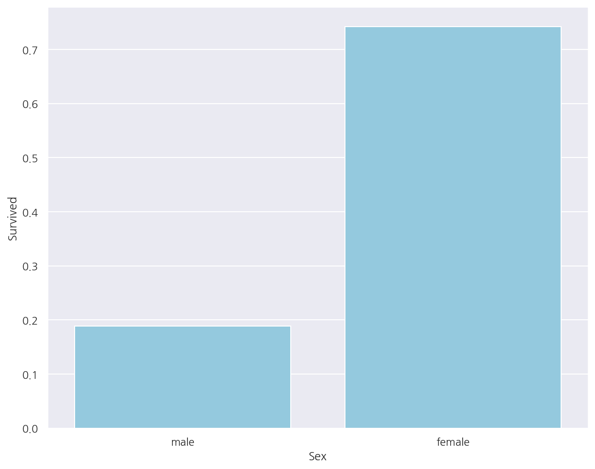
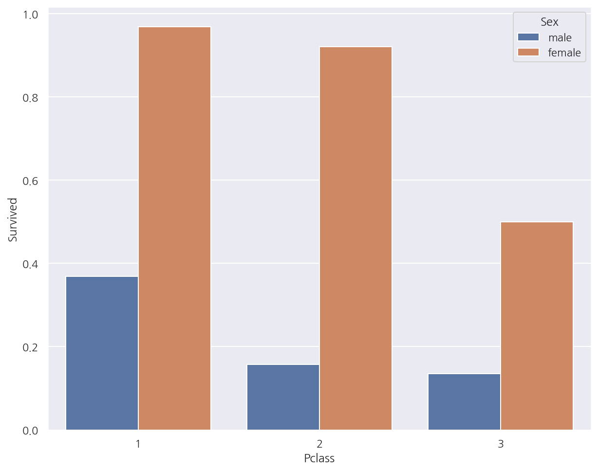
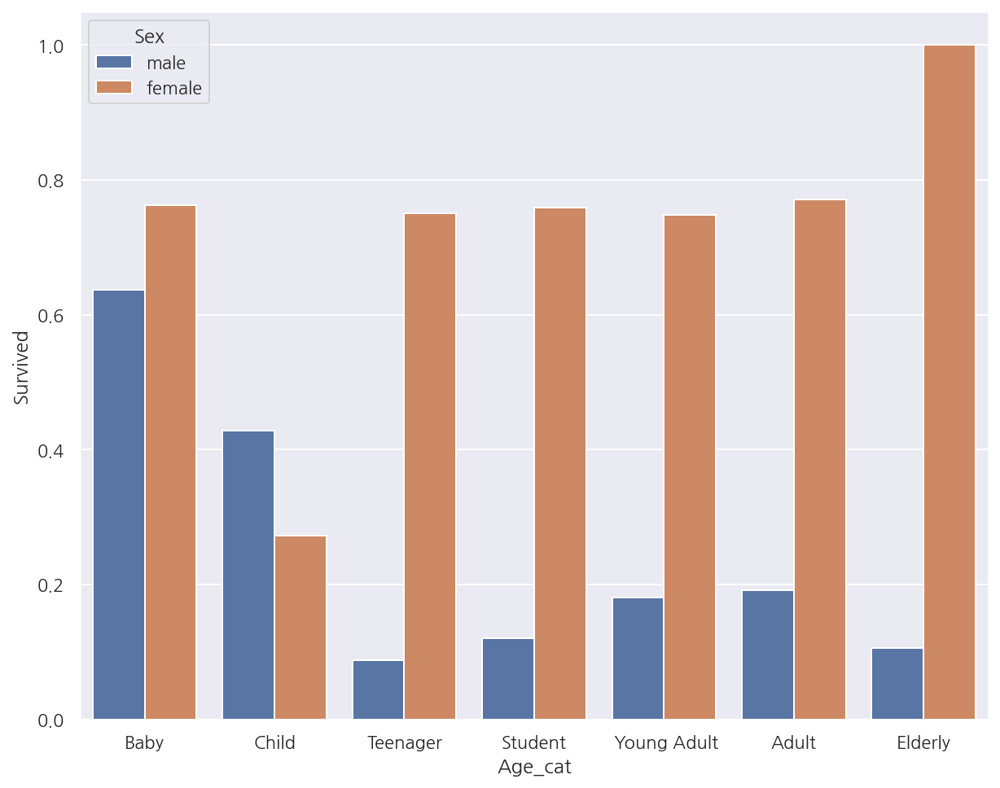

**파이썬 머신러닝 완벽가이드** 교재를 토대로 공부한 내용입니다.

실습과정에서 필요에 따라 내용의 누락 및 추가, 수정사항이 있습니다.

---


**기본 세팅**


```python
import numpy as np
import pandas as pd

import matplotlib as mpl
import matplotlib.pyplot as plt
import seaborn as sns

import warnings
```


```python
%matplotlib inline
%config InlineBackend.figure_format = 'retina'

mpl.rc('font', family='NanumGothic') # 폰트 설정
mpl.rc('axes', unicode_minus=False) # 유니코드에서 음수 부호 설정

# 차트 스타일 설정
sns.set(font="NanumGothic", rc={"axes.unicode_minus":False}, style='darkgrid')
plt.rc("figure", figsize=(10,8))

warnings.filterwarnings("ignore")
```

---

# 1.1 붓꽃 품종 예측하기

**Iris 데이터 불러오기**


```python
from sklearn.datasets import load_iris

iris = load_iris()
iris_X = iris.data
iris_y = iris.target

iris_df = pd.DataFrame(iris_X, columns = iris.feature_names)
iris_df["species"] = iris_y

iris_df.tail(5)
```


<div>
<style scoped>
    .dataframe tbody tr th:only-of-type {
        vertical-align: middle;
    }

    .dataframe tbody tr th {
        vertical-align: top;
    }

    .dataframe thead th {
        text-align: right;
    }
</style>
<table border="1" class="dataframe">
  <thead>
    <tr style="text-align: right;">
      <th></th>
      <th>sepal length (cm)</th>
      <th>sepal width (cm)</th>
      <th>petal length (cm)</th>
      <th>petal width (cm)</th>
      <th>species</th>
    </tr>
  </thead>
  <tbody>
    <tr>
      <th>145</th>
      <td>6.7</td>
      <td>3.0</td>
      <td>5.2</td>
      <td>2.3</td>
      <td>2</td>
    </tr>
    <tr>
      <th>146</th>
      <td>6.3</td>
      <td>2.5</td>
      <td>5.0</td>
      <td>1.9</td>
      <td>2</td>
    </tr>
    <tr>
      <th>147</th>
      <td>6.5</td>
      <td>3.0</td>
      <td>5.2</td>
      <td>2.0</td>
      <td>2</td>
    </tr>
    <tr>
      <th>148</th>
      <td>6.2</td>
      <td>3.4</td>
      <td>5.4</td>
      <td>2.3</td>
      <td>2</td>
    </tr>
    <tr>
      <th>149</th>
      <td>5.9</td>
      <td>3.0</td>
      <td>5.1</td>
      <td>1.8</td>
      <td>2</td>
    </tr>
  </tbody>
</table>
</div>


**학습/검증 데이터 분리**


```python
from sklearn.model_selection import train_test_split

X_train, X_test, y_train, y_test = train_test_split(iris_X, iris_y, test_size =0.2, random_state = 11)
```

**의사결정나무 객체 생성**


```python
from sklearn.tree import DecisionTreeClassifier

dt_clf = DecisionTreeClassifier(random_state = 1017)
```

**성능 평가**


```python
from sklearn.metrics import accuracy_score

dt_clf.fit(X_train, y_train)
pred = dt_clf.predict(X_test)
acc = accuracy_score(y_test, pred)

print(f"예측 정확도: {acc:.3f}")
```

    예측 정확도: 0.867
    

# 1.2 교차 검증

## 1.2.1 K-Fold 교차 검증

**K-Fold 교차 검증**


```python
from sklearn.model_selection import KFold

cv_accuracy = []
cv = KFold(5)
df_clf = DecisionTreeClassifier(random_state = 1017)

for i, (train_idx, test_idx) in enumerate(cv.split(iris_df)):
    X_train, X_test = iris_X[train_idx], iris_X[test_idx]
    y_train, y_test = iris_y[train_idx], iris_y[test_idx]
    
    # 학습 및 예측
    dt_clf.fit(X_train,y_train)
    pred = dt_clf.predict(X_test)
    
    # 평가: Accuracy
    accuracy = accuracy_score(y_test,pred)
    train_size = train_idx.shape[0]
    test_size = test_idx.shape[0]
    
    print(f"#{i+1}. 학습 데이터 크기: {train_size}, 검증 데이터 크기: {test_size}, 검증 정확도: {accuracy:.3f}")
    
    cv_accuracy.append(accuracy)
    
print(f"### 평균 검증 정확도: {np.mean(cv_accuracy):.3f}")
```

    #1. 학습 데이터 크기: 120, 검증 데이터 크기: 30, 검증 정확도: 1.000
    #2. 학습 데이터 크기: 120, 검증 데이터 크기: 30, 검증 정확도: 1.000
    #3. 학습 데이터 크기: 120, 검증 데이터 크기: 30, 검증 정확도: 0.900
    #4. 학습 데이터 크기: 120, 검증 데이터 크기: 30, 검증 정확도: 0.933
    #5. 학습 데이터 크기: 120, 검증 데이터 크기: 30, 검증 정확도: 0.733
    ### 평균 검증 정확도: 0.913
    

**K-Fold 문제점**

**붓꽃 품종별 데이터 갯수**


```python
iris_df.species.value_counts()
```


    2    50
    1    50
    0    50
    Name: species, dtype: int64


- 각 품종별로 데이터의 갯수가 동일하다.

**Fold별 데이터 분포**


```python
cv = KFold(3)

for i, (train_idx, test_idx) in enumerate(cv.split(iris_df)):
    iris_train = iris_df.iloc[train_idx]
    iris_test = iris_df.iloc[test_idx]
    
    temp1 = iris_train["species"].value_counts()
    temp2 = iris_test["species"].value_counts()
    temp3 = pd.concat([temp1,temp2], axis=1).fillna(0).astype(int)
    temp3.columns = ["trian","test"]
    
    print(f"#교차 검증: {i+1}")
    print(temp3)
```

    #교차 검증: 1
       trian  test
    0      0    50
    1     50     0
    2     50     0
    #교차 검증: 2
       trian  test
    0     50     0
    1      0    50
    2     50     0
    #교차 검증: 3
       trian  test
    0     50     0
    1     50     0
    2      0    50
    

- 첫 번째 교차 검증에서는 학습 데이터에 0이 1개도 없으며, 두 번째, 세 번째에는 각각 1,2가 없다.


- 학습/검증 데이터가 위와 같이 분리되면 검증 예측 정확도는 0이 될 것이다.

## 1.2.2 Stratifed K-Fold 교차 검증

Stratifed K-Fold는 불균형한 분포를 가진 데이터 집합을 위한 K-Fold 방식으로 전체 데이터의 분포도를 반영해서 학습/검증 데이터를 나눈다.


```python
from sklearn.model_selection import StratifiedKFold

skf = StratifiedKFold(3)

for i, (train_idx, test_idx) in enumerate(skf.split(iris_df, iris_df.species)):
    iris_train = iris_df.iloc[train_idx]
    iris_test = iris_df.iloc[test_idx]
    
    temp1 = iris_train["species"].value_counts()
    temp2 = iris_test["species"].value_counts()
    temp3 = pd.concat([temp1,temp2], axis=1).fillna(0).astype(int)
    temp3.columns = ["trian","test"]
    
    print(f"#교차 검증: {i+1}")
    print(temp3)
```

    #교차 검증: 1
       trian  test
    0     33    17
    1     33    17
    2     34    16
    #교차 검증: 2
       trian  test
    0     33    17
    1     34    16
    2     33    17
    #교차 검증: 3
       trian  test
    0     34    16
    1     33    17
    2     33    17
    

- 각 교차 검증에서 전체 데이터 분포와 같이 학습/검증 데이터가 나누어진 것을 확인할 수 있다.

**Stratifed K-Fold 교차 검증**


```python
cv_accuracy = []
skf = StratifiedKFold(3)
df_clf = DecisionTreeClassifier(random_state = 1017)

for i, (train_idx, test_idx) in enumerate(skf.split(iris_df, iris_df.species)):
    X_train, X_test = iris_X[train_idx], iris_X[test_idx]
    y_train, y_test = iris_y[train_idx], iris_y[test_idx]
    
    # 학습 및 예측
    dt_clf.fit(X_train,y_train)
    pred = dt_clf.predict(X_test)
    
    # 평가: Accuracy
    accuracy = accuracy_score(y_test,pred)
    train_size = train_idx.shape[0]
    test_size = test_idx.shape[0]
    
    print(f"#{i+1}. 학습 데이터 크기: {train_size}, 검증 데이터 크기: {test_size}, 검증 정확도: {accuracy:.3f}")
    
    cv_accuracy.append(accuracy)
    
print(f"## 평균 검증 정확도: {np.mean(cv_accuracy):.3f}")
```

    #1. 학습 데이터 크기: 100, 검증 데이터 크기: 50, 검증 정확도: 0.980
    #2. 학습 데이터 크기: 100, 검증 데이터 크기: 50, 검증 정확도: 0.940
    #3. 학습 데이터 크기: 100, 검증 데이터 크기: 50, 검증 정확도: 1.000
    ## 평균 검증 정확도: 0.973
    

## 1.2.3 cross_val_score


```python
from sklearn.model_selection import cross_val_score

dt_clf = DecisionTreeClassifier(random_state = 1017)

scores = cross_val_score(dt_clf, iris_X, iris_y, scoring = "accuracy", cv=3)

print(f"# 검증 정확도: {np.round(scores,4)}")
print(f"# 평균 검증 정확도: {np.mean(scores):.3f}")
```

    # 검증 정확도: [0.98 0.94 1.  ]
    # 평균 검증 정확도: 0.973
    

- `cross_val_score()`를 이용하여 교차 검증을 간편하게 작업할 수 있다.


- 이때 `cv`옵션은 자동으로 Stratified K-Fold를 시행한다. (회귀는 종속변수가 연속형이므로 그냥 K-Fold)

## 1.2.4 GridSearchCV

GridSearchCV는 교차 검증과 최적 하이퍼 파라미터 튜닝을 한번에 작업한다.


```python
from sklearn.model_selection import GridSearchCV

X_train, X_test, y_train, y_test = train_test_split(iris_X, iris_y, test_size =0.2, random_state = 93)

# 의사결정나무 객체 생성
d_tree = DecisionTreeClassifier()

# 하이퍼 파라미터
parameters = {"max_depth": [1,2,3], "min_samples_split": [2,3]}

grid_dtree = GridSearchCV(d_tree, param_grid = parameters, cv=3, refit=True)
grid_dtree.fit(X_train, y_train)

scores_df = pd.DataFrame(grid_dtree.cv_results_)
scores_df[ ["params", "mean_test_score", "rank_test_score", 
            "split0_test_score", "split1_test_score", "split2_test_score"] ]
```


<div>
<style scoped>
    .dataframe tbody tr th:only-of-type {
        vertical-align: middle;
    }

    .dataframe tbody tr th {
        vertical-align: top;
    }

    .dataframe thead th {
        text-align: right;
    }
</style>
<table border="1" class="dataframe">
  <thead>
    <tr style="text-align: right;">
      <th></th>
      <th>params</th>
      <th>mean_test_score</th>
      <th>rank_test_score</th>
      <th>split0_test_score</th>
      <th>split1_test_score</th>
      <th>split2_test_score</th>
    </tr>
  </thead>
  <tbody>
    <tr>
      <th>0</th>
      <td>{'max_depth': 1, 'min_samples_split': 2}</td>
      <td>0.675000</td>
      <td>5</td>
      <td>0.675</td>
      <td>0.675</td>
      <td>0.675</td>
    </tr>
    <tr>
      <th>1</th>
      <td>{'max_depth': 1, 'min_samples_split': 3}</td>
      <td>0.675000</td>
      <td>5</td>
      <td>0.675</td>
      <td>0.675</td>
      <td>0.675</td>
    </tr>
    <tr>
      <th>2</th>
      <td>{'max_depth': 2, 'min_samples_split': 2}</td>
      <td>0.925000</td>
      <td>3</td>
      <td>0.925</td>
      <td>0.950</td>
      <td>0.900</td>
    </tr>
    <tr>
      <th>3</th>
      <td>{'max_depth': 2, 'min_samples_split': 3}</td>
      <td>0.925000</td>
      <td>3</td>
      <td>0.925</td>
      <td>0.950</td>
      <td>0.900</td>
    </tr>
    <tr>
      <th>4</th>
      <td>{'max_depth': 3, 'min_samples_split': 2}</td>
      <td>0.933333</td>
      <td>1</td>
      <td>0.925</td>
      <td>0.950</td>
      <td>0.925</td>
    </tr>
    <tr>
      <th>5</th>
      <td>{'max_depth': 3, 'min_samples_split': 3}</td>
      <td>0.933333</td>
      <td>1</td>
      <td>0.925</td>
      <td>0.950</td>
      <td>0.925</td>
    </tr>
  </tbody>
</table>
</div>


- `refit=True`: 최적의 하이퍼 파라미터를 찾은 뒤 입력된 estimator 객체를 해당 하이퍼 파라미터로 재학습


- `cv_results_`: 하이퍼 파라미터 경우의 수, 평균 검증정확도(성능지표는 바꿀 수 있음), 예측 성능순위, 각 Fold별 검증정확도 등을 확인 가능


```python
print("GridSearchCV 최적 파라미터:", grid_dtree.best_params_)
print("GridSearchCV 최고 정확도:", grid_dtree.best_score_.round(4))
```

    GridSearchCV 최적 파라미터: {'max_depth': 3, 'min_samples_split': 2}
    GridSearchCV 최고 정확도: 0.9333
    

- 예측 성능순위가 1위인 최적 하이퍼 파라미터 및 최고 정확도를 확인 가능


```python
# gridsearchcv refit으로 이미 학습된 estimator 반환
estimator = grid_dtree.best_estimator_

# gridsearchcv의 best_estimator_는 이미 최적 학습되어으므로 별도 학습이 필요 없음
pred = estimator.predict(X_test)
acc = accuracy_score(y_test,pred)

print(f"검증 데이터 세트 정확도: {acc:.4f}")
```

    검증 데이터 세트 정확도: 0.9667
    

# 1.3 데이터 전처리

## 1.3.1 레이블 인코딩

문자형 변수를 숫자형으로 변환


```python
from sklearn.preprocessing import LabelEncoder

items = ["TV", "냉장고", "전자레인지", "컴퓨터", "선풍기", "선풍기", "믹서", "믹서"]

encoder = LabelEncoder()
encoder.fit(items)
lables = encoder.transform(items)

print(f"인코딩 변환값: {lables}")
print("인코딩 클래스:", encoder.classes_)
print("디코딩 원본값:", encoder.inverse_transform([0,0,1,4,3,2]))
```

    인코딩 변환값: [0 1 4 5 3 3 2 2]
    인코딩 클래스: ['TV' '냉장고' '믹서' '선풍기' '전자레인지' '컴퓨터']
    디코딩 원본값: ['TV' 'TV' '냉장고' '전자레인지' '선풍기' '믹서']
    

## 1.3.2 원-핫 인코딩

문자열 변수를 숫자형으로 변환하며 풀랭크 형식으로 변환한다.

다만 기존 모든 문자열 값이 숫자형 값으로 변환되어야하며 2차원 데이터여야한다.


```python
from sklearn.preprocessing import OneHotEncoder

items = ["TV", "냉장고", "전자레인지", "컴퓨터", "선풍기", "선풍기", "믹서", "믹서"]

# 숫자형 + 2차원 만들어주기
encoder = LabelEncoder()
encoder.fit(items)
lables = encoder.transform(items).reshape(-1,1)

# One-Hot
oh_encoder = OneHotEncoder()
oh_encoder.fit(lables)
oh_lables = oh_encoder.transform(lables)

print("원-핫 인코딩 데이터")
print(oh_lables.toarray())
print("원-핫 인코딩 데이터 차원:", oh_lables.shape)
```

    원-핫 인코딩 데이터
    [[1. 0. 0. 0. 0. 0.]
     [0. 1. 0. 0. 0. 0.]
     [0. 0. 0. 0. 1. 0.]
     [0. 0. 0. 0. 0. 1.]
     [0. 0. 0. 1. 0. 0.]
     [0. 0. 0. 1. 0. 0.]
     [0. 0. 1. 0. 0. 0.]
     [0. 0. 1. 0. 0. 0.]]
    원-핫 인코딩 데이터 차원: (8, 6)
    

**Pandas 원-핫 인코딩**


```python
df = pd.DataFrame(items, columns = ["Item"])
pd.get_dummies(df)
```


<div>
<style scoped>
    .dataframe tbody tr th:only-of-type {
        vertical-align: middle;
    }

    .dataframe tbody tr th {
        vertical-align: top;
    }

    .dataframe thead th {
        text-align: right;
    }
</style>
<table border="1" class="dataframe">
  <thead>
    <tr style="text-align: right;">
      <th></th>
      <th>Item_TV</th>
      <th>Item_냉장고</th>
      <th>Item_믹서</th>
      <th>Item_선풍기</th>
      <th>Item_전자레인지</th>
      <th>Item_컴퓨터</th>
    </tr>
  </thead>
  <tbody>
    <tr>
      <th>0</th>
      <td>1</td>
      <td>0</td>
      <td>0</td>
      <td>0</td>
      <td>0</td>
      <td>0</td>
    </tr>
    <tr>
      <th>1</th>
      <td>0</td>
      <td>1</td>
      <td>0</td>
      <td>0</td>
      <td>0</td>
      <td>0</td>
    </tr>
    <tr>
      <th>2</th>
      <td>0</td>
      <td>0</td>
      <td>0</td>
      <td>0</td>
      <td>1</td>
      <td>0</td>
    </tr>
    <tr>
      <th>3</th>
      <td>0</td>
      <td>0</td>
      <td>0</td>
      <td>0</td>
      <td>0</td>
      <td>1</td>
    </tr>
    <tr>
      <th>4</th>
      <td>0</td>
      <td>0</td>
      <td>0</td>
      <td>1</td>
      <td>0</td>
      <td>0</td>
    </tr>
    <tr>
      <th>5</th>
      <td>0</td>
      <td>0</td>
      <td>0</td>
      <td>1</td>
      <td>0</td>
      <td>0</td>
    </tr>
    <tr>
      <th>6</th>
      <td>0</td>
      <td>0</td>
      <td>1</td>
      <td>0</td>
      <td>0</td>
      <td>0</td>
    </tr>
    <tr>
      <th>7</th>
      <td>0</td>
      <td>0</td>
      <td>1</td>
      <td>0</td>
      <td>0</td>
      <td>0</td>
    </tr>
  </tbody>
</table>
</div>


- `pd.get_dummies()`를 이용하여 보다 쉽게 원-핫 인코딩이 가능하다.

## 1.3.3 피처 스케일링

**피처 스케일링 - 표준화**


```python
from sklearn.preprocessing import StandardScaler

scaler = StandardScaler()
scaler.fit(iris_df)
iris_scaled = scaler.transform(iris_df)

iris_scaled_df = pd.DataFrame(iris_scaled, columns = iris_df.columns)
iris_scaled_df.head(5)
```


<div>
<style scoped>
    .dataframe tbody tr th:only-of-type {
        vertical-align: middle;
    }

    .dataframe tbody tr th {
        vertical-align: top;
    }

    .dataframe thead th {
        text-align: right;
    }
</style>
<table border="1" class="dataframe">
  <thead>
    <tr style="text-align: right;">
      <th></th>
      <th>sepal length (cm)</th>
      <th>sepal width (cm)</th>
      <th>petal length (cm)</th>
      <th>petal width (cm)</th>
      <th>species</th>
    </tr>
  </thead>
  <tbody>
    <tr>
      <th>0</th>
      <td>-0.900681</td>
      <td>1.019004</td>
      <td>-1.340227</td>
      <td>-1.315444</td>
      <td>-1.224745</td>
    </tr>
    <tr>
      <th>1</th>
      <td>-1.143017</td>
      <td>-0.131979</td>
      <td>-1.340227</td>
      <td>-1.315444</td>
      <td>-1.224745</td>
    </tr>
    <tr>
      <th>2</th>
      <td>-1.385353</td>
      <td>0.328414</td>
      <td>-1.397064</td>
      <td>-1.315444</td>
      <td>-1.224745</td>
    </tr>
    <tr>
      <th>3</th>
      <td>-1.506521</td>
      <td>0.098217</td>
      <td>-1.283389</td>
      <td>-1.315444</td>
      <td>-1.224745</td>
    </tr>
    <tr>
      <th>4</th>
      <td>-1.021849</td>
      <td>1.249201</td>
      <td>-1.340227</td>
      <td>-1.315444</td>
      <td>-1.224745</td>
    </tr>
  </tbody>
</table>
</div>


- 다음과 같이 표준화 하는 것으로 데이터가 표준정규분포를 따르게 변환된다.

$$x_{new} = \dfrac{x-mean(x)}{stdev(x)}$$

**피처 스케일링 - 정규화**


```python
from sklearn.preprocessing import MinMaxScaler

scaler = MinMaxScaler()
scaler.fit(iris_df)
iris_scaled = scaler.transform(iris_df)

iris_scaled_df = pd.DataFrame(iris_scaled, columns = iris_df.columns)
iris_scaled_df.head(5)
```


<div>
<style scoped>
    .dataframe tbody tr th:only-of-type {
        vertical-align: middle;
    }

    .dataframe tbody tr th {
        vertical-align: top;
    }

    .dataframe thead th {
        text-align: right;
    }
</style>
<table border="1" class="dataframe">
  <thead>
    <tr style="text-align: right;">
      <th></th>
      <th>sepal length (cm)</th>
      <th>sepal width (cm)</th>
      <th>petal length (cm)</th>
      <th>petal width (cm)</th>
      <th>species</th>
    </tr>
  </thead>
  <tbody>
    <tr>
      <th>0</th>
      <td>0.222222</td>
      <td>0.625000</td>
      <td>0.067797</td>
      <td>0.041667</td>
      <td>0.0</td>
    </tr>
    <tr>
      <th>1</th>
      <td>0.166667</td>
      <td>0.416667</td>
      <td>0.067797</td>
      <td>0.041667</td>
      <td>0.0</td>
    </tr>
    <tr>
      <th>2</th>
      <td>0.111111</td>
      <td>0.500000</td>
      <td>0.050847</td>
      <td>0.041667</td>
      <td>0.0</td>
    </tr>
    <tr>
      <th>3</th>
      <td>0.083333</td>
      <td>0.458333</td>
      <td>0.084746</td>
      <td>0.041667</td>
      <td>0.0</td>
    </tr>
    <tr>
      <th>4</th>
      <td>0.194444</td>
      <td>0.666667</td>
      <td>0.067797</td>
      <td>0.041667</td>
      <td>0.0</td>
    </tr>
  </tbody>
</table>
</div>


- 다음과 같이 정규화 하는 것으로 데이터 값이 0~1 사이로 변환된다. (음수 역시 양수로 변환)

$$x_{new} = \dfrac{x-min(x)}{max(x)-min(x)}$$

**스케일링 변환 시 유의사항**

스케일링 변환 시 학습/검증 데이터 모두 동일한 스케일링 기준으로 변환해야한다.


```python
train_arr = np.arange(0,11).reshape(-1,1)
test_arr = np.arange(0,6).reshape(-1,1)

# 1. 동일한 스케일링 기준
scaler = MinMaxScaler()
scaler.fit(train_arr)

train_scaled = scaler.transform(train_arr)
test_scaled = scaler.transform(test_arr)

print("#1. MinMaxScaler로 학습/검증 데이터 모두 10분의 1로 스케일링")
print("#1. 학습 데이터 스케일링:", train_scaled.reshape(-1))
print("#1. 검증 데이터 스케일링:", test_scaled.reshape(-1))
print("-"*80)

# 2. 학습/검증 데이터별 다른 스케일링 기준
scaler = MinMaxScaler()
scaler.fit(train_arr)

train_scaled = scaler.transform(train_arr)

scaler = MinMaxScaler()
scaler.fit(test_arr) # 검증 데이터로 다시 fit 적용

test_scaled = scaler.transform(test_arr) 

print("#2. 학습 데이터: 10분의 1, 검증 데이터: 5분의 1로 스케일링")
print("#2. 학습 데이터 스케일링:", train_scaled.reshape(-1))
print("#2. 검증 데이터 스케일링:", test_scaled.reshape(-1))
```

    #1. MinMaxScaler로 학습/검증 데이터 모두 10분의 1로 스케일링
    #1. 학습 데이터 스케일링: [0.  0.1 0.2 0.3 0.4 0.5 0.6 0.7 0.8 0.9 1. ]
    #1. 검증 데이터 스케일링: [0.  0.1 0.2 0.3 0.4 0.5]
    --------------------------------------------------------------------------------
    #2. 학습 데이터: 10분의 1, 검증 데이터: 5분의 1로 스케일링
    #2. 학습 데이터 스케일링: [0.  0.1 0.2 0.3 0.4 0.5 0.6 0.7 0.8 0.9 1. ]
    #2. 검증 데이터 스케일링: [0.  0.2 0.4 0.6 0.8 1. ]
    

- 스케일링 변환시에는 반드시 학습 데이터의 스케일링 기준을 따라야한다.


- 검증 데이터에 새로 스케일링 기준을 적용하면 학습/검증 스케일링 기준이 달라진다.


- 가능하면 전체 데이터의 스케일링 변환 뒤 학습/검증 데이터를 나누는 것이 좋다.


- 여의치 않다면 반드시 학습 데이터의 기준으로 스케일링 하여야 한다.

# 2. 타이타닉 생존자 예측

## 2.1 데이터 구조

- PassengerId: 탑승자 데이터 일련번호


- Survived: 생존 여부, 0=사망, 1=생존


- Pclass: 티켓의 선실 등급, 1=일등석, 2=이등석, 3=삼등석


- Name: 이름


- Sex: 성별


- Age: 나이


- SibSp: 같이 탑승한 형제자매 또는 배우자 인원수


- Parch: 같이 탑승한 부모님 또는 어린이 인원수


- Ticket: 티켓 번호


- Fare: 요금


- Cabin: 선실 번호


- Embarked: 중간 정착 항구

## 2.2 데이터 불러오기


```python
titanic_df = pd.read_csv("./titanic_train.csv")
titanic_df.head(5)
```


<div>
<style scoped>
    .dataframe tbody tr th:only-of-type {
        vertical-align: middle;
    }

    .dataframe tbody tr th {
        vertical-align: top;
    }

    .dataframe thead th {
        text-align: right;
    }
</style>
<table border="1" class="dataframe">
  <thead>
    <tr style="text-align: right;">
      <th></th>
      <th>PassengerId</th>
      <th>Survived</th>
      <th>Pclass</th>
      <th>Name</th>
      <th>Sex</th>
      <th>Age</th>
      <th>SibSp</th>
      <th>Parch</th>
      <th>Ticket</th>
      <th>Fare</th>
      <th>Cabin</th>
      <th>Embarked</th>
    </tr>
  </thead>
  <tbody>
    <tr>
      <th>0</th>
      <td>1</td>
      <td>0</td>
      <td>3</td>
      <td>Braund, Mr. Owen Harris</td>
      <td>male</td>
      <td>22.0</td>
      <td>1</td>
      <td>0</td>
      <td>A/5 21171</td>
      <td>7.2500</td>
      <td>NaN</td>
      <td>S</td>
    </tr>
    <tr>
      <th>1</th>
      <td>2</td>
      <td>1</td>
      <td>1</td>
      <td>Cumings, Mrs. John Bradley (Florence Briggs Th...</td>
      <td>female</td>
      <td>38.0</td>
      <td>1</td>
      <td>0</td>
      <td>PC 17599</td>
      <td>71.2833</td>
      <td>C85</td>
      <td>C</td>
    </tr>
    <tr>
      <th>2</th>
      <td>3</td>
      <td>1</td>
      <td>3</td>
      <td>Heikkinen, Miss. Laina</td>
      <td>female</td>
      <td>26.0</td>
      <td>0</td>
      <td>0</td>
      <td>STON/O2. 3101282</td>
      <td>7.9250</td>
      <td>NaN</td>
      <td>S</td>
    </tr>
    <tr>
      <th>3</th>
      <td>4</td>
      <td>1</td>
      <td>1</td>
      <td>Futrelle, Mrs. Jacques Heath (Lily May Peel)</td>
      <td>female</td>
      <td>35.0</td>
      <td>1</td>
      <td>0</td>
      <td>113803</td>
      <td>53.1000</td>
      <td>C123</td>
      <td>S</td>
    </tr>
    <tr>
      <th>4</th>
      <td>5</td>
      <td>0</td>
      <td>3</td>
      <td>Allen, Mr. William Henry</td>
      <td>male</td>
      <td>35.0</td>
      <td>0</td>
      <td>0</td>
      <td>373450</td>
      <td>8.0500</td>
      <td>NaN</td>
      <td>S</td>
    </tr>
  </tbody>
</table>
</div>


```python
titanic_df.info()
```

    <class 'pandas.core.frame.DataFrame'>
    RangeIndex: 891 entries, 0 to 890
    Data columns (total 12 columns):
     #   Column       Non-Null Count  Dtype  
    ---  ------       --------------  -----  
     0   PassengerId  891 non-null    int64  
     1   Survived     891 non-null    int64  
     2   Pclass       891 non-null    int64  
     3   Name         891 non-null    object 
     4   Sex          891 non-null    object 
     5   Age          714 non-null    float64
     6   SibSp        891 non-null    int64  
     7   Parch        891 non-null    int64  
     8   Ticket       891 non-null    object 
     9   Fare         891 non-null    float64
     10  Cabin        204 non-null    object 
     11  Embarked     889 non-null    object 
    dtypes: float64(2), int64(5), object(5)
    memory usage: 83.7+ KB
    


```python
titanic_df.isna().sum()
```


    PassengerId      0
    Survived         0
    Pclass           0
    Name             0
    Sex              0
    Age            177
    SibSp            0
    Parch            0
    Ticket           0
    Fare             0
    Cabin          687
    Embarked         2
    dtype: int64


- 891개의 행, 12개의 열로 이루어져있으며 Age, Cabin, Embarkd에 결측이 존재한다.


```python
titanic_df["Age"].fillna( titanic_df.Age.mean(), inplace = True)
titanic_df["Cabin"].fillna( "N", inplace = True)
titanic_df["Embarked"].fillna( "N", inplace = True)

print("결측값의 수:", titanic_df.isna().sum().sum())
```

    결측값의 수: 0
    

- 각 변수별 결측값을 단순하게 변경하였다. 


- Age는 원자료의 분포를 보고 중앙값, 평균 등으로 결정해도 되지만 여기선 단순 평균으로 입력하였다.

## 2.3 탐색적 데이터 분석

**일부 문자열 변수**


```python
print("Sex 값 분포:\n", titanic_df.Sex.value_counts())
print("-"*80)
print("Cabin 값 분포:\n", titanic_df.Cabin.value_counts())
print("-"*80)
print("Embarked 값 분포:\n", titanic_df.Embarked.value_counts())
```

    Sex 값 분포:
     male      577
    female    314
    Name: Sex, dtype: int64
    --------------------------------------------------------------------------------
    Cabin 값 분포:
     N              687
    B96 B98          4
    G6               4
    C23 C25 C27      4
    F2               3
                  ... 
    E38              1
    C101             1
    C106             1
    A31              1
    B19              1
    Name: Cabin, Length: 148, dtype: int64
    --------------------------------------------------------------------------------
    Embarked 값 분포:
     S    644
    C    168
    Q     77
    N      2
    Name: Embarked, dtype: int64
    

- Cabin의 경우 기존에 결측값이 모두 N으로 대체 되어 N이 가장 많이 나타났으며, "C23 C25 C27" 등 데이터가 한꺼번에 적힌 케이스가 있다.


- Cabin의 첫 번째 알파벳은 선실 등급을 나타내며 해당 정보가 중요하다고 판단되어 앞 글자로 수정한다.


```python
titanic_df["Cabin"] = titanic_df["Cabin"].str[:1]
print("Cabin 값 분포:\n", titanic_df.Cabin.value_counts())
```

    Cabin 값 분포:
     N    687
    C     59
    B     47
    D     33
    E     32
    A     15
    F     13
    G      4
    T      1
    Name: Cabin, dtype: int64
    

- 첫 번째 알파벳만으로 수정하였다.

**성별에 따른 생존확률**


```python
# titanic_df.groupby(["Sex"]).mean()["Survived"]
titanic_df.pivot_table("Survived", "Sex", aggfunc="mean")
```


<div>
<style scoped>
    .dataframe tbody tr th:only-of-type {
        vertical-align: middle;
    }

    .dataframe tbody tr th {
        vertical-align: top;
    }

    .dataframe thead th {
        text-align: right;
    }
</style>
<table border="1" class="dataframe">
  <thead>
    <tr style="text-align: right;">
      <th></th>
      <th>Survived</th>
    </tr>
    <tr>
      <th>Sex</th>
      <th></th>
    </tr>
  </thead>
  <tbody>
    <tr>
      <th>female</th>
      <td>0.742038</td>
    </tr>
    <tr>
      <th>male</th>
      <td>0.188908</td>
    </tr>
  </tbody>
</table>
</div>


```python
sns.barplot(x = "Sex", y = "Survived", data = titanic_df,
            ci =None, 
            color = "skyblue")
plt.show()
```


    

    


- 여자의 생존확률은 74.20%, 남자의 생존확률은 18.89%로 여자의 생존확률이 높게 나타났다.

**선실 등급, 성별에 따른 생존 확률**


```python
sns.barplot(x = "Pclass", y = "Survived", data = titanic_df,
            ci =None, 
            hue = "Sex")
plt.show()
```


    

    


- 여자의 경우 일등석과 이등석간의 생존 확률 차이가 크지 않으나 삼등석일때 상대적으로 가장 낮았다.


- 남자의 경우 일등석일때 생존 확률이 가장 높으며 이등석, 삼등석 간의 생존 확률 차이는 크지 않았다.

**나이 그룹, 성별에 따른 생존 확률**


```python
# 나이 그룹 변수 추가
bins = [np.min(titanic_df.Age), 5, 12, 18, 25, 35, 60, np.max(titanic_df.Age)]
labels = ["Baby", "Child", "Teenager", "Student", " Young Adult", "Adult", "Elderly"]

titanic_df["Age_cat"] = pd.cut(titanic_df["Age"], bins, labels=labels)

# 나이 그룹별 생존 확률
sns.barplot(x = "Age_cat", y = "Survived", data = titanic_df,
            ci =None, 
            hue = "Sex")
plt.show()
```


    

    


- 여자의 경우 Child의 생존 확률은 다른 연령대에 비해 낮았으며 Elderly는 가장 높았다.


- 남자의 경우 Elderly의 생존 확률이 가장 낮았으며 Baby의 생존 확률이 가장 높았다.

## 2.4 데이터 편집

지금까지의 데이터 편집과정 및 문자열 변수 인코딩 등의 함수를 생성할 것이다.


```python
# Null 처리
def t_fillna(df):
    df["Age"].fillna(df.Age.mean(), inplace = True)
    df["Cabin"].fillna( "N", inplace = True)
    df["Embarked"].fillna( "N", inplace = True)
    df["Fare"].fillna(0, inplace = True) # Train에서 결측은 없었음
    return df

# 머신러닝 알고리즘에 불필요한 변수 제거
def t_drop_features(df):
    df.drop(["PassengerId", "Name", "Ticket"], axis=1, inplace=True)
    return df

# 레이블 인코딩 처리
def t_cat_encoding(df):
    df["Cabin"] = df["Cabin"].str[:1]
    
    features = ["Cabin", "Sex", "Embarked"]
    
    for f in features:
        le = LabelEncoder()
        le = le.fit(df[f])
        df[f] = le.transform(df[f])
    return df

# 나이 그룹 변수
def t_age_cat(df):
    bins = [np.min(titanic_df.Age), 5, 12, 18, 25, 35, 60, np.max(titanic_df.Age)]
    labels = ["Baby", "Child", "Teenager", "Student", " Young Adult", "Adult", "Elderly"]
    
    df["Age_cat"] = pd.cut(df["Age"], bins, labels=labels)
    return df

def t_transform_features(df, age_add=False):
    t_fillna(df)
    t_drop_features(df)
    t_cat_encoding(df)
    
    if age_add == True:
        t_age_cat(df)
        
    return df
```

## 2.5 머신러닝

**데이터 다시 불러오기**


```python
titanic_df = pd.read_csv("./titanic_train.csv")
titanic_df = t_transform_features(titanic_df)
titanic_df.head(5)
```


<div>
<style scoped>
    .dataframe tbody tr th:only-of-type {
        vertical-align: middle;
    }

    .dataframe tbody tr th {
        vertical-align: top;
    }

    .dataframe thead th {
        text-align: right;
    }
</style>
<table border="1" class="dataframe">
  <thead>
    <tr style="text-align: right;">
      <th></th>
      <th>Survived</th>
      <th>Pclass</th>
      <th>Sex</th>
      <th>Age</th>
      <th>SibSp</th>
      <th>Parch</th>
      <th>Fare</th>
      <th>Cabin</th>
      <th>Embarked</th>
    </tr>
  </thead>
  <tbody>
    <tr>
      <th>0</th>
      <td>0</td>
      <td>3</td>
      <td>1</td>
      <td>22.0</td>
      <td>1</td>
      <td>0</td>
      <td>7.2500</td>
      <td>7</td>
      <td>3</td>
    </tr>
    <tr>
      <th>1</th>
      <td>1</td>
      <td>1</td>
      <td>0</td>
      <td>38.0</td>
      <td>1</td>
      <td>0</td>
      <td>71.2833</td>
      <td>2</td>
      <td>0</td>
    </tr>
    <tr>
      <th>2</th>
      <td>1</td>
      <td>3</td>
      <td>0</td>
      <td>26.0</td>
      <td>0</td>
      <td>0</td>
      <td>7.9250</td>
      <td>7</td>
      <td>3</td>
    </tr>
    <tr>
      <th>3</th>
      <td>1</td>
      <td>1</td>
      <td>0</td>
      <td>35.0</td>
      <td>1</td>
      <td>0</td>
      <td>53.1000</td>
      <td>2</td>
      <td>3</td>
    </tr>
    <tr>
      <th>4</th>
      <td>0</td>
      <td>3</td>
      <td>1</td>
      <td>35.0</td>
      <td>0</td>
      <td>0</td>
      <td>8.0500</td>
      <td>7</td>
      <td>3</td>
    </tr>
  </tbody>
</table>
</div>


**학습/검증 데이터 분리**


```python
titanic_X = titanic_df.drop("Survived", axis=1)
titanic_y = titanic_df["Survived"]

X_train, X_test, y_train, y_test = train_test_split(titanic_X, titanic_y, test_size=0.2, random_state=11)
```

**ML 적용**


```python
from sklearn.tree import DecisionTreeClassifier
from sklearn.ensemble import RandomForestClassifier
from sklearn.linear_model import LogisticRegression
from sklearn.metrics import accuracy_score

# ML 알고리즘 객체 생성
dt_clf = DecisionTreeClassifier(random_state=11)
rf_clf = RandomForestClassifier(random_state=11)
lr_clf = LogisticRegression()

# DecisionTree 학습/예측/평가
dt_clf.fit(X_train,y_train)
dt_pred = dt_clf.predict(X_test)
acc1 = accuracy_score(y_test, dt_pred)
print(f"DecisionTreeClassifier 정확도: {acc1:.4f}")

# RandomForest 학습/예측/평가
rf_clf.fit(X_train,y_train)
rf_pred = rf_clf.predict(X_test)
acc2 = accuracy_score(y_test, rf_pred)
print(f"RandomForestClassifier 정확도: {acc2:.4f}")

# LogisticRegression 학습/예측/평가
lr_clf.fit(X_train,y_train)
lr_pred = lr_clf.predict(X_test)
acc = accuracy_score(y_test, lr_pred)
print(f"LogisticRegression 정확도: {acc:.4f}")
```

    DecisionTreeClassifier 정확도: 0.7877
    RandomForestClassifier 정확도: 0.8547
    LogisticRegression 정확도: 0.8492
    

- RandomForestClassifier의 정확도가 가장 높게 나타났으나 현재는 교차검증 및 최적화 작업을 시행하지 않았다.

**DecisionTreeClassifier 교차 검증**


```python
cv = KFold(5)
accs = []

for i, (train_idx, test_idx) in enumerate(cv.split(titanic_df)):
    X_train, X_test = titanic_X.iloc[train_idx], titanic_X.iloc[test_idx]
    y_train, y_test = titanic_y[train_idx], titanic_y[test_idx]
    
    dt_clf.fit(X_train,y_train)
    dt_pred = dt_clf.predict(X_test)
    acc = accuracy_score(y_test, dt_pred)
    accs.append(acc)
    
    print(f"#{i+1}. 검증 정확도: {acc:.4f}")
    
print(f"##  평균 검증 정확도: {np.mean(accs):.4f}")
```

    #1. 검증 정확도: 0.7542
    #2. 검증 정확도: 0.7809
    #3. 검증 정확도: 0.7865
    #4. 검증 정확도: 0.7697
    #5. 검증 정확도: 0.8202
    ##  평균 검증 정확도: 0.7823
    


```python
scores = cross_val_score(dt_clf, titanic_X, titanic_y, cv=KFold(5))

for i in range(5):
    print(f"#{i+1}. 검증 정확도: {scores[i]:.4f}")
    
print(f"##  평균 검증 정확도: {np.mean(scores):.4f}")
```

    #1. 검증 정확도: 0.7542
    #2. 검증 정확도: 0.7809
    #3. 검증 정확도: 0.7865
    #4. 검증 정확도: 0.7697
    #5. 검증 정확도: 0.8202
    ##  평균 검증 정확도: 0.7823
    

**DecisionTreeClassifier GridSearchCV**


```python
# 학습/검증 데이터 분리
X_train, X_test, y_train, y_test = train_test_split(titanic_X, titanic_y, test_size=0.2, random_state=11)

# 하이퍼 파라미터
parameters = {"max_depth": [2,3,5,10],
             "min_samples_split": [2,3,5], "min_samples_leaf": [1,5,8]}

# GridSearchCV
grid_dclf = GridSearchCV(dt_clf, param_grid = parameters, scoring="accuracy", cv=5)
grid_dclf.fit(X_train,y_train)

print("GridSearchCV 최적 하이퍼 파라미터:", grid_dclf.best_params_)
print("GridSearchCV 최고 정확도:", grid_dclf.best_score_.round(4))


# 최적 하이퍼 파라미터로 학습된 estimator로 예측 및 평가
best_dclf = grid_dclf.best_estimator_
dpredictions = best_dclf.predict(X_test)
acc = accuracy_score(y_test,dpredictions)

print(f"검증 데이터 정확도: {acc:.4f}")
```

    GridSearchCV 최적 하이퍼 파라미터: {'max_depth': 3, 'min_samples_leaf': 5, 'min_samples_split': 2}
    GridSearchCV 최고 정확도: 0.7992
    검증 데이터 정확도: 0.8715
    
