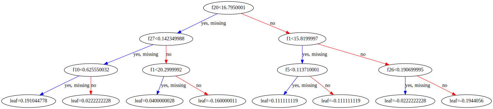

**기본 세팅**


```python
import numpy as np
import pandas as pd

import matplotlib as mpl
import matplotlib.pyplot as plt
import seaborn as sns

import warnings
```


```python
%matplotlib inline
%config InlineBackend.figure_format = 'retina'

mpl.rc('font', family='NanumGothic') # 폰트 설정
mpl.rc('axes', unicode_minus=False) # 유니코드에서 음수 부호 설정

# 차트 스타일 설정
sns.set(font="NanumGothic", rc={"axes.unicode_minus":False}, style='darkgrid')
plt.rc("figure", figsize=(10,8))

warnings.filterwarnings("ignore")
```

---

# 1. XGBoost (eXtra Gradient Boost)

XGBoost는 GBM을 기반으로 하지만, GBM의 단점인 느린 수행 시간 및 과적합 규제 부재 등의 문제를 해결한다.

또한 조기 중단, 자체 내장된 교차 검증 기능, 결손값 자체 처리 등의 기능이 있다.

XGB는 파이썬 래퍼와 사이킷런 래퍼 두 가지 방법으로 구현 가능하다.

## 1.1 파이썬 래퍼 XGBoost

### 1.1.1 하이퍼 파라미터

**일반 파라미터**

>일반적으로 실행 시 스레드의 갯수나 silent 모드 등의 선택을 위한 파라미터로서 디폴트 파라미터 값을 바꾸는 경우는 거의 없다.

- **booster**: gbtree 또는 gblinear 중 선택, 디폴트는 gbtree


- **silent**: 디폴트는 0이며, 출력 메시지를 나타내고 싶지 않은 경우 1로 설정


- **nthread**: CPU의 실행 스레드 개수로 디폴트는 전체 CPU의 스레드를 사용한다.

**부스터 파라미터**

>트리 최적화, 부스팅, regularization 등과 관련 파라미터 등을 지칭한다.

- **eta [defalut: 0.3, alias: learning_rate]**: GBM의 학습률(learning_rate)와 같은 파라미터로 보통 0.01 ~ 0.2 사이의 값을 선호한다.
      
      
- **num_boost_round**: GBM의 n_estimators와 같은 파라미터


- **min_child_weight [default: 1]**: 트리에서 추가적으로 가지를 나눌지 결정하기 위해 필요한 데이터들의 가중치 총합

                             값이 클수록 분할을 자제한다. 과적합을 조절하기 위해 사용
                 
                 
- **gamma [default: 0, aias: min_split_loss]**: 트리의 리프 노드를 추가적으로 나눌지를 결정할 최소 손실 감소 값

                              해당 값보다 큰 손실(loss)이 감소된 경우 리프 노드를 분리하며 값이 클수록 과적합 감소 효과가 있다.


- **max_depth [default: 6]**: 트리 기반 알고리즘의 max_depth와 같다. 0을 지정하면 깊이 제한이 없다.

                       보통은 3 ~ 10 사이의 값을 적용한다.
              

- **sub_sample [default: 1]**: GBM의 subsample과 같은 파라미터로 일반적으로 0.5 ~ 1 사이의 값을 사용한다.
              
              
- **colsample_bytree [default: 1]**: GBM의 max_features와 유사하다. 트리 생성에 필요한 피처를 임의로 샘플링 하는데 사용

                             피처가 매우 많은 경우 과적합을 조절하는데 사용
                   

- **lambda [default: 1, alias: reg_lambda]**: L2 Regularization 적용 값으로 피처 개수가 많을 경우 적용을 검토하며 값이 클수록 과적합 감소 효과가 있다.


- **alpha [default: 0, alias: reg_alpha]**: L1 Regularization 적용 값으로 피처 개수가 많을 경우 적용을 검토하며 값이 클수록 과적합 감소 효과가 있다.


- **scale_pos_weight [default: 1]**: 특정 값으로 치우친 비대칭한 클래스로 구성된 데이터 셋의 균형 유지를 위한 파라미터

**학습 태스크 파라미터**

>학습 수행시의 객체 함수, 평가를 위한 지표 등을 설정하는 파라미터

- **objective**: 최솟값을 가져야할 손실함수를 정의한다. 주로 사용하는 손실함수는 이진 분류인지 다중분류인지에 따라 다르다.


- **binary:logistic**: 이진 분류일 때 사용


- **multi:softmax**: 다중 분류일 때 적용, 손실함수가 multi:softmax인 경우에는 레이블 클래스 개수인 num_class 파라미터를 지정해야 한다.


- **multi:softprob**: multi:softmax와 유사하지만 개별 레이블 클래스의 해당되는 예측 확률을 반환한다.


- **eval_metric**: 검증에 사용되는 함수를 정의한다. 기본값은 회귀의 경우 rmse, 분류인 경우 error이다.


    - rmse: Root Mean Square Error    
    - mae: Mean Absolute Error    
    - logloss: Negative log-likelihood    
    - error: Binary classification error rate (0.5 threshold)    
    - merror: Multiclass classification error rate    
    - mlogloss: Multiclass logloss    
    - auc: Area Under the Curve

**과적합 문제가 심각한 경우**

- eta 값을 낮춘다(0.01 ~ 0.1). eta 값을 낮출 경우 num_boost_rounds는 반대로 높여줘야 한다.


- max_depth 값을 낮춘다.


- min_child_weight 값을 높인다.


- gamma 값을 높인다.


- sub_sample과 colsample_bytree 등을 조정한다.

### 1.1.2 위스콘신 유방암 예측


```python
import xgboost as xgb
from sklearn.datasets import load_breast_cancer
from sklearn.model_selection import train_test_split

dataset = load_breast_cancer()
X_features = dataset.data
y_label = dataset.target

cancer_df = pd.DataFrame(data = X_features, columns = dataset.feature_names)
cancer_df["target"] = y_label
cancer_df.head()
```


<div>
<style scoped>
    .dataframe tbody tr th:only-of-type {
        vertical-align: middle;
    }

    .dataframe tbody tr th {
        vertical-align: top;
    }

    .dataframe thead th {
        text-align: right;
    }
</style>
<table border="1" class="dataframe">
  <thead>
    <tr style="text-align: right;">
      <th></th>
      <th>mean radius</th>
      <th>mean texture</th>
      <th>mean perimeter</th>
      <th>mean area</th>
      <th>mean smoothness</th>
      <th>mean compactness</th>
      <th>mean concavity</th>
      <th>mean concave points</th>
      <th>mean symmetry</th>
      <th>mean fractal dimension</th>
      <th>...</th>
      <th>worst texture</th>
      <th>worst perimeter</th>
      <th>worst area</th>
      <th>worst smoothness</th>
      <th>worst compactness</th>
      <th>worst concavity</th>
      <th>worst concave points</th>
      <th>worst symmetry</th>
      <th>worst fractal dimension</th>
      <th>target</th>
    </tr>
  </thead>
  <tbody>
    <tr>
      <th>0</th>
      <td>17.99</td>
      <td>10.38</td>
      <td>122.80</td>
      <td>1001.0</td>
      <td>0.11840</td>
      <td>0.27760</td>
      <td>0.3001</td>
      <td>0.14710</td>
      <td>0.2419</td>
      <td>0.07871</td>
      <td>...</td>
      <td>17.33</td>
      <td>184.60</td>
      <td>2019.0</td>
      <td>0.1622</td>
      <td>0.6656</td>
      <td>0.7119</td>
      <td>0.2654</td>
      <td>0.4601</td>
      <td>0.11890</td>
      <td>0</td>
    </tr>
    <tr>
      <th>1</th>
      <td>20.57</td>
      <td>17.77</td>
      <td>132.90</td>
      <td>1326.0</td>
      <td>0.08474</td>
      <td>0.07864</td>
      <td>0.0869</td>
      <td>0.07017</td>
      <td>0.1812</td>
      <td>0.05667</td>
      <td>...</td>
      <td>23.41</td>
      <td>158.80</td>
      <td>1956.0</td>
      <td>0.1238</td>
      <td>0.1866</td>
      <td>0.2416</td>
      <td>0.1860</td>
      <td>0.2750</td>
      <td>0.08902</td>
      <td>0</td>
    </tr>
    <tr>
      <th>2</th>
      <td>19.69</td>
      <td>21.25</td>
      <td>130.00</td>
      <td>1203.0</td>
      <td>0.10960</td>
      <td>0.15990</td>
      <td>0.1974</td>
      <td>0.12790</td>
      <td>0.2069</td>
      <td>0.05999</td>
      <td>...</td>
      <td>25.53</td>
      <td>152.50</td>
      <td>1709.0</td>
      <td>0.1444</td>
      <td>0.4245</td>
      <td>0.4504</td>
      <td>0.2430</td>
      <td>0.3613</td>
      <td>0.08758</td>
      <td>0</td>
    </tr>
    <tr>
      <th>3</th>
      <td>11.42</td>
      <td>20.38</td>
      <td>77.58</td>
      <td>386.1</td>
      <td>0.14250</td>
      <td>0.28390</td>
      <td>0.2414</td>
      <td>0.10520</td>
      <td>0.2597</td>
      <td>0.09744</td>
      <td>...</td>
      <td>26.50</td>
      <td>98.87</td>
      <td>567.7</td>
      <td>0.2098</td>
      <td>0.8663</td>
      <td>0.6869</td>
      <td>0.2575</td>
      <td>0.6638</td>
      <td>0.17300</td>
      <td>0</td>
    </tr>
    <tr>
      <th>4</th>
      <td>20.29</td>
      <td>14.34</td>
      <td>135.10</td>
      <td>1297.0</td>
      <td>0.10030</td>
      <td>0.13280</td>
      <td>0.1980</td>
      <td>0.10430</td>
      <td>0.1809</td>
      <td>0.05883</td>
      <td>...</td>
      <td>16.67</td>
      <td>152.20</td>
      <td>1575.0</td>
      <td>0.1374</td>
      <td>0.2050</td>
      <td>0.4000</td>
      <td>0.1625</td>
      <td>0.2364</td>
      <td>0.07678</td>
      <td>0</td>
    </tr>
  </tbody>
</table>
<p>5 rows × 31 columns</p>
</div>


```python
print(dataset.target_names)
print(cancer_df.target.value_counts())
```

    ['malignant' 'benign']
    1    357
    0    212
    Name: target, dtype: int64
    

- 타겟 레이블 값은 악성 종양(malignant)이 0값으로 212개, 양성 종양(benign)이 1값으로 357개가 있다.


```python
X_train, X_test, y_train, y_test = train_test_split(X_features, y_label, test_size=0.2, random_state=156)

dtrain = xgb.DMatrix(data = X_train, label = y_train)
dtest = xgb.DMatrix(data = X_test, label = y_test)
```

- 파이썬 래퍼 XGBoost는 train, test 셋을 위해 별도의 객체인 DMatrix를 생성해야한다.


- DMatrix는 주로 Numpy를 입력 받아 생성한다.

**하이퍼 파라미터 설정**


```python
params = {
    "max_depth": 3, 
    "eta": 0.1, 
    "objective": "binary:logistic", 
    "eval_metric": "logloss"
    # "early_stoppings": 100 
}

num_rounds = 400 # 부스팅 반복 횟수
```

- early_stoppings를 적용해도 후의 명령어에서 사용되지 않는다는 메시지가 출력되어 제거하였다.


- 수행된다는 가정하에 조기 중단을 수행하려면 eval_set과 eval_metric이 함께 설정되어야 한다.


- eval_set은 성능 평가를 수행할 test 데이터를 설정하며 eval_metric은 성능 평가 함수를 지정한다.

**XGB 학습**


```python
# evals 파라미터에 train, test 셋을 명기하면 평가를 진행하면서 조기 중단을 적용 할 수 있다.
wlist = [(dtrain, "train"), (dtest, "eval")]

# 모델 학습: 사이킷런과 달리 train() 함수에 파라미터를 전달한다.
xgb_model = xgb.train(params = params, dtrain = dtrain, num_boost_round = num_rounds,
                      evals = wlist)
```

    [0]	train-logloss:0.60969	eval-logloss:0.61352
    [1]	train-logloss:0.54080	eval-logloss:0.54784
    [2]	train-logloss:0.48375	eval-logloss:0.49425
    [3]	train-logloss:0.43446	eval-logloss:0.44799
    [4]	train-logloss:0.39055	eval-logloss:0.40911
    [5]	train-logloss:0.35414	eval-logloss:0.37498
    [6]	train-logloss:0.32122	eval-logloss:0.34571
    [7]	train-logloss:0.29259	eval-logloss:0.32053
    [8]	train-logloss:0.26747	eval-logloss:0.29721
    [9]	train-logloss:0.24515	eval-logloss:0.27799
    [10]	train-logloss:0.22569	eval-logloss:0.26030
    ...
    [398]	train-logloss:0.00499	eval-logloss:0.08528
    [399]	train-logloss:0.00499	eval-logloss:0.08520
    

- 지속적으로 train-logloss와 eval-logloss가 감소한다.


- 결과창이 너무 길어 직접 삭제해두었다.

**XGB 예측**


```python
# 예측 확률
pred_probs = xgb_model.predict(dtest)
print("predict() 수행 결과값 10개만 표시")
print(np.round(pred_probs[:10], 3))

# 예측 분류
preds = [1 if x > 0.5 else 0 for x in pred_probs]
print("예측 분류 10개만 표시")
print(f"{preds[:10]}")
```

    predict() 수행 결과값 10개만 표시
    [0.95  0.003 0.9   0.086 0.993 1.    1.    0.999 0.998 0.   ]
    예측 분류 10개만 표시
    [1, 0, 1, 0, 1, 1, 1, 1, 1, 0]
    

- XGB에서 predict는 예측 분류값이 아닌 1로 분류될 예측 확률 값으로 나타난다.

**XGB 평가**


```python
# 3장에서 사용한 성능 평가 함수
from sklearn.metrics import accuracy_score, precision_score, recall_score, confusion_matrix
from sklearn.metrics import f1_score, roc_auc_score

def get_clf_eval(y_test, pred=None, pred_proba_po=None):
    confusion = confusion_matrix(y_test, pred)
    accuracy = accuracy_score(y_test, pred)
    precision = precision_score(y_test, pred)
    recall = recall_score(y_test, pred)
    f1 = f1_score(y_test, pred)
    auc = roc_auc_score(y_test, pred_proba_po)
   
    print("오차 행렬")
    print(confusion)
    print(f"정확도: {accuracy:.4f}, 정밀도: {precision:.4f}, 재현율: {recall:.4f}, F1: {f1:.4f}, AUC: {auc:.4f}")
```


```python
get_clf_eval(y_test, pred = preds, pred_proba_po = pred_probs)
```

    오차 행렬
    [[35  2]
     [ 1 76]]
    정확도: 0.9737, 정밀도: 0.9744, 재현율: 0.9870, F1: 0.9806, AUC: 0.9951
    

**XGB 피처별 중요도**


```python
from xgboost import plot_importance

plot_importance(xgb_model)
plt.show()
```


    

    


- XGB는 내장 함수 `plot_importance`를 이용해 피처별 중요도를 시각화 할 수 있다.


- 기본 평가 지표는 f1 스코어를 사용하며 유의 할 점은 Numpy 기반의 피처 데이터로 학습 시 피처명을 제대로 알 수 없어 f0,f1 등 순서별로 나타난다.

**XGB 시각화**


```python
from xgboost import to_graphviz
import graphviz

to_graphviz(xgb_model)
```


    

    


**XGB 교차검증**


```python
xgb.cv(params=params, dtrain=dtrain, num_boost_round=10, nfold=3, metrics="logloss")
```


<div>
<style scoped>
    .dataframe tbody tr th:only-of-type {
        vertical-align: middle;
    }

    .dataframe tbody tr th {
        vertical-align: top;
    }

    .dataframe thead th {
        text-align: right;
    }
</style>
<table border="1" class="dataframe">
  <thead>
    <tr style="text-align: right;">
      <th></th>
      <th>train-logloss-mean</th>
      <th>train-logloss-std</th>
      <th>test-logloss-mean</th>
      <th>test-logloss-std</th>
    </tr>
  </thead>
  <tbody>
    <tr>
      <th>0</th>
      <td>0.610037</td>
      <td>0.000064</td>
      <td>0.617448</td>
      <td>0.004961</td>
    </tr>
    <tr>
      <th>1</th>
      <td>0.541817</td>
      <td>0.000203</td>
      <td>0.555140</td>
      <td>0.008989</td>
    </tr>
    <tr>
      <th>2</th>
      <td>0.483717</td>
      <td>0.000955</td>
      <td>0.503529</td>
      <td>0.012238</td>
    </tr>
    <tr>
      <th>3</th>
      <td>0.434676</td>
      <td>0.001311</td>
      <td>0.459869</td>
      <td>0.015795</td>
    </tr>
    <tr>
      <th>4</th>
      <td>0.392310</td>
      <td>0.001686</td>
      <td>0.423058</td>
      <td>0.016788</td>
    </tr>
    <tr>
      <th>5</th>
      <td>0.355129</td>
      <td>0.001390</td>
      <td>0.391187</td>
      <td>0.019785</td>
    </tr>
    <tr>
      <th>6</th>
      <td>0.322530</td>
      <td>0.001909</td>
      <td>0.361119</td>
      <td>0.019378</td>
    </tr>
    <tr>
      <th>7</th>
      <td>0.294159</td>
      <td>0.001618</td>
      <td>0.337139</td>
      <td>0.021085</td>
    </tr>
    <tr>
      <th>8</th>
      <td>0.269083</td>
      <td>0.002068</td>
      <td>0.314902</td>
      <td>0.019971</td>
    </tr>
    <tr>
      <th>9</th>
      <td>0.246208</td>
      <td>0.001940</td>
      <td>0.295012</td>
      <td>0.019237</td>
    </tr>
  </tbody>
</table>
</div>


- XGB에선 `cv`를 이용해 교차검증이 가능하다. 부스팅 반복횟수가 증가하면서 logloss가 감소하는 것을 확인 할 수 있다.

## 1.2 사이킷런 래퍼 XGBoost

### 1.2.1 하이퍼 파라미터

>사이킷런 래퍼 XGBoost의 하이퍼 파라미터는 파이썬 래퍼와 일부 차이가 있다.

- eta [defalut: 0.3] $\rightarrow$ learning_rate [defalut: 0.1]
 
 
- sub_sample $\rightarrow$ subsample
              
              
- lambda $\rightarrow$ reg_lambda


- alpha $\rightarrow$ reg_alpha


- num_boost_round $\rightarrow$ n_estimators

### 1.2.2 위스콘신 유방암 예측


```python
from sklearn.datasets import load_breast_cancer

dataset = load_breast_cancer()
X_features = dataset.data
y_label = dataset.target

X_train, X_test, y_train, y_test = train_test_split(X_features, y_label, test_size=0.2, random_state=156)

cancer_df = pd.DataFrame(data = X_features, columns = dataset.feature_names)
cancer_df["target"] = y_label
cancer_df.head()
```


<div>
<style scoped>
    .dataframe tbody tr th:only-of-type {
        vertical-align: middle;
    }

    .dataframe tbody tr th {
        vertical-align: top;
    }

    .dataframe thead th {
        text-align: right;
    }
</style>
<table border="1" class="dataframe">
  <thead>
    <tr style="text-align: right;">
      <th></th>
      <th>mean radius</th>
      <th>mean texture</th>
      <th>mean perimeter</th>
      <th>mean area</th>
      <th>mean smoothness</th>
      <th>mean compactness</th>
      <th>mean concavity</th>
      <th>mean concave points</th>
      <th>mean symmetry</th>
      <th>mean fractal dimension</th>
      <th>...</th>
      <th>worst texture</th>
      <th>worst perimeter</th>
      <th>worst area</th>
      <th>worst smoothness</th>
      <th>worst compactness</th>
      <th>worst concavity</th>
      <th>worst concave points</th>
      <th>worst symmetry</th>
      <th>worst fractal dimension</th>
      <th>target</th>
    </tr>
  </thead>
  <tbody>
    <tr>
      <th>0</th>
      <td>17.99</td>
      <td>10.38</td>
      <td>122.80</td>
      <td>1001.0</td>
      <td>0.11840</td>
      <td>0.27760</td>
      <td>0.3001</td>
      <td>0.14710</td>
      <td>0.2419</td>
      <td>0.07871</td>
      <td>...</td>
      <td>17.33</td>
      <td>184.60</td>
      <td>2019.0</td>
      <td>0.1622</td>
      <td>0.6656</td>
      <td>0.7119</td>
      <td>0.2654</td>
      <td>0.4601</td>
      <td>0.11890</td>
      <td>0</td>
    </tr>
    <tr>
      <th>1</th>
      <td>20.57</td>
      <td>17.77</td>
      <td>132.90</td>
      <td>1326.0</td>
      <td>0.08474</td>
      <td>0.07864</td>
      <td>0.0869</td>
      <td>0.07017</td>
      <td>0.1812</td>
      <td>0.05667</td>
      <td>...</td>
      <td>23.41</td>
      <td>158.80</td>
      <td>1956.0</td>
      <td>0.1238</td>
      <td>0.1866</td>
      <td>0.2416</td>
      <td>0.1860</td>
      <td>0.2750</td>
      <td>0.08902</td>
      <td>0</td>
    </tr>
    <tr>
      <th>2</th>
      <td>19.69</td>
      <td>21.25</td>
      <td>130.00</td>
      <td>1203.0</td>
      <td>0.10960</td>
      <td>0.15990</td>
      <td>0.1974</td>
      <td>0.12790</td>
      <td>0.2069</td>
      <td>0.05999</td>
      <td>...</td>
      <td>25.53</td>
      <td>152.50</td>
      <td>1709.0</td>
      <td>0.1444</td>
      <td>0.4245</td>
      <td>0.4504</td>
      <td>0.2430</td>
      <td>0.3613</td>
      <td>0.08758</td>
      <td>0</td>
    </tr>
    <tr>
      <th>3</th>
      <td>11.42</td>
      <td>20.38</td>
      <td>77.58</td>
      <td>386.1</td>
      <td>0.14250</td>
      <td>0.28390</td>
      <td>0.2414</td>
      <td>0.10520</td>
      <td>0.2597</td>
      <td>0.09744</td>
      <td>...</td>
      <td>26.50</td>
      <td>98.87</td>
      <td>567.7</td>
      <td>0.2098</td>
      <td>0.8663</td>
      <td>0.6869</td>
      <td>0.2575</td>
      <td>0.6638</td>
      <td>0.17300</td>
      <td>0</td>
    </tr>
    <tr>
      <th>4</th>
      <td>20.29</td>
      <td>14.34</td>
      <td>135.10</td>
      <td>1297.0</td>
      <td>0.10030</td>
      <td>0.13280</td>
      <td>0.1980</td>
      <td>0.10430</td>
      <td>0.1809</td>
      <td>0.05883</td>
      <td>...</td>
      <td>16.67</td>
      <td>152.20</td>
      <td>1575.0</td>
      <td>0.1374</td>
      <td>0.2050</td>
      <td>0.4000</td>
      <td>0.1625</td>
      <td>0.2364</td>
      <td>0.07678</td>
      <td>0</td>
    </tr>
  </tbody>
</table>
<p>5 rows × 31 columns</p>
</div>


**XGB 학습/예측/평가**


```python
from xgboost import XGBClassifier

# 파이썬 래퍼와 동일한 하이퍼 파라미터 수치
xgb_wrapper = XGBClassifier(n_estimators=400, learning_rate = 0.1, max_depth = 3)
xgb_wrapper.fit(X_train, y_train)

w_preds = xgb_wrapper.predict(X_test)
w_pred_probs = xgb_wrapper.predict_proba(X_test)[:,1]

get_clf_eval(y_test, pred = w_preds, pred_proba_po = w_pred_probs)
```

    [15:53:41] WARNING: ..\src\learner.cc:1061: Starting in XGBoost 1.3.0, the default evaluation metric used with the objective 'binary:logistic' was changed from 'error' to 'logloss'. Explicitly set eval_metric if you'd like to restore the old behavior.
    오차 행렬
    [[35  2]
     [ 1 76]]
    정확도: 0.9737, 정밀도: 0.9744, 재현율: 0.9870, F1: 0.9806, AUC: 0.9951
    

- 앞서 파이썬 래퍼 XGBoost와 동일한 결과가 나타난다.

**XGB 조기 중단**


```python
from xgboost import XGBClassifier

# 객체 생성
xgb_wrapper = XGBClassifier(n_estimators=400, learning_rate = 0.1, max_depth = 3)

# eval_set
evals = [ (X_test, y_test) ]

# 학습 (조기 중단 지정)
xgb_wrapper.fit(X_train, y_train,
                # 조기 중단 파라미터
                early_stopping_rounds = 100, eval_metric = "logloss", eval_set = evals, 
                verbose=True)
```

    [0]	validation_0-logloss:0.61352
    [1]	validation_0-logloss:0.54784
    [2]	validation_0-logloss:0.49425
    [3]	validation_0-logloss:0.44799
    [4]	validation_0-logloss:0.40911
    [5]	validation_0-logloss:0.37498
    [6]	validation_0-logloss:0.34571
    [7]	validation_0-logloss:0.32053
    [8]	validation_0-logloss:0.29721
    [9]	validation_0-logloss:0.27799
    [210]	validation_0-logloss:0.08581
    [301]	validation_0-logloss:0.08605
    [302]	validation_0-logloss:0.08602
    [303]	validation_0-logloss:0.08610
    [304]	validation_0-logloss:0.08598
    [305]	validation_0-logloss:0.08606
    [306]	validation_0-logloss:0.08597
    [307]	validation_0-logloss:0.08600
    [308]	validation_0-logloss:0.08600
    [309]	validation_0-logloss:0.08588
    [310]	validation_0-logloss:0.08592
    


    XGBClassifier(base_score=0.5, booster='gbtree', colsample_bylevel=1,
                  colsample_bynode=1, colsample_bytree=1, gamma=0, gpu_id=-1,
                  importance_type='gain', interaction_constraints='',
                  learning_rate=0.1, max_delta_step=0, max_depth=3,
                  min_child_weight=1, missing=nan, monotone_constraints='()',
                  n_estimators=400, n_jobs=8, num_parallel_tree=1, random_state=0,
                  reg_alpha=0, reg_lambda=1, scale_pos_weight=1, subsample=1,
                  tree_method='exact', validate_parameters=1, verbosity=None)


- 이 예제에선 성능 평가를 수행할 데이터로 test 데이터를 사용하였으나 이 경우 학습시 test 데이터가 미리 참고 될 수 있다.


- 결과를 보면 310번 반복 후 학습을 진행하지 않는다. 


- 이는 210번 반복시 logloss가 0.08581에서 310번 반복시 0.08592로 100번 반복 동안 성능 평가 지수가 향상 되지 않았기 때문이다.


- 결과창이 너무 길어 직접 삭제해두었다.


```python
ws100_preds = xgb_wrapper.predict(X_test)
ws100_pred_probs = xgb_wrapper.predict_proba(X_test)[:,1]

get_clf_eval(y_test, pred = ws100_preds, pred_proba_po = ws100_pred_probs)
```

    오차 행렬
    [[34  3]
     [ 1 76]]
    정확도: 0.9649, 정밀도: 0.9620, 재현율: 0.9870, F1: 0.9744, AUC: 0.9954
    

- 조기 중단으로 학습된 XGBClassifier로 조기 중단이 적용되지 않은 결과와 큰 차이가 없다.

**XGB 피처별 중요도**


```python
from xgboost import plot_importance

plot_importance(xgb_wrapper)
plt.show()
```


    

    


- `plot_importance()`에 사이킷런 래퍼 클래스를 넣어도 잘 작동한다.


- `xgb_wrapper.feature_importances_`의 중요도와는 다르다.
