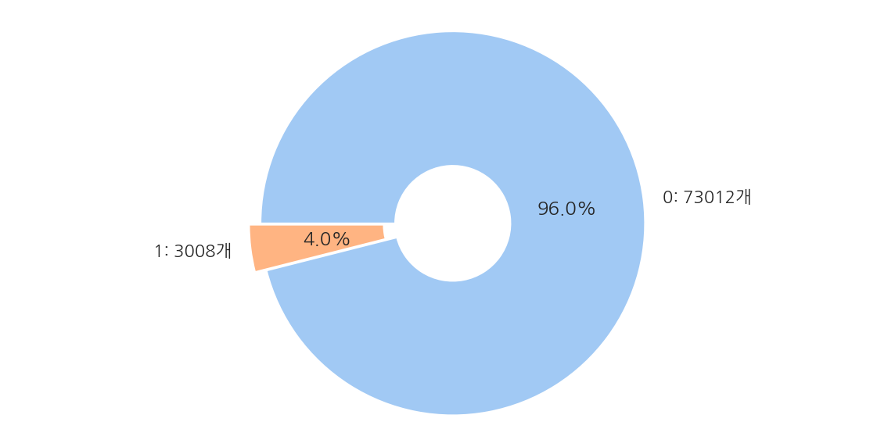
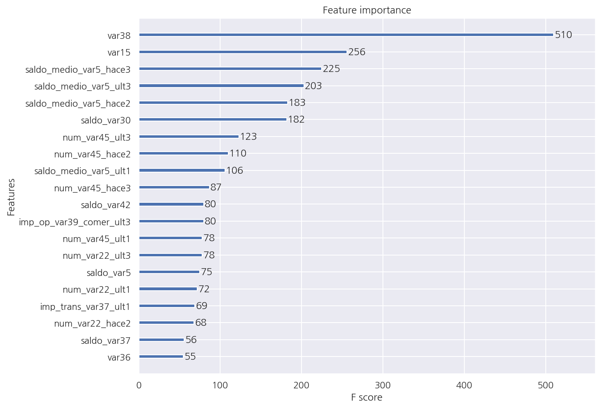
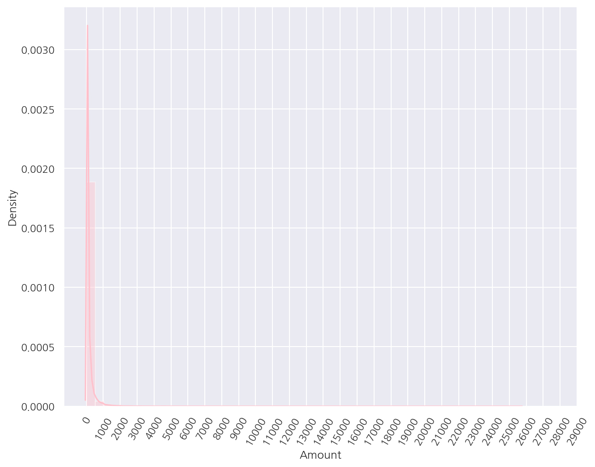
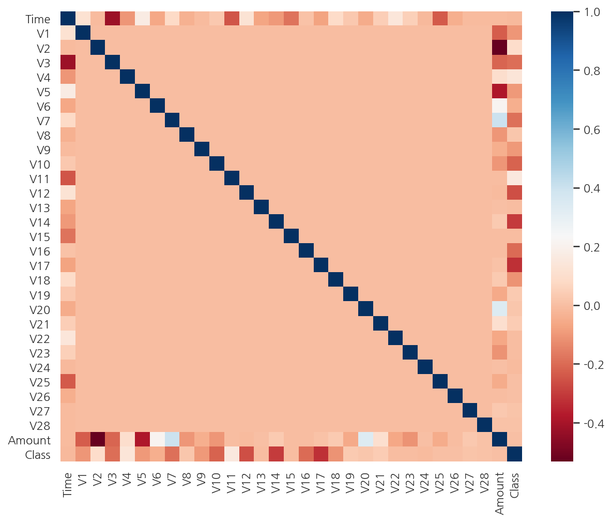

**파이썬 머신러닝 완벽가이드** 교재를 토대로 공부한 내용입니다.

실습과정에서 필요에 따라 내용의 누락 및 추가, 수정사항이 있습니다.

---


**기본 세팅**


```python
import numpy as np
import pandas as pd

import matplotlib as mpl
import matplotlib.pyplot as plt
import seaborn as sns

import warnings
```


```python
%matplotlib inline
%config InlineBackend.figure_format = 'retina'

mpl.rc('font', family='NanumGothic') # 폰트 설정
mpl.rc('axes', unicode_minus=False) # 유니코드에서 음수 부호 설정

# 차트 스타일 설정
sns.set(font="NanumGothic", rc={"axes.unicode_minus":False}, style='darkgrid')
plt.rc("figure", figsize=(10,8))

warnings.filterwarnings("ignore")
```

# 1. 캐글 산탄데르 고객 만족 예측

산탄데르 은행이 캐글에 경연을 의뢰한 데이터로 피처 이름은 모두 익명 처리돼 이름만을 가지고 어떤 속성인지는 알 수 없다.

레이블 값은 1이면 불만을 가진 고객, 0이면 만족한 고객이다.

## 1.1 데이터 불러오기 및 전처리


```python
cust_df = pd.read_csv("./santander_customer_satisfaction/train.csv", encoding="latin-1")
cust_df.head()
```


<div>
<style scoped>
    .dataframe tbody tr th:only-of-type {
        vertical-align: middle;
    }

    .dataframe tbody tr th {
        vertical-align: top;
    }

    .dataframe thead th {
        text-align: right;
    }
</style>
<table border="1" class="dataframe">
  <thead>
    <tr style="text-align: right;">
      <th></th>
      <th>ID</th>
      <th>var3</th>
      <th>var15</th>
      <th>imp_ent_var16_ult1</th>
      <th>imp_op_var39_comer_ult1</th>
      <th>imp_op_var39_comer_ult3</th>
      <th>imp_op_var40_comer_ult1</th>
      <th>imp_op_var40_comer_ult3</th>
      <th>imp_op_var40_efect_ult1</th>
      <th>imp_op_var40_efect_ult3</th>
      <th>...</th>
      <th>saldo_medio_var33_hace2</th>
      <th>saldo_medio_var33_hace3</th>
      <th>saldo_medio_var33_ult1</th>
      <th>saldo_medio_var33_ult3</th>
      <th>saldo_medio_var44_hace2</th>
      <th>saldo_medio_var44_hace3</th>
      <th>saldo_medio_var44_ult1</th>
      <th>saldo_medio_var44_ult3</th>
      <th>var38</th>
      <th>TARGET</th>
    </tr>
  </thead>
  <tbody>
    <tr>
      <th>0</th>
      <td>1</td>
      <td>2</td>
      <td>23</td>
      <td>0.0</td>
      <td>0.0</td>
      <td>0.0</td>
      <td>0.0</td>
      <td>0.0</td>
      <td>0.0</td>
      <td>0.0</td>
      <td>...</td>
      <td>0.0</td>
      <td>0.0</td>
      <td>0.0</td>
      <td>0.0</td>
      <td>0.0</td>
      <td>0.0</td>
      <td>0.0</td>
      <td>0.0</td>
      <td>39205.170000</td>
      <td>0</td>
    </tr>
    <tr>
      <th>1</th>
      <td>3</td>
      <td>2</td>
      <td>34</td>
      <td>0.0</td>
      <td>0.0</td>
      <td>0.0</td>
      <td>0.0</td>
      <td>0.0</td>
      <td>0.0</td>
      <td>0.0</td>
      <td>...</td>
      <td>0.0</td>
      <td>0.0</td>
      <td>0.0</td>
      <td>0.0</td>
      <td>0.0</td>
      <td>0.0</td>
      <td>0.0</td>
      <td>0.0</td>
      <td>49278.030000</td>
      <td>0</td>
    </tr>
    <tr>
      <th>2</th>
      <td>4</td>
      <td>2</td>
      <td>23</td>
      <td>0.0</td>
      <td>0.0</td>
      <td>0.0</td>
      <td>0.0</td>
      <td>0.0</td>
      <td>0.0</td>
      <td>0.0</td>
      <td>...</td>
      <td>0.0</td>
      <td>0.0</td>
      <td>0.0</td>
      <td>0.0</td>
      <td>0.0</td>
      <td>0.0</td>
      <td>0.0</td>
      <td>0.0</td>
      <td>67333.770000</td>
      <td>0</td>
    </tr>
    <tr>
      <th>3</th>
      <td>8</td>
      <td>2</td>
      <td>37</td>
      <td>0.0</td>
      <td>195.0</td>
      <td>195.0</td>
      <td>0.0</td>
      <td>0.0</td>
      <td>0.0</td>
      <td>0.0</td>
      <td>...</td>
      <td>0.0</td>
      <td>0.0</td>
      <td>0.0</td>
      <td>0.0</td>
      <td>0.0</td>
      <td>0.0</td>
      <td>0.0</td>
      <td>0.0</td>
      <td>64007.970000</td>
      <td>0</td>
    </tr>
    <tr>
      <th>4</th>
      <td>10</td>
      <td>2</td>
      <td>39</td>
      <td>0.0</td>
      <td>0.0</td>
      <td>0.0</td>
      <td>0.0</td>
      <td>0.0</td>
      <td>0.0</td>
      <td>0.0</td>
      <td>...</td>
      <td>0.0</td>
      <td>0.0</td>
      <td>0.0</td>
      <td>0.0</td>
      <td>0.0</td>
      <td>0.0</td>
      <td>0.0</td>
      <td>0.0</td>
      <td>117310.979016</td>
      <td>0</td>
    </tr>
  </tbody>
</table>
<p>5 rows × 371 columns</p>
</div>


```python
cust_df.info()
print("결측값의 수:", cust_df.isna().sum().sum())
print("타겟 type:", cust_df.TARGET.dtype)
```

    <class 'pandas.core.frame.DataFrame'>
    RangeIndex: 76020 entries, 0 to 76019
    Columns: 371 entries, ID to TARGET
    dtypes: float64(111), int64(260)
    memory usage: 215.2 MB
    결측값의 수: 0
    타겟 type: int64
    

- 76,020개의 행, 371개의 열로 이루어져있으며 결측값은 없다.


- 370개의 피처 중 float형이 111개, int형이 259개이다.


```python
cust_df.describe()
```


<div>
<style scoped>
    .dataframe tbody tr th:only-of-type {
        vertical-align: middle;
    }

    .dataframe tbody tr th {
        vertical-align: top;
    }

    .dataframe thead th {
        text-align: right;
    }
</style>
<table border="1" class="dataframe">
  <thead>
    <tr style="text-align: right;">
      <th></th>
      <th>ID</th>
      <th>var3</th>
      <th>var15</th>
      <th>imp_ent_var16_ult1</th>
      <th>imp_op_var39_comer_ult1</th>
      <th>imp_op_var39_comer_ult3</th>
      <th>imp_op_var40_comer_ult1</th>
      <th>imp_op_var40_comer_ult3</th>
      <th>imp_op_var40_efect_ult1</th>
      <th>imp_op_var40_efect_ult3</th>
      <th>...</th>
      <th>saldo_medio_var33_hace2</th>
      <th>saldo_medio_var33_hace3</th>
      <th>saldo_medio_var33_ult1</th>
      <th>saldo_medio_var33_ult3</th>
      <th>saldo_medio_var44_hace2</th>
      <th>saldo_medio_var44_hace3</th>
      <th>saldo_medio_var44_ult1</th>
      <th>saldo_medio_var44_ult3</th>
      <th>var38</th>
      <th>TARGET</th>
    </tr>
  </thead>
  <tbody>
    <tr>
      <th>count</th>
      <td>76020.000000</td>
      <td>76020.000000</td>
      <td>76020.000000</td>
      <td>76020.000000</td>
      <td>76020.000000</td>
      <td>76020.000000</td>
      <td>76020.000000</td>
      <td>76020.000000</td>
      <td>76020.000000</td>
      <td>76020.000000</td>
      <td>...</td>
      <td>76020.000000</td>
      <td>76020.000000</td>
      <td>76020.000000</td>
      <td>76020.000000</td>
      <td>76020.000000</td>
      <td>76020.000000</td>
      <td>76020.000000</td>
      <td>76020.000000</td>
      <td>7.602000e+04</td>
      <td>76020.000000</td>
    </tr>
    <tr>
      <th>mean</th>
      <td>75964.050723</td>
      <td>-1523.199277</td>
      <td>33.212865</td>
      <td>86.208265</td>
      <td>72.363067</td>
      <td>119.529632</td>
      <td>3.559130</td>
      <td>6.472698</td>
      <td>0.412946</td>
      <td>0.567352</td>
      <td>...</td>
      <td>7.935824</td>
      <td>1.365146</td>
      <td>12.215580</td>
      <td>8.784074</td>
      <td>31.505324</td>
      <td>1.858575</td>
      <td>76.026165</td>
      <td>56.614351</td>
      <td>1.172358e+05</td>
      <td>0.039569</td>
    </tr>
    <tr>
      <th>std</th>
      <td>43781.947379</td>
      <td>39033.462364</td>
      <td>12.956486</td>
      <td>1614.757313</td>
      <td>339.315831</td>
      <td>546.266294</td>
      <td>93.155749</td>
      <td>153.737066</td>
      <td>30.604864</td>
      <td>36.513513</td>
      <td>...</td>
      <td>455.887218</td>
      <td>113.959637</td>
      <td>783.207399</td>
      <td>538.439211</td>
      <td>2013.125393</td>
      <td>147.786584</td>
      <td>4040.337842</td>
      <td>2852.579397</td>
      <td>1.826646e+05</td>
      <td>0.194945</td>
    </tr>
    <tr>
      <th>min</th>
      <td>1.000000</td>
      <td>-999999.000000</td>
      <td>5.000000</td>
      <td>0.000000</td>
      <td>0.000000</td>
      <td>0.000000</td>
      <td>0.000000</td>
      <td>0.000000</td>
      <td>0.000000</td>
      <td>0.000000</td>
      <td>...</td>
      <td>0.000000</td>
      <td>0.000000</td>
      <td>0.000000</td>
      <td>0.000000</td>
      <td>0.000000</td>
      <td>0.000000</td>
      <td>0.000000</td>
      <td>0.000000</td>
      <td>5.163750e+03</td>
      <td>0.000000</td>
    </tr>
    <tr>
      <th>25%</th>
      <td>38104.750000</td>
      <td>2.000000</td>
      <td>23.000000</td>
      <td>0.000000</td>
      <td>0.000000</td>
      <td>0.000000</td>
      <td>0.000000</td>
      <td>0.000000</td>
      <td>0.000000</td>
      <td>0.000000</td>
      <td>...</td>
      <td>0.000000</td>
      <td>0.000000</td>
      <td>0.000000</td>
      <td>0.000000</td>
      <td>0.000000</td>
      <td>0.000000</td>
      <td>0.000000</td>
      <td>0.000000</td>
      <td>6.787061e+04</td>
      <td>0.000000</td>
    </tr>
    <tr>
      <th>50%</th>
      <td>76043.000000</td>
      <td>2.000000</td>
      <td>28.000000</td>
      <td>0.000000</td>
      <td>0.000000</td>
      <td>0.000000</td>
      <td>0.000000</td>
      <td>0.000000</td>
      <td>0.000000</td>
      <td>0.000000</td>
      <td>...</td>
      <td>0.000000</td>
      <td>0.000000</td>
      <td>0.000000</td>
      <td>0.000000</td>
      <td>0.000000</td>
      <td>0.000000</td>
      <td>0.000000</td>
      <td>0.000000</td>
      <td>1.064092e+05</td>
      <td>0.000000</td>
    </tr>
    <tr>
      <th>75%</th>
      <td>113748.750000</td>
      <td>2.000000</td>
      <td>40.000000</td>
      <td>0.000000</td>
      <td>0.000000</td>
      <td>0.000000</td>
      <td>0.000000</td>
      <td>0.000000</td>
      <td>0.000000</td>
      <td>0.000000</td>
      <td>...</td>
      <td>0.000000</td>
      <td>0.000000</td>
      <td>0.000000</td>
      <td>0.000000</td>
      <td>0.000000</td>
      <td>0.000000</td>
      <td>0.000000</td>
      <td>0.000000</td>
      <td>1.187563e+05</td>
      <td>0.000000</td>
    </tr>
    <tr>
      <th>max</th>
      <td>151838.000000</td>
      <td>238.000000</td>
      <td>105.000000</td>
      <td>210000.000000</td>
      <td>12888.030000</td>
      <td>21024.810000</td>
      <td>8237.820000</td>
      <td>11073.570000</td>
      <td>6600.000000</td>
      <td>6600.000000</td>
      <td>...</td>
      <td>50003.880000</td>
      <td>20385.720000</td>
      <td>138831.630000</td>
      <td>91778.730000</td>
      <td>438329.220000</td>
      <td>24650.010000</td>
      <td>681462.900000</td>
      <td>397884.300000</td>
      <td>2.203474e+07</td>
      <td>1.000000</td>
    </tr>
  </tbody>
</table>
<p>8 rows × 371 columns</p>
</div>


- var3의 경우 최소값이 -999999이다. 이는 NaN값이나 특정 예외 값을 변환한 것으로 판단된다.


- ID의 경우 단순 식별자이므로 필요 없다.


```python
print(cust_df.var3.value_counts().sort_index()[:1])
```

    -999999    116
    Name: var3, dtype: int64
    

- -999999가 116개가 존재하며 다른 값에 비해 std가 심하므로 최빈값으로 변환한다.


```python
from scipy.stats import mode

# var3 최빈값
var3_mode = mode(cust_df.var3.values)[0][0]

# var3 대체, ID 제거
cust_df["var3"].replace(-999999, var3_mode, inplace=True)
cust_df.drop("ID", axis=1, inplace=True)
```


```python
plt.figure(figsize=(10,5))

frequency = cust_df['TARGET'].value_counts()
label = [f"0: {frequency[0]}개", f"1: {frequency[1]}개"]

plt.pie(frequency,
    startangle = 180,
    counterclock = False,
    explode = [0.03] * 2,
    autopct = '%1.1f%%',
    labels = label,
    colors = sns.color_palette('pastel', 2),
    wedgeprops = dict(width=0.7)
  )


plt.axis('equal')
plt.show()
```


    

    


- 전체 76,020개 데이터 중 만족이 73,012개(96.0%), 불만족이 3,008개(4.0%)로 이루어져 있다.


- 대부분이 0(만족)이므로 정확도보다는 ROC-AUC로 성능을 평가한다.

## 1.2 성능 평가


```python
from sklearn.model_selection import train_test_split

# 피처, 레이블 분리
X_features = cust_df.iloc[:,:-1]
y_label = cust_df.iloc[:,-1]

# train, test
X_train, X_test, y_train, y_test = train_test_split(X_features, y_label, test_size=0.2, random_state=0)

print("train 레이블 분포")
print(y_train.value_counts() / y_train.count() * 100)
print("-"*30)
print("test 레이블 분포")
print(y_test.value_counts() / y_test.count() * 100)
```

    train 레이블 분포
    0    96.096422
    1     3.903578
    Name: TARGET, dtype: float64
    ------------------------------
    test 레이블 분포
    0    95.830045
    1     4.169955
    Name: TARGET, dtype: float64
    

- train과 test 모두 레이블의 분포는 원 데이터와 유사하게 만들어졌다.

### 1.2.1 XGBoost

**XGB 학습**


```python
from xgboost import XGBClassifier
from sklearn.metrics import roc_auc_score

# XGB 객체 생성
xgb_clf = XGBClassifier(n_estimators = 500, random_state = 156)

# 학습 - 조기 중단 설정, 성능 평가 AUC
evals = [ (X_train, y_train), (X_test, y_test)] # test set 사용은 과적합 주의
xgb_clf.fit(X_train, y_train,
            early_stopping_rounds=100, eval_metric="auc", eval_set=evals)
```

    [0]	validation_0-auc:0.82005	validation_1-auc:0.81157
    [1]	validation_0-auc:0.83400	validation_1-auc:0.82452
    [2]	validation_0-auc:0.83870	validation_1-auc:0.82746
    [3]	validation_0-auc:0.84419	validation_1-auc:0.82922
    [4]	validation_0-auc:0.84783	validation_1-auc:0.83298
    [5]	validation_0-auc:0.85125	validation_1-auc:0.83500
    [6]	validation_0-auc:0.85501	validation_1-auc:0.83653
    [7]	validation_0-auc:0.85830	validation_1-auc:0.83782
    [8]	validation_0-auc:0.86143	validation_1-auc:0.83802
    [9]	validation_0-auc:0.86452	validation_1-auc:0.83914
    [10]	validation_0-auc:0.86717	validation_1-auc:0.83954
    ...
    [111]	validation_0-auc:0.93663	validation_1-auc:0.82620
    [112]	validation_0-auc:0.93710	validation_1-auc:0.82591
    [113]	validation_0-auc:0.93781	validation_1-auc:0.82498
    [114]	validation_0-auc:0.93793	validation_1-auc:0.82525
    


    XGBClassifier(base_score=0.5, booster='gbtree', colsample_bylevel=1,
                  colsample_bynode=1, colsample_bytree=1, gamma=0, gpu_id=-1,
                  importance_type='gain', interaction_constraints='',
                  learning_rate=0.300000012, max_delta_step=0, max_depth=6,
                  min_child_weight=1, missing=nan, monotone_constraints='()',
                  n_estimators=500, n_jobs=8, num_parallel_tree=1, random_state=156,
                  reg_alpha=0, reg_lambda=1, scale_pos_weight=1, subsample=1,
                  tree_method='exact', validate_parameters=1, verbosity=None)


- n_estimators를 500으로 설정하였고 평가 set으로 train과 test를 사용하였을 때 114번 반복 후 조기 중단 되었다.


- 결과창이 너무 길어 직접 삭제하였다.


**XGB 예측/평가**


```python
# 예측 확률
xgb_pred_proba = xgb_clf.predict_proba(X_test)[:,1].reshape(-1,1)

# 평가
xgb_roc_auc = roc_auc_score(y_test, xgb_pred_proba, average="macro")
print(f"AUC: {xgb_roc_auc:.4f}")
```

    AUC: 0.8413
    

- test set으로 예측시 AUC는 약 0.8413으로 나타났다.

**XGB GridSearchCV**


```python
from sklearn.model_selection import GridSearchCV

# XGB 객체 생성 - n_estimators 감소
xgb_clf2 = XGBClassifier(n_estimators = 100, random_state = 156)

# 하이퍼 파라미터
params = {
    "max_depth": [5, 7], # 깊이
    "min_child_weight": [1, 3], # 가지 분할 가중치 
    "colsample_bytree": [0.5, 0.75] # 피처 선택 비율
}

# GridSearchCV
evals = [ (X_train, y_train), (X_test, y_test)] # test set 사용은 과적합 주의

grid_cv = GridSearchCV(xgb_clf2, param_grid=params, cv=3)
grid_cv.fit(X_train, y_train,
            early_stopping_rounds=100, eval_metric="auc", eval_set=evals)
```

      


    GridSearchCV(cv=3,
                 estimator=XGBClassifier(base_score=None, booster=None,
                                         colsample_bylevel=None,
                                         colsample_bynode=None,
                                         colsample_bytree=None, gamma=None,
                                         gpu_id=None, importance_type='gain',
                                         interaction_constraints=None,
                                         learning_rate=None, max_delta_step=None,
                                         max_depth=None, min_child_weight=None,
                                         missing=nan, monotone_constraints=None,
                                         n_estimators=100, n_jobs=None,
                                         num_parallel_tree=None, random_state=156,
                                         reg_alpha=None, reg_lambda=None,
                                         scale_pos_weight=None, subsample=None,
                                         tree_method=None, validate_parameters=None,
                                         verbosity=None),
                 param_grid={'colsample_bytree': [0.5, 0.75], 'max_depth': [5, 7],
                             'min_child_weight': [1, 3]})


- 결과창이 너무 길어 직접 삭제하였다.
  

```python
# 최적 하이퍼 파라미터
print("GridSearchCV 최적 하이퍼 파라미터:", grid_cv.best_params_)

# 최적 하이퍼 파라미터로 예측 평가
best_xgb_clf = grid_cv.best_estimator_
best_pred_proba = best_xgb_clf.predict_proba(X_test)[:,1].reshape(-1,1)
best_roc_auc = roc_auc_score(y_test, best_pred_proba, average="macro")
print(f"GridSearchCV AUC: {best_roc_auc:.4f}")
```

    GridSearchCV 최적 하이퍼 파라미터: {'colsample_bytree': 0.5, 'max_depth': 7, 'min_child_weight': 1}
    GridSearchCV AUC: 0.8429
    

- 최적 하이퍼 파라미터는 colsample_bytree: 0.5, max_depth: 7, min_child_weight: 1 이고, 이때 AUC는 0.8429이다.


- 앞서 AUC가 0.8413에서 미미하지만 조금 증가하였다.


- 수행시간이 확실히 오래 걸린다.

**XGB 피처별 중요도**


```python
from xgboost import plot_importance

plot_importance(best_xgb_clf, max_num_features=20)
plt.show()
```


    

    


### 1.2.2 LightGBM

**LGBM 학습**


```python
from lightgbm import LGBMClassifier

# LGBM 객체 생성
lgbm_clf = LGBMClassifier(n_estimators = 500, random_state = 156)

# 학습 - 조기 중단 설정, 성능 평가 AUC
evals = [ (X_test, y_test) ] # test set 사용은 과적합 주의
lgbm_clf.fit(X_train, y_train,
             early_stopping_rounds=100, eval_metric="auc", eval_set=evals,
             verbose=True)
```

    [1]	valid_0's auc: 0.817384	valid_0's binary_logloss: 0.165046
    Training until validation scores don't improve for 100 rounds
    [2]	valid_0's auc: 0.818903	valid_0's binary_logloss: 0.160006
    ...
    [15]	valid_0's auc: 0.840928	valid_0's binary_logloss: 0.14161
    ...
    [111]	valid_0's auc: 0.836957	valid_0's binary_logloss: 0.140426
    [112]	valid_0's auc: 0.836779	valid_0's binary_logloss: 0.14051
    [113]	valid_0's auc: 0.836831	valid_0's binary_logloss: 0.140526
    [114]	valid_0's auc: 0.836783	valid_0's binary_logloss: 0.14055
    [115]	valid_0's auc: 0.836672	valid_0's binary_logloss: 0.140585
    Early stopping, best iteration is:
    [15]	valid_0's auc: 0.840928	valid_0's binary_logloss: 0.14161
    


    LGBMClassifier(n_estimators=500, random_state=156)


- 115번 반복 후 조기 중단되었다.


- 결과창이 너무 길어 직접 삭제하였다.


**LGBM 예측/평가**


```python
# 예측 확률
lgbm_pred_proba = lgbm_clf.predict_proba(X_test)[:,1].reshape(-1,1)

# 평가
lgbm_roc_auc = roc_auc_score(y_test, lgbm_pred_proba, average="macro")
print(f"AUC: {lgbm_roc_auc:.4f}")
```

    AUC: 0.8409
    

- AUC는 0.8409로 XGB로 수행하였을 때보다는 작은 수치로 나타났다.

**LGBM GridSearchCV**


```python
from sklearn.model_selection import GridSearchCV

# LGBM 객체 생성 - n_estimators 감소
lgbm_clf2 = LGBMClassifier(n_estimators = 200, random_state = 156)

# 하이퍼 파라미터
params = {
    "num_leaves": [32, 64], # 최대 리프 수
    "max_depth": [128, 160], # 깊이
    "min_child_samples": [60, 100], # 리프 최소 샘플 수
    "subsample": [0.8, 1] # 샘플 비율
}

# GridSearchCV
evals = [ (X_train, y_train), (X_test, y_test) ] # test set 사용은 과적합 주의

grid_cv2 = GridSearchCV(lgbm_clf2, param_grid=params, cv=3)
grid_cv2.fit(X_train, y_train,
             early_stopping_rounds=100, eval_metric="auc", eval_set=evals)
```   


    GridSearchCV(cv=3, estimator=LGBMClassifier(n_estimators=200, random_state=156),
                 param_grid={'max_depth': [128, 160],
                             'min_child_samples': [60, 100], 'num_leaves': [32, 64],
                             'subsample': [0.8, 1]})


- 결과창이 너무 길어 직접 삭제하였다.


```python
# 최적 하이퍼 파라미터
print("GridSearchCV 최적 하이퍼 파라미터:", grid_cv2.best_params_)

# 최적 하이퍼 파라미터로 예측 평가
best_lgbm_clf = grid_cv2.best_estimator_
best_pred_proba2 = best_lgbm_clf.predict_proba(X_test)[:,1].reshape(-1,1)
best_roc_auc2 = roc_auc_score(y_test, best_pred_proba2, average="macro")
print(f"GridSearchCV AUC: {best_roc_auc2:.4f}")
```

    GridSearchCV 최적 하이퍼 파라미터: {'max_depth': 128, 'min_child_samples': 100, 'num_leaves': 32, 'subsample': 0.8}
    GridSearchCV AUC: 0.8417
    

- 앞서 AUC가 0.8409에서 0.8417로 조금 증가하였고 GridSearchCV로 XGB를 수행하였을 때 0.8429 보단 작게 나타났다.


- 수행시간은 확실 XGB보다도 훨씬 빠른 것이 체감된다.

# 2. 캐글 신용카드 사기 검출

데이터의 레이블인 Class는 1이면 신용카드 사기 트랜잭션, 0이면 정상적인 신용카드 트랜잭션 데이터다.

전체 데이터의 약 0.172%만이 1, 사기 트랜잭션으로 레이블은 매우 불균형한 분포다.

일반적으로 사기 검출, 이상 검출과 같은 데이터는 이처럼 매우 불균형한 분포일 가능성이 높을 수 밖에 없다.

## 2.1 언더 샘플링, 오버 샘플링

현 예제처럼 극도로 불균형한 레이블 값 분포로 인한 문제점을 해결하기 위해서는 적절한 학습 데이터를 확보하는 방안이 필요하다.

대표적으로 언더 샘플링과 오버 샘플링이 있으며 오버 샘플링 방식이 예측 성능상 더 유리한 경우가 많아 주로 사용된다.

**언더 샘플링**

- 많은 데이터 셋을 적은 데이터 셋 수준으로 감소시키는 방식


- 정상 레이블이 10,000건, 이상 레이블이 100건이라면 정상 레이블 데이터를 100건으로 줄여버린다.


- 기존보다 과도하게 정상 레이블로 학습/예측하는 부작용은 개선되지만 과도한 데이터 감소로 정상 레이블의 경우 오히려 제대로 된 학습 수행을 할 수 없다.

**오버 샘플링**

- 적은 데이터 셋을 많은 데이터 셋 수준으로 증가시키는 방식


- 단순히 동일한 데이터를 증식하면 과적합이 되기에 원본 데이터의 피처 값을 약간만 변경하여 증식한다.


- 대표적으로 SMOTE(Synthetic Minority Over-sampling Technique) 방법이 있다.


- SMOTE는 적은 데이터 셋에 있는 개별 데이터들의 K 최근접 이웃(KNN)을 찾아 데이터와 K개의 이웃들의 차이를 일정 값으로 만들어 기존 데이터와 약간 차이가 나는 새로운 데이터들을 생성하는 방식이다.

## 2.2 데이터 1차 가공 및 학습/예측/평가

### 2.2.1 데이터 1차 가공


```python
card_df = pd.read_csv("./creditcard.csv")
card_df.head()
```


<div>
<style scoped>
    .dataframe tbody tr th:only-of-type {
        vertical-align: middle;
    }

    .dataframe tbody tr th {
        vertical-align: top;
    }

    .dataframe thead th {
        text-align: right;
    }
</style>
<table border="1" class="dataframe">
  <thead>
    <tr style="text-align: right;">
      <th></th>
      <th>Time</th>
      <th>V1</th>
      <th>V2</th>
      <th>V3</th>
      <th>V4</th>
      <th>V5</th>
      <th>V6</th>
      <th>V7</th>
      <th>V8</th>
      <th>V9</th>
      <th>...</th>
      <th>V21</th>
      <th>V22</th>
      <th>V23</th>
      <th>V24</th>
      <th>V25</th>
      <th>V26</th>
      <th>V27</th>
      <th>V28</th>
      <th>Amount</th>
      <th>Class</th>
    </tr>
  </thead>
  <tbody>
    <tr>
      <th>0</th>
      <td>0.0</td>
      <td>-1.359807</td>
      <td>-0.072781</td>
      <td>2.536347</td>
      <td>1.378155</td>
      <td>-0.338321</td>
      <td>0.462388</td>
      <td>0.239599</td>
      <td>0.098698</td>
      <td>0.363787</td>
      <td>...</td>
      <td>-0.018307</td>
      <td>0.277838</td>
      <td>-0.110474</td>
      <td>0.066928</td>
      <td>0.128539</td>
      <td>-0.189115</td>
      <td>0.133558</td>
      <td>-0.021053</td>
      <td>149.62</td>
      <td>0</td>
    </tr>
    <tr>
      <th>1</th>
      <td>0.0</td>
      <td>1.191857</td>
      <td>0.266151</td>
      <td>0.166480</td>
      <td>0.448154</td>
      <td>0.060018</td>
      <td>-0.082361</td>
      <td>-0.078803</td>
      <td>0.085102</td>
      <td>-0.255425</td>
      <td>...</td>
      <td>-0.225775</td>
      <td>-0.638672</td>
      <td>0.101288</td>
      <td>-0.339846</td>
      <td>0.167170</td>
      <td>0.125895</td>
      <td>-0.008983</td>
      <td>0.014724</td>
      <td>2.69</td>
      <td>0</td>
    </tr>
    <tr>
      <th>2</th>
      <td>1.0</td>
      <td>-1.358354</td>
      <td>-1.340163</td>
      <td>1.773209</td>
      <td>0.379780</td>
      <td>-0.503198</td>
      <td>1.800499</td>
      <td>0.791461</td>
      <td>0.247676</td>
      <td>-1.514654</td>
      <td>...</td>
      <td>0.247998</td>
      <td>0.771679</td>
      <td>0.909412</td>
      <td>-0.689281</td>
      <td>-0.327642</td>
      <td>-0.139097</td>
      <td>-0.055353</td>
      <td>-0.059752</td>
      <td>378.66</td>
      <td>0</td>
    </tr>
    <tr>
      <th>3</th>
      <td>1.0</td>
      <td>-0.966272</td>
      <td>-0.185226</td>
      <td>1.792993</td>
      <td>-0.863291</td>
      <td>-0.010309</td>
      <td>1.247203</td>
      <td>0.237609</td>
      <td>0.377436</td>
      <td>-1.387024</td>
      <td>...</td>
      <td>-0.108300</td>
      <td>0.005274</td>
      <td>-0.190321</td>
      <td>-1.175575</td>
      <td>0.647376</td>
      <td>-0.221929</td>
      <td>0.062723</td>
      <td>0.061458</td>
      <td>123.50</td>
      <td>0</td>
    </tr>
    <tr>
      <th>4</th>
      <td>2.0</td>
      <td>-1.158233</td>
      <td>0.877737</td>
      <td>1.548718</td>
      <td>0.403034</td>
      <td>-0.407193</td>
      <td>0.095921</td>
      <td>0.592941</td>
      <td>-0.270533</td>
      <td>0.817739</td>
      <td>...</td>
      <td>-0.009431</td>
      <td>0.798278</td>
      <td>-0.137458</td>
      <td>0.141267</td>
      <td>-0.206010</td>
      <td>0.502292</td>
      <td>0.219422</td>
      <td>0.215153</td>
      <td>69.99</td>
      <td>0</td>
    </tr>
  </tbody>
</table>
<p>5 rows × 31 columns</p>
</div>


- Time 피처는 데이터 생성 관련 작업용 속성으로 큰 의미가 없어 제거한다.


- V1 ~ V28은 피처의 의미를 알 수 없으며 Amount 피처는 신용카드 트랜잭션 금액을 의미한다.


```python
card_df.info()
```

    <class 'pandas.core.frame.DataFrame'>
    RangeIndex: 284807 entries, 0 to 284806
    Data columns (total 31 columns):
     #   Column  Non-Null Count   Dtype  
    ---  ------  --------------   -----  
     0   Time    284807 non-null  float64
     1   V1      284807 non-null  float64
     2   V2      284807 non-null  float64
     3   V3      284807 non-null  float64
     4   V4      284807 non-null  float64
     5   V5      284807 non-null  float64
     6   V6      284807 non-null  float64
     7   V7      284807 non-null  float64
     8   V8      284807 non-null  float64
     9   V9      284807 non-null  float64
     10  V10     284807 non-null  float64
     11  V11     284807 non-null  float64
     12  V12     284807 non-null  float64
     13  V13     284807 non-null  float64
     14  V14     284807 non-null  float64
     15  V15     284807 non-null  float64
     16  V16     284807 non-null  float64
     17  V17     284807 non-null  float64
     18  V18     284807 non-null  float64
     19  V19     284807 non-null  float64
     20  V20     284807 non-null  float64
     21  V21     284807 non-null  float64
     22  V22     284807 non-null  float64
     23  V23     284807 non-null  float64
     24  V24     284807 non-null  float64
     25  V25     284807 non-null  float64
     26  V26     284807 non-null  float64
     27  V27     284807 non-null  float64
     28  V28     284807 non-null  float64
     29  Amount  284807 non-null  float64
     30  Class   284807 non-null  int64  
    dtypes: float64(30), int64(1)
    memory usage: 67.4 MB
    

- 284,807개의 행, 31개의 열로 이루어져있으며 결측값은 없다.


- 레이블을 제외한 피처는 모두 float형이다.

**데이터 가공 함수**


```python
from sklearn.model_selection import train_test_split

# DF 복사 후 Time 컬럼 삭제하고 복사된 DF 반환
def get_preprocessed_df(df=None):
    df_copy = df.copy()
    df_copy.drop("Time", axis=1, inplace=True)
    return df_copy

# 데이터 가공 후 train, test 반환
def get_train_test_dataset(df=None):
    temp_df = get_preprocessed_df(df)
    
    # 피처, 레이블 분리
    X_features = temp_df.iloc[:,:-1]
    y_target = temp_df.iloc[:,-1]
    
    # train, test 생성, 원 데이터 분포 반영
    X_train, X_test, y_train, y_test = train_test_split(X_features, y_target, 
                                                        test_size=0.3, random_state=0, stratify=y_target)
    
    return X_train, X_test, y_train, y_test
```


```python
X_train, X_test, y_train, y_test = get_train_test_dataset(card_df)
```


```python
print("train 레이블 분포")
print(y_train.value_counts() / y_train.count() * 100)
print("-"*30)
print("test 레이블 분포")
print(y_test.value_counts() / y_test.count() * 100)
```

    train 레이블 분포
    0    99.827451
    1     0.172549
    Name: Class, dtype: float64
    ------------------------------
    test 레이블 분포
    0    99.826785
    1     0.173215
    Name: Class, dtype: float64
    

- train과 test 모두 레이블의 분포는 원 데이터와 유사하게 만들어졌다.

### 2.2.2 성능 평가


```python
# 3장에서 사용한 성능 평가 함수
from sklearn.metrics import accuracy_score, precision_score, recall_score, confusion_matrix
from sklearn.metrics import f1_score, roc_auc_score

def get_clf_eval(y_test, pred=None, pred_proba_po=None):
    confusion = confusion_matrix(y_test, pred)
    accuracy = accuracy_score(y_test, pred)
    precision = precision_score(y_test, pred)
    recall = recall_score(y_test, pred)
    f1 = f1_score(y_test, pred)
    auc = roc_auc_score(y_test, pred_proba_po)
   
    print("오차 행렬")
    print(confusion)
    print(f"정확도: {accuracy:.4f}, 정밀도: {precision:.4f}, 재현율: {recall:.4f}, F1: {f1:.4f}, AUC: {auc:.4f}")
```


```python
# 학습/예측/평가 함수
def get_model_train_eval(model, train_x=None, test_x=None, train_y=None, test_y=None):
    model.fit(train_x, train_y)
    pred = model.predict(test_x)
    pred_proba = model.predict_proba(test_x)[:,1].reshape(-1,1)
    get_clf_eval(test_y, pred, pred_proba)
```

#### 2.2.2.1 Logistic Regression


```python
from sklearn.linear_model import LogisticRegression

lr_clf = LogisticRegression()
get_model_train_eval(lr_clf, train_x=X_train, test_x=X_test, train_y=y_train, test_y=y_test)
```

    오차 행렬
    [[85282    13]
     [   56    92]]
    정확도: 0.9992, 정밀도: 0.8762, 재현율: 0.6216, F1: 0.7273, AUC: 0.9586
    

#### 2.2.2.2 LightGBM


```python
import lightgbm
lightgbm.__version__
```


    '3.2.1'


- LightGBM 2.1.0 이상 버전에서 boost_from_average 파라미터 디폴트 값은 True이다.


- 레이블 값이 극도로 불균형한 분포인 경우 boost_from_average를 True로 설정하면 재현율, AUC 성능을 저하 한다고 한다.


```python
from lightgbm import LGBMClassifier

lgbm_clf3 = LGBMClassifier(n_estimators=1000, num_leaves=64, n_jobs=-1)
get_model_train_eval(lgbm_clf3, train_x=X_train, test_x=X_test, train_y=y_train, test_y=y_test)
```

    오차 행렬
    [[85224    71]
     [   83    65]]
    정확도: 0.9982, 정밀도: 0.4779, 재현율: 0.4392, F1: 0.4577, AUC: 0.7225
    

- boost_from_average = True인 경우 확실히 정밀도, 재현율, F1, AUC 모두 크게 저하되어있다.


- 이에 대해선 따로 공부해야겠다.


```python
from lightgbm import LGBMClassifier

lgbm_clf3 = LGBMClassifier(n_estimators=1000, num_leaves=64, n_jobs=-1, boost_from_average=False)
get_model_train_eval(lgbm_clf3, train_x=X_train, test_x=X_test, train_y=y_train, test_y=y_test)
```

    오차 행렬
    [[85290     5]
     [   36   112]]
    정확도: 0.9995, 정밀도: 0.9573, 재현율: 0.7568, F1: 0.8453, AUC: 0.9790
    

- boost_from_average = False로 설정하니 True에 비해 성능이 확실히 좋게 나왔다.


- 로지스틱에 비해서 성능이 향상된 것이 확인된다.

## 2.3 데이터 분포 변환 및 학습/예측/평가

### 2.3.1 데이터 분포 변환


```python
card_df.describe()[["Amount"]].T
```


<div>
<style scoped>
    .dataframe tbody tr th:only-of-type {
        vertical-align: middle;
    }

    .dataframe tbody tr th {
        vertical-align: top;
    }

    .dataframe thead th {
        text-align: right;
    }
</style>
<table border="1" class="dataframe">
  <thead>
    <tr style="text-align: right;">
      <th></th>
      <th>count</th>
      <th>mean</th>
      <th>std</th>
      <th>min</th>
      <th>25%</th>
      <th>50%</th>
      <th>75%</th>
      <th>max</th>
    </tr>
  </thead>
  <tbody>
    <tr>
      <th>Amount</th>
      <td>284807.0</td>
      <td>88.349619</td>
      <td>250.120109</td>
      <td>0.0</td>
      <td>5.6</td>
      <td>22.0</td>
      <td>77.165</td>
      <td>25691.16</td>
    </tr>
  </tbody>
</table>
</div>


- Amount는 평균값이 약 88이고 3분위수도 77인데 최대값은 25,691로 매우 크다.


```python
sns.distplot(card_df.Amount, kde = True, color = "pink")
plt.xticks( range(0, 30000, 1000), rotation=60)
plt.show()
```


    

    


- 분포를 확인하였을 때 사용금액이 1,000불 이하가 대부분이며 일부만 매우 큰 금액임을 알 수 있다.


- 로지스틱 회귀 등 대부분 선형 모델은 피처가 정규 분포 형태를 띄는 것을 선호하므로 추가적으로 가공을 진행한다.

**데이터 가공 함수**


```python
from sklearn.model_selection import train_test_split
from sklearn.preprocessing import StandardScaler

# DF 복사 후 Time 컬럼 삭제하고 복사된 DF 반환 + Amount 스케일링
def get_preprocessed_df(df=None):
    df_copy = df.copy()
    
    # Amount 스케일링
    scaler = StandardScaler()
    amount_scaled = scaler.fit_transform(df_copy.Amount.values.reshape(-1,1))
    df_copy.Amount = amount_scaled
    
    df_copy.drop("Time", axis=1, inplace=True)
    return df_copy

# 데이터 가공 후 train, test 반환
def get_train_test_dataset(df=None):
    temp_df = get_preprocessed_df(df)
    
    # 피처, 레이블 분리
    X_features = temp_df.iloc[:,:-1]
    y_target = temp_df.iloc[:,-1]
    
    # train, test 생성, 원 데이터 분포 반영
    X_train, X_test, y_train, y_test = train_test_split(X_features, y_target, 
                                                        test_size=0.3, random_state=0, stratify=y_target)
    
    return X_train, X_test, y_train, y_test
```

### 2.3.2 성능 평가


```python
# Amount 스케일링 후 데이터 셋 생성
X_train, X_test, y_train, y_test = get_train_test_dataset(card_df)

# Logistic Regression 성능 평가
print("### Logistic Regression 성능 평가")
lr_clf2 = LogisticRegression()
get_model_train_eval(lr_clf2, train_x=X_train, test_x=X_test, train_y=y_train, test_y=y_test)

# LightGBM 성능 평가
print("### LightGBM 성능 평가")
lgbm_clf4 = LGBMClassifier(n_estimators=1000, num_leaves=64, n_jobs=-1, boost_from_average=False)
get_model_train_eval(lgbm_clf4, train_x=X_train, test_x=X_test, train_y=y_train, test_y=y_test)
```

    ### Logistic Regression 성능 평가
    오차 행렬
    [[85281    14]
     [   58    90]]
    정확도: 0.9992, 정밀도: 0.8654, 재현율: 0.6081, F1: 0.7143, AUC: 0.9702
    ### LightGBM 성능 평가
    오차 행렬
    [[85291     4]
     [   36   112]]
    정확도: 0.9995, 정밀도: 0.9655, 재현율: 0.7568, F1: 0.8485, AUC: 0.9782
    

- Amount 스케일링 전후 성능 평가 지표의 차이는 크게 없다.

### 2.3.3 데이터 로그 변환

이번에는 StandardScaler가 아닌 로그 변환을 적용해본다.

로그 변환은 데이터 분포가 심하게 왜곡되어 있을 때 적용하는 중요 기법 중 하나로 변환 시 상대적으로 값이 작아지기에 데이터 분포 왜곡을 개선해준다.

**데이터 가공 함수**


```python
from sklearn.model_selection import train_test_split
from sklearn.preprocessing import StandardScaler

# DF 복사 후 Time 컬럼 삭제하고 복사된 DF 반환 + Amount 로그 변환
def get_preprocessed_df(df=None):
    df_copy = df.copy()
    
    # Amount 로그 변환
    amount_log_scaled = np.log1p(df_copy.Amount)
    df_copy.Amount = amount_log_scaled
    
    df_copy.drop("Time", axis=1, inplace=True)
    return df_copy

# 데이터 가공 후 train, test 반환
def get_train_test_dataset(df=None):
    temp_df = get_preprocessed_df(df)
    
    # 피처, 레이블 분리
    X_features = temp_df.iloc[:,:-1]
    y_target = temp_df.iloc[:,-1]
    
    # train, test 생성, 원 데이터 분포 반영
    X_train, X_test, y_train, y_test = train_test_split(X_features, y_target, 
                                                        test_size=0.3, random_state=0, stratify=y_target)
    
    return X_train, X_test, y_train, y_test
```

### 2.3.4 성능 평가


```python
# Amount 로그 변환 후 데이터 셋 생성
X_train, X_test, y_train, y_test = get_train_test_dataset(card_df)

# Logistic Regression 성능 평가
print("### Logistic Regression 성능 평가")
lr_clf3 = LogisticRegression()
get_model_train_eval(lr_clf3, train_x=X_train, test_x=X_test, train_y=y_train, test_y=y_test)

# LightGBM 성능 평가
print("### LightGBM 성능 평가")
lgbm_clf5 = LGBMClassifier(n_estimators=1000, num_leaves=64, n_jobs=-1, boost_from_average=False)
get_model_train_eval(lgbm_clf5, train_x=X_train, test_x=X_test, train_y=y_train, test_y=y_test)
```

    ### Logistic Regression 성능 평가
    오차 행렬
    [[85283    12]
     [   59    89]]
    정확도: 0.9992, 정밀도: 0.8812, 재현율: 0.6014, F1: 0.7149, AUC: 0.9727
    ### LightGBM 성능 평가
    오차 행렬
    [[85290     5]
     [   36   112]]
    정확도: 0.9995, 정밀도: 0.9573, 재현율: 0.7568, F1: 0.8453, AUC: 0.9790
    

- Logistic Regression의 경우 대체로 성능이 향상되었고 LightGBM의 경우 큰 차이가 없다.

## 2.4 이상치 제거 및 학습/예측/평가

이번에는 이상치 데이터를 제거하고 학습/예측/평가를 진행해본다.

이상치 기준은 IQR 방식을 적용한다.


```python
corr_M = card_df.corr()
sns.heatmap(corr_M, cmap="RdBu")
plt.show()
```


    

    


- 상관관계 히트맵에서 Class와 음의 상관관계가 높은 V14와 V17 중 V14에 대해서 이상치 제거를 작업해보기로 한다.

### 2.4.1 데이터 이상치 제거


```python
# IQR 이상치 제거
def get_outlier(df=None, column=None): 
    # Class가 1인 경우만 진행
    fraud = df[df.Class == 1][column]
    
    # IQR 및 Boundary 설정
    Q1 = np.percentile(fraud.values, 25)
    Q3 = np.percentile(fraud.values, 75)
    IQR = Q3 - Q1
    upper_bound = Q3 + 1.5 * IQR
    lower_bound = Q1 - 1.5 * IQR
    
    # 이상치 인덱스 반환
    outlier_index = fraud[ (fraud < lower_bound) | (fraud > upper_bound)].index
    return outlier_index

get_outlier(card_df, "V14")
```


    Int64Index([8296, 8615, 9035, 9252], dtype='int64')


- IQR 방식으로 이상치 인덱스를 반환하는 함수를 생성하였다.


- 이상치 인덱스는 Class가 1인 경우만 찾았다.

**데이터 가공 함수**


```python
from sklearn.model_selection import train_test_split
from sklearn.preprocessing import StandardScaler

# Time 삭제후 DF 반환 + Amount 로그 변환 + 이상치 제거
def get_preprocessed_df(df=None):
    df_copy = df.copy()
    
    # Amount 로그 변환
    amount_log_scaled = np.log1p(df_copy.Amount)
    df_copy.Amount = amount_log_scaled
    
    # IQR 이상치 제거
    outlier_index = get_outlier(df_copy, "V14")
    df_copy.drop(outlier_index, axis=0, inplace=True)
    
    # Time 삭제
    df_copy.drop("Time", axis=1, inplace=True)
    return df_copy

# 데이터 가공 후 train, test 반환
def get_train_test_dataset(df=None):
    temp_df = get_preprocessed_df(df)
    
    # 피처, 레이블 분리
    X_features = temp_df.iloc[:,:-1]
    y_target = temp_df.iloc[:,-1]
    
    # train, test 생성, 원 데이터 분포 반영
    X_train, X_test, y_train, y_test = train_test_split(X_features, y_target, 
                                                        test_size=0.3, random_state=0, stratify=y_target)
    
    return X_train, X_test, y_train, y_test
```

### 2.4.2 성능 평가


```python
# 이상치 제거 추가 후 데이터 셋 생성
X_train, X_test, y_train, y_test = get_train_test_dataset(card_df)

# Logistic Regression 성능 평가
print("### Logistic Regression 성능 평가")
lr_clf4 = LogisticRegression()
get_model_train_eval(lr_clf4, train_x=X_train, test_x=X_test, train_y=y_train, test_y=y_test)

# LightGBM 성능 평가
print("### LightGBM 성능 평가")
lgbm_clf6 = LGBMClassifier(n_estimators=1000, num_leaves=64, n_jobs=-1, boost_from_average=False)
get_model_train_eval(lgbm_clf6, train_x=X_train, test_x=X_test, train_y=y_train, test_y=y_test)
```

    ### Logistic Regression 성능 평가
    오차 행렬
    [[85281    14]
     [   48    98]]
    정확도: 0.9993, 정밀도: 0.8750, 재현율: 0.6712, F1: 0.7597, AUC: 0.9743
    ### LightGBM 성능 평가
    오차 행렬
    [[85291     4]
     [   25   121]]
    정확도: 0.9997, 정밀도: 0.9680, 재현율: 0.8288, F1: 0.8930, AUC: 0.9791
    

- 이상치 제거 후 두 모델 모두 모든 예측 성능이 크게 향상 되었다.

## 2.5 SMOTE 오버 샘플링 및 학습/예측/평가

### 2.5.1 SMOTE 오버 샘플링

이번에는 SMOTE 오버 샘플링 후 학습/예측/평가를 진행해본다.

주의할 점은 SMOTE 오버 샘플링은 반드시 train set에만 적용하여야 한다.


```python
from imblearn.over_sampling import SMOTE

smote = SMOTE(random_state=0)
X_train_over, y_train_over = smote.fit_sample(X_train, y_train)

print("SMOTE 적용 전 train 피처/레이블 shape", X_train.shape, y_train.shape)
print("SMOTE 적용 후 train 피처/레이블 shape", X_train_over.shape, y_train_over.shape)
print("-"*60)
print("SMOTE 적용 후 레이블 분포")
print(y_train_over.value_counts())
```

    SMOTE 적용 전 train 피처/레이블 shape (199362, 29) (199362,)
    SMOTE 적용 후 train 피처/레이블 shape (398040, 29) (398040,)
    ------------------------------------------------------------
    SMOTE 적용 후 레이블 분포
    1    199020
    0    199020
    Name: Class, dtype: int64
    

- SMOTE 오버 샘플링 이후 데이터가 대략 2배 정도 증가하였다.


- 또한 레이블 값이 0과 1의 분포가 동일하게 생성되었다.

### 2.5.2 성능 평가


```python
# 이상치 제거 추가 후 데이터 셋 생성
X_train, X_test, y_train, y_test = get_train_test_dataset(card_df)

# SMOTE 오버 샘플링
smote = SMOTE(random_state=0)
X_train_over, y_train_over = smote.fit_sample(X_train, y_train)

# Logistic Regression 성능 평가
print("### Logistic Regression 성능 평가")
lr_clf5 = LogisticRegression()
get_model_train_eval(lr_clf5, train_x=X_train_over, test_x=X_test, train_y=y_train_over, test_y=y_test)

# LightGBM 성능 평가
print("### LightGBM 성능 평가")
lgbm_clf7 = LGBMClassifier(n_estimators=1000, num_leaves=64, n_jobs=-1, boost_from_average=False)
get_model_train_eval(lgbm_clf7, train_x=X_train_over, test_x=X_test, train_y=y_train_over, test_y=y_test)
```

    ### Logistic Regression 성능 평가
    오차 행렬
    [[82937  2358]
     [   11   135]]
    정확도: 0.9723, 정밀도: 0.0542, 재현율: 0.9247, F1: 0.1023, AUC: 0.9737
    ### LightGBM 성능 평가
    오차 행렬
    [[85283    12]
     [   22   124]]
    정확도: 0.9996, 정밀도: 0.9118, 재현율: 0.8493, F1: 0.8794, AUC: 0.9814
    

- 두 모델 모두 재현율은 증가한 반면 정밀도는 크게 감소하였으며 특히 로지스틱의 경우 정밀도가 심각하게 저하됐다.


- 이는 SMOTE 오버 샘플링으로 인해 실제 샘플에서보다 많은 레이블 1값을 학습하면서 지나치게 1로 예측을 하였기 때문이다.


- 정밀도와 재현율의 트레이드 오프를 생각하면 SMOTE를 적용하였을 때 정밀도의 감소, 재현율의 증가는 일반적인 현상이다.


- 좋은 SMOTE 패키지일수록 정밀도의 감소율은 낮추고 재현율의 증가율은 높일 수 있도록 데이터를 증식한다.
