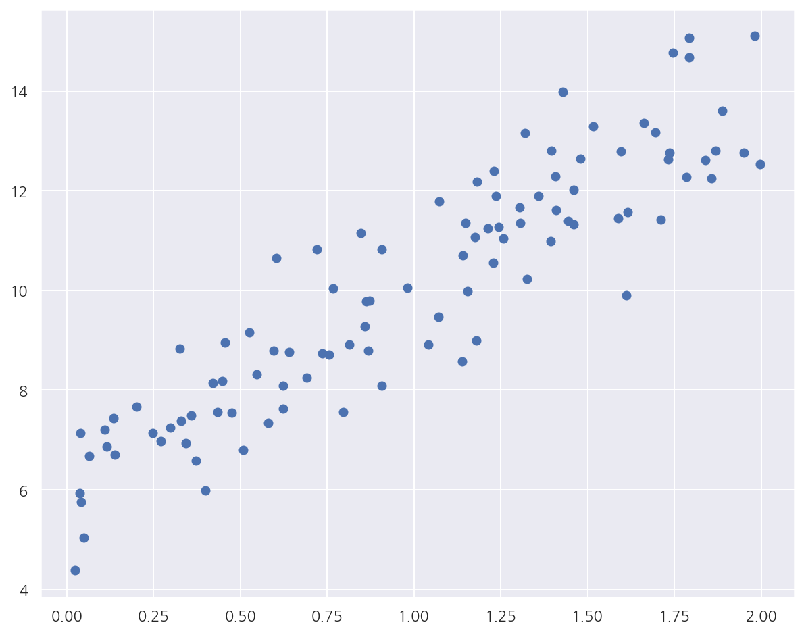

**파이썬 머신러닝 완벽가이드** 교재를 토대로 공부한 내용입니다.

실습과정에서 필요에 따라 내용의 누락 및 추가, 수정사항이 있습니다.

---


**기본 세팅**


```python
import numpy as np
import pandas as pd

import matplotlib as mpl
import matplotlib.pyplot as plt
import seaborn as sns

import warnings
```


```python
%matplotlib inline
%config InlineBackend.figure_format = 'retina'

mpl.rc('font', family='NanumGothic') # 폰트 설정
mpl.rc('axes', unicode_minus=False) # 유니코드에서 음수 부호 설정

# 차트 스타일 설정
sns.set(font="NanumGothic", rc={"axes.unicode_minus":False}, style='darkgrid')
plt.rc("figure", figsize=(10,8))

warnings.filterwarnings("ignore")
```

---

# 1. 경사 하강법

## 1.1 단순 선형 회귀에서의 경사 하강법

최적의 회귀 모델을 만든다는 것은 잔차(오류) 데이터의 합이 최소가 되는 모델을 만든다는 의미와 동일할 것이다.

단순히 잔차를 더하면 +,-값의 상쇄가 발생하기에 일반적으로 미분 등의 계산 편의를 고려하여 RSS(Residual Sum of Square)를 사용한다.

단순 선형 회귀에서의 RSS는 다음과 같다.

$$ \text{RSS} = R(\beta_{0},\beta_{1}) = \dfrac{1}{n} \sum_{i=1}^n (y_{i}- (\beta_{0} + \beta_{1}x_{i}))^{2} = \dfrac{1}{n} \sum_{i=1}^n (y_{i}- \hat{y}_{i})^{2}$$

회귀에서 이 RSS는 비용(Cost)이며, 머신러닝 회귀 알고리즘은 데이터를 계속 학습하면서 이 비용 함수의 반환 값을 지속해서 감소시키고 최종적으로 더 이상 감소하지 않는 최소의 오류 값을 구하는 것이다.

이 비용이 최소가 되는 파라미터(여기선 $\beta_{0}$, $\beta_{1}$)를 찾기 위해 경사 하강법(Gradient Descent)을 사용한다.

RSS는 $\beta_{0}$, $\beta_{1}$의 2차 함수로서 포물선 형태를 가질 것이며 포물선 형태의 2차 함수의 최저점은 2차 함수의 미분값인 1차 함수의 기울기가 가장 최소일 때다.

경사 하강법은 최초의 $\beta$ 에서부터 미분을 적용한 뒤 이 미분값이 감소하는 방향으로 $\beta$ 를 업데이트한다.

- 만약 최초 $\beta$ 에서의 미분값(기울기)이 양수라면 포물선을 고려하였을 때 최초 $\beta$ 는 2차 함수 최저점의 우측에 있을 것이다.


- 따라서 최초 $\beta$ 에서 왼쪽으로 이동하면 조금 더 2차 함수 최저점에 가까워 질 것이다.


- 즉, 미분값의 부호의 반대방향으로 이동하면서 점차 미분값을 감소시킨다. 


- 더 이상 감소하지 않는 지점을 비용이 최소가 되는 지점으로 간주하고 그때의 $\beta$ 를 반환한다.

현재 예시에선 파라미터가 2개이므로 RSS를 각각 $\beta_{0}$, $\beta_{1}$ 에 대해 편미분한다.


$$\dfrac{\partial R(\beta_{0},\beta_{1})}{\partial\beta_{1}} = -\dfrac{2}{n} \sum_{i=1}^n x_{i}(y_{i}-(\beta_{0} + \beta_{1}x_{i})) = -\dfrac{2}{n} \sum_{i=1}^n x_{i}(y_{i}-\hat{y}_{i})$$

$$\dfrac{\partial R(\beta_{0},\beta_{1})}{\partial\beta_{0}} = -\dfrac{2}{n} \sum_{i=1}^n (y_{i}-(\beta_{0} + \beta_{1}x_{i})) = -\dfrac{2}{n} \sum_{i=1}^n (y_{i}-\hat{y}_{i})$$

- 먼저 임의의 초기 $\beta_{0}$, $\beta_{1}$ 값을 설정 후 그 값에 대해 편미분값이 구해지면 다음 $\beta_{0}$, $\beta_{1}$ 는 해당 편미분 값의 (-)를 곱하여 업데이트 한다.


- 다만 이 편미분 값이 너무 클 수 있기 때문에 보정 계수 $\eta$를 곱해주는데 이를 학습률이라 한다.


- 즉, 새로운 $\beta_{0}$, $\beta_{1}$ 값은 이전 $\beta_{0}$, $\beta_{1}$ 값 - 학습률 * 편미분값이다.


- 새로운 값으로 다시 비용을 계산 후 비용이 감소하면 계속 업데이트를 진행하고 더이상 감소하지 않으면 그떄의 $\beta_{0}$, $\beta_{1}$ 을 반환하고 반복을 중지한다.

구체적인 방법은 다르지만 뉴턴 랩슨 방법과 비슷한 개념으로 느껴진다.

## 1.2 경사 하강법 종류

### 1.2.1 배치 경사 하강법 (Batch Gradient Descent: BGD)

- 전체 학습 데이터를 하나의 배치로 묶어 학습시키는 방법으로 수행 시간이 오래 걸리고 많은 메모리가 필요하다.


- Global Optimal로 수렴이 안정적이지만 Local Optimal에 수렴될 경우 탈출하기 어려울 수 있다.


- GPU를 활용한 병렬처리에 유리하다.

### 1.2.2 확률적 경사 하강법 (Stochastic Gradient Descent: SGD)

- 전체 학습 데이터 중 랜덤하게 선택된 하나의 데이터를 하나의 배치로 학습한다.


- 하나의 데이터만 사용하므로 Shooting이 발생하여 Local Optimal 빠질 리스크는 적지만 Global Optimal로 수렴 못 할수도 있다.


- 마찬가지로 하나의 데이터만 사용하므로 GPU 성능에 대해서 전부 활용이 불가하다.

### 1.2.3 미니 배치 확률적 경사 하강법 (Mini-Batch Stochastic Gradient Descent: MSGD)

- BGD와 SGD의 절충안으로 전체 데이터를 Batch_size만큼 나누어 Mini-Batch를 구성 후 학습한다.


- BGD보다는 local optimal 빠질 리스크 적고 메모리도 적게 사용한다. 


- SGD보다는 GPU 성능을 활용한 병렬처리가 가능하여 속도면에서 유리하다.

## 1.3 경사 하강법 구현


```python
np.random.seed(0)

# y = 4x + 6 + Noise
noise = np.random.randn(100,1)
X = 2 * np.random.rand(100,1)
y = 6 + 4*X + noise

plt.scatter(X,y)
plt.show()
```


    

    


- 데이터를 $y = 4X + 6$을 중심으로 무작위로 퍼져있게끔 생성하였다.

### 1.3.1 배치 경사 하강법


```python
# 비용 함수
def get_cost(y, y_hat):
    n = len(y) 
    cost = np.sum( np.square(y - y_hat) ) / n
    return cost

# Batch Gradient Descent
def batch_gradient_descent(b1, b0, X, y, learning_rate = 0.01, iters = 10000):
    n = len(y)
    
    for i in range(iters):
        final_iters = i + 1
        # 예측값 nx1
        y_hat = b0 + b1*X

        # 비용 함수(RSS)
        cost0 = np.sum( np.square(y - y_hat) ) / n

        # 학습률 * 편미분
        b1_update = learning_rate * -(2/n) * X.T @ (y - y_hat)
        b0_update = learning_rate * -(2/n) * np.sum(y - y_hat)

        # 파라미터 업데이트
        b1 = b1 - b1_update
        b0 = b0 - b0_update
        
        # 업데이트 후 비용 함수(RSS)
        y_hat = b0 + b1*X
        cost1 = np.sum( np.square(y - y_hat) ) / n
        
        # 비용 감소가 0.00001보다 작은 경우 stop
        if cost0 - cost1 < 0.00001:
            break
        
    return b1, b0, final_iters
```


```python
b1, b0, final_iters = batch_gradient_descent(0, 0, X, y, learning_rate = 0.01, iters=1000)

y_hat = b0 + b1[0,0]*X
cost = get_cost(y, y_hat)

print(f"b1: {b1[0,0]:.3f}, b0: {b0:.3f}, iteration: {final_iters}")
print(f"Gradient Descent Total Cost: {cost:.4f}")
```

    b1: 4.030, b0: 6.018, iteration: 989
    Gradient Descent Total Cost: 1.0170
    

- 교재에 있는 코드는 행렬을 이용한 연산으로 회귀계수를 계산하였는데, 단순 선형 회귀라 좀 더 간단하게 구현하였다.


- 반복이 진행될 때마다 감소된 비용을 구하여 감소폭이 0.00001보다 작으면 반복을 멈추게 설정하였다.


- BGD로 구한 회귀계수가 실제 선형식과 유사하게 나타났으며 989번 반복 후 감소폭이 크지 않아 반복을 중지하였다.

### 1.3.2 미니 배치 확률적 경사 하강법


```python
# Mini-Batch Stochastic Gradient Descent: MSGD
def mini_stochastic_gradient_descent(b1, b0, X, y, learning_rate = 0.01, iters = 10000, batch_size=10):
    n = batch_size
    
    for i in range(iters):
        # batch_size만큼 랜덤으로 데이터 추출
        np.random.seed(i)
        stochastic_random_index = np.random.permutation(X.shape[0]) # permutation은 정수를 arange 후 셔플
        sample_X = X[ stochastic_random_index[0:batch_size] ]
        sample_y = y[ stochastic_random_index[0:batch_size] ]
                
        # 예측값 nx1
        y_hat = b0 + b1*sample_X

        # 학습률 * 편미분
        b1_update = learning_rate * -(2/n) * sample_X.T @ (sample_y - y_hat)
        b0_update = learning_rate * -(2/n) * np.sum(sample_y - y_hat)

        # 파라미터 업데이트
        b1 = b1 - b1_update
        b0 = b0 - b0_update
        
        
    return b1, b0
```


```python
b1, b0 = mini_stochastic_gradient_descent(0, 0, X, y, iters=1000, batch_size=10)

y_hat = b0 + b1[0,0]*X
cost = get_cost(y, y_hat)

print(f"b1: {b1[0,0]:.3f}, b0: {b0:.3f}")
print(f"Mini Stochastic Gradient Descent Total Cost: {cost:.4f}")
```

    b1: 3.999, b0: 5.971
    Mini Stochastic Gradient Descent Total Cost: 1.0240
    

- MSGD로 구한 회귀 계수, 예측 오류 비용은 BGD로 구한 값과 큰 차이 없다.
