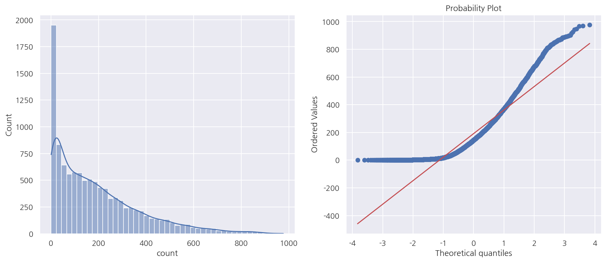
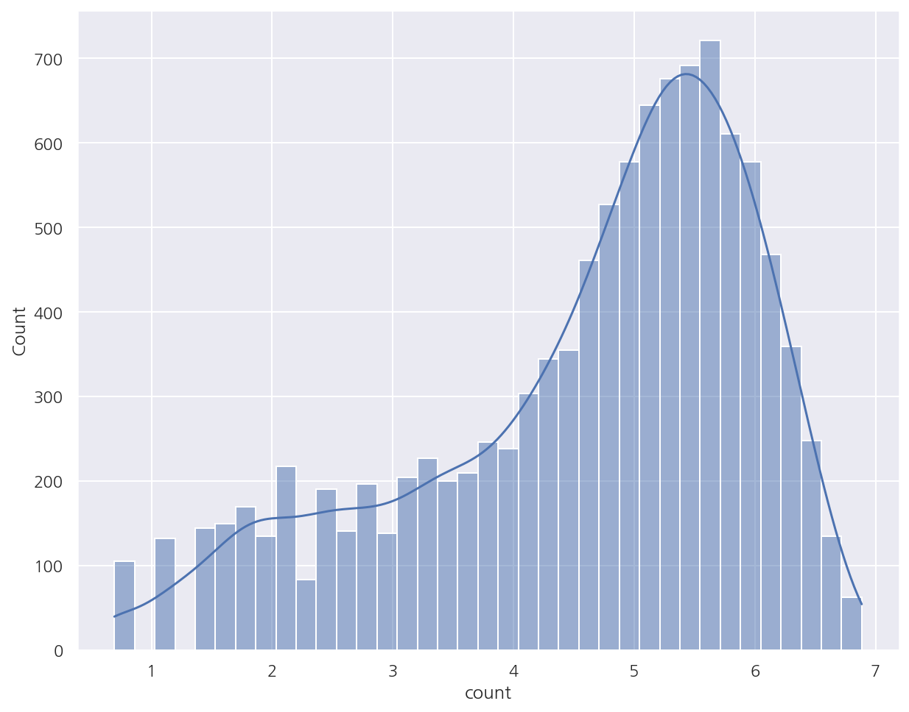
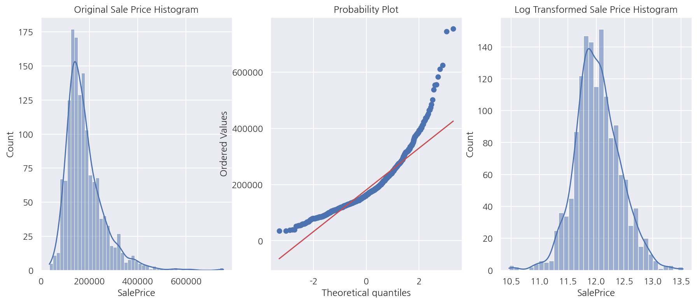
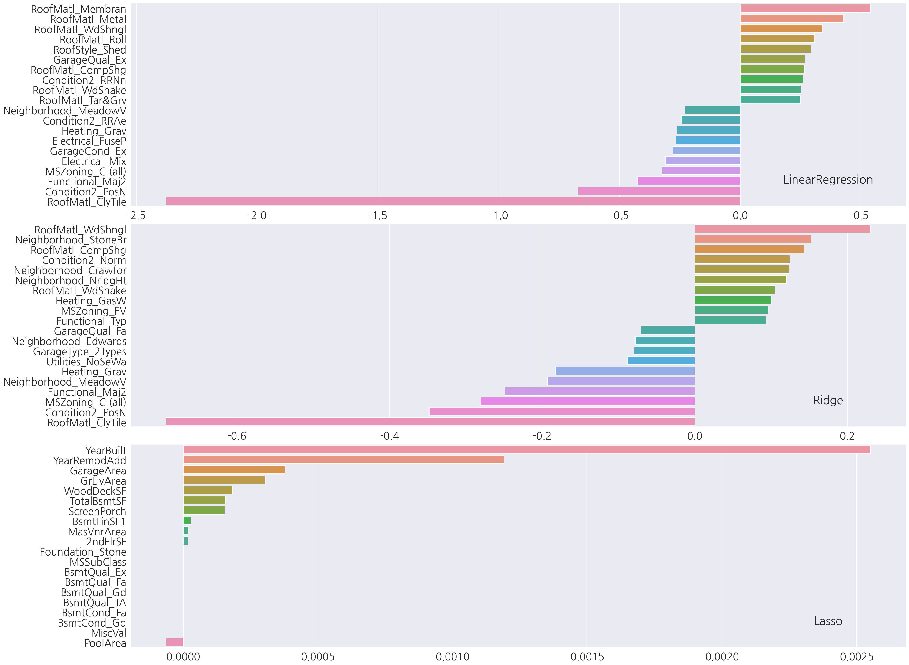
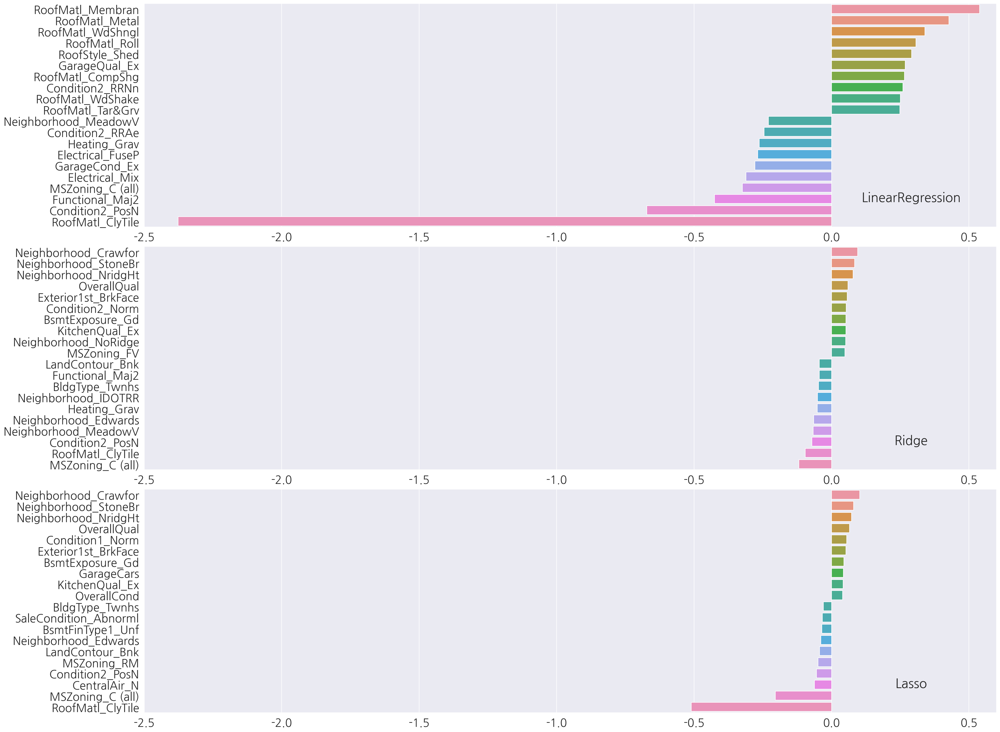
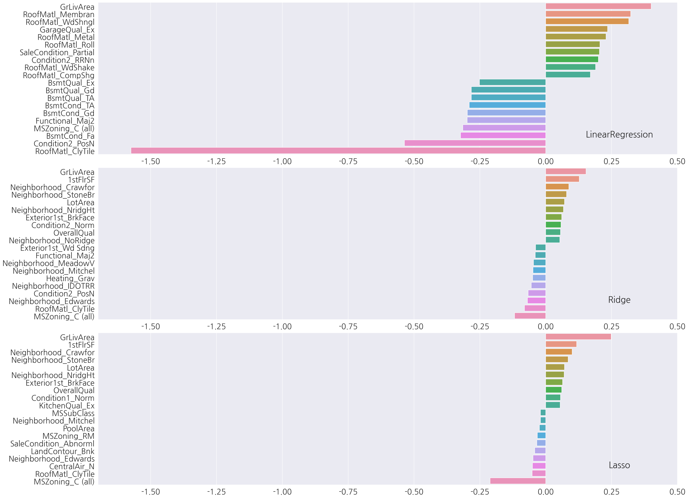
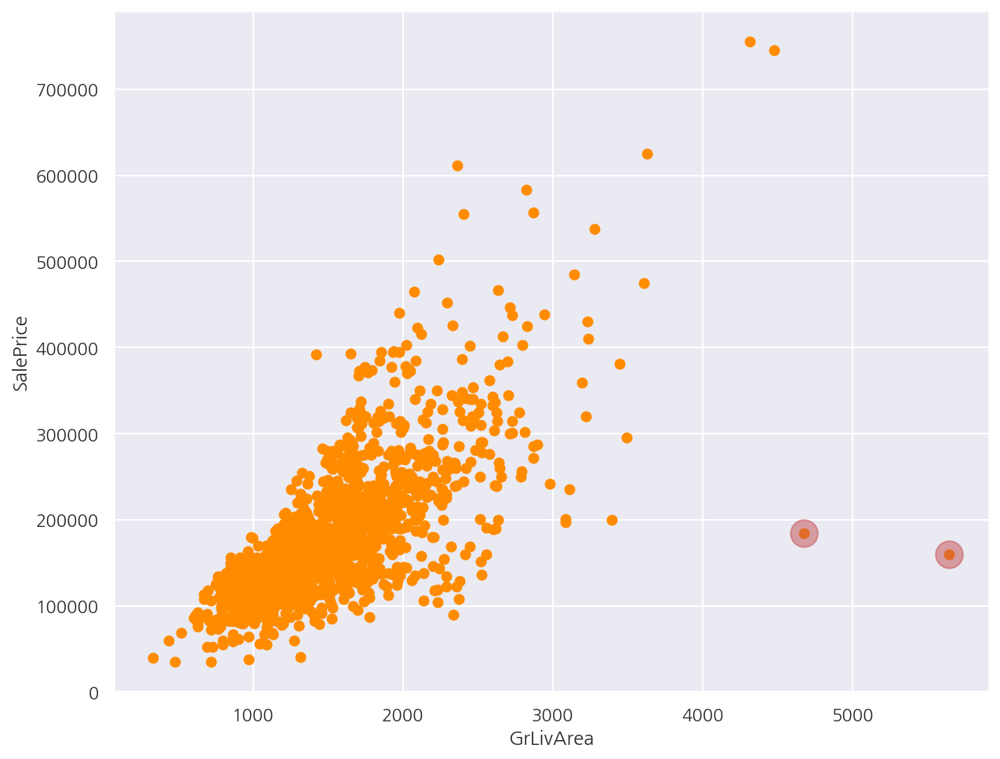

**기본 세팅**


```python
import numpy as np
import pandas as pd

import matplotlib as mpl
import matplotlib.pyplot as plt
import seaborn as sns

import warnings
```


```python
%matplotlib inline
%config InlineBackend.figure_format = 'retina'

mpl.rc('font', family='NanumGothic') # 폰트 설정
mpl.rc('axes', unicode_minus=False) # 유니코드에서 음수 부호 설정

# 차트 스타일 설정
sns.set(font="NanumGothic", rc={"axes.unicode_minus":False}, style='darkgrid')
plt.rc("figure", figsize=(10,8))

warnings.filterwarnings("ignore")
```

---

# 1. 자전거 대여 수요 예측

## 1.1 데이터 불러오기

**데이터 구조**

- datetime: 날짜 + 시간


- season: 계절  (1 = 봄, 2 = 여름, 3 = 가을, 4 = 겨울)


- holiday: 휴일여부(주말 포함 x)


- workingday: 근무여부 (주말과 휴일을 제외한 일하는 날 여부)


- weather: 날씨
    - 1: 맑음, 구름 조금, 부분 흐림
    - 2: 안개 + 흐림, 안개 + 구름, 안개 + 구름 조금, 안개
    - 3: 가벼운 눈, 가벼운 비 + 천둥 + 구름, 가벼운 비 + 구름
    - 4: 폭우 + 우박 + 천둥 + 안개, 눈 + 안개  
   
   
- temp: 온도


- atemp: 체감온도


- humidity: 습도


- windspeed: 풍속


- casual: 미등록 사용자 대여량


- registered: 등록 사용자 대여량


- count: 총 대여량


```python
bike_df = pd.read_csv('./bike_train.csv')
bike_df.head(3)

# 날짜 변수 반영 ↓
# bike_df = pd.read_csv('train.csv', parse_dates = ["datetime"])
```


<div>
<style scoped>
    .dataframe tbody tr th:only-of-type {
        vertical-align: middle;
    }

    .dataframe tbody tr th {
        vertical-align: top;
    }

    .dataframe thead th {
        text-align: right;
    }
</style>
<table border="1" class="dataframe">
  <thead>
    <tr style="text-align: right;">
      <th></th>
      <th>datetime</th>
      <th>season</th>
      <th>holiday</th>
      <th>workingday</th>
      <th>weather</th>
      <th>temp</th>
      <th>atemp</th>
      <th>humidity</th>
      <th>windspeed</th>
      <th>casual</th>
      <th>registered</th>
      <th>count</th>
    </tr>
  </thead>
  <tbody>
    <tr>
      <th>0</th>
      <td>2011-01-01 00:00:00</td>
      <td>1</td>
      <td>0</td>
      <td>0</td>
      <td>1</td>
      <td>9.84</td>
      <td>14.395</td>
      <td>81</td>
      <td>0.0</td>
      <td>3</td>
      <td>13</td>
      <td>16</td>
    </tr>
    <tr>
      <th>1</th>
      <td>2011-01-01 01:00:00</td>
      <td>1</td>
      <td>0</td>
      <td>0</td>
      <td>1</td>
      <td>9.02</td>
      <td>13.635</td>
      <td>80</td>
      <td>0.0</td>
      <td>8</td>
      <td>32</td>
      <td>40</td>
    </tr>
    <tr>
      <th>2</th>
      <td>2011-01-01 02:00:00</td>
      <td>1</td>
      <td>0</td>
      <td>0</td>
      <td>1</td>
      <td>9.02</td>
      <td>13.635</td>
      <td>80</td>
      <td>0.0</td>
      <td>5</td>
      <td>27</td>
      <td>32</td>
    </tr>
  </tbody>
</table>
</div>


```python
bike_df.info()
```

    <class 'pandas.core.frame.DataFrame'>
    RangeIndex: 10886 entries, 0 to 10885
    Data columns (total 12 columns):
     #   Column      Non-Null Count  Dtype  
    ---  ------      --------------  -----  
     0   datetime    10886 non-null  object 
     1   season      10886 non-null  int64  
     2   holiday     10886 non-null  int64  
     3   workingday  10886 non-null  int64  
     4   weather     10886 non-null  int64  
     5   temp        10886 non-null  float64
     6   atemp       10886 non-null  float64
     7   humidity    10886 non-null  int64  
     8   windspeed   10886 non-null  float64
     9   casual      10886 non-null  int64  
     10  registered  10886 non-null  int64  
     11  count       10886 non-null  int64  
    dtypes: float64(3), int64(8), object(1)
    memory usage: 1020.7+ KB
    

- 데이터는 10,886 x 12개로 이루어져 있으며 피처 변수는 datetime이 object, 나머지는 float, int형으로 이루어져 있다.


- datetime의 자료 유형 변경이 필요하다(처음 불러올 떄 반영해도 된다).


- casual + registered = count이므로 casual과 registered는 피처로 사용하지 않고 제외 한다.


```python
# datetime 날짜형으로 변경
bike_df["datetime"] = bike_df["datetime"].apply(pd.to_datetime)

# datetime 나누기
bike_df["year"] = bike_df["datetime"].dt.year
bike_df["month"] = bike_df["datetime"].dt.month
bike_df["day"] = bike_df["datetime"].dt.day
bike_df["hour"] = bike_df["datetime"].dt.hour

# datetime, casual, registered 제거
col_order = bike_df.columns[-4:].to_list() + bike_df.columns[1:-7].to_list() + ["count"]
bike_df = bike_df[col_order]

bike_df.head(3)
```


<div>
<style scoped>
    .dataframe tbody tr th:only-of-type {
        vertical-align: middle;
    }

    .dataframe tbody tr th {
        vertical-align: top;
    }

    .dataframe thead th {
        text-align: right;
    }
</style>
<table border="1" class="dataframe">
  <thead>
    <tr style="text-align: right;">
      <th></th>
      <th>year</th>
      <th>month</th>
      <th>day</th>
      <th>hour</th>
      <th>season</th>
      <th>holiday</th>
      <th>workingday</th>
      <th>weather</th>
      <th>temp</th>
      <th>atemp</th>
      <th>humidity</th>
      <th>windspeed</th>
      <th>count</th>
    </tr>
  </thead>
  <tbody>
    <tr>
      <th>0</th>
      <td>2011</td>
      <td>1</td>
      <td>1</td>
      <td>0</td>
      <td>1</td>
      <td>0</td>
      <td>0</td>
      <td>1</td>
      <td>9.84</td>
      <td>14.395</td>
      <td>81</td>
      <td>0.0</td>
      <td>16</td>
    </tr>
    <tr>
      <th>1</th>
      <td>2011</td>
      <td>1</td>
      <td>1</td>
      <td>1</td>
      <td>1</td>
      <td>0</td>
      <td>0</td>
      <td>1</td>
      <td>9.02</td>
      <td>13.635</td>
      <td>80</td>
      <td>0.0</td>
      <td>40</td>
    </tr>
    <tr>
      <th>2</th>
      <td>2011</td>
      <td>1</td>
      <td>1</td>
      <td>2</td>
      <td>1</td>
      <td>0</td>
      <td>0</td>
      <td>1</td>
      <td>9.02</td>
      <td>13.635</td>
      <td>80</td>
      <td>0.0</td>
      <td>32</td>
    </tr>
  </tbody>
</table>
</div>


## 1.2 성능 평가 함수


```python
from sklearn.metrics import mean_squared_error, mean_absolute_error

# MAE, RMSE, RMSLE 반환
def evaluate_regr(y,pred):
    # MAE
    mae = mean_absolute_error(y,pred)
    
    # RMSE
    rmse = np.sqrt(mean_squared_error(y,pred))
    
    # RMSLE
    log_y = np.log1p(y)
    log_pred = np.log1p(pred)
    msle = np.mean((log_y - log_pred) ** 2)
    rmsle = np.sqrt(msle)    
    
    print(f'MAE: {mae:.3f}, RMSE: {rmse:.3f}, RMSLE: {rmsle:.3f}')
```

- MAE, RMSE, RMSLE를 반환하는 함수를 정의하였다.


- RMSLE를 `mean_squared_log_error`나 `np.log`로 계산할 수 있는데 이 경우 데이터 값의 크기에 따라 오버플로/언더플로 오류가 발생할 수 있다.


- `np.log1p`는 log(1+입력값)으로 `np.expm1`을 이용하면 exp(입력값-1)로서 원래의 값으로 복원 가능하다.

## 1.3 선형 회귀

### 1.3.1 기본 예측/평가


```python
from sklearn.model_selection import train_test_split
from sklearn.linear_model import LinearRegression

X_features = bike_df.drop(['count'],axis=1,inplace=False)
y_target = bike_df['count']

X_train, X_test, y_train, y_test = train_test_split(X_features, y_target, test_size=0.3, random_state=0)

# LinearRegression
lr_reg = LinearRegression()
lr_reg.fit(X_train, y_train)
pred = lr_reg.predict(X_test)

evaluate_regr(y_test ,pred)
```

    MAE: 105.924, RMSE: 140.900, RMSLE: 1.165
    

- 종속 변수 count의 단위를 생각하면 각 예측 오류값은 제법 크게 나타났다.


```python
def get_top_error_data(y_test, pred, n_tops = 5):
    # 예측값, 실제값 데이터 프레임
    result_df = pd.DataFrame(y_test.values, columns=['real_count'])
    result_df['predicted_count']= np.round(pred)
    result_df['diff'] = np.abs(result_df['real_count'] - result_df['predicted_count'])
    
    # 예측값과 실제값의 차이가 큰 순서로 출력
    print(result_df.sort_values('diff', ascending=False)[:n_tops])
    
get_top_error_data(y_test,pred,n_tops=10)
```

          real_count  predicted_count   diff
    1618         890            322.0  568.0
    3151         798            241.0  557.0
    966          884            327.0  557.0
    412          745            194.0  551.0
    2817         856            310.0  546.0
    2277         813            267.0  546.0
    2314         766            222.0  544.0
    454          721            177.0  544.0
    1003         713            171.0  542.0
    2394         684            142.0  542.0
    

- 예측값과 실제값을 비교하면 값의 차이가 크고 이런 경우 가장 먼저 종속 변수의 분포를 확인할 필요가 있다.


- 종속 변수가 정규분포 형태를 따르지 않으면 회귀 예측 성능이 저하될 가능성이 높다.


```python
from scipy import stats

fig, axs = plt.subplots(1,2, figsize = (15,6))

sns.histplot(bike_df["count"], ax =axs[0], kde=True)
stats.probplot(bike_df["count"], dist='norm', fit=True, plot=axs[1])

plt.show()
```


    

    


- 종속 변수의 분포는 왼쪽으로 치우쳐 있다.


- Q-Q plot으로 정규분포가 아님을 한번 더 알 수 있다.


- 종속 변수를 정규분포 형태로 바꾸는 방법으로 로그 변환을 적용 해보자.

### 1.3.2 로그 변환


```python
sns.histplot(np.log1p(bike_df["count"]), kde=True)
plt.show()
```


    

    


- 로그 변환 후 분포 역시 정규분포를 따른다고 보기 힘들지만 변환 전보다는 왜곡 정도가 완화되어 이대로 학습을 진행한다.


```python
# target 로그 변환
y_target_log = np.log1p(y_target)
X_train, X_test, y_train, y_test = train_test_split(X_features, y_target_log, test_size=0.3, random_state=0)

# 로그 변환 후 학습/예측
lr_reg = LinearRegression()
lr_reg.fit(X_train, y_train)
pred = lr_reg.predict(X_test)

# 예측값, 실제값 원래 스케일로 변환
y_test_exp = np.expm1(y_test)
pred_exp = np.expm1(pred)

evaluate_regr(y_test_exp ,pred_exp)
```

    MAE: 109.286, RMSE: 162.594, RMSLE: 1.017
    

- RMSLE는 줄었지만 MAE, RMSE는 증가하였다.


- 종속 변수를 로그 변환해서 RMSLE는 그냥 RMSE로 구하면 비슷한 값일 듯 한데 원래 스케일 기준으로 모든 성능 평가 지표를 구했다.


- 이번에는 카테고리 피처에 대해 인코딩 작업을 진행해보자.

### 1.3.3 피처 인코딩


```python
# 카테고리 피처 원-핫 인코딩
X_features_ohe = pd.get_dummies(X_features, columns=['year','month','hour', 'holiday','workingday','season','weather'])

X_train, X_test, y_train, y_test = train_test_split(X_features_ohe, y_target_log, test_size=0.3, random_state=0)
```

- 카테고리 피처에 대해 원-핫 인코딩 후 다시 train, test를 분리

**모델별 성능 평가 함수**


```python
from sklearn.linear_model import Ridge, Lasso

def get_model_predict(model, X_train, X_test, y_train, y_test, is_expm1=False):
    model.fit(X_train, y_train)
    pred = model.predict(X_test)
    if is_expm1:
        y_test = np.expm1(y_test)
        pred = np.expm1(pred)
    
    print('###',model.__class__.__name__,'###')
    evaluate_regr(y_test, pred)
```


```python
# LinearRegression, Ridge, Lasso
lr_reg = LinearRegression()
ridge_reg = Ridge(alpha=10)
lasso_reg = Lasso(alpha=0.01)

# 성능 평가
models = [lr_reg, ridge_reg, lasso_reg]

for model in models:
    get_model_predict(model, X_train, X_test, y_train, y_test, is_expm1=True)
```

    ### LinearRegression ###
    MAE: 63.106, RMSE: 97.483, RMSLE: 0.589
    ### Ridge ###
    MAE: 63.648, RMSE: 98.407, RMSLE: 0.589
    ### Lasso ###
    MAE: 72.649, RMSE: 113.012, RMSLE: 0.634
    

- 종속 변수의 로그 변환, 카테고리 피처 원-핫 인코딩 이후 선형 회귀 모델의 예측 성능이 많이 향상되었다.


- 현재까지 공부한 내용을 생각하면 추가적으로 연속형 피처의 스케일링이나 다중공선성 등을 고려할 수 있을 것이다.


- 다만 여기선 casual, registered를 제외하였으므로 다중공선성도 일부 고려하였다고 볼 수 있겠다.


- 그리고 원-핫 인코딩은 풀랭크 방식임도 기억하자.

## 1.4 회귀 트리


```python
from sklearn.ensemble import RandomForestRegressor, GradientBoostingRegressor
from xgboost import XGBRegressor
from lightgbm import LGBMRegressor

# 회귀 트리 모델
rf_reg = RandomForestRegressor(n_estimators=500)
gb_reg = GradientBoostingRegressor(n_estimators=500)
xgb_reg = XGBRegressor(n_estimators=500)
lgbm_reg = LGBMRegressor(n_estimators=500)

# 성능 평가
models = [rf_reg, gb_reg, xgb_reg, lgbm_reg]

for model in models:
    get_model_predict(model, X_train, X_test, y_train, y_test, is_expm1=True)
```

    ### RandomForestRegressor ###
    MAE: 31.545, RMSE: 50.783, RMSLE: 0.354
    ### GradientBoostingRegressor ###
    MAE: 34.316, RMSE: 55.750, RMSLE: 0.340
    ### XGBRegressor ###
    MAE: 30.524, RMSE: 49.600, RMSLE: 0.337
    ### LGBMRegressor ###
    MAE: 28.777, RMSE: 46.473, RMSLE: 0.316
    

- 앞서 선형 회귀 모델보다 예측 성능이 좋게 나타났지만 항상 그런 것은 아님을 알고 넘어가자.

# 2. 캐글 주택 가격: 고급 회귀 기법

## 2.1 데이터 불러오기


```python
house_df_org = pd.read_csv('./house_price_train.csv')
house_df = house_df_org.copy()

house_df.head(3)
```


<div>
<style scoped>
    .dataframe tbody tr th:only-of-type {
        vertical-align: middle;
    }

    .dataframe tbody tr th {
        vertical-align: top;
    }

    .dataframe thead th {
        text-align: right;
    }
</style>
<table border="1" class="dataframe">
  <thead>
    <tr style="text-align: right;">
      <th></th>
      <th>Id</th>
      <th>MSSubClass</th>
      <th>MSZoning</th>
      <th>LotFrontage</th>
      <th>LotArea</th>
      <th>Street</th>
      <th>Alley</th>
      <th>LotShape</th>
      <th>LandContour</th>
      <th>Utilities</th>
      <th>...</th>
      <th>PoolArea</th>
      <th>PoolQC</th>
      <th>Fence</th>
      <th>MiscFeature</th>
      <th>MiscVal</th>
      <th>MoSold</th>
      <th>YrSold</th>
      <th>SaleType</th>
      <th>SaleCondition</th>
      <th>SalePrice</th>
    </tr>
  </thead>
  <tbody>
    <tr>
      <th>0</th>
      <td>1</td>
      <td>60</td>
      <td>RL</td>
      <td>65.0</td>
      <td>8450</td>
      <td>Pave</td>
      <td>NaN</td>
      <td>Reg</td>
      <td>Lvl</td>
      <td>AllPub</td>
      <td>...</td>
      <td>0</td>
      <td>NaN</td>
      <td>NaN</td>
      <td>NaN</td>
      <td>0</td>
      <td>2</td>
      <td>2008</td>
      <td>WD</td>
      <td>Normal</td>
      <td>208500</td>
    </tr>
    <tr>
      <th>1</th>
      <td>2</td>
      <td>20</td>
      <td>RL</td>
      <td>80.0</td>
      <td>9600</td>
      <td>Pave</td>
      <td>NaN</td>
      <td>Reg</td>
      <td>Lvl</td>
      <td>AllPub</td>
      <td>...</td>
      <td>0</td>
      <td>NaN</td>
      <td>NaN</td>
      <td>NaN</td>
      <td>0</td>
      <td>5</td>
      <td>2007</td>
      <td>WD</td>
      <td>Normal</td>
      <td>181500</td>
    </tr>
    <tr>
      <th>2</th>
      <td>3</td>
      <td>60</td>
      <td>RL</td>
      <td>68.0</td>
      <td>11250</td>
      <td>Pave</td>
      <td>NaN</td>
      <td>IR1</td>
      <td>Lvl</td>
      <td>AllPub</td>
      <td>...</td>
      <td>0</td>
      <td>NaN</td>
      <td>NaN</td>
      <td>NaN</td>
      <td>0</td>
      <td>9</td>
      <td>2008</td>
      <td>WD</td>
      <td>Normal</td>
      <td>223500</td>
    </tr>
  </tbody>
</table>
<p>3 rows × 81 columns</p>
</div>


- 이 데이터는 가공 작업을 많이 진행할 것이기에 원본과 카피본을 분리해 카피본을 가공한다.


```python
# house_df.info()
house_df.shape
```


    (1460, 81)


- 데이터는 1,460 x 81개로 이루어져 있으며 종속 변수는 SalePrice로 int형이며 주택 가격을 의미한다.


```python
print('### Feature type ###')
print(house_df.iloc[:,:-1].dtypes.value_counts())

print('\n### Null Feature ###')

isnull_series = house_df.isnull().sum()
print(isnull_series[isnull_series > 0].sort_values(ascending=False))
```

    ### Feature type ###
    object     43
    int64      34
    float64     3
    dtype: int64
    
    ### Null Feature ###
    PoolQC          1453
    MiscFeature     1406
    Alley           1369
    Fence           1179
    FireplaceQu      690
    LotFrontage      259
    GarageYrBlt       81
    GarageType        81
    GarageFinish      81
    GarageQual        81
    GarageCond        81
    BsmtFinType2      38
    BsmtExposure      38
    BsmtFinType1      37
    BsmtCond          37
    BsmtQual          37
    MasVnrArea         8
    MasVnrType         8
    Electrical         1
    dtype: int64
    

- 피처 타입은 숫자형, 문자형 고루 존재한다.


- 결측값이 있는 피처가 제법 있으며 1,000개가 넘는 결측값이 있는 PoolQC, MiscFeature, Alley, Fence는 제거한다.


```python
from scipy import stats

fig, axs = plt.subplots(1,3, figsize = (15,6))

sns.histplot(house_df["SalePrice"], ax =axs[0], kde=True)
stats.probplot(house_df["SalePrice"], dist='norm', fit=True, plot=axs[1])
sns.histplot(np.log1p(house_df["SalePrice"]), ax=axs[2], kde=True)

axs[0].set_title("Original Sale Price Histogram")
axs[2].set_title("Log Transformed Sale Price Histogram")

plt.show()
```


    

    


- 종속 변수의 분포는 정규분포 형태를 따르지 않고 로그 변환을 적용하였을 때 정규분포 형태를 띄므로 로그 변환하여 진행한다.


```python
# 피처 제거
house_df.drop( ["Id", "PoolQC", "MiscFeature", "Alley", "Fence"], axis=1, inplace=True )

# 종속 변수 로그 변환
org_SalePrice = house_df["SalePrice"]
house_df["SalePrice"] = np.log1p(house_df["SalePrice"])

# 결측값 대체 - 숫자형
house_df.fillna(house_df.mean(), inplace=True)

# 원-핫 인코딩 - 카테고리형
house_df_ohe = pd.get_dummies(house_df)
```

- 필요 없는 Id 피처 및 앞서 확인한 결측 1,000건 이상 피처를 제거하였다.


- 종속 변수는 로그 변환하고 나머지 피처 중 숫자형 피처의 결측값은 평균값으로 대체 하였다.


- 카테고리형 피처는 원-핫 인코딩을 진행하였고 원-핫 인코딩은 결측값을 None 컬럼으로 대체한다.


- `pd.get_dummies()`는 자동으로 object형만 원-핫 인코딩을 진행한다.


```python
print("원-핫 인코딩 전 shape:", house_df.shape)
print("원-핫 인코딩 후 shape:", house_df_ohe.shape)
```

    원-핫 인코딩 전 shape: (1460, 76)
    원-핫 인코딩 후 shape: (1460, 276)
    

- 원-핫 인코딩으로 인해 피처 갯수는 많이 증가하였다.

## 2.2 선형 회귀

### 2.2.1 기본 예측/평가

**RMSE 함수**


```python
def get_rmse(model):
    pred = model.predict(X_test)
    mse = mean_squared_error(y_test , pred)
    rmse = np.sqrt(mse)
    print(f'{model.__class__.__name__} 로그 변환된 RMSE: {np.round(rmse, 4)}')
    
    return rmse

def get_rmses(models):
    rmses = []
    
    for model in models:
        rmse = get_rmse(model)
        rmses.append(rmse)
    
    return rmses
```

- 종속 변수를 로그 변환 하였으므로 RMSE는 원래 스케일에서의 RMSLE이다.


```python
from sklearn.linear_model import LinearRegression, Ridge, Lasso
from sklearn.model_selection import train_test_split
from sklearn.metrics import mean_squared_error

X_features = house_df_ohe.drop('SalePrice',axis=1, inplace=False)
y_target = house_df_ohe['SalePrice']

X_train, X_test, y_train, y_test = train_test_split(X_features, y_target, test_size=0.2, random_state=156)

# LinearRegression, Ridge, Lasso
lr_reg = LinearRegression()
ridge_reg = Ridge()
lasso_reg = Lasso()

lr_reg.fit(X_train, y_train)
ridge_reg.fit(X_train, y_train)
lasso_reg.fit(X_train, y_train)

# 예측 평가
models = [lr_reg, ridge_reg, lasso_reg]
rmses = get_rmses(models)
```

    LinearRegression 로그 변환된 RMSE: 0.1322
    Ridge 로그 변환된 RMSE: 0.1282
    Lasso 로그 변환된 RMSE: 0.1763
    

- RMSE는 Ridge가 가장 낮게 나왔고 Lasso가 가장 높게 나타났다.


- 추후 하이퍼 파라미터 튜닝을 진행해서 확인 해보자.

**회귀 계수 시각화 함수**


```python
# 상위, 하위 10개 coefficients 추출
def get_top_bottom_coef(model):
    # coef series
    coef = pd.Series(model.coef_, index = X_features.columns)
    
    coef_high = coef.sort_values(ascending=False).head(10)
    coef_low = coef.sort_values(ascending=False).tail(10)
    return coef_high, coef_low

# 회귀 계수 시각화
def visualize_coefficient(models, xlim=None):
    fig, axs = plt.subplots(3,1, figsize=(24,20))
    fig.tight_layout()
    
    for i, model in enumerate(models):
        coef_high, coef_low = get_top_bottom_coef(model)
        coef_concat = pd.concat( [coef_high , coef_low], axis=0 )
        
        axs[i].set_title(model.__class__.__name__ , size=25, x= 0.9, y= 0.1)
        # axs[i].tick_params(axis="y", direction="in", pad=-120) # tick label 위치 조정
        
        # font size 조정
        for label in (axs[i].get_xticklabels() + axs[i].get_yticklabels()):
            label.set_fontsize(22)
        
        # x축 범위
        if xlim:
            axs[i].set_xlim(xlim)
        
        sns.barplot(x=coef_concat.values, y=coef_concat.index , ax=axs[i])
```


```python
# LinearRegression, Ridge, Lasso
models = [lr_reg, ridge_reg, lasso_reg]
visualize_coefficient(models)
```


    

    


- 각 모델별 상위, 하위 10개 회귀계수를 확인하였을 때 LinearRegression과 Ridge는 피처 종류가 유사하게 나타났다.


- 반면에 Lasso는 다른 두 모델과 피처 종류도 차이가 있고, x축을 보면 전체적으로 회귀 계수 값이 매우 낮다.


- Lasso 성능의 문제가 train, test 분할에 문제가 있는지 교차 검증을 진행하여 평균 RMSE를 확인해보자.

### 2.2.2 교차 검증

**교차 검증 평균 RMSE 함수**


```python
from sklearn.model_selection import cross_val_score

def get_avg_rmse_cv(models):
    
    for model in models:
        mse_scores = -1*cross_val_score(model, X_features, y_target, 
                                        scoring="neg_mean_squared_error", cv=5)
        rmse_scores = np.sqrt(mse_scores)
        rmse_avg = np.mean(rmse_scores)

        print(f"{model.__class__.__name__} CV RMSE 리스트: {np.round(rmse_scores,3)}")
        print(f"{model.__class__.__name__} CV 평균 RMSE: {rmse_avg:.3f}\n")
```


```python
# LinearRegression, Ridge, Lasso
lr_reg = LinearRegression()
ridge_reg = Ridge()
lasso_reg = Lasso()

models = [lr_reg, ridge_reg, lasso_reg]
get_avg_rmse_cv(models)
```

    LinearRegression CV RMSE 리스트: [0.136 0.166 0.167 0.111 0.197]
    LinearRegression CV 평균 RMSE: 0.156
    
    Ridge CV RMSE 리스트: [0.118 0.156 0.142 0.117 0.188]
    Ridge CV 평균 RMSE: 0.144
    
    Lasso CV RMSE 리스트: [0.161 0.204 0.177 0.181 0.265]
    Lasso CV 평균 RMSE: 0.198
    
    

- 기본 예측/평가에선 train으로 학습 후 test에 대해 평가하였으나 여기선 전체 데이터로 교차 검증 하였음을 인지하자.


- 여전히 Lasso 성능은 다른 두 모델에 비해 떨어진다.


- 이번엔 GridSearchCV를 통해 Ridge와 Lasso의 최적 하이퍼 파라미터를 찾아 적용해보자.

### 2.2.3 GridSearchCV

**하이퍼 파라미터 도출 함수**


```python
from sklearn.model_selection import GridSearchCV

def get_best_params(model, params):
    model_name = model.__class__.__name__
    grid_cv = GridSearchCV(model, param_grid=params, 
                           scoring='neg_mean_squared_error', cv=5)
    
    grid_cv.fit(X_features, y_target)
    best_rmse = np.sqrt(-1* grid_cv.best_score_)
    
    print(f'{model_name} GridSearchCV 최적 평균 RMSE: {np.round(best_rmse, 4)}, 최적 alpha:{grid_cv.best_params_}')
          
    return grid_cv.best_estimator_
```


```python
# 하이퍼 파라미터
ridge_params = { 'alpha':[0.05, 0.1, 1, 5, 8, 10, 12, 15, 20] }
lasso_params = { 'alpha':[0.001, 0.005, 0.008, 0.05, 0.03, 0.1, 0.5, 1,5, 10] }

# Ridge, Lasso
ridge_reg = Ridge()
lasso_reg = Lasso()

best_ridge = get_best_params(ridge_reg, ridge_params)
best_lasso = get_best_params(lasso_reg, lasso_params)
```

    Ridge GridSearchCV 최적 평균 RMSE: 0.1418, 최적 alpha:{'alpha': 12}
    Lasso GridSearchCV 최적 평균 RMSE: 0.142, 최적 alpha:{'alpha': 0.001}
    

- GridSearchCV를 적용해서 Ridge와 Lasso의 최적 하이퍼 파라미터를 찾았다.


- 최적 하이퍼 파라미터일 때의 평균 RMSE가 이번엔 Ridge와 Lasso가 유사한 값으로 Lasso의 성능이 향상되었다.


- 앞서 교차 검증과 비교하면 Ridge 역시 조금이나마 성능이 향상되었다.


```python
# 최적 하이퍼 파라미터로 Ridge, Lasso 수정
lr_reg = LinearRegression()
ridge_reg = Ridge(alpha=12)
lasso_reg = Lasso(alpha=0.001)

lr_reg.fit(X_train, y_train)
ridge_reg.fit(X_train, y_train)
lasso_reg.fit(X_train, y_train)

# test set RMSE
models = [lr_reg, ridge_reg, lasso_reg]
get_rmses(models)

# 회귀 계수 시각화 
models = [lr_reg, ridge_reg, lasso_reg]
visualize_coefficient(models, xlim=(-2.5,0.6))
```

    LinearRegression 로그 변환된 RMSE: 0.1322
    Ridge 로그 변환된 RMSE: 0.1246
    Lasso 로그 변환된 RMSE: 0.1204
    


    

    


- 최적 하이퍼 파라미터 적용 후 test 예측 성능도 더 좋아졌다.


- 앞서 Lasso가 상위,하위 피처 종류에 차이가 많았지만 Ridge와 피처 종류도 비슷해졌다.

### 2.2.4 피처 로그 변환

앞서 종속 변수는 로그 변환을 진행하였는데 이번엔 피처 중 왜곡도가 심한 피처를 로그 변환 해본다.

일반적으로 `skew()` 함수 반환 값이 1 이상인 경우 왜곡도가 높다고 판단한다고 한다.


```python
from scipy.stats import skew

# 숫자형 피처 컬럼 index 
features_index = house_df.dtypes[house_df.dtypes != 'object'].index

# 피처(열)별로 왜곡도 산출
skew_features = house_df[features_index].apply(lambda x : skew(x), axis=0)

# 왜곡도가 1 이상
skew_features_top = skew_features[skew_features > 1]
print(skew_features_top.sort_values(ascending=False))
```

    MiscVal          24.451640
    PoolArea         14.813135
    LotArea          12.195142
    3SsnPorch        10.293752
    LowQualFinSF      9.002080
    KitchenAbvGr      4.483784
    BsmtFinSF2        4.250888
    ScreenPorch       4.117977
    BsmtHalfBath      4.099186
    EnclosedPorch     3.086696
    MasVnrArea        2.673661
    LotFrontage       2.382499
    OpenPorchSF       2.361912
    BsmtFinSF1        1.683771
    WoodDeckSF        1.539792
    TotalBsmtSF       1.522688
    MSSubClass        1.406210
    1stFlrSF          1.375342
    GrLivArea         1.365156
    dtype: float64
    

- 앞서 사용한 house_df_ohe 데이터는 원-핫 인코딩을 적용하여 카테고리 피처가 숫자형으로 되어있다.


- 따라서 원-핫 인코딩 적용 전 데이터 house_df로 숫자형 변수의 왜곡도를 확인하였다.


- 이제 왜곡도 값이 1 이상인 피처에 대해 로그 변환을 적용해보자.


```python
# 피처 로그 변환
house_df[skew_features_top.index] = np.log1p(house_df[skew_features_top.index])

# 원-핫 인코딩
house_df_ohe2 = pd.get_dummies(house_df)

# 데이터 재분리
X_features = house_df_ohe2.drop('SalePrice',axis=1, inplace=False)
y_target = house_df_ohe2['SalePrice']

X_train, X_test, y_train, y_test = train_test_split(X_features, y_target, test_size=0.2, random_state=156)
```


```python
# 하이퍼 파라미터
ridge_params = { 'alpha':[0.05, 0.1, 1, 5, 8, 10, 12, 15, 20] }
lasso_params = { 'alpha':[0.001, 0.005, 0.008, 0.05, 0.03, 0.1, 0.5, 1,5, 10] }

# Ridge, Lasso
ridge_reg = Ridge()
lasso_reg = Lasso()

best_ridge = get_best_params(ridge_reg, ridge_params)
best_lasso = get_best_params(lasso_reg, lasso_params)
```

    Ridge GridSearchCV 최적 평균 RMSE: 0.1277, 최적 alpha:{'alpha': 12}
    Lasso GridSearchCV 최적 평균 RMSE: 0.1253, 최적 alpha:{'alpha': 0.001}
    

- 피처 로그 변환 이후 Ridge와 Lasso의 최적 하이퍼 파라미터를 다시 구하였다.


- 최적 하이퍼 파라미터는 변화 없었지만 최적 평균 RMSE는 피처 로그 변환 이전에 비해 두 모델 모두 낮아졌다.


```python
# 최적 하이퍼 파라미터로 Ridge, Lasso 수정
lr_reg = LinearRegression()
ridge_reg = Ridge(alpha=12)
lasso_reg = Lasso(alpha=0.001)

lr_reg.fit(X_train, y_train)
ridge_reg.fit(X_train, y_train)
lasso_reg.fit(X_train, y_train)

# 회귀 계수 시각화 
models = [lr_reg, ridge_reg, lasso_reg]
visualize_coefficient(models, xlim=(-1.7,0.5))
```


    

    


- 피처 로그 변환 이후 각 모델의 회귀 계수를 확인하였을 때 가장 회귀 계수값이 큰 피처는 세 모델 모두 GrLivArea이다.


- GrLivArea는 회귀 계수가 가장 커 예측에 많은 영향을 끼치므로 이 피처에 이상치가 있는지 확인 하고 가공해보자.

### 2.2.5 이상치 제거


```python
plt.scatter(house_df_org["GrLivArea"] , house_df_org["SalePrice"], c="darkorange")
plt.ylabel('SalePrice')
plt.xlabel('GrLivArea')

# 추후 확인한 이상치 표시
idx = (house_df_org["GrLivArea"] > 4000) & (house_df_org["SalePrice"] < 200000)
outlier_df = house_df_org[idx]
plt.scatter(outlier_df["GrLivArea"] , outlier_df["SalePrice"], s=300, c="r", alpha=0.5 )

plt.show()
```


    

    


- GrLivArea(주거 공간 평수)와 SalePrice(주택 가격)의 데이터 변환 전 산점도를 그렸다.


- 일반적으로 생각하는 주거 공간 평수가 클수록 주택 가격이 높아지는 양의 상관관계를 띄는 산점도이다.


- 다만 4,000평을 넘어가는데 가격이 200,000달러 이하인 경우가 2건 있다.


- 이상치 기준으로 GrLivArea가 4,000평 이상인데 SalePrice가 500,000달러 이하인 경우 제거하도록 한다.


```python
# GrLivArea, SalePrice 모두 로그 변환 하였으므로 반영한 조건 생성
cond1 = house_df_ohe2['GrLivArea'] > np.log1p(4000)
cond2 = house_df_ohe2['SalePrice'] < np.log1p(500000)
outlier_index = house_df_ohe2[cond1 & cond2].index

house_df_ohe3 = house_df_ohe2.drop(outlier_index , axis=0, inplace=False)

print('이상치 삭제 전 house_df_ohe2 shape:', house_df_ohe2.shape)
print('이상치 삭제 후 house_df_ohe3 shape:', house_df_ohe3.shape)
```

    이상치 삭제 전 house_df_ohe2 shape: (1460, 276)
    이상치 삭제 후 house_df_ohe3 shape: (1458, 276)
    

- 사실 원본 데이터 house_df_org에서 많은 가공을 했지만 레코드를 삭제한 적은 없으므로 이상치 인덱스를 원본 데이터로 구해도 된다.


- 앞서 산점도로 확인한 것처럼 2건의 이상치를 제거하였다.


```python
# 데이터 재분리
X_features = house_df_ohe3.drop('SalePrice',axis=1, inplace=False)
y_target = house_df_ohe3['SalePrice']

X_train, X_test, y_train, y_test = train_test_split(X_features, y_target, test_size=0.2, random_state=156)
```


```python
# 하이퍼 파라미터
ridge_params = { 'alpha':[0.05, 0.1, 1, 5, 8, 10, 12, 15, 20] }
lasso_params = { 'alpha':[0.001, 0.005, 0.008, 0.05, 0.03, 0.1, 0.5, 1,5, 10] }

# Ridge, Lasso
ridge_reg = Ridge()
lasso_reg = Lasso()

best_ridge = get_best_params(ridge_reg, ridge_params)
best_lasso = get_best_params(lasso_reg, lasso_params)
```

    Ridge GridSearchCV 최적 평균 RMSE: 0.113, 최적 alpha:{'alpha': 8}
    Lasso GridSearchCV 최적 평균 RMSE: 0.1123, 최적 alpha:{'alpha': 0.001}
    

- 이상치 제거 이후 Ridge와 Lasso의 최적 평균 RMSE가 감소하였다.


- 최적 하이퍼 파라미터는 Ridge의 경우 12에서 8로 변하였다.


```python
# 최적 하이퍼 파라미터로 Ridge, Lasso 수정
lr_reg = LinearRegression()
ridge_reg = Ridge(alpha=8)
lasso_reg = Lasso(alpha=0.001)

lr_reg.fit(X_train, y_train)
ridge_reg.fit(X_train, y_train)
lasso_reg.fit(X_train, y_train)

# test set RMSE
models = [lr_reg, ridge_reg, lasso_reg]
rmses = get_rmses(models)
```

    LinearRegression 로그 변환된 RMSE: 0.1283
    Ridge 로그 변환된 RMSE: 0.1036
    Lasso 로그 변환된 RMSE: 0.1002
    

- test 예측 성능은 이제까지의 결과 중 세 모델 모두 가장 좋게 나타났다.

## 2.3 회귀 트리


```python
from xgboost import XGBRegressor

xgb_params = {'n_estimators':[1000]}
xgb_reg = XGBRegressor(learning_rate=0.05, colsample_bytree=0.5, subsample=0.8)

best_xgb = get_best_params(xgb_reg, xgb_params)
```

    XGBRegressor GridSearchCV 최적 평균 RMSE: 0.1163, 최적 alpha:{'n_estimators': 1000}
    


```python
from lightgbm import LGBMRegressor

lgbm_params = {'n_estimators':[1000]}
lgbm_reg = LGBMRegressor(learning_rate=0.05, num_leaves=4, 
                         subsample=0.6, colsample_bytree=0.4, reg_lambda=10, n_jobs=-1)

best_lgbm = get_best_params(lgbm_reg, lgbm_params)
```

    LGBMRegressor GridSearchCV 최적 평균 RMSE: 0.1175, 최적 alpha:{'n_estimators': 1000}
    

- 작업 수행 시간을 고려해서 하이퍼 파라미터는 한 가지로 설정하였다(즉, 그냥 CV).

## 2.4 선형 회귀 혼합 예측

혼합 예측은 만약 A 모델과 B 모델이 있다면 A 모델 예측값의 40%, B 모델 예측값의 60%를 더하여 최종 예측값을 결정한다.

각 모델의 가중치를 정하는 기준은 따로 없으며, 보다 성능이 좋은 모델에 가중치를 더 부여할 수도 있다.

**혼합 RMSE 함수**


```python
def get_rmse_pred(preds):
    for key in preds.keys():
        prediction = preds[key]
        
        mse = mean_squared_error(y_test, prediction)
        rmse = np.sqrt(mse)
        
        print(f"{key} 모델 RMSE: {rmse:.4f}")
```


```python
ridge_reg = Ridge(alpha=8)
lasso_reg = Lasso(alpha=0.001)

ridge_reg.fit(X_train, y_train)
lasso_reg.fit(X_train, y_train)

ridge_pred = ridge_reg.predict(X_test)
lasso_pred = lasso_reg.predict(X_test)

# 혼합 예측
fusion_pred = 0.4*ridge_pred + 0.6*lasso_pred

# 개별 예측, 혼합 예측 평가
preds = {
    "Ridge": ridge_pred, 
    "Lasso": lasso_pred, 
    "Fusion": fusion_pred
}

get_rmse_pred(preds)
```

    Ridge 모델 RMSE: 0.1036
    Lasso 모델 RMSE: 0.1002
    Fusion 모델 RMSE: 0.1001
    

- 혼합 모델의 RMSE가 가장 낮게 나왔으며 어떻게 보면 분류에서 배운 보팅 방식과 비슷한 느낌이다.

## 2.5 스태킹 앙상블 회귀

**CV 스태킹 함수**


```python
# 4장에서 정의한 CV 스태킹 함수
from sklearn.model_selection import KFold
from sklearn.metrics import mean_absolute_error

# 개별 모델별 메타 데이터
def get_stacking_base_datasets(model, X_train, y_train, X_test, n_folds ):
    # KFold 생성
    kf = KFold(n_splits=n_folds, shuffle=False, random_state=0)
    
    # 메타 데이터 반환을 위한 기본 배열
    train_cnt = X_train.shape[0]
    test_cnt = X_test.shape[0]
    train_meta = np.zeros((train_cnt, 1))
    test_meta = np.zeros((test_cnt, n_folds))
    
    print(model.__class__.__name__ , ' model 시작 ')
    
    # train 데이터를 기반으로 fold를 나눠 학습/예측
    for i , (train_fold_idx, test_fold_index) in enumerate(kf.split(X_train)):
        # train, test fold 생성
        print(f'\t 폴드 세트: {i+1} 시작 ')
        x_train_fold = X_train[train_fold_idx] 
        y_train_fold = y_train[train_fold_idx] 
        x_test_fold = X_train[test_fold_index]  
        
        # train_fold로 학습
        model.fit(x_train_fold , y_train_fold)       
        
        # train 메타 데이터 생성 (x_test_fold 예측)
        train_meta[test_fold_index, :] = model.predict(x_test_fold).reshape(-1,1)
        
        # test 메타 데이터 생성 (x_test 예측) - 평균 전
        test_meta[:, i] = model.predict(X_test)
            
    # test 메타 데이터 생성 - 평균 진행
    test_meta_mean = np.mean(test_meta, axis=1).reshape(-1,1)    
    
    # train test 메타 데이터 반환
    return train_meta , test_meta_mean
```


```python
# 데이터 프레임, 시리즈 -> Numpy 배열
X_train = X_train.values
X_test = X_test.values
y_train = y_train.values

# 각 모델 학습
ridge_reg = Ridge(alpha=8)
lasso_reg = Lasso(alpha=0.001)
xgb_reg = XGBRegressor(n_estimators= 1000, learning_rate=0.05, colsample_bytree=0.5, subsample=0.8)
lgbm_reg = LGBMRegressor(n_estimators= 1000, learning_rate=0.05, num_leaves=4, 
                         subsample=0.6, colsample_bytree=0.4, reg_lambda=10, n_jobs=-1)

# 각 모델 메타 데이터
ridge_train, ridge_test = get_stacking_base_datasets(ridge_reg, X_train, y_train, X_test, 5)
lasso_train, lasso_test = get_stacking_base_datasets(lasso_reg, X_train, y_train, X_test, 5)
xgb_train, xgb_test = get_stacking_base_datasets(xgb_reg, X_train, y_train, X_test, 5)  
lgbm_train, lgbm_test = get_stacking_base_datasets(lgbm_reg, X_train, y_train, X_test, 5)
```

    Ridge  model 시작 
    	 폴드 세트: 1 시작 
    	 폴드 세트: 2 시작 
    	 폴드 세트: 3 시작 
    	 폴드 세트: 4 시작 
    	 폴드 세트: 5 시작 
    Lasso  model 시작 
    	 폴드 세트: 1 시작 
    	 폴드 세트: 2 시작 
    	 폴드 세트: 3 시작 
    	 폴드 세트: 4 시작 
    	 폴드 세트: 5 시작 
    XGBRegressor  model 시작 
    	 폴드 세트: 1 시작 
    	 폴드 세트: 2 시작 
    	 폴드 세트: 3 시작 
    	 폴드 세트: 4 시작 
    	 폴드 세트: 5 시작 
    LGBMRegressor  model 시작 
    	 폴드 세트: 1 시작 
    	 폴드 세트: 2 시작 
    	 폴드 세트: 3 시작 
    	 폴드 세트: 4 시작 
    	 폴드 세트: 5 시작 
    

- 4개의 모델에 대해 train, test 메타 데이터를 생성하였다.


```python
# 최종 메타 데이터 결합
final_X_train_meta = np.concatenate((ridge_train, lasso_train, xgb_train, lgbm_train), axis=1)
final_X_test_meta = np.concatenate((ridge_test, lasso_test, xgb_test, lgbm_test), axis=1)

# 최종 메타 모델 학습/예측/평가
meta_model_lasso = Lasso(alpha=0.0005)

meta_model_lasso.fit(final_X_train_meta, y_train)
meta_predict = meta_model_lasso.predict(final_X_test_meta)
rmse = np.sqrt( mean_squared_error(y_test, meta_predict))

print(f"스태킹 회귀 모델 RMSE: {rmse:.4f}")
```

    스태킹 회귀 모델 RMSE: 0.0975
    

- 스태킹 회귀 모델의 RMSE가 0.0975로 현재까지 결과 중 가장 좋은 성능이다.
