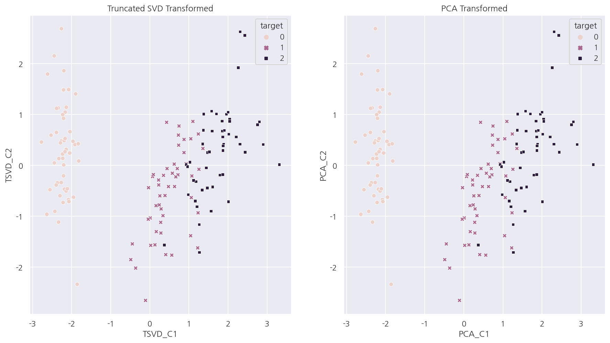

**파이썬 머신러닝 완벽가이드** 교재를 토대로 공부한 내용입니다.

실습과정에서 필요에 따라 내용의 누락 및 추가, 수정사항이 있습니다.

---


**기본 세팅**


```python
import numpy as np
import pandas as pd

import matplotlib as mpl
import matplotlib.pyplot as plt
import seaborn as sns

import warnings
```


```python
%matplotlib inline
%config InlineBackend.figure_format = 'retina'

mpl.rc('font', family='NanumGothic') # 폰트 설정
mpl.rc('axes', unicode_minus=False) # 유니코드에서 음수 부호 설정

# 차트 스타일 설정
sns.set(font="NanumGothic", rc={"axes.unicode_minus":False}, style='darkgrid')
plt.rc("figure", figsize=(10,8))

warnings.filterwarnings("ignore")
```

---

# 4.SVD(Singular Value Decomposition)

**SVD**

SVD는 특이값 분해라 불리며, PCA와 유사한 행렬 분해 기법을 사용한다.

PCA는 정방행렬만을 고유벡터로 분해할 수 있지만, SVD는 정방행렬이 아니어도 적용 가능하다.

SVD는 m x n 행렬 $A$를 다음과 같이 분해한다.

$$
A = U\Sigma V^{T}
$$

- $U$: m x m 행렬로 속한 벡터는 특이벡터(Singular Vector)로 서로 직교한다.


- $\Sigma$: m x n 행렬로 대각원소(행렬 $A$의 특이값)만 0이 아니고 나머지 값은 0이다.


- $V^{T}$: n x n 행렬로 속한 벡터는 특이벡터(Singular Vector)로 서로 직교한다.

위 과정을 Full SVD라 하며, 일반적으로는 이를 축약해서 사용한다.

**Compact SVD**

Compact SVD는 Full SVD를 축약한 방법 중 하나로 다음과 같이 분해한다.

- $\Sigma$의 비대각인 부분과 특이값이 0인 부분을 제거한다.


- 이에 대응하는 $U$와 $V$의 원소도 함께 제거해 차원을 줄인 형태로 SVD를 적용한다.


- 즉, $U$: m x p, $\Sigma$: p x p, $V^{T}$: p x n 과 같이 차원이 줄어든다.

**Truncated SVD**

Truncated SVD 역시 Full SVD를 축약한 방법으로 $\Sigma$의 대각원소 중에 상위 몇 개만 추출하는 방식이다.

Compact SVD보다도 더욱 차원을 줄인 방식으로 과정 자체는 Compact SVD와 차이가 없다.

인위적으로 더 작은 차원으로 분해하기 때문에 원본 행렬 복구가 불가능하다.

## 4.1 Full SVD


```python
# a: 4 X 4
np.random.seed(121)
a = np.random.randn(4,4)
print(np.round(a, 3))
```

    [[-0.212 -0.285 -0.574 -0.44 ]
     [-0.33   1.184  1.615  0.367]
     [-0.014  0.63   1.71  -1.327]
     [ 0.402 -0.191  1.404 -1.969]]
    

- 행렬이 선형독립이게끔 4 x 4 랜덤행렬을 생성하였다.

**numpy 패키지**


```python
# Full SVD
U, Sigma, Vt = np.linalg.svd(a)

print(U.shape, Sigma.shape, Vt.shape)
print("-"*35)
print('U matrix:\n',np.round(U, 3))
print("-"*35)
print('Sigma Value:\n',np.round(Sigma, 3))
print("-"*35)
print('V transpose matrix:\n',np.round(Vt, 3))
```

    (4, 4) (4,) (4, 4)
    -----------------------------------
    U matrix:
     [[-0.079 -0.318  0.867  0.376]
     [ 0.383  0.787  0.12   0.469]
     [ 0.656  0.022  0.357 -0.664]
     [ 0.645 -0.529 -0.328  0.444]]
    -----------------------------------
    Sigma Value:
     [3.423 2.023 0.463 0.079]
    -----------------------------------
    V transpose matrix:
     [[ 0.041  0.224  0.786 -0.574]
     [-0.2    0.562  0.37   0.712]
     [-0.778  0.395 -0.333 -0.357]
     [-0.593 -0.692  0.366  0.189]]
    

- `np.linalg.svd()`에 행렬을 입력하면 $U$, $\Sigma$, $V^{T}$를 반환해준다.


- $\Sigma$의 경우 대각원소 값만 표현하여 1차원 행렬로 반환된다.

**scipy 패키지**


```python
import scipy

# Full SVD
U, Sigma, Vt = scipy.linalg.svd(a, full_matrices=True)

print(U.shape, Sigma.shape, Vt.shape)
print("-"*35)
print('U matrix:\n',np.round(U, 3))
print("-"*35)
print('Sigma Value:\n',np.round(Sigma, 3))
print("-"*35)
print('V transpose matrix:\n',np.round(Vt, 3))
```

    (4, 4) (4,) (4, 4)
    -----------------------------------
    U matrix:
     [[-0.079 -0.318  0.867  0.376]
     [ 0.383  0.787  0.12   0.469]
     [ 0.656  0.022  0.357 -0.664]
     [ 0.645 -0.529 -0.328  0.444]]
    -----------------------------------
    Sigma Value:
     [3.423 2.023 0.463 0.079]
    -----------------------------------
    V transpose matrix:
     [[ 0.041  0.224  0.786 -0.574]
     [-0.2    0.562  0.37   0.712]
     [-0.778  0.395 -0.333 -0.357]
     [-0.593 -0.692  0.366  0.189]]
    

- `numpy`패키지 뿐 아니라 `scipy`패키지의 `scipy.linalg.svd()`를 이용하여 Full SVD 수행이 가능하다.


```python
# Sigma 행렬 대칭행렬로 변환
Sigma_mat = np.diag(Sigma)

# a 행렬 되돌리기
a_ = U @ Sigma_mat @ Vt
print(np.round(a_, 3))
```

    [[-0.212 -0.285 -0.574 -0.44 ]
     [-0.33   1.184  1.615  0.367]
     [-0.014  0.63   1.71  -1.327]
     [ 0.402 -0.191  1.404 -1.969]]
    

- $\Sigma$를 2차원으로 바꿔준 후 행렬을 곱하여 원래의 행렬이 만들어짐을 확인하였다.


```python
a[2] = a[0] + a[1]
a[3] = a[0]
print(np.round(a,3))
```

    [[-0.212 -0.285 -0.574 -0.44 ]
     [-0.33   1.184  1.615  0.367]
     [-0.542  0.899  1.041 -0.073]
     [-0.212 -0.285 -0.574 -0.44 ]]
    

- 행렬이 선형종속이게끔 세 번째 행을 첫 번째 행 + 두 번째 행, 네 번째 행은 첫 번째 행과 같게 만든다.


```python
# Full SVD
U, Sigma, Vt = np.linalg.svd(a)

print(U.shape, Sigma.shape, Vt.shape)
print("-"*35)
print('U matrix:\n',np.round(U, 3))
print("-"*35)
print('Sigma Value:\n',np.round(Sigma, 3))
print("-"*35)
print('V transpose matrix:\n',np.round(Vt, 3))
```

    (4, 4) (4,) (4, 4)
    -----------------------------------
    U matrix:
     [[ 0.246  0.583 -0.071 -0.771]
     [-0.774 -0.017  0.551 -0.31 ]
     [-0.529  0.566 -0.551  0.31 ]
     [ 0.246  0.583  0.623  0.461]]
    -----------------------------------
    Sigma Value:
     [2.663 0.807 0.    0.   ]
    -----------------------------------
    V transpose matrix:
     [[ 0.164 -0.575 -0.782 -0.173]
     [-0.68   0.194 -0.132 -0.695]
     [-0.703 -0.444  0.056  0.553]
     [-0.129  0.659 -0.606  0.426]]
    

- 선형종속인 행렬을 다시 SVD분해하였을 때, $\Sigma$의 랭크가 2로 감소되었다.


- 이를 다시 원본 행렬로 복원하되 전체 데이터가 아닌 대각원소가 있는 경우만을 포함해보자.


```python
# U_: Sigma의 앞 2행에 대응되는 앞 2열만 추출
U_ = U[:, :2]

# Sigma_: 대각원소가 존재하는 부분만 추출
Sigma_ = np.diag(Sigma[:2])

# Vt_: Sigma의 앞 2행에 대응되는 앞 2행만 추출
Vt_ = Vt[:2, :]

print(U_.shape, Sigma_.shape, Vt_.shape)
print("-"*35)

# a_ 행렬 되돌리기
a_ = np.dot(np.dot(U_,Sigma_), Vt_)
print(np.round(a_, 3))
```

    (4, 2) (2, 2) (2, 4)
    -----------------------------------
    [[-0.212 -0.285 -0.574 -0.44 ]
     [-0.33   1.184  1.615  0.367]
     [-0.542  0.899  1.041 -0.073]
     [-0.212 -0.285 -0.574 -0.44 ]]
    

- 원본 행렬이 잘 복원되었다.


- 이는 Compact SVD 방식으로 복원되었다고 생각하면 될 듯 하다.

## 4.2 Truncated SVD


```python
# matrix: 6 x 5
np.random.seed(121)
matrix = np.random.random((6, 5))
print(matrix)
```

    [[0.11133083 0.21076757 0.23296249 0.15194456 0.83017814]
     [0.40791941 0.5557906  0.74552394 0.24849976 0.9686594 ]
     [0.95268418 0.48984885 0.01829731 0.85760612 0.40493829]
     [0.62247394 0.29537149 0.92958852 0.4056155  0.56730065]
     [0.24575605 0.22573721 0.03827786 0.58098021 0.82925331]
     [0.77326256 0.94693849 0.73632338 0.67328275 0.74517176]]
    

**scipy 패키지**


```python
from scipy.sparse.linalg import svds

# Truncated SVD
num_components = 4
U_tr, Sigma_tr, Vt_tr = svds(matrix, k=num_components)

print('Truncated SVD 분해 행렬 차원:',U_tr.shape, Sigma_tr.shape, Vt_tr.shape)
print('Truncated SVD Sigma값 행렬:', Sigma_tr)
```

    Truncated SVD 분해 행렬 차원: (6, 4) (4,) (4, 5)
    Truncated SVD Sigma값 행렬: [0.38255758 0.77828423 0.97971693 3.02855319]
    

- `scipy.sparse.linalg`패키지의 `svds()`를 이용해서 Truncated SVD를 수행 가능하다.


```python
# matrix 되돌리기
matrix_tr = U_tr @ np.diag(Sigma_tr) @ Vt_tr
print('nTruncated SVD로 분해 후 복원 행렬:\n', matrix_tr)
```

    nTruncated SVD로 분해 후 복원 행렬:
     [[0.0705565  0.21415534 0.24963208 0.1957102  0.81723789]
     [0.36768743 0.5591333  0.76197182 0.29168327 0.95589127]
     [0.90633052 0.49370017 0.03724788 0.9073604  0.39022737]
     [0.63790101 0.29408972 0.92328154 0.38905666 0.57219663]
     [0.30718373 0.22063345 0.01316463 0.51504603 0.84874816]
     [0.81143082 0.94376726 0.72071921 0.63231437 0.75728494]]
    

- Truncated SVD 방법은 $\Sigma$의 대각원소가 0이 아니어도 제외한다.


- 따라서 행렬 복원시 완벽하게 복원되지 않고 근사적으로 복원된다.

## 4.3 PCA/TSVD

### 4.3.1 피처 스케일링 전 비교


```python
from sklearn.decomposition import TruncatedSVD, PCA
from sklearn.datasets import load_iris

iris = load_iris()
iris_ftrs = iris.data

# TruncatedSVD 변환
tsvd = TruncatedSVD(n_components=2)
tsvd.fit(iris_ftrs)
iris_tsvd = tsvd.transform(iris_ftrs)

# PCA 변환
pca = PCA(n_components=2)
pca.fit(iris_ftrs)
iris_pca = pca.transform(iris_ftrs)

# 데이터 프레임 생성
iris_df = pd.DataFrame(np.concatenate([iris_tsvd, iris_pca], axis=1))
iris_df.columns = ["TSVD_C1", "TSVD_C2", "PCA_C1", "PCA_C2"]
iris_df["target"] = iris.target

iris_df.head()
```


<div>
<style scoped>
    .dataframe tbody tr th:only-of-type {
        vertical-align: middle;
    }

    .dataframe tbody tr th {
        vertical-align: top;
    }

    .dataframe thead th {
        text-align: right;
    }
</style>
<table border="1" class="dataframe">
  <thead>
    <tr style="text-align: right;">
      <th></th>
      <th>TSVD_C1</th>
      <th>TSVD_C2</th>
      <th>PCA_C1</th>
      <th>PCA_C2</th>
      <th>target</th>
    </tr>
  </thead>
  <tbody>
    <tr>
      <th>0</th>
      <td>5.912747</td>
      <td>2.302033</td>
      <td>-2.684126</td>
      <td>0.319397</td>
      <td>0</td>
    </tr>
    <tr>
      <th>1</th>
      <td>5.572482</td>
      <td>1.971826</td>
      <td>-2.714142</td>
      <td>-0.177001</td>
      <td>0</td>
    </tr>
    <tr>
      <th>2</th>
      <td>5.446977</td>
      <td>2.095206</td>
      <td>-2.888991</td>
      <td>-0.144949</td>
      <td>0</td>
    </tr>
    <tr>
      <th>3</th>
      <td>5.436459</td>
      <td>1.870382</td>
      <td>-2.745343</td>
      <td>-0.318299</td>
      <td>0</td>
    </tr>
    <tr>
      <th>4</th>
      <td>5.875645</td>
      <td>2.328290</td>
      <td>-2.728717</td>
      <td>0.326755</td>
      <td>0</td>
    </tr>
  </tbody>
</table>
</div>


- `sklearn.decomposition`패키지의 `TruncatedSVD()`는 $U$, $\Sigma$, $V^{T}$를 반환하진 않는다.


- `PCA()`처럼 `fit()`, `transform()`으로 원본 데이터를 주요 컴포넌트로 차원을 축소하여 변환해준다.


```python
fig, axs = plt.subplots(1,2, figsize=(15,8))

# Truncated SVD 컴포넌트 시각화
sns.scatterplot(x="TSVD_C1", y="TSVD_C2", data=iris_df, 
                hue= "target", style = "target", ax = axs[0])
axs[0].set_title('Truncated SVD Transformed')

# PCA 컴포넌트 시각화
sns.scatterplot(x="PCA_C1", y="PCA_C2", data=iris_df, 
                hue= "target", style = "target", ax = axs[1])
axs[1].set_title('PCA Transformed')

plt.show()
```


    

    


- Truncated SVD 그래프를 보면 TSVD_C2 축을 기반으로 모든 붓꽃 품종이 어느정도 잘 분류된다.


- Truncated SVD 역시 PCA처럼 어느 정도 분류가 가능하게끔 차원을 축소한다는 것을 알 수 있다.

### 4.3.2 피처 스케일링 후 비교


```python
from sklearn.preprocessing import StandardScaler
from sklearn.decomposition import PCA

# 피처 스케일링
scaler = StandardScaler()
iris_scaled = scaler.fit_transform(iris_ftrs)

# TruncatedSVD 변환
tsvd = TruncatedSVD(n_components=2)
tsvd.fit(iris_scaled)
iris_tsvd = tsvd.transform(iris_scaled)

# PCA 변환
pca = PCA(n_components=2)
pca.fit(iris_scaled)
iris_pca = pca.transform(iris_scaled)

# 데이터 프레임 생성
iris_fin = pd.DataFrame(np.concatenate([iris_tsvd, iris_pca], axis=1))
iris_fin.columns = ["TSVD_C1", "TSVD_C2", "PCA_C1", "PCA_C2"]
iris_fin["target"] = iris.target

iris_fin.head()
```


<div>
<style scoped>
    .dataframe tbody tr th:only-of-type {
        vertical-align: middle;
    }

    .dataframe tbody tr th {
        vertical-align: top;
    }

    .dataframe thead th {
        text-align: right;
    }
</style>
<table border="1" class="dataframe">
  <thead>
    <tr style="text-align: right;">
      <th></th>
      <th>TSVD_C1</th>
      <th>TSVD_C2</th>
      <th>PCA_C1</th>
      <th>PCA_C2</th>
      <th>target</th>
    </tr>
  </thead>
  <tbody>
    <tr>
      <th>0</th>
      <td>-2.264703</td>
      <td>0.480027</td>
      <td>-2.264703</td>
      <td>0.480027</td>
      <td>0</td>
    </tr>
    <tr>
      <th>1</th>
      <td>-2.080961</td>
      <td>-0.674134</td>
      <td>-2.080961</td>
      <td>-0.674134</td>
      <td>0</td>
    </tr>
    <tr>
      <th>2</th>
      <td>-2.364229</td>
      <td>-0.341908</td>
      <td>-2.364229</td>
      <td>-0.341908</td>
      <td>0</td>
    </tr>
    <tr>
      <th>3</th>
      <td>-2.299384</td>
      <td>-0.597395</td>
      <td>-2.299384</td>
      <td>-0.597395</td>
      <td>0</td>
    </tr>
    <tr>
      <th>4</th>
      <td>-2.389842</td>
      <td>0.646835</td>
      <td>-2.389842</td>
      <td>0.646835</td>
      <td>0</td>
    </tr>
  </tbody>
</table>
</div>


```python
fig, axs = plt.subplots(1,2, figsize=(15,8))

# Truncated SVD 컴포넌트 시각화
sns.scatterplot(x="TSVD_C1", y="TSVD_C2", data=iris_fin, 
                hue= "target", style = "target", ax = axs[0])
axs[0].set_title('Truncated SVD Transformed')

# PCA 컴포넌트 시각화
sns.scatterplot(x="PCA_C1", y="PCA_C2", data=iris_fin, 
                hue= "target", style = "target", ax = axs[1])
axs[1].set_title('PCA Transformed')

plt.show()
```


    

    


- 피처 스케일링 이후 Truncated SVD와 PCA로 컴포넌트를 구한 후 시각화 하였다.


- 두 방법의 결과가 거의 동일함을 알 수 있다.


```python
# 두 방법의 컴포넌트 차이 평균
var1 = (iris_pca - iris_tsvd).mean()
print(f"{var1:.3f}")

# 원본 피처별 컴포넌트 비율 차이 평균
var2 = (pca.components_ - tsvd.components_).mean()
print(f"{var2:.3f}")
```

    0.000
    -0.000
    

- 직접 컴포넌트 값의 차이와 원본 피처별 컴포넌트 비율 값의 차이를 계산하였다.


- 모두 0에 가까운 값으로 두 방법의 결과가 동일함을 알 수 있다.


- 즉, 데이터 스케일링을 통해 데이터 중심이 동일해지면 두 방법은 동일한 변환값을 반환한다.
